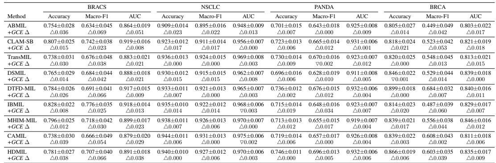
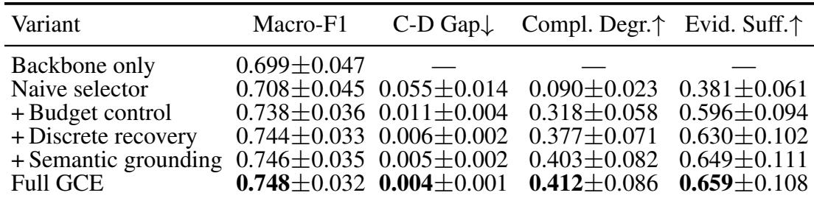
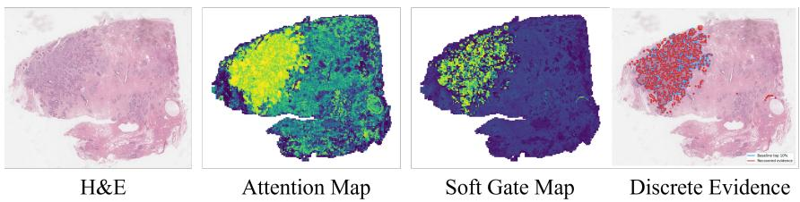
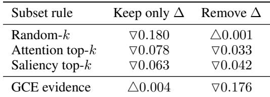
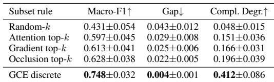

[← 返回 README](../README.md)

> 💡 **claude 批注｜本节预览**: 9 backbone × 9 dataset 的 81 配置主要支撑预测主结果；Table 8 的证据诊断只覆盖三个分类集，组件/预算与同预算实验主要在 BRACS，encoder 泛化仅 BRACS/LUAD，CAMELYON-16 另作独立定位检查。各证据范围不能合并成“81 配置全量验证”。

# 5 Experiments

## 5.1 Setup

Datasets. The evaluation covers 9 datasets spanning two tasks: 4 classification benchmarks (BRACS, PANDA, TCGA-BRCA, TCGA-NSCLC) and 5 survival cohorts (TCGA-LUAD, STAD, UCEC, KIRP, KIRC). These datasets cover diverse tissue types, label granularities (7-class fine-grained to binary subtyping), and bag sizes (hundreds to tens of thousands of patches). Dataset details are provided in Appendix K.

Backbones. GCE-MIL is attached to 9 host backbones spanning the major MIL families: attention-based (ABMIL [Ilse et al., 2018], CLAM-SB [Lu et al., 2021], IBMIL [Lin et al., 2023]), transformer-based (TransMIL [Shao et al., 2021]), dual-stream (DSMIL [Li et al., 2021]), pseudo-bag (DTFD-MIL [Zhang et al., 2022]), hard-mining (MHIM-MIL [Tang et al., 2023]), context-aware (CAMIL [Fourkioti et al., 2024]), and hierarchical (HDMIL [Dong et al., 2025]). This 9 × 9 grid (81 configurations) tests whether GCE generalizes across backbone architectures and dataset characteristics. All training and evaluation protocol details are provided in Appendix J.

*Table 2: Classification performance on four histopathology benchmarks (5-fold cross-validation). Baseline rows report absolute mean±std; +GCE rows report the change from the immediately preceding baseline using triangle markers.*

> 💡 **claude 批注｜表 2 批读**: 分类主表覆盖 4 个数据集 × 9 个骨干。最强增益集中在 BRACS：ABMIL Macro-F1 +0.069、HDMIL +0.066；NSCLC/PANDA 多数增益接近零，说明 GCE 的任务收益并非普遍大幅提升。对 evidence claim，主表只能证明 wrapper 没明显破坏 prediction，不能替代干预表。

## 5.2 Main Classification Results

Table 2 reports the classification half of the $9 \times 9$ benchmark; the survival half is reported in Appendix Table 12. The central question is whether optimizing evidence quality changes slide-level prediction, or merely reshuffles which patches are selected without affecting accuracy. GCE gives positive Macro-F1 changes on most backbone-dataset pairs, with the largest gains on the most challenging dataset (BRACS, 7-class fine-grained classification). On BRACS, ABMIL improves from 0.634 to 0.703 Macro-F1 (+6.9 points), HDMIL from 0.707 to 0.773 (+6.6 points), and IBMIL from 0.776 to 0.801 (+2.5 points). The gains are smaller on easier datasets (NSCLC, binary subtyping) where baselines already achieve > 0.90 Macro-F1, consistent with the expectation that evidence optimization matters most when the classification task requires integrating multiple diagnostic concepts. On PANDA, GCE preserves performance (HDMIL: 0.696 → 0.701) while compacting evidence to ∼ 5% of patches. On BRCA, the hardest binary task, CLAM-SB improves from 0.523 to 0.576 and MHIM-MIL from 0.556 to 0.600.

## 5.3 Ablation Study

Table 3 isolates the contribution of each component. A naive selector leaves a large C-D gap (0.055) and weak complement degradation (0.090); adding budget control, recovery, and grounding progressively yields the full GCE result: 0.748 Macro-F1, 0.004 C-D gap, and 0.412 complement degradation.

*Table 3: Component ablation on BRACS. Each row adds one module to the pipeline.*

> 💡 **claude 批注｜表 3 消融解读**: naive selector 的 C-D gap/degradation 为 0.055/0.090；budget-only 为 0.011/0.318；discrete recovery 为 0.006/0.377；semantic grounding 的相邻变化是 degradation 0.377→0.403；Full GCE 为 0.004/0.412。不能把 budget-only 的 0.318 与 semantic row 的 0.403 之差全归因于 grounding；逐项累加设计也没有完全分离组件交互。

The ablation also separates the three S/N/R mechanisms. Budget control gives the first large improvement: the gap falls from 0.055 to 0.011 and complement degradation rises from 0.090 to 0.318, consistent with the claim that sparse evidence must carry more of the decision. Discrete recovery contributes mainly to Recoverability $( 0 . 0 1 1  0 . 0 0 6 )$ , while semantic grounding contributes mainly to Necessity (0.377 → 0.403), showing that anchor coverage is not merely a parameter increase but changes which patches are treated as decision-critical.

  
*Figure 3: Main qualitative evidence example. The host attention map and the recovered GCE evidence subset are shown on the same slide. GCE selects a compact, recoverable evidence set rather than simply visualizing the original attention ranking.*

> 💡 **claude 批注｜图 3 批读**: 同一 slide 上对齐 host attention 与 recovered GCE subset，直观看到“扩散排名”与“稀疏离散证据”的区别；它是行为 sanity check，不足以证明组织学正确性，定量依据仍是 Table 4/5 的干预与 CAMELYON-16 定位。

*Table 4: Intervention diagnostic. Values are changes relative to the full-bag score averaged over the nine-dataset benchmark.*

> 💡 **claude 批注｜表 4 干预解读**: 同一 evidence budget 下，GCE keep-only 相对全包为 +0.004，attention top-k 为 −0.078；删除 GCE 证据导致 −0.176，删除 attention 仅 −0.033。前一列直接测 Sufficiency，后一列测 Necessity；两列必须成对看，才能排除“选太多”和“补集冗余”的混淆。

*Table 5: Same-budget evidence comparison on BRACS. All subset rules select approximately 5% of patches.*

> 💡 **claude 批注｜表 5 同预算控制**: 把 random、attention、gradient、occlusion 与 GCE 都锁在约 5% patch，GCE discrete 达到 Macro-F1 0.748、gap 0.004、complement degradation 0.412；attention 为 0.597/0.029/0.151。ReadySlide 最值得复用的是这种 selector–consumer–budget 三者固定后的矩阵比较。

## 5.4 Qualitative Evidence Behavior

Figure 3 places the learned evidence mask next to the host attention map. The qualitative pattern matches the intervention diagnostics: attention highlights broad high-score regions, while GCE recovers a compact subset that remains spatially coherent after thresholding and repair. This figure is included in the main text because it clarifies what the S/N/R metrics measure at the slide level.

## 5.5 Intervention and Budget-Matched Evidence

Table 4 reports the direct intervention diagnostic for Sufficiency and Necessity. Keeping attention top-k changes the full-bag score by ▽0.078, whereas keeping GCE evidence changes it by only △0.004; removing attention changes the score by ▽0.033, but removing GCE evidence causes a ▽0.176 drop. Table 5 controls for evidence size by forcing all subset rules to select approximately 5% of each BRACS bag. At the same budget, attention top-k reaches 0.597 Macro-F1 and 0.151 complement degradation, whereas discrete GCE reaches 0.748 and 0.412; the prediction gap falls from 0.029 to 0.004. The gains therefore do not come from selecting more tissue, but from recovering a subset that is sufficient, necessary, and discrete-faithful.

> 💡 **claude 批注｜本节小结**: 主结果证明预测效用基本保持，Table 3 把组件接回三类 failure，Table 4/5 用 keep/remove 与同预算协议证明证据改进；仍需谨慎的是多数证据指标来自模型自身输出，真实病理因果只由 CAMELYON 定位作有限外部验证。
