[← 返回 README](../README.md)

> 💡 **claude 批注｜本节预览**: 本文件保留完整参考文献与附录 A–M；重点包括理论适用边界、S/N/R 操作协议、稳定性、跨任务泛化、失败审计、成本与复现设置。

# References

David Alvarez Melis and Tommi Jaakkola. Towards robust interpretability with self-explaining neural networks. Advances in neural information processing systems, 31, 2018.

Peter Bandi, Oscar Geessink, Quirine Manson, Marcory Van Dijk, Maschenka Balkenhol, Meyke Hermsen, Babak Ehteshami Bejnordi, Byungjae Lee, Kyunghyun Paeng, Aoxiao Zhong, et al. From detection of individual metastases to classification of lymph node status at the patient level: the camelyon17 challenge. IEEE transactions on medical imaging, 38(2):550–560, 2018.

Nadia Brancati, Anna Maria Anniciello, Pushpak Pati, Daniel Riccio, Giosuè Scognamiglio, Guillaume Jaume, Giuseppe De Pietro, Maurizio Di Bonito, Antonio Foncubierta, Gerardo Botti, et al. Bracs: A dataset for breast carcinoma subtyping in h&e histology images. Database, 2022: baac093, 2022.

Wouter Bulten, Kimmo Kartasalo, Po-Hsuan Cameron Chen, Peter Ström, Hans Pinckaers, Kunal Nagpal, Yuannan Cai, David F Steiner, Hester Van Boven, Robert Vink, et al. Artificial intelligence for diagnosis and gleason grading of prostate cancer: the panda challenge. Nature medicine, 28(1): 154–163, 2022.

PC Bunch. Free response approach to measurement and characterization of radiographic observer performance. AJR Am J Roentgenol, 130(2):382, 1978.

Zak Buzzard, Konstantin Hemker, Nikola Simidjievski, and Mateja Jamnik. Paths: A hierarchical transformer for efficient whole slide image analysis. arXiv preprint arXiv:2411.18225, 2024.

Gabriele Campanella, Matthew G Hanna, Luke Geneslaw, Allen Miraflor, Vitor Werneck Krauss Silva, Klaus J Busam, Edi Brogi, Victor E Reuter, David S Klimstra, and Thomas J Fuchs. Clinical-grade computational pathology using weakly supervised deep learning on whole slide images. Nature medicine, 25(8):1301–1309, 2019.

Mathilde Caron, Hugo Touvron, Ishan Misra, Hervé Jégou, Julien Mairal, Piotr Bojanowski, and Armand Joulin. Emerging properties in self-supervised vision transformers. In Proceedings ofthe IEEE/CVF international conference on computer vision, pages 9650–9660, 2021.

Chaofan Chen, Oscar Li, Daniel Tao, Alina Barnett, Cynthia Rudin, and Jonathan K Su. This looks like that: deep learning for interpretable image recognition. Advances in neural information processing systems, 32, 2019.

Chi-Long Chen, Chi-Chung Chen, Wei-Hsiang Yu, Szu-Hua Chen, Yu-Chan Chang, Tai-I Hsu, Michael Hsiao, Chao-Yuan Yeh, and Cheng-Yu Chen. An annotation-free whole-slide training approach to pathological classification of lung cancer types using deep learning. Nature communications, 12(1):1193, 2021a.

Jianbo Chen, Le Song, Martin Wainwright, and Michael Jordan. Learning to explain: An informationtheoretic perspective on model interpretation. In International conference on machine learning, pages 883–892. PMLR, 2018.

Richard J Chen, Ming Y Lu, Muhammad Shaban, Chengkuan Chen, Tiffany Y Chen, Drew FK Williamson, and Faisal Mahmood. Whole slide images are 2d point clouds: Context-aware survival prediction using patch-based graph convolutional networks. In International Conference on Medical Image Computing and Computer-Assisted Intervention, pages 339–349. Springer, 2021b.

Richard J Chen, Tong Ding, Ming Y Lu, Drew FK Williamson, Guillaume Jaume, Andrew H Song, Bowen Chen, Andrew Zhang, Daniel Shao, Muhammad Shaban, et al. Towards a general-purpose foundation model for computational pathology. Nature medicine, 30(3):850–862, 2024.

Ting Chen, Simon Kornblith, Mohammad Norouzi, and Geoffrey Hinton. A simple framework for contrastive learning of visual representations. In International conference on machine learning, pages 1597–1607. PmLR, 2020.

Jun Cheng, Yuting Liu, Wei Huang, Wenhui Hong, Lingling Wang, Xiaohui Zhan, Zhi Han, Dong Ni, Kun Huang, and Jie Zhang. Computational image analysis identifies histopathological image features associated with somatic mutations and patient survival in gastric adenocarcinoma. Frontiers in Oncology, 11:623382, 2021.

Thomas M Cover. Elements ofinformation theory. John Wiley & Sons, 1999.

Jay DeYoung, Sarthak Jain, Nazneen Fatema Rajani, Eric Lehman, Caiming Xiong, Richard Socher, and Byron C Wallace. Eraser: A benchmark to evaluate rationalized nlp models. In Proceedings of the 58th annual meeting ofthe associationfor computational linguistics, pages 4443–4458, 2020.

Thomas G Dietterich, Richard H Lathrop, and Tomás Lozano-Pérez. Solving the multiple instance problem with axis-parallel rectangles. Artificial intelligence, 89(1-2):31–71, 1997.

Tong Ding, Sophia J Wagner, Andrew H Song, Richard J Chen, Ming Y Lu, Andrew Zhang, Anurag J Vaidya, Guillaume Jaume, Muhammad Shaban, Ahrong Kim, et al. A multimodal whole-slide foundation model for pathology. Nature Medicine, pages 1–13, 2025.

Jiuyang Dong, Junjun Jiang, Kui Jiang, Jiahan Li, and Yongbing Zhang. Fast and accurate gigapixel pathological image classification with hierarchical distillation multi-instance learning. In Proceedings of the IEEE/CVF Conference on Computer Vision and Pattern Recognition, pages 30818–30828, 2025.

Zhaolong Du, Shasha Mao, Xuequan Lu, Mengnan Qi, Yimeng Zhang, Jing Gu, and Licheng Jiao. Rethinking multiple-instance learning from feature space to probability space. In The Thirteenth International Conference on Learning Representations, 2025.

Babak Ehteshami Bejnordi, Mitko Veta, Paul Johannes van Diest, Bram Van Ginneken, Nico Karssemeijer, Geert Litjens, Jeroen AWM Van Der Laak, CAMELYON16 consortium, Meyke Hermsen, Quirine F Manson, et al. Diagnostic assessment of deep learning algorithms for detection of lymph node metastases in women with breast cancer. Jama, 318(22):2199–2210, 2017.

Ruth C Fong and Andrea Vedaldi. Interpretable explanations of black boxes by meaningful perturbation. In Proceedings of the IEEE international conference on computer vision, pages 3429–3437, 2017.

Olga Fourkioti, Matt De Vries, and Chris Bakal. CAMIL: Context-aware multiple instance learning for cancer detection and subtyping in whole slide images. In The Twelfth International Conference on Learning Representations, 2024. URL https://openreview.net/forum?id=rzBskAEmoc.

Ziyu Guo, Weiqin Zhao, Shujun Wang, and Lequan Yu. Higt: Hierarchical interaction graphtransformer for whole slide image analysis. In International Conference on Medical Image Computing and Computer-Assisted Intervention, pages 755–764. Springer, 2023.

Kaiming He, Xiangyu Zhang, Shaoqing Ren, and Jian Sun. Deep residual learning for image recognition. In Proceedings ofthe IEEE conference on computer vision and pattern recognition, pages 770–778, 2016.

Kaiming He, Haoqi Fan, Yuxin Wu, Saining Xie, and Ross Girshick. Momentum contrast for unsupervised visual representation learning. In Proceedings of the IEEE/CVF conference on computer vision and pattern recognition, pages 9729–9738, 2020.

Geoffrey Hinton, Oriol Vinyals, and Jeff Dean. Distilling the knowledge in a neural network. arXiv preprint arXiv:1503.02531, 2015.

Maximilian Ilse, Jakub Tomczak, and Max Welling. Attention-based deep multiple instance learning. In International conference on machine learning, pages 2127–2136. PMLR, 2018.

Eric Jang, Shixiang Gu, and Ben Poole. Categorical reparameterization with gumbel-softmax. In International Conference on Learning Representations, 2017.

Mingu Kang, Heon Song, Seonwook Park, Donggeun Yoo, and Sérgio Pereira. Benchmarking selfsupervised learning on diverse pathology datasets. In Proceedings of the IEEE/CVF Conference on Computer Vision and Pattern Recognition, pages 3344–3354, 2023.

Saarthak Kapse, Pushpak Pati, Srikar Yellapragada, Srijan Das, Rajarsi R Gupta, Joel Saltz, Dimitris Samaras, and Prateek Prasanna. Gecko: Gigapixel vision-concept contrastive pretraining in histopathology. In Proceedings of the IEEE/CVF International Conference on Computer Vision, pages 20020–20030, 2025.

Been Kim, Martin Wattenberg, Justin Gilmer, Carrie Cai, James Wexler, Fernanda Viegas, et al. Interpretability beyond feature attribution: Quantitative testing with concept activation vectors (tcav). In International conference on machine learning, pages 2668–2677. PMLR, 2018.

Diederik P Kingma and Jimmy Ba. Adam: A method for stochastic optimization. arXiv preprint arXiv:1412.6980, 2014.

Pang Wei Koh, Thao Nguyen, Yew Siang Tang, Stephen Mussmann, Emma Pierson, Been Kim, and Percy Liang. Concept bottleneck models. In International conference on machine learning, pages 5338–5348. PMLR, 2020.

Oren Z Kraus, Jimmy Lei Ba, and Brendan J Frey. Classifying and segmenting microscopy images with deep multiple instance learning. Bioinformatics, 32(12):i52–i59, 2016.

Bin Li, Yin Li, and Kevin W Eliceiri. Dual-stream multiple instance learning network for whole slide image classification with self-supervised contrastive learning. In Proceedings ofthe IEEE/CVF conference on computer vision and pattern recognition, pages 14318–14328, 2021.

Jiayun Li, Wenyuan Li, Arkadiusz Gertych, Beatrice S Knudsen, William Speier, and Corey W Arnold. An attention-based multi-resolution model for prostate whole slide imageclassification and localization. arXiv preprint arXiv:1905.13208, 2019.

Tiancheng Lin, Zhimiao Yu, Hongyu Hu, Yi Xu, and Chang-Wen Chen. Interventional bag multiinstance learning on whole-slide pathological images. In Proceedings of the IEEE/CVF conference on computer vision and pattern recognition, pages 19830–19839, 2023.

Christos Louizos, Max Welling, and Diederik P Kingma. Learning sparse neural networks through l\_0 regularization. In International Conference on Learning Representations, 2018.

Ming Y Lu, Drew FK Williamson, Tiffany Y Chen, Richard J Chen, Matteo Barbieri, and Faisal Mahmood. Data-efficient and weakly supervised computational pathology on whole-slide images. Nature biomedical engineering, 5(6):555–570, 2021.

Ming Y Lu, Bowen Chen, Andrew Zhang, Drew FK Williamson, Richard J Chen, Tong Ding, Long Phi Le, Yung-Sung Chuang, and Faisal Mahmood. Visual language pretrained multiple instance zero-shot transfer for histopathology images. In Proceedings ofthe IEEE/CVF conference on computer vision and pattern recognition, pages 19764–19775, 2023.

C Maddison, A Mnih, and Y Teh. The concrete distribution: A continuous relaxation of discrete random variables. In Proceedings of the international conference on learning Representations. International Conference on Learning Representations, 2017.

Oded Maron and Tomás Lozano-Pérez. A framework for multiple-instance learning. Advances in neural information processing systems, 10, 1997.

Andre Martins and Ramon Astudillo. From softmax to sparsemax: A sparse model of attention and multi-label classification. In International conference on machine learning, pages 1614–1623. PMLR, 2016.

Harold Miller. The froc curve: A representation of the observer’s performance for the method of free response. The Journal of the Acoustical Society of America, 46(6B):1473–1476, 1969.

George L Nemhauser, Laurence A Wolsey, and Marshall L Fisher. An analysis of approximations for maximizing submodular set functions—i. Mathematical programming, 14(1):265–294, 1978.

Maxime Oquab, Timothée Darcet, Théo Moutakanni, Huy Vo, Marc Szafraniec, Vasil Khalidov, Pierre Fernandez, Daniel Haziza, Francisco Massa, Alaaeldin El-Nouby, et al. Dinov2: Learning robust visual features without supervision. Transactions on Machine Learning Research Journal, 2024.

Liron Pantanowitz, Paul N Valenstein, Andrew J Evans, Keith J Kaplan, John D Pfeifer, David C Wilbur, Laura C Collins, and Terence J Colgan. Review of the current state of whole slide imaging in pathology. Journal of pathology informatics, 2(1):36, 2011.

Vitali Petsiuk, Abir Das, and Kate Saenko. Rise: Randomized input sampling for explanation of black-box models. In Proceedings ofthe British Machine Vision Conference (BMVC), 2018.

Linhao Qu, Yingfan Ma, Xiaoyuan Luo, Qinhao Guo, Manning Wang, and Zhijian Song. Rethinking multiple instance learning for whole slide image classification: A good instance classifier is all you need. IEEE Transactions on Circuits and Systems for Video Technology, 34(10):9732–9744, 2024.

Olga Russakovsky, Jia Deng, Hao Su, Jonathan Krause, Sanjeev Satheesh, Sean Ma, Zhiheng Huang, Andrej Karpathy, Aditya Khosla, Michael Bernstein, et al. Imagenet large scale visual recognition challenge. International journal of computer vision, 115(3):211–252, 2015.

Claude Elwood Shannon. A mathematical theory of communication. The Bell system technical journal, 27(3):379–423, 1948.

Daniel Shao, Richard J Chen, Andrew H Song, Joel Runevic, Ming Y Lu, Tong Ding, and Faisal Mahmood. Do multiple instance learning models transfer? Proceedings of Machine Learning Research, 267:54219–54238, 2025.

Zhuchen Shao, Hao Bian, Yang Chen, Yifeng Wang, Jian Zhang, Xiangyang Ji, et al. Transmil: Transformer based correlated multiple instance learning for whole slide image classification. Advances in neural information processing systems, 34:2136–2147, 2021.

Karen Simonyan, Andrea Vedaldi, and Andrew Zisserman. Deep inside convolutional networks: Visualising image classification models and saliency maps. arXiv preprint arXiv:1312.6034, 2013.

Andrew H Song, Guillaume Jaume, Drew FK Williamson, Ming Y Lu, Anurag Vaidya, Tiffany R Miller, and Faisal Mahmood. Artificial intelligence for digital and computational pathology. Nature Reviews Bioengineering, 1(12):930–949, 2023.

Nitish Srivastava, Geoffrey Hinton, Alex Krizhevsky, Ilya Sutskever, and Ruslan Salakhutdinov. Dropout: a simple way to prevent neural networks from overfitting. The journal of machine learning research, 15(1):1929–1958, 2014.

Mukund Sundararajan, Ankur Taly, and Qiqi Yan. Axiomatic attribution for deep networks. In International conference on machine learning, pages 3319–3328. PMLR, 2017.

Wenhao Tang, Sheng Huang, Xiaoxian Zhang, Fengtao Zhou, Yi Zhang, and Bo Liu. Multiple instance learning framework with masked hard instance mining for whole slide image classification. In Proceedings of the IEEE/CVF international conference on computer vision, pages 4078–4087, 2023.

Antti Tarvainen and Harri Valpola. Mean teachers are better role models: Weight-averaged consistency targets improve semi-supervised deep learning results. Advances in neural information processing systems, 30, 2017.

Paul Tourniaire, Marius Ilie, Paul Hofman, Nicholas Ayache, and Hervé Delingette. Ms-clam: Mixed supervision for the classification and localization of tumors in whole slide images. Medical Image Analysis, 85:102763, 2023.

Constantino Tsallis. Possible generalization of boltzmann-gibbs statistics. Journal of statistical physics, 52(1):479–487, 1988.

Laurens Van der Maaten and Geoffrey Hinton. Visualizing data using t-sne. Journal of machine learning research, 9(11), 2008.

Gregory Verghese, Jochen K Lennerz, Danny Ruta, Wen Ng, Selvam Thavaraj, Kalliopi P Siziopikou, Threnesan Naidoo, Swapnil Rane, Roberto Salgado, Sarah E Pinder, et al. Computational pathology in cancer diagnosis, prognosis, and prediction–present day and prospects. The Journal of pathology, 260(5):551–563, 2023.

Xi Wang, Hao Chen, Caixia Gan, Huangjing Lin, Qi Dou, Efstratios Tsougenis, Qitao Huang, Muyan Cai, and Pheng-Ann Heng. Weakly supervised deep learning for whole slide lung cancer image analysis. IEEE transactions on cybernetics, 50(9):3950–3962, 2019.

John N Weinstein, Eric A Collisson, Gordon B Mills, Kenna R Shaw, Brad A Ozenberger, Kyle Ellrott, Ilya Shmulevich, Chris Sander, and Joshua M Stuart. The cancer genome atlas pan-cancer analysis project. Nature genetics, 45(10):1113–1120, 2013.

Yunyang Xiong, Zhanpeng Zeng, Rudrasis Chakraborty, Mingxing Tan, Glenn Fung, Yin Li, and Vikas Singh. Nyströmformer: A nyström-based algorithm for approximating self-attention. In Proceedings of the AAAI conference on artificial intelligence, volume 35, pages 14138–14148, 2021.

Yan Xu, Jun-Yan Zhu, I Eric, Chao Chang, Maode Lai, and Zhuowen Tu. Weakly supervised histopathology cancer image segmentation and classification. Medical image analysis, 18(3): 591–604, 2014.

Shu Yang, Yihui Wang, and Hao Chen. Mambamil: Enhancing long sequence modeling with sequence reordering in computational pathology. In International conference on medical image computing and computer-assisted intervention, pages 296–306. Springer, 2024.

Jiawen Yao, Xinliang Zhu, Jitendra Jonnagaddala, Nicholas Hawkins, and Junzhou Huang. Whole slide images based cancer survival prediction using attention guided deep multiple instance learning networks. Medical image analysis, 65:101789, 2020.

Linfeng Ye, Shayan Mohajer Hamidi, Zhixiang Chi, Guang Li, Mert Pilanci, Takahiro Ogawa, Miki Haseyama, and Konstantinos N Plataniotis. Asmil: Attention-stabilized multiple instance learning for whole slide imaging. arXiv preprint arXiv:2603.06658, 2026.

Jinsung Yoon, James Jordon, and Mihaela Van der Schaar. Invase: Instance-wise variable selection using neural networks. In International conference on learning representations, 2018.

Matthew D Zeiler and Rob Fergus. Visualizing and understanding convolutional networks. In European conference on computer vision, pages 818–833. Springer, 2014.

Hongrun Zhang, Yanda Meng, Yitian Zhao, Yihong Qiao, Xiaoyun Yang, Sarah E Coupland, and Yalin Zheng. Dtfd-mil: Double-tier feature distillation multiple instance learning for histopathology whole slide image classification. In Proceedings ofthe IEEE/CVF conference on computer vision and pattern recognition, pages 18802–18812, 2022.

Yunlong Zhang, Honglin Li, Yunxuan Sun, Sunyi Zheng, Chenglu Zhu, and Lin Yang. Attentionchallenging multiple instance learning for whole slide image classification. In European conference on computer vision, pages 125–143. Springer, 2024.

Yunlong Zhang, Honglin Li, Yuxuan Sun, Zhongyi Shui, Jingxiong Li, Chenglu Zhu, and Lin Yang. Aem: attention entropy maximization for multiple instance learning based whole slide image classification. In International Conference on Medical Image Computing and Computer-Assisted Intervention, pages 45–55. Springer, 2025.

## A Overview

This appendix provides the theoretical, experimental, and implementation details that complement the main paper. We first state the scope of the theoretical claims and derive the coverage-level properties of noisy-OR recovery in Appendix B. We then give the detailed discrete recovery algorithm in Appendix C, followed by additional evidence diagnostics and baseline comparisons in Appendix D. Appendix E reports the survival prediction results and explains how the same coverage view extends to Cox risk modeling. Appendix F presents CAMELYON-16 localization and significance tests, while Appendix G expands the ablation and sensitivity analyses. Appendix H reports multi-backbone and multi-encoder generalization, and Appendix I summarizes the failure-case audit. Finally, Appendix J provides hardware, training, anchor-prompt, and computational-cost details; Appendix K describes datasets and preprocessing; Appendix L collects additional visualizations; and Appendix M discusses limitations and broader implications.

## B Theoretical Foundation and Notes

Scope of theory. The results in this appendix are coverage-level statements about the noisy-OR utility, not claims of global classifier optimality. Submodularity justifies the marginal-gain recovery objective under fixed anchor responses, while the conditional interventional bound explains when uncovered anchor mass can upper-bound omitted representation contribution. Classifier-level faithfulness is therefore evaluated empirically through keep/remove interventions and, separately, through CAMELYON-16 localization against pixel-level annotations.

> 💡 **claude 批注｜理论边界**: 次模性与 $(1-1/e)$ 类保证只针对固定 anchor response 下的 coverage utility，不保证所选 patch 是全局最优分类子集，更不保证临床因果。论文把这一缺口交给 keep/remove 与 CAMELYON 定位实证，这个边界在复用 GCE 时必须保留。

## B.1 Coverage as an Interventional Proxy

Noisy-OR is used as a differentiable proxy for intervention search rather than as the definition of evidence faithfulness. The target quantity is the intervention variation $V ( S ) = \| f ( X ) - f ( X _ { S } ) \|$ which is expensive to optimize directly over discrete subsets. The following proposition states the assumption under which uncovered anchor mass controls this variation.

Proposition 3 (Coverage residual bounds representation variation). Let a MIL predictor decompose as $f ( { \bar { X } } ) = q ( g ( X ) )$ , where q is $L _ { q } – L i p s c h i t z$ and the bag representation is additive, $\begin{array} { r } { g ( X ) = \sum _ { i } w _ { i } h _ { i } } \end{array}$ with $w _ { i } \geq 0 .$ . Assume the anchor bank is η-complete for the omitted patch contribution: for any subset S,

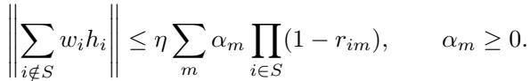

*公式 7：MinerU 从论文原页提取的行间公式。*

> 💡 **claude 批注｜公式 7 批读**: 这是 Proposition 3 的锚点完备性假设：被子集 $S$ 遗漏的加权表示范数，要能被未覆盖 anchor mass 乘 $\eta$ 上界。它不是由模型训练自动保证的结论；若锚点漏掉罕见形态，后续 coverage 与干预变化之间的理论桥梁就会失效。

Then

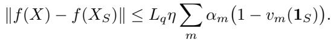

*公式 8：MinerU 从论文原页提取的行间公式。*

> 💡 **claude 批注｜公式 8 批读**: 在分类头 $q$ 为 $L_q$-Lipschitz 且 Equation 7 的锚点完备性成立时，full bag 与 evidence-only bag 的输出差由未覆盖 noisy-OR mass 上界。该式只解释 coverage 为什么可做代理目标，不把低 coverage residual 直接等同于临床因果。

Proof. By Lipschitz continuity, $\| f ( X ) - f ( X _ { S } ) \| \leq L _ { q } \| g ( X ) - g ( X _ { S } ) \|$ . For the additive representation, $\begin{array} { r } { g ( X ) - g ( X _ { S } ) = \sum _ { i \notin S } w _ { i } h _ { i } } \end{array}$ . Applying the anchor-completeness assumption gives the stated bound, and $\begin{array} { r } { 1 - v _ { m } ( \mathbf { 1 } _ { S } ) = \prod _ { i \in S } ( 1 - r _ { i m } ) } \end{array}$ by the noisy-OR definition. □

Proposition 3 is intentionally conditional. It does not claim that anchors perfectly explain every backbone; instead, it states what the noisy-OR objective is approximating when anchors cover the residual directions relevant to the host predictor. Direct keep-only and remove interventions are therefore still reported: the bound motivates the proxy, while the interventions test whether the proxy actually tracks prediction changes.

## B.2 Independence of S/N/R Criteria

Sufficiency, Necessity, and Recoverability are separate desiderata rather than three names for the same intervention score. The following proposition formalizes why all three diagnostics are reported.

Proposition 4 (S/N/R are logically independent). For a fixed model class, none of Sufficiency, Necessity, and Recoverability implies either of the other two in general.

Proof sketch. A selector that returns the whole bag is sufficient but not necessary, because its complement is empty or uninformative. A selector that returns one of several redundant diagnostic regions can be sufficient but not necessary, because the complement still contains another sufficient region. A selector can be necessary but not sufficient when the model relies on an interaction between the selected region and contextual tissue outside the subset. Finally, a continuous gate can be recoverable under thresholding while the resulting discrete subset is neither sufficient nor necessary, for example when the gate is stable but selects background or redundant tissue. Conversely, sufficient or necessary subsets can be generated by gates with many values near the threshold, making them poorly recoverable even when the intervention property holds. These constructions are model-relative and do not rely on a particular backbone. □

> 💡 **claude 批注｜命题示例校正**: 这段“whole bag sufficient but not necessary”的例子与 Definition 2 的绝对差阈值不一致：当 $S=X$ 时，删除后为空袋或无信息，通常会使 $|f(X_{\neg S})-f(X)|$ 很大，从而通过 Necessity。整包还可在全 1 门控下通过 Recoverability；因此不能用 Necessity 排除整包，紧凑性必须由 budget/cardinality 单独保证。命题的独立性可由后续冗余子集、上下文交互和阈值不稳定等例子支持，但首个整包反例不成立。

## B.3 Recoverability Bound for Thresholded Gates

Recoverability is evaluated by comparing the continuous gated input with its thresholded subset. Let $F _ { X } ( \pi )$ denote the prediction of a fixed trained MIL model on slide X after applying gate vector π to the bag, and let $S _ { \tau } ( \pi ) = \{ i : \pi _ { i } \geq \tau \}$

> 💡 **claude 批注｜形式对象与实测对象**: 本节 Proposition 5 的离散对象是纯阈值 $S_\tau(\pi)$。GCE 实验报告的 C-D gap 则按 discrete recovery protocol 使用 repair 后的 $S^*$；这个操作差异必须显式记录，否则会把 gate-margin bound 与 Algorithm 1 的覆盖修复混成同一保证。

Proposition 5 (Gate-margin recoverability bound). If $F _ { X }$ is $L _ { X }$ -Lipschitz in the gate vector under norm $\| \cdot \| ,$ then

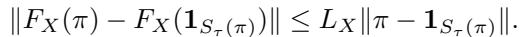

*公式 9：MinerU 从论文原页提取的行间公式。*

> 💡 **claude 批注｜公式 9 批读**: Recoverability bound 把连续门控预测与阈值集合预测的差，约束为 $L_X$ 乘软门控 $\pi$ 到二值向量的距离。温度退火减少右侧距离，解释 C-D gap 下降；它并不判断二值集合是否充分或必要。

In particular, if every gate satisfies min<sub>i</sub> $| \pi _ { i } - \tau | \geq m a n d \pi _ { i } \in [ 0 , 1 ]$ , the bound tightens as annealing drives gates toward {0, 1} and away from the threshold.

Proof. The inequality follows directly from Lipschitz continuity of $F _ { X }$ with respect to the gate vector. Temperature annealing affects the right-hand side by reducing the distance between the continuous gate and the thresholded binary gate. The proposition therefore explains the role of annealing in reducing the C-D gap, but it does not assert that the recovered subset is clinically causal evidence.

## B.4 Why Noisy-OR

Noisy-OR is a natural coverage model when multiple independent evidence sources can activate the same latent concept. For WSI evidence, this matches the setting where several patches may each support gland formation, necrosis, or inflammatory response. Unlike mean pooling, noisy-OR saturates when a concept is already covered; unlike attention, it does not force concepts to compete through a simplex. This saturation behavior is important for Necessity: once an anchor is covered, adding another redundant patch has lower marginal gain, so greedy recovery is biased toward complementary evidence.

For a monotone submodular utility U, the total curvature is

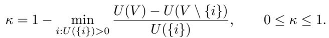

*公式 10：MinerU 从论文原页提取的行间公式。*

> 💡 **claude 批注｜公式 10 批读**: 总曲率 $\kappa$ 衡量某 patch 的边际收益从单独选择到全集末端还剩多少。对 noisy-OR，anchor response 越冗余，末端边际越小、曲率越高；因此该变量直接量化多源证据中的重复程度。

For noisy-OR coverage, this curvature is determined by anchor-response redundancy: patches whose anchor responses are already covered by other selected patches have lower late-stage marginal gain. Under the same cardinality-limited coverage setting used for greedy repair, the standard greedy guarantee can therefore be sharpened to the curvature-aware form

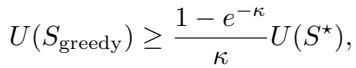

*公式 11：MinerU 从论文原页提取的行间公式。*

> 💡 **claude 批注｜公式 11 批读**: 曲率感知保证把标准 greedy 的覆盖近似细化为 $(1-e^{-\kappa})/\kappa$。保证对象仍是固定 response 下的 coverage utility，而不是 host classifier 在任意干预后的全局最优 patch 集合。

with the convention that the factor equals 1 when $\kappa = 0$ . This does not change the coverage-level scope of the theorem, but it clarifies why greedy repair is most effective when the selected patches cover complementary anchors rather than redundant copies of the same morphology.

## B.5 Risk-Pathway Interpretation for Survival

For survival tasks, GCE-MIL uses the same selector and coverage utility but trains the slide output as a scalar Cox risk score. The noisy-OR term has a compatible interpretation if each anchor is viewed as a latent risk pathway. Let $z _ { m } ( X )$ denote whether pathway m is present somewhere in the slide, and let $r _ { i m }$ be the probability that patch i expresses that pathway. Under conditional independence of pathway evidence across selected patches,

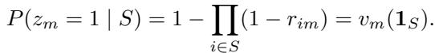

*公式 12：MinerU 从论文原页提取的行间公式。*

> 💡 **claude 批注｜公式 12 批读**: 生存任务把每个 anchor 解释为潜在风险 pathway；选中集合 $S$ 对 pathway $m$ 的激活概率仍用 noisy-OR $v_m$。这让分类与 survival 共享 selector/coverage，而无需把生存时间离散化。

A Cox-style log-risk model can then be written as

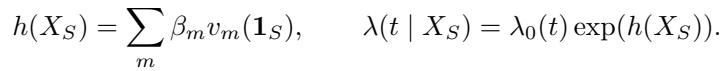

*公式 13：MinerU 从论文原页提取的行间公式。*

> 💡 **claude 批注｜公式 13 批读**: Cox 分支用 $\beta_m v_m$ 的和形成 log-risk，再经基线风险 $\lambda_0(t)$ 得到 hazard。一个已覆盖形态的重复 patch 边际风险贡献饱和，不同 anchor pathway 仍可叠加；这只是标量风险解释，不是 competing-risks 模型。

This mapping does not turn the method into a full competing-risks model; it only explains why the same saturating coverage form is reasonable for scalar risk prediction. Once a high-risk morphology is already covered, additional patches showing the same morphology have diminishing marginal effect on the log-risk, whereas a patch activating a different risk pathway can still change the risk score.

## B.6 Sufficiency-Necessity Duality for MIL Classifiers

Sufficiency and Necessity are complementary but not equivalent. A subset can preserve the prediction when kept while still being redundant with other evidence in the complement. Conversely, a subset can be necessary when removed but insufficient on its own if it interacts with context. GCE-MIL therefore reports both keep-only and remove interventions.

## B.7 Recoverability under Temperature Annealing

Recoverability depends on the gap between the continuous selector and the thresholded subset. Temperature annealing encourages π<sub>i</sub> values to move toward 0 or 1, reducing ambiguity near the threshold. Greedy repair then corrects residual coverage failures after thresholding. The empirical counterpart is the C-D gap: selector and grounding ablations that leave many gates near the threshold produce larger gaps, while the final model reduces the gap to 0.004–0.005 in the main diagnostics.

> 💡 **claude 批注｜可恢复性实测范围**: 退火首先改善纯阈值 $S(\pi)$ 的 gate margin，repair 随后只修复 anchor coverage。最终 0.004–0.005 的 GCE C-D gap 对应 $S^*$ 而非未经修复的 $S(\pi)$，也不表示 Algorithm 1 在循环中验证了 classifier prediction sufficiency。

## C Detailed Recovery Algorithm

Algorithm 1 gives the discrete recovery procedure used at inference. It first thresholds the continuous gate π and then greedily repairs coverage failures using the exact noisy-OR marginal. The main method section therefore remains focused on the S/N/R design while the full implementation detail is provided here. The key implementation choice is that repair ranks candidates by the exact marginal of the same noisy-OR utility used during training. Thus the discrete subset is not a separate heuristic explanation; it is the hard recovery of the trained continuous evidence objective.

```perl
Algorithm 1: GCE-MIL Discrete Recovery
Input: continuous gates π, anchor responses r, coverage target $c = 0 . 9 5$
Output: discrete subset $S ^ { * }$
1 $S \gets \{ i : \pi _ { i } \gt 0 . 5 \}$ ;
2 if $S = \emptyset$ then
3 S ← {arg ma $\mathrm { x } _ { i } \pi _ { i } \}$ ;
4 while min<sub>m</sub> $v _ { m } ( \mathbf { 1 } _ { S } ) \lt c$ do
5 i<sup>⋆</sup> ← arg max<sub>i/∈S</sub> $\partial U _ { c } ( { \bf 1 } _ { S } ) / \partial \pi _ { i } ;$
6 $S \gets S \cup \{ i ^ { \star } \} ;$
7 return $S ^ { * } = S ;$
```

> 💡 **claude 批注｜Algorithm 1 停止条件**: while loop 唯一检查的是最弱 anchor coverage 是否达到 $c=0.95$；每步只最大化 noisy-OR coverage marginal。算法没有调用 host classifier，也没有 keep-only prediction check，所以它恢复的是 anchor coverage，不是 prediction sufficiency。Sufficiency 只能在算法结束后用独立干预指标评估。

## D Evidence Diagnostics and Baseline Comparisons

Table 6 defines the operational diagnostics used throughout the evidence experiments. Let $\Phi ( \cdot )$ denote the intervention output compared within a slide (class probability for classification, normalized risk for survival), and let $M ( \cdot )$ denote the aggregate task metric (Macro-F1 or C-index) evaluated after replacing the full bag by the specified subset.

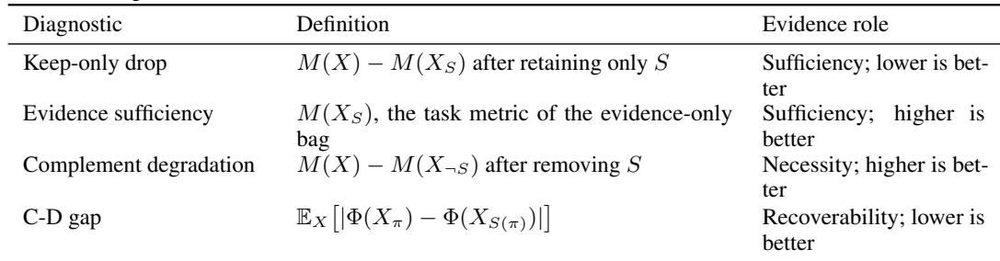

*Table 6: Operational S/N/R diagnostics. The C-D gap is an optimization-aligned recoverability diagnostic; keep/remove interventions and CAMELYON localization provide additional modelrelative and spatial checks.*

> 💡 **claude 批注｜表 6 操作定义**: Sufficiency 同时报告 evidence-only 任务指标与相对全包的 keep-only drop；Necessity 用删除 $S$ 后的 complement degradation。形式 Recoverability 比较纯阈值 $S(\pi)$，而 GCE 表中的 operational C-D gap 使用 threshold-plus-repair 后 $S^*$。三者都依赖固定 consumer，跨模型比较时不能把不同 consumer 的绝对分数直接当作 selector 质量。

Table 7 provides a compact BRACS diagnostic for the S/N/R metrics. This appendix groups the evidence diagnostics with budget-matched and post-hoc comparisons, so each S/N/R claim is accompanied by the table used to support it. On BRACS, DTFD-MIL+GCE reaches 0.484 complement degradation and HDMIL+GCE has the highest evidence sufficiency (0.685), while the C-D gap remains below 0.012 for every host backbone. This compact table gives single-dataset intuition before the larger three-dataset diagnostic table: different backbones trade off Necessity and Sufficiency, but all recovered subsets remain close to their continuous selectors.

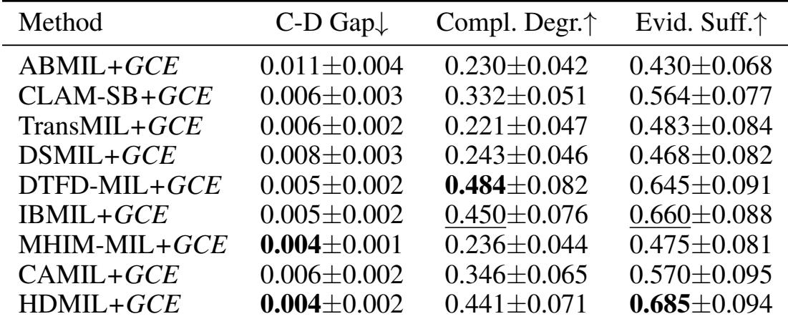

*Table 7: BRACS evidence diagnostics. Single-column S/N/R summary for GCE-wrapped backbones.*

> 💡 **claude 批注｜表 7 批读**: BRACS 上所有 GCE-wrapped host 的 C-D gap 都低于 0.012；DTFD-MIL+GCE 的 complement degradation 达 0.484，HDMIL+GCE 的 evidence sufficiency 达 0.685。不同 host 在 Necessity 与 Sufficiency 上取舍不同，但 Recoverability 都显著优于原 attention。

Table 8 reports the three S/N/R metrics for each backbone after GCE training and discrete recovery. The C-D gap is an optimization-aligned recoverability diagnostic: HDMIL achieves 0.004 on BRACS and 0.002 on NSCLC, indicating that the continuous selector and recovered discrete subset remain close under the reported recovery protocol. Complement degradation (Necessity) reaches 0.484 for DTFD-MIL on BRACS, meaning removing the evidence subset drops performance by nearly half—the selected patches are genuinely informative. Evidence sufficiency reaches 0.685 for HDMIL on BRACS, indicating that the evidence subset alone retains most of the full-bag prediction. The pattern is consistent across datasets: backbones with stronger attention mechanisms (DTFD-MIL, IBMIL, HDMIL) achieve higher Necessity and Sufficiency scores, suggesting that GCE amplifies the backbone’s existing ability to identify informative patches. The important point is not that one host backbone dominates every metric. Instead, every host receives an explicit evidence interface, allowing S/N/R diagnostics to be compared across architectures that otherwise expose different attention or instance scores.

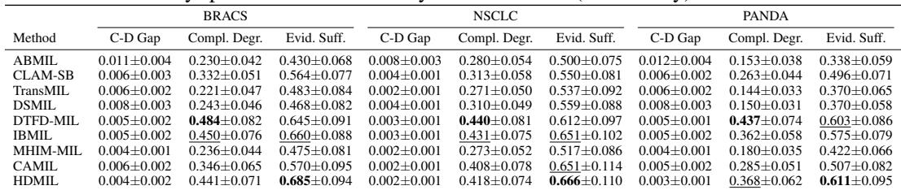

*Table 8: GCE evidence diagnostics per backbone. C-D Gap: continuous–discrete prediction gap (Recoverability); Complement Degradation: performance drop when evidence is removed (Necessity); Evidence Sufficiency: performance retained by evidence alone (Sufficiency).*

> 💡 **claude 批注｜表 8 批读**: 这张表把 BRACS、NSCLC、PANDA 的三项 S/N/R 指标按九个 backbone 展开。C-D gap 大致处于 0.002–0.012，而 complement degradation 与 evidence sufficiency 随 host 明显变化；它证明 wrapper 兼容性，却也证明证据是 consumer-relative，不能据此声称 selector transfer。

## D.1 Same-Budget Comparison

Table 9 compares selection methods under a fixed 5% budget on BRACS. Attention top-k achieves 0.597 Macro-F1 and 0.151 complement degradation; discrete GCE reaches 0.748 and 0.412. The prediction gap drops from 0.029 to 0.004. Under a fixed budget, GCE improves all three S/N/R criteria rather than simply selecting more patches. This is the fairest control for sparse evidence methods because it removes subset size as a confounder. The remaining gap is therefore attributable to how the subset is selected and recovered, not to using more tissue.

## D.2 Stability and Post-hoc Comparison

GCE evidence is more stable than attention under stochastic perturbation: Jaccard overlap between evidence sets across random seeds rises from 0.329 (attention) to 0.606 (GCE), and prediction flips fall from 0.128 to 0.045 (Tables 10 and 11). Compared with post-hoc attribution methods at matched subset sizes, GCE reaches 0.722 keep-only Macro-F1 and 0.176 remove drop, vs. 0.662/0.048 for integrated gradients and 0.668/0.052 for occlusion. The joint training of selection and prediction in GCE produces evidence that is both more faithful and more stable than post-hoc methods.

Table 10 separates two forms of stability. The Jaccard score measures whether the selected evidence set itself is stable, while prediction flip measures whether stochastic perturbations change the slide-level decision.

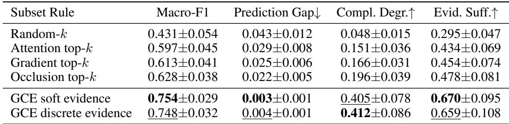

*Table 9: Same-budget comparison on BRACS. All methods select approximately 5% of each bag, except the soft GCE row which uses the continuous selector before discretization.*

> 💡 **claude 批注｜表 9 软硬证据**: GCE soft 与 discrete 的 Macro-F1 为 0.754/0.748，prediction gap 为 0.003/0.004，说明恢复损失很小；但 soft row 不是严格离散 5% 集合，真正部署和展示应以 discrete row 为准。

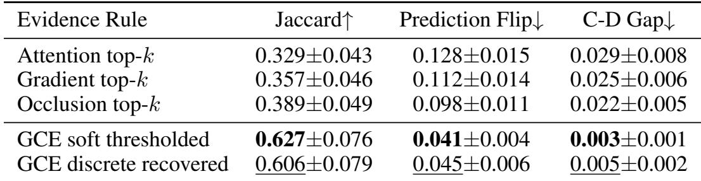

*Table 10: Evidence stability under stochastic perturbation. Jaccard measures overlap between evidence sets across runs.*

> 💡 **claude 批注｜表 10 稳定性**: Recovered GCE 的 Jaccard 0.606、prediction flip 0.045，attention 为 0.329/0.128。稳定性补充了 Recoverability：不仅单次软硬一致，多次随机扰动后集合本身也更一致；但它仍不等于跨 encoder 或跨 consumer 稳定。

GCE improves both: the recovered discrete subset has 0.606 Jaccard overlap and 0.045 prediction flip rate, compared with 0.329 and 0.128 for attention top-k. This directly supports Recoverability because the discrete subset remains close to the continuous selector across stochastic runs.

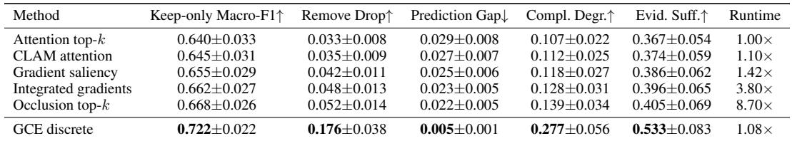

*Table 11: Comparison with post-hoc explainability methods averaged across nine datasets. All methods use the same evidence fraction.*

> 💡 **claude 批注｜表 11 事后方法对照**: GCE discrete 的 keep-only 0.722、remove drop 0.176、runtime 1.08×；occlusion 是 0.668/0.052/8.70×。但表中只固定 evidence fraction：GCE 的 selector 与 predictor 联合训练，gradient/integrated-gradients/occlusion 则解释 fixed predictor，训练制度与可用查询预算不同。因此结果只支持本文设置下的性能/成本差异，不能排除严格 frozen-consumer post-hoc benchmark 的 novelty。

Table 11 shows that post-hoc explanations improve over raw attention but do not close the S/N/R gap. Occlusion reaches 0.668 keep-only Macro-F1 and 0.052 remove drop, whereas GCE reaches 0.722 and 0.176 at comparable subset size. The runtime column also matters: integrated gradients and occlusion require repeated backward or forward passes, while GCE obtains its evidence during the normal model pass. The result is evidence that is both intervention-faithful and cheaper to recover.

## E Survival Prediction and Task Generalization

Table 12 reports the five TCGA survival cohorts evaluated with C-index.

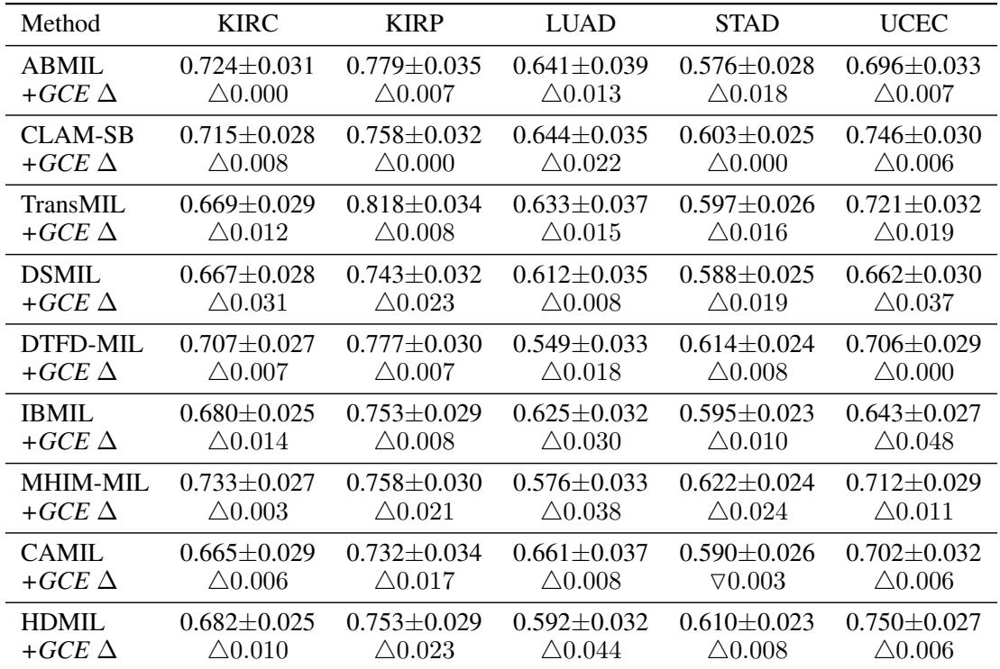

*Table 12: Survival prediction on five TCGA cohorts (C-index, 5-fold cross-validation). Baseline rows report absolute mean±std; +GCE rows report the change from the preceding baseline.*

> 💡 **claude 批注｜表 12 批读**: 五个 TCGA survival cohort 上平均 C-index 提升 0.014；LUAD 的 HDMIL/MHIM-MIL 分别 +0.044/+0.038，UCEC 的 IBMIL/DSMIL 分别 +0.048/+0.037，仅 CAMIL–STAD 为 −0.003。结果支持任务泛化，但 survival 的 S/N/R 仍由同一 risk consumer 定义。

Survival prediction results are reported here to keep the main text focused on the classification benchmark and intervention evidence. GCE improves average C-index by 0.014 across the survival grid, with visible gains on LUAD (HDMIL △0.044, MHIM-MIL △0.038) and UCEC (DSMIL △0.037, IBMIL △0.048). The survival results are consistent with the risk-pathway interpretation in Appendix B: a selected patch subset can activate one or more morphology-linked risk pathways, and the Cox head maps these activations to scalar risk. Evidence-oriented training therefore does not require changing the host backbone and remains useful beyond categorical slide labels. The gains are not uniform across cohorts, which is expected because survival labels are noisier and censoring reduces supervision strength. Nevertheless, the table shows that optimizing S/N/R does not harm risk prediction: only one cell has a small negative change (CAMIL on STAD, ▽0.003), while the remaining cells are non-negative.

## F Localization and Additional Experiments

The experiments in this section provide supporting checks that are not part of the main nine-dataset prediction grid. CAMELYON-16 localization uses pixel-level annotations as an external spatial validation of evidence maps, while the paired tests summarize fold-level uncertainty for the reported prediction gains.

## F.1 Localization on CAMELYON-16

Table 13 reports localization quality on CAMELYON-16 using pixel-level annotations. The comparison evaluates whether evidence gates improve the spatial agreement between model evidence maps and annotated tumor regions. Delta rows are placed immediately below each host backbone to make the effect of adding GCE visible without a separate explanatory table.

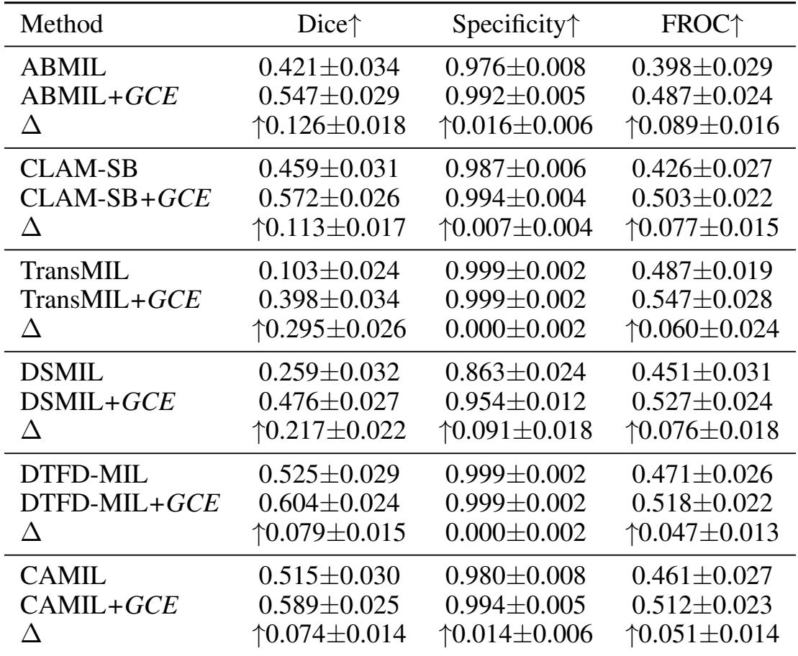

*Table 13: Localization metrics on CAMELYON-16 with pixel-level annotations. Higher Dice, specificity, and FROC indicate better spatial agreement between evidence maps and annotated tumor regions. Delta rows report the gain after adding GCE to the same host backbone.*

> 💡 **claude 批注｜表 13 批读**: CAMELYON-16 提供独立像素标注检查：TransMIL Dice 从 0.103 升到 0.398、FROC 从 0.487 升到 0.547；DTFD-MIL 与 CAMIL 的 Dice 也分别 +0.079/+0.074。它是全文少数连接模型证据与空间真值的实验，但不属于主九数据集矩阵。

The localization results provide an external check on the evidence maps. TransMIL has high specificity and relatively strong baseline FROC (0.487) but poor baseline Dice (0.103), suggesting that its detections are conservative and spatially sparse; adding GCE raises Dice to 0.398 and further improves FROC to 0.547 without reducing specificity. For stronger localization baselines such as DTFD-MIL and CAMIL, GCE still increases Dice by 0.079 and 0.074, respectively. These gains suggest that anchor-grounded recovery improves spatial alignment rather than simply selecting more tissue.

## F.2 Significance Tests

Tables 14 and 15 report paired tests for classification and survival benchmarks.

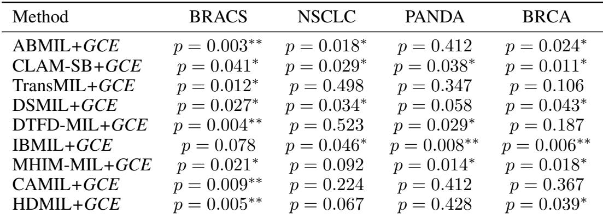

*Table 14: Paired significance tests for classification benchmarks comparing each baseline with its +GCE variant.*

> 💡 **claude 批注｜表 14 批读**: 分类 paired tests 呈混合结果：BRACS 与 TCGA-BRCA 多数 backbone 达显著，而 PANDA/NSCLC 有多项 $p\gt0.05$。因此 Table 2 的平均正增益不能改写成“所有 backbone–dataset 都显著提升”，证据质量主张仍应依靠干预表。

The classification significance table serves as a robustness check rather than the main evidence. Most BRACS and TCGA-BRCA comparisons pass the paired threshold, while some PANDA and NSCLC cells do not because the baseline variance is higher or the absolute gain is smaller. This is consistent with the main table: GCE gives positive average gains, but the size of the prediction gain depends on the host backbone and dataset.

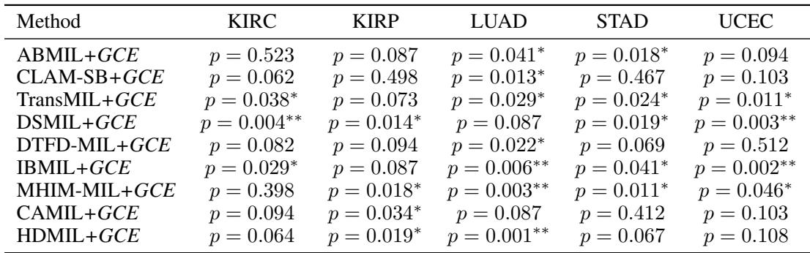

*Table 15: Paired significance tests for survival benchmarks comparing each baseline with its +GCE variant.*

> 💡 **claude 批注｜表 15 批读**: survival 显著性最集中在 LUAD、UCEC 以及 DSMIL/IBMIL/MHIM-MIL 的若干组合；KIRC/KIRP 有较多 $p\gt0.05$。它支持方向性 portability，但不能消除 censoring 与 cohort 异质性带来的不确定性。

The survival significance table shows the same mixed but directional pattern. The strongest evidence appears on LUAD, UCEC, and several DSMIL/IBMIL/MHIM-MIL cells, where the C-index gains are larger. KIRC and KIRP contain more cells above the paired-test threshold, which matches the smaller absolute gains reported in the survival table. The survival results therefore support the method’s portability, while the evidence diagnostics remain the primary evidence-quality analysis.

## G Ablation Studies and Sensitivity Analysis

This section groups the sensitivity analyses that explain how the evidence selector behaves under different budgets, selector parameterizations, and grounding variants. The tables are placed next to their interpretation so that each design choice is tied back to one of Sufficiency, Necessity, or Recoverability.

## G.1 Budget Sweep

Table 16 reports the full budget sweep used to choose $\rho = 0 . 0 5 .$

Table 16 explains why the main configuration uses $\rho = 0 . 0 5$ . Increasing the budget from 0.01 to 0.05 improves Macro-F1 from 0.711 to 0.748 and raises evidence sufficiency from 0.440 to 0.659. Larger budgets produce almost no prediction gain and only marginal increases in complement degradation, while the evidence fraction grows substantially. Thus $\rho = 0 . 0 5$ is the knee point: it preserves Sufficiency and Necessity without drifting toward full-bag evidence.

## G.2 Recovery Hyperparameter Scope

The reported discrete recovery protocol fixes the threshold at $\tau = 0 . 5$ and the coverage target at $c = 0 . 9 5$ for all datasets. These values are used as operating rules rather than per-dataset tuning knobs: thresholding first makes the continuous selector discrete, and repair then adds patches only when the recovered subset fails the anchor-coverage target. The retained aggregate outputs support the budget and selector sensitivity analyses in Tables 16 and 17, but they do not contain a complete per-slide cache of gates and logits for a post-hoc $\tau \times c$ sweep across all folds. Accordingly, no additional numeric threshold/coverage table is reported. The available sensitivity evidence still addresses the main concern: hard top-k selection at the exact 5% budget has a larger C-D gap (0.031) than the recovered selector (0.005), so Recoverability is not obtained merely by fixing the evidence fraction.

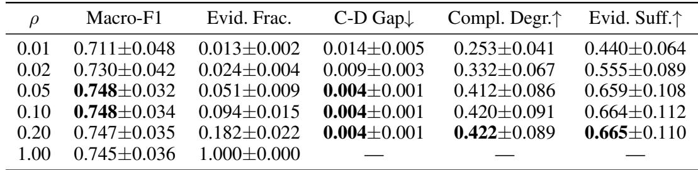

*Table 16: Effect of evidence budget $\rho$ on BRACS. Gains plateau beyond $\rho = 0 . 0 5$ while the evidence fraction continues to increase.*

> 💡 **claude 批注｜表 16 预算拐点**: $\rho$ 从 0.01→0.05 时 Macro-F1 0.711→0.748、evidence sufficiency 0.440→0.659；再增到 0.20 几乎不再提升，却把 evidence fraction 从 0.051 推到 0.182。5% 是 BRACS 验证上的折中，不是所有 foundation model/consumer 的普适常数。

## G.3 Selector Architecture Variants

Table 17 compares selector parameterizations under the same training and recovery protocol. The consecutive selector used by GCE-MIL keeps the evidence fraction close to the target while reducing the continuous-discrete gap to 0.005.

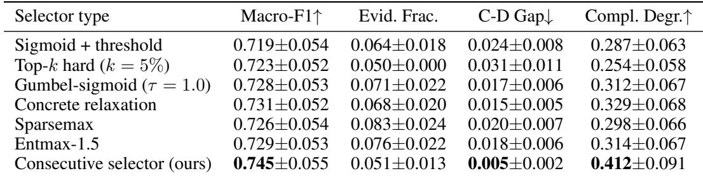

*Table 17: Selector architecture ablation on BRACS. The consecutive selector attains the lowest continuous-discrete gap while maintaining a compact evidence fraction.*

> 💡 **claude 批注｜表 17 选择器对照**: hard top-k 虽精确固定 5%，C-D gap 却是 0.031；Consecutive selector 在证据比例 0.051 时降到 0.005，并把 complement degradation 提到 0.412。由此可见 budget 相同并不保证 evidence interface 可恢复。

Table 17 isolates the selector design from the grounding design. Hard top-k enforces the target evidence fraction exactly but has the largest C-D gap (0.031), showing that sparsity alone does not imply recoverability. Continuous relaxations such as Concrete and Gumbel-sigmoid reduce the gap, but the consecutive selector combines a near-target evidence fraction (0.051) with the smallest gap (0.005) and the largest complement degradation (0.412). This is the selector-side evidence for the Recoverability component of S/N/R.

## G.4 Grounding Variant Ablation

The main BRACS configuration uses eight frozen TITAN text anchors. Table 18 compares semantic grounding variants under the same budget and repair settings.

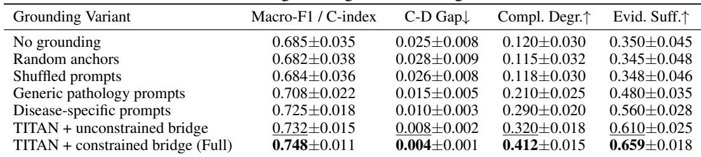

*Table 18: Effect of semantic grounding variants averaged across nine datasets.*

> 💡 **claude 批注｜表 18 语义锚定对照**: random/shuffled anchor 与无 grounding 几乎相同，排除了“只是多加参数”的解释；generic→disease-specific→TITAN constrained bridge 逐步把 C-D gap 0.015→0.010→0.004、complement degradation 0.210→0.290→0.412。语义先验质量是 Necessity 提升的关键。

Table 18 shows that grounding quality, not only sparsity, determines evidence quality. Removing grounding or replacing anchors with random/shuffled prompts leaves Macro-F1/C-index around 0.682–0.685 and complement degradation near 0.115–0.120, indicating weak Necessity. Generic pathology prompts help, but disease-specific prompts give a larger jump in both prediction (0.725) and evidence sufficiency (0.560). The full TITAN plus constrained-bridge variant reaches 0.748 Macro-F1/C-index, 0.004 C-D gap, 0.412 complement degradation, and 0.659 evidence sufficiency; this is the clearest ablation evidence that semantic grounding supports all three S/N/R criteria.

## H Multi-Backbone and Multi-Encoder Generalization

The main text evaluates nine MIL backbones with UNI features. This section evaluates whether the GCE wrapper remains useful when the patch encoder changes, using ResNet-50, ViT-S, and UNI features on BRACS and LUAD.

## H.1 Multi-Backbone Generalization

Table 19 reports the full encoder/backbone generalization study referenced in Appendix H. Each encoder block is placed adjacent to the corresponding BRACS and LUAD results, enabling direct comparison of feature extractors within the same table.

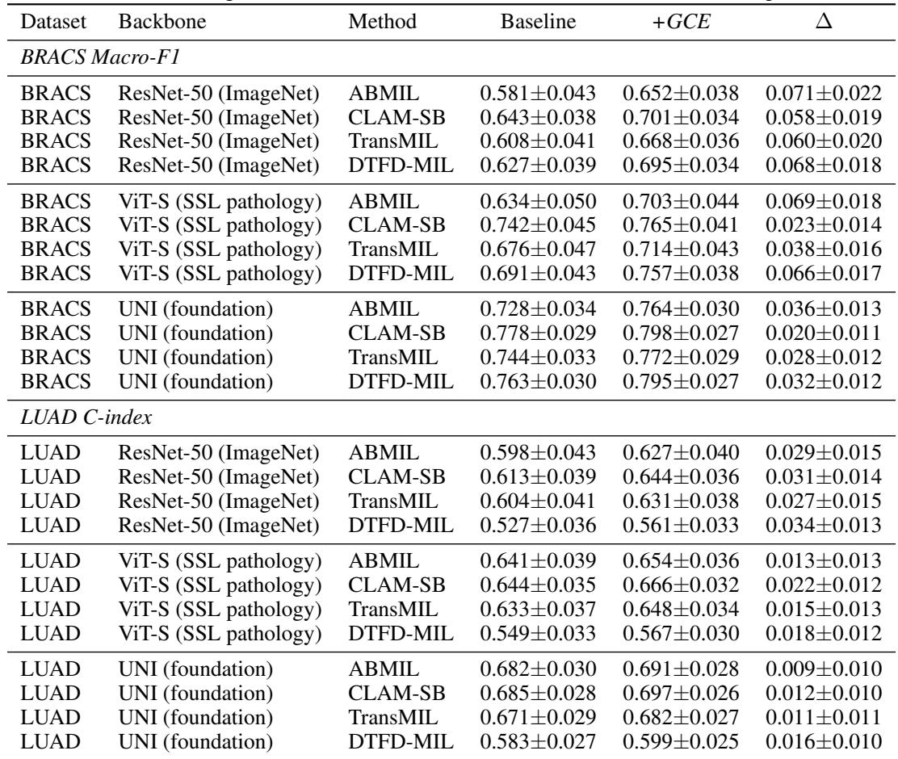

*Table 19: Backbone generalization on BRACS classification and LUAD survival prediction.*

> 💡 **claude 批注｜表 19 批读**: ResNet-50、ViT-S、UNI 下的 BRACS 与 LUAD 组合大多因 GCE 获益，弱 encoder 上增益更大；但每个 encoder/backbone 组合都重新训练 GCE。该表证明多 encoder 适用性，不证明固定 selector 跨 foundation model 或跨 consumer 迁移。

Table 19 shows that the gain is not tied to UNI alone. On BRACS, GCE improves all four listed backbones for ResNet-50, ViT-S, and UNI features; the gains are largest for weaker encoders such as ResNet-50, where ABMIL improves by 0.071 and DTFD-MIL by 0.068. On LUAD, every encoder/backbone pair also improves, but the gains are smaller with UNI because the baseline risk models are already stronger. This pattern supports the plug-in interpretation: GCE changes the evidence interface and remains useful across representation quality levels.

## I Failure Case Audit

The audit below records where S/N/R evidence selection is least reliable. The taxonomy, quantitative rates, and qualitative interpretation are kept together so that failure modes remain adjacent to the numbers used to define them.

## I.1 Failure Taxonomy

The audit uses six failure types: case-level prediction failure, artifact-driven evidence, low sufficiency, low necessity, semantic mismatch, and severe failure. Case-level prediction failure means the full-bag prediction is incorrect or unreliable. Artifact-driven evidence means selected patches contain scanner artifacts, tissue folds, pen marks, or background. Low sufficiency means the recovered subset fails the keep-only criterion, while low necessity means removing the subset does not meaningfully degrade prediction. Semantic mismatch means selected evidence does not align with the intended anchor concept. Severe failure denotes cases where multiple failure modes occur together.

> 💡 **claude 批注｜失败分类体系**: 这里把上游 consumer 错误、视觉伪影、S/N 指标失败、语义锚点错配与复合严重失败分开。ReadySlide 可直接沿用这条 diagnosis→taxonomy 链，但还应新增“跨 foundation-model selector 不一致”和“selector 在 consumer 迁移后失效”两类。

## I.2 Per-Dataset Failure Rates

Table 20 reports the failure audit across all nine datasets.

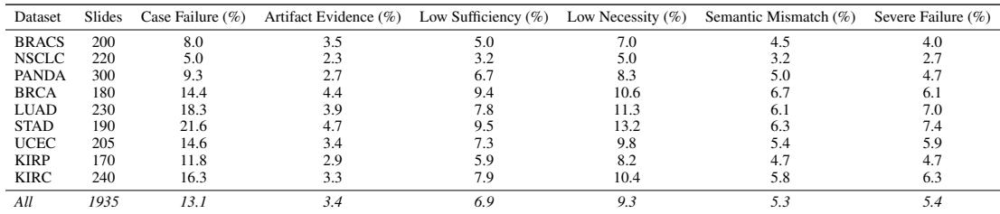

*Table 20: Failure-case audit across all nine datasets.*

> 💡 **claude 批注｜表 20 失败审计**: 正文指出 STAD、LUAD 失败率最高，且多数 cohort 的 low necessity 多于 low sufficiency；这与多源冗余证据一致。也说明 GCE 没有消除 S/N 冲突，特别是预后任务中 complement 仍可能含替代性形态。

Table 20 identifies where the S/N/R assumptions are most fragile. The largest failure rates appear in STAD and LUAD, where prognostic morphology is heterogeneous and full-bag risk prediction is itself harder. Low necessity is more common than low sufficiency in most cohorts, meaning GCE often finds a subset that can predict but the complement may still contain redundant evidence. This reinforces the paper’s motivation: WSI evidence is often multi-source, so evidence methods should report both keep-only and remove interventions rather than only attention localization.

## I.3 Qualitative Failure Examples

Qualitative failure examples are included in Figures 12–17. The most common qualitative failures are artifact-adjacent evidence and semantically plausible but incomplete evidence sets. These cases usually preserve Sufficiency but weaken Necessity, because other regions in the slide contain similar diagnostic patterns.

## J Implementation and Computational Cost

This section combines reproducibility details with the runtime analysis. The cost numbers are interpreted together with the implementation setup because all primary experiments use cached patch features, whereas optional tile prefiltering changes the end-to-end deployment path.

## J.1 Hardware Setup

All experiments use pre-extracted patch features, so the dominant training cost comes from MIL aggregation, selector scoring, anchor response computation, and intervention evaluation. The implementation is written in PyTorch and uses mixed CPU/GPU data loading with list-valued batches. Experiments were run with PyTorch 1.13 on a single NVIDIA RTX 3090 GPU with 24GB memory. Each fold job uses one GPU; patch features are precomputed, so the GPU workload is dominated by the MIL head, selector network, anchor-response computation, and intervention evaluation rather than by patch encoding. This hardware setting matters for interpreting the cost table: the reported speedups come from reducing the number of patches processed by the MIL aggregation stage, not from changing the offline UNI feature extractor.

## J.2 Training Hyperparameters per Dataset

All nine primary datasets use five-fold cross-validation. All results use UNI features [Chen et al., 2024] and identical train/validation splits for each baseline and its GCE wrapper. Unless otherwise stated, tables report mean±standard deviation over validation folds; repeated-seed analyses are used only for stability and perturbation experiments where seed sensitivity is the measured quantity. The BRACS main GCE configuration trains for 15 epochs with AdamW, learning rate $2 \times \bar { 1 0 } ^ { - 4 }$ , weight decay $1 0 ^ { - 5 }$ , gradient clipping at 5.0, and cosine learning-rate scheduling. The same reported loss weights $( \lambda _ { b } = 0 . 1 , \lambda _ { g } = 0 . 5 )$ and operating evidence budget $( \rho = 0 . 0 5 )$ are used across datasets without per-dataset retuning; budget sensitivity is reported in Table 16. The selector temperature is annealed from 1.0 to 0.4, training bags are randomly sampled to at most 512 patches, and validation bags use all available patches in deterministic order. The same split and feature files are used for each host backbone and its GCE wrapper. The most important reproducibility detail is that the task and evidence paths see the same sampled bag during training. This design keeps evidence supervision focused on selector behavior rather than on stochastic differences in sampled patches.

## J.3 Data Preprocessing Pipeline

Each slide is represented by one HDF5 file containing a feature matrix and patch coordinates. The feature matrix has shape N ×1024 for UNI features, and coordinates have shape N ×2. Classification splits are resolved at the slide level, while survival splits are resolved at the case level to avoid leakage across slides from the same patient. The collate function does not stack bags; it returns a list of samples so that each bag can be processed with its own number of patches. This list-valued batching is also why the evidence selector is applied per slide rather than through a fixed-size tensor batch. It preserves each WSI’s natural patch count and avoids padding artifacts in evidence ratios.

## J.4 Patch Sampling Strategy

Training uses random patch sampling when a bag exceeds the configured training maximum. For the BRACS main configuration, at most 512 patches are sampled for training, while validation uses all available patches and deterministic ordering. The same sampled bag is used for the task and evidence paths within a forward pass. This avoids conflating selector quality with stochastic changes in the input bag.

## J.5 Random Seeds and Reproducibility

The minimal-subset motivation analysis uses fixed seed 42 for random top-k baselines. Model training uses fold-specific splits, and repeated-seed estimates are reserved for the stability tables. The code, split CSV files, configuration YAML files, fold-level evaluation scripts, and JSON summaries for intervention metrics will be released after acceptance. The seed-controlled random top-k baseline is included only as a negative control: it measures how often sufficiency appears by chance at the same subset size.

## J.6 Anchor Prompt Protocol

Table 21 records how anchor prompts are specified. Each dataset family uses eight task-specific morphology anchors chosen before training from standard disease and histology concepts. The prompts are embedded once with TITAN and then frozen; they are not selected by validation performance and do not use patch-level concept annotations. This protocol is meant to provide a reproducible semantic prior while avoiding prompt tuning on the evaluation folds.

Table 21: Anchor prompt protocol. Entries list prompt categories rather than all wording variants;   
each row uses eight frozen TITAN text anchors selected before model training.

Dataset family Anchor source Prompt categories / examples Selection rule   
BRACS / TCGA-BRCA Breast pathology prior Gland formation; nuclear pleomorphism; mitotic activity; stromal reaction; necrosis; lymphocytic infiltration; invasive epithelial nests; benign ducts Fixed before folds; no validation tuning   
PANDA Prostate grading prior Benign glands; gland fusion; cribriform architecture; poorly formed glands; solid growth; stromal/background tissue; inflammation; necrosis Fixed before folds; no patch labels   
TCGA-NSCLC / LUAD Lung tumor morphology Malignant epithelial nests; acinar growth; papillary growth; solid growth; necrotic tumor cells; stromal lymphocytes; lepidic-like regions; mucinous regions   
TCGA-STAD Gastric adenocarcinoma morphology Tubular glands; poorly cohesive cells; signet-ring morphology; necrosis; desmoplastic stroma; lymphocytic infiltration; mucin pools; ulcerated tumor surface Fixed before folds; no case outcome tuning   
TCGA-UCEC Endometrial carcinoma morphology Glandular architecture; solid sheets; nuclear atypia; squamous differentiation; necrosis; stromal reaction; mitotic activity; inflammatory infiltrate Fixed before folds; no validation tuning   
TCGA-KIRP / KIRC Renal-cell carcinoma morphology Fixed before folds; no patch labels

> 💡 **claude 批注｜表 21 批读**: 每个数据集族固定 8 个 TITAN morphology anchor，且在 fold 划分前确定，不用 validation 调 prompt，也不用 patch label。协议减少了评估泄漏，但 renal row 在 MinerU 原文中只保留到“Renal-cell carcinoma morphology”，提示实际复现仍需要作者发布完整 wording；content-list 没有该表图片，因此这里保留英文源行。

## J.7 Added Capacity and Training Overhead

GCE adds trainable capacity through the low-rank adapter, anchor bridge, selector MLP, and classanchor weights. The aggregate experiment artifacts report relative runtime and memory rather than architecture-specific parameter counts; an exact parameter table is therefore omitted because the count varies with the host backbone implementation. Table 22 summarizes the measured overhead and the controls used to separate added capacity from useful grounding.

Table 22: Added capacity and overhead summary. Runtime and memory values are relative to the full-bag host backbone.

Ouestion Supporting evidence Key value Interpretation   
Does the soft wrapper add runtime? Table 23, GCE soft selector + head End-to-end 1.02×; peak memory 1.05× Training/inference overhead from selector and anchor scoring is small with cached features   
Does discrete recovery reduce aggregation cost? Table 23, discrete cached features MIL aggregation 0.22×; peak memory 0.18× Compact subsets reduce the MIL aggregation stage after recovery   
Is the gain only extra capacity? Table 18, random/shuffled anchors C-D gap 0.028/0.026; complement degradation 0.115/0.118 Capacity without meaningful grounding does not close the evidence gap   
Does grounding quality matter? Table 18, generic to full TITAN C-D gap 0.015 → 0.004; degradation 0.210 → 0.412 Better semantic grounding and constrained bridge improve S/N/R diagnostics

> 💡 **claude 批注｜表 22 批读**: soft wrapper 的 end-to-end/peak-memory 开销为 1.02×/1.05×，离散缓存特征聚合为 0.22×/0.18×；random/shuffled anchor 的 C-D gap 0.028/0.026 与 degradation 0.115/0.118 又把“新增容量”与“有效 grounding”分开。MinerU 同样没有该表图片，因此保留原始英文行而不重构数值。

## J.8 Cost Summary

Discrete recovery enables efficient aggregation: with cached features, GCE uses 0.22× aggregation time and 0.18× peak memory while retaining 1.002× relative Macro-F1 (Table 23). End-to-end acceleration requires optional tile prefiltering, which skips many non-selected patches before feature extraction; in that mode, end-to-end time falls to 0.20× at 0.989× utility. Thus the headline speedup is an inference-mode option, while the cached-feature setting isolates the savings from MIL aggregation and memory. The result should be interpreted as an inference-mode option rather than the default validation protocol: the main accuracy tables use the standard evaluation path, while Table 23 asks what happens after evidence has been recovered.

## J.9 Full Inference Cost Table

Table 23 reports inference cost relative to the full-bag backbone.

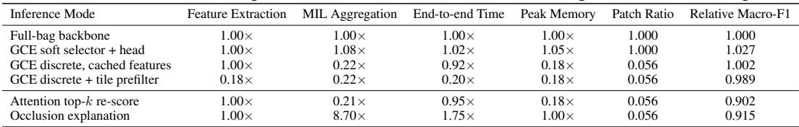

*Table 23: Inference cost comparison. Values are relative to the full-bag backbone forward pass.*

> 💡 **claude 批注｜表 23 成本口径**: 缓存特征场景下，离散 GCE 主要把 MIL aggregation 降到 0.22×、显存 0.18×；5× end-to-end 只在 tile prefiltering 跳过 patch 编码时成立，且效用为 0.989×。这两个部署口径必须分开报告。

Table 23 separates two deployment regimes. If all patch features are already cached, discrete GCE mainly reduces MIL aggregation cost, lowering aggregation time to 0.22× and memory to 0.18× while preserving relative Macro-F1. If tile prefiltering is available, the system can skip many patch computations and reach 0.20× end-to-end time, but with a small utility loss (0.989×). This tradeoff is useful clinically: cached-feature inference favors fidelity, whereas prefiltering favors throughput.

## J.10 Runtime Compared with Post-hoc Methods

Table 11 reports post-hoc runtime ratios. Occlusion requires 8.70× runtime, while GCE discrete evidence costs 1.08× in the same comparison. The difference arises because post-hoc methods explain a fixed trained predictor after the fact, while GCE amortizes evidence selection during training and exposes the selector during inference.

## K Dataset Details

This section records the source, task definition, and preprocessing assumptions for every dataset used in the benchmark. The nine primary datasets define the prediction benchmark; CAMELYON-16 is used only for external localization analysis.

## K.1 Dataset Sources, Splits, and Labels

Table 24 records the dataset card for the nine-dataset benchmark. The four classification datasets are evaluated with Macro-F1, and the five survival cohorts are evaluated with C-index. Slides are split at the patient level whenever patient identifiers are available; slides from the same patient are not shared across train, validation, and test partitions. The dataset mix is intentionally heterogeneous: BRACS and PANDA test diagnostic grading, TCGA-BRCA and TCGA-NSCLC test subtype classification, and the five TCGA survival cohorts test whether evidence selection remains compatible with scalar risk prediction.

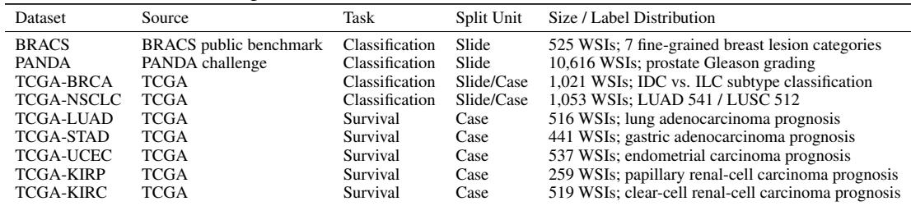

*Table 24: Dataset details for the nine-dataset benchmark. Counts and diagnostic descriptions summarize the benchmark protocol.*

> 💡 **claude 批注｜表 24 数据范围**: 九个主数据集覆盖 4 个分类与 5 个生存 cohort，CAMELYON-16 仅作额外定位验证；因此“9×9”不包含像素级监督。跨站点、跨扫描仪和外部队列的 evidence 稳健性仍未被主矩阵覆盖。

Table 24 also clarifies the scope of the benchmark. The BRACS minimal-subset diagnostic uses fine-grained lesion labels and validation folds suitable for recursive subset search, while the prediction and evidence diagnostics are evaluated across all nine datasets.

## K.2 Survival Data Preprocessing

For survival cohorts, each case has an observed time and censoring indicator. Cases without valid survival time or event/censoring metadata are excluded before fold construction. The GCE-MIL survival branch predicts a scalar risk score and is trained with Cox partial likelihood, so the main results do not require discretizing time into bins. The structural prognostic factors associated with each cohort are also recorded: LUAD prognosis relates to lepidic, acinar, papillary, micropapillary, and solid growth patterns; STAD relates to differentiation grade and signet-ring morphology; UCEC relates to FIGO grade and the glandular-to-solid component ratio; KIRC relates to Fuhrman nuclear grade within clear-cell architecture; and KIRP relates to papillary-core integrity and arrangement. Any discrete time-to-event auxiliary analysis follows the four non-overlapping interval construction used by the reference dataset protocol and remains separate from the Cox results reported in the main text. This setup makes the survival experiments a stress test for GCE-MIL: the evidence selector is trained against a risk-ordering objective rather than a categorical softmax, yet it still has to produce recoverable discrete evidence.

## K.3 WSI Patching and Feature Extraction

All slides are tiled into non-overlapping 256 × 256 patches at 20× magnification. Tissue regions are retained before feature extraction, and each retained patch is represented by a 1024-dimensional UNI embedding. Each slide is stored as one HDF5 file containing the patch feature matrix and the corresponding two-dimensional patch coordinates. The same preprocessing is used for the host backbone and its GCE wrapper, so differences in the reported results come from evidence selection and recovery rather than from patch extraction.

## K.4 Patch Encoder Choice Rationale

UNI is used as the default patch encoder because it provides a 1024-dimensional pathology foundation representation shared across classification and survival tasks. The robustness study in Table 19 also reports ResNet-50 and ViT-S features. Using several encoders tests whether GCE-MIL depends on a single representation space or remains useful as a wrapper around different feature extractors.

## K.5 CAMELYON-16 Localization Protocol

CAMELYON-16 is used only as an additional localization benchmark and is not counted among the nine primary classification and survival datasets. Slides are tiled with the same non-overlapping 256 × 256 patches at 20× magnification. Each patch footprint is mapped to the official annotation mask; a patch is labeled positive if at least 1% of its area overlaps an annotated tumor region, and patches outside the tissue mask are ignored during prediction and evaluation. Dice is computed on the patch grid after selecting one binarization threshold on the validation split for each method and then fixing that threshold for test slides. FROC is computed by threshold sweeping: connected components in the binarized patch grid are lesion candidates, the candidate score is the maximum patch score inside the component, and sensitivity is averaged at 1/8, 1/4, 1/2, 1, 2, 4, and 8 false positives per slide. This localization protocol evaluates spatial faithfulness rather than slide-level prediction. It is therefore used as supporting evidence for the Necessity and Recoverability claims, not as an additional main benchmark dataset.

## L Additional Visualizations

The remaining figures provide qualitative checks of the same mechanisms measured by the intervention tables. They are placed after the quantitative appendices so that visual examples complement, rather than substitute for, the S/N/R diagnostics.

## L.1 T-SNE and Main Qualitative Summaries

Figures 4 and 5 show that evidence-oriented training changes representation geometry. Before grounding, class clusters remain partially entangled across training epochs; after GCE grounding, the late-epoch embeddings separate into more compact class-specific regions. The continuous selector becomes bimodal during training (Figure 1, middle), enabling reliable discretization. Appendix Figures 6–11 and Figures 12–17 provide additional mechanism diagrams and qualitative overlays. These visualizations are secondary to the intervention metrics, but they help diagnose whether the learned selector behaves like a structured evidence mechanism rather than a post-hoc heatmap.

## L.2 Mechanism and Qualitative Overlays

Figures 4 and 5 report the available T-SNE visualizations. Appendix Figures 6–11 include the mechanism diagrams, and Figures 12–17 include the qualitative attention/evidence overlays. The mechanism panels are included to make the implementation pathway explicit: feature adaptation, anchor response, gate formation, noisy-OR utility, thresholding, and repair are separate operations. The qualitative overlays serve as sanity checks rather than quantitative proof; they illustrate the same pattern measured in the intervention tables, namely that recovered evidence is compact while attention often remains diffuse.

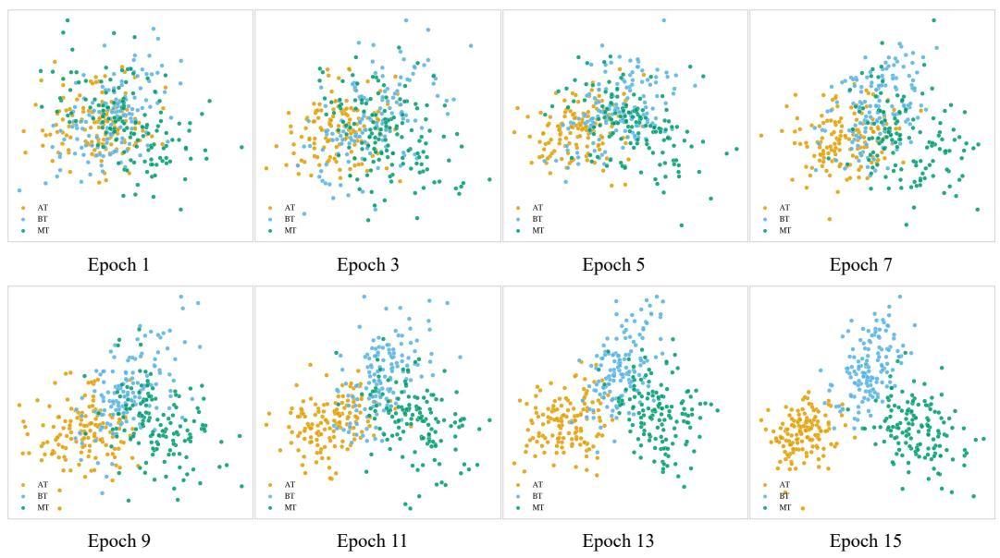  
*Figure 4: T-SNE before evidence grounding. Slide representations are less separated before the GCE evidence objective is applied.*

> 💡 **claude 批注｜图 4 批读**: grounding 前的 T-SNE 中 slide representation 仍有较多类别纠缠；它提供“证据目标可能改变表示几何”的视觉线索。T-SNE 对初始化和局部邻域敏感，因此不能替代 Table 2 的分类指标或 keep/remove 干预。

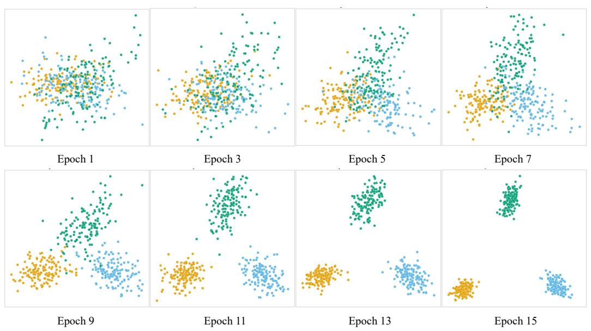  
*Figure 5: T-SNE after evidence grounding. GCE training produces more separated slide representations, consistent with the classification and evidence diagnostics.*

> 💡 **claude 批注｜图 5 批读**: grounding 后的 T-SNE 显示更紧凑的类簇，与 BRACS 等任务增益方向一致。前后图只有在相同取样与可视化设置下才可对照，而且类簇分开不等于 recovered patch 具有 Necessity。

The mechanism diagrams below decompose the GCE-MIL pipeline into the operations that are compressed into Figure 2. Each mechanism is shown as a separate large figure so that the score curves and gate distributions remain readable. The first three figures emphasize how patch features are adapted and compared with anchors; the last three emphasize how continuous gates become a recovered discrete subset.

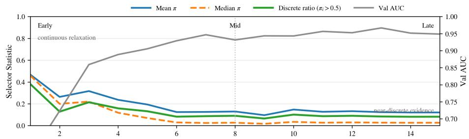

<table><tr><td width="33%">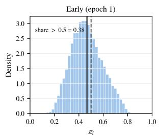</td><td width="33%">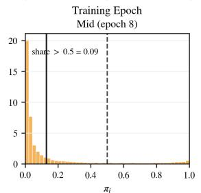</td><td width="33%">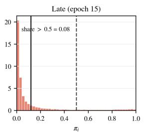</td></tr></table>

*Figure 6: Mechanism 1: feature adaptation. Low-rank residual adaptation keeps the pretrained feature space close to UNI while improving selector compatibility.*

> 💡 **claude 批注｜图 6 批读**: 总览曲线与 early/mid/late 三个子图说明低秩 residual adapter 在训练中保持 UNI 表示邻近性，同时为 selector 提供可调特征；adapter 秩为 32、近零初始化，目的不是重训 patch encoder。

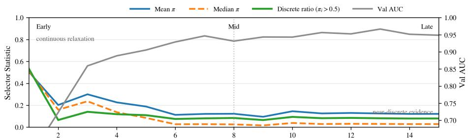

<table><tr><td width="33%">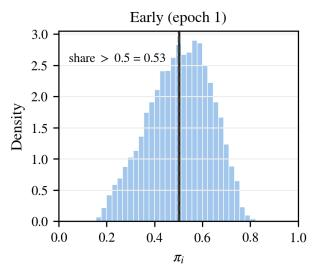</td><td width="33%">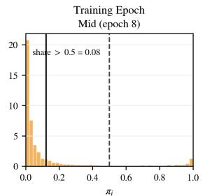</td><td width="33%">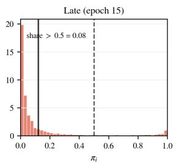</td></tr></table>

*Figure 7: Mechanism 2: anchor response. The bridge maps patch features into TITAN anchor space and produces patch-anchor responses used by the coverage utility.*

> 💡 **claude 批注｜图 7 批读**: 四个子图展开 bridge 到 TITAN anchor response 的过程：patch feature 被投到文本空间，再由 Equation 2 的 $\gamma=8$、$\delta=0.15$ 转为 $r_{im}$。该模块决定 grounding 是否真正对应病理形态。

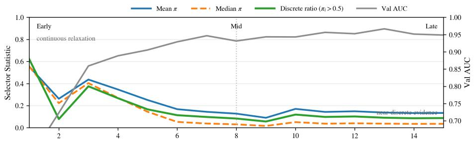

<table><tr><td width="33%">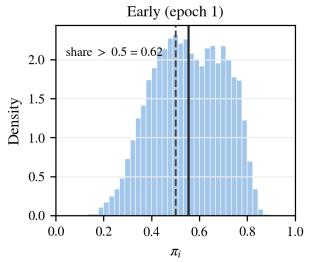</td><td width="33%">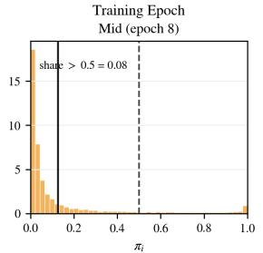</td><td width="33%">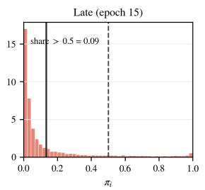</td></tr></table>

*Figure 8: Mechanism 3: continuous gate. Temperature annealing sharpens the selector distribution so that continuous gates can be recovered as a discrete subset.*

> 💡 **claude 批注｜图 8 批读**: 曲线与三个 epoch 分布展示温度从 1.0 退火到 0.4 后，$\pi_i$ 从连续分布向接近 0/1 的两端移动。阈值附近质量减少，正是 C-D gap 能从 naive selector 的 0.055 降到完整模型 0.004 的前提。

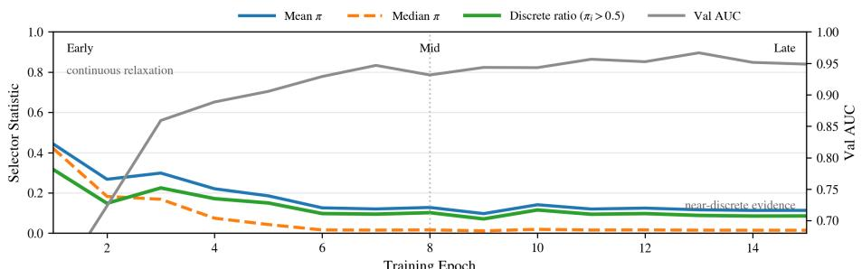

<table><tr><td width="33%">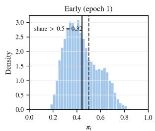</td><td width="33%">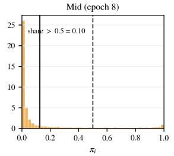</td><td width="33%">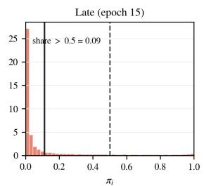</td></tr></table>

*Figure 9: Mechanism 4: noisy-OR utility. Exact noisy-OR coverage gives diminishing returns once an anchor is already covered, encouraging complementary evidence.*

> 💡 **claude 批注｜图 9 批读**: 该组图把 Equation 4 的 noisy-OR utility 可视化：一个 anchor 已被强响应 patch 覆盖后，同类 patch 的新增收益下降，尚未覆盖 anchor 的 patch 获得更高边际。它针对的是多源互补证据，而非单纯让 gate 更稀疏。

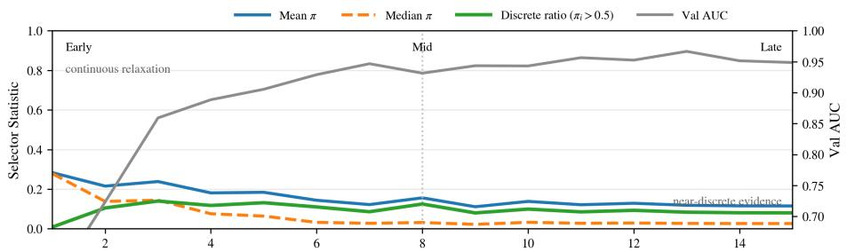

<table><tr><td width="33%">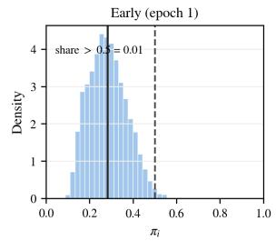</td><td width="33%">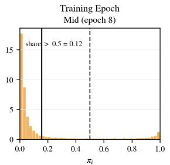</td><td width="33%">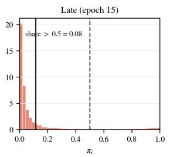</td></tr></table>

*Figure 10: Mechanism 5: threshold recovery. The initial discrete subset is obtained by thresholding the continuous gate and falling back to the top patch when needed.*

> 💡 **claude 批注｜图 10 批读**: 图示先以 $\pi_i\gt0.5$ 得到初始集合，若为空则回退到 top-1。这个阶段只把软门控变硬，尚不能保证 0.95 anchor coverage，因此必须接 Figure 11 的 repair。

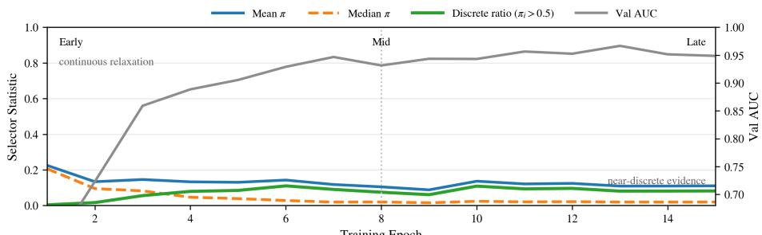

<table><tr><td width="33%">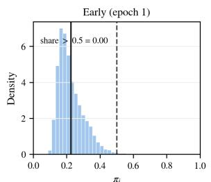</td><td width="33%">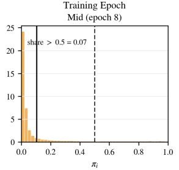</td><td width="33%">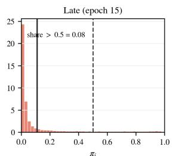</td></tr></table>

*Figure 11: Mechanism 6: greedy repair. Repair adds patches according to exact marginal utility until coverage and sufficiency criteria are restored.*

> 💡 **claude 批注｜图 11 批读**: greedy repair 每步选择 noisy-OR exact marginal 最大的未选 patch，唯一停止条件是最弱 anchor coverage 达 0.95。Figure caption 中“coverage and sufficiency criteria are restored”超出了 Algorithm 1：循环不调用 classifier、也不检查 keep-only prediction。覆盖层面的次模保证不等于 prediction sufficiency，后者必须另做干预实验。

> 💡 **claude 批注｜图 6–11 机制串联**: 六组多子图按 adapter→anchor response→continuous gate→noisy-OR→threshold→greedy repair 展开 Figure 2。每组第一张是完整趋势图，后三张是阶段/分布子图；它们解释实现路径，但不会替代 Table 4/6 的干预证据。

The following qualitative overlays show representative evidence maps exported from the evaluation pipeline. They are not used to claim pixel-level correctness; the quantitative support for evidence quality comes from keep-only, remove, C-D gap, and CAMELYON-16 localization metrics. Instead, these examples help readers inspect whether the recovered subset is compact, whether it avoids obvious background/artifact regions, and how it differs from diffuse attention maps.

<table>
<tr><td width="25%">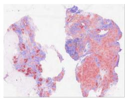<br><div align="center"><i>DSMIL</i></div></td><td width="25%">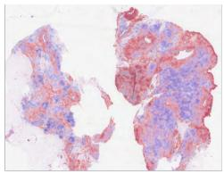<br><div align="center"><i>DTFD-MIL</i></div></td><td width="25%">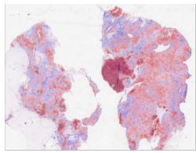<br><div align="center"><i>IBMIL</i></div></td><td width="25%">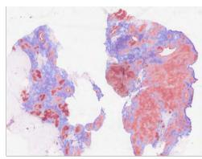<br><div align="center"><i>HDMIL</i></div></td></tr>
<tr><td width="25%">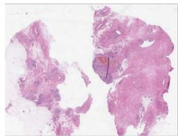<br><div align="center"><i>DSMIL+ ours</i></div></td><td width="25%">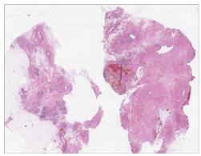<br><div align="center"><i>DTFD-MIL+ ours</i></div></td><td width="25%">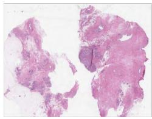<br><div align="center"><i>IBMIL+ ours</i></div></td><td width="25%">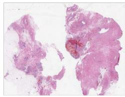<br><div align="center"><i>HDMIL+ ours</i></div></td></tr>
</table>

*Figure 12: Qualitative evidence overlay 1. Representative slide-level attention and recovered GCE evidence.*

> 💡 **claude 批注｜图 12 批读**: 同一张 WSI 上，第一行依次给出 DSMIL、DTFD-MIL、IBMIL、HDMIL 的 host attention，第二行给出各自加入 GCE 后的 recovered evidence。四个 consumer 的输出并不完全相同，说明“跨 backbone 可插拔”不等于一个 selector 能跨 consumer 直接迁移。

<table>
<tr><td width="25%">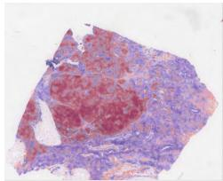<br><div align="center"><i>DSMIL</i></div></td><td width="25%">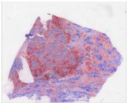<br><div align="center"><i>DTFD-MIL</i></div></td><td width="25%">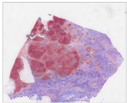<br><div align="center"><i>IBMIL</i></div></td><td width="25%">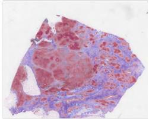<br><div align="center"><i>HDMIL</i></div></td></tr>
<tr><td width="25%">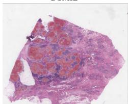<br><div align="center"><i>DSMIL+ ours</i></div></td><td width="25%">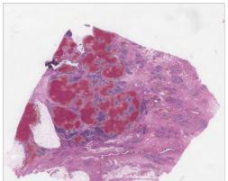<br><div align="center"><i>DTFD-MIL+ ours</i></div></td><td width="25%">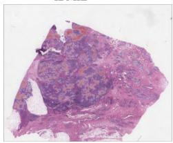<br><div align="center"><i>IBMIL+ ours</i></div></td><td width="25%">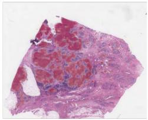<br><div align="center"><i>HDMIL+ ours</i></div></td></tr>
</table>

*Figure 13: Qualitative evidence overlay 2. Representative slide-level attention and recovered GCE evidence.*

> 💡 **claude 批注｜图 13 批读**: 第二个 slide 继续固定四列 consumer 对照，避免把 backbone 差异误当作 slide 差异。该图可检查 GCE 是否把扩散 attention 压缩为有限区域；集合稳定性的定量证据仍来自 Table 10 的 Jaccard 0.606，而不是肉眼相似度。

<table>
<tr><td width="25%">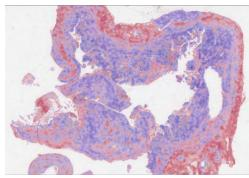<br><div align="center"><i>DSMIL</i></div></td><td width="25%">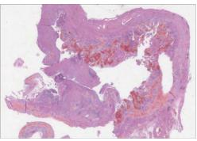<br><div align="center"><i>DTFD-MIL</i></div></td><td width="25%">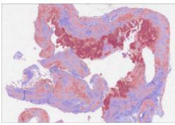<br><div align="center"><i>IBMIL</i></div></td><td width="25%">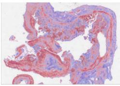<br><div align="center"><i>HDMIL</i></div></td></tr>
<tr><td width="25%">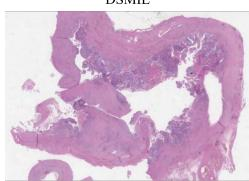<br><div align="center"><i>DSMIL+ ours</i></div></td><td width="25%">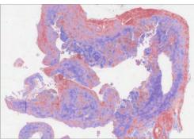<br><div align="center"><i>DTFD-MIL+ ours</i></div></td><td width="25%">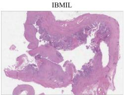<br><div align="center"><i>IBMIL+ ours</i></div></td><td width="25%">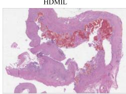<br><div align="center"><i>HDMIL+ ours</i></div></td></tr>
</table>

*Figure 14: Qualitative evidence overlay 3. Representative slide-level attention and recovered GCE evidence.*

> 💡 **claude 批注｜图 14 批读**: 第三个案例把四种 host 与四个 GCE 结果放在同一坐标系中，适合审查 recovered subset 是否落在 attention 支持的组织区域。它没有像素级概念真值，因此只能作为 keep/remove 干预的可视化补充，不能单独证明 Necessity。

<table>
<tr><td width="25%">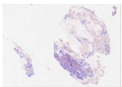<br><div align="center"><i>DSMIL</i></div></td><td width="25%">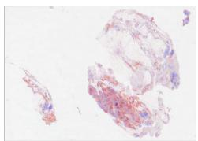<br><div align="center"><i>DTFD-MIL</i></div></td><td width="25%">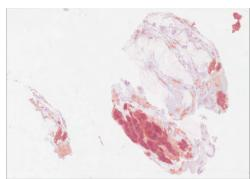<br><div align="center"><i>IBMIL</i></div></td><td width="25%">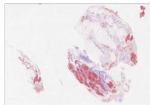<br><div align="center"><i>HDMIL</i></div></td></tr>
<tr><td width="25%">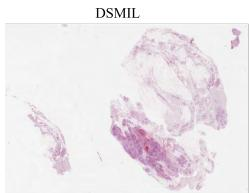<br><div align="center"><i>DSMIL+ ours</i></div></td><td width="25%">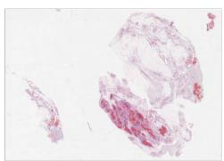<br><div align="center"><i>DTFD-MIL+ ours</i></div></td><td width="25%"><br><div align="center"><i>IBMIL+ ours</i></div></td><td width="25%">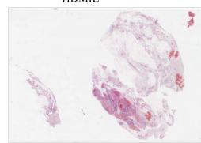<br><div align="center"><i>HDMIL+ ours</i></div></td></tr>
</table>

*Figure 15: Qualitative evidence overlay 4. Representative slide-level attention and recovered GCE evidence.*

> 💡 **claude 批注｜图 15 批读**: 第四个案例仍采用逐列配对，第二行不是独立模型，而是对应上方 host 的 GCE wrapper 输出。这个版式直接暴露 consumer 依赖性：即使四列处理同一 slide，证据位置也可能变化，ReadySlide 因而应测跨 consumer 一致性。

<table>
<tr><td width="25%">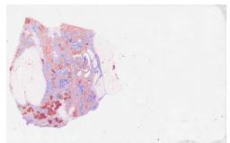<br><div align="center"><i>DSMIL</i></div></td><td width="25%">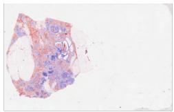<br><div align="center"><i>DTFD-MIL</i></div></td><td width="25%">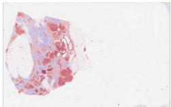<br><div align="center"><i>IBMIL</i></div></td><td width="25%">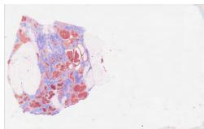<br><div align="center"><i>HDMIL</i></div></td></tr>
<tr><td width="25%">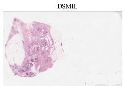<br><div align="center"><i>DSMIL+ ours</i></div></td><td width="25%">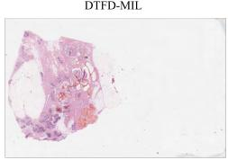<br><div align="center"><i>DTFD-MIL+ ours</i></div></td><td width="25%">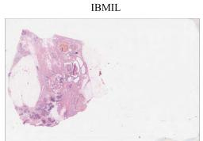<br><div align="center"><i>IBMIL+ ours</i></div></td><td width="25%">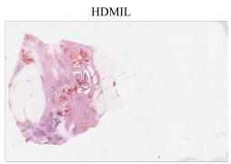<br><div align="center"><i>HDMIL+ ours</i></div></td></tr>
</table>

*Figure 16: Qualitative evidence overlay 5. Representative slide-level attention and recovered GCE evidence.*

> 💡 **claude 批注｜图 16 批读**: 第五个案例用于检查“紧凑”是否在 DSMIL、DTFD-MIL、IBMIL、HDMIL 四个架构族上同时出现。图中每列必须与自身 baseline 比较，不能横向挑最好看的模型；真正的同预算结论由 Table 9 的 5% 控制给出。

<table>
<tr><td width="25%">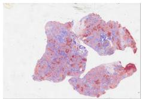<br><div align="center"><i>DSMIL</i></div></td><td width="25%">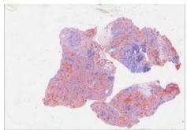<br><div align="center"><i>DTFD-MIL</i></div></td><td width="25%">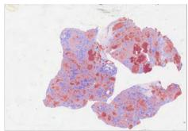<br><div align="center"><i>IBMIL</i></div></td><td width="25%">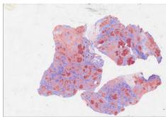<br><div align="center"><i>HDMIL</i></div></td></tr>
<tr><td width="25%">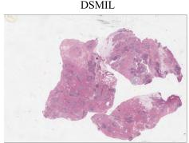<br><div align="center"><i>DSMIL+ ours</i></div></td><td width="25%">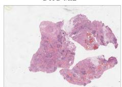<br><div align="center"><i>DTFD-MIL+ ours</i></div></td><td width="25%"><br><div align="center"><i>IBMIL+ ours</i></div></td><td width="25%">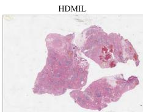<br><div align="center"><i>HDMIL+ ours</i></div></td></tr>
</table>

*Figure 17: Qualitative evidence overlay 6. Representative slide-level attention and recovered GCE evidence.*

> 💡 **claude 批注｜图 17 批读**: 最后一个案例补足六张 slide 的定性覆盖；四列上方是 host attention，下方是对应 recovered GCE evidence。它只能说明 selector 行为可人工审阅，空间正确性的外部证据应引用 CAMELYON-16 的 Dice/FROC，而不是把红色覆盖区域直接当病理真值。

> 💡 **claude 批注｜图 12–17 定性审阅**: 六组 overlay 让读者检查稀疏性、空间连贯和是否贴近伪影；这些图没有建立 patch 级概念标签真值，论文也明确把它们定位为 sanity check。真正外部空间验证来自 CAMELYON-16 的 Dice/FROC。

## M Limitations and Discussion

The S/N/R formalization operates at patch level; extending it to pixel-level or region-level evidence remains open. The anchor bank uses fixed text prompts that may not transfer to rare or previously unseen tissue types without prompt adaptation. Finally, S/N/R measures model-relative evidence faithfulness, not pathologist-verified causal mechanisms—bridging this gap requires clinical validation studies.

> 💡 **claude 批注｜局限定位**: 作者明确承认三层边界：当前证据单位是 patch 而非像素/区域；固定文本锚点可能无法迁移到罕见或未见组织；S/N/R 只证明模型相对忠实，不是病理专家验证的因果机制。ReadySlide 可把这三点分别转化为粒度、域外迁移和临床真值协议。

> 💡 **claude 批注｜附录小结**: 理论保证止于 coverage utility；实证补充了同预算、稳定性、post-hoc、survival、定位、预算、grounding、failure audit 和成本。ReadySlide 尚可填补的矩阵空白是 foundation-model selector × downstream consumer × evidence budget 的全交叉干预与跨域复现。
