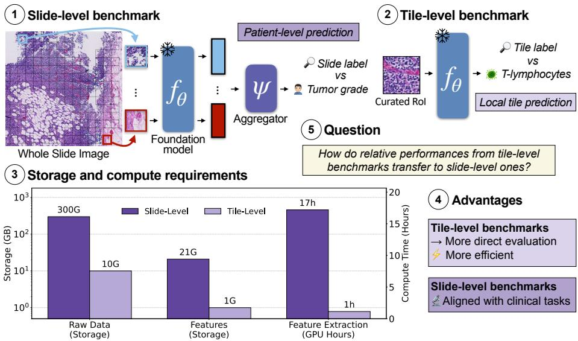
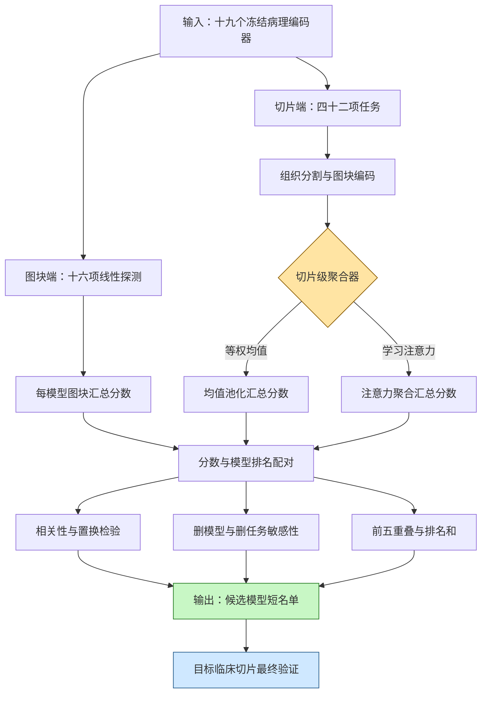

# 从图块到患者：数字病理中的 tile-to-slide 性能迁移研究

**原始题目**：From Patches to Patients: A study of the tile-to-slide performance transferability in Digital Pathology  
**作者**：Sofiène Boutaj、Leo Fillioux、Maria Vakalopoulou、Stergios Christodoulidis、Pierre Marza  
**会议**：MICCAI 2026（Early Accept）｜**年份**：2026  
**版本**：arXiv v1，2026-06-09  
**链接**：[arXiv 摘要](https://arxiv.org/abs/2606.10778)｜[论文 PDF](https://arxiv.org/pdf/2606.10778)｜[THUNDER 数据说明](https://mics-lab.github.io/thunder/#available-datasets)｜[Connected Papers](https://www.connectedpapers.com/main/2606.10778)

## 一句话总结

在同一组 19 个病理基础模型上，用 16 个 tile 任务的冻结特征线性探测做廉价排行榜，能够较好预测 42 个 slide-level 任务的总体排行榜；本文在 ABMIL 条件下观察到比 Mean Pooling 更多的中游重排，而单任务 top-5 通常只重叠 1–3 个，因此 tile 基准适合缩小候选而不能取代临床 slide 验证。

## 核心贡献

1. 用 19 个开源病理基础模型、16 个 tile 任务和 42 个 slide 任务，据作者所知首次开展大规模 tile-to-slide 排名迁移研究。
2. 将迁移拆成三种互补统计：Pearson 检查分数线性关系，Spearman 与 Kendall 检查秩序一致，并用双侧置换检验评估显著性。
3. 对两种 slide aggregation 分开报告：Mean Pooling 的 Spearman 为 0.925，ABMIL 为 0.814；作者将 ABMIL 下观察到的额外重排解释为任务特异可学习聚合带来的变异，但两种设置不足以支持“聚合器越强、迁移越差”的一般规律。
4. 通过删单模型、按 cohort／任务表现／每 slide tile 数删任务，定位相关性的稳定来源：cohort 大小与 bag 中 tile 数比平均任务难度更关键。
5. 用逐任务 top-5 overlap 与三端 rank-sum 把总体相关落到模型筛选决策：强／弱两端较稳，中游和上下文依赖任务仍须完整验证。

*图 1：slide 端使用整张 WSI 的 tile bag 与聚合器完成 slide-level 预测；tile 端在人工 ROI 上直接线性探测冻结特征。*

> 💡 **claude 批注｜基准先行叙事**: 论文先问“哪个便宜 benchmark 能预测昂贵 benchmark 的排序”，再讨论模型选择流程。它把 tile benchmark 视为一级筛查，把目标 cohort 的 slide benchmark 视为二级确证；这比只比较绝对分数更贴近实际研发决策，因为节省来自少跑若干候选编码器的完整 WSI 管线。

## 📖 批读导航

| 分节 | 内容 |
|---|---|
| [00 - 摘要](sections/00-abstract.md) | 任务定位、规模、proxy 的正确解释与 ReadySlide 对照 |
| [01 - 引言](sections/01-introduction.md) | WSI 管线成本、两套排行榜的对象差异、迁移定义 |
| [02 - 相关工作](sections/02-related-work.md) | 病理基础模型谱系、tile／slide benchmark 混杂因素、Table 1 |
| [03 - 从 patch 到 patient 的性能迁移](sections/03-patches-to-patients-performance-transferability.md) | 实验输入输出、统计方法、Figure 2–4、Table 2、失败条件与 ReadySlide 交叉空白 |
| [04 - 结论、局限与参考文献](sections/04-conclusion.md) | 适用边界、上下文错配、研究议程与完整参考文献 |

## 关键数字

| 项目 | 数值 | 如何解读 |
|---|---:|---|
| 基础模型 | 19 | 5 个视觉—语言、14 个纯视觉编码器 |
| tile 任务 | 16 | THUNDER，合计 2,202,752 个 tile |
| 单个 tile 数据集规模 | 408–367,229 | 数据量高度不均，汇总时每数据集等权 |
| slide 任务 | 42 | 来自 19 个 WSI 数据集、覆盖 10 个解剖部位 |
| 平均 slide／任务 | 343 | Table 1 的跨数据集描述量 |
| 平均 tile／slide | 9,922 | bag size 是迁移敏感因素之一 |
| 完整 slide 计算 | 超过 15,000 V100 GPU 小时 | 19 模型 × 全部预处理、特征提取和下游训练 |
| 平均原始存储 | slide 约 300 GB；tile 约 10 GB | Figure 1 的数据集平均值 |
| 平均特征存储 | slide 约 21 GB；tile 约 1 GB | Figure 1 的数据集平均值 |
| 平均特征提取 | slide 约 17 小时；tile 约 1 小时 | 单张 V100、每数据集每模型 |
| Mean Pooling 相关 | Spearman 0.925；Kendall 0.778；Pearson 0.967 | permutation $p=2\times10^{-4}$ |
| ABMIL 相关 | Spearman 0.814；Kendall 0.614；Pearson 0.874 | permutation $p=4\times10^{-4}$ |
| 指标稳健性 | 相关绝对变化不超过 2% | macro-F1 换成 balanced accuracy |
| top-5 重叠 | 通常 1／5–3／5 | Figure 4 未注明 slide 端 aggregator；可做 shortlist，不能精确复刻目标榜单 |

## 数据流：输入 → 中间表示 → 输出

> 💡 **claude 批注｜迁移量的严格含义**: 对编码器 $m$，tile 端先得到跨 16 数据集等权平均的 $T_m$；slide 端先在每个 WSI 数据集内部平均多任务 macro-F1，再跨 19 个数据集平均为 $S_m$。所谓 tile-to-slide transfer，是在 19 个模型上比较成对的 $(T_m,S_m)$ 分数与秩次。它不是单个 tile 预测直接变成单张 slide 预测的样本级传递。

## ReadySlide 专项：保持共同排名对象的两类问题

### A 类：全包到预算端的 pipeline 排名迁移

先固定预算端使用的 selector $s$ 与非退化预算 $k$，候选对象始终是同一组 encoder–consumer pipelines $P$。对每个 $p\in P$，全包端记录消费完整 tile bag 的 slide-level 分数 $F_{full}(p)$；预算端用同一个 $s$ 和 $k$ 产生输入，记录 $F_{budget}(p\mid s,k)$。Pearson、Spearman、Kendall 与 top-k overlap 都在同一候选集合 $P$ 上比较，因此一一配对是有定义的。失败分别表示 pipeline 分数关系弱、pipeline 两两次序翻转或前列 pipeline 交集不足。

### B 类：跨非退化预算的 selector 排名稳定性

固定 encoder $e$ 与 consumer $c$，候选对象改为同一组 selectors $S$。选择两个都小于 full-bag 的非退化预算 $k_1$、$k_2$，比较 $\{F(s\mid e,c,k_1):s\in S\}$ 与 $\{F(s\mid e,c,k_2):s\in S\}$ 的分数、秩次和 top-k。full-bag 时所有 selector 都看到完整 bag，不存在有辨识力的“full-bag selector ranking”，因此不能拿它与预算化 selector 榜做相关。

每个 selector 仍可相对同一个 full-bag 基线报告性能保持率或遗憾，例如 $F(s\mid e,c,k)/F_{full}(e,c)$ 与 $F_{full}(e,c)-F(s\mid e,c,k)$；这两个量衡量相对全包性能损失，但不制造 full-bag selector 名次。

### 两类问题共用的统计要求

1. permutation test 必须打乱同一候选对象两端的配对，而不能在 pipeline 与 selector 两种对象之间置换。
2. 若 ReadySlide 明确按 patient ID 完成数据切分、指标聚合与重采样，可使用 patient-level paired bootstrap 为相关系数、性能差、保持率／遗憾和 top-k overlap 给出置信区间。
3. A 类沿固定 selector 的预算轨迹检查 pipeline 排名何时失稳；B 类在多个非退化预算间检查 selector 排名交叉。
4. 两类分析都应按 cohort 大小、完整 bag 大小、病灶稀有度、空间分散度与任务类型分层，并预先给出临床性能容忍线。

### 本文没有覆盖的角色交叉

| 固定条件 | 改变条件 | 应回答的问题 | 本文是否覆盖 |
|---|---|---|---|
| consumer、budget | selector | 哪个选择策略最能保留 slide-level 信号？ | 否；tile 端没有 selector |
| selector、budget | consumer | 同一批 tile 对 Mean Pooling、ABMIL、上下文模型是否同样有效？ | 否；两种聚合器只消费 full bag |
| selector、consumer | budget | 排名在何种预算开始翻转？ | 否；没有预算轴 |
| budget | selector × consumer | 最优组合是否存在交互，而非各自独立最优？ | 否 |
| selector × consumer × budget | 病种／中心／scanner | 排名能否跨临床域迁移？ | 否 |

> 💡 **claude 批注｜关键推论**: 本文观察到的 tile 表征榜与 full-bag slide 榜总体关联，不等于任意预算下的 selector 榜可由 full-bag 结果推出。ReadySlide 必须先声明候选对象：A 类始终排同一批 pipelines；B 类始终排同一批 selectors，并只在非退化预算之间比较。selector × consumer × budget 的交叉用于检验交互，但不能把不同候选集合塞进同一个相关系数。

## 优缺点与还能做什么

### 优点

- **问题定义贴近研发流程**：关注排行榜能否迁移，直接服务于“先筛谁、后验证谁”的资源分配。
- **规模与协议统一**：同一组 19 个模型覆盖 58 项任务，并用 TRIDENT／PathoBench 统一 slide 端处理，减少跨论文拼表的不可比性。
- **统计不只一个相关系数**：同时报告分数、秩序、显著性、删减敏感性、top-5 与 rank-sum，证据链完整。
- **主动保留终端验证**：作者没有把高总体相关包装成 tile benchmark 可以替代临床评测。

### 局限与风险

- tile 任务偏局部形态，和需要空间组织、稀有模式的 slide 任务语义不完全配对；immune profiling 的 top-5 重叠较低已暴露这一点。
- 相关样本单位只有 19 个模型，且使用跨任务聚合分数；置换显著不等于对新模型、新中心或单任务具有窄置信区间。
- 只测 Mean Pooling 与 ABMIL，尚不能外推到上下文 Transformer、图网络、slide foundation model 或端到端微调 consumer。
- task ablation 表明大 cohort 与高 tile 数任务支撑相关，但二者可能混合了统计稳定性、bag complexity 与任务构成，因果解释仍不充分。
- top-5 只部分重叠，论文也没有给出 shortlist 大小、误淘汰强模型风险与实际成本之间的最优决策规则。

### 还能做什么

- 对 A 类问题固定 selector 与 budget，只比较同一组 encoder–consumer pipelines 在 full-bag 与 budgeted 两端的 Pearson、Spearman、Kendall 和 top-k overlap。
- 对 B 类问题固定 encoder 与 consumer，只比较同一组 selectors 在两个或多个非退化预算间的排名，并分别报告每个 selector 相对 full-bag 基线的 performance retention／regret。
- 在上述共同对象约束下展开 selector × consumer × budget 完全交叉，区分 pipeline 排名迁移、selector 跨预算稳定性和角色交互三种结论。
- 若 ReadySlide 明确以 patient ID 进行切分和指标聚合，再报告 patient-level 诊断效用、病灶召回、组织多样性、空间覆盖、冗余度和每 patient 时延，并在外部中心做 paired bootstrap。
- 比较固定预算、动态早停预算和等算力预算；排名若随预算交叉，应报告 Pareto 前沿而非单一总榜。
- 将候选短名单决策形式化为成本敏感问题：在可接受的强模型漏选概率下，寻找最小的 slide 端复验集合。

## 阅读 Q&A 记录

- **Q：本文的“性能迁移”到底迁移什么？**  
  A：迁移的是同一组编码器在 tile 汇总 benchmark 与 slide 汇总 benchmark 上的相对分数／排名，不是模型参数，也不是单个 tile 预测直接变成 slide-level 预测。定义见实验部分的 $T_m$、$S_m$ 与 Figure 2。

- **Q：为什么同时要 Pearson、Spearman 和 Kendall？**  
  A：Pearson 判断绝对分数是否有线性对应；Spearman 判断整体秩次是否单调一致；Kendall 统计模型两两顺序的一致程度。对 shortlist 而言，后两者通常比只看 Pearson 更直接。

- **Q：0.814 的 ABMIL Spearman 是否足够直接选榜首？**  
  A：不够。0.814 是 ABMIL 条件下跨模型总体排名的相关，不能保证具体任务第一名不翻转。Figure 4 另行显示单个 tile／slide 任务对的 top-5 通常只共享 1–3 个模型，但论文没有注明该图的 slide 端 aggregator，不能把 Figure 4 专门归因于 ABMIL。

- **Q：什么因素比“任务平均难度”更影响迁移？**  
  A：Figure 3 的 task ablation 显示，先移除大 cohort 或高 tile 数任务会更早降低相关，而按平均任务表现删除初期较稳，说明统计样本量和 bag 信息结构更关键。

- **Q：ABMIL 为什么会降低迁移？**  
  A：本文在 ABMIL 下观察到较低相关和更多中游重排；作者解释为 gated attention 的任务特异可学习参数会重新取舍不同编码器的信息。Figure 2 与 Table 2 支持这两个设置间的观察，但不能据此推出 consumer 越强或越复杂，迁移就必然越差。

- **Q：这篇论文能否证明 ReadySlide 的预算化排名会继承 full-bag 排名？**  
  A：不能直接证明。若问 pipeline 排名，必须固定 selector 与预算，并在两端比较同一组 encoder–consumer pipelines；若问 selector 排名，则要固定 encoder／consumer，在不同非退化预算之间比较同一组 selectors，并用 retention／regret 对照 full-bag 基线。本文没有显式 selector、预算轴或这些交叉实验。

## 📊 Citation Landscape

> 数据抓取时间：**2026-08-19 UTC**。Semantic Scholar 的 references 与 recommendations 接口成功；paper detail／TLDR 接口连续返回 HTTP 429。references API 返回 40 条记录，其中 1 条是异常自标题记录；它未完整覆盖正文 41 条参考文献。下列引用数来自成功返回的 payload，均为动态值；未成功获取的字段明确标为不可用，不以其他网站数字代填。

### 论文级统计

| 字段 | 结果 |
|---|---|
| Semantic Scholar TLDR | 暂不可用：paper detail 接口 HTTP 429 |
| 参考文献数 | references API 返回 40 条，其中 1 条为异常自标题记录；正文编号参考文献为 41 条。API 未覆盖 *Foundation models for histopathology—fanfare or flair* 与 *EVA: Evaluation framework for pathology foundation models*，因此不可把 API 记录数当作完整正文参考文献数 |
| 被引次数 | 暂不可用：paper detail 接口 HTTP 429 |
| influential citation count | 暂不可用：paper detail 接口 HTTP 429 |

### 高引用参考文献分组

以下每组按 Semantic Scholar 在抓取时返回的 `citationCount` 降序，最多列 5 篇。

#### 通用表征与聚合方法

| 论文 | 年份 | 引用数 |
|---|---:|---:|
| [Learning Transferable Visual Models From Natural Language Supervision](https://arxiv.org/abs/2103.00020) | 2021 | 54,200 |
| [DINOv2: Learning Robust Visual Features without Supervision](https://arxiv.org/abs/2304.07193) | 2023 | 9,892 |
| [Attention-based Deep Multiple Instance Learning](https://arxiv.org/abs/1802.04712) | 2018 | 2,764 |
| [Do Multiple Instance Learning Models Transfer?](https://arxiv.org/abs/2506.09022) | 2025 | 38 |
| [THUNDER: Tile-level Histopathology image UNDERstanding benchmark](https://arxiv.org/abs/2507.07860) | 2025 | 12 |

#### 病理基础模型

| 论文 | 年份 | 引用数 |
|---|---:|---:|
| [Towards a General-Purpose Foundation Model for Computational Pathology](https://doi.org/10.1038/s41591-024-02857-3) | 2024 | 1,743 |
| [A visual-language foundation model for computational pathology](https://doi.org/10.1038/s41591-024-02856-4) | 2024 | 1,122 |
| [A whole-slide foundation model for digital pathology from real-world data](https://doi.org/10.1038/s41586-024-07441-w) | 2024 | 1,036 |
| [A foundation model for clinical-grade computational pathology and rare cancers detection](https://doi.org/10.1038/s41591-024-03141-0) | 2024 | 595 |
| [A Pathology Foundation Model for Cancer Diagnosis and Prognosis Prediction](https://doi.org/10.1038/s41586-024-07894-z) | 2024 | 578 |

#### 数据资源与 benchmark

| 论文 | 年份 | 引用数 |
|---|---:|---:|
| [The Cancer Genome Atlas: an immeasurable source of knowledge](https://doi.org/10.5114/wo.2014.47136) | 2015 | 3,983 |
| [Diagnostic Assessment of Deep Learning Algorithms for Detection of Lymph Node Metastases](https://doi.org/10.1001/jama.2017.14585) | 2017 | 3,211 |
| [The CPTAC Data Portal](https://doi.org/10.1021/pr501254j) | 2015 | 499 |
| [Benchmarking Self-Supervised Learning on Diverse Pathology Datasets](https://arxiv.org/abs/2212.04690) | 2022 | 243 |
| [A clinical benchmark of public self-supervised pathology foundation models](https://doi.org/10.1038/s41467-025-58796-1) | 2024 | 156 |

### Semantic Scholar 推荐论文

Recommendations API 返回的前 10 篇如下；它们反映 2026-08-19 的动态推荐结果，不代表本文作者背书。

1. [Pretraining Multiple Instance Learning Networks with Multi-Teacher Distillation from Pathology Slide Foundation Models](https://arxiv.org/abs/2607.14703)（2026，引用 0）
2. [Turning Pre-Trained Vision Transformers into End-to-End Histopathology Whole Slide Image Models for Survival Prediction](https://www.semanticscholar.org/paper/bf7fb8e0561c87f313a78f2c5757ed371b9fbb85)（年份未返回，引用 1）
3. [Understanding Synergistic Interactions among Pathology Foundation Models via Adaptive Fusion](https://arxiv.org/abs/2608.01370)（2026，引用 0）
4. [ProsMAE: Multi-Source MAE Pretraining for ISUP Grade Classification](https://arxiv.org/abs/2607.08162)（2026，引用 0）
5. [Objective Design for Self-Supervised Slide-Level Aggregation over Frozen Pathology Foundation Features](https://www.semanticscholar.org/paper/802f36329f348d615bf3cfb13aebe7378af6d524)（年份未返回，引用 0）
6. [Multi-Teacher Contrastive Distillation for Edge-Efficient Pathology Foundation Models](https://arxiv.org/abs/2607.05533)（2026，引用 0）
7. [Domain Generalization of Histopathology Foundation Models in Multicenter, Multi-Scanner Cohorts](https://doi.org/10.3390/jimaging12080381)（2026，引用 0）
8. [GigaPath-Flash and GigaTIME-Flash: Efficient Pathology Foundation Models for Whole-Slide and Tumor Microenvironment Analysis](https://arxiv.org/abs/2607.18218)（2026，引用 0）
9. [AI-Based Whole Slide Image Analysis for Automated Breast Cancer Classification](https://doi.org/10.1109/ACCESS.2026.3715392)（2026，引用 0）
10. [Auditing Data Leakage in Whole-Slide Image Multimodal Benchmarks](https://arxiv.org/abs/2607.12278)（2026，引用 0）

### 版图解读

本文位于三条文献链的交点：一端是 DINO／CLIP／ABMIL 等表征与聚合方法，一端是 UNI、CONCH、GigaPath、Virchow 等病理基础模型，另一端是 THUNDER、PathoBench 及临床 WSI benchmark。它的独特贡献不是再增加模型节点，而是测量“局部表征榜 → slide-level 任务榜”的排行榜边。对 ReadySlide，尚未覆盖的两条边必须分开：固定 selector／budget 后，同一组 encoder–consumer pipelines 的 full-bag→budgeted 排名迁移；固定 encoder／consumer 后，同一组 selectors 在不同非退化预算间的排名稳定性与相对 full-bag 的 retention／regret。
