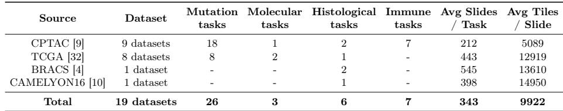

[← 返回 README](../README.md)

# 2 相关工作

> 💡 **claude 批注｜阅读预览**: 相关工作区分两类病理基础模型（视觉自监督、视觉—语言对齐）和两类评测（tile、slide）。本文的新意不在提出第三类模型，而在把两套长期并行的评测结果放到同一组模型上做排名迁移分析。

## 2 Related work

Foundation models in digital pathology — are trained in a self-supervised manner on large datasets spanning multiple organs, scanning protocols and centers. They can be divided into two categories: (i) vision-only [7,34,41,29,12], [13,25,20,33,35,38] trained with DINO-style objectives [27], and (ii) vision-language encoders [22,8,40,17,16,37,30] optimized with CLIP-style losses [28]. Such models are then used as powerful feature extractors for a variety of downstream tasks such as cancer sub-typing or gene mutation prediction.

> 💡 **claude 批注｜模型轴**: 19 个候选同时包含 vision-only 与 vision-language 编码器，意味着相关性并非只在单一预训练范式内部计算。Figure 2 还以颜色区分二者、以点大小表示参数规模，可检查排行榜一致性是否只是“更大模型普遍更好”造成的表面现象；正文后续的 leave-one-model-out 则进一步排除单个异常模型支配相关性。

Benchmarking foundation models — With the recent surge of foundation models in digital pathology, systematic evaluation has become a bottleneck. This has led the community to search for methods of comparing them to answer two main questions: (i) Which direction should the field take to build betterperforming models?, and (ii) which models should practitioners use to get the best results? A common approach is to benchmark foundation models on slidelevel tasks [36,19,26,15,3,14,5,21,23,2,39,6]. These are clinically relevant, but require to couple a slide-level aggregator to existing tile-level foundation models to perform predictions. This induces additional computational constraints and also makes the assessment of the impact of the features from the foundation model itself less direct as many choices related to the design of the aggregator are to be made. Tile-level benchmarks [14,24] are another alternative. They are generally more eficient and provide a more direct comparison of foundation model representation spaces, as they isolate their impact from any aggregation method.

> 💡 **claude 批注｜混杂因素**: slide 端排行榜不是纯编码器排行榜：tissue segmentation、切片尺寸、聚合器结构、训练折分和优化方差都会改变结果。本文用统一的 TRIDENT／PathoBench 协议并只比较 Mean Pooling 与 ABMIL，尽量控制这些因素；但这也意味着结论只覆盖这两类 consumer，不能自动外推到空间图网络、上下文 Transformer 或带端到端微调的诊断器。

*Table 1: Detailed summary of the 19 slide-level WSI datasets (42 tasks), including average number of slides per task and average number of tiles per slide.*

> 💡 **claude 批注｜Table 1 数据构成**: 42 项 slide 任务来自 CPTAC、TCGA、BRACS 和 CAMELYON16 共 19 个 WSI 数据集，按 mutation／molecular／histological／immune 四类计数为 26／3／6／7。平均每任务 343 张 slide、每 slide 9,922 个 tile；不同来源的 cohort 与 bag 大小差异很大，这正是后续任务删减实验要检验的统计可靠性与 bag complexity 来源。

However, it remains unclear whether these two benchmarking paradigms lead to consistent conclusions when comparing foundation models. To the best of our knowledge, we present the first large-scale study of tile-to-slide (patch-to-patient) performance transferability.

> 💡 **claude 批注｜ReadySlide 空白定位**: 本文填的是“局部表征 benchmark 与全包 slide benchmark 是否同序”。ReadySlide 仍需补 selector × consumer × budget 交叉，但每次相关都要保持候选对象相同：pipeline 迁移固定 selector／budget，selector 稳定性固定 encoder／consumer 并只比较非退化预算。三个角色改变的是输入分布与信息瓶颈，不能由这里的 encoder-only 相关性代替验证。

## 本节小结

- 已控制：同一批编码器、统一 slide 预处理／评测协议、两种代表性聚合器。
- 仍未控制：更复杂 consumer、不同 selector、不同预算、跨中心分布偏移。
- 可复用判断：代理基准若隔离了某个模块，迁移到端到端系统时就必须显式量化该模块重新引入后的排行榜扰动。
