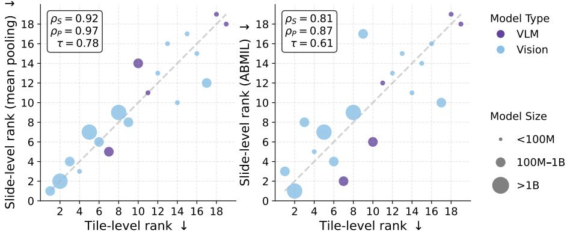
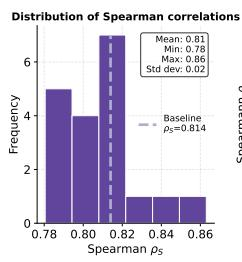
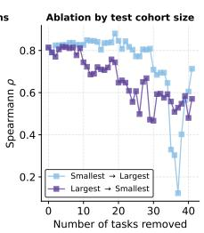
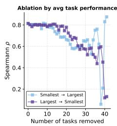
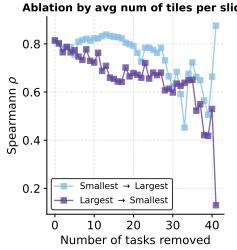
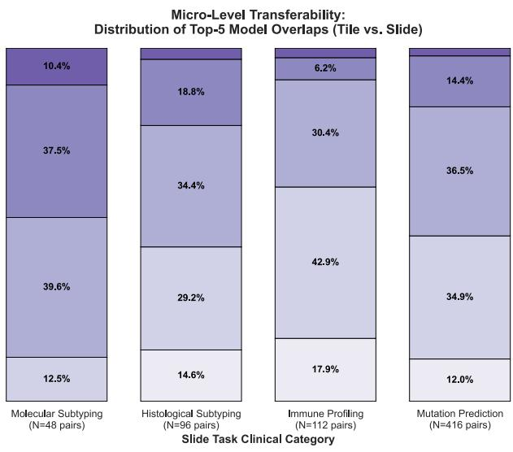
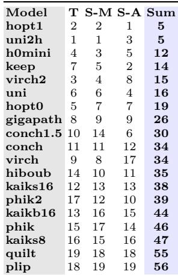

[← 返回 README](../README.md)

# 3 从 patch 到 patient 的性能迁移

> 💡 **claude 批注｜本节路线**: 本节先构造 tile 汇总分数 $T_m$ 和 slide 汇总分数 $S_m$，再沿五条证据链判断迁移是否可信：全局相关、删单模型、按任务属性删减、逐任务 top-5 重叠、三端 rank-sum 共识。读结果时要把“总体排行榜高度相关”与“具体临床任务精确选中同一前五”分开。

## 3 Patches to patients performance transferability

### 3.1 Experimental setup

> 💡 **claude 批注｜实验输入**: 模型轴是 19 个冻结编码器；tile 任务轴是 THUNDER 的 16 个带局部标签数据集；slide 任务轴是 19 个 WSI 数据集上的 42 个任务。所有排名迁移统计都来自这个 19 模型的共同候选集合，因此新增模型、换任务族或换数据域后需要重新估计。

Foundation Models — We benchmark 19 recent pathology Foundation Models (FMs), covering both visual-only encoders and vision-language models. The set includes five vision-language models – CONCH (v1, v1.5) [22], KEEP [40], PLIP [16], QuiltNet [17] – and 14 vision-only encoders – ProvGigaPath [38], H-Optimus (0 and 1) [29], Hibou-Base [25], H0-mini [11], Kaiko (ViT-S and ViT-B variants) [1], Phikon (v1, v2) [12,13], UNI (v1, v2) [7], and Virchow (v1, v2) [34]. Benchmarks and Tasks — For the tile-level evaluation, we include all patchlevel classification tasks from the THUNDER benchmark [24], totaling 16 datasets (16 tasks) covering a broad range of tissue origins and tasks (e.g., tumor detection, histologic pattern recognition). In total, all datasets contain 2,202,752 tiles, with dataset sizes ranging from 408 to 367,229 samples. The details about the considered datasets are presented in [24] and on the THUNDER documentation†.

> 💡 **claude 批注｜tile 端输出**: 每个模型在每个 THUNDER 数据集上用冻结 embedding 训练线性分类器，得到 macro-F1；16 个数据集直接平均形成该模型的 $T_m$。它测的是“局部形态标签能否被线性读出”，不是从整张 slide 中找 tile，也没有预算选择过程。

The slide-level analysis involves 42 tasks drawn from 19 WSI datasets (see Table 1). Collectively, these slide-level datasets cover 10 anatomical sites (breast, lung, colon/rectum, kidney, ovary, uterus, brain, stomach, pancreas, and head & neck). Following the standard PathoBench protocol [39], we evaluate the CPTAC tasks using a 50-fold train/test split, while employing 5-fold cross-validation for all other WSI datasets. For all splits, we ensure there is no data leakage between the training and test sets.

> 💡 **claude 批注｜统计单位**: CPTAC 用 50 次 train/test split，其余用 5 折交叉验证，先产生 slide-level 任务预测与 macro-F1。论文说明训练集与测试集之间无数据泄漏；这里沿用正文明确给出的 slide-level task／score，不从论文标题另行提升指标的统计单位。

Downstream tasks evaluation — The tile-level tasks derived from THUNDER [24] are implemented as linear probing on frozen tile embeddings. For slide-level tasks, we rely on the open-source TRIDENT library [39] to preprocess raw WSIs, including tissue segmentation, patching, and feature extraction. All WSIs are processed at 20× magnification. Tile size is automatically selected according to the architectural requirements of each foundation model, using one of {224 × 224, 256 × 256, $5 1 2 \times 5 1 2 \}$ pixels. Slide-level evaluation is performed with the PathoBench framework [39], using its default implementations of two aggregation strategies: (i) mean pooling with linear probing, where we compute a mean feature vector and train a linear classifier on the pooled vector; and (ii) attention-based MIL (ABMIL) [18], where we learn a gated attention mechanism that assigns a weight to each tile embedding and aggregates them into a slide representation, followed by a linear classification head (single attention head, projection dimension 512, and pre-classification dropout 0.25). We select ABMIL as it remains highly efective in practice, with prior studies demonstrating that its performance is often on par with more complex MIL architectures [31], making it a robust and suficient baseline for our evaluation. Overall, the pre-processing, feature extraction, and downstream training across all slide-level tasks and foundation models required more than 15,000 V100 GPU-hours.

> 💡 **claude 批注｜两种 aggregation 的机制差异**: Mean Pooling 对 bag 内所有 tile 等权求均值，再在线性头上学习任务；ABMIL 则学习 gated attention，为每个 tile 赋任务相关权重后汇聚为 512 维投影表征，并加 0.25 dropout。本文在 ABMIL 下观察到较低相关和更多中游重排，作者将其解释为任务特异可学习聚合带来的额外变异；只有 Mean Pooling 与 ABMIL 两个设置，不能推出模型越复杂或 consumer 越强就越易重排的单调关系。

> 💡 **claude 批注｜成本与 ReadySlide 类比**: 论文的 slide 端是 full-bag setting：每张 WSI 的所有组织 tile 都完成特征提取，再由 Mean Pooling 或 ABMIL 聚合。ReadySlide 若研究 full-bag→budgeted 迁移，应固定 budgeted 端 selector 与预算，并在两端排序同一组 encoder–consumer pipelines；若研究 selector 排名，则应固定 encoder／consumer，在两个非退化预算间排序同一组 selectors，并以 retention／regret 对照共同 full-bag 基线。本文的 15,000+ V100 GPU-hours 说明代理筛选动机，却没有实测任一预算轴。

Metrics — For the slide-level evaluation, as it involves multiple datasets with varying numbers of tasks, we first compute the mean macro-F1 within each dataset, and subsequently average these intra-dataset means, preventing any single dataset from skewing the global WSI score, that we denote $S _ { m }$ . For the tile-level benchmark, the aggregated score $T _ { m }$ is computed as the macro-F1 averaged across the 16 individual datasets in THUNDER.

> 💡 **claude 批注｜汇总分数定义**:
> - 对模型 $m$，$T_m$ 是 16 个 tile 数据集 macro-F1 的等权平均。
> - $S_m$ 先在同一 WSI 数据集内部平均其多个任务，再对 19 个 slide 数据集等权平均，避免拥有更多任务的数据集主导总分。
> - 因此二者都是“benchmark-level aggregate”，不是任一具体 tile／slide 任务的分数；全局高相关不能直接推出任意任务对都高相关。

Conducted analyses — Our main experiment is about (i) quantifying the overall tile-to-slide transferability. For that, we analyze the relationship between the tile summary $T _ { m }$ and the slide summary $S _ { m }$ across all evaluated FMs. We report the correlation of performance values across models using three metrics: Pearson’s $\rho _ { P }$ for the tile-to-slide performance linear relationship, and Spearman’s ρS and Kendall’s τ for tile-to-slide rank-order consistency. We assess significance using a two-sided permutation test. Beyond this, we perform the following complementary analyses: (ii) Leave-one-model-out sensitivity analysis: recompute the correlation after removing each FM to ensure results are not driven by a single model. (iii) Task-ablation sensitivity: track correlation as slide tasks are removed based on cohort size, number of tiles per slide, and average task performance to identify key dataset factors for tile-to-slide performance transferability. (iv) Top-5 shortlist utility: compute the overlap between top-5 tile-level and top-5 slide-level models for each tile/slide task pair. (v) Ranksum consensus: aggregate ranks across Tile, Mean Pooling, and ABMIL to highlight consistently strong models and where reordering concentrates.

> 💡 **claude 批注｜统计方法逐项对应问题**:
> - Pearson 检查 $T_m$ 与 $S_m$ 的数值是否近似线性，不只看名次。
> - Spearman 检查单调秩一致，Kendall 更直接统计模型对的顺序是否一致。
> - 双侧 permutation test 在“两个排行榜无关联”下打乱配对，检验观察到的相关是否偶然。
> - leave-one-model-out 检查单个强／弱模型是否制造相关；task ablation 检查哪些数据属性支撑相关；top-5 overlap 则把总体统计落到 shortlist 决策。

> 💡 **claude 批注｜失败判据**: ReadySlide 需按共同候选对象分别定义失败。A 类在固定 selector／budget 后，对同一组 pipelines 检查 full-bag 与 budgeted 分数的 Pearson、pipeline 秩次的 Spearman／Kendall 和 pipeline top-k overlap；B 类固定 encoder／consumer，对同一组 selectors 检查两个非退化预算间的相同指标，并报告各 selector 相对 full-bag 的 retention／regret。不同候选对象之间不计算相关。

### 3.2 Results

Global rank correlation between tile-level and slide-level benchmarks Fig. 2 reports the rank agreement between tile-level linear probing and slidelevel performance across 19 foundation models. Using mean pooling for slide aggregation $( l e f t )$ , the model ordering is highly preserved, with points tightly concentrated around the identity line and strong correlations $( \rho _ { S } = 0 . 9 2 5 , \tau = 0 . 7 7 8 .$ $\rho _ { P } = 0 . 9 6 7 ;$ permutation $p = 2 \times 1 0 ^ { - 4 }$ for all). This indicates that, under a simple aggregation scheme, slide-level success is largely determined by the intrinsic quality of the frozen tile representations. When switching to ABMIL (right), the correspondence remains significantly positive but is weaker $( \rho _ { S } = 0 . 8 1 4$ $\tau = 0 . 6 1 4 , \rho _ { P } = 0 . 8 7 4 ;$ permutation $p = 4 \times 1 0 ^ { - 4 }$ for all), with larger departures from the diagonal. This suggests that learning a more expressive MIL aggregator introduces additional variability that can alter relative performance, particularly among mid-ranked models. The results are robust to the choice of evaluation metric: when replacing macro-F1 with balanced accuracy, the resulting correlations remain within a maximum absolute deviation of $\leq 2 \%$ from the macro-F1 correlations (with permutation p-values remaining highly significant). Moreover, the very high Pearson correlation $( \rho _ { P } = 0 . 8 7 4$ for ABMIL and $\rho _ { P } = 0 . 9 6 7$ for mean pooling) indicates a strong linear relationship between tile-level and slide-level performance. This confirms that tile-level benchmarking provides reliable quantitative information about downstream slide-level performance. Overall, these results support tile-level probing as an eficient proxy for slide-level model benchmarking while highlighting that rank transferability depends on the complexity of the aggregation method. Importantly, as slide-level predictions are performed from aggregated tile embeddings, our results validate that high-quality tile representations (evaluated on tile-level benchmarks) naturally lead to strong slide-level performance.

  
*Fig. 2: Rank correlation between slide-level and tile-level benchmarks. Comparing the rank across 19 models on a set of tile-level and slide-level tasks. Slide-level aggregation is performed via mean-pooling $( l e f t )$ and ABMIL $( r i g h t )$ ; measured by Spearman $( \rho _ { S } )$ , Pearson $\left( \rho _ { P } \right)$ , and Kendall’s τ .*

> 💡 **claude 批注｜Figure 2 主结果**: Mean Pooling 的 Spearman／Kendall／Pearson 为约 0.92／0.78／0.97，ABMIL 为约 0.81／0.61／0.87。两图都显著，且本文在 ABMIL 条件下观察到更多中游点偏离对角线；作者解释为任务特异可学习聚合引入额外变异。balanced accuracy 替代 macro-F1 后相关绝对变化不超过 2%，但这两个 aggregator 设置不足以建立 aggregation 能力与重排程度的单调因果关系。

> 💡 **claude 批注｜不能过度解释相关性**: 19 个模型只提供 19 个相关样本点，而且 $T_m$ 与 $S_m$ 都是多任务聚合量。显著 $p$ 值说明配对关系不像随机，但不提供新模型或新医院 cohort 上的外推置信区间；也不能从 Pearson 0.87 推出单张 slide 预测有 87% 一致。

Comprehensive sensitivity analysis of ABMIL transferability — Fig. 3 shows that ABMIL tile-to-slide rank correlation is robust and not driven by any single encoder. In the leave-one-model-out analysis (left), Spearman remains near the baseline $\left( \rho _ { s } \approx 0 . 8 1 4 \right)$ with limited variation. Task-ablation trajectories further show that correlation is more sensitive to test cohort size and number of tiles per slide than to average slide-task performance. Indeed, removing large-cohort tasks first, or high-tile-count tasks first, causes an earlier drop in correlation (including an approximate 10% decrease before 10 removed tasks), whereas performance-based ablation is initially stable. This suggests transferability is supported more by statistical reliability and bag complexity than by task dificulty alone.

<table><tr>
<td width="25%"></td>
<td width="25%"></td>
<td width="25%"></td>
<td width="25%"></td>
</tr><tr>
<td align="center"><i>Figure 3a：删单模型</i></td>
<td align="center"><i>Figure 3b：按 cohort 大小删任务</i></td>
<td align="center"><i>Figure 3c：按任务表现删任务</i></td>
<td align="center"><i>Figure 3d：按每 slide tile 数删任务</i></td>
</tr></table>

*Fig. 3: Comprehensive sensitivity analysis of tile-to-slide performance correlation on ABMIL. From left to right: (1 ) Leave-One-Model-Out sensitivity distribution demonstrating a stable Spearman correlation $\left( \rho _ { s } \right)$ when individual foundation models are removed. The remaining plots show correlation trajectories when slide-level tasks are iteratively removed (smallest-to-largest vs. largest-to-smallest) based on: (2 ) test cohort size, (3 ) average task performance, and (4 ) average number of tiles per slide.*

> 💡 **claude 批注｜Figure 3 敏感性结论**: 删去任一编码器后 Spearman 均值约 0.81、范围约 0.78–0.86，说明相关性不是由一个极端点撑起。按 cohort 或每 slide tile 数从大到小删除，会比反向删除更早破坏相关，且未删满 10 个任务前已约降 10%；按平均任务表现删减初期较稳定。这里“更多 tile 支撑迁移”可能同时代表更复杂／更充分的 bag 信息与更稳的模型区分度，不能直接解释为 task 越难越好。

  
*Fig. 4: Micro-Level Transferability of Top-5 Histopathology Models. Distribution of model overlap between tile-level and slide-level tasks, stratified by slide task clinical category. For each evaluated pair of tile and slide tasks, the intersection of the top 5 highest-performing models was computed.*

> 💡 **claude 批注｜Figure 4 shortlist 而非复刻**: 每个 tile 任务与每个 slide 任务组成一对，分别取前五模型并计算交集。四类临床任务大多落在共享 1–3 个模型，而不是 5／5；immune profiling 的低重叠更多，符合免疫任务依赖空间组织和稀有模式、tile 局部标签覆盖不足的解释。论文未注明 Figure 4 的 slide 端使用哪一种 aggregator，因此不能把该 top-5 分布专列为 ABMIL 结果。它支持 shortlist 后仍做 slide 验证，不支持直接宣布 tile 榜首为临床榜首。

*Table 2: Rank Sum Analysis of Histopathology Models (Tile vs Mean Pooling vs AB-MIL) – T: tile-level rank, S-M: Meanpool slide-level rank, S-A: ABMIL slide-level rank*

> 💡 **claude 批注｜Table 2 排名共识**: 将 Tile、Mean Pooling、ABMIL 三列名次相加后，hopt1 与 uni2h 同为 5，形成稳定第一梯队；h0mini 为 12，随后 keep、virch2、uni、hopt0。conch1.5 在 ABMIL 升至第 6、virch 在 ABMIL 降至第 17，展示了本实验 ABMIL 设置中的中游重排；quilt 与 plip 在三端均靠后。该两设置比较不构成“consumer 能力越强、重排越大”的普遍结论。

Micro-level transferability of top-5 models — Complementing the global correlation analysis, Fig. 4 studies the agreement in best-performing models between tile- and slide-level tasks. For each tile/slide task pair, we compute the overlap between the top-5 tile- and slide-level models. Overlap is mostly partial (typically 1/5–3/5 shared models), indicating that tile-level benchmarks help shortlist strong candidates even without exactly recovering the slide-level top-5.

Overlap is higher for molecular subtyping and mutation prediction and lower for immune profiling. A likely reason is that tile and slide tasks may require diferent encoder information: tile tasks emphasize local morphology, whereas slide tasks may depend more on tissue architecture, spatial organization, rare patterns, and long-range context. Thus, lower overlap does not contradict transferability; it highlights the limits of using tile-level signals for exact top-model identification on heterogeneous slide tasks.

> 💡 **claude 批注｜全局与微观为何能同时成立**: 全局相关用每个模型跨任务平均后的一个点，容易保留强—中—弱的大尺度顺序；top-5 overlap 在单个任务对上计算，暴露局部形态与空间／分子需求错配。两者回答不同粒度的问题，而且 Figure 4 未注明 slide aggregator，不能把其 1–3 个重叠结果与 ABMIL 的 Spearman 0.814 绑定成同一设置的证据。

Rank-sum consensus across Tile, Mean Pooling, and ABMIL — Table 2 complements the correlation analysis by summarizing model behavior via a ranksum criterion. It reveals a stable top tier, with hoptimus1 and uni2h tied for best, followed by a compact group (h0mini, keep, virchow2, uni, hoptimus0) that remains strong across all three settings.

Most reordering occurs in the middle of the ranking, particularly under AB-MIL. For example, keep and conch1.5 improve under ABMIL, whereas virchow drops substantially. This confirms that tile-level benchmarking provides a strong consensus prior for model selection, while ABMIL mainly scrambles mid-ranked models. At the lower end, quilt and plip consistently rank last, confirming that tile-to-slide transferability preserves both the top and bottom of the leaderboard.

> 💡 **claude 批注｜ReadySlide 三角色交叉实验**: selector × consumer × budget 可以完全交叉，但每个排名问题必须固定候选对象。A 类固定 budgeted 端 selector／budget，在两端比较同一组 encoder–consumer pipelines；B 类固定 encoder／consumer，在两个非退化预算间比较同一组 selectors，并分别报告 retention／regret。若 ReadySlide 明确按 patient ID 切分与聚合，可在这两类配对上做 patient-level bootstrap。full-bag 不产生 selector 名次，本文也没有覆盖这些交叉。

> 💡 **claude 批注｜Q&A 批注记录**:
> - Q: 为什么 Mean Pooling 的迁移高于 ABMIL？
> - A: 本文在 Mean Pooling 下观察到更高相关，在 ABMIL 下观察到更多中游重排；作者解释为 ABMIL 的任务相关权重会重新取舍不同编码器的信息。答案对应 Figure 2 与 Table 2，但不能外推成 consumer 越强、迁移必然越差。
> - Q: 何时 tile 排行榜最容易失效？
> - A: 具体任务依赖长程空间结构、稀有局部模式或免疫微环境，而 tile benchmark 主要监督局部形态时；此外小 cohort 或删除高 tile 数任务会降低相关统计稳定性。答案对应 Figure 3、Figure 4 及结果段解释。

## 本节小结

| 证据 | 观察结果 | 适用边界 |
|---|---|---|
| Mean Pooling 全局相关 | Spearman 0.925；Kendall 0.778；Pearson 0.967 | tile 汇总榜与 Mean Pooling slide 汇总榜 |
| ABMIL 全局相关 | Spearman 0.814；Kendall 0.614；Pearson 0.874 | tile 汇总榜与 ABMIL slide 汇总榜；不推出一般单调因果 |
| Figure 4 top-5 | 多数任务对共享 1–3 个 | slide aggregator 未注明；不可专列为 ABMIL |

- 可迁移观察：高质量局部表征与更高的 full-bag slide-level 汇总表现总体相关。
- 失败条件：任务上下文错配、本文 ABMIL 设置中观察到的额外重排、小 cohort／bag 统计不稳、要求精确 top-k 而非粗筛。
- 论文未回答：固定 selector／budget 后 pipeline 排名能否从 full-bag 迁移到 budgeted，以及固定 encoder／consumer 后 selector 排名能否跨非退化预算保持。
