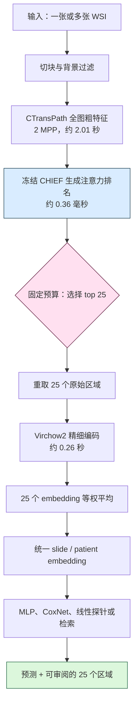

# EAGLE：高效病理图像分析的深度学习框架

**论文原题**：A deep learning framework for efficient pathology image analysis
**作者**：Peter Neidlinger、Tim Lenz、Sebastian Foersch、Chiara M. L. Loeffler、Jan Clusmann、Marco Gustav、Lawrence A. Shaktah、Rupert Langer、Bastian Dislich、Lisa A. Boardman、Amy J. French、Ellen L. Goode、Andrea Gsur、Stefanie Brezina、Marc J. Gunter、Robert Steinfelder、Hans-Michael Behrens、Christoph Röcken、Tabitha Harrison、Ulrike Peters、Amanda I. Phipps、Giuseppe Curigliano、Nicola Fusco、Antonio Marra、Michael Hoffmeister、Hermann Brenner、Jakob Nikolas Kather
**期刊**：Nature Communications 17:5740 | **年份**：2026
**时间**：2025-10-14 收稿；2026-06-16 接收；2026-07-01 在线发表
**链接**：[论文页面](https://www.nature.com/articles/s41467-026-74918-9) · [DOI](https://doi.org/10.1038/s41467-026-74918-9) · [arXiv](https://arxiv.org/abs/2502.13027) · [代码](https://github.com/KatherLab/EAGLE) · [Zenodo](https://doi.org/10.5281/zenodo.19799127)

## 一句话总结

EAGLE 用冻结的 CHIEF 在全图 CTransPath 粗特征上做 task-agnostic 排序，只把 top 25 tile 交给 Virchow2 精细编码并等权平均；这一固定 CHIEF selector→Virchow2 consumer 管线在 43 个任务、9 个癌种上兼顾总体性能、2.27 秒模型推理和可枚举的区域审计。

## 核心贡献

1. **粗筛—精提的固定跨模型分工**：CTransPath 扫全图，CHIEF 负责选择，Virchow2 只编码 25 个高排名区域。
2. **统一且可复用的 slide/patient embedding**：选中 tile 等权平均后，下游只需小 MLP、CoxNet 或 logistic regression，不必为每个任务重训 WSI 聚合器。
3. **选择有效性不是随机降采样**：N=5/10/25/50/100 下 CHIEF 都超过 100 次随机选择；最小 Monte Carlo p=1/101=0.0099。
4. **把注意力失效量化**：CHIEF 的平均 Gini 为 0.702，而 ABMIL/gated ABMIL 为 0.087/0.104；细微 biomarker 任务中的逐任务注意力常接近均匀聚合。
5. **多层证据**：31 个外部验证任务、12 个 PathoBench 内部任务、few-shot、效率、伪影审阅、检索与 GPT-4o 对照共同界定收益和边界。

## 📖 批读导航

| 分节 | 内容 |
|---|---|
| [00 - 摘要与论文元信息](sections/00-abstract.md) | 论文头信息、完整摘要、主张与成本口径 |
| [01 - 引言](sections/01-introduction.md) | 三个现实痛点、Fig. 1、selector→consumer 接口 |
| [02 - 结果](sections/02-results.md) | 完整 Results、Fig. 2–8、全部 42 个视觉资产与证据链 |
| [03 - 讨论](sections/03-discussion.md) | 偏差—方差解释、稀疏采样边界、临床与混杂风险 |
| [04 - 方法](sections/04-methods.md) | Ethics、datasets、experimental design、EAGLE、统计与可解释性协议 |
| [05 - 数据、代码、参考文献与后记](sections/05-data-code-references.md) | Data/Code availability、51 条参考文献、致谢、贡献、基金与许可 |

## 关键数字

| 维度 | 数值 | 如何理解 |
|---|---:|---|
| 主 benchmark | 9,528 WSI、13 cohort、31 任务、4 癌种 | TCGA 训练，CPTAC/DACHS/Kiel/Bern/IEO 外测 |
| 全文扩展 | 43 任务、9 癌种 | 加入 12 个 PathoBench 生存/疗效任务 |
| 平均 tile 数 | 约 18,000/WSI（0.5 MPP） | WSI 的空间冗余背景 |
| 默认预算 | top 25 | CHIEF 排序，Virchow2 精提，等权平均 |
| 主任务 AUROC | EAGLE 0.742；TITAN 0.740 | 总平均只差 0.002，需看任务异质性 |
| biomarker AUROC | EAGLE 0.772 | 本文最强任务类别 |
| 阈值覆盖 | 39% 任务 >0.800；77% >0.650 | 高于 TITAN 的 35%/68% |
| 少量选择 | top 5 为 0.727；全 tile mean pooling 为 0.720 | 选择质量可抵消极端预算缩减 |
| 随机负对照 | p=0.0099 | 100 次随机副本均未达到 CHIEF |
| 注意力集中 | Gini 0.702 / 0.087 / 0.104 | CHIEF / ABMIL / gated ABMIL |
| 50% attention mass | 8.4% / 44.1% / 42.0% tile | 同上三种方法 |
| PathoBench | C-index 0.584；response AUROC 0.689 | 内部切分，不是外部验证 |
| 低资源 | 150 patients：0.689 | TITAN 0.669；最佳 tile encoder 0.618 |
| 模型推理成本 | 2.01 s + 0.36 ms + 0.26 s ≈ 2.27 s/WSI | CTransPath + CHIEF + Virchow2 top-25 |
| 伪影 | 全部伪影 22% vs 32%；dominant pen 1% vs 15% | EAGLE vs supervised baseline |

## 数据流：输入 → 中间表示 → 输出

> 💡 **成本边界（claude 批注）**：CHIEF 的 0.36 毫秒不能单独代表 selector 成本；CHIEF 依赖 CTransPath 对全图先做 2.01 秒粗提。2.27 秒是 GPU 模型推理分解，跨 benchmark 仍应统一是否包含 WSI 读取、tessellation、磁盘 I/O、预提特征缓存与重取 tile。

## 优缺点与还能做什么

### 优点

- **性能—效率 Pareto 强**：总体 AUROC 第一，同时把最贵的 Virchow2 限制在 25 个 tile。
- **负对照完整**：多个预算、100 次随机、有限重复下正确报告 p=1/101。
- **外部验证覆盖广**：主 benchmark 的训练与五个外部队列分离。
- **审计对象明确**：不是只给热图，而是可以逐一复现参与 embedding 的区域坐标。
- **多任务复用**：统一 embedding 能服务分类、生存、检索与多组学接口。

### 局限与风险

- **固定 25 不是普适最优**：形态学、长程结构、vascular invasion、稀有或空间分散线索可能需要更密集上下文。
- **总体优势很小且不均匀**：0.742 对 0.740；TITAN 在 morphology 和 lung 更强。
- **固定 selector 先验有域边界**：CHIEF 主要在癌症 WSI 上预训练，非癌任务选择可能失效。
- **可审计不等于因果解释**：尚未系统排除 grade、染色、中心、扫描仪等 shortcut。
- **部分扩展证据较弱**：PathoBench 无外部队列；伪影与检索主要由一名病理学家审阅。
- **平均 AUROC 0.742 尚不足以替代标准临床程序**。

### 还能做什么

1. 建立 **selector×consumer×budget 全交叉**，测试 CHIEF、UNI2、Virchow2、CONCH 等模型的角色互换与自选择。
2. 做任务自适应预算：biomarker 可以激进压缩，morphology 增加预算或并联 dense context 分支。
3. 把随机负对照、Lorenz/Gini、跨中心去混杂和多专家盲评做成 ReadySlide allocator 的标准协议。
4. 比较离散 top-k 与连续码率/分辨率分配，在统一存储、I/O 与下游 FM 成本下画 Pareto 曲线。
5. 验证选中区域对不同 consumer 的 utility ranking 是否稳定，而不是只看固定配对的最终 AUROC。

## Selector–Consumer Benchmark 专项审计

| 审计项 | EAGLE 已覆盖 | 尚未覆盖 |
|---|---|---|
| Selector | 冻结 CHIEF 在 CTransPath@2 MPP 特征上输出 task-agnostic attention ranking | 其他 FM 作为 selector；selector 自选择与跨域校准 |
| Consumer | 主系统固定 Virchow2；消融中在 CHIEF selector 不变时替换若干 tile encoder | consumer 反过来做 selector；完整角色互换 |
| Budget | 默认 top 25；消融 N=5/10/25/50/100 | 任务自适应预算与连续 rate allocation |
| 聚合 | top-25 等权平均；加权与等权在 N=25 接近 | consumer-specific aggregator 与空间关系建模 |
| 成本 | 2.01 s CTransPath + 0.36 ms CHIEF + 0.26 s Virchow2 | 统一 I/O、缓存、预处理和存储成本 |
| 统计控制 | 100 次随机选择、p=0.0099；五折与外部验证 | selector×consumer 多重比较与跨中心 confounder control |
| 结论边界 | CHIEF→Virchow2 是成功的固定跨-FM 配对 | 没有角色互换，也没有 selector×consumer 全交叉 |

> 💡 **固定配对边界（claude 批注）**：EAGLE 的 consumer ablation 说明 CHIEF ranking 能服务多种 tile encoder，但 selector 始终由 CHIEF 承担；论文没有让 Virchow2、CONCH 或其他 FM 交换到 selector 角色，也没有对每个 selector 配每个 consumer。因此它是 ReadySlideBenchmark 的直接强前作，却仍留下“谁更适合选、选择能否跨 consumer 迁移、self-selection 是否最优”三项核心问题。

## 阅读 Q&A 记录

- **问：为什么 top 25 会比处理全部 tile 更好？**
  **答**：Fig. 3 显示性能随 CHIEF 预算升到 25 达峰；top 5 的 0.727 已超过全量 mean pooling 的 0.720。Discussion 将其解释为稀疏信号下的偏差—方差权衡：低排名冗余 tile 会稀释判别信号。但这只支持经验操作点，不代表每种任务都应固定 25。

- **问：怎样排除“少看本身就是正则化”的解释？**
  **答**：相同 N 与相同训练/测试协议下做 100 次无放回随机选择；CHIEF 在每个预算均高于全部随机副本，单侧 Monte Carlo p=1/101。收益来自结构化 ranking，不只是减少 tile。

- **问：为什么不用任务特异 ABMIL attention 做选择？**
  **答**：Fig. 4 中 CHIEF Gini 0.702，ABMIL/gated ABMIL 只有 0.087/0.104；在细微 biomarker 任务上后两者常接近均匀聚合。大规模预训练 selector prior 比小样本端到端注意力更稳定。

- **问：EAGLE 是否证明 CHIEF 是普遍最好的 selector？**
  **答**：没有。Methods 和 Fig. 3 只在 CHIEF selector 固定时改变 consumer/aggregation；没有 selector 角色互换或全交叉。

- **问：2.27 秒能否直接当作端到端临床耗时？**
  **答**：不能。Results 明确测量 GPU 模型推理，分解为 2.01 秒、0.36 毫秒、0.26 秒；WSI 读取、切块、磁盘与缓存口径需要另行统一。

- **问：25 个可见 tile 是否构成可靠解释？**
  **答**：它们构成可复现的审计轨迹，Fig. 8 还显示较少伪影；但没有证明因果性，也没有充分排除混杂。可审计性强于因果可解释性。

- **问：对 ReadySlideBenchmark 最直接的实验启示是什么？**
  **答**：保留 CHIEF→Virchow2 作为固定强基线，同时新增角色互换、全交叉、预算曲线、随机负对照和成本全口径；再与连续压缩/码率分配比较。相关方法论可对照 [PIBD](../../Whole-Slide-Image-Analysis/%5BICLR%202024%5D%20PIBD/)、[ACMIL](../../Whole-Slide-Image-Analysis/%5BECCV%202024%5D%20ACMIL/)、[PathBench](../../Whole-Slide-Image-Analysis/%5BArxiv%202025%5D%20PathBench/) 与 [Confounders](../../Whole-Slide-Image-Analysis/%5BNat%20Biomed%20Eng%202026%5D%20Confounders-Biomarker-Prediction/)。

## 📊 Citation Landscape

**查询时间**：2026-08-19（UTC）
**入口**：[Semantic Scholar（仓库此前记录的 paperId）](https://www.semanticscholar.org/paper/749833947ab3bb5a1bce35d448680b436bdb61d6) · [Connected Papers](https://www.connectedpapers.com/main/2502.13027)

### API 状态与 TLDR

- 依次以 `ArXiv:2502.13027` 请求 detail、references、recommendations，每次请求间隔至少 3 秒；随后又以仓库此前记录的 paperId 和 batch endpoint 重试。
- detail、paperId detail 与 batch detail 均返回 HTTP 429，因此 **citationCount、referenceCount、influentialCitationCount 和当前 TLDR 未能刷新**。
- references endpoint 返回 HTTP 200，但 `data=[]`；这表示当前 Semantic Scholar 记录没有返回可分组的 reference objects，**不能把它解释成论文真的没有参考文献**，因为正文明确列出 51 条。
- recommendations endpoint 返回 HTTP 200 和 10 篇论文。
- **TLDR（仓库此前 API 快照，非本次刷新）**：EAGLE 模仿病理学家只分析信息区域，并用负对照与注意力集中分析产生稳健、可审计的 WSI 表示。

### 参考文献功能分组 Top 5

由于 references API 没有返回 paperId 与 citationCount，下列每组 Top 5 按其在 EAGLE 机制中的功能重要性选取，**无法按 Semantic Scholar citationCount 排序；引用数字段记为“未返回”**。

| 分组 | 功能 Top 5（论文正文编号） | Semantic Scholar 引用数 |
|---|---|---|
| 弱监督与区域选择 | CHIEF（23）；CTransPath（8）；ABMIL（21）；STAMP（18）；HIPT（17） | 均未返回 |
| Tile / Slide 基础模型 | Virchow2（24）；Prov-GigaPath（9）；CONCH（28）；PRISM（26）；TITAN（30） | 均未返回 |
| Benchmark 与临床任务 | Foundation model benchmark（22）；PathoBench/Molecular-driven FM（31）；PathoBench 加速框架（32）；NSCLC mutation prediction（1）；MSI prediction（2） | 均未返回 |
| 审计、检索与可解释性 | UMAP（33）；slide indexing/search（34）；RetCCL（35）；prompt injection（36）；Grad-CAM（45） | 均未返回 |

### 推荐论文 10 篇

以下为本次 Recommendations API 原样返回的 10 篇；它们均为 2026 年记录且当时 `citationCount=0`，其中若干只与广义病理 AI 相似，因此不应替代人工相关性筛选。

| 序号 | 推荐论文 | 年份 / 来源 | API 引用数 |
|---:|---|---|---:|
| 1 | [Learnable frozen feature augmentation for few-shot biomarker prediction from pathology whole-slide images](https://www.semanticscholar.org/paper/c82a4a3658afcbfafa2a4abe4526edc030b04537) | 2026 / Bioinformatics | 0 |
| 2 | [Explainable Deep Learning for Automated Histopathological Diagnosis of Gastrointestinal Malignancies: A Multicenter External Validation Study](https://www.semanticscholar.org/paper/ecc7d7429f714363f74b29407873517afcd18f12) | 2026 / Advanced Journal of Biomedicine & Medicine | 0 |
| 3 | [Deep learning-based computational pathology: Technologies, clinical applications, and future directions](https://www.semanticscholar.org/paper/2d5510321017130c8d67f15967baf3566c0d2768) | 2026 / Chinese Medical Journal | 0 |
| 4 | [Artificial Intelligence–Enabled Computational Pathology: Foundation Models for Next-Generation Precision Cancer Diagnostics](https://www.semanticscholar.org/paper/23088c0b8983b272ce8c832a1b7a14c1dce01b02) | 2026 / International Journal of Advance Research and Innovation | 0 |
| 5 | [ALICE: Learning a General-Purpose Pathology Foundation Model from Vision, Vision-Language, and Slide-Level Experts](https://www.semanticscholar.org/paper/92bcdb4630c02d01b1b6057a1dda23cd4d9d595e) | 2026 / arXiv:2607.09526 | 0 |
| 6 | [CAT-WSI: Context-Aware Trajectory Learning for Whole-Slide Breast Pathology Segmentation](https://www.semanticscholar.org/paper/ac7331364f6dfe32e1b62e3a679327b4a2e4f830) | 2026 / IEEE TMI | 0 |
| 7 | [Automated tumor content analysis from whole slide images using deep learning models for NGS quality control in precision oncology](https://www.semanticscholar.org/paper/259707c83d31f3bf0084ec6496debfb64de9d80e) | 2026 / Journal of Clinical Oncology | 0 |
| 8 | [A practical deep learning framework for multi-class skin cancer detection using U-Net segmentation and ResNet50 transfer learning](https://www.semanticscholar.org/paper/40fd08521ae4e3652ff3cde9aacb1e59182cb6ba) | 2026 / Journal of the Nigerian Society of Physical Sciences | 0 |
| 9 | [Prompt-guided foundation model tuning for pathology image classification](https://www.semanticscholar.org/paper/db332a030a210a46a63356ac6759278734c2ae72) | 2026 / Medical Image Analysis | 0 |
| 10 | [GigaPath-Flash and GigaTIME-Flash: Efficient Pathology Foundation Models for Whole-Slide and Tumor Microenvironment Analysis](https://www.semanticscholar.org/paper/31e69c8203b56ab6ad06a62f2e316e4dd016de8a) | 2026 / arXiv:2607.18218 | 0 |
