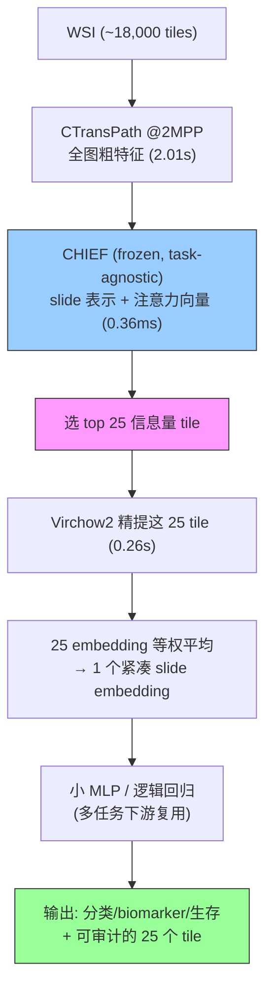

# EAGLE: A Deep Learning Framework for Efficient Pathology Image Analysis

**作者**: Peter Neidlinger, Tim Lenz, ..., Jakob Nikolas Kather（Dresden / TU Dresden 等，KatherLab）
**期刊**: Nature Communications 2026 (s41467-026-74918-9) | **年份**: 2026（accepted 2026-06）
**链接**: [Nature](https://www.nature.com/articles/s41467-026-74918-9) · [arXiv](https://arxiv.org/abs/2502.13027) · [Code](https://github.com/KatherLab/EAGLE)

## 一句话总结

**EAGLE = 用 task-agnostic 的 CHIEF 从上万 tile 里选出 25 个最信息量 tile、再用 Virchow2 精提特征平均成一个 slide embedding**；在 43 任务/9 癌种上超 patch 聚合法最多 23%、总体 AUROC 最高，单 slide 仅 2.27 秒（省 >99% 算力），且只用 25 tile → 可审计。是"WSI 极端保留（retention）反而更好"的最强外部证据。

## 核心贡献

1. **两阶段"粗筛 + 精提"**：CHIEF（6 万+ slide 预训练）在便宜 CTransPath 特征上选 25 tile，Virchow2（3M+ WSI）只精提这 25 个 → 组合两个互补 FM，超越各自单用。
2. **少即是多（有原理）**：弱监督下信号空间稀疏 → 限制到高显著子集改善统计条件（偏差-方差权衡）。top 5 tile 就超过全部 tile 的 mean pooling。
3. **task-agnostic 统一 embedding**：一次算好、多任务下游只训小 MLP；比逐任务聚合器可扩展、可审计。
4. **严格验证**：负对照（CHIEF 选择超随机，Monte Carlo p=0.0099）、注意力集中分析（CHIEF Gini 0.702 vs ABMIL 0.087）、43 任务外部验证、PathoBench 泛化、超 GPT-4o。

## 📖 批读导航

| Section | 内容 |
|---------|------|
| [00 - Abstract](sections/00-abstract.md) | 摘要 + 与 ReadySlide 的直接相关性 + "少即是多"原理 |
| [01 - Introduction](sections/01-introduction.md) | 三痛点→三对策、CHIEF+Virchow2 分工 |
| [02 - Results](sections/02-results.md) | 31 任务 benchmark、消融+负对照、注意力集中、PathoBench、效率 |
| [03 - Discussion & Methods](sections/03-discussion.md) | 25-tile 原理辩护与边界、方法细节、去混杂 open question、对 ReadySlide 映射 |

## 关键数字

| 指标 | 数值 |
|------|------|
| 任务/癌种 | 43 任务（含 PathoBench 12）/ 9 癌种；9528 WSI / 13 cohort |
| 组成 | CHIEF（选 tile）+ Virchow2（精提），CTransPath 粗特征 |
| **保留** | 每 slide **25 tile**（~0.1-2% of ~18,000 tiles/slide） |
| 主结果 | 31 任务总体 AUROC 0.742（居首，TITAN 0.740）；生物标志物 0.772 |
| **少即是多** | top 5 tile (0.727) > 全部 tile mean pooling (0.720) |
| 负对照 | CHIEF 选择 > 所有随机副本，Monte Carlo p=0.0099 |
| 注意力集中 | CHIEF Gini 0.702 / 50% 质量需 8.4% tile；ABMIL Gini 0.087 / 需 44.1% |
| 效率 | 2.27 s/slide（省 >99%；vs Prov-GigaPath 16 min/WSI） |
| 数据稀缺 | 150 患者：EAGLE 0.689 > TITAN 0.669 |

## 数据流：输入 → 中间表示 → 输出

## 优缺点与还能做什么

### 优点
- **极致效率**（2.27s/slide，省 >99%），可跑低端硬件甚至平板/手机。
- **少即是多有原理**（偏差-方差权衡），且负对照证明超随机、非平凡降噪。
- **可审计**：明确列出预测用的 25 个 tile；顺带过滤伪影（pen mark 1% vs 15%）。
- **task-agnostic 统一 embedding**：一次算、多任务复用；数据稀缺下最优。

### 局限 / 风险
- **平均 AUROC 0.742，不足以替代临床**（定位辅助/分诊）。
- **稀疏采样短板**：形态学/长程上下文任务（肺癌亚型、血管侵犯）dense encoder 更好；有漏罕见/分散线索的残余风险。
- **CHIEF 偏癌症预训练** → 非癌任务选择可能失效。
- **未做去混杂验证**：选的 25 tile 是承载因果信号还是 grade/染色 shortcut？未知（与 [Confounders](../../Whole-Slide-Image-Analysis/%5BNat%20Biomed%20Eng%202026%5D%20Confounders-Biomarker-Prediction/) 呼应）。

### 还能做什么（对本课题 ReadySlide）
- **EAGLE = "选择式压缩一次、强 FM 分析" 的病理实证**，几乎就是 ReadySlide "analysis-ready transfer" 的验证——可作为最强参照/基线。
- **allocator 用 CHIEF 选择器**：CHIEF 的 task-agnostic 显著性可替代/对标 importance_chief 做 patch 保留。
- **选择 vs 压缩的 Pareto 对比**：EAGLE 离散选 tile vs ReadySlide 连续分辨率/码率分配，哪个更优？
- **任务自适应保留率**：EAGLE 承认 25 是经验点、任务依赖——正对应 memory 里"importance→retention 任务分层"。
- **补去混杂 + 负对照**：ReadySlide 的 allocator 评估应标配"显著超随机 + Lorenz/Gini 集中度 + 分层去混杂"。

## Selector–Consumer Benchmark 专项审计

| 角色 | EAGLE 的实现 | ReadySlideBenchmark 要追问 |
|---|---|---|
| Selector | CHIEF 在 CTransPath 粗特征上输出 task-agnostic attention ranking | 换 UNI2、Virchow2、CONCH 等 selector 后，budgeted ranking 是否仍优？ |
| Consumer | Virchow2 只编码 top-25 tile，随后等权平均 | 同一 selector 面对不同 consumer 时 utility 是否稳定？ |
| Budget | 主操作点固定为 25，并补 5/10/50/100 消融 | 最优预算是否随任务、consumer、病灶稀疏度而变？ |
| Full-bag 参照 | 各 FM/聚合方法的完整 slide 表示 | full-bag diagnostic ranking 能否预测 budgeted selection ranking？ |
| 部署收益 | 2.27 s/slide，昂贵 Virchow2 只跑 25 tile | 是否计入粗特征预计算、读取、缓存与 selector 成本？ |

> 💡 **固定配对边界（claude 批注）**: EAGLE 证明了一个成功的跨模型配对 CHIEF→Virchow2，但没有穷举角色互换；因此它占据“不同病理模型分别选择与诊断”的系统实例，却没有回答哪个 FM 天生更适合 selector、排名是否跨 consumer 迁移、self-selection 是否最优。这正是 ReadySlideBenchmark 的核心差异化。

## 阅读 Q&A 记录

- **Q: 为什么只用 25 个 tile 反而比处理全部更好？**
  A: 弱监督下预测信号空间稀疏，处理全部 tile 引入大量无信号 tile→高方差；限制到高显著子集改善统计条件（偏差-方差权衡）。top 5 tile 就超过全部 tile 的 mean pooling。但这是经验操作点、任务依赖（形态学任务需更多/更全局）。

- **Q: 怎么排除"少即是好只是因为降噪/随机"？**
  A: 负对照——100 次随机选 tile，CHIEF 选择在每个 tile 预算下都超过所有随机副本（Monte Carlo p=0.0099）。证明涨点来自 CHIEF 的结构化区域排序，不是处理更少 tile 本身。

- **Q: 为什么用 task-agnostic 的 CHIEF 选 tile，而不端到端学注意力？**
  A: 注意力集中分析发现，端到端弱监督训的 ABMIL 注意力在细微 biomarker 任务上退化成近均匀（Gini 0.087），而 CHIEF 预训练显著性先验高度集中（Gini 0.702）。小样本+弱监督下学的注意力不可靠。

- **Q: 对 ReadySlide 最大启示？**
  A: EAGLE 是"选 25 tile = 极端保留反而更好"的最强证据，且 task-agnostic（选一次多任务复用），几乎就是 ReadySlide "压一次、任意 FM/任务分析"的实证。CHIEF 选择器可作 allocator 候选；负对照+集中度+去混杂应成为 allocator 评估标配。

- **Q: EAGLE 是否证明 CHIEF 是普遍最好的 selector？**
  A: 没有。它只系统验证 CHIEF→Virchow2 这一固定配对及若干 consumer/聚合消融，没有构建 selector×consumer 角色矩阵，也没有测试角色互换。

- **Q: 2.27 秒是否等于完整端到端成本？**
  A: 该数字包含 CTransPath 全图粗提、CHIEF 与 25 张 Virchow2 精提，是很强的部署证据；但跨 benchmark 仍需统一是否计入切 tile、磁盘 I/O、缓存和预提特征，避免与离线特征方法口径不一致。

## 📊 Citation Landscape

**数据源与时间**: Semantic Scholar API，查询于 2026-08-19。当前 arXiv 条目尚未合并 Nature 版本，API 返回参考文献 0、被引 0、influential citation 0；因此下列关系按论文正文整理，不将缺失值解释为真实零引用。  
**TLDR**: EAGLE 模仿病理学家只分析信息区域，通过系统负对照与注意力集中分析产生稳健、可审计的 WSI 表示。  
**入口**: [Semantic Scholar](https://www.semanticscholar.org/paper/749833947ab3bb5a1bce35d448680b436bdb61d6) · [Connected Papers](https://www.connectedpapers.com/main/2502.13027)

**核心组件 / 最相关**
- CHIEF（Wang et al., Nature 2024）——task-agnostic slide-level 选择器，EAGLE 的选 tile 引擎。
- Virchow2（Vorontsov/Zimmermann et al.）——3M+ WSI 的强 tile encoder，EAGLE 的精提器。
- CTransPath（Wang et al., MedIA 2022）——Swin SSL 粗特征。
- TITAN（Ding et al., Nat Med 2025）、Prov-GigaPath（Xu et al., Nature 2024）、Prism、COBRA、MADELEINE、CONCH——对比的 slide/tile 基础模型。
- STAMP（El Nahhas et al., Nat Protoc 2025）、ABMIL（Ilse et al., ICML 2018）——聚合基线。
- Benchmarking FMs（Neidlinger et al., Nat BME 2025）——本文的 benchmark 框架来源。

**与本主题的关系**
- 与 [PIBD](../../Whole-Slide-Image-Analysis/%5BICLR%202024%5D%20PIBD/)/[ACMIL](../../Whole-Slide-Image-Analysis/%5BECCV%202024%5D%20ACMIL/) 呼应："保留少数关键 patch/instance 更好"的三重独立证据。
- 与 [Confounders](../../Whole-Slide-Image-Analysis/%5BNat%20Biomed%20Eng%202026%5D%20Confounders-Biomarker-Prediction/) 互补：EAGLE 未做去混杂，Confounders 提供了该补的协议。
- 与 [PathBench](../../Whole-Slide-Image-Analysis/%5BArxiv%202025%5D%20PathBench/) 互补：都在系统评测病理 FM。
