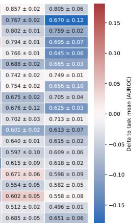

[← 返回 README](../README.md)

# 结果

## 📌 预览

结果的证据链依次回答五个问题：总体性能是否领先、收益是否来自选择而非随机降采样、为何冻结 CHIEF 比逐任务注意力更稳定、能否泛化到生存与疗效任务，以及真实计算与低资源收益是否匹配。下列英文原文保留了主结果全部段落，并把 MinerU 被跨页图版切开的句子重新合并。

---

## Results

## EAGLE improves upon state-of-the-art approaches

We first evaluated EAGLE within a previously established benchmarking framework encompassing 31 CPath tasks across breast (BRCA), colorectal (CRC), gastric (STAD), and non-small cell lung cancers (NSCLC)22. This dataset integrates diverse prediction objectives spanning morphology, biomarker and prognosis, and enables systematic comparison on large, truly external datasets. The benchmark includes both state-of-the-art slide-encoder and tile-encoder approaches: slidelevel models (TITAN30, COBRA29, CHIEF23, Prism26, MADELEINE27, and Prov-GigaPath9) and tile encoders or foundation models (Virchow224, CONCH v1.530, CONCH28, Prov-GigaPath9, CTransPath8, Virchow10), which were aggregated using attention-based multiple instance learning (ABMIL)21, the standardized pipeline STAMP18, or simply by averaging all embeddings. All classifiers were trained using a five-fold cross-validation setup on The Cancer Genome Atlas (TCGA) data, resulting in five models per task. Each model was then evaluated on the full external test cohorts (CPTAC, Clinical Proteomic Tumor Analysis Consortium; DACHS, Darmkrebs: Chancen der Verhütung durch Screening; Kiel, University Medical Center Kiel; Bern, Inselspital Bern; IEO, European Institute of Oncology), ensuring external validation without data leakage (Supplementary Fig. 1c).

Across all 31 tasks, EAGLE and TITAN achieved the highest average area under the receiver operating characteristic curve (AUROC) scores of 0.742 and 0.740, respectively. Following were Virchow2 in STAMP (0.723) and CONCH v1.5 in STAMP (0.721), suggesting that modern slide encoders often outperform strong tile-level baselines (Figs. 1c, 2a, Supplementary Fig. 2). EAGLE exceeded key AUROC thresholds more often than other models, surpassing 0.800 in 39% oftasks and 0.650 in 77% oftasks—higher than TITAN (35% and 68%) and Virchow2 (26% and 65%) (Fig. 2b). Looking at task-specific performance, EAGLE (0.772),

TITAN (0.763), and COBRA (0.757) excelled on biomarker tasks, which predict molecular alterations or protein expression. In morphology tasks, which classify tumor location or histological patterns, TITAN achieved the highest performance (0.814), followed by Virchow2 (0.785) and EAGLE (0.782). Tile-level CONCH v1.5 in STAMP (0.648) held an advantage in prognosis, which assesses tumor spread, with EAGLE achieving the highest prognosis performance among slide-level frameworks (0.630) (Fig. 2c, Supplementary Fig. 3a, e). EAGLE also scored highest in three of the four cancer types—BRCA (0.737), CRC (0.710), and STAD (0.755)—while TITAN scored highest in lung (0.810) (Supplementary Fig. 3b, c, f). Beyond AUROC, EAGLE achieved the highest average area under the precision-recall curve (AUPRC) scores (0.566), followed by COBRA (0.556). In balanced accuracy, EAGLE and TITAN performed best with average scores of 0.657 and 0.655, respectively. TITAN held the highest average F1 scores (0.498), followed by EAGLE (0.490) (Supplementary Figs. 4–6).

We assessed the statistical significance ofAUROC differences with two-sided DeLong’s tests, controlling the false discovery rate using the Benjamini–Hochberg procedure. For each patient, predictions from the five cross-validation models were averaged to yield a single ensemble score. Across all tasks and models, ensemble AUROC values were highly correlated with mean fold performance, with most model–task pairs lying close to the diagonal, indicating only marginal performance gains from ensembling (Supplementary Fig. 7a). Under these ensemble conditions, EAGLE achieved an average AUROC of 0.750, followed by TITAN (0.744) and CONCH (0.736) (Supplementary Fig. 8a). Statistical comparisons based on ensemble predictions con firmed that EAGLE significantly outperformed slide-level encoders across numerous tasks, with AUROC improvements exceeding 0.05 and occasionally 0.2 (Supplementary Fig. 7b). Similar trends were observed when comparing EAGLE with tile-level foundation models (Supplementary Fig. 7c). When restricting the comparison to the Virchow2 model aggregated through STAMP, ABMIL, or mean pooling, differences were smaller, with EAGLE outperforming in six task–model combinations and performing worse in four (Supplementary Fig. 7d). EAGLE’s strongest advantages were observed for DACHS CRC tasks (MSI, BRAF, KRAS, M-Status, and N-Status), potentially due to the large cohort size, which provided increased statistical power. In DACHS BRAF mutation prediction, EAGLE statistically outperformed all models except COBRA (Supplementary Fig. 8b).

Together, these analyses show that EAGLE achieves consistently high performance across tasks, cancer types, and external cohorts, often statistically outperforming state-of-the-art slide- and tile-level models. Its strong biomarker prediction accuracy and robust generalization across heterogeneous datasets highlight the quality and versatility of its representations.

> 💡 **主结果证据链（claude 批注）**：EAGLE 的平均 AUROC 0.742 只比 TITAN 的 0.740 高 0.002，因此“总体第一”不能单独说明全面统治；更有信息量的是它在 39% 任务超过 0.800、在 77% 任务超过 0.650，并且 biomarker 平均 0.772。形态学任务 TITAN 0.814 高于 EAGLE 0.782，提前暴露了稀疏采样在全局结构任务上的边界。

### Figure 2 与 MinerU 表格裁片

*Figure 2c：AUROC Scores - Biomarker Tasks（MinerU 将 biomarker heatmap 局部识别为 table 资产。）*

> 💡 **Table / Figure 2c 裁片批读（claude 批注）**：这张被 MinerU 标成 table 的资产对应逐任务 biomarker AUROC 区域。它提醒阅读者不要只看 0.742 的总平均：不同癌种、不同 biomarker 的模型排序变化很大，EAGLE 的优势集中在若干外部 CRC 与 biomarker 任务，而不是所有单元格一致领先。

<table>
<tr><td width="50%"></td><td width="50%"></td></tr>
<tr><td align="center"><i>Figure 2a</i></td><td align="center"><i>Figure 2b</i></td></tr>
<tr><td width="50%"></td><td width="50%"></td></tr>
<tr><td align="center"><i>Figure 2d</i></td><td align="center"><i>Figure 2e</i></td></tr>
</table>

*Fig. 2 | Comparative performance of EAGLE vs. tile- and slide-level foundation models. a Mean AUROC by task category across five folds for 13 models evaluated on 31 tasks. b Number of tasks per model with mean AUROC > 0.800, 0.650 to 0.800, or <0.650, grouped by task type. c Mean AUROC ± standard deviation (SD) across five folds for 19 biomarker tasks; colors show deviation from the task specific mean across models, with red indicating above mean and blue below mean performance. Tasks and models are ordered by mean AUROC. d Few-shot linear probing of slide encoders with logistic regression for k = 1, 2, 4, 8, 16, and 32 samples per class, using the top three binary tasks per cancer type; values show mean AUROC across n = 10 support-set resamplings. e EAGLE few-shot linear probing versus GPT-4o in-context learning at k = 2 for BRCA ER expression, CRC MSI status, and NSCLC subtyping. Bars show mean accuracy, error bars SD, and dots individual runs. For EAGLE, n = 10 support-set resamplings were evaluated per task; for each GPT-4o input setting, n = 3 independent runs were performed per task. Source data are provided as a Source Data file.*

> 💡 **Figure 2 批读（claude 批注）**：a–c 把“平均性能、阈值覆盖、逐任务异质性”放在同一图中；d 的 few-shot 曲线显示极小样本时 TITAN 一度领先，到 k=8/16/32 EAGLE 才成为整体最佳；e 则是关键负面结果——GPT-4o 即便拿到 EAGLE 的 top-25 tile 仍接近随机水平，说明 relevant input 并不能替代 pathology-specific representation。图中所有比较都应结合五折方差与外部队列差异阅读。

## Design analysis of EAGLE and negative controls

To understand which design choices yield EAGLE’s performance gains, we conducted extensive ablation studies. First, we compared five dif ferent options for aggregating Virchow2 tile embeddings at 2 MPP. EAGLE selects the 25 most informative tiles using CHIEF and averages their embeddings, whereas alternative approaches either aggregate tiles through supervised models (STAMP, ABMIL or gated ABMIL) or compute a simple mean across all tiles. Among these, EAGLE achieved the highest mean AUROC (0.742), followed by gated ABMIL (0.723), STAMP (0.723), mean pooling (0.720), and regular ABMIL (0.711), confirming that EAGLE provides the most effective tile aggregation strategy. (Fig. 3a, Supplementary Fig. 9a). Second, we varied the tile encoder while keeping EAGLE aggregation fixed. Performance remained robust across encoders, indicating that EAGLE benefits from stronger tile features but does not rely on a single backbone. We then asked whether EAGLE can replace bespoke slide encoders trained for specific tile embeddings. Across four backbones, EAGLE exceeded the native slide encoders for three and trailed slightly for one. Gains were largest with GigaPath (+12%) and CONCH (+4%), modest with CTransPath (+1%), and negative with Virchow (−2%). Pooled across all comparisons, EAGLE led in about two thirds oftasks with a small increase in mean AUROC, supporting its role as an effective universal slide-level aggregator (Fig. 3b, d, Supplementary Fig. 9b, c). Third, we systematically analyzed how the number and selection strategy of tiles affect EAGLE’s performance. We compared three approaches: CHIEF-based selection of the top-ranked tiles aggregated either (i) by simple averaging (unweighted) or (ii) by CHIEF-derived attention weights (weighted), and (iii) random tile selection as a negative control repeated 100 times per tile budget. For both CHIEF-based strategies, performance increased up to 25 tiles, where the highest AUROC was reached (0.745 for unweighted, 0.744 for weighted), indicating that a small, targeted subset captures most predictive information. Notably, using only the top five selected tiles (0.727) already outperformed mean pooling of all embeddings (0.720). A 100-replicate random baseline defined an empirical null distribution for each tile budget (N = 5, 10, 25, 50, 100), enabling uncertainty estimation and Monte Carlo testing. The mean AUROC of the replicate distribution increased with larger tile budgets, approaching the mean pooling baseline as N increased. For every N, CHIEF-based selection exceeded the maximum random replicate, corresponding to a Monte Carlo p-value of1/101 and excluding the hypothesis that any reasonable unguided subset performs comparably (Fig. 3c, Supplementary Table 1). Because weighted and unweighted aggregation performed similarly at 25 tiles, we adopted equal averaging of the top 25 tiles as the default to enable transparent region-level auditability (Fig. 3c, Supplementary Fig. 9e). To address intra-patient heterogeneity, we next compared two methods for creating a patient-level representation. Early fusion aggregates across all slidesjointly before forming a single patient embedding. Late fusion averages slide-level embeddings after separate aggregation per slide. On average the difference was small (mean $\Delta = - 0 . 0 0 5 )$ , although early fusion tended to help for morphology and prognosis tasks while biomarker tasks showed little change. (Supplementary Fig. 9d). Moreover, we examined how magnification choices influence performance. While EAGLE and COBRA each peaked at 2 MPP (0.742 and 0.719, respectively), TITAN and Prism favored 0.5 MPP (0.740 and 0.695). For Prov-GigaPath (0.628), CHIEF (0.684) and MADELEINE (0.672), 1.14 MPP worked best, implying that the optimal resolution differs between models (Supplementary Fig. 9f). Finally, to address concerns about potential bias from suboptimal hyperparameters, we performed extensive MLP hyperparameter tuning using only internal validation cohorts. On internal data, tuning led to modest AUROC gains of 0.02–0.03 on average, with larger improvements for lowerperforming models such as GigaPath (+0.05) and MADELEINE (+0.037). However, these gains did not generalize to external test cohorts, where performance changes were negligible (<0.01 on average across models) (Fig. 3e). Correlation analysis between internal and external AUROC deltas $( R ^ { 2 } { = } 0 . 0 4 )$ confirmed that tuning improvements largely reflect overfitting rather than transferable optimization. These findings indicate that extensive hyperparameter tuning provides little benefit for large embedding-based models in CPath (Supplementary Fig. 10).

<table>
<tr><td width="33%"></td><td width="33%"></td><td width="33%"></td></tr>
<tr><td align="center"><i>Figure 3a</i></td><td align="center"><i>Figure 3b</i></td><td align="center"><i>Figure 3c</i></td></tr>
<tr><td width="33%"></td><td width="33%"></td><td width="33%"></td></tr>
<tr><td align="center"><i>Figure 3d</i></td><td align="center"><i>Figure 3e：internal validation</i></td><td align="center"><i>Figure 3e：external validation</i></td></tr>
</table>

*Fig. 3 | Ablation studies dissecting EAGLE design choices. a Alternative aggregation of Virchow2 tile embeddings at 2 microns per pixel (MPP) across 31 tasks: mean pooling, attention-based multiple instance learning (ABMIL), gated ABMIL, STAMP, and EAGLE. b Performance of five tile encoders within EAGLE across the same 31 tasks: Virchow2, Virchow, CTransPath, CONCH, and GigaPath. c Effect of tile number and selection strategy. CHIEF-based selection was evaluated for N = 5, 10, 25, 50, and 100 tiles per slide using unweighted or attention-weighted aggregation. Uniform random selection was repeated 100 times per N; lines show the mean and 95% interval. CHIEF-based selection outperformed all random replicates at every N (Monte Carlo p = 0.0099). d Mean AUROC across 31 tasks for native slide encoders and EAGLE built on the same tile embeddings. e Mean AUROC change after model tuning on 23 internal and 31 external validation tasks. Source data are provided as a Source Data file.*

> 💡 **Figure 3 批读（claude 批注）**：a 显示 top-25 等权平均 0.742 高于 gated ABMIL/STAMP 0.723 与全 tile mean pooling 0.720；c 是选择器最关键的受控随机负对照，CHIEF 在 N=5/10/25/50/100 每个预算都超过 100 次均匀随机选择，Monte Carlo p=1/101=0.0099。这个实验只支持 CHIEF ranking 优于同预算的均匀随机抽样，不提供区域选择与预测结果之间的因果解释。top 5 的 0.727 已超过全 tile mean pooling，说明收益不是单纯算力削减。d 只替换 consumer/backbone 或对比 native slide encoder，并没有把 Virchow2 反过来当 selector；e 的 internal/external 两部分共同显示内外部 delta 相关性 $R^2=0.04$，说明调参涨点主要是内部过拟合。

Together, these investigations highlight that EAGLE’s performance gains arise from its architecture and aggregation strategy rather than hyperparameter bias. Selecting and averaging the most informative tiles provides clear advantages over established aggregation methods, slide encoders, and random or exhaustive tile inclusion. EAGLE’s approach remains robust across magnifications and effectively integrates multiple slides per patient, underscoring the stability and generalizability of its representations.

> 💡 **25 个 tile 的操作点（claude 批注）**：25 是在这组任务与 CHIEF ranking 下的稳健经验点，不是生物学常数。加权和不加权在 N=25 几乎相同，因此作者采用等权平均来避免单 tile 主导并提高审计透明度；预算再增大时随机基线逼近全量 mean pooling，也说明加入更多低排名区域会把选择收益稀释。

## End-to-end weak supervision drives attention toward nearuniform aggregation

To directly test whether EAGLE’s fixed, task-agnostic tile selection is a principled response to a measurable limitation of end-to-end weak supervision, we quantified attention concentration for CHIEF, ABMIL, and a strengthened gated ABMIL baseline. CHIEF attention scores were obtained from the frozen CHIEF model operating on CTransPath embeddings, whereas ABMIL and gated ABMIL attention scores were obtained from task-specific models trained on Virchow2 embeddings. For each method, we computed Lorenz curves ofcumulative attention mass as a function of the fraction of tiles ranked by attention, along with summary statistics including the Gini coefficient, the fraction of tiles required to accumulate 50% and 80% of the attention mass, and top-k mass metrics (Fig. 4, Supplementary Table 2, Supplementary Fig. 11). These analyses were performed per patient and then aggregated across tasks and folds by averaging attention rank profiles rather than tile identities, preventing trivial averaging effects.

Across tasks, CHIEF induced a stable non-uniform saliency ordering. The median fraction of tiles required to accumulate 50% of attention mass was 8.4% for CHIEF, compared with 44.1% for ABMIL and 42.0% for gated ABMIL, with corresponding 80% mass fractions of 20.5%, 75.8%, and 73.6% (Fig. 4a, f, Supplementary Table 2). This pattern was strongest for subtle biomarker endpoints, where (gated) ABMIL attention frequently remained broadly distributed and approached mean pooling behavior, but it became more selective for overt morphology endpoints such as NSCLC subtyping and CRC sidedness (Fig. 4b–d). Consistent with these concentration curves, the mean Gini coefficient was 0.702 for CHIEF versus 0.087 for ABMIL and 0.104 for gated ABMIL (Fig. 4e).

To assess whether CHIEF-based selection is dominated by very few tiles, we quantified cumulative attention mass in the top 1, 2, and 25 ranked tiles. These metrics indicate that CHIEF attention is concentrated yet not driven by a single region (Fig. 4g, h, Supplementary Table 2).

Finally, we provide direct visual comparisons on the same slides, showing CHIEF and gated ABMIL attention maps with explicit overlays of the exact top 25 tiles used by EAGLE, which makes the difference between concentrated saliency rankings and diffuse task-specific attention immediately observable (Fig. 5, Supplementary Figs. 12–13).

<table>
<tr><td width="33%"></td><td width="33%"></td><td width="33%"></td></tr>
<tr><td align="center"><i>Figure 4a</i></td><td align="center"><i>Figure 4b</i></td><td align="center"><i>Figure 4c</i></td></tr>
<tr><td width="33%"></td><td width="33%"></td><td width="33%"></td></tr>
<tr><td align="center"><i>Figure 4d</i></td><td align="center"><i>Figure 4e</i></td><td align="center"><i>Figure 4f</i></td></tr>
<tr><td width="33%"></td><td width="33%"></td><td width="33%"></td></tr>
<tr><td align="center"><i>Figure 4g</i></td><td align="center"><i>Figure 4h</i></td><td align="center"><i>Figure 4i</i></td></tr>
</table>

*Fig. 4 | Quantitative attention concentration analyses. a–d Lorenz curves of cumulative attention mass as a function of the fraction of tiles ranked by attention. a is aggregated across all tasks, with each matched patient counted once by averaging task-specific rank profiles rather than tile identities; b–d show representative task-specific curves for CPTAC NSCLC subtyping, DACHS sidedness, and ER expression in CPTAC BRCA. Solid lines indicate median patient-level curves and shaded bands indicate interquartile ranges (IQRs). The uniform reference is $\mathbf { y } = \mathbf { x } .$ e Gini coefficient heatmap by task and model, including an average row. f Distribution of the fraction of tiles required to accumulate 50% of total attention mass, computed per patient and shown as density curves. g Distribution of cumulative attention mass within the top 25 tiles, shown per patient. h Contribution profile of the top 25 ranks, showing the share of top-25 mass contributed by each rank position. Solid lines indicate median patient-level shares and shaded bands indicate IQRs across matched patients (n = 3970). The uniform reference is 1/25. i Tile count distributions for external test cohorts on a log scale, illustrating what 25 selected tiles represent as a fraction of available tissue area. Boxes span the 25th to 75th percentiles, center lines indicate medians, and whiskers extend to the most extreme values within 1.5× IQR. Cohort-specific patient numbers are reported in Supplementary Table 5. Source data are provided as a Source Data file.*

> 💡 **Figure 4 批读（claude 批注）**：Lorenz/Gini 分析把“注意力看起来更尖锐”变成可检验量。CHIEF 累积 50% 注意力只需 8.4% tile，而 ABMIL 与 gated ABMIL 需 44.1% 和 42.0%；平均 Gini 分别为 0.702、0.087、0.104。更重要的是，作者按 rank profile 聚合而非把不同任务的 tile identity 混在一起，避免了跨模型位置不可比。g–h 又表明 CHIEF 并非被单个 tile 完全支配，top-25 内仍有分布。

*Fig. 5 | Direct visualization of attention maps and EAGLE top-25 overlays. For each representative whole-slide image, columns show a low-resolution hematoxylin and eosin (H&E) thumbnail, the CHIEF attention heatmap computed from frozen CHIEF on CTransPath embeddings, the gated attention-based multiple instance learning (gated ABMIL) heatmap from a task-specific model trained on Virchow2 embeddings, and the EAGLE tile set, shown as black boxes marking the exact 25 tiles selected by CHIEF and used to construct the EAGLE representation. Panels show representative external test cases for non-small cell lung cancer subtyping (a), ER expression in CPTAC BRCA (b), MSI status in CPTAC COAD (c), TP53 mutation in CPTAC LUAD (d), and colorectal cancer sidedness in DACHS (e). Heatmaps were softmax-normalized within each slide, and color scales were normalized per model and panel. Matched-scale controls are shown in Supplementary Fig. 12, and standard ABMIL examples in Supplementary Fig. 13.*

> 💡 **Figure 5 批读（claude 批注）**：同一张 WSI 上并排展示缩略图、冻结 CHIEF 热图、任务特异 gated ABMIL 热图与最终 25 个黑框，直接验证“选择结果是什么”。五类外部任务中，CHIEF ranking 更集中，而 supervised attention 常更弥散。需要注意每个模型/面板的色标单独归一化，视觉浓度不能跨面板直接当作绝对 attention 值比较；匹配色标控制在补充图 12。

## Generalization to additional cancer types and complex clinical tasks

To evaluate EAGLE’s generalization beyond the benchmarking tasks, we next applied it to the PathoBench dataset, which includes 12 survival and treatment response prediction tasks covering five additional cancer types31,32. In contrast to the benchmarking framework, Patho-Bench does not include external cohorts, and training and testing were performed within the same cohort, often with smaller sample sizes (Fig. 6a, b). The seven survival tasks comprised one progression-free survival endpoint and six overall survival endpoints, whereas the five treatment-response tasks assessed binary or multi-class outcomes including 5-year mortality, response evaluation criteria in solid tumors (RECIST)-based therapy response, lymphovascular invasion, and drug sensitivity.

Across the seven survival prediction tasks, EAGLE achieved the highest mean concordance index (C-index = 0.584), followed by Prism (0.582) and TITAN (0.577) (Fig. 6c). For treatment-response prediction, EAGLE again outperformed all other approaches, reaching a mean AUROC of 0.689, while MADELEINE (0.676) and ABMIL (0.646) were the second- and third-best performing models, respectively (Fig. 6d). To further assess prognostic stratification, we analyzed model-derived risk scores obtained from the CoxNet survival models. For each model, patients were divided at the median predicted risk score into high- and low-risk groups, and Kaplan–Meier curves were generated to visualize survival separation. On the CPTAC PDA cohort, EAGLE achieved clear stratification between high- and low-risk patients (hazard ratio (HR) = 2.02, 95% CI [1.24, 3.28], p = 0.0038), whereas TITAN (HR = 1.18, 95% CI [0.73, 1.88]), CHIEF (HR = 1.16, 95% CI [0.72, 1.84]), and GigaPath (HR = 1.02, 95% CI [0.64, 1.63]) showed no significant separation (p > 0.5) (Fig. 6e). Across additional survival tasks, EAGLE frequently showed stronger risk group separation than other models, including high hazard ratios on CPTAC CCRCC (HR = 2.30, 95% CI [0.94, 5.64]) and HNSC (HR = 1.88, 95% CI [0.91, 3.89]) (Supplementary Fig. 14).

Overall, these results demonstrate that EAGLE generalizes effec tively to new cancer types and clinically relevant endpoints, including complex survival and treatment response tasks.

<table>
<tr><td width="50%"></td><td width="50%"></td></tr>
<tr><td align="center"><i>Figure 6a</i></td><td align="center"><i>Figure 6b</i></td></tr>
<tr><td width="50%"></td><td width="50%"></td></tr>
<tr><td align="center"><i>Figure 6c</i></td><td align="center"><i>Figure 6d</i></td></tr>
<tr><td width="50%"></td><td width="50%"></td></tr>
<tr><td align="center"><i>Figure 6e：EAGLE</i></td><td align="center"><i>Figure 6e：TITAN</i></td></tr>
<tr><td width="50%"></td><td width="50%"></td></tr>
<tr><td align="center"><i>Figure 6e：CHIEF</i></td><td align="center"><i>Figure 6e：GigaPath</i></td></tr>
</table>

*Fig. 6 | Extended evaluation ofEAGLE on PathoBench tasks. a Overview ofseven survival prediction tasks in the PathoBench extension, including six overall survival (OS) and one progression-free survival (PFS) endpoint. Numbers of events and censored cases are shown for each task. b Overview of five treatment response tasks, showing the number of patients per response category, including 5-year mortality, response evaluation criteria in solid tumors (RECIST) classes, lympho vascular invasion, and binary treatment response. c Concordance index (C-index) for seven survival tasks using the CoxNet implementation in PathoBench, comparing eight models. Dots indicate fold-level test-set values, and larger symbols with error bars indicate mean ± standard error of the mean (s.e.m.) across n = 5 cross-validation folds. The unit of analysis was the individual patient case. The aggregate column denotes the unweighted mean across tasks. TITAN and GigaPath require spatial coordinates and were therefore evaluated by averaging slide-level embeddings to obtain patient-level representations; all other models used early fusion before pooling. d AUROC for five treatment response tasks. For SURGEN 5-year mortality, dots indicate fold-level test-set values and larger symbols show mean ± s.e.m. across n = 5 cross-validation folds. For MBC RECIST, POST-NAT-BRCA lymphovascular invasion, NADT response, and OVARIAN response, larger symbols show mean ± s.e.m. across n = 50 Monte Carlo cross-validation folds; individual folds are omitted for clarity. The unit of analysis was the individual patient case for SURGEN, MBC, NADT, and OVARIAN, and the individual slide for POST-NAT-BRCA. e Kaplan-Meier analysis for EAGLE, TITAN, CHIEF, and GigaPath on CPTAC pancreatic ductal adenocarcinoma. Patients were dichotomized at the median predicted risk score; hazard ratios were estimated with Cox models and P values with two-sided log-rank tests. Source data are provided as a Source Data file.*

> 💡 **Figure 6 批读（claude 批注）**：PathoBench 把结论从二分类 biomarker 扩到 7 个生存与 5 个疗效任务。EAGLE 的平均 C-index 0.584、疗效 AUROC 0.689 均居首；CPTAC PDA 上 HR=2.02、p=0.0038，而 TITAN/CHIEF/GigaPath 均未显著分层。不过这里没有外部验证，图中五折或 50 次 Monte Carlo cross-validation 支持的是内部泛化，不能与主 benchmark 的外部队列证据等同。

## Efficiency and performance in data-scarce scenarios

We next quantified computational requirements for the major pipeline steps, measuring average inference times for tile extraction and slide encoding using 25 representative slides of the benchmarking dataset (Fig. 7a). All measurements were performed on a workstation equipped with an L40 GPU (48GB), considering only model inference times. The slowest step is the tile-level feature extraction. On average, CTransPath at 0.5 MPP required 25.4 s/WSI and only 2.01 s/WSI at 2 MPP. By contrast, CONCH v1.5 at 0.5 MPP cost 191.85 s/WSI, and Prov-GigaPath 16 min/WSI (Supplementary Table 3). The faster slide encoding took on average 0.36 ms for CHIEF (2 MPP), while TITAN (0.5 MPP) took 3296 ms and Prism (0.5 MPP) 153 ms. EAGLE first processed each WSI with CTransPath at 2 MPP (2.01 s/WSI), applied CHIEF (0.36 ms/WSI), and selected 25 key tiles. Those tiles were then re-extracted with Virchow2 (0.26 s/WSI). On average, \~2% of tiles are reprocessed in detail at 2 MPP using Virchow2 (or \~0.1% at 0.5 MPP). When plotted against overall AUROC, EAGLE obtained the highest performance while ranking among the most efficient in terms of run time and floating point operations (FLOPs) (Fig. 7b–d). Prov-GigaPath, in contrast, was both the most time-consuming and the poorest-performing. TITAN, though competitive with EAGLE, required markedly more compute (second slowest overall).

Medical imaging datasets often contain limited samples per class, prompting few-shot or low-resource scenarios. We first assessed linear probing on EAGLE (and other slide encoder) embeddings with k = 1, 2, 4, 8, 16, 32 samples per class using logistic regression. To ensure meaningful comparisons, we selected only the top three binary tasks per cancer type based on AUROC in the main results, as linear probing performs poorly on low-performance tasks, increasing randomness and diluting differences between models. While performance dips in this challenging setting, both EAGLE and TITAN consistently outperformed others. EAGLE performed best in all cancer types except lung, where Prism excelled. With k = 1, 2, 4, TITAN led across all 12 tasks, followed closely by EAGLE, with both models achieving notable gaps over others (e.g., k = 4: TITAN/EAGLE AUROC = 0.72, Prism = 0.68, Prov-GigaPath = 0.58). At k = 8, 16, 32, EAGLE surpassed all other models, showcasing the advantage of its focused tile selection in low-data settings (Fig. 2d, Supplementary Fig. 15b, d).

We further evaluated EAGLE and other slide-encoder vs. tile-encoder models by training regular multilayer perceptron (MLP) classifiers on 300, 150, or 75 patients. Over 29 tasks with sufficient data, EAGLE maintained the highest average AUROC across all three subsets, particularly at 150 patients (0.689 vs. 0.669 for TITAN and 0.618 for the best tile encoder) (Fig. 7e, Supplementary Fig. 15a, c). This robust performance gap highlights how slide-level embeddings support model training when only smal cohorts are available. To demonstrate EAGLE’s practicality for rarebiomarker discovery, we examined almost 300 biomarkers in a multicenter cohort of over 1000 patients. The entire processing time from the raw images to the final predictions took <24 h and we detected 20 biomarkers with AUROCs >0.800 (Fig. 7f, Supplementary Table 4).

Together, these efficiency metrics confirm that EAGLE’s guided, two-step approach minimizes computation without compromising performance and scales well to large or multi-task pathology pipelines. EAGLE’s adaptability in data-constrained contexts indicates that the combination of slide-level embeddings, selective tile processing, and efficient feature extraction yields robust performance when training data are limited.

> 💡 **Selector–Consumer 成本审计（claude 批注）**：完整模型推理分解为 CTransPath 全图粗提 2.01 s/WSI + CHIEF 排序 0.36 ms/WSI + Virchow2 对 top-25 精提 0.26 s/WSI，合计约 2.27 秒。CHIEF 本身几乎免费，但 selector 管线并不只花 0.36 毫秒；跨方案比较必须把粗特征、重取 tile、缓存和 I/O 统一计入。论文报告的是 L40 等 GPU 上的模型推理时间，未把所有临床数据搬运纳入。

<table>
<tr><td width="33%"></td><td width="33%"></td><td width="33%"></td></tr>
<tr><td align="center"><i>Figure 7a</i></td><td align="center"><i>Figure 7b：Time</i></td><td align="center"><i>Figure 7b：Analyzed Tiles</i></td></tr>
<tr><td width="33%"></td><td width="33%"></td><td width="33%"></td></tr>
<tr><td align="center"><i>Figure 7b：FLOPs</i></td><td align="center"><i>Figure 7c</i></td><td align="center"><i>Figure 7d</i></td></tr>
<tr><td width="33%"></td><td width="33%"></td><td width="33%"></td></tr>
<tr><td align="center"><i>Figure 7e</i></td><td align="center"><i>Figure 7f：MSI</i></td><td align="center"><i>Figure 7f：BRAF V600</i></td></tr>
<tr><td width="33%"></td><td width="33%"></td></tr>
<tr><td align="center"><i>Figure 7f：RNF43</i></td><td align="center"><i>Figure 7f：BMPR2</i></td></tr>
</table>

*Fig. 7 | Computational efficiency and performance in scarce-data settings. a Tile distribution across 9,528 whole-slide images (WSIs) at 0.5 microns per pixel (MPP); 25 WSIs sampled from the 2nd to the 98th percentile were used for timing experiments. b Runtime, floating point operations (FLOPs), and number of analyzed tiles for processing these 25 WSIs with EAGLE and Virchow2 at 2 MPP, normalized to TITAN at 0.5 MPP. EAGLE is separated into tile selection by CTransPath and CHIEF and feature extraction of the 25 selected tiles by Virchow2. Runtime (c) and FLOPs (d) versus mean AUROC across 31 tasks. e Mean AUROC across 29 tasks for seven slide encoders and their tile-based counterparts trained with 300, 150, or 75 patients. f ROC curves for MSI, BRAF V600, RNF43, and BMPR2, with 95% bootstrap confidence intervals from 1000 resamples. Source data are provided as a Source Data file.*

> 💡 **Figure 7 批读（claude 批注）**：b–d 把速度、FLOPs、tile 数和 AUROC 放在同一 Pareto 视图中，EAGLE 的优势来自“强 consumer 少看”而不是便宜模型本身更强。e 显示 150 位患者时 EAGLE 0.689，高于 TITAN 0.669 与最佳 tile encoder 0.618；f 则展示约 300 个 biomarker 筛查中 20 个 AUROC 超过 0.800，但这是发现性筛查，需结合多重比较、外部队列与每类至少 10 例的筛选条件解释。

## Versatility and interpretability of EAGLE

EAGLE generates a single, compact embedding per whole-slide or patient by restricting computation to a small number of highly informative tiles. The selection of only 25 top tiles, those identified as most relevant by the model, makes it explicit which tissue regions are used to construct the slide representation and can therefore be reviewed. To illustrate this interpretability advantage, we examined a subset of 50 randomly selected WSIs from the DACHS CRC cohort for MSI prediction, where 35 WSIs contained pen marks. Across all top tiles ofthese 35 WSIs, pen marks were present in 16% ofEAGLE-selected tiles compared to 23% of tiles selected by the supervised baseline, which uses Virchow2 tile embeddings aggregated with STAMP. Notably, when considering only dominant pen marks (covering >50% of the tile), EAGLE almost completely avoided them (1%), whereas the supervised baseline selected those tiles in 15% of cases, even though they did not provide valuable information. Expanding the analysis to include all artifacts (e.g., tissue folds, slide edges, air bubbles, oil drops, scratches, pen marks, foreign objects, dark spots, and out-of-focus regions), EAGLE-selected tiles showed artifacts in 22% of cases, compared to 32% in the tiles selected by the supervised baseline (Fig. 8b, c). Furthermore, a board-certified pathologist inspected top selected tiles and found that EAGLE reliably focused on the most representative tumor tissue of each case. In contrast, the supervised baseline often focused on a mixture of healthy, tumorous and artifact-rich tiles, providing puzzling and sometimes contradictory features for prediction (Supplementary Fig. 16a). This capacity to confirm which tiles are chosen could further support clinical acceptance.

We then visualized slide embeddings with Uniform Manifold Approximation and Projection (UMAP)33. We noted that TITAN formed well-separated clusters by cancer type, while EAGLE displayed moderate clustering and surpassed CHIEF and Prov-GigaPath Slide Encoder in capturing morphological diversity (Fig. 8a). To further evaluate embedding structure, we compared UMAP projections of CHIEF and EAGLE across 29 TCGA cohorts, observing clearer separation with EAGLE (Supplementary Fig. 16b). Moreover, we explored slide retrieval applications, wherein a query WSI’s embedding was compared against a database of stored slide embeddings for quick retrieval of similar cases, thereby enabling pathologists to rapidly find relevant reference slides, accelerating diagnosis or facilitating training34,35. This approach was computationally lightweight, with near-instant matches. Qualitative reviews by a board-certified pathologist indicated that the slide search approach yielded highly similar cases both within a given cohort and across multiple cohorts. Interestingly, in a few instances, cases from other entities would be identified (e.g., a BRCA case while looking for a STAD case). This happened, when special subtypes were queried (e.g., a medullary carcinoma, which can occur both in the stomach as well as in the mammary gland) (Fig. 8d). This could prove to be a valuable tool, for example for cohort assembly for basket trials.

Together, these data indicate that EAGLE enables more transparent slide-level decision-making and simplifies downstream analyses such as multi-omics and clinical integration, and efficient retrieval of relevant comparator slides (Fig. 1d).

*Fig. 8 | Versatility and interpretability. a Uniform Manifold Approximation and Projection (UMAP) of slide embeddings from EAGLE and the tested slide encoders, with four tissue types color-coded. b Top 25 tiles selected by EAGLE and by the supervised baseline for microsatellite instability (MSI) prediction in two representative DACHS slides (one MSI, one microsatellite stable (MSS)); the supervised baseline frequently selects artifacts, whereas EAGLE preferentially selects tissuerelevant regions. c Artifact prevalence among top tiles from 50 randomly selected DACHS whole-slide images (WSIs). Pen-mark and dominant pen-mark analyses included the 35 WSIs containing pen marks; other-artifact analysis included all 50 WSIs. Boxes span the interquartile range, center lines denote medians, points denote individual WSIs, dashed lines denote means, and error bars denote standard deviations. d Example slide retrievals in the EAGLE embedding space; percentages indicate cosine similarity between the Bern query embedding and its three nearest neighbors. Source data are provided as a Source Data file.*

> 💡 **Figure 8 批读（claude 批注）**：a 的 UMAP 说明 EAGLE 保留一定组织类型结构，但 TITAN 的癌种簇更分离；b–c 才是审计性的直接证据：EAGLE top tile 的全部伪影比例 22%，低于 supervised baseline 的 32%，dominant pen mark 为 1% 对 15%。d 的余弦近邻展示统一 embedding 可做近即时检索，但病例相似性的临床有效性目前主要依赖单名病理学家的定性检查。

Comparison with multimodal large language models (MLLMs) Finally, we compared EAGLE with emerging MLLMs employing incontext learning low-resolution WSI thumbnails. Using k = 2 examples per class in a few-shot classification setup, EAGLE embeddings combined with a lightweight logistic regression model surpassed GPT-4o’s in-context classification for tasks including NSCLC subtyping, MSI prediction in CRC, and estrogen receptor (ER) expression in BRCA. In NSCLC subtyping and ER expression prediction, GPT-4o usually defaulted to a single class (e.g., predicting adenocarcinoma in NSCLC and ER-positive in BRCA), while in all three tasks, including MSI prediction, its classification accuracy remained at chance level (0.5). To evaluate whether input resolution constrained GPT-4o’s performance, we provided the model with EAGLE’s top 25 most informative tiles instead ofWSI thumbnails. Despite this targeted input, MLLM accuracy remained unchanged, suggesting that the bottleneck lies in the models’ lack of pathology-specific feature representations rather than the resolution or relevance of the input (Fig. 2e, Supplementary Fig. 17a). Interestingly, despite its poor predictive accuracy, GPT-4o’s textual responses frequently referenced key diagnostic features, such as “mucin production” and “keratinization” for NSCLC subtyping, “lymphocytic infiltration” for MSI status prediction, indicating an awareness of relevant pathological concepts (Supplementary Fig. 17b).

Taken together, these results underscore the limitations of general-purpose MLLMs in specialized pathology tasks and highlight the need for domain-adapted models. While MLLMs such as GPT-4o demonstrate impressive contextual reasoning and linguistic capabilities, their ability to generalize to specialized pathology biomarker tasks is notably limited.

> 💡 **MLLM 对照解读（claude 批注）**：GPT-4o 能在文字解释中提到 mucin、keratinization、lymphocytic infiltration，却在三个任务上接近 0.5。给它缩略图或 top-25 tile 都不改变结果，因此这个实验支持“病理特异表征是瓶颈”，但不构成对所有 MLLM 或专门病理 VLM 的普遍否定。

## 🔖 本节小结

- **性能**：31 个主任务平均 AUROC 0.742；PathoBench 生存 C-index 0.584、疗效 AUROC 0.689。
- **选择有效性**：top 5 为 0.727，超过全 tile mean pooling 0.720；各预算均超过随机，p=0.0099。
- **注意力机制**：CHIEF Gini 0.702，显著高于 task-specific ABMIL。
- **部署代价**：2.01 s + 0.36 ms + 0.26 s；最贵阶段被限制在 25 个 tile。
- **可追问点**：主 benchmark 外部验证很强，但 PathoBench、检索与伪影审计的验证层级较弱。
