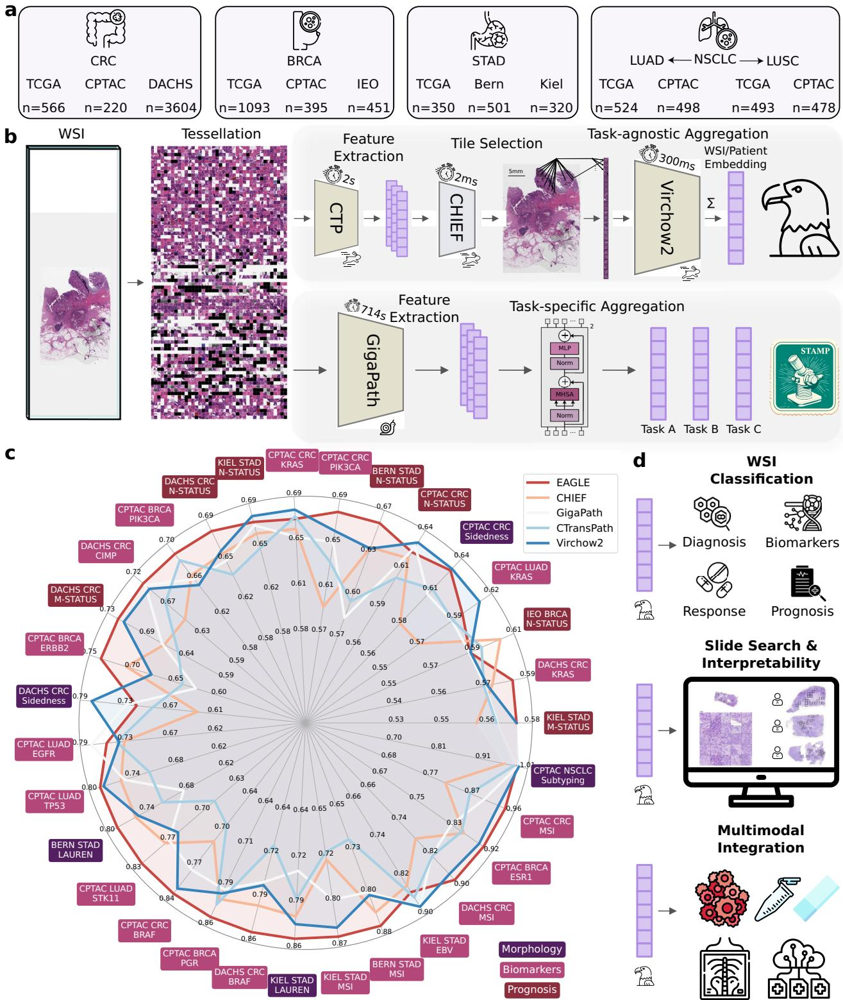
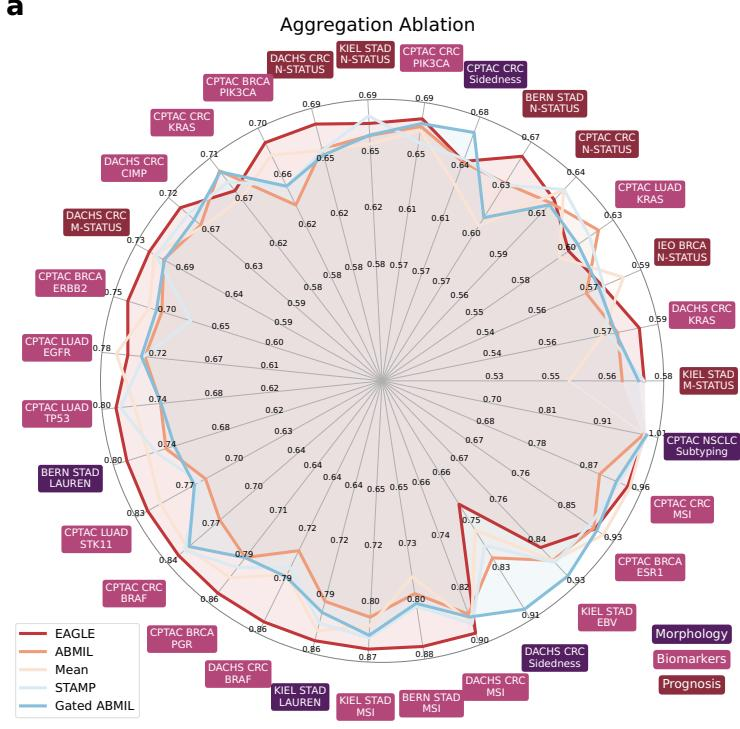
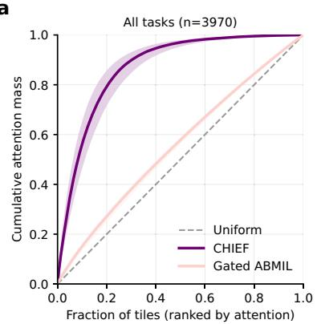
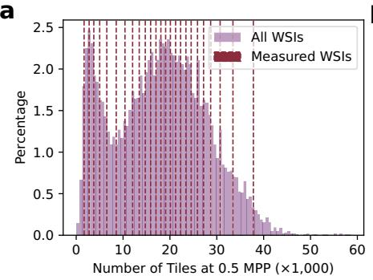

[← 返回 README](../README.md)

# Results 结果

## 📌 预览

五块结果：(1) 31 任务 benchmark——EAGLE 总体 AUROC 0.742 居首（TITAN 0.740），生物标志物任务最强；(2) 设计消融 + 负对照——25 tile 最优、CHIEF 选择显著超随机（Monte Carlo p=0.0099）、超参调优不迁移；(3) 注意力集中分析——CHIEF Gini 0.702（高度集中）vs ABMIL 0.087（近均匀）；(4) PathoBench 12 生存/疗效任务泛化最优；(5) 效率——2.27s/slide，及数据稀缺下最优、超 GPT-4o。

---

## EAGLE improves upon state-of-the-art approaches

We evaluated EAGLE within an established benchmarking framework encompassing 31 CPath tasks across breast (BRCA), colorectal (CRC), gastric (STAD), and non-small cell lung cancers (NSCLC). All classifiers were trained using five-fold cross-validation on TCGA and evaluated on full external test cohorts (CPTAC, DACHS, Kiel, Bern, IEO), ensuring external validation without data leakage.

Across all 31 tasks, EAGLE and TITAN achieved the highest average AUROC scores of 0.742 and 0.740, respectively. EAGLE exceeded key AUROC thresholds more often: surpassing 0.800 in 39% of tasks and 0.650 in 77% of tasks—higher than TITAN (35% and 68%) and Virchow2 (26% and 65%). EAGLE (0.772), TITAN (0.763), and COBRA (0.757) excelled on biomarker tasks. In morphology tasks TITAN achieved the highest (0.814). EAGLE scored highest in three of four cancer types—BRCA (0.737), CRC (0.710), STAD (0.755)—while TITAN scored highest in lung (0.810).

*Fig. 1: EAGLE 框架。(a) 主 benchmark：13 cohort、4 癌种、9528 WSI；(b) 工作流对比——EAGLE 用 CTransPath 提特征 → CHIEF 选 tile → Virchow2 编码 25 个选中 tile → 平均成 1 个 WSI embedding；常规监督管线则编码全部 tile 再用逐任务模型聚合；(c) 31 任务平均 AUROC。*

> 💡 **Figure 1 批读**（框架 + benchmark 规模）（Hao 批注）：(b) 的工作流对比是核心——EAGLE 三步（CTransPath 全图粗提 → CHIEF 选 25 tile → Virchow2 精提）vs 常规"全 tile 编码 + 逐任务聚合"。9528 WSI × 13 cohort 的规模 + 严格外部验证（训 TCGA、测 CPTAC/DACHS/Kiel/Bern/IEO，无泄漏）让结论可信。注意 EAGLE 总体第一但**形态学任务输给 TITAN、肺癌输给 TITAN**——稀疏采样对"需要全局架构上下文"的任务有短板（Discussion 承认）。

## Design analysis and negative controls

Among five aggregation options for Virchow2 embeddings, EAGLE (top 25 tiles via CHIEF, averaged) achieved highest mean AUROC (0.742), beating gated ABMIL (0.723), STAMP (0.723), mean pooling (0.720), regular ABMIL (0.711). Performance increased up to 25 tiles (0.745); **using only top 5 tiles (0.727) already outperformed mean pooling of ALL embeddings (0.720)**. A 100-replicate random baseline: for every tile budget N, CHIEF-based selection exceeded the maximum random replicate (Monte Carlo p = 0.0099), excluding that any unguided subset performs comparably. Hyperparameter tuning gave modest internal gains (0.02-0.03) that did NOT generalize externally (<0.01), R²=0.04 — tuning reflects overfitting, not transferable optimization.

*Fig. 3: 消融。(a) Virchow2 特征的 5 种聚合对比；(b) EAGLE 内换 5 种 tile encoder；(c) tile 数量与选择策略（CHIEF 加权/不加权 vs 随机负对照，N=5/10/25/50/100）；(d) 原生 slide encoder vs EAGLE；(e) 调参前后 AUROC 变化。*

> 💡 **Figure 3 消融解读**（对压缩最关键的三个数字）（Hao 批注）：
> 1. **top 5 tile (0.727) > 全部 tile mean pooling (0.720)**——5 个 tile 就超过用全部 tile！这是"绝大多数 patch 冗余"的极端确证。
> 2. **CHIEF 选择 > 所有随机副本（Monte Carlo p=0.0099）**——涨点来自**结构化的区域排序**，不是"处理更少 tile"本身。这个负对照极重要：它排除了"少即是好只是因为降噪/正则"的平凡解释，证明 CHIEF 的显著性先验真的选对了区域。对 ReadySlide：**allocator 的排序质量必须显著超过随机保留**才算有效——这正是 memory 里"label-free allocator 只比 Top-k 好 ~1pp"要过的坎。
> 3. **调参不迁移（R²=0.04）**——大 embedding 模型的性能由**表示质量**决定，不是分类器调参。提醒：比较压缩方法时别把增益归给调参。

## Attention concentration analysis

CHIEF induced a stable non-uniform saliency ordering: median fraction of tiles to accumulate 50% attention mass was **8.4% for CHIEF vs 44.1% for ABMIL and 42.0% for gated ABMIL** (80% mass: 20.5% vs 75.8% vs 73.6%). Mean Gini coefficient: **0.702 (CHIEF) vs 0.087 (ABMIL) vs 0.104 (gated ABMIL)**. This was strongest for subtle biomarker endpoints, where task-specific ABMIL attention approached mean-pooling behavior.

*Fig. 4: 注意力集中分析。Lorenz 曲线（累积注意力质量 vs 按注意力排序的 tile 比例）、Gini 系数热图、累积 50%/80% 质量所需 tile 比例、top-k 质量分布等。*

> 💡 **Figure 4 批读**（一个反直觉但深刻的发现）（Hao 批注）：这节回答"为什么要用 task-agnostic 的 CHIEF 选 tile，而不是端到端学注意力"。**发现：端到端弱监督训练的 ABMIL 注意力趋向近均匀聚合**（Gini 仅 0.087，需 44% tile 才累积 50% 注意力）——尤其在细微的生物标志物任务上，ABMIL 注意力退化成≈mean pooling！而 CHIEF 的预训练显著性先验高度集中（Gini 0.702，8.4% tile 就占 50%）。
> - **深刻含义**：这与本主题 [Spatial-Blindness](../../../ckmil-re-attn-mil/)、[ACMIL](../../%5BECCV%202024%5D%20ACMIL/) 呼应——**端到端学的注意力在弱监督+小样本下不可靠**（要么过度集中过拟合，要么退化成均匀）。EAGLE 的对策是**用大规模预训练的 task-agnostic 显著性先验替代逐任务学的注意力**。对 ReadySlide：这支持"用预训练 FM 的显著性（如 CHIEF/importance_chief）做保留，而非依赖下游任务学的注意力"的路线。

## Generalization (PathoBench) & Efficiency

On PathoBench (12 survival/treatment-response tasks, 5 additional cancer types), EAGLE achieved highest mean C-index (0.584) and highest treatment-response AUROC (0.689). On CPTAC PDA, EAGLE achieved clear risk stratification (HR=2.02, p=0.0038) whereas TITAN/CHIEF/GigaPath showed no significant separation.

EAGLE processes one slide in **2.27 s** (CTransPath 2MPP 2.01s + CHIEF 0.36ms + Virchow2 on 25 tiles 0.26s), vs Prov-GigaPath 16 min/WSI, TITAN markedly more compute. Only ~2% of tiles reprocessed at 2MPP (~0.1% at 0.5MPP). In data-scarce settings (75/150/300 patients), EAGLE maintained highest AUROC (150 patients: 0.689 vs TITAN 0.669). EAGLE also surpassed GPT-4o in-context learning (which stayed at chance 0.5) — even when GPT-4o was given EAGLE's top 25 tiles, showing the bottleneck is lack of pathology-specific features, not input resolution.

*Fig. 7: 计算效率与数据稀缺场景。runtime/FLOPs/tile 数对比、runtime vs AUROC、FLOPs vs AUROC、75/150/300 患者下的 AUROC、罕见 biomarker ROC。*

> 💡 **Figure 7 批读 + 可解释性/伪影**（Hao 批注）：
> - **效率 Pareto**：EAGLE 在"最高 AUROC + 最省算力"的角落，Prov-GigaPath 则最慢最差。2.27s/slide 让病理 AI 有望跑在平板甚至手机上。
> - **数据稀缺最优**：150 患者时 EAGLE 0.689 远超 TITAN 0.669——**聚焦 tile 选择在小样本下优势更大**（少 tile = 少噪声 = 更好的统计条件）。
> - **伪影规避（Fig.8）**：EAGLE 选的 tile 里伪影更少（主导 pen mark 仅 1% vs 监督 baseline 15%），因为 CHIEF 的组织显著性先验天然避开 pen mark/组织褶皱。对压缩：**好的保留器还能顺带过滤伪影**，是额外红利。
> - **超 GPT-4o**：即便喂 GPT-4o EAGLE 选的 25 tile，它仍在随机水平——瓶颈是缺病理特异表示，不是输入。说明通用 MLLM 短期难替代专用病理 FM。
