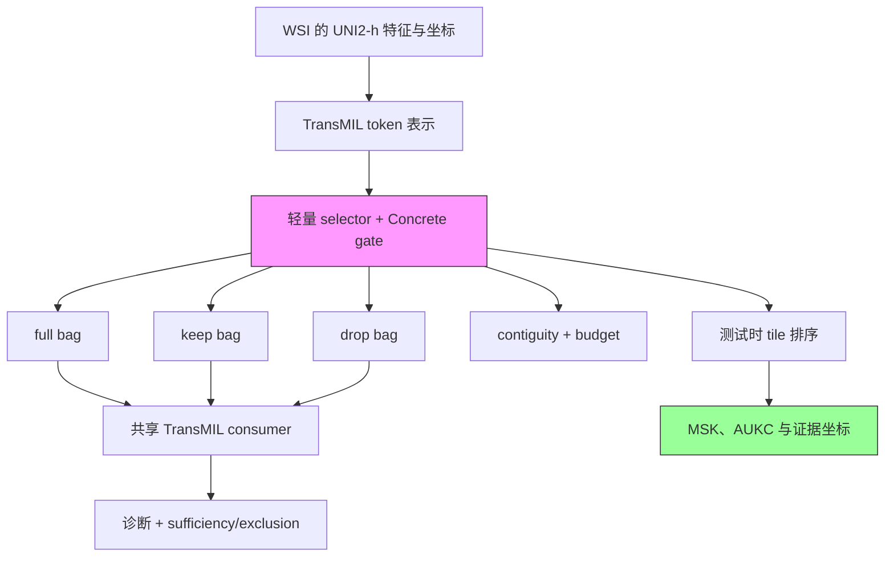

# ReaMIL: Reasoning- and Evidence-Aware Multiple Instance Learning for Whole-Slide Histopathology

**作者**: Hyun Do Jung, Jungwon Choi, Hwiyoung Kim  
**会议**: WACV 2026 LFMBio Workshop（Oral）  
**年份**: 2026  
**链接**: [arXiv 摘要](https://arxiv.org/abs/2601.10073) · [PDF](https://arxiv.org/pdf/2601.10073)

## 一句话总结

ReaMIL 在 frozen UNI2-h 特征与 TransMIL 之上增加轻量证据 selector，用 full/keep/drop 三袋和 sufficiency、exclusion、contiguity、budget 四类约束，将“注意力看起来合理”改写成“少量 tile 足以恢复诊断、补集不再支持诊断”的可干预目标。

## 核心贡献

1. 将 evidence selection 作为 MIL 的显式训练目标，而不是事后 attention 可视化。
2. 用 Concrete gate 构造 full、keep、drop 三个共享-consumer 视图，同时优化诊断保真、排除性、空间连续和稀疏预算。
3. 提出 MSK 与 AUKC：分别衡量达到置信度阈值所需的最少 tile，以及逐步揭示 top-K tile 时的置信度曲线面积。
4. 在 NSCLC、BRCA、PANDA 上基本保持诊断 AUC，并将高置信证据压缩到约 7–16 张 tile。
5. 为 ReadySlide 提供同模型 selector adaptation 的直接方法参考，也明确压缩了“首次轻量 selector / 首次最小充分 patch 指标”的 novelty 空间。

## 📖 批读导航

| Section | 内容 |
|---|---|
| [00 - Abstract](sections/00-abstract.md) | 方法、核心结果与 novelty 边界 |
| [01 - Introduction](sections/01-introduction.md) | bag-level 正确与 tile evidence 的错位 |
| [02 - Related Work](sections/02-related-work.md) | MIL、attention interpretability、budgeted rationale |
| [03 - Methodology](sections/03-methodology.md) | selector、三袋、五项 loss、MSK/AUKC |
| [04 - Experiments](sections/04-experiments.md) | 三数据集结果、K-curve、消融与证据图 |
| [05 - Conclusion](sections/05-conclusion.md) | 结论、单 FM/单 consumer 局限 |
| [06 - Acknowledgement & References](sections/06-acknowledgement-references.md) | 致谢与完整参考文献 |

## 关键数字

| 指标 | 结果 |
|---|---|
| 特征 / consumer | frozen UNI2-h（1536 维）/ TransMIL（512 维、8 heads、4 layers） |
| NSCLC AUC | baseline 0.969 ± 0.006 → ReaMIL 0.983 ± 0.004 |
| BRCA AUC | 0.897 ± 0.019 → 0.904 ± 0.011 |
| PANDA AUC | 0.989 ± 0.003 → 0.985 ± 0.002 |
| MSK@0.90 | BRCA 16.0；NSCLC 8.2；PANDA 7.2 tiles |
| AUKC | BRCA 0.833；NSCLC 0.864；PANDA 0.811 |
| NSCLC 选择率 | 完整模型 0.002；去除关键约束后 0.847–0.923 |
| 实验重复 | 3 seeds |

## 数据流：输入 → 中间表示 → 输出

## 优缺点与还能做什么

### 优点

- full/keep/drop 共用 consumer，干预定义清楚，避免不同模型输出不可比。
- 同时要求 keep 足够和 drop 无效，比单独 top-attention 可视化更有证据力。
- 明确把保真度与预算绑定，消融揭示“选几乎全袋”会制造虚假的低 sufficiency gap。
- 只需 slide label，不需要 tile annotation。

### 局限 / 风险

- 只测试 UNI2-h + TransMIL；selector ranking 是否依赖 FM/consumer 未知。
- 冻结的是 feature encoder，MIL consumer 是否严格冻结并不清楚，不能直接等同于 frozen-consumer repair。
- MSK 依赖真类、阈值与 consumer 校准，不宜未经校准跨 consumer 比较。
- contiguity 偏好紧凑 ROI，可能伤害多灶、弥漫或长程形态任务。
- 未报告 selector 与 keep-bag 推理的真实 wall-clock、显存和 I/O 节省。

### 还能做什么（对 ReadySlideBenchmark）

- 构建 selector FM × consumer FM × budget 三维矩阵，检验同一排序是否跨 consumer 保持 utility。
- 把 consumer 完全冻结，只训练 selector，区分“修选择”与“共同重训诊断器”。
- 同时报告 calibrated MSK、固定预算性能、partial AUKC、drop necessity 与随机/oracle 上界。
- 把节省拆成昂贵 FM 编码、MIL 聚合、存储和端到端延迟，避免只报告 tile 数。

## 阅读 Q&A 记录

- **Q: ReaMIL 是否已经完成严格的 diagnosis–selection 解耦？**  
  **A:** 部分完成。它增加独立 selector head，但 selector 与 TransMIL 通过共同损失训练；真正的严格解耦应冻结既有 consumer，仅改变 selector，并验证 full-bag prediction 不漂移。
- **Q: MSK=8.2 是否能直接和另一 consumer 的 MSK 比？**  
  **A:** 不能直接比。MSK 取决于真类置信度校准和阈值 0.90；跨 consumer 应先校准，或用相对 full-bag 置信度/性能保持率定义阈值。
- **Q: 低 sufficiency gap 为什么可能是坏结果？**  
  **A:** 如果 selector 保留 85%–92% tile，keep bag 几乎等于 full bag，gap 自然低。Table 3 说明必须和 selection rate 同时报。
- **Q: ReadySlide 的主要差异化在哪里？**  
  **A:** 不在“再加一个 selector”，而在跨病理 FM 的角色交叉、consumer/预算依赖、排名错配机制，以及严格 frozen-consumer 下的修复。

## 📊 Citation Landscape

**数据源与时间**: Semantic Scholar API，查询于 2026-08-19。  
**TLDR**: ReaMIL 为强 MIL backbone 增加轻量 selection head，并用 MSK、AUKC 与 contiguity 定量评估 WSI 证据效率。  
**统计**: 19 篇参考文献；被引 1 次；influential citation 0 次。  
**入口**: [Semantic Scholar](https://www.semanticscholar.org/paper/ee87a775ecba46cefc6fed3b72070ffd69a310b5) · [Connected Papers](https://www.connectedpapers.com/main/2601.10073)

### 参考文献分组（高引用代表）

- **WSI-MIL**: Attention-based Deep MIL（2,764）；Clinical-grade CPath（2,654）；CLAM/Data-efficient WSI（2,269）；TransMIL（1,377）。
- **病理基础模型**: General-Purpose Pathology FM / UNI（1,743）；Scaling ViT to 22B（919）。
- **可微选择**: Gumbel-Softmax（6,613）；Concrete Distribution（2,981）；Selective Classification（1,073）。
- **解释可靠性**: Is Attention Interpretable?（863）；Learning to Deceive with Attention（217）；Interpretability Survey（470）。

### Semantic Scholar 推荐论文

1. PNEA-MIL: Positive-Negative Evidence Analysis（2026）
2. CGRL: Concept-Guided Pruning and Representation Learning（2026，arXiv:2607.12556）
3. Objective Design for Self-Supervised Slide-Level Aggregation over Frozen Pathology Foundation Features
4. Test-Time Instance Selection for Improved Whole Slide Image Analysis（2026，arXiv:2608.14759）
5. Uncertainty Estimation in Pathology Foundation Models via Deep Mutual Learning（2026）
6. ProsMAE: Multi-Source MAE Pretraining（2026）
7. TaxoMIL: Taxonomy-Constrained Learning（2026）
8. Turning Pre-Trained Vision Transformers into End-to-End Histopathology WSI Models for Survival Prediction
9. Multi-Teacher Distillation from Pathology Slide Foundation Models（2026）
10. Adaptive Fusion of Pathology Foundation Models（2026）
