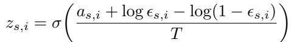
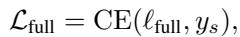
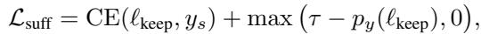
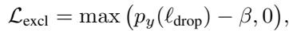
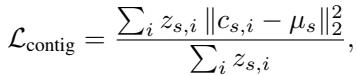
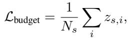
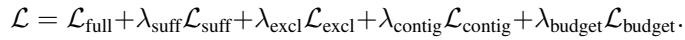
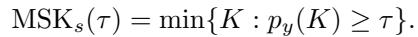
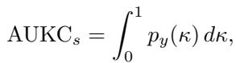

[← 返回 README](../README.md)

## 3. Methodology

> 💡 **方法预览（claude 批注）**: 数据流是 frozen UNI2-h 特征与坐标 → TransMIL token → selector 产生软 gate → full/keep/drop 三袋共享 consumer → 五项损失塑造 evidence → 测试时按无噪声 selector logit 排序。

We build ReaMIL on top of a transformer-based MIL backbone, adding a lightweight evidence head that learns which patches suffice for the slide-level prediction. Figure 1 illustrates the overall architecture.

## 3.1. Problem setup and backbone

Following standard weakly supervised MIL, each slide s consists of a bag of patch features $X _ { s } = \{ x _ { s , i } \} _ { i = 1 } ^ { N _ { s } }$ extracted by a frozen encoder, along with spatial coordinates $C _ { s } =$ $\{ \bar { c } _ { s , i } \} _ { i = 1 } ^ { N _ { s } }$ where $c _ { s , i } = ( u _ { s , i } , v _ { s , i } )$ is the pixel location of patch i. We use UNI2-h [4] to extract d=1536 dimensional features. The slide has a single label $y _ { s } \in \{ 1 , \ldots , C \}$ but no patch-level supervision.

Patch features are projected into a token space via $\tilde { x } _ { s , i } = W _ { \mathrm { f e a t } } x _ { s , i } + b _ { \mathrm { f e a t } } .$ , with optional positional embeddings $t _ { s , i } = \tilde { x } _ { s , i } + \mathrm { M L P } _ { \mathrm { p o s } } ( \mathrm { n o r m } ( c _ { s , i } ) )$ . The resulting tokens $T _ { s } ~ = ~ [ t _ { s , 1 } , \ldots , t _ { s , N _ { s } } ]$ are processed by a TransMIL backbone [17]: a learned [CLS] token is prepended to the sequence and passed through L transformer layers. The final CLS representation $h _ { \mathrm { C L S } } \in \mathbb { R } ^ { d _ { \mathrm { m o d e l } } }$ is mapped to class logits $\ell _ { s } = W _ { \mathrm { c l s } } h _ { \mathrm { C L S } } + b _ { \mathrm { c l s } } \in \mathbb { R } ^ { C }$ , and baseline training uses cross-entropy $\mathcal { L } _ { \mathrm { f u l l } } = \mathbf { C } \mathbf { E } ( \ell _ { s } , y _ { s } )$

  
*Figure 1. Overview of ReaMIL. Frozen UNI2-h features and patch coordinates are extracted from each WSI and mapped to tokens with positional embeddings. An evidence head produces soft selection scores $z \in ( 0 , 1 ) ^ { N }$ via a Concrete (Gumbel–sigmoid) gate, and defines three bags: the full bag x, a keep bag $z \cdot x .$ and a drop bag $( 1 - z ) \cdot x .$ All three bags are processed by a shared TransMIL encoder and slide head. Losses encourage (i) correct predictions on the full and keep bags (cross-entropy on $\ell _ { \mathrm { f u l l } }$ and $\ell _ { \mathrm { k e e p } }$ plus a sufficiency hinge at confidence $\tau$), (ii) low true-class probability on the drop bag (exclusion), (iii) spatially compact selections (contiguity on coordinates), and (iv) a small evidence budget via an $\ell _ { 1 }$ penalty on z. At test time, the model outputs both slide predictions and ranked evidence coordinates. Reasoning metrics are computed by probing the top-K curve of true-class probability $p _ { y } ( K )$: AUKC summarizes the area under this curve, and $\mathrm{MSK}@\tau$ measures the minimal number of tiles required to reach confidence $\tau$.*

> 💡 **Figure 1 批读（claude 批注）**: 图中真正新增的接口只有 selector head 与三种 bag 构造；consumer 和分类头共享。这使比较控制得很干净，但训练成本约为三次 consumer forward。论文未明确部署时最终预测取自 full bag 还是 keep bag，也未给出需要几次 consumer forward；ReadySlide 应把推理图、wall-clock 与 feature-I/O 成本单独测清。

## 3.2. Evidence selection head

For each token $t _ { s , i } ,$ a small MLP computes a selection logit $a _ { s , i } = \mathrm { M L P } _ { \mathrm { s e l } } ( t _ { s , i } ) \ \in \ \mathbb { R }$ . To enable differentiable selection, we apply the Concrete (Gumbel-sigmoid) relaxation [11, 14]. We sample $\epsilon _ { s , i } \sim$ Uniform(0, 1) and compute:

*Equation 1: Concrete（Gumbel–sigmoid）软选择门。*

> 💡 **Equation 1 批读（claude 批注）**: 温度 $T$ 决定 gate 接近二值的速度；训练时噪声提供可微探索，测试时则按确定性的 logit $a_{s,i}$ 排序。因此训练目标学习的是排序与稀疏质量，而不是一个固定的 $K$。

where $T \gt 0$ is the temperature. This yields soft selection scores $z _ { s , i } \in ( 0 , 1 )$ that approach binary values as $T \to 0$

The scores define three views of each slide: the original bag $X _ { \mathrm { f u l l } } = X _ { s }$ , the evidence bag $X _ { \mathrm { k e e p } } = z _ { s } \odot X _ { s } ,$ and its complement $X _ { \mathrm { d r o p } } = ( 1 - z _ { s } ) \odot X _ { s }$ , where ⊙ denotes element-wise scaling. Since hard selection is nondifferentiable, we retain all tokens in the sequence but down-weight non-selected patches via soft masking. Each view is processed by the shared backbone to produce logits $\ell _ { \mathrm { f u l l } } , \ell _ { \mathrm { k e e p } } ,$ and $\ell _ { \mathrm { d r o p } } .$

## 3.3. Evidence-aware training objectives

Our goal is not only to achieve high slide-level accuracy, but also to explicitly shape how the model uses evidence inside each bag. To this end, we design an evidence-aware training objective that couples a standard classification loss with four additional terms, each enforcing a distinct property of the selector. Together, these losses encourage decisions that are (i) sufficient, with a small subset of selected patches supporting high-confidence predictions; (ii) exclusive, with the remaining patches not supporting the true label (low true-class probability); (iii) spatially contiguous, so that evidence forms coherent regions on the slide; and (iv) budgeted, limiting the amount of selected evidence.

Let $p _ { y } ( \ell ) = \mathrm { s o f t m a x } ( \ell ) [ y _ { s } ]$ denote the true-class probability. We combine five losses:

*Equation 2: full bag 分类损失。*

*Equation 3: keep bag 交叉熵与置信度充分性 hinge。*

*Equation 4: drop bag 的真类排除约束。*

*Equation 5: 选择区域相对加权质心的空间离散度。*

*Equation 6: 归一化选择质量，即软预算。*

> 💡 **五项约束拆解（claude 批注）**: full CE 保住诊断；sufficiency 让 keep 可诊断；exclusion 让 drop 不再支持真类；contiguity 偏好单个紧凑 ROI；budget 压低选择率。最后两项带有强归纳偏置：多灶、弥漫或跨区域形态任务可能被“紧凑”先验误伤，跨任务 benchmark 必须单独看这类 endpoint。

where $z _ { s , i }$ are selection scores, $\begin{array} { r } { \mu _ { s } = \sum _ { i } z _ { s , i } c _ { s , i } / \sum _ { i } z _ { s , i } } \end{array}$ is the z-weighted centroid, and $\tau , \beta \in ( 0 , 1 )$ are hyperparameters, with τ used as a confidence threshold on the true-class probability $p _ { y } ( . )$ and T in (1) serving as the temperature of the Concrete gate. $\mathcal { L } _ { \mathrm { b u d g e t } }$ is the average selection rate (normalized $\ell _ { 1 }$ norm of $z _ { s } )$ and acts as an explicit sparsity penalty.

The total loss is

*Equation 7: ReaMIL 总目标。*

> 💡 **优化风险（claude 批注）**: 这些 $\lambda$ 不只是常规超参，它们定义 fidelity–sparsity–geometry 的 Pareto 点。若只报告一个配置，就无法判断模型在不同预算下的排序是否稳定；ReadySlide 应把 budget 作为显式轴，而不是把它折进一组固定 loss weights。

Here, the weights $\lambda _ { \mathrm { s u f f } } , \lambda _ { \mathrm { e x c l } } , \lambda _ { \mathrm { c o n t i g } } , \lambda _ { \mathrm { b u d g e t } }$ balance fidelity against the strength of the evidence-aware constraints.

## 3.4. Evidence-efficiency metrics

Conventional metrics such as AUC, accuracy, or F1 summarize how often a model predicts the correct slide label, but they are insensitive to how much evidence the model needs to make those predictions. To evaluate whether ReaMIL actually learns to rely on small, sufficient evidence sets, we introduce a family of evidence-efficiency metrics based on the behavior of the model as top-ranked tiles are gradually revealed. To quantify evidence efficiency, we probe the relationship between revealed patches and model confidence. At test time, we rank patches by their selection logits $a _ { s , i }$ (Gumbel noise is used only during training) and construct a K-curve that records the true-class probability $p _ { y } ( K )$ as a function of the number of revealed patches K.

Minimal Sufficient K (MSK). For each slide s and confidence threshold τ, we define

*Equation 8: 每张 slide 达到置信度阈值的最小充分 tile 数。*

> 💡 **MSK 指标批读（claude 批注）**: MSK 依赖真类标签、consumer 校准和阈值 $\tau$。两个 selector 的 MSK 差异可能来自 consumer 置信度尺度而非真实 evidence 质量，因此跨 consumer 比较必须先校准或改用相对 full-bag score 的阈值；同理，AUKC 也受整条 true-class probability 曲线的校准影响。

MSK measures how many top-ranked patches are needed for the model to reach confidence τ.

Area Under K-Curve (AUKC). We also define the area under the K-curve in terms of the normalized evidence fraction $\kappa = K / N _ { s } \in [ 0 , 1 ]$

*Equation 9: 归一化 top-K 置信度曲线下面积。*

> 💡 **AUKC 指标批读（claude 批注）**: AUKC 奖励“少量 tile 即快速恢复置信度”的排序，但积分覆盖到全袋，后半段大量冗余 tile 可能掩盖小预算差异。ReadySlide 应同时报告预算区间的 partial AUKC，以及固定 $K$/比例下的性能；partial AUKC 只改善预算聚焦，并不消除跨 consumer 的校准依赖。

## 🔖 Section 总结

- selector 通过 Gumbel–sigmoid 学软 gate，测试时输出确定性排序。
- evidence 被拆成 sufficiency、exclusion、contiguity、budget 四个性质。
- MSK/AUKC 可复用，但跨 consumer 时必须处理校准与预算区间问题。

where $p _ { y } ( \kappa )$ denotes the true-class probability when the top $\kappa \cdot N _ { s }$ tiles are kept.
