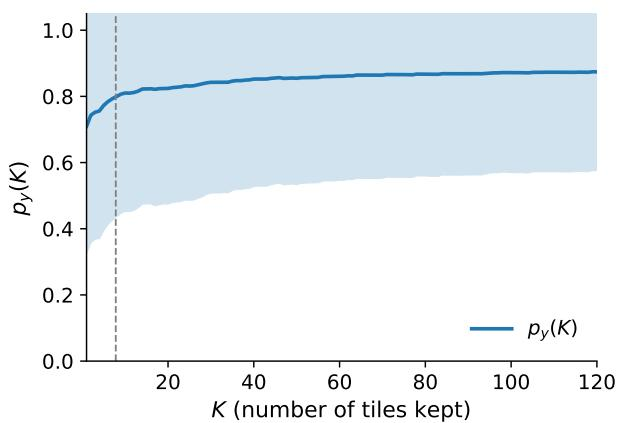
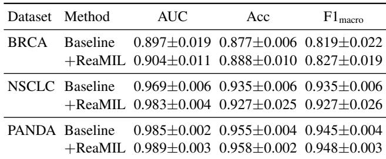
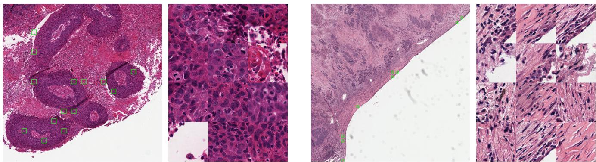
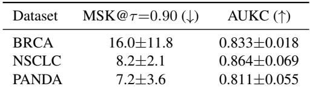
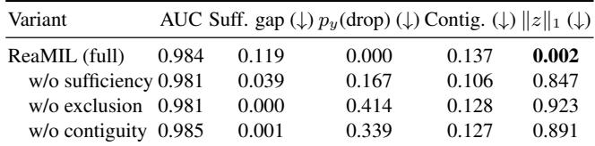

[← 返回 README](../README.md)

## 4. Experiments

> 💡 **实验预览（claude 批注）**: 三个二分类数据集验证“诊断不掉、证据变少”，主证据来自 AUC、MSK/AUKC 和损失消融；缺失的是不同 FM、不同 consumer、不同预算与真实推理成本的角色交叉。

## 4.1. Datasets and setup

We evaluate on three binary WSI classification tasks: TCGA-NSCLC (LUAD vs. LUSC), TCGA-BRCA (IDC vs. Others), and PANDA (clinically significant vs. nonsignificant prostate cancer). For each dataset, we construct patient-disjoint train/validation/test splits with class stratification. All slides are processed into frozen UNI2-h features (d=1536) and tile coordinates; the encoder is never finetuned. Details on label mappings and patient counts are in the supplement.

The backbone is a TransMIL-style transformer $( d _ { \mathrm { m o d e l } } { = } 5 1 2 .$ 8 heads, 4 layers). We first train a baseline with standard cross-entropy, then attach the evidence head and continue training with the combined loss (Section 3), warm-starting from the baseline checkpoint. All models use AdamW with cosine decay and mixed-precision on two RTX 6000 Ada GPUs. We report mean±std over three seeds.

  
*Figure 2. K-curve on NSCLC (test set). True-class probability $p _ { y } ( K )$ as top-K tiles (ranked by selection score) are revealed. Solid line: mean across slides; shaded region: ±1 std. Vertical dashed line: mean MSK@τ = 0.9. MSK is computed per-slide before averaging, so individual slides may cross τ even when the mean curve does not.*

> 💡 **Figure 2 批读（claude 批注）**: 曲线早段陡升说明排序把高效证据放在前面，虚线是“逐 slide 先求 MSK 再平均”，因此不要求均值曲线本身穿过 0.9。这个细节应保留，否则容易把聚合曲线与样本级最小值混为一谈。

## 4.2. Slide-level performance

Table 1 compares the baseline (TransMIL + UNI2-h, no evidence head) against ReaMIL with the full budgeted objective, showing that adding the evidence head and reasoning losses extends standard MIL pipelines without trading accuracy for interpretability.

*Table 1. Slide-level performance (mean±std, 3 seeds). ReaMIL uses the full budgeted objective.*

> 💡 **Table 1 批读（claude 批注）**: 三项 AUC 都上升：NSCLC 0.969→0.983、BRCA 0.897→0.904、PANDA 0.985→0.989；但 NSCLC accuracy/F1 从 0.935 降至约 0.927。故更准确的结论是 ranking quality 改善，但阈值化分类指标并非同步上升。

## 4.3. Evidence efficiency

Figure 2 shows K-curves on NSCLC: for each slide, tiles are ranked by selection score and the true-class probability $p _ { y } ( K )$ is recorded as the top-K tiles are revealed. Table 2 reports MSK@τ=0.90 (minimal tiles to reach 90% confidence) and AUKC across all datasets. Note that these metrics require an explicit selector to rank tiles and are therefore defined only for ReaMIL, not for vanilla MIL baselines.

  
*Figure 3. Evidence visualization on TCGA-NSCLC. Left: LUSC (squamous cell carcinoma) case with relatively compact evidence clusters over squamous tumor nests. Right: LUAD (adenocarcinoma) case with more diffuse selection over gland-forming tumor regions. Each panel shows selected tile locations (green boxes) and the corresponding top-K zoomed patches. For visualization, we show zoomed-in regions (left: $8 1 9 2 \times 8 1 9 2 ;$ right: 16384 × 16384 pixels), where the selected tiles (size 256 × 256) are outlined in green.*

> 💡 **Figure 3 批读（claude 批注）**: LUSC 的证据集中在鳞状肿瘤巢，LUAD 则分散在腺体形成区，说明同一个 contiguity 先验面对不同形态会产生不同空间模式。图像支持“选中区域具有病理可读性”，但没有病理医师标注或反事实验证，不能单凭视觉重合宣称因果证据。

*Table 2. Evidence efficiency metrics for ReaMIL (mean±std, 3 seeds). MSK@0.9: minimal tiles to reach 90% confidence. AUKC: area under the K-curve. These metrics require an explicit selector and are not defined for vanilla MIL baselines.*

On NSCLC, ReaMIL achieves MSK@0.9 of approximately 8.2 tiles—fewer than 0.1% of the average bag size $( \sim 6 , 0 0 0$ tiles)—demonstrating that the selector concentrates evidence into a small, sufficient subset.

> 💡 **Table 2 批读（claude 批注）**: 论文原文“少于 0.1%”算术上不准确：$8.2/6000\approx0.137\%$。而 Table 3 的 $\|z\|_1=0.002$ 是连续 soft gate 的平均质量（约 0.2%），不能与 hard top-K 的 MSK 比例混写。7–16 张 tile 达到 0.9 置信度仍很紧凑，但论文没有用 attention、随机、CHIEF 或 oracle ranking 在同一 MSK/AUKC 协议下比较。

## 4.4. Ablations

Table 3 isolates each loss component on NSCLC. Without the full objective, ablated models select nearly all tiles (mean $\| z \| _ { 1 } ~ \gt ~ 0 . 8 5$ vs. 0.002 for ReaMIL), causing the keep bag to approximate the full bag. This yields trivially low suff. gap and contig. values—not because evidence is well-selected, but because almost nothing is excluded. In contrast, ReaMIL (full) achieves true sparse selection: $p _ { y } ( \mathrm { d r o p } ) \approx 0$ shows the complement is non-predictive for the true class, confirming that the small selected set genuinely captures the diagnostic signal.

## 4.5. Qualitative results

Figure 3 shows evidence overlays on representative NSCLC slides. The LUSC case (left) exhibits relatively compact evidence clusters over squamous tumor nests. The LUAD case (right) shows a more diffuse pattern of selected tiles across gland-forming adenocarcinoma regions. In both cases, ReaMIL concentrates its evidence on morphologically relevant tumor areas while largely ignoring background tissue, consistent with the quantitative findings.

*Table 3. Ablations on NSCLC. Suff. gap: confidence drop using only kept tiles. $p _ { y } ( \mathrm { d r o p } ) { \mathrm { : } }$ true-class probability of the drop bag (lower = the drop bag alone does not support the true label). Contig.: spatial dispersion. $\| z \| _ { 1 } { \mathrm { : } }$ mean selection rate (normalized $\ell _ { 1 } ;$ lower = sparser). Ablations select nearly all tiles, yielding trivially low suff. gap but defeating the goal of compact evidence; only ReaMIL (full) achieves true sparse selection.*

> 💡 **Table 3 消融解读（claude 批注）**: 最关键的不是 AUC，而是 ablation 的选择率从完整模型 0.002 爆到 0.847–0.923。低 sufficiency gap 在选中几乎全袋时是平凡解，说明任何 evidence benchmark 都必须把保真度与预算绑定报告，不能只看 keep-bag accuracy。

> 💡 **证据边界（claude 批注）**: 原文称小集合“genuinely captures the diagnostic signal”，但这些 loss 与 consumer 是联合优化的，低 $p_y(\text{drop})$ 只证明训练后模型的补集不再支持真类。缺少病理区域标注、独立 frozen-consumer 重放或外部反事实验证时，不能提升为病理语义上的因果必要性。

## 🔖 Section 总结

- 三个数据集只使用 UNI2-h + TransMIL，consumer/FM 依赖未测试。
- ReaMIL 把 evidence 压到约 0.2% 选择率，并在 NSCLC 达到 MSK 8.2。
- 论文没有报告真实 selector/keep-bag 部署延迟，也没有和外部 selector 在统一预算下比较。
