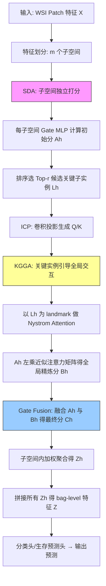

# CKMIL: Cascaded Key-Instance Attention Multiple Instance Learning for Histopathology Whole Slide Image Analysis

## 论文信息

| 项目 | 内容 |
|------|------|
| **Title** | CKMIL: Cascaded Key-Instance Attention Multiple Instance Learning for Histopathology Whole Slide Image Analysis |
| **Authors** | Anonymous submission |
| **Venue** | Anonymous submission, 2025 |
| **链接** | N/A (Anonymous) |
| **参考文献数** | 36 |

## 一句话总结

CKMIL 提出一种级联式关键实例注意力 MIL 框架，通过 Subspace-Disentangled Attention (SDA) 在多个特征子空间中筛选候选关键实例，再利用 Key-Instance Guided Global Attention (KGGA) 以这些关键实例为 landmarks 进行 Nystrom 高效的全局交互，解决了现有 WSI MIL 方法"要么忽略实例间关联，要么关键实例无关地建模全局交互而导致诊断信号稀释"的困境，在 BRACS 和 TCGA 多癌种 subtyping 和生存预测任务上，以通用域预训练特征提取器实现 SOTA。

## 核心贡献

1. **CKMIL 级联框架** (Section 3): 提出 SDA + KGGA 两级级联架构，SDA 在多个特征子空间中筛选候选关键子实例，KGGA 以这些候选关键实例为 landmarks 驱动 Nystrom 全局注意力，实现关键实例引导的高效全局交互（$O(n)$ 复杂度），紧密耦合筛选与交互阶段。

2. **Key-Instance Guided Global Attention (KGGA)** (Section 3.3): 以 SDA 选出的候选关键子实例替换传统 Nystrom attention 中基于 pooling 的 landmark 选择策略，通过 gate fusion 机制将初始评分与全局精炼评分融合，从根本上防止稀疏诊断信号在全局交互中被稀释。

3. **Instance-Conv-Projection (ICP)** (Section 3.4): 探索性模块，将传统线性投影替换为 Reshape-Conv-Reshape-Projection pipeline，用卷积捕获实例特征向量内部的局部相关性（intra-feature correlations），在特定数据集和特征提取器组合下带来额外增益。

4. **全面实验验证** (Section 4): 在 BRACS-3、TCGA-BLCA/BRCA/NSCLC 四个公开数据集上，涵盖 cancer subtyping 和 survival prediction 两个下游任务，以通用域 ResNet50 和医学域 UNI 两种特征提取器进行对比。用 ResNet50 特征时达到 SOTA；用 UNI 特征时在某些任务上与强 baseline 竞争。

## 📖 批读导航

| Section | 文件 | 核心内容 |
|---------|------|---------|
| 00 - Abstract | [00-abstract.md](sections/00-abstract.md) | 论文摘要、Figure 1 三种 MIL 范式对比 |
| 01 - Introduction | [01-introduction.md](sections/01-introduction.md) | WSI MIL 困境：独立注意力 vs 全局交互中的关键实例稀释、CKMIL 设计动机与贡献 |
| 02 - Related Work | [02-related-work.md](sections/02-related-work.md) | MIL for WSI、独立注意力加权方法、线性复杂度全局交互方法三类相关工作 |
| 03 - Methodology | [03-methodology.md](sections/03-methodology.md) | 问题形式化、CKMIL 总览 (Figure 2)、SDA、KGGA (Figure 3)、ICP (Figure 4) |
| 04 - Experiments | [04-experiments.md](sections/04-experiments.md) | 数据集与指标、主实验结果 (Table 1-2)、消融 (Table 3-4)、可视化 (Figure 5-6) |
| 05 - Conclusion | [05-conclusion.md](sections/05-conclusion.md) | 结论、参考文献、可复现性检查清单 |

## 关键数字

| 指标 | 数值 |
|------|------|
| 评估数据集 | 4 (BRACS, TCGA-BLCA, TCGA-BRCA, TCGA-LUAD/NSCLC) |
| 下游任务 | 2 (cancer subtyping, survival prediction) |
| 特征提取器 | 2 (ResNet50-ImageNet, UNI) |
| 对比方法数 | 8 (Mean/Max Pooling, ABMIL, CLAM-MB, DSMIL, TransMIL, MambaMIL, RRTMIL) |
| Patch 大小 | 256 x 256 pixels at 20x magnification |
| 交叉验证 | 5-fold (survival prediction), 5 random splits (subtyping) |
| D (特征维度) | 未明确给出（由 ResNet50/UNI 决定） |
| m (子空间数) | 超参数，未明确默认值 |
| r (候选关键实例数) | 超参数，由 top-r 筛选 |
| BRACS-3 AUC (ResNet50) | 0.8583 (CKMIL vs RRTMIL 0.8160, +2.78%) |
| BRACS-3 ACC (ResNet50) | 0.7370 (CKMIL vs RRTMIL 0.7129, +2.01%) |
| LUAD C-Index (ResNet50) | 0.6820 (CKMIL-Base, SOTA) |
| BRCA C-Index (ResNet50) | 0.6825 (CKMIL vs TransMIL 0.6158, +3.81%) |
| KGGA contribution (BRCA C-Index) | ABMIL+KGGA vs ABMIL: +5.84% |
| ICP contribution (BRCA C-Index, ResNet50) | CKMIL vs CKMIL-Base: +3.85% |

## 数据流：输入 → 中间表示 → 输出

## 优缺点与还能做什么

### 优点

1. **核心洞察清晰且可验证**: "关键实例引导全局交互"是一个简洁直观的动机，消融实验（Table 3-4）和可视化（Figure 5-6）都直接支撑这一主张
2. **方法模块化、正交于特征提取器**: SDA、KGGA、ICP 三个模块独立可插拔，消融实验中 ABMIL+SDA、ABMIL+KGGA、TransMIL+KGGA 等组合都带来提升，说明每个模块都有独立价值
3. **通用域特征上的 SOTA**: 用 ResNet50-ImageNet（非医学域预训练）特征即可超越用同样特征的 TransMIL、MambaMIL、RRTMIL，证明关键实例引导的策略在弱特征上更有价值
4. **可视化支撑**: Figure 5-6 的注意力热力图清晰展示了 CKMIL 相比 ABMIL/CLAM 更精准地聚焦于病理学家标注的诊断区域
5. **计算高效**: KGGA 基于 Nystrom attention 实现 $O(n)$ 复杂度，避免了 Transformer 的 $O(n^2)$ 瓶颈

### 局限 / 风险

1. **UNI 特征上的退化**: 用 UNI（医学域预训练）特征时，CKMIL 在某些 subtyping 任务上反而不如 ABMIL/CLAM。作者解释为"UNI 特征已经足够判别，建模相关性反而引入噪声"。这说明方法在高判别性特征上的增益有限，甚至有害
2. **ICP 模块效果不稳定**: ICP 模块只在特定数据集+特征提取器组合下有正收益（如 BRCA ResNet50: +3.85% C-Index），在其他场景下效果参差不齐甚至略差。作者定位为"exploratory"，尚未充分验证其普适性
3. **方法复杂度较高**: 相比 ABMIL 的单层 attention，CKMIL 增加了子空间划分、SDA 筛选、KGGA 全局交互、gate fusion、ICP 等多个组件，训练和调参成本增加
4. **超参数敏感**: m（子空间数）、r（候选关键实例数）是关键超参数，其选择依据和敏感性分析未在主文中充分展示（放在 Supplementary Material）
5. **匿名投稿，无法查证外部引用和后续工作**
6. **MambaMIL/RRTMIL 在 TCGA-BLCA 上 OOM**: 表明这些方法在 bags 特别大时存在严重的内存问题，但 CKMIL 对此场景的对比是空缺的

### 还能做什么

1. **自适应超参数**: 探索 m（子空间数）和 r（候选关键实例数）的自适应选择，而非固定为全局超参数
2. **多尺度关键实例选择**: 当前每个子空间独立选 top-r，可探索跨子空间的协同筛选策略
3. **将 KGGA 思想引入 Mamba/SSM 架构**: 在 MambaMIL 的序列建模中加入关键实例先验
4. **在更大规模数据集上验证**: BRACS 和 TCGA 的子集规模有限，尤其是 UNI 特征下的退化现象需要更大规模验证
5. **端到端训练的探索**: 当前采用两阶段（冻结特征提取器 + 可训练聚合器），可探索将关键实例引导的思想融入端到端训练（参考 ABMILX 的方向）
6. **关键实例筛选的可解释性**: 将 SDA 选出的候选关键实例可视化为诊断报告的一部分，辅助病理学家理解模型决策

## 阅读 Q&A 记录

| # | 问题 | 答案位置 | 解答 |
|---|------|---------|------|
| 1 | CKMIL 的"关键实例"与 DSMIL 的"critical instance"有什么区别？ | Section 3.2-3.3 | DSMIL 用 max-pooling score 选一个 critical instance 做特征级联，本质仍是独立打分后选最高分实例。CKMIL 选的是候选关键**子实例**（在子空间内），且用于引导全局 Nystrom attention 而非单纯的特征拼接。两者核心差异在于：CKMIL 的关键实例是"交互的锚点"而非"特征增强的来源" |
| 2 | 为什么 SDA 要在多个子空间而非单一空间中筛选关键实例？ | Section 3.2, Table 3 | 单一 attention 层（ABMIL+KGGA, m=1）会过度关注单一维度最显著的实例，忽略特征多样性。多子空间策略（m>1）鼓励在不同特征维度上各自发现关键实例，Table 3 显示 m>1 的 CKMIL 相比 m=1 版本在 BRCA C-Index 上提升 1.38%，验证了多子空间的有效性 |
| 3 | Gate Fusion（Eq. 10-11）的设计动机是什么？为什么不直接用 Bh 替换 Ah？ | Section 3.3, Eq. 10-11 | SDA 的初始分 Ah 独立但稳健，KGGA 的精炼分 Bh 考虑了全局上下文但可能受 landmark 质量的噪声影响。Gate fusion 通过可学习的 gating 向量 g 在两者之间做自适应加权，是一种"保守的精炼"策略——保留 SDA 的稳健性，同时利用 KGGA 的全局信息 |
| 4 | ICP 为什么在部分数据集上有效、部分无效？ | Section 4.3 | 作者假设 ICP 捕获的 intra-feature 相关性"受上游特征提取器和数据集特性的影响"。ResNet50 的通用特征内部结构可能更松散，卷积可以捕获有意义的局部相关性；UNI 特征经过大量医学数据对比学习，特征向量内部结构可能已经紧凑且在全局交互中已足够表达，卷积反而引入噪声 |
| 5 | TransMIL 也用 Nystrom attention，CKMIL 的核心区别在哪里？ | Section 3.3, Table 4 | TransMIL 用 average pooling 选 landmarks（关键实例无关），CKMIL 用 SDA 选出的候选关键实例（关键实例引导）。Table 4 中 CKMIL(Pooling) vs CKMIL 的对比直接验证了 landmark 选择策略的重要性，BRCA C-Index 差距达 3.80% |
| 6 | 为什么用 UNI 特征时 CKMIL 反而不如 ABMIL？ | Section 4.2 (最后一段) | 作者假设 UNI 特征已经高度判别，在此之上建模 instance 间相关性可能将冗余实例的噪声引入关键实例的权重或特征，反而稀释了诊断信号。这是"关键实例引导"的反面案例——当所有实例的特征都很强时，强行找"关键"可能适得其反 |

## 📊 Citation Landscape

该论文为匿名投稿（Anonymous submission），在 Semantic Scholar 上暂无公开记录，无法获取 TLDR、引用统计、参考文献分组和推荐论文数据。以下基于人工阅读整理的参考文献主题分布：

**MIL for WSI（核心方法论）**:
- ABMIL (Ilse et al. 2018), CLAM (Lu et al. 2021), DSMIL (Li et al. 2021)
- TransMIL (Shao et al. 2021) - also uses Nystrom attention
- MambaMIL (Yang et al. 2024) - Mamba-based
- RRTMIL (Tang et al. 2024) - Swin Transformer-based
- ABMILX (Tang et al. 2025) - multi-head attention in subspaces

**Nystrom Attention**:
- Nystromformer (Xiong et al. 2021)

**特征提取器与基础模型**:
- ResNet50 (He et al. 2016), ImageNet (Deng et al. 2009)
- UNI (Chen et al. 2024) - pan-cancer foundation model
- GPFM (Ma et al. 2024) - experimental protocol reference

**数据集**:
- BRACS (Brancati et al. 2022)
- TCGA (Weinstein et al. 2013): BLCA, BRCA, LUAD cohorts

**计算病理综述**:
- Bera et al. 2019, Cui and Zhang 2021, Song et al. 2023
- Campanella et al. 2019 - clinical-grade computational pathology

---

*Hao 批注, 2026-07-09*
