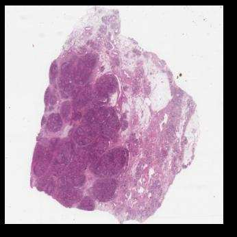
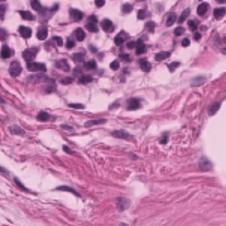
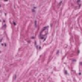
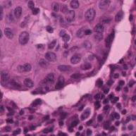
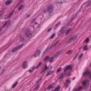

[← 返回 README](../README.md)

# 00 - Abstract & Overview

## 原文 Abstract

In computational pathology (CPath), the analysis of Whole Slide Images (WSIs) using Multiple Instance Learning (MIL) is a key technology for precision medicine. However, existing methods face a dilemma when modeling inter-instance correlations: they either overlook the correlations entirely or model them in a key-instance agnostic manner. Methods based on the independent attention weighting ignore interactions among instances, while the standard self-attention mechanism is difficult to apply to WSIs with massive numbers of instances due to its $O(n^2)$ computational complexity. Although recent linear-complexity methods have addressed the efficiency issue, they generally adopt a key-instance agnostic strategy. This can dilute the sparse yet crucial diagnostic signals in WSIs, leading to suboptimal performance.

To address this challenge, we propose CKMIL, a novel Cascaded Key-Instance Attention framework. CKMIL operates via a two-stage cascaded process: first, a Subspace-Disentangled Attention (SDA) module identifies candidate key sub-instances with high discriminative scores within multiple feature subspaces. Subsequently, a Key-Instance Guided Global Attention (KGGA) module utilizes these candidates as landmarks for Nystrom attention. This achieves efficient global interaction guided by key information, effectively preventing the dilution of diagnostic signals. Furthermore, postulating that local correlations exist among the components within an instance's feature vector, we introduce an Instance-Conv-Projection (ICP) module to capture this internal feature structure better. Extensive experiments for cancer subtyping and survival prediction on public datasets, including BRACS and the TCGA-BLCA/BRCA/NSCLC cohorts, demonstrate that when used with feature extractors pre-trained on the general domain, our proposed method surpasses existing mainstream methods in performance.

> **Hao 批注, 问题动机**: 这篇论文试图解决的 WSI MIL 困境非常具体——现有方法在两个方向上都走不通：(1) ABMIL/CLAM 等独立注意力方法完全忽略实例间的上下文关联；(2) TransMIL/MambaMIL 等线性复杂度全局交互方法虽然高效建模了相关性，但对所有实例"一视同仁"，稀疏的关键诊断信号（如小区域的肿瘤细胞）在全局交互中被大量背景实例稀释。CKMIL 的核心思路是"让关键实例来引导全局交互"，在效率和准确性之间找到第三条路。

---

## 核心数字速览

| 场景 | 指标 | CKMIL | 最强对比方法 | 提升 |
|------|------|-------|-------------|------|
| BRACS-3 (ResNet50) | AUC | 0.8583 | RRTMIL 0.8160 | +4.23% relative |
| BRACS-3 (ResNet50) | ACC | 0.7370 | RRTMIL 0.7129 | +3.38% relative |
| LUAD (ResNet50) | C-Index | 0.6820 | MambaMIL 0.6452 | +5.70% relative |
| BRCA (ResNet50) | C-Index | 0.6825 | MambaMIL 0.6524 | +4.61% relative |

> **Hao 批注**: 这几个数字是整篇论文最核心的卖点。注意这里所有 SOTA 结果都是基于 ResNet50-ImageNet 特征提取的，而非医学域预训练的 UNI。这说明 CKMIL 的聚合能力足以弥补通用特征的不足。理解这个设计逻辑：特征提取器可以弱，但聚合器足够强，就能超越特征强但聚合弱的组合。

---

## Figure 1: 三种 MIL 方法范式对比

**Figure 1**: The two-stage paradigm of MIL and a comparison of different MIL methods. **Top Methods**: Generate attention scores for each instance, but ignore the correlations. **Middle Methods**: Model inter-instance correlations, but they cannot generate attention scores for individual instances, and their global interaction overlooks the critical role of sparse positive instances. **Bottom (Our Method)**: Our method generates attention scores for each instance and models their correlations through a global interaction guided by key instances. This approach effectively prevents the dilution of key diagnostic signals during the correlation modeling process.

> **Hao 批注, Figure 1 批读**: Figure 1 是论文的核心定位图，三行对比清晰展示了 CKMIL 的差异化优势：
>
> - **第一行（独立注意力）**: ABMIL/CLAM 等给每个实例独立打分，有 attention score 但没有实例间交互。优点是简单高效，缺点是忽略了肿瘤微环境中的细胞间空间关联。
> - **第二行（高效全局交互）**: TransMIL/MambaMIL 等建模了全局实例关联，但无法为单个实例生成 attention score，且全局交互对所有实例等同对待，稀疏的关键信号被稀释。
> - **第三行（CKMIL）**: 在 SDA 中先产生初始分数并筛选关键实例，再用这些关键实例作为 KGGA 中 Nystrom attention 的 landmarks 来引导全局交互，最终产生同时考虑独立重要性和全局上下文的精炼分数。
>
> 这张图本质上是论文的"elevator pitch"——用一张图告诉读者为什么三种方法都不够好以及 CKMIL 如何填补这个空白。

---

## 三大核心贡献概览

### 贡献 1: CKMIL 级联框架
SDA 筛选候选关键子实例 → KGGA 以关键实例引导全局 Nystrom attention → Gate fusion 融合初始分和全局精炼分 → 子空间加权聚合。整个过程 $O(n)$ 复杂度，实现了"关键实例引导的高效全局交互"。

### 贡献 2: KGGA 关键实例引导的全局注意力
将传统 Nystrom attention 中基于 pooling 的 landmark 选择替换为 SDA 筛选的候选关键实例，使全局交互"锚定"在诊断相关信号上，从根本上防止信号稀释。消融实验（Table 4）显示 KGGA 对 ABMIL 的贡献高达 +5.84%（BRCA C-Index）。

### 贡献 3: ICP 模块
探索性模块，用 Reshape-Conv-Reshape-Projection pipeline 替换传统线性投影，捕获实例特征向量内部的局部结构模式。效果不稳定但在特定场景下（如 BRCA ResNet50）带来 +3.85% C-Index 提升。

> **Hao 批注**: 三个贡献的层次很清晰。贡献 1 是系统架构，贡献 2 是核心机制创新（也是论文最与众不同的地方），贡献 3 是探索性补充。评审如果问"novelty 在哪"，答案应该在贡献 1 和 2 中。贡献 3（ICP）更像是一个"我们试了一下，有些场景有效"的锦上添花，不是核心卖点。

---

## 关键术语速查

| 术语 | 全称 | 功能 |
|------|------|------|
| CKMIL | Cascaded Key-Instance Attention MIL | 整体框架 |
| SDA | Subspace-Disentangled Attention | 在特征子空间中筛选候选关键实例 |
| KGGA | Key-Instance Guided Global Attention | 以关键实例为 landmarks 的 Nystrom 全局注意力 |
| ICP | Instance-Conv-Projection | 卷积投影替代线性投影生成 Q/K |
| Nystrom Attention | - | $O(n)$ 复杂度的低秩注意力近似 |

---

## Index Terms

Computational Pathology, Multiple Instance Learning, Whole Slide Image Analysis, Attention Mechanism, Nystrom Attention.

> **Hao 批注**: 这篇论文的关键词精确锚定了三个领域——计算病理（应用场景）、MIL（方法范式）、Nystrom Attention（技术手段）。从方法贡献角度看，关键词中的"Attention Mechanism"稍显泛泛，"Key-Instance Guided"这个论文独有的概念没有出现在关键词中稍有遗憾。
