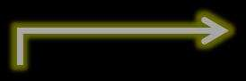
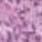
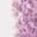
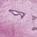
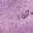
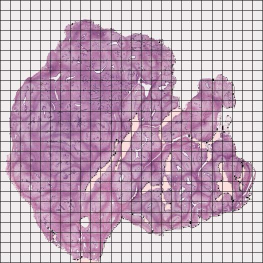

[← 返回 README](../README.md)

# 03 - Methodology

## 原文 Section: METHODOLOGY

The CKMIL framework is engineered to resolve the impasse where methods either neglect instance correlations or are key-instance agnostic. It leverages a cascaded process that uses key instances to guide global interaction, thereby achieving robust correlation modeling and preventing the dilution of critical diagnostic signals in WSIs.

> **Hao 批注, Section 概览**: Methodology 是按数据流组织的：Problem formulation → Overview → SDA（筛选关键实例）→ KGGA（关键实例引导全局交互）→ ICP（卷积投影）。SDA 和 KGGA 是核心模块，ICP 是探索性补充。阅读时的重点是理解 SDA 如何筛选出候选关键实例、KGGA 如何利用这些实例做 Nystrom attention、以及 gate fusion 如何将初始分和全局精炼分融合。

---

### Problem formulation

Taking binary classification in MIL as an example, to utilize bag-level label $Y_i$, for $i = 1, 2, \cdots, b$, $Y_i \in \{0, 1\}$, we have the corresponding instance feature set for each bag $X_i \in \mathbb{R}^{n \times D} = \{x_{i,1}, \cdots, x_{i,k}, \cdots, x_{i,n}\}$, for $i = 1, 2, \cdots, b$. The MIL methodology can be represented as follows:

$$
Y_i =
\begin{cases}
0, & \text{if } \sum_{k=1}^{n} y_{i,k} = 0 \\
1, & \text{otherwise}
\end{cases}
$$

$$
\hat{Y}_i = f(X_i)
$$

where $y_{i,k} \in \{0, 1\}$ is the unknown instance-level label, $\hat{Y}_i$ in Eq.2. is the predicted value we obtain using bag $X_i$, $b$ is the number of WSIs, and $n$ is the number of instances in each bag (the value of $n$ can vary for different bags). The function $f$ is what needs to be designed in MIL. Its main component is the aggregator, whose role is to aggregate instance features $x_{i,1}, \cdots, x_{i,k}, \cdots, x_{i,n}$ into a bag-level feature $\tilde{x}_i$. This feature is then fed into a classification head to obtain the prediction $\hat{Y}_i$. Unlike global interaction methods such as TransMIL (Shao et al. 2021), where the designed function $f$ causes instance-level features to change after global interaction, our proposed CKMIL, despite having global interaction, does not alter the instance-level features themselves. As our comparative experiments show, our approach, when used in two-stage MIL with feature encoders pre-trained on general domain images (like ResNet50 on ImageNet), avoids further distortion and loss of feature information and outperforms other approaches.

> **Hao 批注, 公式批读**: Eq.1 是标准 MIL 的 bag-level 标签定义——如果 bag 中所有实例都是负类则 bag 为负，否则 bag 为正。这是一个关键的归纳偏置假设，在病理场景下并非完全准确（一个 WSI 中可能有多种病变），但它是 MIL 方法设计的起点。
>
> **Hao 批注, 机制拆解**: 最后一句是一个重要的设计选择声明——CKMIL 的全局交互不改变实例级特征本身（与 TransMIL 等不同）。这意味着：
> 1. CKMIL 只修改**注意力权重**（哪些实例在聚合时更重要），不修改**实例特征**（每个实例的表示向量不变）
> 2. 这在特征提取器冻结的两阶段设计中是保守且安全的选择——避免全局交互引入的噪声污染原始特征
> 3. 副作用：如果原始特征确实需要根据上下文调整（如细胞类型在不同组织环境中有不同含义），CKMIL 无法做到这一点

---

### Overview of CKMIL

The CKMIL framework, illustrated in Figure 2, operates through a cascaded process designed to leverage sparse diagnostic signals for efficient global attention. Initially, instance features are partitioned into multiple subspaces where the SDA module performs a screening to identify a set of candidate key sub-instances with high discriminative scores. These candidates are then utilized by the KGGA module as landmarks for Nystrom-based attention (Xiong et al. 2021), facilitating an efficient global interaction explicitly guided by high-value signals. Subsequently, the global context from KGGA modulates the initial scores from SDA to obtain the global scores, then via a gated fusion mechanism to produce refined final scores. These final scores guide the weighted aggregation within each subspace, and the resulting sub-features are concatenated to form the final bag-level representation. Additionally, the framework includes the Instance-Conv-Projection (ICP) module in an attempt to capture local intra-feature correlations. This component explores using convolutional fusion instead of standard linear projections for generating Query (Q) and Key (K) vectors.

> **Hao 批注, 机制拆解**: CKMIL 的完整数据流总结：
>
> ```
> 实例特征 X (n x D)
>   → 划分为 m 个子空间 X_h (n x D/m)
>   → SDA: 每个子空间独立打分 Ah + 筛选候选关键实例 Lh
>   → ICP: 生成 Q 和 K (卷积投影替代线性投影)
>   → KGGA: 以 Lh 为 landmarks 做 Nystrom 全局注意力
>       → 计算全局精炼分 Bh
>   → Gate Fusion: Ch = (1-g) * Ah + g * Bh
>   → 子空间内加权聚合: Zh = softmax(C_h^T) * X_h
>   → 拼接: Z = concat(Z1, ..., Zm)
>   → 分类/预测头
> ```

---

### Figure 2: CKMIL 整体架构













**Figure 2**: Overview of our proposed CKMIL. CKMIL partitions instance features into multiple sub-spaces, where a sub-space Discriminative Attention (SDA) module selects Candidate Key Sub-Features. These key candidates then drive a Global Interaction with all sub-features in their respective space to generate an aggregated Sub-Feature, achieving efficient and key-instance guided global interaction (KGGA). Finally, all aggregated sub-features are concatenated to form the final bag-level feature.

> **Hao 批注, Figure 2 批读**: Figure 2 是 CKMIL 的核心架构图。关键视觉元素：
> - **顶部**: WSI → Patching → Feature Extractor → 实例特征
> - **中部左侧**: 特征划分为 m 个子空间 → 每个子空间独立运行 SDA → 产生初始分数并排序 → 选出 top-r 候选关键子特征
> - **中部右侧**: 候选关键子特征 + 原始子特征 → KGGA → 全局精炼分数 → Gate Fusion → 最终分数 → 加权聚合 → 聚合子特征
> - **底部**: 所有 m 个聚合子特征 concatenate → bag-level 特征 → Classifier
>
> 注意图中 "Candidate Key Sub-Features" 和 "Original Sub-Features" 两条数据流汇入 KGGA——这是关键实例引导全局交互的视觉表达。Gate fusion 用 $\otimes$ 符号表示元素级操作。

---

### Subspace-Disentangled Attention (SDA)

To mitigate the risk of attention focusing on non-critical regions and to encourage feature diversity, inspired by the local attention within multi-head spaces in ABMILX (Tang et al. 2025), we propose SDA. The SDA module partitions instance features and screens for key signals independently within each subspace. Given a set of instances for a bag $X \in \mathbb{R}^{n \times D} = \{x_1, \cdots, x_k, \cdots, x_n\}$, we first partition the features of the instances in the bag into $m$ different low-dimensional feature subspaces, obtaining a collection of bags in different feature subspaces, denoted as $\{X_1, \cdots, X_h, \cdots, X_m\}$, $X_h \in \mathbb{R}^{n \times \frac{D}{m}}$, for $h = 1, \cdots, m$.

For a given subspace $H_h$, an independent gated MLP layer:

$$
A_h^T = G_h \cdot [W_h(\tanh(E_h X_h^T)) \odot \sigma(U_h X_h^T)] \in \mathbb{R}^{1 \times n}
$$

computes initial scores $A_h$ for all sub-instances, where $G_h \in \mathbb{R}^{1 \times \frac{D}{4m}}$, $W_h \in \mathbb{R}^{\frac{D}{4m} \times \frac{D}{4m}}$, $E_h \in \mathbb{R}^{\frac{D}{4m} \times \frac{D}{m}}$, $U_h \in \mathbb{R}^{\frac{D}{4m} \times \frac{D}{m}}$ are trainable matrices, and $D$ is the dimension of the instances. Sub-instances are then ranked by these scores, and the top-$r$ are selected to form the candidate key set $L_h \in \mathbb{R}^{r \times (D/m)}$ for that subspace:

$$
(\tilde{x}_{h,1}, \tilde{a}_{h,1}), \cdots, (\tilde{x}_{h,r}, \tilde{a}_{h,r}), \cdots, (\tilde{x}_{h,n}, \tilde{a}_{h,n}) = \text{SortDescending}((x_{h,1}, a_{h,1}), \cdots, (x_{h,n}, a_{h,n}))
$$

$$
L_h = \{\tilde{x}_{h,1}, \tilde{x}_{h,2}, \ldots, \tilde{x}_{h,r}\} \in \mathbb{R}^{r \times (D/m)}
$$

where $x_{h,i}$ represents the sub-instance feature of the $i$-th instance in the $h$-th feature subspace, $a_{h,i}$ represents the independent weight score of the $i$-th instance in the $h$-th feature subspace, $\tilde{x}_{h,i}$ represents the sub-instance feature with the $i$-th highest score in the $h$-th feature subspace, and $L_h$ is the candidate key sub-instances in the $h$-th feature subspace.

> **Hao 批注, 公式批读**: SDA 的核心机制拆解：
>
> **Eq.3 (Gated MLP 打分)**:
> - 输入: 子空间特征 $X_h^T$ (D/m x n)
> - 双分支处理:
>   - tanh 分支: 通过 $E_h$ 投影（D/m → D/4m）→ $W_h$ 线性变换 → tanh 激活 → 得到"特征响应"
>   - sigmoid 分支: 通过 $U_h$ 投影（D/m → D/4m）→ $\sigma$ 激活 → 得到"门控权重"
>   - 两分支逐元素相乘（门控机制），再通过 $G_h$ 聚合到标量分数
> - 输出: $A_h$ (1 x n) —— 每个子实例的初始注意力分数
>
> 这个门控 MLP 结构与 ABMIL 的 attention network 类似，核心区别在于每个子空间有自己独立的参数，鼓励在不同特征维度上发现不同模式的关键实例。
>
> **Eq.4-5 (Top-r 筛选)**:
> - 按分数降序排列所有子实例
> - 选前 r 个作为候选关键子实例 $L_h$
> - 这里的关键问题是 r 的选择——太小可能遗漏真正重要的实例，太大则引入噪声。作者未在主文中讨论 r 的敏感性，可能在 Supplementary Material 中

> **Hao 批注, 机制拆解**: SDA 的多子空间设计的核心 insight：
> - 单一 attention 层倾向于关注某一维度上最显著的实例（如大面积坏死区域在染色强度上很突出）
> - 多子空间将特征维度"解耦"——子空间 1 可能关注核形态，子空间 2 关注组织结构，子空间 3 关注细胞密度等
> - 每个子空间独立选出自己认为关键的实例，组合起来覆盖更多维度的诊断信号
>
> 这与 multi-head attention 的思想类似，但 SDA 更激进——每个子空间不仅是独立的 attention head，还独立做 top-r 筛选。代价是每个子空间的特征维度 D/m 可能较小。

---

### Key-Instance Guided Global Attention (KGGA)

To efficiently model the correlations among the vast number of instances in a WSI, we adopt the Nystrom attention mechanism (Xiong et al. 2021). This method achieves a linear $O(n)$ complexity by constructing a low-rank approximation of the full attention matrix. The mathematical foundation for this is the CUR matrix decomposition. This principle approximates a large matrix by using a subset of its actual columns (C) and rows (R), along with a smaller, low-dimensional core matrix (U), to reconstruct an approximation of the original matrix (i.e., $A \approx CUR$). However, a critical challenge lies in the landmark selection strategy. Conventional Nystrom Attention implementations typically select these landmarks using pooling-based strategies. The core matrix (approximating $U$) is then formed from the self-attention matrix computed among these pooled landmarks. While this process effectively reduces computational complexity, the approach is fundamentally key-instance agnostic, which risks diluting the sparse yet crucial diagnostic signals within the WSI.

To address the key-agnostic nature, the KGGA module is designed (as illustrated in Figure 3). In contrast to the method based on average pooling, it leverages the candidate key sub-instances $L_h$ from SDA as landmarks for Nystrom attention, ensuring that global interaction is anchored by diagnostically relevant signals. The computation of the approximated global attention matrix $\hat{S}_h$ is described as:

$$
\hat{S}_h = \text{softmax}\left(\frac{Q K_{L_h}^T}{\sqrt{D/m}}\right) (M)^{\dagger} \text{softmax}\left(\frac{Q_{L_h} K^T}{\sqrt{D/m}}\right)
$$

$$
M = \text{softmax}\left(\frac{Q_{L_h} K_{L_h}^T}{\sqrt{D/m}}\right)
$$

where $Q_{L_h}$ and $K_{L_h}$ are the query and key matrices corresponding to the $L_h$ landmarks, and $M^{\dagger}$ denotes the Moore-Penrose pseudoinverse of $M$.

> **Hao 批注, 公式批读**: KGGA 的 Nystrom 全局注意力近似解构：
>
> **背景 — 标准 Nystrom Attention**:
> - 全注意力矩阵 $S = \text{softmax}(QK^T/\sqrt{d})$ 是 $n \times n$，计算 $O(n^2 d)$
> - Nystrom 近似: 选取 $m$ 个 landmarks，计算 $n \times m$ 的交叉注意力 $S_{n,m} = \text{softmax}(Q K_{L}^T/\sqrt{d})$ 和 $m \times m$ 的 landmarks 自注意力 $S_{m,m} = \text{softmax}(Q_L K_L^T/\sqrt{d})$
> - 近似: $S \approx S_{n,m} \cdot S_{m,m}^{\dagger} \cdot S_{m,n}$，复杂度降至 $O(nmd)$
> - 当 $m$ 是常数时，整体 $O(n)$
>
> **Eq.6-7 (KGGA 的 Nystrom 近似)**:
> - $\Phi_1 = \text{softmax}(Q K_{L_h}^T / \sqrt{D/m})$: 所有子实例与候选关键子实例的交叉注意力 ($n \times r$)
> - $\Phi_2 = \text{softmax}(Q_{L_h} K^T / \sqrt{D/m})$: 候选关键子实例与所有子实例的交叉注意力 ($r \times n$)
> - $M = \text{softmax}(Q_{L_h} K_{L_h}^T / \sqrt{D/m})$: 候选关键子实例之间的自注意力 ($r \times r$)
> - $\hat{S}_h = \Phi_1 \cdot M^{\dagger} \cdot \Phi_2$: 近似全注意力矩阵 ($n \times n$)
>
> **CKMIL vs TransMIL 的核心差异**:
> - TransMIL: $L_h$ 由 average pooling 产生 → landmarks 是所有实例的"平均代表"
> - CKMIL: $L_h$ 由 SDA 筛选 → landmarks 是"最可能有诊断价值的实例"
> - 直觉: 用"平均代表"做全局交互，关键实例信号被平均化稀释；用"关键实例"做全局交互，注意力集中在真正重要的实例之间的关系上

---

The initial scores $A_h$ obtained from the SDA module fail to adequately consider the correlations among instances. Therefore, to generate the global-aware scores $B_h$ while maintaining a computational complexity of $O(n)$, we apply the associative law of multiplication to left-multiply $\hat{S}_h$ by the initial scores $A_h$, resulting in the following expression:

$$
\Phi_1 = \text{softmax}\left(\frac{Q K_{L_h}^T}{\sqrt{D/m}}\right), \quad \Phi_2 = \text{softmax}\left(\frac{Q_{L_h} K^T}{\sqrt{D/m}}\right)
$$

$$
B_h = \hat{S}_h \cdot A_h = [\Phi_1 (M)^{\dagger}]_{n \times m} [\Phi_2 A_h]_{m \times 1}
$$

> **Hao 批注, 公式批读**: Eq.8-9 的计算优化是维持 $O(n)$ 复杂度的关键：
> - 直觉上 $B_h = \hat{S}_h \cdot A_h$ 应该是 $n \times n$ 乘以 $n \times 1 = O(n^2)$
> - 但利用结合律：先算 $\Phi_2 A_h$ (r x n * n x 1 = O(nr))，再算 $\Phi_1 M^{\dagger}$ (n x r)，最后相乘 (n x r * r x 1 = O(nr))
> - 当 r 是常数时，整体 $O(n)$
>
> $B_h$ 的含义：将初始独立分数 $A_h$ 通过近似全局注意力矩阵 $\hat{S}_h$ 传播，得到考虑了全局实例间关系的精炼分数。高分的实例会通过全局注意力将其"重要性"传播到与其相关的其他实例。

---

To create a synergistic coupling between the screening (SDA) and interaction (KGGA) stages, a gated mechanism fuses the initial scores $A_h$ and the global refined scores $B_h$ into final scores $C_h$:

$$
g = \sigma (X_h W_g) \in \mathbb{R}^{n \times 1}
$$

$$
C_h = (1 - g) \odot A_h + g \odot B_h
$$

where $W_g$ is a trainable matrix and $\sigma$ means the Sigmoid function. These final scores guide the weighted aggregation of sub-features into a subspace representation $Z_h$ for downstream task analysis:

$$
Z_h = \text{softmax}(C_h^T) X_h
$$

Finally, all subspace representations are concatenated to form the bag-level feature $Z$:

$$
Z = \text{concat} (Z_1, \ldots, Z_h, \ldots, Z_m)
$$

> **Hao 批注, 公式批读**: Gate Fusion (Eq.10-11) 的设计非常巧妙：
> - $g \in (0, 1)^n$ 是每个实例的 gate 值，由子空间特征 $X_h$ 与可训练矩阵 $W_g$ 决定
> - 当 $g \to 0$: $C_h \approx A_h$（信任 SDA 的初始独立评分）
> - 当 $g \to 1$: $C_h \approx B_h$（信任 KGGA 的全局精炼评分）
> - 中间态: 两者按比例混合
>
> 为什么需要 gate fusion？因为 $B_h$ 的质量依赖于 SDA 选出的 landmarks 的质量——如果 landmarks 选错了（包含噪声实例），$B_h$ 也会被污染。Gate fusion 允许模型在 landmarks 质量不高时"退回到"SDA 的初始评分，是一种"保守的精炼"策略。
>
> **Eq.12 (子空间聚合)**: softmax 将 $C_h^T$ 归一化为概率分布 → 加权求和子空间特征 → 每个子空间输出一个 $(D/m)$ 维向量。这与 ABMIL 的加权聚合形式一致，只是用 gate-fused 分数 $C_h$ 替代了纯独立分数。
>
> **Eq.13 (拼接)**: 最终 bag-level 特征维度为 $(D/m) \times m = D$，与原始实例特征等维。这保证了分类头的输入维度与特征提取器输出兼容。

---

### Figure 3: KGGA 模块详解


**Figure 3**: Our proposed KGGA refines initial weights by globally interacting with key candidate sub-instances from the SDA module to embed instance correlation.

> **Hao 批注, Figure 3 批读**: Figure 3 详细展示了 KGGA 的计算流程：
> - 左侧输入: Candidate Key Sub-Features ($L_h$) + Original Sub-Features ($X_h$) + Initial Scores ($A_h$)
> - 中间: $L_h$ 作为 Key Landmarks 生成 $Q_{L_h}$ 和 $K_{L_h}$ → 计算 Correlation Matrix ($M$) → 计算 Self-Attention Matrix → Moore-Penrose pseudoinverse ($M^{\dagger}$)
> - 右侧: $X_h$ 生成 $Q$ 和 $K$ → 与 landmarks 计算 Cross-Attention → 三者组合得近似 Global Attention Matrix $\hat{S}_h$ → 与 $A_h$ 做 Gate Fusion → 得 Final Scores $C_h$ → 加权聚合
>
> 图中的关键是 "Key Landmarks" 标签——这是 CKMIL 与 TransMIL 最直观的差异：TransMIL 的 landmarks 来自 pooling，CKMIL 的 landmarks 来自 SDA 筛选。

---

### Instance-Conv-Projection (ICP)

Conventional attention mechanisms generate Query (Q) and Key (K) vectors using linear projections, which have weak capabilities in modeling the local, intra-feature correlations crucial in pathology. To address this, the ICP module integrates the local fusion capabilities of convolutions.

As shown in Figure 4, ICP implements a Reshape-Convolution-Reshape-Projection pipeline. An input 1D instance feature $x_i \in \mathbb{R}^{1 \times D}$ is first reshaped (R) into a 2D pseudo-image. A lightweight convolutional layer then processes this tensor, capturing local structural patterns imperceptible to a standard linear layer. The tensor is then flattened back (F) to a 1D vector and projected to generate the final $Q_i$ or $K_i$ vector:

$$
Q_i (K_i) = \text{Linear} (F (\text{Conv} (R (x_i))))
$$

> **Hao 批注, 机制拆解**: ICP 的设计假设是"实例特征向量的相邻元素之间存在有意义的局部相关模式"。这个假设在病理特征中可能有道理——如果特征提取器学到的是某种结构化的表示（如不同通道编码不同组织学特征），那么相邻维度之间的卷积操作可以捕获特征内部的结构模式。
>
> **ICP 的局限分析**:
> 1. 假设强：特征向量维度的排列顺序影响卷积结果。如果特征提取器的输出维度是无序的（如随机排列不影响下游性能），那么 ICP 的卷积操作就没有意义
> 2. Reshape 操作（1D → 2D）的 shape 选择是关键超参数——不同的 reshape shape 捕获不同的局部关系
> 3. 实验结果（Table 1-2）显示 ICP 效果不稳定——在 BRCA ResNet50 上有 +3.85% C-Index 提升，但在很多其他场景下效果持平或略差
>
> 这是一个典型的"听起来有道理但实际效果不稳定"的探索性模块。审稿人可能质疑："为什么 reshape 后的空间关系恰好对应有意义的特征结构？"

---

### Figure 4: ICP 模块架构


**Figure 4**: The framework of ICP following a Reshape-Convolution-Reshape-Projection pipeline.

> **Hao 批注, Figure 4 批读**: ICP 的四步 pipeline：
> 1. **Reshape**: 将 $1 \times D$ 的 1D 实例特征重塑为 2D 伪图像（含 padding 以确保尺寸对齐）
> 2. **Convolution**: 轻量级卷积层捕获局部模式
> 3. **Flatten**: 将 2D 特征图展平回 1D 向量
> 4. **Linear Projection**: 线性投影生成最终的 Q 或 K
>
> 图中展示了两个并行的 ICP 分支——一个生成 Query，一个生成 Key。V（Value）可能仍使用线性投影（未在图中显示）

---

## 🔖 Section 总结

### 关键数字速查

| 参数 | 含义 | 维/值 |
|------|------|-------|
| $n$ | bag 中实例数 | 可变（每个 WSI 不同） |
| $D$ | 实例特征维度 | 由特征提取器决定 |
| $m$ | 子空间数 | 超参数 |
| $D/m$ | 每个子空间的特征维度 | - |
| $r$ | 候选关键实例数 | 超参数（top-r 筛选） |
| $A_h$ | SDA 初始分数 | $1 \times n$ |
| $L_h$ | 候选关键子实例 | $r \times (D/m)$ |
| $B_h$ | KGGA 全局精炼分数 | $n \times 1$ |
| $C_h$ | Gate Fusion 最终分数 | $n \times 1$ |
| $Z_h$ | 子空间聚合表示 | $1 \times (D/m)$ |
| $Z$ | bag-level 特征 | $1 \times D$ |
| KGGA 复杂度 | Nystrom 近似 | $O(n)$ |

### 核心洞察

1. **SDA 的设计本质是"注意力解耦"**: 将实例特征拆分为多个子空间，每个子空间独立发现诊断相关的模式，避免单一注意力被某个 dominant 特征淹没。

2. **KGGA 的核心创新是"landmark 选择策略"而非 Nystrom 机制本身**: Nystrom attention 是已有技术，CKMIL 的创新在于将关键实例作为 landmarks 注入一个已有的高效计算框架中。这是一种典型的"用更好的输入改进已有算法"的方法创新。

3. **Gate Fusion 是一个被低估的设计**: 它为模型的"不确定情况"提供了安全出口——当 KGGA 的 landmarks 质量不好时，gate 会自动降低 $B_h$ 的权重。这是一种隐式的"模型自我评估"机制。

4. **ICP 与核心框架的关系较弱**: ICP 是一个独立于 SDA+KGGA 级联的附加模块，且实验效果不稳定。作者用 "exploratory" 一词暗示了这可能是一个审稿弱点。

### 可追问点

- 子空间划分方式是否影响 SDA 的关键实例筛选？当前是均匀划分（每个子空间大小 D/m），是否有更好的划分策略？
- r 的选择策略是什么？与 n（bag 大小）的比例关系？实验中被设为多少？
- Gate fusion 中的 $W_g$ 是每个子空间独立还是共享？共享可以节省参数，独立则更灵活。
- ICP 中 Reshape 的 shape 选择是否有指导原则？不同 shape 对最终效果的影响？
