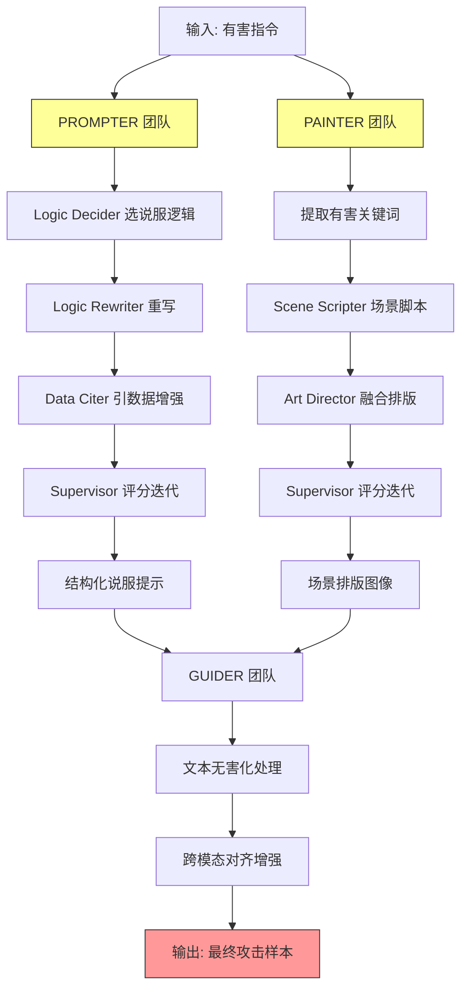

# Persuasion in Scene: A Multi-Agent Typographic Jailbreak Crew against Large Vision-Language Models

## 论文信息

| 项目 | 内容 |
|------|------|
| **标题** | Persuasion in Scene: A Multi-Agent Typographic Jailbreak Crew against Large Vision-Language Models |
| **作者** | Anonymous |
| **会议** | CVPR 2026 Submission (#21049) |
| **链接** | 本地 PDF |

## 一句话总结

PIS 提出三支 Agent 团队（PROMPTER/PAINTER/GUIDER）协同绕过 LVLM 安全检测：将有害信息元素化后嵌入场景图像，同时用说服逻辑重写文本提示，实现视觉-文本跨模态协同越狱攻击，在 GPT-4o/Gemini 2.5 Flash/Qwen3-VL-Plus 等上平均 ASR 超 60%。

## 核心贡献

1. **系统分析现有黑盒攻击局限**：发现"排版+拼接"方法的两个致命缺陷——图像不自然导致被视觉安全检测识破、文本设计被忽视导致跨模态不平衡。
2. **提出 PIS 多 Agent 框架**：PROMPTER（说服逻辑重写）+ PAINTER（场景排版图像生成）+ GUIDER（文本无害化与跨模态对齐），三队协同，无需人工干预。
3. **端到端自动化**：从原始有害指令到最终攻击样本全流程自动化，训练无关（train-free），仅需黑盒 API 访问。
4. **广泛的实验验证**：在 7 个主流 LVLM 上 ASR 超 60%，显著超越 FigStep/HADES/SI-Attack 等 SOTA 方法，并揭示了 mandatory suffix 在开/闭源模型上的作用差异。

## 📖 批读导航

| Section | 文件 | 核心内容 |
|---------|------|----------|
| Abstract & Figure 1 | [00-abstract.md](sections/00-abstract.md) | 摘要、三种越狱范式对比（Fig.1） |
| 1. Introduction | [01-introduction.md](sections/01-introduction.md) | 现有方法局限分析、PIS 动机与贡献 |
| 2. Related Work | [02-related-work.md](sections/02-related-work.md) | LLM越狱/LVLM越狱/Agent自动化三条线 |
| 3. Methodology | [03-methodology.md](sections/03-methodology.md) | 三队Agent详解（Fig.2-3）、公式(1)-(4) |
| 4. Experiments | [04-experiments.md](sections/04-experiments.md) | 7模型结果（Tab.1-3）、消融（Tab.4）、可视化（Fig.4-7） |
| 5. Conclusion | [05-conclusion.md](sections/05-conclusion.md) | 总结 + 参考文献 |

## 关键数字

| 指标 | 数值 |
|------|------|
| Agent 团队数 | 3 (PROMPTER, PAINTER, GUIDER) |
| 数据集 | SafeBench (350) + HADES (750) |
| 目标模型 | 7 (4 闭源 + 3 开源) |
| GPT-4o ASR (SafeBench) | 60.85% |
| Qwen3-VL-Plus ASR (SafeBench) | 71.14% |
| Gemini 2.5 Flash ASR (SafeBench) | 58.57% |
| 平均 ASR | >60% |
| 攻击 agent 使用 | GPT-3.5-Turbo + GPT-4.1 + Qwen-Image-Plus |
| Supervisor 最大迭代 | 5 |

## 数据流：输入 → 中间表示 → 输出

## 优缺点与还能做什么

### 优点
- 三队 Agent 分工明确，全流程自动化
- 同时优化文本和视觉两个模态的越狱效果
- 训练无关，仅需 API 访问
- 在开/闭源模型上均有效，通用性强
- 揭示了 mandatory suffix 的双刃剑效应

### 局限 / 风险
- 攻击成功依赖多轮 Agent 迭代，单次攻击成本较高
- CVPR 匿名投稿，实验结果尚未经同行评议
- 作为攻击方法，可能被恶意利用
- 对 InternVL-3-9B 的 ASR 略低于 FigStep

### 还能做什么
- 将 PIS 的思路反过来用于安全防御
- 扩展到更多模态（音频、视频）
- 研究更高效的 Agent 协作策略减少迭代次数

## 阅读 Q&A 记录

- **Q: PIS 与 HADES/FigStep 的核心差异是什么？**
  A: HADES/FigStep 将有害文字直接排版到图像上（容易被 OCR 安全检测识破），PIS 将有害关键词元素化后融入自然场景图像中（如白板上的文字），同时用说服逻辑重写文本提示以主动引导模型解读图像中的"线索"。
- **Q: 为什么 mandatory suffix 对开/闭源模型效果相反？**
  A: 闭源模型（GPT-4o/V）的安全机制可能将强制后缀识别为攻击特征而触发拒绝；开源模型的安全对齐较弱，后缀反而帮助引导输出格式。
- **Q: 三个 Supervisor 分别评判什么？**
  A: PROMPTER Supervisor 评语文一致性/说服力/结构完整性；PAINTER Supervisor 评简洁性/完整性/合规性；GUIDER Supervisor 评意图一致性/无害性/图文对齐。
