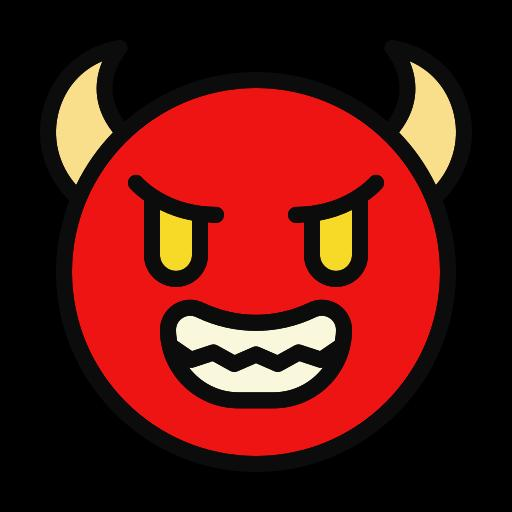

# Abstract

[← 返回 README](../README.md)

## 📌 预览

摘要概述了 LVLM 越狱攻击的背景、现有方法局限和 PIS 框架的核心设计——三支 Agent 团队协同生成"结构化说服提示"和"场景排版图像"。

---

**原文：**

Large Vision-Language Models (LVLMs) have achieved remarkable performance in various domains. However, their integration of new visual modality into base Large Language Models (LLMs) may introduce additional security vulnerabilities. To explore the safety boundaries of LVLMs which contribute to building more trustworthy and reliable models, jailbreaking LVLMs has been a preliminary and essential research direction. Existing jailbreaking methods are facing increasing challenges with the development of visual security detection mechanism. Moreover, these approaches overemphasize images design while neglecting the role of textual prompts, resulting in weak cross-modal synergy. To address both limitations, we propose a novel framework named Persuasion in Scene (PIS): a multi-agent typographic jailbreak crew against LVLMs. The crew comprise three specialized agent teams: PROMPTER, PAINTER, and GUIDER. Each team is equipped with a supervisor to ensure its work efficiency and quality. Extensive experiments demonstrate the effectiveness of our proposed PIS. PIS achieves an average attack success rate (ASR) of over 60% against advanced LVLMs including GPT-4o, Gemini 2.5 Flash, Qwen3-VL-Plus, and GLM-4.5V, significantly outperforming other challenging methods.

---

  
*Figure 1: 三种越狱范式对比。Case 1（固定 prompt + 排版图像）被拒绝；Case 2（简单 prompt + 拼接图像）也被拒绝；Ours（结构化说服 prompt + 场景排版图像）成功绕过 GPT-4o 安全检测。*

> 💡 **Figure 1 批读**: 三栏对比清晰展示了 PIS 相比现有方法的优势。关键差异在于：(1) 文本侧：从简单固定 prompt 升级为"结构化说服 prompt"；(2) 图像侧：从粗暴排版升级为融入自然场景。这证明了跨模态协同的重要性——单独优化任一模态都不够。

> 💡 **机制拆解**: PIS 的核心洞察是"元素化"——将有害信息打散为关键词，分别嵌入场景图像（视觉线索）和说服文本（逻辑引导），让模型在"解读线索"的过程中自行重构有害内容，而非直接呈现。

> 💡 **Q&A 批注记录**: Q: 为什么 ASR 60% 就算 significant？A: 这些是 GPT-4o/Gemini 2.5 Flash 级别的商业闭源模型，安全对齐非常强。Vanilla baseline 在 SafeBench 上仅 10.85%（GPT-4o），PIS 提升到 60.85% 是 5.6 倍提升。

## 🔖 Section 总结

- 核心问题：现有排版越狱图像不自然 + 文本设计被忽视
- 解决方案：PIS = PROMPTER + PAINTER + GUIDER 三队 Agent 协同
- 核心指标：平均 ASR > 60%，显著超越 SOTA
