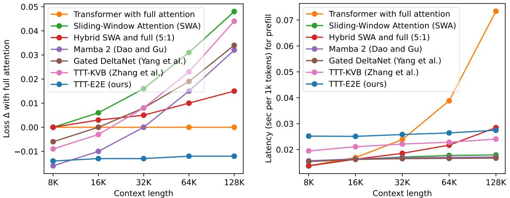

[← 返回 README](../README.md)

# Abstract

## 📌 预览
本节给出论文总 claim：把 long-context LM 改写为 continual learning，在测试时用 next-token prediction 更新权重，并用训练时 meta-learning 学到适合更新的初始化。

We formulate long-context language modeling as a problem in continual learning rather than architecture design. Under this formulation, we only use a standard architecture – a Transformer with sliding-window attention. However, our model continues learning at test time via next-token prediction on the given context, compressing the context it reads into its weights. In addition, we improve the model’s initialization for learning at test time via meta-learning at training time. Overall, our method, a form of Test-Time Training (TTT), is End-to-End (E2E) both at test time (via next-token prediction) and training time (via meta-learning), in contrast to previous forms. We conduct extensive experiments with a focus on scaling properties. In particular, for 3B models trained with 164B tokens, our method (TTT-E2E) scales with context length in the same way as Transformer with full attention, while others, such as Mamba 2 and Gated DeltaNet, do not. However, similar to RNNs, TTT-E2E has constant inference latency regardless of context length, making it $2 . 7 \times$ faster than full attention for 128K context. Our code is publicly available.
> 💡 **总览批注**: 摘要第一句就是本文的坐标变换：long context 不再主要是设计更强 attention/RNN layer，而是把一条长上下文看作按时间到来的训练流。TTT-E2E 的“记忆”来自测试时继续学习，而不是显式保留所有 KV。

  
Figure 1. Scaling with context length, in terms of test loss (left) and latency (right). Left: Our method (TTT-E2E) turns the worst line (green) into the best (blue) at 128K context length. Loss $\Delta$ (↓), the $y$ -value, is computed as (loss of the reported method) − (loss of Transformer with full attention), so loss $\Delta$ of full attention itself (orange) is the flat line at $y = 0$ . While other methods produce worse loss $\Delta$ in longer context, TTT-E2E maintains the same advantage over full attention. All models have 3B parameters and are trained with 164B tokens. Right: Similar to SWA and the RNN baselines, TTT-E2E has constant inference latency regardless of context length, making it $2 . 7 \times$ faster than full attention for 128K context on an H100.

> 💡 **Figure 1 批注**: 这张图是整篇论文的证据压缩版：左边说 3B/164B tokens 下 TTT-E2E 的 loss scaling 不输 full attention，右边说它像 RNN/SWA 一样保持 constant latency，并在 128K context 上比 full attention 快 2.7x。

---

## 🔖 Section 总结

- **核心 claim**: TTT-E2E 用测试时 next-token training 把上下文压进权重，并用训练时 meta-learning 学会适合这种更新的初始化。
- **关键数字**: 3B 模型、164B tokens、128K context；128K/H100 prefill 比 full attention 快 2.7x。
- **读法提醒**: 摘要已经同时声明优势和代价：它追求平均 language modeling loss 与 latency scaling，不保证 full attention 式无损检索。
