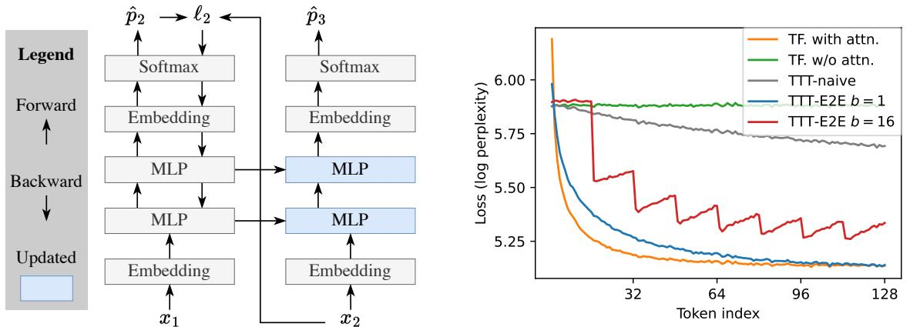
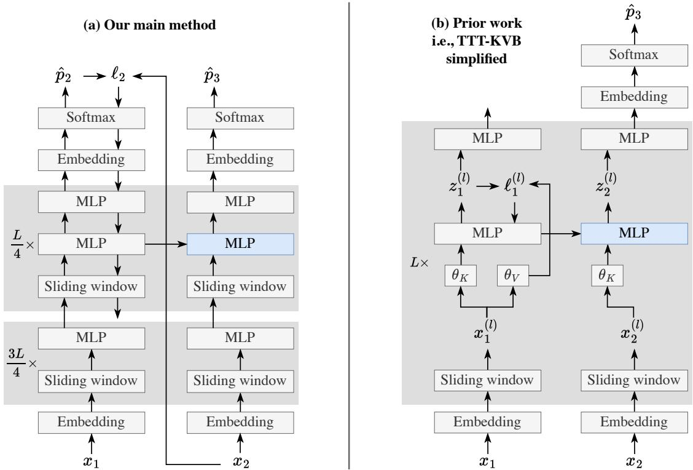

[← 返回 README](../README.md)

# 2 Method

## 📌 预览
本节是机制主体：test-time next-token updates、training-time meta-learning initialization、mini-batch TTT + sliding-window attention，以及从 TTT-KVB 到 E2E loss 的替代推导。

Consider the standard task of next-token prediction, which consists of two phases at test time:

• Prefill: conditioning on $T + 1$ given tokens $x _ { 0 } , x _ { 1 } , \ldots , x _ { T }$ , where $x _ { 0 }$ is the Beginning of Sequence $\scriptstyle ( < \mathsf { B O S } > )$ token. • Decode: predicting a distribution $\hat { p } _ { T + 1 }$ over all possible instantiations of the next token. , where CE is the cross entropy and is generated by nature.

The test loss is then $\mathsf { C E } ( \hat { p } _ { T + 1 } , x _ { T + 1 } )$ $x _ { T + 1 }$

  
Figure 2. Toy example. Left: Given $x _ { 1 }$ and $x _ { 2 }$ as context, we want to predict the unknown $x _ { 3 }$ . Our toy baseline, a Transformer without self-attention (using only the upward arrows), is effectively a bigram since it has no memory of $x _ { 1 }$ . TTT (using all the arrows) first tries to predict $x _ { 2 }$ from $x _ { 1 }$ as an exercise: It computes the loss $\ell _ { 2 }$ between $x _ { 2 }$ and the prediction $\hat { p } _ { 2 }$ , then takes a gradient step on $\ell _ { 2 }$ . Now information of $x _ { 1 }$ is stored in the updated MLPs (blue). Right: Token-level test loss $\ell _ { t }$ for various methods in our toy example, as discussed in Subsection 2.2, except for TTT-E2E $b = 1 6$ discussed in Subsection 2.3. In particular, TTT-E2E $b = 1$ turns the green line (our toy baseline) into the blue line, which performs almost as well as orange (using full attention).

For ease of exposition, we first focus on the task of prefilling $T + 1$ tokens and then decoding a single token. In this setting, self-attention over the full context, also known as full attention, has computational complexity ${ \bar { O } } ( T ^ { 2 } )$ for prefill and $O ( T )$ for decode. We now discuss our method using Test-Time Training (TTT), which has $O ( T )$ for prefill and $O ( 1 )$ for decode.
> 💡 **复杂度对照**: 这里给出方法目标的硬约束：full attention prefill 约二次、decode 线性；TTT-E2E 目标是 prefill 线性、decode 常数，同时尽量保留 full attention 的 context scaling。

# 2.1 TTT via Next-Token Prediction

To motivate our main method, we introduce a toy example that we will develop all the way up to the middle of Subsection 2.3. This toy example is based on a rather silly architecture: a Transformer with all of its self-attention layers removed, leaving only the MLP layers. Our toy baseline – blithely applying this architecture to language modeling – is effectively a bigram since it has no memory of previous tokens. Our goal is to understand the effect of TTT in isolation, without the confounding of other sequence modeling components.

One way to give our baseline architecture some memory is to train it on the context. Similar to standard pre-training, we can predict $\hat { p } _ { t }$ and compare it to $x _ { t }$ at every $t = 1 , \ldots , T$ as an exercise. Specifically, denote the baseline architecture as $f$ with weights $W$ , then the standard next-token prediction loss at time $t$ can be written as:

$$
\ell _ { t } ( W ) = \mathbb { C } \mathsf { E } ( f ( x _ { t - 1 } ; W ) , x _ { t } ) .
$$

We update $W$ at test time for every $t = 1 , \ldots , T$ , in sequential order, with gradient descent:
> 💡 **测试时学习机制**: 每个 context token 都变成自监督训练样本：用 $x_{t-1}$ 预测 $x_t$，对权重做梯度更新。更新后的 MLP 权重就是压缩后的上下文状态。

$$
W _ { t } = W _ { t - 1 } - \eta \nabla \ell _ { t } ( W _ { t - 1 } ) ,
$$

where $\eta$ is a learning rate, and $W _ { 0 }$ is the initial weights at test time. In the end, we simply output $\hat { p } _ { T + 1 } = f ( x _ { T } ; W _ { T } )$ . We illustrate this form of TTT in the left panel of Figure 2: Our toy baseline only uses the upward arrows, while TTT adds the backward and horizontal arrows.

# 2.2 Learning to (Learn at Test Time)

We now consider how $W _ { 0 }$ – the initial weights after (training-time) training but before test-time training – is obtained, within the scope of the same toy example. By definition, our test-time training loss $\ell _ { t } ( W _ { t - 1 } )$ is also the test loss for the next-token prediction task that conditions on $x _ { 0 } , \ldots , x _ { t - 1 }$ and tries to predict $x _ { t }$ . Therefore, the test loss over a sequence $X = ( x _ { 1 } , \dots , x _ { T } )$ is:

$$
\mathcal { L } ( W _ { 0 } ; X ) = \frac { 1 } { T } \sum _ { t = 1 } ^ { T } \ell _ { t } ( W _ { t - 1 } ) = \frac { 1 } { T } \sum _ { t = 1 } ^ { T } \mathbb { C } \mathbb { E } \left( f ( x _ { t - 1 } ; W _ { t - 1 } ) , x _ { t } \right) .
$$

To obtain a $W _ { 0 }$ that will produce low $\mathcal { L } ( W _ { 0 } ; X )$ at test time, the most direct approach is to optimize the same loss at training time over a large training set of sequences on average. This direct approach is an example of End-to-End (E2E) training, where the training loss matches the test loss. When TTT uses a $W _ { 0 }$ trained in this fashion, we call it TTT-E2E.
> 💡 **初始化不是普通预训练**: $W_0$ 要被优化成“适合被快速更新”的初始化。这里的 meta-learning 类似 MAML，但任务不是多个小数据集，而是语言序列上的 next-token continual learning。

As a contrasting example, consider another approach that naively imitates the training loss of a static model without taking into account that $W _ { 0 }$ will be updated at test time:

$$
\mathcal { L } _ { \sf n a i v e } ( W _ { 0 } ; X ) = \frac { 1 } { T } \sum _ { t = 1 } ^ { T } \ell _ { t } ( W _ { 0 } ) .
$$

This approach is not E2E, since there is a mismatch between the model’s behavior at training and test time. As a consequence, we can provide little guarantee that a minimizer of $\mathcal { L } _ { \sf n a i v e }$ will also produce low test loss $\mathcal { L }$ . We call this approach TTT-naive. It has been the mainstream approach in the literature of dynamic evaluation [72, 60].

The right panel of Figure 2 plots the token-level test loss $\ell _ { t } ,$ averaged over many test sequences, for $t = 1 , \ldots , 1 2 8$ . So far, we have discussed four methods: Transformer with full attention (orange), our toy baseline without attention (green), TTT-naive (gray), and TTT-E2E (blue for $b = 1$ ; we will cover the variant with $b = 1 6$ in Subsection 2.3); see details of the experimental setup in Appendix A. While TTT-naive performs only slightly better than the toy baseline, TTT-E2E performs almost as well as full attention. In particular, TTT-E2E can effectively use more context to better predict the next token, as demonstrated by the test loss decreasing over time.
> 💡 **naive vs E2E**: toy 实验证明动态更新本身不够；如果初始化没学会配合 test-time updates，inner-loop 只能带来有限收益。这是本文相对 dynamic evaluation 的核心差异。

For gradient-based optimization, computing $\nabla \mathcal { L } ( W _ { 0 } )$ for the E2E $\mathcal { L }$ entails computing gradients of gradients, since the update rule in Equation 2 itself contains a gradient operation. Fortunately, modern frameworks for automatic differentiation can efficiently compute gradients of gradients with minimal overhead [13, 25]. Once $\nabla \mathcal { L } ( W _ { 0 } )$ is computed, we can plug it into standard optimizers. In the field of meta-learning, gradient steps on $\mathcal { L }$ are called the outer loop, and on $\ell$ the inner loop.

The current version of TTT-E2E still has two problems for large models in long context. The first is efficiency, because our inner loop has many steps that cannot be parallelized. The second is stability, because each gradient step in the inner loop depends on only a single token, which can easily lead to gradient explosion by chance. The next subsection addresses these two problems.

# 2.3 Mini-Batch TTT and Sliding Window

The two problems above share a common cause: Equation 2 performs online instead of mini-batch gradient descent. Given a training set of size $T$ , the standard practice is to partition it into $T / b$ batches, each of size $b$ (assuming divisible), and take one gradient step per batch. Compared to online gradient descent, where $b = 1$ , a larger $b$ is known to improve both parallelism and stability. We can apply the mini-batch idea to TTT for the same benefits. Given the (test-time) training set that contains $x _ { 1 } , \ldots , x _ { T }$ , we generalize Equation 2 to:
> 💡 **mini-batch 的代价**: mini-batch TTT 提升并行和稳定性，但 batch 内权重不变，会暂时丢掉 batch 内前文。后面引入 sliding-window attention 正是为了补这个短期记忆缺口。

$$
W _ { i } = W _ { i - 1 } - \eta \frac { 1 } { b } \sum _ { t = ( i - 1 ) b + 1 } ^ { i b } \nabla \ell _ { t } ( W _ { i - 1 } ) ,
$$

for $i = 1 , \ldots , T / b$ (assuming divisible), then output $\hat { p } _ { T + 1 } = f ( x _ { T } ; W _ { T / b } )$ . In addition, for (training-time) training to reflect the change in test-time training, we also generalize Equation 3 to:

$$
\mathcal { L } ( W _ { 0 } ; X ) = \frac { 1 } { T } \sum _ { i = 1 } ^ { T / b } \sum _ { t = ( i - 1 ) b + 1 } ^ { i b } \ell _ { t } ( W _ { i - 1 } ) .
$$

Note that $b = 1$ recovers Equation 2 and 3.

However, our model with mini-batch TTT is now a bigram again within each batch, as illustrated by the red line in Figure 2 with $b = 1 6$ . For example, consider the first mini-batch that contains $x _ { 1 } , \ldots , x _ { b }$ . Since every prediction $\hat { p } _ { t } = f ( x _ { t - 1 } ; W _ { 0 } )$ is made with $W _ { 0 }$ instead of $W _ { t - 1 }$ , we observe that $\ell _ { t } ( W _ { 0 } )$ increases with $t$ as $\hat { p } _ { t }$ misses more context, namely all the tokens up to $t - 1$ . This observation holds within every mini-batch, where the only predictions without missing context are the first and second ones inside the mini-batch. These increasing losses produce worse gradient steps for TTT, which ultimately translate into worse performance of the purple line compared to the blue line.

To address this problem, we finally advance beyond the toy example and augment our architecture with sliding-window attention layers. While our toy example removes the self-attention layers entirely, our main method only restricts them to a fixed window size $k$ . For our main results with $T = 1 2 8 \mathrm { K }$ , we set the window size $k$ to 8K and the TTT mini-batch size $b$ to 1K. It is important to set $k \geq b$ so our model can remember the context within each mini-batch before TTT has a chance to update its weights.
> 💡 **短期/长期记忆分工**: 主实验设 $k=8K$、$b=1K$，且要求 $k \geq b$：sliding window 负责 mini-batch 内局部上下文，TTT 更新后的权重负责跨 batch 的长程压缩。

This modification of the baseline architecture completes our main method. Next, we introduce three implementation details, and then consider the task of decoding multiple tokens. Our main method, complete with the implementation details, is illustrated in the left panel of Figure 3.

# 2.3.1 Implementation Details

Three implementation details are necessary for achieving our reported results. We will justify these details with ablations in Section 3. However, it is still possible that they are merely artifacts of our experimental setup, and different design choices could be better suited in other setups.

TTT only the MLP layers. Modern Transformers are built in repeated blocks, each consisting of a full attention layer (which we have replaced with sliding window attention), an MLP layer, and a few normalization layers. We freeze the embedding layers, normalization layers, and attention layers during TTT, since updating them in the inner loop causes instability in the outer loop. Therefore, the MLP layers are the only ones updated during TTT.
> 💡 **更新对象选择**: 测试时只更新 MLP，不更新 embedding、norm、attention，是稳定性和工程性的折中。这样 TTT 的 hidden state 是普通 MLP 参数，可复用标准训练基础设施。

TTT only 1/4 of the blocks. In general, less information is lost during compression when we have a larger amount of storage. In our case, the information is the context, and the storage is the updated MLP layers. However, updating more layers also implies more computation to back-propagate the gradients. Therefore, we have an intuitive trade-off between computational cost and the ability to scale with context length, as we will illustrate with ablations in Section 3. We choose to TTT only the last 1/4 of the blocks according to the ablations, but other experimental setups, especially those with even longer contexts, might require a different choice.
> 💡 **容量-计算权衡**: 更新层数等价于给“权重记忆”分配容量；层数太少压不下长上下文，层数太多反向传播成本上升。作者最后选最后 1/4 blocks。

Two MLP layers per block. One of the concerns of TTT is forgetting the knowledge learned during pre-training. We adopt the simplest way to address this concern. In the blocks updated during TTT, we add a static, second MLP layer as a “safe” storage for pre-trained knowledge. For fair comparison with the baselines, we reduce the hidden dimension of the MLPs throughout the entire network (including those frozen during TTT), so the total number of parameters remains the same.

  
Figure 3. Computation graphs following the setup in Figure 2: Given $x _ { 1 }$ and $x _ { 2 }$ as context, we want to predict the unknown $x _ { 3 }$ . Left: Our main method with the sliding-window attention layers and the implementation details discussed in Subsection 2.3. For ease of notation, our illustration uses online gradient descent $( b = 1 )$ ). The lowest downward arrow is disconnected to the MLP below, since gradients pass through the last $L / 4$ blocks but not further down. Right: The first step of our alternative derivation in Subsection 2.4: a simplified version of TTT-KVB in prior work [110, 87].

# 2.3.2 Decoding Multiple Tokens

Up to this point, we have focused on the task of prefilling $T + 1$ tokens (including $\mathtt { < B O S > }$ as $x _ { 0 }$ ) and then decoding a single token. We now consider decoding multiple tokens, for which our method admits a natural extension: It only takes a gradient step once the decoded tokens have completely filled a TTT mini-batch. For example, assuming that $T$ is divisible by $b$ , so TTT depletes the prefilled tokens in exactly $T / b$ mini-batches. Then our method does not need to do anything special when decoding the next $b$ tokens. After that, it performs TTT on this batch of decoded tokens, and then continues to decode using the updated weights.

# 2.4 Alternative Derivation

This subsection discusses an alternative derivation of our main method, starting from prior work on long-context TTT based on Key-Value Binding (KVB) [87, 110]. The key step is to replace their layer-wise reconstruction loss with the standard next-token prediction loss, so TTT becomes E2E at test time. This derivation is not needed to understand the results in Section 3, but it provides additional insight into how our method is connected to the literature on RNNs.
> 💡 **与 TTT-KVB 的分界**: KVB 学的是层内 key-value binding/reconstruction，更接近把 attention cache 换成可学习状态；TTT-E2E 直接优化最终 next-token loss，因此更像继续训练语言模型本身。

# 2.4.1 Starting Point: Key-Value Binding

Building on the same idea of compressing context into the weights of a model, prior work [87] uses TTT to construct a sequence modeling layer that serves as a drop-in replacement for self-attention.

<table><tr><td>Method</td><td>Loss</td><td>Diff.</td></tr><tr><td>SWA (k = 8K) baseline</td><td>2.827</td><td>-</td></tr><tr><td>TTT-KVB (Zhang et al.)</td><td>2.818</td><td>-0.009</td></tr><tr><td>TTT-KVB simplified</td><td>2.819</td><td>+0.001</td></tr><tr><td>TTT-E2E all layers MH TTT-E2E (ours)</td><td>2.806 2.805</td><td>-0.013 -0.001</td></tr></table>

While self-attention associates the key and value of every previous token by storing them explicitly in a cache, prior work proposes storing these associations implicitly in a model, by learning at test time to predict each value from its key. This learning objective, later known as KV Binding, has been the core component in many popular variants of TTT, such as MesaNet [98], Titans [7], and Nested Learning [6]; linear attention [79, 55] and many of its variants, such as Gated DeltaNet [104], can also be derived from this perspective.1

Concretely, given the input embeddings $x _ { t } ^ { ( l ) }$ at layer $l$ , the basic form of TTT-KVB takes a gradient step at each $t = 1 , . . . , T$ on the following loss [87]:

$$
\ell _ { t } ^ { ( l ) } \left( W _ { t - 1 } ^ { ( l ) } \right) = \left. g \left( \theta _ { K } ^ { ( l ) } x _ { t } ^ { ( l ) } ; W _ { t - 1 } ^ { ( l ) } \right) - \theta _ { V } ^ { ( l ) } x _ { t } ^ { ( l ) } \right. ^ { 2 } ,
$$

where $g$ is usually an MLP, $W _ { t - 1 } ^ { ( l ) }$ is the weights of $g$ after the previous timestep, and $\theta _ { K } ^ { ( l ) }$ and $\theta _ { V } ^ { ( l ) }$ are outer-loop parameters, similar to the key-value projection matrices in Transformers. After the gradient step, $g$ uses the updated weights to produce the output embedding:

$$
\begin{array} { r } { z _ { t } ^ { ( l ) } = g \Big ( \theta _ { Q } ^ { ( l ) } x _ { t } ^ { ( l ) } ; W _ { t } ^ { ( l ) } \Big ) , } \end{array}
$$

where $\boldsymbol { \theta } _ { Q } ^ { ( l ) }$ is also a set of outer-loop parameters. The mechanism above is known as a TTT layer. When used inside a network, every TTT layer is an independent unit with its own loss and weights. At training time, the outer loop of TTT-KVB is identical to that of TTT-E2E in Equation 6, and all the outer-loop parameters, including $\theta _ { K } , \theta _ { V } ,$ , and $\theta _ { Q }$ of all the TTT layers, are optimized together. Similar to TTT-E2E in Subsection 2.3, TTT(-KVB) layers can effectively use (inner-loop) mini-batch gradient descent when preceded by sliding-window attention layers [110]. This hybrid architecture serves as the starting point of our derivation.

# 2.4.2 First Step: Simplified Output Rule

First, we observe that the output rule in Equation 8 can be simplified into:

$$
z _ { t } ^ { ( l ) } = g \left( \theta _ { K } ^ { ( l ) } x _ { t } ^ { ( l ) } ; W _ { t - 1 } ^ { ( l ) } \right) ,
$$

with practically no harm, as shown in Table 1. This new output rule is a simplification because it reuses the prediction of $g$ in Equation 7 as the output embedding instead of calling $g$ again with the updated weights and the separate input $\theta _ { Q } x _ { t }$ . Intuitively, calling $g$ with the updated weights can be unnecessary if sliding-window attention already provides enough local context, and prior work has argued that the separation between $\theta _ { K }$ and $\theta _ { Q }$ can also be unnecessary [59, 89, 108].

In the right panel of Figure 3, we illustrate TTT-KVB after this simplification. Compared to TTT-E2E in the left panel, there are four differences, with the latter two considered implementation details:

1. Each Transformer block in TTT-KVB has a reconstruction loss $\ell ^ { ( l ) }$ , whereas TTT-E2E has a single next-token prediction loss $\ell$ at the end of the entire network.   
2. Each Transformer block in TTT-KVB has additional outer-loop parameters $\theta _ { K }$ and $\theta _ { V }$ .   
3. TTT-KVB updates an MLP layer in every Transformer block, whereas TTT-E2E only updates an MLP layer in the last 1/4 of the blocks.   
4. Not shown in the figure, the updated MLPs in TTT-KVB are split into multiple heads in the same way as self-attention, so these MLPs are much smaller than the regular ones in TTT-E2E.2 Moreover, these MLPs are updated with LoRA [43], so their effective capacity is even smaller.

However, Figure 3 also highlights the similarity between these two forms of TTT: Similar to TTT-E2E, TTT-KVB can be understood from the perspective of training the entire network. First, there is a forward pass through the entire network, as illustrated by all the upward arrows. Then there is a backward pass, with contributions from many losses in the fashion of Deeply Supervised Nets [62]. However, the gradients are stopped after reaching only one MLP layer, as illustrated by the single downward arrow in each block.

# 2.4.3 Key Step: E2E at Test Time

The key step in this derivation is to replace the KVB loss with the next-token prediction loss, which implies removing differences 1 and 2 together, since without the layer-wise reconstruction losses, there is also no use for $\theta _ { K }$ or $\theta _ { V }$ . This step brings us to an intermediate method called TTT-E2E all layers MH, where MH stands for multi-head. As shown in Table 1, replacing the loss significantly improves performance in language modeling, essentially reaching the level of our final method.

This intermediate method is now E2E at test time, because its (test-time) training loss is exactly the token-level test loss $\ell _ { t }$ . At this point, it is especially interesting to recognize the duality between our two derivations. Our primary derivation starts from TTT via next-token prediction, which is E2E at test time, and focused on making it E2E at training time via meta-learning in Subsection 2.2. Our alternative derivation, on the other hand, starts from TTT-KVB, which is E2E at training time, and focused on making it E2E at test time via next-token prediction.

# 2.4.4 Final Step: Larger State with Less Compute

TTT(-KVB) layers are often viewed as a class of RNN layers [87], and TTT-KVB is often viewed as an RNN.3 Similarly, TTT-E2E can also be viewed as an RNN, except that it only has one RNN layer, since the entire network is updated in one backward pass. Among the three components of an RNN, we have modified the output rule in the first step of this derivation, and the update rule in the second (the key) step. Now we modify the hidden state.

A critical factor that often improves the long-context performance of an RNN is a larger hidden state, which, in turn, often requires more compute to be updated. Consider our intermediate method, TTT-E2E all layers MH. If we remove difference 3 by updating only the last 1/4 of the blocks, then we save compute at test time but end up with a smaller state. And if we remove difference 4 by reverting to regular MLPs (instead of multi-head MLPs with LoRA), then we have a larger effective state at the cost of more compute (and memory).

However, when using the E2E loss, the trade-offs of these two differences are rather disproportionate: In order to update the small multi-head MLP in a block, gradients need to back-propagate through the large MLP above it, let alone the attention layer below for the backward pass to proceed further. Given the heavy cost of preparing the upstream gradients, it should be more cost-effective to update fewer blocks, each containing a larger hidden state. Indeed, our final method (TTT-E2E), which removes both differences together, has $5 \times$ larger hidden state (88M vs. 18M for the 760M model) and half the inference latency (0.0086 vs. 0.017 sec per 1K tokens for prefill on H100) compared to TTT-E2E all layers MH.

Does this larger state actually improve performance? It is difficult to see the difference in Table 1 because these experiments are only at 8K context length. In Subsection 3.2, we will investigate the effect of state size in terms of scaling with context length, by ablating the number of layers updated. This ablation will clearly show that a smaller state leads to worse context scaling.

> 💡 **更大状态但少算**: alternative derivation 的落点是：把多头小状态变成常规 MLP 大状态，并只更新最后 1/4 blocks。状态容量更大，但不用每层都更新，工程上更接近标准 Transformer。

---

## 🔖 Section 总结

- **数据流**: context tokens → local SWA 表示 → mini-batch next-token loss → 更新最后 1/4 blocks 的 MLP → 用更新后权重预测后续 token。
- **短期记忆**: sliding window attention，主实验 $k=8K$。
- **长期记忆**: updated MLP weights，主实验 $b=1K$ 且只更新最后 1/4 blocks。
- **方法边界**: 相比 TTT-KVB，TTT-E2E 不做层内 KV 重构，而是直接用最终 next-token loss。
