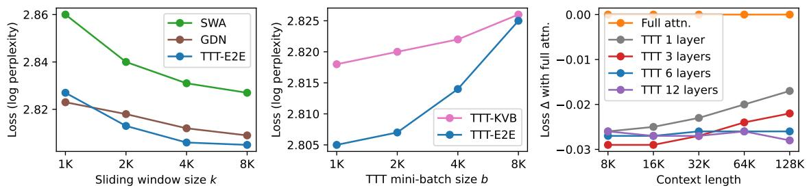
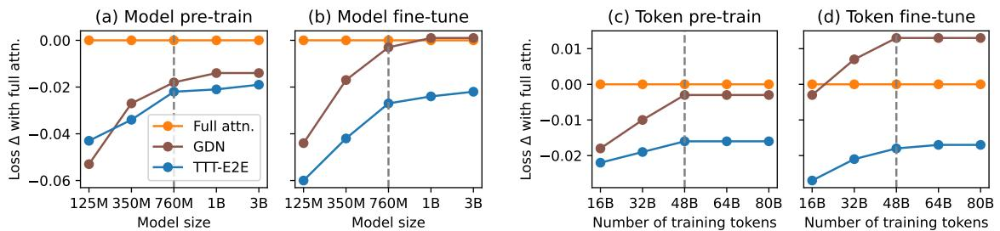
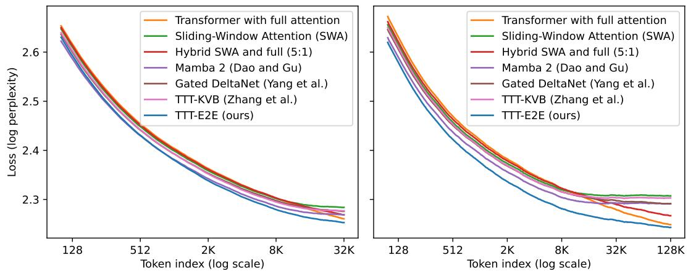
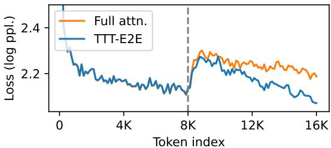
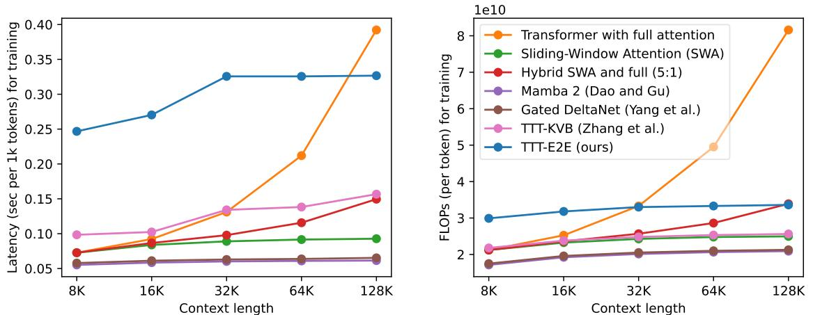

[← 返回 README](../README.md)

# 3 Main Results

## 📌 预览
本节给出证据链：超参消融、training compute scaling、context length scaling、needle 检索、长生成和计算效率。

All experiments can be reproduced using the code and datasets provided in our public repository: https://github.com/test-time-training/e2e.

# 3.1 Setup

Given the research nature of this paper, our goal is to experiment in the simplest setups at small and medium scales that can inform production-level training runs at large scale. In general, today’s large-scale runs usually consist of two or more stages [24, 103, 65, 74]:

• Pre-training at short context length on a general dataset containing diverse knowledge. • Extending the context length by fine-tuning on a dataset of long sequences. To gradually reach very long context, e.g., 1M, extension is usually broken down further into multiple stages.

For simplicity, our training runs consist of only two stages: pre-training at 8K context length, and extension fine-tuning at the final context length, at most 128K, depending on the experiment.
> 💡 **训练流程批注**: 实验采用两阶段：8K 预训练，再扩展微调到 16K/32K/64K/128K。这能把“短上下文建模能力”和“长上下文扩展能力”分开看。

Datasets. For pre-training, we use DCLM, specifically DCLM-Baseline, a heavily filtered subset of Common Crawl [63]. Given the $3 . 8 \mathrm { T }$ tokens in DCLM-Baseline, we first discard all documents shorter than 8K, our pre-training context length, and then randomly sample from the remaining ones to construct training sets of various sizes.4 However, most of the sequences in DCLM that are longer than 128K, our maximum context length for extension, are of low quality. So for fine-tuning, we use Books [29], a standard academic dataset for long-context extension [4, 66]. We also use a held-out partition of Books for language modeling evaluation.

Basic recipe. We experiment with models of five sizes, ranging from $1 2 5 \mathrm { M }$ to 3B parameters. Our configurations and training hyper-parameters in various experiments are all derived from a single basic recipe detailed in Appendix B. In summary, the basic recipe for model configurations and pre-training is taken from GPT-3 [14] and Mamba [32]; to produce the basic recipe for fine-tuning, we performed grid search for the Transformer baseline with full attention.

Baselines. We compare our method with six baselines that represent the state-of-the-art approaches in architecture design. All the baselines with sliding window use the same window size $k = 8 \mathrm { K }$ .
> 💡 **对照组设计**: baseline 覆盖 full attention、SWA、hybrid、Mamba 2、Gated DeltaNet、TTT-KVB。TTT-E2E 的底座是同样的 SWA，因此增益应归因于测试时 next-token updates 和 E2E 初始化，而不是单纯架构换皮。

1. Transformer with full attention [95]: with the model configurations discussed above. 2. Transformer with Sliding-Window Attention (SWA) [8]: with every full attention layer replaced by a SWA layer. Our main method in Subsection 2.3, without the implementation details,

  
Figure 4. Ablations on three hyper-parameters: sliding window size $k$ , mini-batch size $b$ , and the number of layers updated during TTT; see details in Subsection 3.2. Given the trends in these ablations, we set $k = 8 \mathrm { K }$ , $b = 1 \mathrm { K }$ , and we update 1/4 the total number of layers. Loss $\Delta$ (↓), the $y$ -value in the rightmost panel, is the same as in Figure 1. It is computed as (loss of the reported method) − (loss of Transformer with full attention), so loss $\Delta$ of full attention itself (orange) is the flat line at $y = 0$ . GDN stands for Gated DeltaNet [105].
> 💡 **超参证据链**: Figure 4 给出主设定来源：8K window、1K mini-batch、更新 1/4 layers。尤其 $b$ 变大伤性能，说明压缩更新太稀疏会削弱 continual learning。

is also based on this architecture. The window size $k$ is set to 8K in all our experiments, except for the window size ablations. Since the pre-training context length is also 8K, the full attention and SWA baselines are identical until extension fine-tuning.   
3. Hybrid SWA and full attention (5:1) [90]: repeating the pattern of five SWA layers followed by one full attention layer, in the style of Gemma [90].   
4. Mamba 2 [21]: a popular RNN that uses a hybrid of Mamba 2 layers and SWA layers; tested at large scale in Nemotron-H [11].   
5. Gated DeltaNet [104]: a popular RNN that extends Mamba 2 and DeltaNet [106], and uses a hybrid of Gated DeltaNet layers and SWA layers; tested at large scale in Kimi Linear [91].   
6. TTT-KVB [110]: a popular RNN that uses a hybrid of TTT-MLP layers with Key-Value Binding (KVB) [87] and SWA layers; also our starting point in Subsection 2.4 (without the simplified output rule). Titans [7] and Nested Learning [6] follow a similar construction.

We implement baselines 1–3 in JAX, together with our own method. For baselines 4–6, we use the official code and configurations provided by the authors and have consulted them to improve the baselines when possible. Our improvements to the baselines are discussed in Appendix C.

# 3.2 Ablations on Hyper-Parameters

To help readers gradually build an empirical intuition for our method, we start with the simplest experiments – ablations on the hyper-parameters introduced in Subsection 2.3. For all the ablations, we use the $7 6 0 \mathrm { M }$ model with the basic recipe.

Sliding window size $k$ . This hyper-parameter is present in all the methods, except for full attention.   
Therefore, we also conduct this ablation for two representative baselines: SWA and Gated DeltaNet.   
Not surprisingly, a larger $k$ improves performance for all three methods, as shown in the leftmost panel of Figure 4, and TTT-E2E has similar sensitivity to changes in $k$ compared to the baselines.   
We choose $k = 8 \mathrm { K }$ as the default since a smaller $k$ does not significantly improve runtime.

TTT-E2E with full attention. The window size ablation is conducted with only pre-training on DCLM without fine-tuning on Books, so the results above are evaluated on DCLM as well. Since the pre-training context length is also 8K, SWA with $k = 8 \mathrm { K }$ is exactly full attention, and TTT-E2E with $k = 8 \mathrm { K }$ becomes the same as TTT-E2E on top of full attention. It is especially interesting to observe that TTT-E2E can improve the test loss (by 0.018) even on top of full attention, and the difference between TTT-E2E and SWA does not change significantly as $k$ increases. This observation suggests that TTT-E2E is not merely compensating for the difference between full attention and SWA; instead, it produces an orthogonal improvement when other factors, such as context length, are fixed.
> 💡 **不是补 SWA 短板**: 在 8K 预训练场景里 SWA 等价 full attention，TTT-E2E 仍能改善 loss。这支持“权重压缩上下文”是正交增益，而不是仅补偿局部 attention 看不到远处。

TTT mini-batch size $b$ . The middle panel of Figure 4 experiments with the TTT mini-batch size $b$ , ranging from 1K to 8K. This hyper-parameter is unique to methods derived from the TTT perspective, so the only other baseline that allows for a meaningful comparison here is TTT-KVB.5 Similar to the window size ablation, the models are evaluated on DCLM after pre-training. For both TTT-E2E and TTT-KVB, we observe that a larger choice of $b$ significantly hurts performance. However, a choice of $b$ smaller than 1K also significantly hurts our hardware utilization and stability, to the point that it becomes difficult to experiment with. Therefore, we choose $b = 1 \mathrm { K }$ as the default.

Modified architectures without TTT. The choice of $b = 8 \mathrm { K }$ is equivalent to not doing TTT at all, because our pre-training context length is also 8K. However, both TTT-E2E and TTT-KVB without TTT are slightly different from Transformer with full attention, because both of these methods have slightly modified the Transformer architecture, as previously illustrated in Figure 3. So do these modifications still matter without TTT? Figure 4 suggests that the answer is no. Without TTT, the loss for either TTT-E2E (2.825) or TTT-KVB (2.826) is almost no different from full attention (2.827). This observation suggests that architecture design plays a minor, supporting role in our method.

# 3.2.1 Number of Layers Updated

We now turn to the most important ablation. As discussed in Subsection 2.3, the number of layers updated during TTT controls the amount of storage in which we can compress the information in the context window. Therefore, we investigate its effect in terms of context scaling, and present this ablation in the format of Figure 1 (left). Specifically, for each number of layers, we pre-train a single checkpoint on DCLM and then fine-tune five versions on Books, one for each context length, so the final results are evaluated on Books.6

We experiment with updating the last $1 / 2 , 1 / 4$ , and 1/8 of the layers. For our 760M model with a total of 24 layers, these ratios translate to the last 12, 6, and 3 layers. We also experiment with updating only the final layer. From the rightmost panel of Figure 4, we observe that when updating only 1 or 3 layers, our method does not scale with context length in the same way as full attention. When updating 6 or 12 layers, our method does scale. However, updating 12 layers only performs at roughly the same level as 6. Therefore, we always update the last 1/4 regardless of model size.
> 💡 **更新容量下限**: 更新 1 或 3 层不能像 full attention 一样随 context scale；更新 6 或 12 层可以。对 760M/24 层模型来说，最后 1/4=6 层是性能和计算的折中点。

# 3.3 Scaling with Training Compute

In general, there are two axes of training compute: the model size and the number of training tokens. We investigate the behavior of our method along these axes when compared to full attention and Gated DeltaNet, and present the results in Figure 5. We choose Gated DeltaNet as the representative among the RNN baselines because it is the most recent work with highly optimized training time.

One popular practice for measuring the effect of training compute is to evaluate on the pre-training dataset immediately after pre-training, as in many scaling law papers [53, 40]. In the left panels of Figure 5, we follow this practice and evaluate on DCLM after pre-training. But as discussed in Subsection 3.2, our window size is the same as the pre-training context length, making SWA, our baseline architecture, equivalent to full attention. This equivalence raises the concern that the practice discussed above might not reveal the true behavior of our method without full attention. So we also evaluate on Books at 32K context length after fine-tuning, as shown in the right panels.7

  
Figure 5. Scaling with training compute in two axes: model size (left) and number of training tokens (right); see details in Subsection 3.3. Overall, TTT-E2E exhibits a similar trend to full attention under a large training budget (right of the dotted line). We report results both on DCLM at 8K context length after pre-training (a, c) and on Books at 32K after fine-tuning with the same context length (b, d). Loss $\Delta$ (↓), the $y$ -value, is the same as in Figure 1 and 4. The legend in the leftmost panel is shared across all panels.
> 💡 **training compute scaling**: 作者没有只报单点结果，而是看 model size 和 token 数两个轴。结论是大预算区间 TTT-E2E 与 full attention 趋势相近，小预算区间 full attention 可能本身训练不足。

For scaling with model size, we simply vary across the five sizes in our basic recipe. For scaling with the number of training tokens, we keep the model size fixed at $7 6 0 \mathrm { M }$ , and vary the number of training tokens for pre-training and fine-tuning. Specifically, our basic number of tokens for pre-training is taken from the Chinchilla recipe [40], and our basic number for fine-tuning is $5 \%$ of that for pre-training, as discussed in Appendix B. We experiment with up to $5 \times$ the basic number for pre-training and fine-tuning, keeping the $5 \%$ ratio fixed.

Similar trend to full attention under large budget. We observe a similar trend across the panels:

• The advantage of TTT-E2E over full attention visibly decreases with more training compute in the regime of small compute budget.   
• However, in the regime of medium compute budget, TTT-E2E follows a similar scaling trend to full attention, as indicated by the blue line staying relatively flat. Although there is still a small uptick for scaling with model size, we expect this uptick to disappear for even larger models given the overall trend.

For scaling with model size, the boundary for the change of regime is roughly 760M. For scaling with number of training tokens, this boundary is roughly 48B. We mark these boundaries in Figure 5 with dotted vertical lines. It is especially interesting to observe that Gated DeltaNet follows the same trend as TTT-E2E. We offer two potential explanations for this observation:

• Our method can also be interpreted as a hybrid RNN, similar to Gated DeltaNet, as explained in Subsection 2.4. We expect RNNs (sequence models with hidden states of fixed size) to share a similar trend for scaling with training compute. • Transformers are widely known to under-perform with insufficient training compute compared to RNNs [53, 40]. Our observations can be interpreted as a deficiency of the full attention baseline with small compute, rather than a deficiency of RNNs with large compute.

Overall, our empirical observations strongly indicate that TTT-E2E should produce the same trend as full attention for scaling with training compute in large-budget production runs.

Sensitivity to tokenizer and data quality. During our scaling investigation, we collected anecdotal observations on the effect of tokenizer and data quality, as indicated by recency. Specifically:

• Switching to the Llama 3 tokenizer (2024) from the Llama 2 tokenizer (2023) improved our advantage over full attention by about 0.01 for 3B models.   
• Switching to DCLM (2024) from SlimPajama (2023) [84] enabled our method to produce the same trend as full attention for scaling with number of training tokens after 48B; our trend with FineWebEdu (2024) [69] is also the same as full attention. With SlimPajama, our lines in the right panels of Figure 5 exhibited a small uptick, similar to those in the left panels for scaling with model size.

  
Figure 6. Loss breakdown by token index, for context length 32K (left) and 128K (right), following the same process as when we produced the right panel of Figure 2; see details in Subsection 3.4. Overall, TTT-E2E is the only method that always achieves lower losses than full attention throughout the entire context length, and its aggregated advantage mostly comes from the earlier tokens.
> 💡 **loss breakdown 解读**: Figure 6 的重点不是只看平均 loss，而是按 token index 看：TTT-E2E 全程低于 full attention，优势主要来自上下文早段，说明压缩记忆在长序列前期已开始形成可用状态。

A comprehensive investigation of these effects would entail reproducing Figure 5 for a wide variety of tokenizers and datasets, which is beyond the scope of our paper. Nevertheless, our anecdotal observations might still offer a starting point for future work. An especially interesting direction is TTT on self-generated tokens, which can be a filtered or rephrased version of the current mini-batch of tokens or a review of the previous mini-batches. It is widely known that the gating mechanisms in RNNs can guard the hidden states against spurious inputs and better retain the information in valuable ones [39, 16]. We believe that self-generation during TTT can play a similar role.

# 3.4 Scaling with Context Length

We presented the key results for scaling with context length in Figure 1 on the first page. Here, we discuss the setup of these experiments and present a breakdown of some of these results in Figure 6. In addition, Figure 9 in the appendix directly plots the loss values in Figure 1 instead of the loss $\Delta s$ .

For the experiments in Figure 1, we use the largest model (3B) in our basic recipe. We also use $3 \times$ the basic number of tokens for both pre-training and fine-tuning. As discussed, the basic number for pre-training is taken from the Chinchilla recipe, and that for fine-tuning is $5 \%$ of pre-training. As in our previous experiments, we pre-train a single checkpoint on DCLM and then fine-tune five versions on Books, one for each context length, so the final results are evaluated on Books.
> 💡 **主 claim 的规模条件**: 最关键结果来自 3B 模型，使用 3x basic tokens；结合摘要，等价于 164B tokens 训练证据链。这个规模还不是超大模型，但足以比 toy/小规模更可信。

# 3.4.1 Loss Breakdown by Token Index

Figure 6 focuses on two context lengths, 32K and $1 2 8 \mathrm { K } ,$ , and breaks down the corresponding results in Figure 1 by token index; we have followed the same process in Subsection 2.1 to produce the right panel of Figure 2. Specifically, given a context length $T$ , for each $t = 1 , \ldots , T$ , we plot the test loss of the next-token prediction task that conditions on $x _ { 0 } , \ldots , x _ { t - 1 }$ and tries to predict $x _ { t }$ .8 Therefore, for each method with context length $T$ , its test loss in Figure 1 is the average of all the losses on its corresponding curve in Figure 6. It is important to note that the breakdown for 32K is not a subset of that for 128K, since they are produced from two different models.

<table><tr><td></td><td colspan="5">S-NIAH-1 (pass-key retrieval)</td><td colspan="5">S-NIAH-2 (number in haystack)</td><td colspan="5">S-NIAH-3 (UUID in haystack)</td></tr><tr><td>Method</td><td></td><td></td><td></td><td></td><td></td><td></td><td></td><td></td><td></td><td></td><td></td><td></td><td></td><td></td><td></td></tr><tr><td></td><td>8K</td><td>16K</td><td>32K</td><td>64K</td><td>128K</td><td>8K</td><td>16K</td><td>32K</td><td>64K</td><td>128K</td><td>8K</td><td>16K</td><td>32K</td><td>64K</td><td>128K</td></tr><tr><td>Full attention</td><td>1.00</td><td>1.00</td><td>1.00</td><td>1.00</td><td>0.99</td><td>0.99</td><td>1.00</td><td>1.00</td><td>1.00</td><td>0.86</td><td>0.64</td><td>0.64</td><td>0.67</td><td>0.83</td><td>0.64</td></tr><tr><td>SWA</td><td>1.00</td><td>0.50</td><td>0.26</td><td>0.13</td><td>0.07</td><td>1.00</td><td>0.43</td><td>0.28</td><td>0.16</td><td>0.05</td><td>0.57</td><td>0.41</td><td>0.24</td><td>0.09</td><td>0.05</td></tr><tr><td>Hybrid SWA and full</td><td>1.00</td><td>0.93</td><td>0.88</td><td>0.69</td><td>0.21</td><td>1.00</td><td>1.00</td><td>0.99</td><td>0.89</td><td>0.29</td><td>0.63</td><td>0.56</td><td>0.32</td><td>0.17</td><td>0.06</td></tr><tr><td>Mamba 2 [21]</td><td>0.99</td><td>0.49</td><td>0.26</td><td>0.13</td><td>0.07</td><td>0.99</td><td>0.43</td><td>0.28</td><td>0.16</td><td>0.05</td><td>0.77</td><td>0.36</td><td>0.24</td><td>0.08</td><td>0.04</td></tr><tr><td>Gated DeltaNet [104]</td><td>1.00</td><td>0.50</td><td>0.26</td><td>0.13</td><td>0.07</td><td>1.00</td><td>0.43</td><td>0.27</td><td>0.16</td><td>0.05</td><td>0.91</td><td>0.45</td><td>0.23</td><td>0.07</td><td>0.03</td></tr><tr><td>TTT-KVB [110]</td><td>0.98</td><td>0.43</td><td>0.22</td><td>0.10</td><td>0.01</td><td>1.00</td><td>0.43</td><td>0.27</td><td>0.16</td><td>0.05</td><td>0.74</td><td>0.34</td><td>0.23</td><td>0.06</td><td>0.04</td></tr><tr><td>TTT-E2E (ours)</td><td>1.00</td><td>0.46</td><td>0.24</td><td>0.13</td><td>0.06</td><td>0.99</td><td>0.43</td><td>0.28</td><td>0.16</td><td>0.05</td><td>0.77</td><td>0.44</td><td>0.24</td><td>0.10</td><td>0.03</td></tr></table>

Table 2. S-NIAH performance across context lengths, with the best results in bold; see details in Subsection 3.5. Overall, Transformer with full attention dramatically outperforms the other methods, including ours, especially in long context. This observation, combined with findings from our previous subsections, supports the intuition that the strength of full attention lies in its nearly lossless recall.
> 💡 **重要局限**: Needle-in-a-haystack 暴露了压缩式记忆的代价：TTT-E2E 擅长平均预测，不擅长无损保留任意字符串。full attention 的 KV cache 在精确检索任务上仍有结构性优势。

We make the following observations from both panels of Figure 6:

• TTT-E2E is the only method that always achieves lower losses than full attention throughout the entire context length.   
• The difference in test loss between TTT-E2E and full attention is small around the end of the context window. The aggregated advantage of TTT-E2E over full attention mostly comes from the earlier tokens.

The fact that both observations hold simultaneously for both panels is especially interesting in a somewhat paradoxical way. As part of the second observation, the difference between TTT-E2E and full attention in the left panel is small around $t = 3 2 \mathrm { K }$ , the end of the context window. Without other information, one might even speculate that the curves would cross for larger context lengths, such as 128K. But this speculation is false, as asserted by the first observation from the right panel. The breakdown plot for 128K better resembles a stretched out version of that for 32K rather than a speculated continuation. Given that TTT-E2E maintains the same advantage over full attention across context lengths in Figure 1, this stretching effect should not be surprising.

What gives TTT-E2E an advantage over full attention for the earlier tokens? Note that this advantage exists even before $t = 1 \mathrm { K }$ , when TTT takes the first gradient step on the first (inner-loop) mini-batch. In other words, before $t = 1 \mathrm { K }$ , TTT-E2E and full attention have exactly the same computation graph and only differ in their weights. So why do the weights of TTT-E2E produce much lower losses?

Here is an intuitive explanation: The weights of full attention must prepare to be good at all future tokens in the context window. Such a task can be very hard, because being good at all possible futures limits the model’s capacity to be good at any particular one. But the weights of TTT-E2E only need to be good at the present mini-batch of tokens, since TTT will produce future weights for the future tokens. This more focused task should be much easier. In fact, a key intuition of TTT in general, as we will discuss in Subsection 4.2, is to focus on the present.

# 3.5 Needle in a Haystack

The motivation for our method, as discussed in Section 1, was to use longer context to achieve better performance in language modeling without having to recall every detail. Up to this point, we have focused on evaluations that do not require detailed recall. Here, we consider a popular evaluation explicitly designed for recall known as Needle in a Haystack (NIAH): The model needs to retrieve a target string (needle) in a passage (haystack), where the target string is distinguished by its clear irrelevance to the rest of the passage. Specifically, we evaluate all the 3B models fine-tuned at 128K context length, on the three NIAH tasks in RULER [42].

  
Figure 7. Decoding long sequences, using Qwen-8B as the evaluator; see details in Subsection 3.6. For each method, we prefill its context window with 8K tokens from Books, decode another 8K tokens as continuation, and then plot the loss of Qwen-8B by token index, averaged over 512 sequences. The dotted line marks the boundary between prefill and decode. This plot is in linear scale instead of log scale.

From Table 2, we observe that Transformer with full attention dramatically outperforms the other methods, including ours, especially in long context. This observation, combined with findings from our previous subsections, supports the intuition that the strength of full attention lies in its nearly lossless recall. This strength is inherent to the design of self-attention, which attends to the keys and values of all previous tokens in its cache. In contrast, the key mechanism in our method is compression, which leaves out seemingly irrelevant details, such as the target string.

# 3.6 Decoding Long Sequences

Up to this point, all our evaluations have required the model to decode no more than a dozen tokens. As discussed in the end of Subsection 2.3, when the decoded tokens have filled a TTT mini-batch, TTT-E2E takes a gradient step on this batch of decoded tokens. Does this method of “self-training” at test time work for decoding long sequences?

In practice, scenarios that require decoding long sequences typically arise either after instruction fine-tuning or during reinforcement learning, e.g., when the model generates long chains of thought. Therefore, it is inherently challenging to evaluate base models, without the two stages above, in a realistic way. Since these two stages are beyond the scope of our paper, we make our best effort to evaluate the 3B base models we have trained in Subsection 3.4.

For the evaluation in Figure 7, we use Qwen-3-8B-Base [92] as the evaluator. Since our models were trained on Books, we prefill their context windows with 8K tokens from Books, decode another 8K tokens as continuation, and then plot the loss (log likelihood) of Qwen-8B on the concatenated 16K sequence by token index. While Figure 6 uses log scale for the $x$ -axis, Figure 7 here uses linear scale, allowing us to easily compare the trends for prefill and decode. Additional details of this evaluation are provided in Appendix D.

Similar to our previous observations, TTT-E2E achieves lower Qwen loss than full attention in this limited evaluation. In addition, we have carefully inspected $\approx 2 0$ samples of the generated text and found them reasonable. For both methods, the Qwen loss increases sharply at the boundary between prefill and decode, and then gradually decreases again. This behavior likely arises because Qwen is initially unfamiliar with the generation style of the evaluated method, but then gradually adapts as more generated content accumulates within its context window.
> 💡 **长生成证据弱读法**: 8K prefill + 8K decode 用 Qwen-3-8B 做 evaluator 只是有限 sanity check。它说明 decoded tokens 填满 mini-batch 后自训练没有立刻崩，但不能等同 instruction/RL 场景下的长 CoT 结论。

# 3.7 Computational Efficiency

In Figure 1, we have presented our inference latency, specifically prefill latency, compared to that of the baselines. Here, we discuss our setup for measuring prefill latency, and consider two additional axes where computational efficiency is important: decode and training. In particular, we highlight training latency as a significant limitation of our current implementation and discuss two potential directions for improving it.

  
Figure 8. Training efficiency, in terms of latency on an $_ { \textrm { H 2 0 0 } }$ (left) and FLOPs (right); see details in Subsection 3.3. Overall, training latency is still a significant limitation of our current implementation. The legend is shared across both panels.

Setup for prefill latency. For each method in the right panel of Figure 1, we took its corresponding 3B model in the left panel and measured its prefill latency on one H100. We also took additional steps to optimize the inference latency of the PyTorch baselines, as discussed in Appendix C. Following Gated DeltaNet [104], the latency experiments are performed with a constant number of tokens (128K) per (outer-loop) batch. For example, at 128K context length, each batch contains one sequence, and at 8K each batch contains 16 sequences.
> 💡 **延迟主张**: 推理端最强卖点是 prefill latency 随 context 近似常数，而 full attention 随 context 增长；128K/H100 上 2.7x 更快是本文“像 full attention 一样扩展、像 RNN 一样常延迟”的实证落点。

TTT-E2E only uses standard infrastructure. At test time, TTT-E2E can simply use the standard infrastructure optimized for training a regular Transformer. Specifically, since our hidden state takes the form of regular MLP layers, it can be sharded across GPUs using standard tools with no custom kernel. In contrast, prior work must fit their hidden states onto the individual chips inside a GPU, which significantly limits their hidden state size. For example, TTT-KVB [110] must reduce its state size with LoRA, while other prior work, such as Mamba 2 [21] and Gated DeltaNet [104], must use a linear hidden state and write custom kernels for efficient memory I/O.

Decode latency. As discussed in the end of Subsection 2.3, our method does not perform TTT until the decoded tokens have completely filled a TTT mini-batch. So before reaching a full batch, our decode latency is the same as that of a regular Transformer with SWA. Once we have a full batch, we need a step of TTT before decoding the next batch of tokens, and our latency for this TTT step is the same as that for prefill. Altogether, our latency for decoding a long sequence of multiple batches is simply the sum of the two latencies above: that of SWA decode and that of our prefill. Since both are readily available, we do not report separate measurements for the decode latency of TTT-E2E.

Setup for training latency. Most of our training was performed on GB200s. Since many of our baselines do not have custom kernels written for GB200s (Blackwell), we benchmark training latency on an $_ { \textrm { H 2 0 0 } }$ (Hopper) for fairness to the baselines. Following our protocol for prefill, we use a constant number of tokens (128K) per batch regardless of context length.

Training latency is a limitation. At training time, TTT-E2E takes gradients of gradients, which is a much less optimized procedure compared to training a regular Transformer. As shown in the left panel Figure 8, our training latency is $1 . 2 \times$ faster than full attention at 128K context length, but $3 . 4 \times$ slower at 8K. Since most of the training compute is typically spent on pre-training with short context, the training latency of our current implementation remains a significant limitation. Note that even though our number of FLOPs per token remains constant, as shown in the right panel, our latency grows between 8K and 32K. This trend arises because we have to increase the amount of gradient checkpointing through time by a factor of $\log ( T ) .$ , where $T$ is the context length.9
> 💡 **训练成本风险**: E2E outer-loop 要算 gradients of gradients，当前训练延迟在短上下文 8K 比 full attention 慢 3.4x。论文的推理效率优势不能直接外推到训练总成本。

Directions for faster training. There are two directions for improving our overall training time:

• Our current implementation cannot use cuDNN FlashAttention [20] at training time because it does not support gradients of gradients. A custom attention kernel would significantly improve our hardware utilization, and potentially eliminate the undesirable trend caused by gradient checkpointing through time.   
• We believe that the training of TTT-E2E can be initialized from a pre-trained Transformer without TTT – a technique often adopted by prior work on RNNs [54, 10, 99]. This practical technique allows TTT-E2E to only take up a small portion of the overall training compute, so the negative effect of its training latency is minimal.

We leave these directions for future work.

---

## 🔖 Section 总结

- **主证据**: 3B/164B tokens/128K context 下，TTT-E2E 的 context scaling 接近 full attention，同时 prefill latency 保持近似常数。
- **关键消融**: $k=8K$、$b=1K$、更新最后 1/4 blocks 是性能/稳定性/计算折中。
- **重要局限**: Needle-in-a-haystack 远弱于 full attention，训练延迟当前仍是瓶颈。
