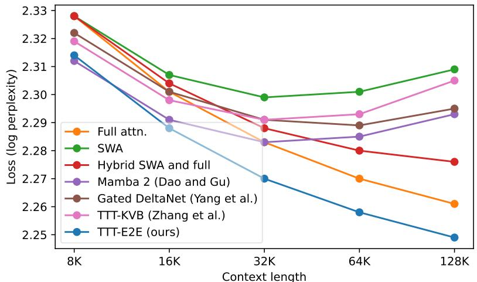

[← 返回 README](../README.md)

# Appendix / Back Matter

## 📌 预览
本节保留论文结论后的 back matter、references 和 Appendix A-D。这里的关键信息不是新方法模块，而是复现实验所需的 basic recipe、toy setup、baseline 改动和 decoding 细节。

> 💡 **阅读定位**: 对 TTT-E2E 来说，Appendix 主要回答“实验怎么复现”和“baseline 是否公平”。其中 Basic Recipe、baseline improvements、decoding evaluation 直接影响主文 scaling/latency 结论的可信度。

# Author Contributions

We state the contributions of each of the six core contributors.

Arnuv Tandon and Karan Dalal led the investigations into scaling with training compute and scaling with context length, developed the codebase, conducted the final experiments, managed our cluster, and played a central role in every aspect of this research, including its overall direction.

Xinhao Li developed and conducted most of the early experiments, including the toy experiments, co-developed our early codebase with Marcel, and contributed features for large-scale training.

Daniel Koceja led a set of mid-project experiments that brought clarity to the team’s investigation into scaling with training compute.

Marcel Rød developed most of the early codebase and provided expertise to improve latency.

Yu Sun served as the project lead, making decisions on most day-to-day matters and on the project’s overall direction. He developed the idea of TTT-E2E, designed most of the early experiments, and established the experimental protocols for the team. He also wrote the paper.

Yu Sun started the project in October 2024 together with Xinhao Li, Karan Dalal, and Daniel Koceja. Arnuv Tandon and Marcel Rød joined the project in November 2024. Karan Dalal and Daniel Koceja left from November 2024 through March 2025, and rejoined the project in April 2025. Marcel Rød left the project in May 2025. Xinhao Li and Daniel Koceja left in September 2025.

# Acknowledgements

XW was supported, in part, by NSF CAREER Award IIS-2240014. TH was supported by the Tianqiao and Chrissy Chen Foundation and a grant under the NSF CAREER IIS-2338866, ONR N00014-24-1- 2609, and DARPA Cooperative Agreement HR00112520013. This work does not necessarily reflect the position or policy of the government, and no official endorsement should be inferred.

The authors would like to thank Hyperbolic Labs and SF Compute for their GPU cloud services, Matt Behrens and the service team at Voltage Park for their help with our cluster, Zacharie Bugaud and Alan Zheng at Astera for discussions during the weekly meetings, Jan Kautz at NVIDIA for general research support, Zhuang Liu for discussions during the early phase of the project, and Arjun Vikram, Gashon Hussein, and Aaditya Prasad for their short-term contributions. Arnuv and Karan would like to thank Harj Taggar at Y-Combinator for his support with compute credits. Yu would like to thank Songlin Yang and Tianyuan Zhang for their feedback on drafts and results, Mert Yuksekgonul and Chloe Hsu for their support at every phase of the project, as well as his PhD advisors, Alexei A. Efros and Moritz Hardt, for their many insights from years ago that eventually became part of this paper.

References   
[1] Sandhini Agarwal, Lama Ahmad, Jason Ai, Sam Altman, Andy Applebaum, Edwin Arbus, Rahul K Arora, Yu Bai, Bowen Baker, Haiming Bao, et al. gpt-oss-120b & gpt-oss-20b model card. arXiv preprint arXiv:2508.10925, 2025.   
[2] Ekin Akyürek, Mehul Damani, Linlu Qiu, Han Guo, Yoon Kim, and Jacob Andreas. The surprising effectiveness of test-time training for abstract reasoning. arXiv e-prints, pages arXiv–2411, 2024.   
[3] Marcin Andrychowicz, Misha Denil, Sergio Gomez, Matthew W Hoffman, David Pfau, Tom Schaul, Brendan Shillingford, and Nando De Freitas. Learning to learn by gradient descent by gradient descent. Advances in neural information processing systems, 29, 2016. [4] Authors Guild. You just found out your book was used to train ai. now what?, 2023. Accessed: 2024-06- 24. [5] Marco Bagatella, Mert Albaba, Jonas Hübotter, Georg Martius, and Andreas Krause. Test-time offline reinforcement learning on goal-related experience. arXiv preprint arXiv:2507.18809, 2025. [6] Ali Behrouz, Meisam Razaviyayn, Peilin Zhong, and Vahab Mirrokni. Nested learning: The illusion of deep learning architectures. In The Thirty-ninth Annual Conference on Neural Information Processing Systems, 2025.   
[7] Ali Behrouz, Peilin Zhong, and Vahab Mirrokni. Titans: Learning to memorize at test time. arXiv preprint arXiv:2501.00663, 2024. [8] Iz Beltagy, Matthew E Peters, and Arman Cohan. Longformer: The long-document transformer. arXiv preprint arXiv:2004.05150, 2020.   
[9] Yoshua Bengio, Samy Bengio, and Jocelyn Cloutier. Learning a synaptic learning rule. Citeseer, 1990.   
[10] Aviv Bick, Kevin Y. Li, Eric P. Xing, J. Zico Kolter, and Albert Gu. Transformers to SSMs: Distilling quadratic knowledge to subquadratic models. arXiv preprint arXiv:2408.10189, 2024.   
[11] Aaron Blakeman, Aarti Basant, Abhinav Khattar, Adithya Renduchintala, Akhiad Bercovich, Aleksander Ficek, Alexis Bjorlin, Ali Taghibakhshi, Amala Sanjay Deshmukh, Ameya Sunil Mahabaleshwarkar, et al. Nemotron-h: A family of accurate and efficient hybrid mamba-transformer models. arXiv preprint arXiv:2504.03624, 2025.   
[12] Léon Bottou and Vladimir Vapnik. Local learning algorithms. Neural computation, 4(6):888–900, 1992.   
[13] James Bradbury, Roy Frostig, Peter Hawkins, Matthew James Johnson, Chris Leary, Dougal Maclaurin, George Necula, Adam Paszke, Jake VanderPlas, Skye Wanderman-Milne, and Qiao Zhang. JAX: composable transformations of Python+NumPy programs, 2018.   
[14] Tom Brown, Benjamin Mann, Nick Ryder, Melanie Subbiah, Jared D Kaplan, Prafulla Dhariwal, Arvind Neelakantan, Pranav Shyam, Girish Sastry, Amanda Askell, et al. Language models are few-shot learners. Advances in neural information processing systems, 33:1877–1901, 2020.   
[15] Tianqi Chen, Bing Xu, Chiyuan Zhang, and Carlos Guestrin. Training deep nets with sublinear memory cost, 2016.   
[16] Junyoung Chung, Caglar Gulcehre, KyungHyun Cho, and Yoshua Bengio. Empirical evaluation of gated recurrent neural networks on sequence modeling. arXiv preprint arXiv:1412.3555, 2014.   
[17] Kevin Clark, Kelvin Guu, Ming-Wei Chang, Panupong Pasupat, Geoffrey Hinton, and Mohammad Norouzi. Meta-learning fast weight language models. arXiv preprint arXiv:2212.02475, 2022.   
[18] William S Cleveland. Robust locally weighted regression and smoothing scatterplots. Journal of the American statistical association, 74(368):829–836, 1979.   
[19] Karan Dalal, Daniel Koceja, Jiarui Xu, Yue Zhao, Shihao Han, Ka Chun Cheung, Jan Kautz, Yejin Choi, Yu Sun, and Xiaolong Wang. One-minute video generation with test-time training. In Proceedings of the Computer Vision and Pattern Recognition Conference, pages 17702–17711, 2025.   
[20] Tri Dao. Flashattention-2: Faster attention with better parallelism and work partitioning. arXiv preprint arXiv:2307.08691, 2023.   
[21] Tri Dao and Albert Gu. Transformers are ssms: Generalized models and efficient algorithms through structured state space duality. arXiv preprint arXiv:2405.21060, 2024.   
[22] Matthias De Lange, Rahaf Aljundi, Marc Masana, Sarah Parisot, Xu Jia, Aleš Leonardis, Gregory Slabaugh, and Tinne Tuytelaars. A continual learning survey: Defying forgetting in classification tasks. IEEE transactions on pattern analysis and machine intelligence, 44(7):3366–3385, 2021.   
[23] Jacob Devlin, Ming-Wei Chang, Kenton Lee, and Kristina Toutanova. Bert: Pre-training of deep bidirectional transformers for language understanding. arXiv preprint arXiv:1810.04805, 2018.   
[24] Abhimanyu Dubey, Abhinav Jauhri, Abhinav Pandey, Abhishek Kadian, Ahmad Al-Dahle, Aiesha Letman, Akhil Mathur, Alan Schelten, Amy Yang, Angela Fan, et al. The llama 3 herd of models. arXiv e-prints, pages arXiv–2407, 2024.   
[25] Logan Engstrom, Andrew Ilyas, Benjamin Chen, Axel Feldmann, William Moses, and Aleksander Madry. Optimizing ml training with metagradient descent. arXiv preprint arXiv:2503.13751, 2025.   
[26] Jerome A Feldman. Dynamic connections in neural networks. Biological cybernetics, 46(1):27–39, 1982.   
[27] Chelsea Finn, Pieter Abbeel, and Sergey Levine. Model-agnostic meta-learning for fast adaptation of deep networks. In International conference on machine learning, pages 1126–1135. PMLR, 2017.   
[28] Yossi Gandelsman, Yu Sun, Xinlei Chen, and Alexei A. Efros. Test-time training with masked autoencoders. Advances in Neural Information Processing Systems, 2022.   
[29] Leo Gao, Stella Biderman, Sid Black, Laurence Golding, Travis Hoppe, Charles Foster, Jason Phang, Horace He, Anish Thite, Noa Nabeshima, Shawn Presser, and Connor Leahy. The pile: An 800gb dataset of diverse text for language modeling, 2020.   
[30] Spyros Gidaris and Nikos Komodakis. Dynamic few-shot visual learning without forgetting. In Proceedings of the IEEE Conference on Computer Vision and Pattern Recognition, pages 4367–4375, 2018.   
[31] Riccardo Grazzi, Julien Siems, Arber Zela, Jörg KH Franke, Frank Hutter, and Massimiliano Pontil. Unlocking state-tracking in linear rnns through negative eigenvalues. International Conference on Learning Representations (ICLR), 2024.   
[32] Albert Gu and Tri Dao. Mamba: Linear-time sequence modeling with selective state spaces. arXiv preprint arXiv:2312.00752, 2023.   
[33] Raia Hadsell, Dushyant Rao, Andrei A Rusu, and Razvan Pascanu. Embracing change: Continual learning in deep neural networks. Trends in cognitive sciences, 24(12):1028–1040, 2020.   
[34] Nicklas Hansen, Rishabh Jangir, Yu Sun, Guillem Alenyà, Pieter Abbeel, Alexei A Efros, Lerrel Pinto, and Xiaolong Wang. Self-supervised policy adaptation during deployment. arXiv preprint arXiv:2007.04309, 2020.   
[35] Moritz Hardt and Yu Sun. Test-time training on nearest neighbors for large language models. arXiv preprint arXiv:2305.18466, 2023.   
[36] Demis Hassabis, Dharshan Kumaran, Christopher Summerfield, and Matthew Botvinick. Neuroscienceinspired artificial intelligence. Neuron, 95(2):245–258, 2017.   
[37] Kaiming He, Xinlei Chen, Saining Xie, Yanghao Li, Piotr Dollár, and Ross B. Girshick. Masked autoencoders are scalable vision learners. CoRR, abs/2111.06377, 2021.   
[38] Geoffrey E Hinton and David C Plaut. Using fast weights to deblur old memories. In Proceedings of the ninth annual conference of the Cognitive Science Society, pages 177–186, 1987.   
[39] Sepp Hochreiter and Jürgen Schmidhuber. Long short-term memory. Neural computation, 9(8):1735–1780, 1997.   
[40] Jordan Hoffmann, Sebastian Borgeaud, Arthur Mensch, Elena Buchatskaya, Trevor Cai, Eliza Rutherford, Diego de Las Casas, Lisa Anne Hendricks, Johannes Welbl, Aidan Clark, Tom Hennigan, Eric Noland, Katie Millican, George van den Driessche, Bogdan Damoc, Aurelia Guy, Simon Osindero, Karen Simonyan, Erich Elsen, Jack W. Rae, Oriol Vinyals, and Laurent Sifre. Training compute-optimal large language models, 2022.   
[41] Ari Holtzman, Jan Buys, Li Du, Maxwell Forbes, and Yejin Choi. The curious case of neural text degeneration. arXiv preprint arXiv:1904.09751, 2019.   
[42] Cheng-Ping Hsieh, Simeng Sun, Samuel Kriman, Shantanu Acharya, Dima Rekesh, Fei Jia, Yang Zhang, and Boris Ginsburg. Ruler: What’s the real context size of your long-context language models? arXiv preprint arXiv:2404.06654, 2024.   
[43] Edward J Hu, Yelong Shen, Phillip Wallis, Zeyuan Allen-Zhu, Yuanzhi Li, Shean Wang, Lu Wang, Weizhu Chen, et al. Lora: Low-rank adaptation of large language models. ICLR, 1(2):3, 2022.   
[44] T. Hubert, R. Mehta, L. Sartran, and et al. Olympiad-level formal mathematical reasoning with reinforcement learning. Nature, 2025.   
[45] Jonas Hübotter, Sascha Bongni, Ido Hakimi, and Andreas Krause. Efficiently learning at test-time: Active fine-tuning of llms. arXiv preprint arXiv:2410.08020, 2024.   
[46] Jonas Hübotter, Leander Diaz-Bone, Ido Hakimi, Andreas Krause, and Moritz Hardt. Learning on the job: Test-time curricula for targeted reinforcement learning. arXiv preprint arXiv:2510.04786, 2025.   
[47] Kazuki Irie, Róbert Csordás, and Jürgen Schmidhuber. Practical computational power of linear transformers and their recurrent and self-referential extensions. Conference on Empirical Methods in Natural Language Processing (EMNLP), 2023.   
[48] Kazuki Irie, Francesco Faccio, and Jürgen Schmidhuber. Neural differential equations for learning to program neural nets through continuous learning rules. Advances in Neural Information Processing Systems, 2022.   
[49] Kazuki Irie, Imanol Schlag, Róbert Csordás, and Jürgen Schmidhuber. Going beyond linear transformers with recurrent fast weight programmers. Advances in Neural Information Processing Systems, 2021.   
[50] Kazuki Irie, Imanol Schlag, Róbert Csordás, and Jürgen Schmidhuber. A modern self-referential weight matrix that learns to modify itself. In International Conference on Machine Learning, pages 9660–9677. PMLR, 2022.   
[51] Kazuki Irie and Jürgen Schmidhuber. Images as weight matrices: Sequential image generation through synaptic learning rules. International Conference on Learning Representations (ICLR), 2022.   
[52] Vidit Jain and Erik Learned-Miller. Online domain adaptation of a pre-trained cascade of classifiers. In CVPR 2011, pages 577–584. IEEE, 2011.   
[53] Jared Kaplan, Sam McCandlish, Tom Henighan, Tom B Brown, Benjamin Chess, Rewon Child, Scott Gray, Alec Radford, Jeffrey Wu, and Dario Amodei. Scaling laws for neural language models. arXiv preprint arXiv:2001.08361, 2020.   
[54] Jungo Kasai, Hao Peng, Yizhe Zhang, Dani Yogatama, Gabriel Ilharco, Nikolaos Pappas, Yi Mao, Weizhu Chen, and Noah A. Smith. Finetuning pretrained transformers into RNNs. In Proceedings of the 2021 Conference on Empirical Methods in Natural Language Processing (EMNLP). Association for Computational Linguistics, 2021.   
[55] Angelos Katharopoulos, Apoorv Vyas, Nikolaos Pappas, and François Fleuret. Transformers are rnns: Fast autoregressive transformers with linear attention. In International conference on machine learning, pages 5156–5165. PMLR, 2020.   
[56] Zixuan Ke, Yijia Shao, Haowei Lin, Tatsuya Konishi, Gyuhak Kim, and Bing Liu. Continual pre-training of language models. arXiv preprint arXiv:2302.03241, 2023.   
[57] James Kirkpatrick, Razvan Pascanu, Neil Rabinowitz, Joel Veness, Guillaume Desjardins, Andrei A Rusu, Kieran Milan, John Quan, Tiago Ramalho, Agnieszka Grabska-Barwinska, et al. Overcoming catastrophic forgetting in neural networks. Proceedings of the national academy of sciences, 114(13):3521–3526, 2017.   
[58] Louis Kirsch and Jürgen Schmidhuber. Meta learning backpropagation and improving it. Advances in Neural Information Processing Systems, 34:14122–14134, 2021.   
[59] Nikita Kitaev, Łukasz Kaiser, and Anselm Levskaya. Reformer: The efficient transformer. arXiv preprint arXiv:2001.04451, 2020.   
[60] Ben Krause, Emmanuel Kahembwe, Iain Murray, and Steve Renals. Dynamic evaluation of neural sequence models. In International Conference on Machine Learning, pages 2766–2775. PMLR, 2018.   
[61] Brenden M Lake, Tomer D Ullman, Joshua B Tenenbaum, and Samuel J Gershman. Building machines that learn and think like people. Behavioral and brain sciences, 40:e253, 2017.   
[62] Chen-Yu Lee, Saining Xie, Patrick Gallagher, Zhengyou Zhang, and Zhuowen Tu. Deeply-supervised nets. In Artificial intelligence and statistics, pages 562–570. Pmlr, 2015.   
[63] Jeffrey Li, Alex Fang, Georgios Smyrnis, Maor Ivgi, Matt Jordan, Samir Yitzhak Gadre, Hritik Bansal, Etash Guha, Sedrick Scott Keh, Kushal Arora, et al. Datacomp-lm: In search of the next generation of training sets for language models. Advances in Neural Information Processing Systems, 37:14200–14282, 2024.   
[64] Zhizhong Li and Derek Hoiem. Learning without forgetting. IEEE transactions on pattern analysis and machine intelligence, 40(12):2935–2947, 2017.   
[65] Aixin Liu, Bei Feng, Bing Xue, Bingxuan Wang, Bochao Wu, Chengda Lu, Chenggang Zhao, Chengqi Deng, Chenyu Zhang, Chong Ruan, et al. Deepseek-v3 technical report. arXiv preprint arXiv:2412.19437, 2024.   
[66] Hao Liu, Wilson Yan, Matei Zaharia, and Pieter Abbeel. World model on million-length video and language with blockwise ringattention. arXiv preprint arXiv:2402.08268, 2024.   
[67] Hao Liu, Wilson Yan, Matei Zaharia, and Pieter Abbeel. World model on million-length video and language with blockwise ringattention, 2025.   
[68] David Lopez-Paz and Marc’Aurelio Ranzato. Gradient episodic memory for continual learning. In Advances in Neural Information Processing Systems, pages 6467–6476, 2017.   
[69] Anton Lozhkov, Loubna Ben Allal, Leandro von Werra, and Thomas Wolf. Fineweb-edu: the finest collection of educational content, 2024.   
[70] Xuan Luo, Jia-Bin Huang, Richard Szeliski, Kevin Matzen, and Johannes Kopf. Consistent video depth estimation. ACM Transactions on Graphics (ToG), 39(4):71–1, 2020.   
[71] Dougal Maclaurin, David Duvenaud, and Ryan Adams. Gradient-based hyperparameter optimization through reversible learning. In International conference on machine learning, pages 2113–2122. PMLR, 2015.   
[72] Tomas Mikolov, Kai Chen, Greg Corrado, and Jeffrey Dean. Efficient estimation of word representations in vector space. arXiv preprint arXiv:1301.3781, 2013.   
[73] Ravi Teja Mullapudi, Steven Chen, Keyi Zhang, Deva Ramanan, and Kayvon Fatahalian. Online model distillation for efficient video inference. arXiv preprint arXiv:1812.02699, 2018.   
[74] Team Olmo. Olmo 3, 2025.   
[75] Adam Santoro, Sergey Bartunov, Matthew Botvinick, Daan Wierstra, and Timothy Lillicrap. Metalearning with memory-augmented neural networks. In International conference on machine learning, pages 1842–1850, 2016.   
[76] Imanol Schlag, Kazuki Irie, and Jürgen Schmidhuber. Linear transformers are secretly fast weight programmers. In International Conference on Machine Learning, pages 9355–9366. PMLR, 2021.   
[77] Imanol Schlag, Tsendsuren Munkhdalai, and Jürgen Schmidhuber. Learning associative inference using fast weight memory. arXiv preprint arXiv:2011.07831, 2020.   
[78] Jürgen Schmidhuber. Evolutionary principles in self-referential learning, or on learning how to learn: the meta-meta-... hook. PhD thesis, Technische Universität München, 1987.   
[79] Jürgen Schmidhuber. Learning to control fast-weight memories: An alternative to dynamic recurrent networks. Neural Computation, 4(1):131–139, 1992.   
[80] Thomas Scialom, Tuhin Chakrabarty, and Smaranda Muresan. Fine-tuned language models are continual learners. arXiv preprint arXiv:2205.12393, 2022.   
[81] Jay Shah, Ganesh Bikshandi, Ying Zhang, Vijay Thakkar, Pradeep Ramani, and Tri Dao. Flashattention-3: Fast and accurate attention with asynchrony and low-precision, 2024.   
[82] Noam Shazeer. Glu variants improve transformer, 2020.   
[83] Assaf Shocher, Nadav Cohen, and Michal Irani. “zero-shot” super-resolution using deep internal learning. In Proceedings of the IEEE Conference on Computer Vision and Pattern Recognition, pages 3118–3126, 2018.   
[84] Daria Soboleva, Faisal Al-Khateeb, Robert Myers, Jacob R Steeves, Joel Hestness, and Nolan Dey. SlimPajama: A 627B token cleaned and deduplicated version of RedPajama. https://cerebras.ai/blog/ slimpajama-a-627b-token-cleaned-and-deduplicated-version-of-redpajama, 2023. [85] Charles J Stone. Consistent nonparametric regression. The annals of statistics, pages 595–620, 1977. [86] Yu Sun, Xinhao Li, Karan Dalal, Chloe Hsu, Sanmi Koyejo, Carlos Guestrin, Xiaolong Wang, Tatsunori Hashimoto, and Xinlei Chen. Learning to (learn at test time). arXiv preprint arXiv:2310.13807, 2023.   
[87] Yu Sun, Xinhao Li, Karan Dalal, Jiarui Xu, Arjun Vikram, Genghan Zhang, Yann Dubois, Xinlei Chen, Xiaolong Wang, Sanmi Koyejo, et al. Learning to (learn at test time): Rnns with expressive hidden states. arXiv preprint arXiv:2407.04620, 2024.   
[88] Yu Sun, Xiaolong Wang, Zhuang Liu, John Miller, Alexei Efros, and Moritz Hardt. Test-time training with self-supervision for generalization under distribution shifts. In International Conference on Machine Learning, pages 9229–9248. PMLR, 2020. [89] Yi Tay, Dara Bahri, Donald Metzler, Da-Cheng Juan, Zhe Zhao, and Che Zheng. Synthesizer: Rethinking self-attention for transformer models. In International conference on machine learning, pages 10183–10192. PMLR, 2021.   
[90] Gemma Team, Morgane Riviere, Shreya Pathak, Pier Giuseppe Sessa, Cassidy Hardin, Surya Bhupatiraju, Léonard Hussenot, Thomas Mesnard, Bobak Shahriari, Alexandre Ramé, et al. Gemma 2: Improving open language models at a practical size. arXiv preprint arXiv:2408.00118, 2024.   
[91] Kimi Team, Yu Zhang, Zongyu Lin, Xingcheng Yao, Jiaxi Hu, Fanqing Meng, Chengyin Liu, Xin Men, Songlin Yang, Zhiyuan Li, et al. Kimi linear: An expressive, efficient attention architecture. arXiv preprint arXiv:2510.26692, 2025. [92] Qwen Team. Qwen3 technical report, 2025. [93] Sebastian Thrun and Lorien Pratt. Learning to learn: Introduction and overview. In Learning to learn, pages 3–17. Springer, 1998.   
[94] Tijmen Tieleman and Geoffrey Hinton. Using fast weights to improve persistent contrastive divergence. In Proceedings of the 26th annual international conference on machine learning, pages 1033–1040, 2009.   
[95] Hugo Touvron, Louis Martin, Kevin Stone, Peter Albert, Amjad Almahairi, Yasmine Babaei, Nikolay Bashlykov, Soumya Batra, Prajjwal Bhargava, Shruti Bhosale, Dan Bikel, Lukas Blecher, Cristian Canton Ferrer, Moya Chen, Guillem Cucurull, David Esiobu, Jude Fernandes, Jeremy Fu, Wenyin Fu, Brian Fuller, Cynthia Gao, Vedanuj Goswami, Naman Goyal, Anthony Hartshorn, Saghar Hosseini, Rui Hou, Hakan Inan, Marcin Kardas, Viktor Kerkez, Madian Khabsa, Isabel Kloumann, Artem Korenev, Punit Singh Koura, Marie-Anne Lachaux, Thibaut Lavril, Jenya Lee, Diana Liskovich, Yinghai Lu, Yuning Mao, Xavier Martinet, Todor Mihaylov, Pushkar Mishra, Igor Molybog, Yixin Nie, Andrew Poulton, Jeremy Reizenstein, Rashi Rungta, Kalyan Saladi, Alan Schelten, Ruan Silva, Eric Michael Smith, Ranjan Subramanian, Xiaoqing Ellen Tan, Binh Tang, Ross Taylor, Adina Williams, Jian Xiang Kuan, Puxin Xu, Zheng Yan, Iliyan Zarov, Yuchen Zhang, Angela Fan, Melanie Kambadur, Sharan Narang, Aurelien Rodriguez, Robert Stojnic, Sergey Edunov, and Thomas Scialom. Llama 2: Open foundation and fine-tuned chat models, 2023.   
[96] Gido M Van de Ven and Andreas S Tolias. Three scenarios for continual learning. arXiv preprint arXiv:1904.07734, 2019.   
[97] Christoph Von Der Malsburg. The correlation theory of brain function. In Models of neural networks: Temporal aspects of coding and information processing in biological systems, pages 95–119. Springer, 1994.   
[98] Johannes von Oswald, Nino Scherrer, Seijin Kobayashi, Luca Versari, Songlin Yang, Maximilian Schlegel, Kaitlin Maile, Yanick Schimpf, Oliver Sieberling, Alexander Meulemans, et al. Mesanet: Sequence modeling by locally optimal test-time training. arXiv preprint arXiv:2506.05233, 2025.   
[99] Junxiong Wang, Daniele Paliotta, Avner May, Alexander M. Rush, and Tri Dao. The mamba in the llama: Distilling and accelerating hybrid models. arXiv preprint arXiv:2408.15237, 2024.   
[100] Liyuan Wang, Xingxing Zhang, Hang Su, and Jun Zhu. A comprehensive survey of continual learning: Theory, method and application. IEEE transactions on pattern analysis and machine intelligence, 46(8):5362– 5383, 2024.   
[101] Renhao Wang, Yu Sun, Yossi Gandelsman, Xinlei Chen, Alexei A Efros, and Xiaolong Wang. Test-time training on video streams. arXiv preprint arXiv:2307.05014, 2023.   
[102] Thomas Wolf, Julien Chaumond, and Clement Delangue. Meta-learning a dynamical language model. arXiv preprint arXiv:1803.10631, 2018.   
[103] Wenhan Xiong, Jingyu Liu, Igor Molybog, Hejia Zhang, Prajjwal Bhargava, Rui Hou, Louis Martin, Rashi Rungta, Karthik Abinav Sankararaman, Barlas Oguz, Madian Khabsa, Han Fang, Yashar Mehdad, Sharan Narang, Kshitiz Malik, Angela Fan, Shruti Bhosale, Sergey Edunov, Mike Lewis, Sinong Wang, and Hao Ma. Effective long-context scaling of foundation models, 2023.   
[104] Songlin Yang, Jan Kautz, and Ali Hatamizadeh. Gated delta networks: Improving mamba2 with delta rule. arXiv preprint arXiv:2412.06464, 2024.   
[105] Songlin Yang, Bailin Wang, Yikang Shen, Rameswar Panda, and Yoon Kim. Gated linear attention transformers with hardware-efficient training. arXiv preprint arXiv:2312.06635, 2023.   
[106] Songlin Yang, Bailin Wang, Yu Zhang, Yikang Shen, and Yoon Kim. Parallelizing linear transformers with the delta rule over sequence length. arXiv preprint arXiv:2406.06484, 2024.   
[107] Jingyang Yuan, Huazuo Gao, Damai Dai, Junyu Luo, Liang Zhao, Zhengyan Zhang, Zhenda Xie, YX Wei, Lean Wang, Zhiping Xiao, et al. Native sparse attention: Hardware-aligned and natively trainable sparse attention. arXiv preprint arXiv:2502.11089, 2025.   
[108] Shuangfei Zhai, Walter Talbott, Nitish Srivastava, Chen Huang, Hanlin Goh, Ruixiang Zhang, and Josh Susskind. An attention free transformer. arXiv preprint arXiv:2105.14103, 2021.   
[109] Hao Zhang, Alexander C Berg, Michael Maire, and Jitendra Malik. Svm-knn: Discriminative nearest neighbor classification for visual category recognition. In 2006 IEEE Computer Society Conference on Computer Vision and Pattern Recognition $\left( C V P R ^ { \prime } 0 6 \right)$ , volume 2, pages 2126–2136. IEEE, 2006.   
[110] Tianyuan Zhang, Sai Bi, Yicong Hong, Kai Zhang, Fujun Luan, Songlin Yang, Kalyan Sunkavalli, William T Freeman, and Hao Tan. Test-time training done right. arXiv preprint arXiv:2505.23884, 2025.

<table><tr><td rowspan="2">Params.</td><td colspan="3">Model configurations</td><td colspan="3">Pre-training recipe</td><td colspan="3">Fine-tuning recipe</td></tr><tr><td>Blocks</td><td>Dim.</td><td>Heads</td><td>Batch size</td><td>LR</td><td>Total size</td><td>Batch size</td><td>LR</td><td>Total size</td></tr><tr><td>125M</td><td>12</td><td>768</td><td>12</td><td>0.5M</td><td>3e-3</td><td>2.5B</td><td>1M</td><td>4e-4</td><td>125M</td></tr><tr><td>350M</td><td>24</td><td>1024</td><td>16</td><td>0.5M</td><td>1.5e-3</td><td>7B</td><td>1M</td><td>4e-4</td><td>350M</td></tr><tr><td>760M</td><td>24</td><td>1536</td><td>16</td><td>0.5M</td><td>1.25e-3</td><td>15B</td><td>1M</td><td>4e-4</td><td>750M</td></tr><tr><td>1.3B</td><td>24</td><td>2048</td><td>32</td><td>0.5M</td><td>1e-3</td><td>26B</td><td>1M</td><td>4e-4</td><td>1.3B</td></tr><tr><td>2.7B</td><td>32</td><td>2560</td><td>32</td><td>1M</td><td>8e-4</td><td>54B</td><td>2M</td><td>4e-4</td><td>2.7B</td></tr></table>

Table 3. Our basic recipe, where dim. means the embedding dimension, batch size means the number of tokens per (outer-loop) batch, and total size means the total number of tokens in the training set. Since training only has one epoch, the number of training steps is total size / batch size.

# A Recipe for the Toy Example

There are two architectures in our toy example: Transformer with full attention, and Transformer without attention. Their only difference is that the latter has every attention layer removed, therefore fewer parameters. All the TTT methods are based on the latter architecture. Both architectures consist of two Transformer blocks. These blocks are constructed based on those in the $1 2 5 \mathbf { M }$ model in the basic recipe, with half the embedding dimension (384) and number of attention heads (6).

We train all the methods on DCLM at context length 128. The number of training tokens follows the Chinchilla recipe, and the (outer-loop) batch size is 125K tokens. We evaluate on the same held-out partition of DCLM as in Section 3. For each method, we sweep for its optimal learning rate in the range of $[ 2 \mathrm { e } { - } 3 , 6 \mathrm { e } { - } 3 ]$ in increments of $0 . 5 \mathrm { e } { - 3 }$ . The optimal learning rate is 3e−3 for Transformer with full attention, and 5e−3 for Transformer without attention and all the TTT variants.

# B Basic Recipe

We use the standard Transformer architecture with QK norm [74], and the Llama 3 tokenizer [24]. Our basic recipe is shown in Table 3. It uses the model configurations and pre-training recipe in GPT-3 [14], with two changes following the Mamba 2 paper [21]: We use $5 \times$ the peak learning rate in GPT-3, and half the batch size for the 1B model. These two changes have been shown to improve the full attention baseline. Our learning rate schedule, also following Mamba 2, is the same for every model size: For the first $1 0 \%$ of training, our learning rate increases from 0 to the peak in a linear schedule. For the rest of training, it decays to 1e-5 in a cosine schedule.

For extension fine-tuning, we always use $5 \%$ of the number of pre-training tokens. We also double the batch size so there can be a reasonable number of sequences per batch. To reduce the cost of hyper-parameter search, we only sweep the peak learning rate for the full attention baseline. Specifically, for each model size in [760M, 1B, 3B], and each context length in [32K, 128K], we sweep the following learning rates: $[ 8 \mathrm { e } { - } 5 , 1 \mathrm { e } { - } 4 , 2 \mathrm { e } { - } 4 , 4 \mathrm { e } { - } 4 , 8 \mathrm { e } { - } 4 ]$ . We find that a single choice, 4e−4, happens to perform the best across all the model sizes and context lengths above. Therefore, we use this learning rate for every context length and model size in the basic recipe. Following [66], we restart the cosine schedule at the beginning of fine-tuning.

We use RoPE [59] with $\theta = 5 0 0 \mathrm { K }$ for pre-training at 8K context length, following Llama 3 [24]. For extension fine-tuning, we change the RoPE $\theta$ for full attention, following standard practice [24, 103]. Unfortunately, we could not find the values of $\theta$ in most of the papers on long context. Following [67], we use $\theta = 1 0 \mathrm { M }$ at 128K, and choose the other values of $\theta$ by assuming a log-linear relationship with context length: $\theta = 1 \mathbf { M }$ for 16K, 2M for 32K, and 5M for 64K.

  
Figure 9. Scaling with context length. We use the same results as in the left panel of Figure 1, but directly plot the loss values instead of the loss ∆s. Longer context length improves loss for full attention and hybrid SWA and full across all the context lengths. It also improves loss for every method up to 32K. However, for SWA, Mamba 2, Gated DeltaNet and TTT-KVB, longer context length hurts loss after 32K. This trend arises because for longer context, there are fewer training sequences per (outer-loop) mini-batch during extension fine-tuning, so the gradients have higher variance; at the same time, these methods cannot effectively leverage the benefit of longer context, so the harm of the higher variance outweighs the benefit.

# C Improvements to the Baselines

We made two improvements to the baselines.

Latency. Our method, implemented in JAX, uses the latest cuDNN kernel for attention. However, all the RNN baselines, implemented in PyTorch, originally used the FlashAttention 2 kernel [20], which was much less efficient. To improve the baselines, we upgraded their attention layers to use the latest version of FlashAttention 3 [81].

QK norm. We find that normalizing the queries and keys in the attention layers (QK norm) makes training more stable for TTT-E2E, and also improves the Transformer baselines, as suggested by prior work [74]. Therefore, we apply it to the other baselines with sliding-window attention layers. At the scale of 760M, applying QK norm to Gated DeltaNet improves its loss from 2.814 to 2.809 for pre-training at 8K context length, and from 2.691 to 2.683 for extension fine-tuning at 32K.

# D Additional Details for Decoding Evaluation

For sampling, we set the softmax temperature to 1, and the threshold $p$ for top- $p$ vocabulary to 0.95, following [41].

In addition, it is widely known that base models without instruction fine-tuning tend to decode patterns of repetition. To address this problem, we use the standard API for repetition penalty in the HuggingFace toolkit for generation, and set its value to 1.1. This value is recommended by many HuggingFace users, and makes the full attention baseline generate reasonable text, as we have found through manual inspection.

---

## 🔖 Section 总结

### 关键数字速查
| 项 | 值 |
|---|---|
| toy example context | 128 |
| basic recipe pre-training context | 8K |
| extension fine-tuning ratio | 5% of pre-training tokens |
| full attention peak LR sweep | 8e-5 to 8e-4 |
| chosen fine-tuning LR | 4e-4 |
| RoPE theta at 128K | 10M |
| sampling temperature | 1 |
| top-p | 0.95 |
| repetition penalty | 1.1 |

### 核心洞察
1. Appendix 把主文的 scaling claim 具体落到训练 recipe：模型规模、token 数、batch size、LR 和 fine-tuning 方案。
2. Baseline 改动说明作者主动加强了 RNN/attention baseline 的 kernel 和 QK norm，减少“赢在实现弱 baseline”的风险。
3. Decoding 细节提醒读者：TTT-E2E 的长生成评估依赖 base model 的采样设置和 repetition penalty，不能直接等同 instruction-tuned 长推理能力。
