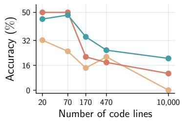
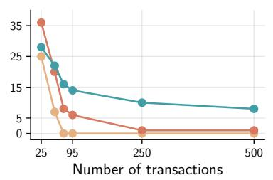
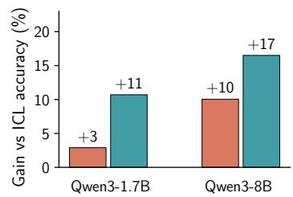

[← 返回 README](../README.md)

# 1 Introduction

> 💡 **📌 本章预览**: 从LLM长上下文"能吃进去但消化不了"的困境出发，设计两个sandbox任务诊断出score dilution现象，形式化证明thinking tokens无法可靠检索长上下文中的信号，引出query-only TTT的核心思路和四大贡献。

Many ambitious LLM use-cases are rooted in long context: analyzing scientific corpora (Katz et al., 2023; Taylor et al., 2022), synthesizing books (Kryscinski et al., 2022), maintaining rich multi-turn histories (Park et al., 2023; Zhou et al., 2024), and reasoning over large multi-file code repositories (Jimenez et al., 2024; Zhang et al., 2023). Recent progress in pre-training and architectural strategies have enabled context windows with millions of tokens (Yang et al., 2025; Ding et al., 2024; Reid et al., 2024; Anthropic, 2024). In practice, however, persistent failure modes remain: models miss clauses buried in lengthy documents, overlook function definitions deep in repositories, or fail to retrieve facts from prior turns even when the relevant content is present "in context" (Liu et al., 2024; Hsieh et al., 2024; Kamradt, 2024).

> 💡 **问题动机**: 作者先立靶子——虽然在长上下文benchmark上刷分很高，但实际应用中，"in context"的内容模型根本注意不到。"Lost in the middle"现象早已被发现，但这篇文章要追问的是：**为什么**会丢失，以及**什么样的推理时间计算才能真的解决**。

Concurrently, there is a growing interest in using inference-time compute to overcome limitations of vanilla transformer models. Methods such as chain-of-thought "thinking" tokens (Wei et al., 2022b), best-of-n (Nakano et al., 2021; Stiennon et al., 2020), and other "thinking" strategies (Zelikman et al., 2024) have shown promise. However, all these methods generate additional tokens with the same static attention mechanism that is already under-allocating mass to the evidence.

> 💡 **机制拆解（核心洞察）**: 这是全文最关键的一笔——所有inference-time scaling策略（CoT、best-of-n、self-consistency等）本质上都是在**同一个已经失效的静态注意力机制上**生成更多token。如果模型本来就无法注意到needle，那么生成再多thinking tokens也无法恢复那个信号。

We design two realistic sandbox tasks to perform controlled experiments and diagnose long-context failure modes. We identify that standard "in-context only" settings fail with growing context length (Figure 1). We formalize this as a limitation of static, finite-precision self-attention, and term it score dilution: In presence of "distractor" tokens, logit on a "target" is insufficiently separated from the distractor logits, weakening the target probability mass. We establish that as context length T grows, the target-distractor logit margin must scale as Omega(log T) to avoid vanishing target probability. We extend this analysis to show that vanilla compute-scaling strategies, such as "thinking" tokens, cannot retrieve the signal from buried target tokens.

> 💡 **公式批读（Score Dilution）**: Score dilution的直觉：softmax分母是所有token的exp(logit)之和，如果有m个distractor的logit与target在O(1)差距内，那么target的注意力质量会随着T增长而趋近于0。Lemma 2.2给出上界 alpha_target <= 1/(1+m*exp(-Delta))。如果m是T的常数比例，则alpha趋近于0。Corollary 2.3进一步量化：要保证target获得(1-epsilon)的注意力质量，需要的margin至少是Omega(log T)。

*With Thinking / With Query-only Test-Time Training (qTTT) / In-Context Only / (a) Bug tracing in code repository*

*(b) Bug tracing in transaction logs*

*(c) LongBench-v2 + ZeroScrolls*

*Figure 1 Query-only test-time training uses inference-time compute more effectively than "thinking" tokens for long contexts. (a, b) We construct two tasks to perform controlled long-context analysis: (a) bug localization in large code repositories, and (b) anomaly detection in transaction logs. As context length T grows, in-context accuracy drops and thinking tokens show diminishing returns; with the same FLOP budget, qTTT consistently improves performance. (c) qTTT shows improvements across domains and model sizes on LongBench-v2 and ZeroScrolls benchmarks.*

> 💡 **Figure 1 批读**: 三幅子图共同支撑核心论据：(a,b) 展示两个sandbox任务上，in-context accuracy随上下文长度单调下降，thinking tokens在短上下文有帮助但迅速饱和，而qTTT在全长度范围内持续提升；(c) 展示真实benchmark上的跨领域、跨模型规模的普遍提升。注意(a,b)中thinking tokens在长上下文时几乎退化为in-context水平，直观验证了"同样的静态注意力机制重复劳动是无效的"。

Hence, a natural question arises: How can we best use inference-time compute to improve long-context retrieval and reasoning? We revisit test-time training (TTT) (Liu et al., 2021; Hardt and Sun, 2024; Akyurek et al., 2024) as a way to adapt the model to a given long-context input rather than produce more text from an unchanged model. Our key idea, query-only TTT (qTTT), is a computationally frugal approach: Perform a single prefill to cache keys and values, followed by a few lightweight gradient updates exclusively on the query projection matrices in the attention layers, keeping all other parameters fixed and reusing the key-value cache (Figure 2). We show theoretically that this targeted adaptation directly increases the separation between target and distractor logits for the specific context at hand, counteracting the limitations of vanilla in-context learning.

> 💡 **机制拆解（为何只更新Q）**: 这是整个方法的精髓：(1)一次prefill生成整个上下文的K/V cache；(2)后续只在短span上计算loss，梯度只流向{Q}矩阵；(3)更新Q后，重新attend到已经缓存的K/V时，attention distribution改变了，但K/V本身未变。因此不需要重复完整前向传播，保持了计算效率。而只更新Q的理论依据是Proposition 3.1——梯度方向恰好是从当前attention-weighted mean指向target key，直接抬升margin。

We perform evaluations on 15+ real-world datasets from popular long-context benchmarks, ZeroScrolls (Shaham et al., 2023) and LongBench-v2 (Bai et al., 2023b), with Qwen3 models spanning 1.7B-8B parameters. We observe consistently large performance gains across model sizes and datasets. Under FLOP-matched inference-time compute budgets, qTTT consistently surpasses standard inference-time thinking strategies (Figure 1c) with more than 20% improvements on code comprehension, multi-document QA, and other multi-hop reasoning tasks. Our results call for reallocating inference-time budget from thousands of "thinking" tokens to a small number of query updates for long-context retrieval and reasoning without altering pre-training, architecture, or data.

## Contributions.

- We construct sandbox tasks to demonstrate long-context failure modes (2.1). We formalize score dilution in static, finite-precision self-attention and prove a logarithmic margin requirement: the target-distractor logit gap must scale as Omega(log T) to avoid vanishing target probability (2.3).

- We show theoretically and empirically that current inference-time compute scaling strategies primarily scale decoding and cannot reliably meet the margin requirement; in particular, they cannot amplify the signal from buried targets beyond an epsilon-fraction (2).

- We introduce query-only TTT (qTTT): a compute-frugal TTT procedure that performs one prefill to cache K/V, then applies a few gradient updates only to query projections while reusing the KV cache, directly increasing target-distractor separation (3).

- On 15+ real-world datasets from ZeroScrolls and LongBench-v2, using Qwen3 models (1.7B-8B), query-only TTT consistently improves long-context performance and under FLOP-matched budgets, outperforms intermediate thinking-token baselines (Figure 1c; 4).

Since qTTT takes place at inference-time, it can easily be applied on top of other existing strategies for long-context modeling: architectural changes such as sliding window attention (Dai et al., 2019; Beltagy et al., 2020), adaptive positional encoding (Press et al., 2022; Su et al., 2024), training tweaks for longer windows (Chen et al., 2023; Peng et al., 2024), or retrieval augmented generation (Borgeaud et al., 2022; Izacard et al., 2022).

> 💡 **贡献总结**: 四个贡献构成一条完整的叙事链条：诊断(sandbox+score dilution理论) -> 分析(thinking tokens无法满足margin需求) -> 方法(qTTT直接抬升margin) -> 验证(15+ datasets普遍提升)。最后的兼容性声明很重要——qTTT是一个orthogonal的inference-time技术，可以与任何已有的长上下文方案叠加使用。

> 💡 **🔖 Introduction小结**: Introduction的核心叙事线——(1)LLM长上下文有"看得见但摸不着"的失败模式；(2)当前的inference-time scaling策略（thinking tokens等）只是在同一个失效机制上叠加更多token；(3)作者通过sandbox实验诊断出score dilution是根因；(4)证明了要保证检索成功，target-distractor的logit差距必须随T对数增长，静态注意力和thinking tokens都无法满足；(5)QTTT通过改变query而非生成更多token，直接增加margin；(6)在真实benchmark上取得跨模型、跨任务的稳定提升。

---
