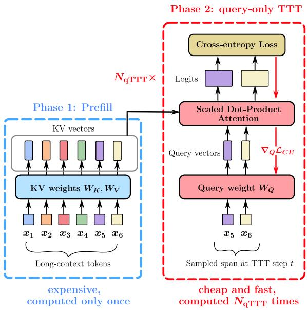
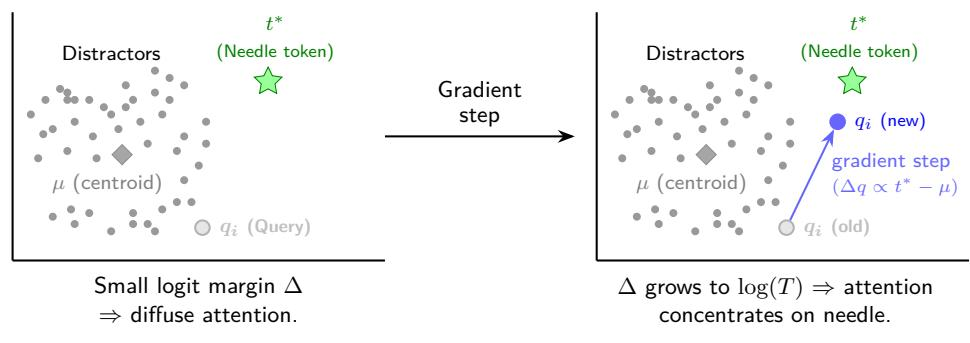

[← 返回 README](../README.md)

# 3 Efficient Test-Time Adaptation via Query-Only Updates

> 💡 **📌 本章预览**: 从理论分析过渡到方法设计，先指出naive TTT在长上下文下计算不可行，再引入query-only TTT（一次prefill缓存K/V，梯度只更新Q），证明query的梯度方向恰好从attention-weighted mean指向target key，从而单调提升margin。最后给出FLOP等价公式：T_think ≈ 2 * N_qTTT * k。

Having established that existing inference-time scaling strategies on vanilla transformer models fail for long contexts, we now investigate an alternate strategy of allocating inference-time compute via test-time training (TTT). First, we establish why a standard TTT approach, involving several forward and backward passes over the model, is computationally infeasible for long contexts. We introduce query-only TTT (qTTT) that captures the benefits of TTT while minimizing the computational overhead by re-using the KV cache and only changing the query projections. We present theoretical (3.2) and empirical (4) evidence for the efficacy of qTTT over vanilla ICL and thinking tokens.

**Naive Test-Time Training is Infeasible for Long Contexts.** A natural first-step is full-parameter TTT: update FFN and all attention projections (W_Q, W_K, W_V) on the long input x_{1:T}. We find that this is impractical for long-context regimes: every update alters keys/values across the sequence, invalidating the KV cache and forcing fresh forward-backward passes over the entire context at each step, with prohibitive compute and activation memory.

Compute-wise, our FLOP calculations (Appendix C) shows that even one such full-parameter TTT step over a T-token context is equivalent to generating about 1.2 x T decoding tokens. That is, for a context of about T ~ 10^5 tokens, this makes a single training step FLOP equivalent to generating ~120K decoding tokens -- rendering full-parameter TTT untenable.

> 💡 **机制拆解（为什么naive TTT不可行）**: 关键点在于KV cache的失效机制——任何修改K/V投影矩阵的操作都会改变所有token的key/value表示，导致缓存的{K,V}不再有效。完整重算T个token的前向和反向传播，其FLOPs约等于生成1.2*T个新token，对T=10^5就是约12万token的生成成本。这比生成thinking tokens还要贵得多。

```
Algorithm 1 Query-Only Test-Time Training for Long Context
1: Input: model f_theta, long context x_{1:T}, number of steps N_TTT, span length k, step size eta
2: {K^(l), V^(l)}_{l=1}^{L} = ForwardPassAndCache(f_theta, x_{1:T})  // Single O(T^2) operation
3: for n = 1 to N_TTT do
4:     Sample a random span x_s = x_{t:t+k} from x_{1:T}
5:     Compute L_TTT(theta; x_s) using the frozen {K^(l), V^(l)}
6:     Update only the query parameters: {W_Q^(l)} = {W_Q^(l)} - eta * grad_{{W_Q^(l)}} L_TTT
7: end for
8: return adapted model f_{theta'} to generate the final answer
```

These constraints motivate a cache-preserving alternative. Our approach, query-only TTT (qTTT), performs a single prefill to cache {K, V} and then adapts only the query projections on short spans, keeping the attention evidence pathway fixed while reshaping access to it. This retains the benefits of TTT without repeated full-context passes; we describe and formalize this procedure next.

## 3.1 Query-Only TTT for Long Context

The core idea of query-only TTT is to avoid repeated, costly forward and backward passes over the long context. Instead, we perform a single expensive prefill to cache the context's key and value representations and then execute a series of much cheaper, targeted gradient updates. The procedure, also outlined in Algorithm 1 and Figure 2, is as follows:

1. **Single-Pass KV Cache Generation.** Given a long context x_{1:T}, we perform exactly one full forward pass with the pre-trained model f_theta. During this pass, for each layer l in the model, we compute and store the Key and Value projection tensors, K^(l) in R^{T x d_k} and V^(l) in R^{T x d_v}. These cached tensors represent the complete contextual information and remain frozen for the duration of the adaptation process.


*Figure 2 Overview of query-only TTT.*

> 💡 **Figure 2 批读**: 图示清晰展示了qTTT的三阶段流程：(1) Prefill阶段：完整上下文通过模型，生成并缓存每层的K和V矩阵；(2) TTT阶段：在缓存的K/V基础上，随机采样短span，只计算Q的梯度并更新W_Q；(3) Decode阶段：用更新后的W_Q+冻结的K/V生成最终答案。关键信息是，第2和第3步都不需要重新计算K/V，只有Q的投影改变，所以计算量仅与短span长度k成正比。

2. **Span-Sampled, Query-Only Objective.** With the KV cache held constant, we perform N_TTT steps of gradient descent. In each step, we update only the query projection matrices {W_Q^(l)}_{l=1}^{L}. The objective is the standard next-token prediction loss, computed over a small, randomly sampled contiguous span of tokens x_s = x_{t:t+k}, where the span length k << T:

```
L_TTT(theta; x_s) = - sum_{i=t}^{t+k-1} log p_theta(x_{i+1} | x_{1:i}; {K^(l), V^(l)}_{l=1}^{L})  (3.1)
```

Crucially, the gradients grad_theta L_TTT are computed and applied only with respect to the parameters {W_Q^(l)}, leaving all other model weights, including the now-static KV cache, unchanged.

> 💡 **机制拆解（损失函数设计）**: 使用next-token prediction loss（标准的自回归语言模型损失）而非任何特殊设计的损失。这很巧妙——因为不需要任何fine-tuning数据或标签，只需用上下文自身作为训练信号。随机采样短span保证了计算效率（k << T），而多个span的覆盖增加了适应性的泛化程度。

## 3.2 Why Query-Only Test-Time Training is Effective

Section 2 showed that long-context failures arise from score dilution and the resulting need for a growing target-distractor margin. Query-only TTT targets this bottleneck directly: only adapt the query projections while holding keys/values fixed (from a single prefill). This leaves the evidence (K,V) unchanged and instead reshapes query to it by modifying the similarity q_i^T k_j for a given input (Proposition 3.1; Figure 3).


*Figure 3 A visual representation of Proposition 3.1 showing how qTTT improves the logit margin. The gradient updates via qTTT directly move the query projection weights towards the target needles and counteracts score dilution.*

> 💡 **Figure 3 批读**: 这个可视化非常直观：在向量空间中，当前query与注意力加权平均mu_i和target key k_{j*}的关系。梯度方向是(mu_i - k_{j*})/sqrt(d_k)，所以一步梯度下降将query从mu_i方向拉向k_{j*}方向，直接增大target-distractor的logit差距。

**Proposition 3.1 (Query update).** For loss l_i = -log alpha_{i,j*} with fixed K, the gradient w.r.t. q_i is

```
grad_{q_i} l_i = (1 / sqrt(d_k)) * (sum_{l=1}^{T} alpha_{i,l} k_l - k_{j*}) = (1 / sqrt(d_k)) * (mu_i - k_{j*}).
```

A descent step q_i <- q_i - eta * grad_{q_i} l_i moves q_i toward k_{j*} and away from the attention-weighted mean mu_i, explicitly counteracting dilution. (The statement holds per head and aggregates across heads.)

> 💡 **公式批读（Proposition 3.1）**: 这个梯度公式揭示了qTTT为什么有效——它不是一个"黑盒"优化，而是有着明确几何意义的方向。梯度恰好是(mu_i - k_{j*})，即当前query看到的"平均信息方向"与"目标信息方向"之差。梯度下降让query远离所有token的加权平均（稀释的信息），靠近目标key（信号），从而直接对立于score dilution的机制。

**Lemma 3.2 (Margin improvement).** Let M_i(q_i) := -l_i(q_i) denote the logit margin. For sufficiently small eta > 0,

```
M_i(q_i - eta * grad_{q_i} l_i) = M_i(q_i) + eta * ||grad_{q_i} l_i||_2^2 + O(eta^2).
```

Hence the margin strictly increases whenever grad_{q_i} l_i != 0, with the gain proportional to ||k_{j*} - mu_i||_2^2. Improvements are therefore largest precisely when attention is most diffuse, i.e., in the long-context regimes where score dilution is severe.

> 💡 **公式批读（Lemma 3.2）**: 最有洞察力的部分是"gain proportional to ||k_{j*} - mu_i||_2^2"——当attention最分散时（mu_i均匀混合了所有token的信息，与k_{j*}的差距最大），qTTT的margin提升最大。这意味着qTTT在它最需要的场景下（长上下文、注意力分散）效果最强，形成了一个优雅的"自调节"特性。

> 💡 **Q&A 批注记录**: Q: Lemma 3.2假设了已知target key k_{j*}，但在实际中我们并不知道哪个是needle，那梯度方向是怎么确定的？A: 实际实现中，损失函数是span上的next-token prediction loss（式3.1），而不是直接用-log alpha_{i,j*}。LLM在span上的正确预测隐式地编码了"哪些token是相关的"——模型通过降低正确token的损失，自然地增强了对相关上下文的注意力。这不是显式的"找到needle并增强"，而是通过语言建模目标隐式地对整个上下文的注意力分配进行微调。

**Takeaway:** Query-only TTT reallocates inference-time compute into margin-raising updates: with fixed {K, V} from a single prefill, each step moves q_i toward k_{j*} and provably increases the target-distractor logit margin. It thus directly mitigates score dilution, most when attention is most diffuse, without re-encoding the context or growing the KV cache.

## 3.3 FLOP Equivalence: Thinking Tokens vs. Query-Only TTT

We compare two ways to spend inference-time compute after a single prefill: (i) generate T_think thinking tokens with frozen weights, or (ii) run N_qTTT query-only updates on spans of length k << T while reusing the KV cache. For long T, FLOP equivalence (Appendix C) yields the rule of thumb

```
T_think ≈ 2 * N_qTTT * k      (log T, span k << T).    (3.2)
```

> 💡 **公式批读（FLOP等价）**: 这个简洁的公式是实验公平比较的基石。直观理解：一个thinking token的生成大致相当于对T个key做一次QK注意力计算（O(T)），而一个qTTT step需要对k个token计算前向和反向梯度（O(2k)），同时两个操作都共享prefill。所以T_think个token ≈ 2 * N_qTTT * k个qTTT token更新。

Consider a dense model of about 8B parameters on a long context T = 10^5 and an inference-time budget to decode 8K thinking tokens after the prefill. From equation (3.2), the FLOPs equate to about N_qTTT = 16 query-only TTT steps on spans of k = 128, and N_qTTT = 8 for k = 512. In both cases, thinking tokens grow the KV cache by thousands of positions without changing attention, whereas query-only TTT keeps the cache length fixed at T and uses the matched FLOPs to reshape queries against the existing keys/values, directly targeting the margin bottleneck from 2.

> 💡 **消融解读（资源分配对比）**: 这段对比直指核心：同样的FLOP预算下，(1)生成thinking tokens——增加KV cache长度但不改变注意力机制；(2)qTTT——保持KV cache不变但重塑query对K/V的访问方式。理论分析已经证明前者无法突破score dilution，后者直接增加margin。所以这不是性能差异，而是根本机制上的优劣。

> 💡 **🔖 Section 3小结**: 方法设计的三个关键层次——(1)计算可行性：naive TTT不可行因为会反复作废KV cache，qTTT通过只更新Q保留了缓存；(2)理论有效性：Q的梯度方向恰好从mu_i指向k_{j*}，梯度下降严格提升margin，且增益在注意力最分散时最大；(3)实用等价性：T_think ≈ 2 * N_qTTT * k提供了FLOP匹配的简单规则。这三层支撑了"用query更新替代thinking tokens"的核心论点。

---
