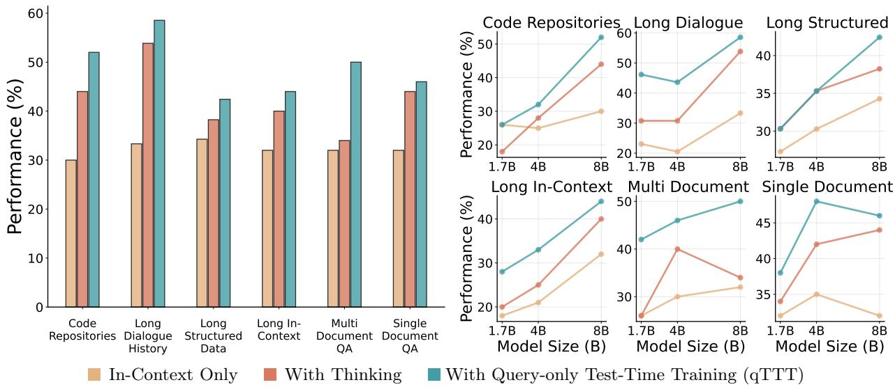
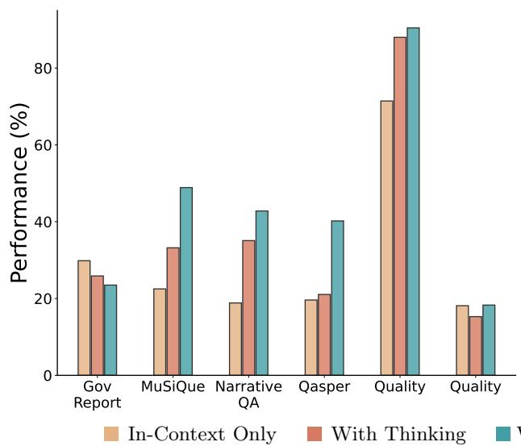
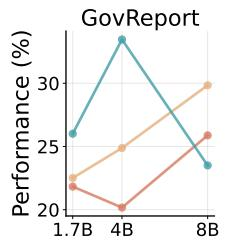
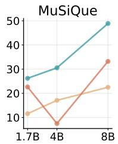
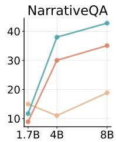
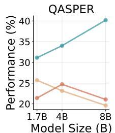
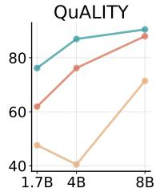
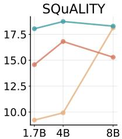
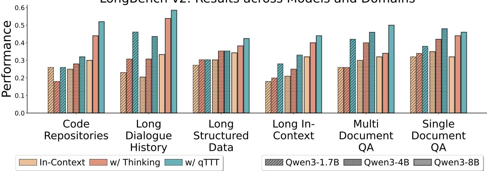
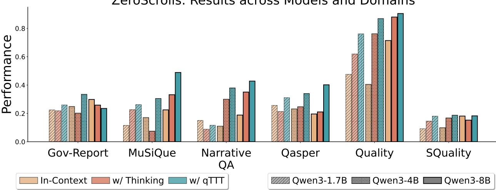

[← 返回 README](../README.md)

# 4 Experimental Results

> 💡 **📌 本章预览**: 在LongBench-v2和ZeroScrolls两个主流长上下文benchmark上（共15+数据集），用Qwen3系列（1.7B/4B/8B）评估qTTT vs In-context vs FLOP-matched Thinking，辅以Best-of-N、Beam Search等额外baseline和wall-clock latency分析。核心结论：检索密集型任务收益最大，验证了score dilution诊断。

In this section, we discuss experimental results across a suite of long-context tasks. Firstly, we callback the synthetic long-context setup from 2.1. Figure 1 shows that spending inference-time compute via query-only TTT results in significant performance improvements on top of just in-context decoding. We observe that the improvements are consistent across context lengths unlike thinking tokens that show rapid diminishing returns. In the rest of this section, we discuss our findings on long-context benchmarks that involve nuanced n-hop retrieval, reasoning, and comprehension.

Further, we empirically verify that these improvements with qTTT are indeed a result of margin improvement and reducing score dilution. Appendix E (Table 2) shows an analysis of attention mass on the target tokens with and without qTTT. Particularly, we aggregate the attention scores for the target tokens (well defined for these synthetic tasks) across model layers to study the influence of qTTT against vanilla attention. We observe that as number of input tokens increases (hence the number of distractors), the performance as well as attention mass for vanilla attention goes down drastically. However, qTTT helps preserve attention mass significantly across context lengths.

> 💡 **消融解读**: Appendix E的attention mass分析直接验证了理论：随着T增长，vanilla attention在target上的质量急剧下降（从~0.46降到~0.04），而qTTT保持了相对稳定的注意力质量（从~0.42降到~0.25）。这直接对应Lemma 3.2的结论——qTTT在注意力最分散时长处gain最大。

**Setup and Evaluation Protocol.** We evaluate query-only TTT (qTTT) on long-context tasks against two baselines: (i) In-context -- standard decoding with no intermediate tokens; and (ii) Thinking -- a chain-of-thought variant whose extra tokens are compute-matched to qTTT via the FLOP equivalence in 3.3. Our experiments are performed over Qwen3 models across 1.7B, 4B, and 8B parameters, and cover all subsets of LongBench-v2 (Bai et al., 2023b) (six categories) and ZeroScrolls (Shaham et al., 2023) (eight datasets). Unless stated otherwise, we use T_think = 8192, k = 128, N_qTTT = 32, and a common budget of 512 tokens to generate the final answer.

> 💡 **实验设置批注**: 验证 2 * N_qTTT * k = 2 * 32 * 128 = 8192 = T_think，FLOP严格匹配。这是一个严格的公平比较基准——不是简单地给qTTT更多计算资源，而是在相同的计算预算下重新分配。

### LongBench-v2

LongBench-v2 (Bai et al., 2023b) evaluates long-context reasoning across diverse context types. The benchmark probes whether models can locate and use dispersed evidence to answer multiple-choice questions across a variety of context types: given multi-file project trees in the Code Repositories setting, to resolve arguments of a particular function; and given the context as a set of related documents in the Multi-Document QA setting, synthesize spans across sources to answer a question. This allows us to assess the applicability of qTTT across forms of input contexts.

*(a) Comparison on LongBench-v2 subsets for Qwen3-8B. Using qTTT consistently outperforms standard in-context and FLOP-matched thinking settings.*

*(b) Variation of performance across model size on LongBench-v2 subsets. qTTT improves performance consistently across model sizes.*

*Figure 4 LongBench-v2 (Bai et al., 2023b) provides a testbed to evaluate long-context abilities across a diverse set of context types. Here, we report evaluations across all six subsets of the benchmark for Qwen3-{1.7/4/8B} models. qTTT shows consistent improvements over both standard in-context learning and FLOP-matched thinking tokens across the different context types.*

> 💡 **Figure 4 批读**: (a) 展示了Qwen3-8B上六个子集的对比。注意Code Repositories上thinking已经比in-context提升了(30->44)，而qTTT进一步提到52，说明qTTT和thinking解决的是不同层面的问题——thinking通过多步推理帮助定位，qTTT通过改善注意力让基础信号更清晰。(b) 展示了不同模型规模的趋势：qTTT在所有大小上都有提升，且对更大的模型提升更明显。

Figure 4 shows that, under compute-matched budgets, qTTT delivers consistent and often substantial gains across model sizes. On Long Dialogue History and Multi-Document QA, where evidence is most diffuse, qTTT outperforms standard in-context and thinking by wide margins (e.g., for Qwen3-4B: 30.8 -> 43.6 on Long Dialogue History; 40.0 -> 46.0 on Multi-Document QA). In Code Repositories, qTTT scales especially well with model size (for Qwen3-8B: 30.0 -> 44.0 -> 52.0). Overall, the LongBench-v2 results indicate that qTTT fares well across markedly different context types.

> 💡 **消融解读**: "evidence is most diffuse"时qTTT提升最大——这完全符合理论预期。Long Dialogue History中关键信息分布在漫长的对话轮次中，Multi-Document QA中答案需要跨多文档综合，这些正是score dilution最严重的场景。qTTT通过梯度抬升margin，让模型在这些"信号分散"的场景下获得了显著的检索能力提升。

### ZeroScrolls

ZeroScrolls (Shaham et al., 2023) evaluates long-context reasoning across diverse tasks. We group the datasets into three categories: (i) Multi-hop reasoning (MuSiQue, QASPER, NarrativeQA), which require locating and composing evidence spread across long documents; (ii) Long-form summarization (GovReport, QMSum, SQuALITY), which emphasize distilling lengthy inputs; and (iii) Long-passage comprehension (QAuLITY), which measures multiple-choice accuracy over extended contexts. In contrast to LongBench-v2, this suite of tests evaluates the ability to utilize some long context to solve a variety of different tasks.

*With Query-only Test-Time Training (qTTT)*

*(b) Variation of performance across model size on ZeroScrolls subsets. qTTT improves performance consistently across sizes, often greater for larger models.*

*Figure 5 ZeroScrolls (Shaham et al., 2023) evaluates a diverse set of tasks and model abilities over long context inputs. We report evaluations across six subsets for Qwen3-{1.7/4/8B} models. qTTT shows consistent improvements over both standard in-context learning and FLOP-matched thinking tokens, especially for retrieval-based multi-hop reasoning and long form comprehension tasks.*

> 💡 **Figure 5 批读**: ZeroScrolls上的结果展示了任务类型的明显差异。在多跳推理（MuSiQue, NarrativeQA, QASPER）和长文本理解（QAuLITY）上，qTTT大幅领先；但在摘要类任务（QMSum, SummScreen-FD）上差异很小。注意MuSiQue上thinking竟然比in-context更差（17.1 -> 7.5 for Qwen3-4B），这强烈暗示thinking tokens在长上下文的多跳推理中可能引入误导信息。而qTTT将其提升到30.5，几乎翻倍。

Figure 9 shows that qTTT consistently outperforms vanilla thinking on multi-hop QA and comprehension tasks, with gains that strengthen with model size. On summarization-style datasets, improvements are smaller and comparable to thinking, suggesting that when generation quality, not retrieval, is the primary bottleneck, reweighting attention yields limited returns. Overall, we see significant performance gains across datasets and model scales.

> 💡 **消融解读（摘要任务为什么提升小）**: 这是一个重要的局限性——qTTT解决的是"注意不到"的问题，不是"生不成好答案"的问题。对于摘要任务，模型可能已经能够找到相关段落（检索不是瓶颈），但生成高质量摘要需要的是语言表达能力（解码质量），这是qTTT不改变的（因为不更新FFN和输出层）。这直接指向了qTTT的适用范围边界。

The full set of results on LongBench-v2 and ZeroScrolls are elaborated in Appendix F. Moreover, we include additional test-time compute baselines such as best-of-N and beam search in Appendix G. We also perform a comprehensive latency and wall-clock time comparison of qTTT with other approaches in Appendix H.

**Takeaways:** (i) We see consistent gains in performance across benchmarks and model sizes, qTTT yields the best average performance under matched FLOPs (Figure 8, Figure 9). (ii) Retrieval-driven tasks benefit the most, validating the score dilution diagnosis and the margin increase with qTTT (2, 3.2). (iii) Thinking tokens are not a reliable substitute: they sometimes help but can also trail In-context, especially in very long contexts. (iv) qTTT is a more effective use of inference-time compute; without changing architecture, data, or pre-training.

> 💡 **Q&A 批注记录**: Q: Thinking tokens为什么有时比in-context还差？A: 以MuSiQue为例（Qwen3-4B: 17.1 vs 7.5），可能的原因是：thinking tokens在生成长链推理时，每一步都在"注意力已经稀释"的条件下做决策，容易在错误的证据上做出推理，进而累积错误。CoT的错误传播在长上下文下更严重，因为初始步骤就可能在distractor信息上"走偏"。

## Appendix Highlights

### Appendix E: Score Dilution Evidence on Long Contexts

**Motivation.** Long-context failures could be a result of a multitude of reasons and design choices. Past literature in long-context modeling has primarily focused on tuning positional encoding to improve long-context abilities. Here we present some evidence supporting our claim that score dilution is one of the primary reasons for long-context failure. We show that as the context grows, attention mass on the target collapses, and accuracy falls even when rotary position embeddings (RoPE) are present and the model is not changed otherwise. We further show that qTTT counteracts this collapse suggesting that our approach actually counteracts score dilution in practice.

**Experimental setting (RoPE ablation).** We evaluate Qwen3-4B on two tasks (Bank Transactions; OLMo Code Bugs) under three test-time regimes: (1) Thinking-only with a fixed thinking budget (4k or 8k tokens), (2) qTTT (ours) with a brief query-only adaptation while reusing the prefetched KV cache, and (3) a No-RoPE ablation where we disable rotary phase application to Q/K at inference (identity rotation), keeping all weights, prompts, and budgets unchanged and without any additional fine-tuning. This isolates the role of positional encoding while holding training and data fixed.

**Attention-mass metric.** For each decode step t, layer l, and head h, let A_{t,tau}^{(l,h)} denote the softmax attention from the current query to context position tau. Given a labeled set of target indices T, we define the attention mass at step t as sum_{tau in T} A_{t,tau}^{(l,h)}, then average over all layers and heads; for multi-token answers we average over their output steps. We report mean +/- std across multiple runs.

**Findings.** Tables 2 and 3 show that thinking-only accuracy and attention mass both decay sharply with context length. Disabling RoPE accelerates this collapse (lower mass and accuracy), but even with RoPE the decline is substantial. In contrast, qTTT sustains markedly higher attention mass as context grows and correspondingly improves accuracy. These results support the view that score dilution, rather than training-data scarcity alone, is the dominant failure mode in these settings.

> 💡 **消融解读（RoPE ablation的核心意义）**: 这个ablation直接回应了一个可能的反对意见——"长上下文失败是因为positional encoding训练不足"。通过比较RoPE和No-RoPE：(1)两者都随T增长而退化——证明问题在attention机制本身，而非位置编码；(2)没有RoPE退化更严重——说明位置编码确实有帮助，但不解决根本问题；(3)qTTT在两个设置下都大幅改善——证明qTTT解决的是比位置编码更根本的问题。

### Appendix F: Full Results Tables

*Figure 8 FLOP-matched comparison on LongBench-v2 (Bai et al., 2023b) across six domains for Qwen3-1.7B/4B/8B under vanilla in-context only, with thinking (CoT), and with test-time training (TTT). TTT consistently yields the best accuracy across domains and model sizes, with the largest gains on long-dialogue and document-QA tasks, and benefits growing with model size.*

> 💡 **Figure 8 批读**: 热力图直观展示了三个发现：(1)qTTT在所有领域、所有模型大小上都优于in-context和thinking；(2)提升幅度随模型增大而增大（1.7B: avg +9.7pp, 4B: +12.6pp, 8B: +16.5pp vs in-context）；(3)最大的提升出现在Long Dialogue History和Multi-Document QA，这些正是信号最分散的领域。

**Table 4 Full LongBench-v2 results for Qwen3-1.7B/4B/8B under In-context, Thinking, and qTTT:**

| Subset | 1.7B In | 1.7B Think | 1.7B qTTT | 4B In | 4B Think | 4B qTTT | 8B In | 8B Think | 8B qTTT |
|--------|---------|------------|-----------|-------|----------|---------|-------|----------|---------|
| Code Repositories | 26.0 | 18.0 | 26.0 | 25.0 | 28.0 | 32.0 | 30.0 | 44.0 | **52.0** |
| Long Dialogue History | 23.1 | 30.8 | 46.2 | 20.5 | 30.8 | 43.6 | 33.3 | 53.8 | **58.5** |
| Long Structured Data | 27.3 | 30.3 | 30.3 | 30.3 | 35.3 | 35.3 | 34.3 | 38.2 | **42.4** |
| Long In-Context | 18.0 | 20.0 | 28.0 | 21.0 | 25.0 | 33.0 | 32.0 | 40.0 | **44.0** |
| Multi-Document QA | 26.0 | 26.0 | 42.0 | 30.0 | 40.0 | 46.0 | 32.0 | 34.0 | **50.0** |
| Single-Document QA | 32.0 | 34.0 | 38.0 | 35.0 | 42.0 | 48.0 | 32.0 | 44.0 | **46.0** |
| **Average** | 25.4 | 26.5 | **35.1** | 27.0 | 33.5 | **39.6** | 32.3 | 42.3 | **48.8** |

> 💡 **表格批读**: 几个值得关注的细节——(1)Code Repositories上1.7B的thinking(18.0)比in-context(26.0)还差，说明小模型在长代码上下文中做CoT反而有害；(2)Multi-Document QA上thinking对1.7B完全没有提升(26->26)，但qTTT直接拉到42（+16pp）；(3)8B模型上，qTTT的平均分(48.8)比in-context(32.3)高16.5pp，这个gap比1.7B的+9.7pp和4B的+12.6pp都大。

*Figure 9 FLOP-matched comparison on the ZeroScrolls benchmark (Shaham et al., 2023) for Qwen3-1.7B/4B/8B under long contexts, with thinking (CoT), and with test-time training (TTT). TTT achieves the highest scores on nearly all datasets -- especially on the retrieval-focused tasks, with a general increase with model size.*

**Table 5 Full ZeroScrolls results across eight datasets for Qwen3-1.7B/4B/8B:**

| Dataset | 1.7B In | 1.7B Think | 1.7B qTTT | 4B In | 4B Think | 4B qTTT | 8B In | 8B Think | 8B qTTT |
|---------|---------|------------|-----------|-------|----------|---------|-------|----------|---------|
| GovReport | 22.5 | 21.8 | 26.0 | 24.9 | 20.2 | 33.5 | 22.0 | 17.8 | **29.8** |
| MuSiQue | 11.6 | 22.6 | 26.2 | 17.1 | 7.5 | 30.5 | 22.5 | 43.9 | **48.9** |
| NarrativeQA | 15.0 | 8.9 | 11.7 | 11.0 | 30.0 | 38.0 | 18.9 | 35.1 | **42.8** |
| QASPER | 25.7 | 21.4 | 31.1 | 23.2 | 24.7 | 34.0 | 19.6 | 21.1 | **26.1** |
| QMSum | 6.2 | 7.5 | 9.5 | 10.9 | 7.7 | 8.6 | 9.8 | 8.6 | 8.6 |
| QAuLITY | 47.6 | 61.9 | 76.2 | 40.5 | 76.2 | 87.0 | 71.4 | 90.5 | **94.5** |
| SQuALITY | 9.2 | 14.6 | 18.0 | 9.9 | 16.8 | 18.7 | 18.1 | 15.3 | 18.3 |
| SummScreen-FD | 8.2 | 7.2 | 7.4 | 9.9 | 8.3 | 9.9 | 10.4 | 7.9 | 7.9 |
| **Average** | 18.3 | 20.7 | **25.8** | 18.4 | 23.9 | **32.5** | 24.1 | 30.0 | **34.6** |

> 💡 **表格批读**: ZeroScrolls的结果揭示了任务类型的显著差异——(1)检索密集型（MuSiQue: +13.4pp, QAuLITY: +46.5pp for 4B）提升巨大，直接验证了score dilution理论的预测；(2)摘要类（QMSum: -2.3pp vs in-context for 4B, SummScreen-FD: 持平）收益有限，说明生成质量瓶颈不在检索；(3)MuSiQue上4B的thinking(7.5)出奇地差——比in-context(17.1)低近10pp——CoT的"garbage in, garbage out"在多跳推理中尤为致命。

### Appendix G: Additional Test-Time Scaling Baselines

**Baselines.** We compare Best-of-N (BoN) and Beam Search to our method under strict compute parity. BoN / Self-Consistency (SC-N): we run N independent decodes, each with an equal share of the extra reasoning budget, and select the final answer by majority vote (ties broken by sequence log-prob). Beam-k: we run left-to-right beam search of width k; to enforce parity with other test-time scaling, the total added "thinking" tokens across all beams is fixed.

**Design choices (strict matching).** We match all methods to a fixed extra budget corresponding to T_think = 8192 tokens beyond the vanilla decode. SC-N allocates ~8192/N tokens to each sample; Beam-k allocates ~8192/k tokens per beam. All results use the same prompt, output length (128 tokens); latencies are reported separately in H. This protocol removes budget-induced confounders and isolates the effect of test-time scaling itself.

**Conclusion.** Across both LongBench-v2 and ZeroScrolls (Qwen3-4B), qTTT is competitive with or better than strictly FLOP-matched BoN and Beam. SC-N helps when single-run accuracy is already high (e.g., Single Document QA, QAuLITY), but often degrades when the per-sample accuracy is below 50%. Beam-k provides only modest gains under equal budgets due to correlated beams and imperfect ranking, and frequently trails qTTT.

> 💡 **消融解读（Best-of-N vs Beam vs qTTT）**: SC-N的问题是：当每个sample的准确率低于50%时，多数投票反而选错。在检索困难的长上下文任务中，基础准确率往往很低（如MuSiQue只有17.1%），SC-N自然失效。Beam search的问题是beam之间高度相关（都基于同一套静态注意力），如果第一步就走错了，所有beam都会偏。qTTT的优势在于：它不是靠多次采样来碰运气，而是从根本上改善了模型对上下文的注意能力。

### Appendix H: Latency and Compute-Matched Measurements

Tables 10, 11, 12 show the results of the measurements on Qwen3-1.7B, 4B, and 8B, respectively. We find that the wall-clock time for all three test-time compute strategies -- qTTT, thinking, and best-of-N -- is quite similar. We also note that prefilling the KV cache, which is approximately equal to t_ICL, dominates most of the decoding time, especially for longer sequence lengths. This motivates the frozen K/V attention weights in our setup, without which the prefill would need to be recomputed with every training step.

> 💡 **延迟分析批注**: 在128K context下，prefill本身就占了~234s（4B模型），而qTTT额外的32步只增加了~14s。考虑到性能提升（4B模型LongBench-v2 avg从27.0到39.6），这个overhead的性价比极高。同时也说明了为什么frozen K/V是必须的——如果每次更新都需要重新prefill，128K上下文下的TTT将是完全不可行的。

**Key latency tables (Qwen3-8B, as representative):**

| Context Length | t_ICL (s) | t_qTTT (s) | t_think (s) | t_BoN (s) | N_think | N_BoN |
|---|---|---|---|---|---|---|
| 8,000 | 22.13 | 42.61 | 42.62 | 41.33 | 1,229 | 10 |
| 32,000 | 88.53 | 109.01 | 109.00 | 97.07 | 307 | 2 |
| 128,000 | 354.13 | 374.61 | 374.67 | 354.13 | 77 | 1 |

> 💡 **延迟表格批读**: 三个关键观察——(1)三者wall-clock高度接近，印证了FLOP匹配的准确性；(2)在128K时，prefill时间（354s）占总时间（375s）的94%，说明在极长上下文下，所有方法的绝对延迟主要由prefill决定；(3)N_BoN在128K时降到1，意味着budget只够跑一次，说明BoN在最长上下文下退化成了单次推断，失去了多样性投票的意义。

### Qwen3-32B Results (Appendix F)

| LongBench-v2 | In-context | Thinking | qTTT |
|---|---|---|---|
| Code Repositories | 36.0 | 61.0 | **74.0** |
| Long In-Context | 44.0 | 56.0 | **57.0** |
| Long Structured Data | 39.3 | 42.2 | **51.5** |
| Long Dialogue History | 47.1 | 77.9 | 75.5 |
| Multi Document QA | 35.0 | 41.0 | **56.0** |
| Single Document QA | 36.0 | 47.0 | **49.0** |

> 💡 **Qwen3-32B批读**: 32B模型的结果进一步验证了qTTT的scalability。Code Repositories上qTTT达到74%（vs in-context 36%，thinking 61%），提升达38pp。Long Dialogue History上这个模型thinking已经很好(77.9%)，qTTT略低(75.5%)，可能说明在thinking本身已经很有效的任务上，qTTT没有额外增益。这再次指向"何时用qTTT"的预测问题。

> 💡 **🔖 Section 4小结**: 实验部分的核心结论可以概括为：(1)qTTT在两个benchmark、四个模型规模、15+数据集上一致提升，且FLOP严格匹配；(2)最大的提升出现在检索密集型任务（多跳推理、多文档QA、长对话），直接验证了score dilution理论；(3)摘要任务提升有限，说明qTTT的边界在"生成质量瓶颈"而非"检索瓶颈"的场景；(4)额外的baseline（Best-of-N、Beam Search）进一步证实了qTTT的相对优势；(5)wall-clock延迟分析表明三者实际用时接近，prefill主导了绝大部分时间。

---
