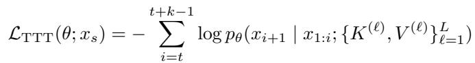
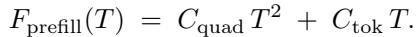

[← 返回 README](../README.md)

# 5 Prior Work & Discussion

> 💡 **📌 本章预览**: 梳理长短上下文LLM和inference-time compute scaling的相关工作，定位本文的贡献位置；总结全文核心发现并展望未来方向。附录部分涵盖实验细节、完整结果表格、合成任务示例以及proof details。

## 5 Prior Work

**Long-Context LLMs.** Context windows have expanded rapidly, with models reaching million-token scale (Reid et al., 2024), usually extending limits via RoPE scaling (Chen et al., 2023; Bai et al., 2023a). Parallel efforts reduce quadratic attention with sparse/structured patterns (Beltagy et al., 2020; Zaheer et al., 2020). Evaluation has coalesced around long-context suites such as LongBench/LongBench-v2 (Bai et al., 2023b), ZeroScrolls (Shaham et al., 2023), RULER, and domain-specific code benchmarks like SWE-bench variants (Jimenez et al., 2024). However, these LLMs still exhibit strong position sensitivity, yielding the "lost in the middle" effect (Liu et al., 2024). Needle-in-a-haystack-style tests show that a single relevant span can be overwhelmed by many distractors, and this persists across languages and document structures (Kamradt, 2024). Our work targets this retrieval failure by addressing how attention mass is allocated over very long inputs.

> 💡 **相关工作总结**: 第一段覆盖了long-context LLM的三条主要研究线：(1)扩大context window（RoPE scaling等技术），(2)降低attention复杂度（sparse/structured attention），(3)长上下文评估benchmark。作者将"lost in the middle"和Needle-in-a-Haystack失败模式归为attention mass分配问题，清晰地定位了本文解决问题的位置。

**Inference-Time Compute Scaling.** A common approach is to spend more compute at inference via chain-of-thought (Wei et al., 2022c), self-consistency (Wang et al., 2023b), best-of-n (Nakano et al., 2021), or other strategies (Zelikman et al., 2024; Zweiger et al., 2025; Kang et al., 2025). While often helpful, these methods scale decoding and can be compute-heavy with diminishing returns (Snell et al., 2024; Liu et al., 2025). Another way to spend inference-compute is via test-time training (Sun et al., 2020; Hardt and Sun, 2024; Akyurek et al., 2024). While typically done to handle distribution shifts, recent work has started focusing on long-context LLM use cases (Sun et al., 2024; Zuo et al., 2025). To our knowledge, our work is first to re-purpose TTT to micro-distribution of individual inputs via a query-only variant tailored to long-context.

> 💡 **定位贡献**: 这段prior work的核心信息是定位qTTT的独特性：
> - **vs CoT/Best-of-N等解码策略**: 这些方法在"解码"层面scale，不改变模型对上下文的注意能力。本文证明它们受限于score dilution，不能根本解决问题。
> - **vs 已有的TTT工作**: Sun et al. (2024)和Zuo et al. (2025)开始将TTT用于长上下文，但本文的qTTT是第一个：(a)只更新Q（query-only），(b)专门针对长上下文的"微分布"适应，(c)有完整的理论分析（margin提升证明）。
> - "micro-distribution of individual inputs"这个表述很关键——不是在分布偏移上做TTT（如原来的domain adaptation），而是在单条输入上做TTT。

## 6 Discussion

We identify score dilution in static quadratic attention as a core cause of long-context failures. We design synthetic tasks to study long-context behavior controllably and show that accuracy falls sharply with context length T and "thinking" tokens show diminishing returns (2). We proposed query-only TTT (qTTT) to reallocate inference-time budget via few query-only updates that provably increase the target-distractor margin (3). Under matched FLOPs, qTTT consistently outperforms in-context and thinking on LongBench-v2 and ZeroSCROLLS, with the largest gains on retrieval and multi-hop reasoning (4). In short, adapting queries is a more effective use of inference-time compute than generating more tokens for long context tasks.

> 💡 **机制拆解（核心insight再提炼）**: "adapting queries is a more effective use of inference-time compute than generating more tokens" —— 这是全文的核心信息。把推理时计算从"生成更多token（在静态注意力上叠加）"重新分配到"适应query（改变注意力分配本身）"，用更少的计算量获得更大的效果。

### Future directions

(1) We evaluate a single point on the (k, N_TTT) trade-off; exploring budget schedules across span size and steps is immediate.

(2) Our compute-matched baseline focuses on "thinking" tokens; extending to self-consistency and best-of-n within the same framework is future work.

(3) Gains are task-dependent; developing simple predictors for when to prefer qTTT (vs. decoding-based scaling) is a practical next step.

> 💡 **未来方向批注**: 三个方向的实用价值：
> - (1) 超参数探索：当前只用了(k=128, N_TTT=32)一个点，更大的k可能利用更多上下文信息但计算更贵，更多step可能进一步提升但边际递减。找到帕累托最优的schedule是有价值的工作。
> - (2) 扩展到更多baseline：self-consistency和best-of-n在附录中已经有初步比较（表明qTTT更好），但更系统的FLOP-matched框架值得探索。特别是qTTT+SC的组合可能是互补的（qTTT改善base accuracy，SC提供进一步增益）。
> - (3) "何时用"预测器：摘要任务上qTTT帮助有限，但如果能提前判断任务是否检索密集型，就可以动态决定是否启用qTTT。这可能基于输入长度、任务类型embedding等快速特征。

## Acknowledgments

This work was done when RB, RT, SSD, and DK were summer interns at Meta. RB would like to thank other interns in the legacy GenAI team for the exchange of ideas and brainstorming that shaped this project. Namely: Irene Zhang, Winnie Yang, Julian Coda-Forno, Sriyash Poddar, Arushi Rai, and others in the Research Club. We thank Sharan Narang, Prateek Yadav, and Mike Lewis for their guidance. RB would like to thank Yonatan Belinkov, Nihal Nayak, Lyndon Lam, Sunny Qin, Bingbin Liu, and other members of the ML Foundations group and the Kempner Institute at Harvard for their feedback on the manuscript.

## Appendix Highlights

### A. Synthetic Tasks

We illustrate two representative synthetic tasks used in our study.


*Figure 6 An example of the code bug localization synthetic task.*

Figure 6 shows the code bug localization task: the model receives a brief natural-language bug description together with a minimal, line-numbered code context and must return the exact file-and-line of the offending statement. In the example, the model correctly identifies the line where attention scores are computed without proper normalization (olmo/model.py:L345).

> 💡 **Figure 6 批读**: 这个例子展示了任务的格式和难度——一个"缺少softmax temperature scaling"的bug，表现为attention_weights = torch.matmul(q, k.transpose(-2, -1))之后没有除以sqrt(d_k)。目标行就是问题所在的那一行代码，而非需要多步推理定位的间接原因。模型输出olmo/model.py:L345，是一个精确的单点定位。


*Figure 7 An example of the log transactions synthetic task.*

Figure 7 shows the transaction-log consistency task: given an initial account state, a set of invariants (e.g., conservation of total funds, no negative balances), and a short sequence of transfers, the model must select a single bug type and pinpoint the first offending transaction. In the example, the model outputs NEGATIVE_BAL at TX004, where the balance of account A becomes negative, violating the stated rules.

> 💡 **Figure 7 批读**: 示例中的异常是TX004——从A=2909转出2925，B变成8216但A变成-16（违反"No account can go negative"规则）。这个例子展示了任务需要同时进行多约束检查（资金守恒、非负余额、算术正确），验证结果输出格式为{"bug_type": NEGATIVE_BAL, "bug_location": TX004}。

Together, these examples illustrate the input/output format of our synthetic tasks, the kind of structured context provided to the model, and the expected concise targets (a specific line for code or a {bug_type, TX_id} pair for logs). We use similarly formatted instances throughout our evaluation.

### B. Proofs for Section 2

Notation. For a fixed query q_i, logits are z_{i,j} = q_i^T k_j / sqrt(d_k), attention weights alpha_{i,j} = e^{z_{i,j}} / sum_{l} e^{z_{i,l}}, and o_i = sum_j alpha_{i,j} v_j. We write mu_i = sum_{l} alpha_{i,l} k_l.

**Proof of Lemma 2.2 (Score dilution).** Let S = {j != j* : z_{i,j} >= z_{i,j*} - Delta} with |S| = m. Then

```
sum_{l=1}^{T} e^{z_{i,l}} >= e^{z_{i,j*}} + sum_{j in S} e^{z_{i,j}} >= e^{z_{i,j*}} (1 + m * e^{-Delta}),
```

hence alpha_{i,j*} = e^{z_{i,j*}} / sum_{l} e^{z_{i,l}} <= 1 / (1 + m * e^{-Delta}). If m >= cT with c > 0 and Delta = O(1), then alpha_{i,j*} -> 0 as T -> infinity.

**Proof of Lemma 2.3 (Logarithmic margin requirement).** Let gamma = min_{j != j*} (z_{i,j*} - z_{i,j}). Then sum_{j != j*} e^{z_{i,j}} <= (T-1) e^{z_{i,j*} - gamma}, so

```
alpha_{i,j*} = 1 / (1 + sum_{j != j*} e^{z_{i,j} - z_{i,j*}}) >= 1 / (1 + (T-1) e^{-gamma}).
```

Rearranging 1/(1 + (T-1)e^{-gamma}) >= 1 - epsilon yields gamma >= log(((T-1)(1-epsilon)) / epsilon).

**Proof of Proposition 2.4 (Needle-signal bound).** For any thinking token t,

```
o_t = sum_{j < t} alpha_{t,j} v_j = alpha_{t,j*} v_{j*} + (1 - alpha_{t,j*}) sum_{j != j*} tilde{alpha}_{t,j} v_j,  tilde{alpha}_{t,j} = alpha_{t,j} / (1 - alpha_{t,j*}).
```

For any u in R^{d_v}, take inner products and upper bound the convex combination by its maximum term:

```
<u, o_t> <= alpha_{t,j*} <u, v_{j*}> + (1 - alpha_{t,j*}) max_{j != j*} <u, v_j>.
```

**Proof of Corollary 2.5 (Specialization under small margin).** By Definition 2.1, gamma_t <= log(epsilon/(1-epsilon)) iff alpha_{t,j*} <= epsilon. Substitute alpha_{t,j*} <= epsilon in Proposition 2.4 to obtain

```
<u, o_t> <= epsilon <u, v_{j*}> + (1 - epsilon) max_{j != j*} <u, v_j>.
```

Moreover, Lemma 2.2 implies alpha_{t,j*} <= 1/(1 + m*e^{-Delta}) when at least m distractors satisfy z_{t,j} >= z_{t,j*} - Delta, yielding the bound with epsilon = 1/(1 + m*e^{-Delta}).

### Proofs for Section 3

**Proof of Proposition 3.1 (Directional query update).** With z_{i,l} = q_i^T k_l / sqrt(d_k),

```
l_i(q_i) = -log alpha_{i,j*} = -z_{i,j*} + log sum_{l=1}^{T} e^{z_{i,l}}.
```

Differentiating w.r.t. q_i and using partial z_{i,l} / partial q_i = k_l / sqrt(d_k):

```
grad_{q_i} l_i = -k_{j*} / sqrt(d_k) + (1 / sum_{l'} e^{z_{i,l'}}) sum_{l=1}^{T} e^{z_{i,l}} k_l / sqrt(d_k)
                = (1 / sqrt(d_k)) * (sum_{l=1}^{T} alpha_{i,l} k_l - k_{j*})
                = (1 / sqrt(d_k)) * (mu_i - k_{j*}).
```

Thus a descent step moves q_i toward k_{j*} and away from mu_i.

**Proof of Lemma 3.2 (Monotone margin improvement).** Define M_i(q_i) = -l_i(q_i). Then grad M_i(q_i) = -grad l_i(q_i). For a step q_i^+ = q_i - eta * grad l_i(q_i), a first-order expansion gives

```
M_i(q_i^+) = M_i(q_i) + eta * ||grad l_i(q_i)||_2^2 + O(eta^2).
```

Using Proposition 3.1, ||grad_{q_i} l_i||_2^2 = (1/d_k) * ||k_{j*} - mu_i||_2^2, which is strictly positive unless k_{j*} = mu_i. When l_i is L-Lipschitz, choosing eta in (0, 1/L] ensures M_i(q_i^+) >= M_i(q_i) + (eta/2) * ||grad l_i(q_i)||_2^2.

**Remarks on multi-head attention.** All statements apply per head. Let superscript h index heads and define per-head logits/weights {z_{i,j}^{(h)}, alpha_{i,j}^{(h)}}. Claims on dilution and margin hold headwise; aggregation across heads is via concatenation and an output projection, which preserves the directional and margin-improvement arguments by linearity.

### C. FLOP Derivations for 3.3

We outline FLOP models for two inference-time modes and derive the equivalence summarized in Eq. (3.2). Consider a dense Transformer with L layers, hidden size d, MLP ratio r (so d_ff = r*d), and long context length T. Let T_think be the number of autoregressively generated "thinking" tokens, N_qTTT the number of query-only updates, and k the span size per update.

**Cost coefficients.** Ignoring lower-order terms (layer norms, biases), we collect the dominant costs as

```
C_quad = 2Ld  (quadratic attention term),    C_tok = (4 + 2r)L d^2  (per-token projections/MLP).
```

A parallel forward over T tokens (the prefill) costs

```
F_prefill(T) = C_quad * T^2 + C_tok * T.
```

**Case A (autoregressive "thinking").** After one prefill, generating T_think tokens with a KV cache costs

```
F_gen(T_think; T) = C_quad * (T_think * T + T_think(T_think - 1)/2) + C_tok * T_think,
```

so the total is F_A = F_prefill(T) + F_gen(T_think; T).

**Case C (query-only TTT: query-only with cached K/V).** With one prefill, each query-only pass recomputes queries for k positions that attend to cached {K, V} and backpropagates only into {W_Q}. The per-pass cost is

```
G_partial(k; T) ≈ 2 * (C_quad * k * T + (2 + 2r) L k d^2),
```

and the total is F_C = F_prefill(T) + N_qTTT * G_partial(k; T). (If the span also attends within itself, add +C_quad * k^2 and +2L k d^2 inside G_partial, which are dominated by kT when k << T.)

**Equivalence (A vs. C).** Cancelling the shared prefill and equating F_gen(T_think; T) = N_qTTT * G_partial(k; T) yields

```
C_quad * (T_think * T + T_think(T_think - 1)/2) + C_tok * T_think = 2 N_qTTT k (C_quad * T + (2 + 2r) L d^2).
```

For long contexts with T >> d and spans k << T (hence T_think << T in matched regimes), the dominant terms give

```
T_think ≈ 2 * N_qTTT * k,
```

which is Eq. (3.2). First-order corrections are O(T_think/T) from the T_think(T_think-1)/2 term and O(d/T) from C_tok.

**Sanity check (numeric instantiation).** Take L=32, d=4096, r=4 (a ~7B dense model) and T=10^5. If the application budget allows decoding T_think = 8,000 thinking tokens after prefill, the matched query-only schedules include, e.g., (N_qTTT=10, k=400) since 2*10*400 ≈ 8,000. This reallocation keeps the KV cache length fixed at T and spends the same FLOPs to reshape queries against the existing {K, V} instead of growing the cache with additional tokens.

### D. Experimental Details

**Models and tokenization.** We evaluate Qwen3-{1.7B, 4B, 8B} with their native tokenizers and maximum supported context windows. All prompts use UTF-8, and inputs are delimited with explicit section headers (e.g., [CONTEXT], [QUESTION]). Unless otherwise noted, we evaluate on the official validation/dev splits and follow each benchmark's scoring script.

**Decoding and "Thinking" budget.** We adopt model-recommended decoding parameters: Thinking: temperature=0.6, top-p=0.95, top-k=20; Non-thinking: temperature=0.7, top-p=0.8, top-k=20. We cap total generation length so that Thinking consumes exactly T_think intermediate tokens plus the final answer; for compute matching, we use T_think = 8192 unless otherwise stated. Self-consistency/best-of-n are disabled by default to keep FLOPs matched.

**Query-only TTT (qTTT) hyperparameters.** We update only W_Q in all attention layers using AdamW (weight decay 0.01) with a sweep over learning rates {3e-4, 3e-5, 1e-5, 3e-6, 1e-6, 3e-7}; we report the best per-dataset LR selected on a held-out portion of the validation set. Batch size is 1 (long contexts). We perform N_TTT span updates of length k with a single prefill/cached {K, V}; unless stated otherwise, (k, N_TTT) := (128, 32) compute-matched to Thinking via T_think ≈ 2*N_TTT*k (3.3). Spans are sampled uniformly over [1, T-k]; gradient clipping at 1.0; bf16 precision.

Additionally, we perform a sensitivity analysis of qTTT across learning rates. Table 1 shows the variation of accuracy on our synthetic tasks across context lengths. We find that qTTT is not very sensitive to the choice of LR: the performance is relatively consistent between [1e-5, 1e-6] and only falls on the extreme values of LR.

| Task / Context | 1e-4 | 3e-5 | 1e-5 | 3e-6 | 1e-6 | 3e-7 |
|---|---|---|---|---|---|---|
| **Bank Transactions** | | | | | | |
| 512 | 4.2 | 26.5 | 28.0 | 27.2 | 26.8 | 15.5 |
| 2,536 | 1.5 | 13.8 | 14.4 | 14.0 | 12.5 | 6.2 |
| 5,120 | 0.8 | 10.0 | 9.2 | 8.5 | 7.8 | 3.5 |
| 9,560 | 0.0 | 7.8 | 8.4 | 7.9 | 7.0 | 1.2 |
| **OLMo Code Bugs** | | | | | | |
| 512 | 8.5 | 42.0 | 44.5 | 45.7 | 43.2 | 22.0 |
| 2,050 | 5.1 | 38.5 | 40.2 | 41.6 | 39.5 | 18.5 |
| 7,450 | 2.2 | 25.0 | 28.0 | 27.5 | 24.8 | 10.5 |
| 10,000 | 1.0 | 18.2 | 20.2 | 19.5 | 17.8 | 5.2 |

> 💡 **Table 1 批读（LR敏感度）**: 两个任务的pattern高度一致——最佳LR在1e-5到3e-6之间。太高的LR(1e-4)导致性能崩溃（Bank Transactions 9,560长度直接从8.4降到0.0），太低的LR(3e-7)也让性能显著下降。这说明qTTT需要适量的参数更新——有变化但不过度。值得注意的是，即使在最长的上下文(10K tokens)下，最优LR也与短上下文相同，说明不需要根据长度动态调LR。

**Evaluation metrics.** We use official scripts per subset: EM/F1 or dataset-specific accuracy for QA; ROUGE-{1,2,L} or benchmark-provided summary metrics for summarization; multiple-choice accuracy for QAuLITY. When a subset defines both EM and F1, we report the primary metric specified by the benchmark.

**Prompts and templates.** Below we provide the base non-thinking and thinking templates used per task family. All runs share the same template within a family across methods; Thinking adds a scratchpad section but the final answer must appear after a Final: tag.

```
Non-thinking (base)
[SYSTEM]
You are a careful assistant. Use only the provided context.
If the answer is not supported, output "unknown".
[TASK]
{TASK_DESCRIPTION}  # e.g., short answer QA / summary / MCQ
[CONTEXT]
{CONTEXT_BLOCKS}  # e.g., {DOCUMENTS}|{DIALOGUE}|{CODE}|{TABLE}
[QUESTION or INSTRUCTION]
{QUESTION_OR_INSTRUCTION}  # prompt for the required output
[CONSTRAINTS]
[ANSWER]

Thinking (base)
[SYSTEM]
Reason privately in [SCRATCHPAD],
then provide a single final output after "Final:".
If not supported by the context, output "Final: unknown".
[TASK]
{TASK_DESCRIPTION}
[CONTEXT]
{CONTEXT_BLOCKS}
[QUESTION or INSTRUCTION]
{QUESTION_OR_INSTRUCTION}
[SCRATCHPAD]
..  # hidden chain-of-thought tokens (capped to T_think)
[FINAL]
Final:
```

**Post-processing and extraction.** For "thinking" runs, we extract the substring after Final: (trim, strip quotes). For MCQ, we regex-match [ABCD]; for extractive QA, we normalize punctuation/whitespace (SQuAD-style). For summarization, we truncate to the requested budget (e.g., 200 words) and use the benchmark scorer verbatim.

**Compute matching and seeds.** Unless otherwise specified, Thinking uses T_think = 8192 and query-only TTT uses (k, N_TTT) = (128, 32) so that T_think ≈ 2 * N_TTT * k. We fix the random seed for span sampling and decoding across methods per run; results are averaged over one run per configuration (low variance in our setting).

### Appendix G & H: Complete Baseline and Latency Tables

Appendix G presents strict FLOP-matched comparisons against Best-of-N (SC-N) and Beam Search baselines (Tables 8-9 in the paper). The key finding: qTTT is competitive with or better than both across nearly all tasks. SC-N helps only when single-run accuracy is already high; Beam-k provides modest gains due to correlated beams.

> 💡 **Appendix G批注**: SC-N (Self-Consistency with N samples) 的问题很直观：如果单次预测准确率低于50%，多数投票反而会选错。在长上下文检索任务中，基础准确率经常很低（如MuSiQue 17.1%），SC-N自然无效。而Beam Search的问题是beam之间高度相关——如果在attention层面就没找对方向，所有beam都会朝同一个错误方向走。qTTT的不同在于它直接改善了"找对方向"的能力，而非在"已经走错的方向上多试几次"。

Appendix H reports wall-clock measurements (Tables 10-12) showing that all three strategies have very similar end-to-end latency under FLOP-matched budgets, with prefill dominating at long sequence lengths.

> 💡 **🔖 Section 5小结**: 
> - Prior Work: 将本文定位在long-context LLM和inference-time compute scaling两条线的交汇处。与已有工作相比：(a)不像CoT等解码策略只在静态注意力上叠加token；(b)不像已有TTT工作做domain-level adaptation，而是首次在individual input的micro-distribution上做query-only TTT。
> - Discussion: 重申了从diagnosis到method到validation的完整叙事，并指出三个未来方向（超参数空间探索、更多baseline框架、何时用qTTT的预测器）。
> - Appendix: 提供了完整的proof chain（从score dilution到margin improvement）、详细的FLOP推导、实验配置细节、prompt模板、完整结果表格以及延迟数据，支撑了正文中的所有结论。

---
