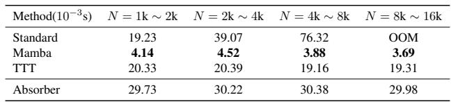
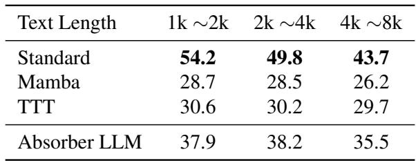
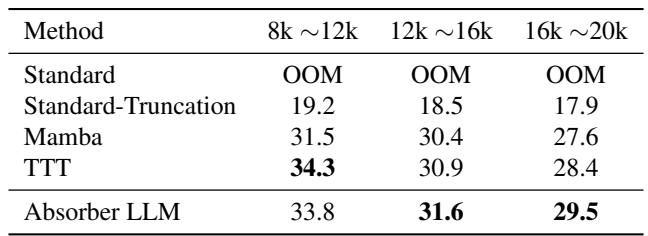
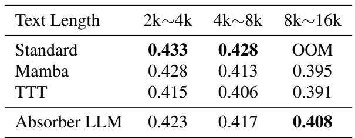
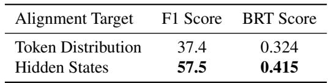
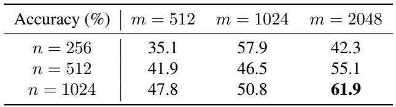
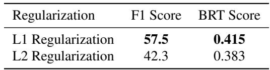

[← 返回 README](../README.md)

# 4. Experiments

## 📌 预览

实验按四条主线验证 Absorber：计算效率、many-shot ICL、multi-step reasoning、long text summary；再用 ablation 证明 hidden-state synchronization、$n/m$ 和 regularization 的必要性。

# 4.1. Set up

In this section, we evaluate the performance of Absorber LLM across four critical dimensions: computational efficiency, information retention in many-shot in-context learning, logical consistency in long-chain reasoning, and long text summarization.

> 💡 **实验设计批注**: 四个维度正好对应方法 claim：latency 验证 streaming absorption 的可扩展性，ICL/reasoning/summary 验证历史信息是否以可用形式进入参数。

Settings. Our experiments utilize the LLaMA2-7B (Touvron et al., 2023) architecture as the primary backbone. All evaluations are conducted on an NVIDIA GeForce RTX

# Algorithm 2 Absorber Deduction

#

Original pretrained LLM $f _ { W }$ ; Input texts $I$ ; absorbed token number at one time: $n$ ; synchronization token number $m$

#

Inference texts $S$

1: Initialize $t \gets 0$ , absorption window $Z \gets I$ , Inference
texts $S = \varepsilon$
2: while True do
3: if $| Z | < m + n$ then
4: for $i \gets 1$ to $m + n - | Z |$ do
5: Forward $f _ { W } ( Z )$ to generate the next token $z$
6: if $z = \mathrm { e o s } ,$ token then
7: Return $S$
8: end if
9: $Z  Z z , S  S z$
10: end for
11: end if
12: $X  Z [ : n ] , Y  Z [ n + 1 : n + m ]$
13: Absorb $X$ into $W$ to get $W ^ { * }$ by synchronizing
$f _ { W ^ { * } } ( Y )$ with $f _ { W } ( X Y )$ (Algorithm 1)
14: $Z \gets Z [ n + 1$ :]; $W  W ^ { * }$
15: end while

> 💡 **Algorithm 2 批注**: 这段虽然出现在实验 setup 中，实质上是 streaming inference 算法。它把“生成不足 $m+n$ 就补齐，再吸收前 $n$”写成循环，所以 $Y$ 可以来自已有输入，也可以来自模型续写。

4080 SUPER GPU. In Algorithm 1, we set $n = 1 0 2 4$ and $m = 2 0 4 8$ . We employ the $L 1$ norm for the loss function and use the AdamW (Loshchilov & Hutter, 2019) optimizer with a learning rate of $\eta = 5 \times 1 0 ^ { - 4 }$ . For LoRA, we set the rank to $r = 6 4$ , and the synchronization threshold is set to $\epsilon = 2$ .

Baselines. We compare our method against standard LLaMA2-7B as a representative of full-attention transformers, Mamba (Gu & Dao, 2024) as a representative SSM, and TTT (Sun et al., 2025) as a parameter-memory baseline.

Datasets and Evaluation. For each of the four aforementioned tasks, we selected current popular datasets for evaluation. To assess computational efficiency, we employed a popular subset of the Pile called Books3 (Gao et al., 2020) and used the text generation time of the model as the evaluation metric. For information retention in many-shot in-context learning, we utilized the Agnews (Zhang et al., 2015) dataset, which requires the model to classify different types of news articles. In our experiments, we provided the model with several news classification examples as the many-shot context, forming a long text input, and then asked the model to classify a new article. The classification accuracy served as the evaluation score for this task. To evaluate logical consistency in long-chain reasoning, we adopted the Musique (Bai et al., 2023) dataset, a collection of long-text reasoning problems. The model’s task is to identify several relevant points from a lengthy passage and perform reasoning to derive the answer. The reasoning accuracy was used as the performance metric. Finally, for long text summarization, we employed the well-known SamSum (Gliwa et al., 2019) dataset, which similarly tests the model’s ability to comprehend and summarize extended texts. We computed the similarity between the model-generated summary and the reference summary using the Bleurt (Sellam et al., 2020) model, and this similarity score served as the final evaluation metric.

> 💡 **benchmark 批注**: Agnews/Musique/Samsum 分别覆盖任务示例吸收、跨文档推理和对话摘要。缺口是精确检索类任务，例如 needle/passkey/UUID，那里“只保留对未来有用信息”的假设可能更容易失效。

# 4.2. Inference Complexity and Latency Scaling

We use Books3, a popular subset of the Pile. We assess the inference efficiency by measuring the average per-token latency $( \mathcal { L } )$ , which we define as the amortized time to generate $K = 1 2 8$ tokens following a prefix of length $N$ :

$$
\mathcal { L } ( N ) = \frac { 1 } { K } \left( \mathcal { T } _ { g e n } ( N + K ) - \mathcal { T } _ { p r e f i l l } ( N ) \right)
$$

where $\tau$ denotes wall-clock time. We vary the historical prefix $N$ from $1 0 ^ { 3 }$ to $1 . 6 \times 1 0 ^ { 4 }$ tokens.

Table 1. Comparison of amortized per-token latency $\mathcal { L } ( N )$ across varying historical prefix lengths $N$ . $K = 1 2 8$ tokens are generated for each measurement.

<table><tr><td>Method(10−3s)</td><td>N = 1k ∼ 2k</td><td>N = 2k ∼ 4k</td><td>N = 4k ∼ 8k</td><td>N = 8k ∼ 16k</td></tr><tr><td>Standard</td><td>19.23</td><td>39.07</td><td>76.32</td><td>OOM</td></tr><tr><td>Mamba</td><td>4.14</td><td>4.52</td><td>3.88</td><td>3.69</td></tr><tr><td>TTT</td><td>20.33</td><td>20.39</td><td>19.16</td><td>19.31</td></tr><tr><td>Absorber</td><td>29.73</td><td>30.22</td><td>30.38</td><td>29.98</td></tr></table>

> 💡 **Latency 批注**: Absorber 的曲线稳定，但绝对数值不是最快：Mamba 约 4ms，TTT 约 19-20ms，Absorber 约 30ms。这个表支持“随历史长度不增长”，不支持“最低延迟”。

As evidenced by the empirical data in Table 1, the Standard Transformer exhibits a sharp, non-linear increase in inference latency as the context length scales, jumping from $1 9 . 2 3 \mathrm { m s }$ to $7 6 . 3 2 \mathrm { m s }$ , and eventually leading to an Out-of-Memory error beyond 8K tokens. This bottleneck stems from the quadratic complexity of self-attention and the mounting overhead of KV cache management. In contrast, Absorber LLM maintains a remarkably stable latency profile. While it carries a slightly higher initial overhead at short contexts, its latency remains near-constant regardless of the internalized context length. This demonstrates a practical $O ( 1 )$ inference complexity.

# 4.3. Long-Context In-Context Learning

We evaluate many-shot In-Context Learning (ICL) performance using the Agnews dataset, focusing on tasks that require integrating multiple demonstration samples across long sequences. Table 2 summarizes the averaged scores across different sequence lengths.

Table 2. Performance comparison on Agnews. We report macroaveraged Accuracy.

<table><tr><td>Text Length</td><td>1k ~2k</td><td>2k ~4k</td><td>4k ~8k</td></tr><tr><td>Standard</td><td>54.2</td><td>49.8</td><td>43.7</td></tr><tr><td>Mamba</td><td>28.7</td><td>28.5</td><td>26.2</td></tr><tr><td>TTT</td><td>30.6</td><td>30.2</td><td>29.7</td></tr><tr><td>Absorber LLM</td><td>37.9</td><td>38.2</td><td>35.5</td></tr></table>

> 💡 **ICL 批注**: Absorber 明显高于 Mamba/TTT，但仍低于 Standard。这个结果更像“参数记忆比固定状态和 reconstruction 更能压缩 demonstrations”，而不是替代 full attention 的质量上界。

As shown in Table 2, Absorber LLM consistently outperforms other linear-complexity baselines, namely Mamba and TTT, across all evaluated context windows. While the standard transformer maintains higher accuracy in shorter contexts ${ \left( { < 4 \mathrm { K } } \right) }$ , it imposes a heavy memory footprint within the $4 \mathrm { K } \mathrm { \sim } 8 \mathrm { K }$ range, limiting its practical deployment. Absorber LLM demonstrates a robust and stable performance profile, maintaining an accuracy of approximately $3 5 \% \sim 3 8 \%$ , which is higher than the $2 8 \% \sim 3 1 \%$ range achieved by Mamba and TTT. These results indicate that our proposed functional alignment is more effective at distilling salient task-specific logic into model parameters than traditional reconstruction-based objectives.

# 4.4. Logical Integrity in Multi-Step Reasoning

In this part, we focus on multi-step deduction where the model must connect multiple factual links scattered across a long context. Specifically, we provide the model with the question and the initial reasoning steps, and task it with inferring the final answer based on this context. The accuracy of the answer is the score of the testing model.

Table 3. Performance comparison on Musique. We report macroaveraged Accuracy.

<table><tr><td>Method</td><td>8k ~12k</td><td>12k ~16k</td><td>16k ~20k</td></tr><tr><td>Standard</td><td>OOM</td><td>OOM</td><td>OOM</td></tr><tr><td>Standard-Truncation</td><td>19.2</td><td>18.5</td><td>17.9</td></tr><tr><td>Mamba</td><td>31.5</td><td>30.4</td><td>27.6</td></tr><tr><td>TTT</td><td>34.3</td><td>30.9</td><td>28.4</td></tr><tr><td>Absorber LLM</td><td>33.8</td><td>31.6</td><td>29.5</td></tr></table>

> 💡 **Reasoning 批注**: 证据是“越长越稳”，不是全区间碾压。8K-12K TTT 34.3 略高于 Absorber 33.8；到 12K-20K Absorber 才成为最强线性/参数记忆基线。

As illustrated in Table 3, the standard transformer fails to process ultra-long sequences $( > 8 K )$ due to its quadratic memory complexity, resulting in OOM errors. To provide a viable baseline, we introduce standard-truncation, a method that constrains the standard model by truncating the input to its maximum supported context window, effectively discarding earlier historical information to avoid memory exhaustion. The experimental results demonstrate that as the sequence length scales to the ultra-long regime $( 1 6 K \sim 2 0 K )$ , the performance of other linear-complexity models like Mamba and TTT degrades significantly, dropping to 27.6 and 28.4, respectively. Notably, Absorber LLM exhibits superior scalability, maintaining a higher accuracy of 29.5.

# 4.5. Long Text Summary

In this experiment, we selected three different lengths of text, namely less than $2 \mathrm { k } \mathord { \sim } 4 \mathrm { k }$ , $4 \mathrm { k } \mathrm { \sim } 8 \mathrm { k }$ , and $8 \mathrm { k } \sim 1 6 \mathrm { k }$ . For each length of text, we used different methods to input the text and extract the model output. Finally, we compared the model output with the standard answers in the Samsum dataset, and used the Bleurt model (Sellam et al., 2020) to calculate the similarity between the two as the final score.

Table 4. Performance of the model on Samsum of different text lengths

<table><tr><td>Text Length</td><td>2k~4k</td><td>4k~8k</td><td>8k~16k</td></tr><tr><td>Standard</td><td>0.433</td><td>0.428</td><td>OOM</td></tr><tr><td>Mamba</td><td>0.428</td><td>0.413</td><td>0.395</td></tr><tr><td>TTT</td><td>0.415</td><td>0.406</td><td>0.391</td></tr><tr><td>Absorber LLM</td><td>0.423</td><td>0.417</td><td>0.408</td></tr></table>

> 💡 **Summary 批注**: Samsum 是 Absorber 叙事最顺的一组：短文本接近 Standard，长到 8K-16K Standard OOM 后，Absorber 0.408 明显高于 Mamba 0.395 和 TTT 0.391。摘要任务天然更适合“保留 salient causal influence”而非逐字记忆。

In the summarization task, we evaluate the model’s ability to capture salient information from long dialogues. As shown in Table 4, the standard transformer serves as the performance upper bound in shorter contexts; however, its memory requirements become prohibitive as the sequence scales, eventually leading to an OOM error in the $8 K \sim 1 6 K$ range.In the $2 K \sim 4 K$ range, while Absorber LLM (0.423) still trails the standard model (0.433), it significantly outperforms the other linear-complexity baselines, exceeding Mamba and TTT by 0.008 and 0.005 points, respectively. This suggests that in the early stages of context extension, functional alignment provides a more effective compression mechanism for dialogue structures than the hidden state updates in Mamba or the reconstruction objective in TTT. As the text length increases to $8 K \sim 1 6 K$ , the advantage of Absorber LLM as a scalable alternative becomes decisive. While the Standard model is no longer functional due to memory exhaustion, Absorber LLM maintains a stable score of 0.408, outperforming Mamba (0.395) by a clear margin of 0.013. This indicates that Absorber LLM successfully internalizes global dialogue dependencies into its weights.

# 4.6. Ablation Study

# 4.6.1. F1 SCORE

The F1 score is defined as the harmonic mean of precision and recall:

$$
F _ { 1 } = 2 \cdot \frac { \mathrm { P r e c i s i o n } \cdot \mathrm { R e c a l l } } { \mathrm { P r e c i s i o n } + \mathrm { R e c a l l } }
$$

In this context, Precision is the ratio of the number of shared tokens to the total number of tokens in the predicted sequence, while Recall is the ratio of the number of shared tokens to the total number of tokens in the ground truth sequence. By treating both the prediction and the reference as bags of tokens, the F1 score effectively captures the semantic proximity and the quality of the generated reasoning steps.

# 4.6.2. HIDDEN STATES AND TOKEN

To verify the necessity of layer-wise functional alignment, we conduct an ablation study comparing our approach, aligning internal hidden states, against a baseline that aligns only the token-level output distributions, i.e., logits. In the tokenlevel alignment variant, we replace the state-wise MSE loss with the KL divergence loss between the next-token probabilities of the contextless model and the full-context oracle.

Table 5. Ablation results on alignment granularity using Samsum. Token Alignment constraints only the output layer, while Hidden State Alignment constraints the entire representational space.

<table><tr><td>Alignment Target</td><td>F1 Score</td><td>BRT Score</td></tr><tr><td>Token Distribution</td><td>37.4</td><td>0.324</td></tr><tr><td>Hidden States</td><td>57.5</td><td>0.415</td></tr></table>

> 💡 **hidden-state ablation 批注**: 这是全文最强的机制证据。只同步 token distribution 太浅，无法保证 $Y$ 上的中间推理过程复现；hidden states 让参数更新更像“轨迹蒸馏”。

The results in Table 5 reveal a significant performance gap. We observe that token-level alignment alone is insufficient for Samsum. We believe that this shallow supervision only optimizes the final predictive head, failing to internalize the complex causal structures. In contrast, by forcing the contextless model’s hidden states to match the oracle, we ensure that the high-dimensional semantic space, which has a vastly superior capacity for encoding history compared to surface-level tokens, is fully utilized. This deep alignment effectively preserves the deductive mechanisms required for reasoning and summarizing, preventing the model from collapsing into simple statistical pattern matching.

# 4.6.3. HYPERPARAMETER EXPERIMENT ON $n$ AND $m$

We investigate the impact of the absorption segment length $n$ and the behavioral alignment window $m$ on the model’s performance. Table 6 presents the accuracy on a validation subset of Samsum. We observe that increasing the reference length $m$ consistently improves alignment quality by providing a broader supervision signal for the model’s behavior. Our results indicate that performance generally improves as the absorption segment length $n$ increases, because a larger $n$ enables the model to capture more holistic contextual dependencies and internalize comprehensive semantic structures within each update. Consequently, the configuration with a larger $n$ combined with a larger $m$ provides an optimal balance for maintaining high alignment fidelity during long-stream inference.

Table 6. Ablation study on internalization segment length $n$ and behavioral alignment window $m$ . Scores represent Accuracy $( \% )$ .

<table><tr><td>Accuracy (%)</td><td>m = 512</td><td>m = 1024</td><td>m = 2048</td></tr><tr><td>n = 256</td><td>35.1</td><td>57.9</td><td>42.3</td></tr><tr><td>n = 512</td><td>41.9</td><td>46.5</td><td>55.1</td></tr><tr><td>n = 1024</td><td>47.8</td><td>50.8</td><td>61.9</td></tr></table>

> 💡 **$n,m$ 批注**: 最佳点是 $n=1024,m=2048$，说明更长的 future reference 给同步提供更强行为约束。但 $n=256,m=2048$ 反而低于 $m=1024$，提示超参关系不是单调且可能受优化稳定性影响。

# 4.6.4. IMPACT OF REGULARIZATION

We investigate the influence of different regularization strategies on the parameter absorption process. In our framework, the weight update involves a trade-off between minimizing the functional alignment loss and maintaining the structural integrity of the pretrained parameters. We compare two configurations: (1) alignment with L1-norm regularization to promote sparsity in updates, and (2) alignment with L2-norm regularization to encourage smooth parameter transitions. The experiments are conducted on Samsum dataset to assess how these constraints affect long-range logical deduction.

Table 7. Ablation study on regularization methods for context absorption. Results are reported on the Samsum dataset.

<table><tr><td>Regularization</td><td>F1 Score</td><td>BRT Score</td></tr><tr><td>L1 Regularization</td><td>57.5</td><td>0.415</td></tr><tr><td>L2 Regularization</td><td>42.3</td><td>0.383</td></tr></table>

> 💡 **regularization 批注**: L1 明显更好，符合“稀疏写入少量关键 causal dependencies”的叙事。若 L2 让更新过度平滑，可能把历史影响摊薄到无效方向。

The empirical findings presented in Table 7 indicate that L1 regularization is superior for the context absorption paradigm. We observe that L2 regularization, by imposing a uniform penalty on all weight magnitudes, tends to diffusely suppress updates, which may hinder the formation of the sharp, specific parameter changes required to encode discrete logical relations. This leads to a noticeable drop in both F1 and BRT scores. L1 regularization, by inducing sparsity, acts as a selective constraint. It effectively preserves the structural integrity of the pretrained representational space while providing sufficient plasticity to internalize sparse causal dependencies. This balance is crucial for maintaining the deductive capability of transformers.

---

## 🔖 Section 总结

- **Latency**: Absorber 约 30ms/token，随 1K-16K 历史几乎不变；但不是最快。
- **ICL**: 优于 Mamba/TTT，低于 Standard。
- **Reasoning**: 长到 12K-20K 后更稳，8K-12K 不如 TTT。
- **Summary**: 8K-16K Standard OOM，Absorber 是最佳可运行 baseline。
- **Ablation**: hidden-state synchronization 是最关键证据，L1 和较大的 $n,m$ 配置也支撑方法设定。
