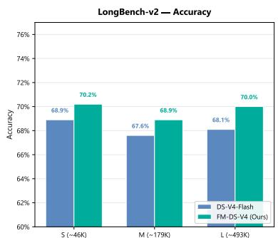
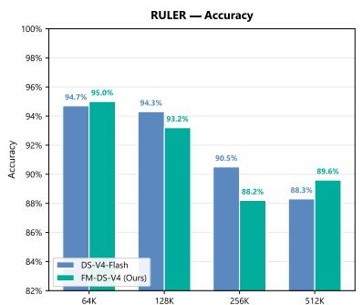
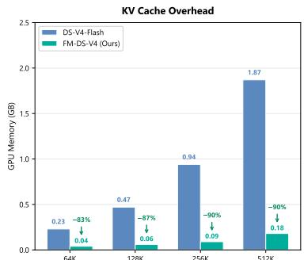

[← 返回 README](../README.md)

# 00 Abstract

## 📌 Preview

简要概述 FlashMemory-DeepSeek-V4 系统：提出 Lookahead Sparse Attention (LSA) 以缓解长上下文 LLM 服务中的 GPU 内存瓶颈，将 KV Cache 占用压缩至基线的 13.5%，同时保持准确率。

---

Conventional LLMs keep the full KV cache loaded during decoding, causing a severe GPU memory bottleneck for ultra-long context serving. In this report, we propose Lookahead Sparse Attention (LSA), a novel inference paradigm powered by a Neural Memory Indexer built upon the DeepSeek-V4 architecture. Rather than passively attending to all historical tokens, LSA proactively predicts future context demands and preserves only the query-critical KV chunks in the GPU memory. Crucially, we instantiate this architecture via a backbone-free decoupled training strategy. By formulating the indexer as a standard dual-encoder architecture, we train it independently using standard retrieval training frameworks without ever loading the massive backbone model into GPU memory.

We demonstrate that this "less is more" paradigm significantly maximizes serving efficiency while acting as an effective attention denoiser in tasks that rely on long-term global memory. Across primary long-context evaluation suites (e.g., LongBench-v2, LongMemEval, and RULER), FM-DS-V4 compresses the average physical KV cache footprint down to merely 13.5% of the full-context baseline, while consistently preserving or slightly elevating downstream accuracy (+0.6% absolute margin on average). Crucially, at extreme 500K scales, FlashMemory suppresses the physical KV cache overhead by over 90% without destabilizing the backbone's core reasoning capacities.

## Project Status

Due to organizational realignments, the Project Lead has parted ways with Tencent, and this project has been suspended. This technical report documents our preliminary breakthroughs and verified checkpoints. We firmly believe in the potential of the FlashMemory paradigm for infinite long-context intelligence. If you or your organization are interested in supporting or collaborating on the next phase (e.g., compute sponsorship, scaling tests, or research integration), please contact the Project Lead at yanwang.branden@gmail.com.

*Figure 1 Performance and hardware efficiency of FlashMemory-DeepSeek-V4. On LongBench-v2 and RULER, FM-DS-V4 consistently matches or exceeds DS-V4-Flash, while reducing KV cache overhead to merely 13.5% on average. KV cache memory footprints are measured via sglang deployment logs on an 8xH20 GPU server.*

> **Figure 1 批读**: 本图是整篇论文的 "killer graph"。三幅子图从不同维度展示了 FlashMemory 的核心优势。左侧和中部分别展示 LongBench-v2 和 RULER 上的 Accuracy vs. Memory 对比，FM-DS-V4 在极低的内存占用下（0.10 GB avg vs 0.93 GB baseline）不仅没有损失精度，反而在多数场景超越 full-attention baseline。右侧可能展示 scaling behavior —— memory reduction 随 context length 增长而更加显著（500K 时达 90%）。这一可视化有力支撑了论文的核心主张："less is more" -- 精准筛选比全量保留更有效。需要注意的是，Recency Only 和 Random 10% 作为 ablation baselines 全面崩溃，证明了 predictive retrieval 的必要性。

---

> **问题动机**: LLM 长上下文推理的 GPU 内存瓶颈源于 KV cache 的线性增长。现有的 sparse attention (如 DeepSeek-V4 的 HCA/CSA) 仅减缓增长速率，未消除线性扩展本质。作者观察到 >90% 的 >64K token 请求仅需最后 8K token，揭示出大量 GPU 内存浪费在 "inactive context" 上。核心矛盾在于：如何在不需要时为 local generation 免除 full GPU memory tax，同时在需要时又能进行 deep global reasoning。

> **机制拆解**: LSA 的核心思路是在 DeepSeek-V4 的 Compressed Sparse Attention (CSA) 框架上引入一个 Neural Memory Indexer，该 indexer 以固定的解码步间隔 τ=64 周期性触发，利用当前 hidden state 预测未来窗口需要的 critical KV chunks，从 CPU Cold Pool 按需加载到 GPU memory 中。关键设计是将 indexer 构建为独立的 dual-encoder 检索架构，训练时完全不加载千亿参数 backbone。

> **核心数字**: 13.5% KV cache retention (86.5% reduction), +0.6% accuracy improvement, 90% reduction at 500K, <0.1% trainable params, 1 GPU hour training.

## 🔖 Summary

摘要确立了三个核心支柱：(1) 长上下文 LLM 服务中的 GPU 内存浪费问题，(2) LSA 作为预测性检索方案，仅获取查询关键的 KV 块，(3) 反直觉的"少即是多"结果——激进的 KV Cache 压缩通过充当注意力去噪器反而提升了准确率。项目状态说明揭示这是一项已暂停但公开记录的研究工作。
