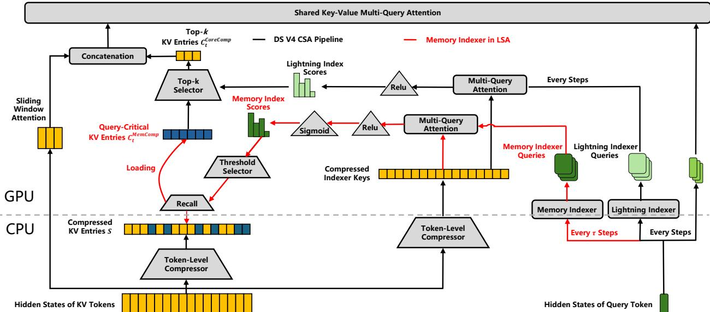

[← 返回 README](../README.md)

# 01 Introduction

## 📌 Preview

Motivates the FlashMemory approach through analysis of GPU memory waste in long-context LLM serving, introduces the LSA paradigm, and presents three core contributions.

---

The extension of Large Language Models (LLMs) toward ultra-long context windows is fundamentally bottlenecked by memory capacity. While modern sparse attention mechanisms successfully reduce the computational FLOPs per decoding step to a near-constant level, the GPU memory footprint of the Key-Value (KV) cache still scales linearly with the sequence length. Recent foundation models like DeepSeek-V4[^1] and Qwen3.5[^2] attempt to slow down this memory explosion by incorporating heavily compressed attention (HCA) or linear attention layers [1, 2]. However, to preserve fine-grained factual recall, these models must still retain a significant portion of low-compression or full-attention layers [1]. Consequently, they only mitigate the rate of memory growth rather than eliminating the linear scaling bottleneck itself.

This work stems from a simple yet striking observation of resource waste during inference: conventional LLMs fully load and carry the entire KV cache in GPU memory even when the active decoding step is completely independent of the historical context. Our empirical analysis of real-world inference logs reveals that over 90% of user requests with contexts longer than 64K tokens can be accurately resolved using only the last 8K tokens. This indicates that an overwhelming majority of GPU memory is squandered on inactive context that contributes nothing to the current token prediction. Conversely, simply discarding history via standard sliding-window attention fails entirely on the remaining tasks that genuinely require global context synthesis. This hard contradiction -- supporting deep global reasoning without paying the full GPU memory tax for local generation steps -- is the root cause behind the prohibitive cost of long-context serving.

> **问题动机**: 这是全篇论文最重要的 empirical motivation。作者对真实推理日志的分析揭示了一个 "资源浪费悖论"：90%+的长上下文请求只需要最后 8K token 即可正确回答，但现有的 LLM 推理系统无一例外地将全部 KV cache 保留在 GPU 内存中。这一观察同时暗示了两个关键设计需求：(1) 大部分时间内，系统应该是 "memory-cheap" 的；(2) 但不能简单地滑动窗口丢弃历史，因为剩下的 <10% 的任务需要真正的全局上下文合成。这个 "hard contradiction" 就是 LSA 要解决的核心问题。

> **机制拆解**: 现有方案（DeepSeek-V4 HCA、Qwen3.5 linear attention）的局限性在于它们是 "压缩型" 方案 -- 通过压缩 attention 层降低记忆增长速度，但由于必须保留部分 full-attention 层来维持 fine-grained factual recall，KV cache 的线性增长本质并未消除。LSA 的创新在于从 "压缩" 转向 "按需预测与获取"：不改变存储的内容，而是改变何时将什么内容加载到 GPU 的策略。

To resolve this dilemma, we present Lookahead Sparse Attention (LSA). Following the structural compression spirit of DeepSeek-V4 [1], our architecture retains all highly condensed HCA chunks (128:1 compression ratio) to maintain global context awareness. However, we fundamentally upgrade the conventional Compressed Sparse Attention (CSA) layers into our predictive LSA paradigm. LSA empowers the model to not recall that much fine-grained context; instead, driven by a highly efficient Neural Memory Indexer, the system triggers periodically at a fixed decoding interval of τ steps (e.g., τ = 64) to evaluate current hidden states and proactively fetch only the critical CSA chunks into the GPU memory. Crucially, we formulate the indexer as a standalone dual-encoder architecture. This decoupled design allows us to train the indexer independently on pre-computed hidden states and labels, completely bypassing the prohibitive memory and computational overhead of full-model fine-tuning or joint distillation.

> **机制拆解**: LSA 的三层架构设计：(1) HCA 层 -- 全局压缩上下文感知（128:1），不变；(2) CSA 层 -- 从被动保留全量变为主动预测获取；(3) Memory Indexer -- 独立训练的 dual-encoder，周期性（τ=64）评估 hidden state，预测 future window 需要的 critical chunks。Decoupled training 是关键工程创新 -- 整个 indexer 训练过程中 backbone 模型从未被加载到 GPU 内存。

Experimental results across three distinct long-context benchmarks confirm the robustness and striking efficiency of LSA. In scenarios requiring long-term memory and deep understanding, LSA acts as an effective attention denoiser. Specifically, averaged across LongBench-v2, LongMemEval, and RULER, LSA reduces GPU memory consumption to merely 13.5% of the baseline (an 86.5% reduction) while outperforming the standard Deepseek-V4-Flash by +0.6% absolute accuracy. At 500K context lengths, the memory reduction reaches up to 90%.

In summary, our core contributions are threefold:

- **Lookahead Sparse Attention (LSA) Paradigm**: We propose LSA, a novel inference paradigm that eliminates the hard contradiction between long-context modeling capabilities and hardware efficiency by proactively predicting and fetching query-critical KV chunks on demand.

- **Backbone-Free Decoupled Training**: We introduce an ultra-lightweight training strategy that physically isolates the indexer from the host LLM. Formulated as a standalone dual-encoder trained on precomputed representations, the indexer can be optimized independently in just a single H20 GPU hour without ever loading the massive backbone model.

- **Breakthrough in Efficiency**: Extensive evaluations show that LSA reduces GPU memory to merely 13.5% of the baseline (up to 90% reduction at 500K) while maintaining comparable accuracy to the full-attention baseline.

> **Q&A 批注记录**: 前两个贡献（LSA Paradigm + Decoupled Training）是方法论创新，第三个是工程验证。值得注意的是，作者将 "efficiency" 而非 "accuracy improvement" 作为核心贡献，因为 +0.6% 的 accuracy 提升是在极低内存预算下的副产品，而非主要优化目标。这种 "less is more" 的结果需要放在特定 benchmark 特征下理解（详见 Section 3.3）。

[^1]: https://huggingface.co/deepseek-ai/DeepSeek-V4-Pro
[^2]: https://huggingface.co/Qwen/Qwen3.5-397B-A17B

*Figure 2 Architectural overview of LSA vs. CSA. The black lines denote the standard, step-by-step CSA pipelines. The red lines highlight our proposed LSA mechanism, which decouples the GPU memory footprint by leveraging a Memory Indexer to fetch historical KV chunks dynamically every τ steps.*

> **Figure 2 批读**: 这是理解全论文架构最重要的图。黑色线条代表 DeepSeek-V4 的 native CSA 流程：每个解码步都从完整上下文中执行 compressed attention + sparse attention。红色线条代表 LSA 的改进：每 τ=64 步，Memory Indexer 从当前 hidden state 预测 future window 需要哪些 compressed KV entries，然后从 CPU Cold Pool 按需加载到 GPU，后续的 Lightning Indexer 和 core attention 只在这些已加载的 entries + 不可 offload 的 sliding window 上执行。关键差异在于 GPU memory 中驻留的 KV cache 从 "全量" 变为 "仅 query-critical subset"。注意图中 "Cold Pool" 的概念与 vLLM/SGLang 中的 CPU offloading 理念一脉相承，但核心区别在于：传统 offloading 是被动的（全部存储，按需加载），而 LSA 是主动预测性的（仅加载预测需要的）。

## 🔖 Summary

The introduction establishes a compelling empirical motivation (>90% of requests don't need full context, but ~10% do), frames LSA as resolving this "hard contradiction" through predictive retrieval rather than compression, and highlights the backbone-free decoupled training strategy as a key enabler for practical deployment. The three contributions map to paradigm innovation, training efficiency, and serving efficiency.
