[← 返回 README](../README.md)

# 03 Methodology

## 📌 Preview

Covers all technical details: Memory Indexer architectural design (2.1), golden label data construction pipeline (2.2), decoupled training optimization (2.3), and optimal layer configuration search (2.4). Three key innovations: Sigmoid-based threshold selection, Cross-Layer Majority Voting for label denoising, and backbone-free Focal Loss training.

---

In this section, we present the technical details of Lookahead Sparse Attention (LSA), including its architectural formulation, data curation pipeline, optimization strategy, and optimal configuration. Specifically, Section 2.1 introduces how we architect LSA on top of the DeepSeek-V4 framework to achieve predictive context selection. Section 2.2 introduces our lookahead data formats and the automated gathering pipeline. Section 2.3 details our decoupled training strategy that physically isolates indexer optimization from the massive LLM backbone. Finally, Section 2.4 presents our systematic exploration of the optimal layer configuration and training recipe for the production model.

## 2.1 Memory Indexer for Lookahead Selection

The core design principle of LSA is to minimize modifications to the DeepSeek-V4 architecture, thereby maximizing the preservation of its established capabilities. Therefore, our Memory Indexer mirrors the exact architecture of the native Lightning Indexer used in DeepSeek-V4, reusing the compressed indexer keys K^{IComp} as the dense representation of historical context. The definitive departure is that we introduce a Sigmoid function as the final activation layer to scale the indexer scores into the (0, 1) range, and we replace the rigid Top-k selector with a threshold-based mechanism to recall a dynamic number of historical entries.

During the autoregressive decoding stage, the Memory Indexer triggers periodically at a fixed decoding step interval τ (e.g., τ = 64) to perform lookahead block prediction. As illustrated in Figure 2, at decoding step t (where t (mod τ) = 0), given the current input hidden state of the query token h_t ∈ R^d, we map it into low-rank indexer queries across n_h^l indexer heads:

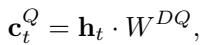

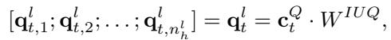

where W^{DQ} ∈ R^{d x d_c} and W^{IUQ} ∈ R^{d_c x c^l n_h^l} represent the down-projection and up-projection matrices for the lookahead query representation, respectively. Concurrently, we dynamically project h_t to compute the routing head weights w_t^l:

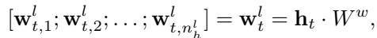

where W^w ∈ R^{d x n_h^l} is a learnable matrix, and w_{t,h}^l dynamically scales the importance of the h-th indexer head.

To determine which historical compressed KV entries are strictly critical for the upcoming window [t, t + τ - 1], the lookahead index score I_{t,s} between the query token t and a preceding compressed entry s (s < ⌊t/m⌋) is formulated as a head-fused gated matching score with a Sigmoid activation:

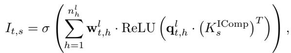

where σ(·) denotes the standard Sigmoid function.

This Sigmoid activation stands as the only architectural departure from the native Lightning Indexer. While the original one applies a ReLU boundary for raw attention scoring, LSA introduces Sigmoid normalization to align the Memory Indexer's scalar outputs explicitly with discrete binary targets y ∈ {0, 1}. For a query token t, rather than a rigid Top-k selection strategy, we fetch all preceding compressed KV entries whose lookahead scores meet or exceed a specific classification threshold (i.e., I_{t,s} ≥ 0.5) from the CPU Cold Pool into the GPU memory for subsequent core attention:

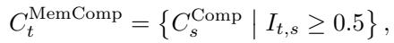

where C^{Comp} denotes the pre-computed compressed KV entries. Once the query-critical context subset C_t^{MemComp} is successfully resident in the GPU memory, the native Lightning Indexer calculates the token-level matching scores within this restricted C_t^{MemComp} boundary instead of scanning the full context. It applies the native ReLU-based Multi-Query Attention scoring over the fetched subset to select the final fine-grained Top-k core compressed entries:

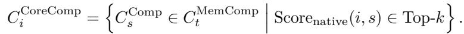

The selected C_i^{CoreComp} entries are then concatenated with the non-offloadable sliding window KV cache to participate in the final core attention computation. This tiered selection mechanism guarantees that the underlying FlashInfer or FlashAttention kernels operate exclusively on a highly condensed, hardware-resident active sequence footprint.

> **机制拆解**: 这个两阶段筛选（Memory Indexer → Native Lightning Indexer）是 LSA 的核心引擎。第一阶段（LSA indexer）执行粗粒度的 block-level 二进制分类（需要/不需要这个 compressed chunk），阈值 0.5 作为 Sigmoid 输出的自然分界。第二阶段（native Lightning Indexer）在已筛选的子集上执行细粒度的 token-level Top-k matching。这种 tiered design 的好处是：(1) 大幅减少 FlashAttention kernel 需要处理的有效序列长度；(2) 保留了 DeepSeek-V4 原生的 fine-grained token selection 能力；(3) 两阶段的职责分离使 Memory Indexer 可以独立训练（仅需 block-level labels）。

> **公式批读** (Eq 4): I_{t,s} = σ(Σ w_{t,h} · ReLU(q_{t,h} · (K_s^{IComp})^T)) 是核心 scoring 函数。需要关注三个设计细节：(1) ReLU 内积确保只有正向匹配贡献分数（与 native Lightning Indexer 一致）；(2) w_{t,h} 作为 learnable routing weight，动态调整各 indexer head 的重要性 -- 这是一个 gating mechanism；(3) Sigmoid 将多 head 的加权求和映射到 (0,1)，直接对齐 BCE 的 binary label 空间。对比 native 版本（仅 ReLU + Top-k），LSA 多了两个自由度：head gating (w_{t,h}) 和 probabilistic thresholding (Sigmoid + 0.5)。

## 2.2 Lookahead Dataset Construction

The cornerstone of optimizing our Memory Indexer is pinning down exactly which historical compressed KV entries a decoding token needs to look ahead to. A naive approach would define the positive label set for token t as the simple union of all Top-k entries recalled by the native Lightning Indexer across the future window [t, t + τ - 1]. However, empirical analysis reveals a massive inflation problem with this strategy, resulting in nearly 10,000 positive samples per token window before filtering (reduced to approximately 100-1,000 after our pipeline). The root cause is that a rigid Top-k selector forces the model to recall a fixed number of preceding entries regardless of their actual relevance, causing low-probability noise entries from different attention layers to heavily pollute the ground-truth dataset.

To eliminate this noise, we propose a golden label filtering pipeline that uses a Cross-Layer Majority Voting mechanism to identify the true "golden entries." The data generation pass runs completely offline on the frozen DeepSeek-V4-Flash backbone model. For each decoding token i ∈ [t, t + τ - 1] and across all L CSA layers (where L = 21 for DeepSeek-V4-Flash [1]), we extract the raw indexer logit scores S_{i,l,s} for every preceding compressed entry s. We then filter these scores through a three-step denoising pipeline:

- **Step 1: Softmax Normalization.** We convert the raw logit scores into a valid probability distribution via a Softmax operation over all historical entries:

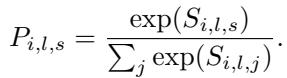

- **Step 2: Top-p Thresholding.** Instead of using a fixed Top-k count, we dynamically retain only the high-confidence entries using a nucleus threshold p (we empirically set p = 0.6). An entry s is marked as selected by layer l if it falls within the minimum set of entries that cumulatively account for the top 60% of the probability mass:

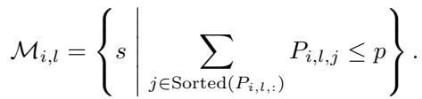

- **Step 3: Cross-Layer Majority Voting.** We aggregate the selection hits across all L layers. The voting score V_{i,s} for entry s at token step i is calculated by counting how many layers independently voted for it:

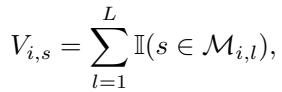

where I(·) is the indicator function. An entry is officially recognized as a core active entry A_i^{golden} if and only if it secures consensus backing from at least θ layers (we set θ = 3):

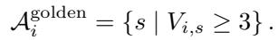

Finally, for each lookahead evaluation window triggered at decoding step t, the positive ground-truth label set Y_t^+ is established by taking the union of these denoised golden entries across the entire future temporal window of τ steps:

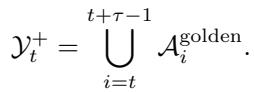

By shifting from an arbitrary Top-k lookup to a consensus-driven density estimation, our pipeline isolates the true contextual backbone of the long sequence, discarding irrelevant background noise. In total, our training set comprises approximately 10,000 long documents with context lengths ranging from 16K to 512K tokens.

> **机制拆解**: 这个三步过滤 pipeline 是工程贡献的精华。Naive Top-k union 会产生 10,000 positive samples/token window 的严重膨胀（因为各层各自的 Top-k entries 即使 low-probability 也被强制包含），使二分类训练几乎不可能。三步过滤的设计直觉：(1) Softmax 将原始 logits 转为有效概率分布；(2) Top-p=0.6 动态决定每层的选择门槛，避免固定 k 的 over-selection；(3) Cross-Layer Majority Voting (θ=3) 确保只有跨层达成共识的 entries 才被认定为核心 -- 单个层的 noise 被多数投票机制滤除。最终 gold label set 缩小到 ~100-1,000 per window，这是可训练的二分类数据规模。此外，数据生成在 frozen backbone 上离线完成，全程不产生额外训练成本。

> **Q&A 批注记录**: 为什么是 θ=3 层投票阈值？21 层 CSA 中，大部分 layers 的 attention pattern 高度相关。θ=3 是一个低门槛共识 -- 只要有 3/21 层独立选出同一 entry，就认为是可靠的。太低 (θ=1) 等同于无过滤，太高 (θ>=5) 会导致 recall 不足（很多真正有用但仅在少数层凸显的 entries 被过滤）。但作者未做 θ 的系统消融实验，这是一个待验证的超参数。

## 2.3 Optimization and Decoupled Training

Although our Memory Indexer shares a structural setup similar to the native Lightning Indexer, their underlying optimization paradigms are fundamentally different. Unlike the native Lightning Indexer which relies on heavy end-to-end self-distillation, we treat the Memory Indexer as a standard retrieval model and optimize it via metric learning. The primary training objective is to perform distance-based contrastive optimization: maximizing the lookahead matching scores for query-critical historical entries while minimizing the scores for negative samples.

A key system insight of LSA is that the compressed indexer keys K_s^{IComp} of historical entries are entirely pre-computed and strictly frozen during the training stage. Consequently, the optimization process simplifies into training only the query encoder of a standard dual-encoder retrieval architecture. Specifically, we only need to optimize the low-rank projection matrices (W^{DQ}, W^{IUQ}, W^w) to map the current input hidden state h_t to align with the fixed historical targets.

To achieve this objective, we minimize a standard element-wise Binary Cross-Entropy (BCE) loss function over the predicted lookahead scores. For a single sample with predicted probability p and label y ∈ {0, 1}, the per-sample BCE is defined as:

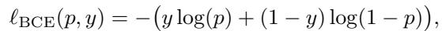

where y_{t,s} = 1 if s ∈ Y_t^+, and y_{t,s} = 0 otherwise. The overall batch objective is then the average over all samples in the batch S.

Because the historical representations K_s^{IComp}, target labels Y_t^+, and layer-specific query hidden states h_t are all pre-extracted and stored offline, the training pipeline achieves complete physical isolation from the host LLM. The thousand-billion-parameter backbone model is never loaded into GPU memory during the entire optimization loop. Since the trainable projection layers represent less than 0.1% of the full model's parameter scale, the computational workload is remarkably small. As a result, the entire Memory Indexer converges elegantly within a single H20 GPU hour.

This decoupled design significantly accelerates our research cycle. Leveraging a single cluster of 8x NVIDIA H20 GPUs, we seamlessly executed approximately 500 distinct training runs within a single week to systematically map out the optimal architecture and training strategies, a feat that would be computationally prohibitive under traditional joint end-to-end distillation.

> **机制拆解**: 这是 LSA 最大的工程创新点。朴素方案需要对 backbone LLM 进行 full-model fine-tuning 或 joint distillation（千亿参数，数千 GPU hours），而 LSA 通过三个 pre-computed 静态组件 (K_s^{IComp} 作为 keys, Y_t^+ 作为 labels, h_t 作为 queries) 将 indexer 训练完全解耦为标准的 dual-encoder retrieval 训练。关键等价关系：Memory Indexer ≈ Query Encoder of Dual-Encoder；frozen K_s^{IComp} ≈ Document Embeddings。这个 reduction 使 1 GPU hour 完成训练成为可能，进而支撑了 500 次消融实验的快速迭代。

## 2.4 Architectural Optimal Configuration

A fundamental premise of designing LSA is that not every transformer layer is suited for contextual lookahead prediction. Our early-stage exploration revealed that deploying memory indexers on the initial shallow layers of the LLM yields exceptionally poor lookahead performance, as these early representations predominantly capture low-level token statistics rather than long-range semantic dependencies. Therefore, an efficient system routing paradigm must selectively place indexers only on layers that possess mature global context awareness.

However, scaling the number of joint training layers introduces a strict trade-off between performance and serving efficiency. While a single-layer retriever lacks the representative capacity to handle diverse long-context workloads, aggressively scaling to an 8-layer joint configuration (spanning layers 6 to 20) introduces severe hardware-side efficiency degradation. As verified in our full-system benchmarks, an 8-layer ensemble triggers an excessively loose context recall mask, fetching up to 30%-49% of historical compressed KV entries into the GPU memory, which defeats our primary goal of minimizing the memory tax.

Through extensive Pareto-frontier optimization, we established that placing independent Memory Indexers on exactly three strategic intermediate layers -- layers 10, 12, and 20 -- delivers the ultimate sweet spot. During inference, our runtime system aggregates the scoring predictions from these three layers using a union operations strategy (OR-mode routing). Specifically, a preceding compressed KV entry is actively fetched into the GPU memory if at least one of the three layer indexers predicts its classification score I_{t,s} ≥ 0.5:

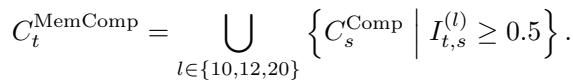

This 3-layer consensus framework provides an exceptionally robust fallback protection boundary.

> **消融解读**: 层选择是 LSA 的 critical design choice。早期浅层 (layers 1-5) 表征的是 low-level token statistics，缺乏长程语义依赖的 mature awareness，因此不适用于 lookahead prediction。单层 retriever 的 recall 产能不足（无法覆盖多样化负载）；8 层导致过召回（30%-49% chunks fetched → memory savings 消失）。3 层 OR-mode 策略的精妙之处在于：每一层提供互补的召回信号（不同层关注不同语义粒度的上下文模式），OR 聚合提供 recall safety net（层 10 漏掉的由层 12 或 20 补上），同时整体 recall mask 仍然紧缩（远低于 30%）。注意层号 (10, 12, 20) 是相对靠后的 intermediate-to-deep 层，符合 "possess mature global context awareness" 的设计原则。

Our final production model instantiation is built upon this optimal 3-layer geometry and optimized via a carefully curated combination of effective training strategies:

- **Random Initialization**: Rather than loading alignment-biased weights from a host checkpoint, we initialize the indexer's projection matrices randomly, forcing the dual-encoder to learn unified representations from scratch.

- **Query Low-Rank Conditioning**: We leverage the native low-rank query projection geometry of the DeepSeek-V4 architecture. In DeepSeek's MLA/MQA design, the query vector is projected through an internal low-rank bottleneck (officially designated q_lora_rank in the DeepSeek-V3 codebase, where the default is 1536). In our implementation, we set this internal projection dimension to r = 2048 for the R-series configuration. This is not PEFT-style LoRA fine-tuning (which typically uses ranks of 8-64 to learn small perturbations on frozen weights); rather, it is a fixed architectural dimension of the model's attention backbone that determines the representational capacity of the query encoder. Increasing this rank directly expands the spatial projection capacity of the lookahead indexer without introducing any adapter overhead.

> **公式批读**: 关于 r=2048 的设计选择。需要区分两类 "low-rank"：(1) PEFT-style LoRA (r=8-64) 是在 frozen weights 上学习 small perturbations，用于 fine-tuning 阶段；(2) MLA/MQA 的 q_lora_rank (r=2048) 是 attention backbone 的固定架构维度，决定了 query encoder 的表示容量。LSA 选择全秩（2048 vs native 1536）而非低秩微调，因为 Memory Indexer 的训练是 scratch initialization 而非从 checkpoint 微调。这是一个架构参数（architectural dimension）而非训练参数（trainable dimension），所以增加 rank 直接扩展 projection capacity，没有额外 adapter overhead。

- **Focal Loss Denoising**: To prevent easy negative samples from dominating the gradients, we replace standard BCE with a sample-weighted Focal Loss. Let p_{t,s} ∈ [0, 1] denote the Sigmoid-activated indexer score and y_{t,s} ∈ {0, 1} the binary label. We first compute the predicted confidence on the correct class:

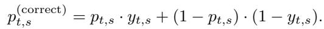

The per-sample Focal Loss is then defined as:

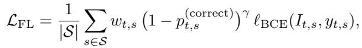

where L_{BCE} is the standard binary cross-entropy, γ = 2 is the focusing parameter that down-weights well-classified samples, and w_{t,s} is a per-sample weight. Notably, we do not use a separate class-balancing coefficient α; instead, class imbalance is handled jointly by (i) a negative sampling ratio of 3:1 (three negatives per positive) and (ii) the per-sample weight w_{t,s} computed by the weighted-loss scheduler. This design forces the optimizer to concentrate on hard boundary tokens while keeping the hyperparameter surface minimal.

> **消融解读 -- 被排除的训练策略** (来自 500-run sweep 的负面发现):

- **Pairwise-to-Pointwise Chaining**: 从 pairwise ranking (BPR/Margin Loss) 过渡到 pointwise calibration 相比纯 pointwise training 无统计显著的 recall 增益。

- **Strong Negative Mining**: 使用 LLM 标注的语义 chunks 作为 hard negative pool 引入了严重的 secondary label noise；随机负采样（从 non-voted historical repository）反而更 robust。

- **Weighted Loss Functions**: 按 native layer matching counts 加权损失略微提高 raw precision，但降低了 absolute recall bound（因为丢弃了 boundary context），使模型偏离 safety-net objective。

Conversely, multiple popular retrieval and contrastive learning tricks proved to be redundant or even detrimental during our 500-run sweep, and were systematically excluded from our final pipeline:

- **Pairwise-to-Pointwise Chaining**: Transitioning optimization from a pairwise ranking stage (BPR/Margin Loss) to a pointwise calibration stage yielded no statistical recall gains over a pure pointwise training loop.

- **Strong Negative Mining**: Utilizing LLM-annotated semantic chunks as a hard negative pool introduced severe secondary label noise into the contrastive format; random negative sampling within the non-voted historical repository proved significantly more robust.

- **Weighted Loss Functions**: Scaling the loss according to native layer matching counts increased raw precision slightly but degraded the absolute recall bound by discarding boundary context, shifting the model away from its safety-net objective.

**Note on Hyperparameter Selection.** Due to the unexpected suspension of this project, we were unable to conduct systematic ablation studies on several key hyperparameters. Specifically, the decoding interval τ = 64 and the classification threshold of 0.5 were selected based on initial exploratory runs but remain untested across alternative values. The 3-layer configuration (layers 10, 12, 20) was determined through the 500-run Pareto sweep described in Section 2.4; however, a more fine-grained layer-wise ablation would be desirable for future work.

> **Q&A 批注记录**: 作者坦诚指出了几个未被充分消融的关键超参：(1) τ=64 作为解码间隔 -- 更短的 τ 增加预测频率和准确性但提升 overhead，更长的 τ 降低成本但增加 recall risk；(2) threshold=0.5 -- 这是 Sigmoid 的自然中点，但可能不是最优的 precision-recall operating point。这为后续研究者提供了明确的可改进方向。

## 🔖 Summary

The methodology comprises four tightly integrated components: (1) Memory Indexer architecture that minimally modifies DeepSeek-V4 (only Sigmoid replaces ReLU), (2) a sophisticated golden label pipeline that reduces noisy labels from ~10,000 to ~100-1,000 per window via three-step denoising, (3) a decoupled training paradigm that treats indexer optimization as a standard dual-encoder retrieval problem with Focal Loss, and (4) extensive Pareto-frontier optimization to select the optimal 3-layer (10, 12, 20) OR-mode ensemble. The methodology section is unusually honest about untested hyperparameters and failed training strategies, offering valuable practical insights.
