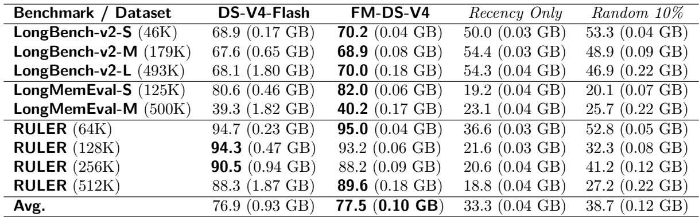
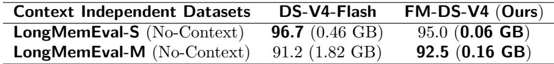

[← 返回 README](../README.md)

# 04 Experiments

## 📌 Preview

Presents primary results (Table 1) across LongBench-v2, LongMemEval, RULER with four baselines, followed by three detailed diagnostic analyses: context-independent overhead, MRCR dense memory breakdown, and length generalization ceiling.

---

## 3.1 Experimental Setup

To ensure a rigorous and controlled evaluation of the FlashMemory paradigm, we benchmark our model against three structural variants. Crucially, to maintain architectural consistency, all evaluated configurations universally retain the full Heavily Compressed Attention (HCA) layers (at a 128:1 compression ratio), alongside the exact CSA chunks corresponding to both the last 8K tokens of the original prompt and all actively decoded tokens within the local window. The precise treatment of the remaining historical long-context CSA chunks differentiates the methods as follows:

- **DS-V4-Flash**: The standard, unaltered DeepSeek-V4-Flash model.

- **FM-DS-V4 (Ours)**: The DS-V4-Flash backbone augmented with the Memory Indexer. The lookahead selection mechanism triggers periodically every τ = 64 decoding steps, dynamically evaluating and fetching query-critical historical CSA chunks from the CPU cold pool into the active GPU HBM.

- **Recency Only**: A sliding-window fallback control. While it shares the same base HCA layers and the local 8K/decoded CSA window to match the static local memory allocation budget, it completely discards all prior long-context historical CSA chunks and executes zero predictive lookahead retrieval.

- **Random 10%**: A naive sparse routing control. On top of the foundational HCA layers and the local 8K/decoded CSA window, it randomly selects and retains exactly 10% of the global historical context CSA chunks in the active KV cache, providing a non-predictive stochastic baseline.

> **Q&A 批注记录**: 所有实验配置保留了全局 HCA 层（128:1 压缩比），因为 HCA 提供 coarse-grained semantic awareness，相对内存开销极小。实验的变量控制非常严格：只有 historical CSA chunks 的处理方式不同。Recency Only 和 Random 10% 作为 ablations 区分了 "预测性检索" vs "启发式策略" 的必要性。

## 3.2 Primary Results: Breaking the Capacity Wall

Table 1 highlights the performance and hardware footprint scaling across three major long-context benchmarks: LongBench-v2 [3], LongMemEval [4], and RULER [5].

*Table 1 System performance and physical KV cache footprints (GPU memory overhead in gigabytes [GB] in parentheses) across primary long-context benchmarks. DS-V4-Flash operates at 100% full KV cache allocation without chunk pruning.*

<html>
<table>
<tr><td>Benchmark /Dataset</td><td>DS-V4-Flash</td><td>FM-DS-V4</td><td>Recency Only</td><td>Random 10%</td></tr>
<tr><td>LongBench-v2-S (46K)</td><td>68.9 (0.17 GB)</td><td>70.2 (0.04 GB)</td><td>50.0 (0.03 GB)</td><td>53.3 (0.04 GB)</td></tr>
<tr><td>LongBench-v2-M (179K)</td><td>67.6 (0.65 GB)</td><td>68.9 (0.08 GB)</td><td>54.4 (0.03 GB)</td><td>48.9 (0.09 GB)</td></tr>
<tr><td>LongBench-v2-L (493K)</td><td>68.1 (1.80 GB)</td><td>70.0 (0.18 GB)</td><td>54.3 (0.04 GB)</td><td>46.9 (0.22 GB)</td></tr>
<tr><td>LongMemEval-S (125K)</td><td>80.6 (0.46 GB)</td><td>82.0 (0.06 GB)</td><td>19.2 (0.04 GB)</td><td>20.1 (0.07 GB)</td></tr>
<tr><td>LongMemEval-M (500K)</td><td>39.3 (1.82 GB)</td><td>40.2 (0.17 GB)</td><td>23.1 (0.04 GB)</td><td>25.7 (0.22 GB)</td></tr>
<tr><td>RULER (64K)</td><td>94.7 (0.23 GB)</td><td>95.0 (0.04 GB)</td><td>36.6 (0.03 GB)</td><td>52.8 (0.05 GB)</td></tr>
<tr><td>RULER (128K)</td><td>94.3 (0.47 GB)</td><td>93.2 (0.06 GB)</td><td>21.6 (0.03 GB)</td><td>32.3 (0.08 GB)</td></tr>
<tr><td>RULER (256K)</td><td>90.5 (0.94 GB)</td><td>88.2 (0.09 GB)</td><td>20.6 (0.04 GB)</td><td>41.2 (0.12 GB)</td></tr>
<tr><td>RULER (512K)</td><td>88.3 (1.87 GB)</td><td>89.6 (0.18 GB)</td><td>18.8 (0.04 GB)</td><td>27.2 (0.22 GB)</td></tr>
<tr><td>Avg.</td><td>76.9 (0.93 GB)</td><td>77.5 (0.10 GB)</td><td>33.3 (0.04 GB)</td><td>38.7 (0.12 GB)</td></tr>
</table>
</html>

The empirical findings deliver a striking victory for the FlashMemory paradigm. Averaged across all tasks, FM-DS-V4 consumes merely 13.5% of the baseline GPU memory footprint -- representing an average 86.5% reduction in KV cache storage -- while actually improving overall performance to 77.5% (+0.6% absolute margin over DS-V4-Flash). When the average context length reaches 500K, this reduction ratio further climbs to an astonishing 90%.

This counter-intuitive "less is more" phenomenon is especially pronounced in the ultra-long LongBench-v2-L (493K) setting, where our model beats DS-V4-Flash by +1.9% while running on a threadbare 10.0% memory budget. This forcefully proves our core hypothesis: LSA acts as an expert attention denoiser, filtering out thousands of irrelevant historical chunks that would otherwise clutter the attention dot-products and cause factual hallucinations. Under the same memory restrictions, native heuristic controls (Recency Only and Random 10%) completely collapse, failing to synthesize global context and confirming that our indexer has mastered complex predictive temporal routing.

> **Table 1 批读**: 这是全论文最重要的实验表格。关键发现：(1) **Memory scaling pattern**: FM-DS-V4 的 memory footprint 随 context length 增长极缓（0.04→0.18 GB from 46K→493K on LongBench-v2），而 DS-V4-Flash 线性增长（0.17→1.80 GB），证明 LSA 基本打破了线性 memory scaling。(2) **Accuracy preservation across tasks**: FM-DS-V4 在几乎所有 task/context length 组合上都 >= baseline accuracy，唯一例外是 RULER (128K-256K) 有轻微下降 (< 2.3%)。(3) **Recency Only/Random 10% 在 memory-intensive tasks 上崩溃**: LongMemEval (19.2-25.7 vs 80.6-82.0) 和 RULER (18.8-52.8 vs 88.3-95.0) 的巨大差距证明了 predictive retrieval vs 启发式策略的本质区别。LongMemEval 需要长期记忆能力，仅靠近端 token 完全不够。(4) **LongBench-v2 上 Recency Only 仍有 50+**: 因为 HCA (128:1 global compression) + 8K CSA window 对 coarse-grained semantic tasks 已足够。这揭示了 LongBench-v2 和 LongMemEval/RULER 的任务特性差异：前者 more forgiving to long-term memory loss。

One might naturally question why Recency Only and Random 10% can still maintain a reasonable performance baseline on specific datasets like LongBench-v2. It is critical to reiterate that in DeepSeek-V4's hybrid design, the sparse CSA mechanism operates in parallel with the full Heavily Compressed Attention (HCA) layers (at a 128:1 compression ratio). For evaluation scenarios that primarily necessitate global semantic themes or coarse-grained synthesis rather than lossy, hyper-granular token retrieval, utilizing the global compressed HCA foundations alongside the local 8K cache proves sufficient to navigate basic context structures.

## 3.3 Limitations and Diagnostics

While FlashMemory achieves unprecedented efficiency gains on three standard long-context benchmarks, our stress-testing exposes critical boundaries of the current paradigm. Due to recent organizational realignments, active development has been suspended. We present these diagnostic findings and concrete failure cases to provide transparent insights for the open-source community.

### 3.3.1 Context-Independent Overhead

We originally hypothesized that for context-independent queries where historical long context is entirely irrelevant, the pointwise Sigmoid gating would naturally collapse to near-zero retrievals, yielding a strict O(1) constant KV cache footprint. To test this adversarial boundary, we augmented LongMemEval-S and LongMemEval-M by explicitly appending queries that are strictly context-free or tightly bounded to the local 8K window only.

*Table 2 System evaluation under adversarial context-independent tasks (No-Context).*

<html>
<table>
<tr><td>Context Independent Datasets</td><td>DS-V4-Flash</td><td>FM-DS-V4 (Ours)</td></tr>
<tr><td>LongMemEval-S (No-Context)</td><td>96.7 (0.46 GB)</td><td>95.0 (0.06 GB)</td></tr>
<tr><td>LongMemEval-M (No-Context)</td><td>91.2 (1.82 GB)</td><td>92.5 (0.16 GB)</td></tr>
</table>
</html>

As shown in Table 2, while the downstream accuracy gracefully matches the foundation baseline, the model fails to preserve a constant memory overhead. Moving from the 125K context to the 500K context, the lookahead memory allocation ratio does scale down to 8.4%, yet the physical absolute chunk retention volume inflates by approximately 2.5x. This indicates that the point-wise Sigmoid gater still leaks a marginal background probability across massive sequence lengths, accumulating false-positive retrievals when facing massive distraction pools.

> **消融解读 -- Context-Independent Overhead**: 这是 LSA 的一个 subtle failure mode。理想情况下，对于与上下文无关的 query，Memory Indexer 应该输出全 0（no chunks needed），实现 O(1) 恒定内存。但是 per-token Sigmoid gating 在超长序列上存在 "概率泄漏" 现象：即使每个 token 的 false positive rate 极低 (~0.01%)，乘以候选池大小 (500K/128 ≈ 3,900 compressed entries) 后，仍会有约 0.39 个 false positive per lookup。每 τ=64 步累积后，absolute chunk retention 随序列长度线性增长（2.5x from 125K to 500K）。这表明 point-wise Sigmoid 无法实现真正的 context-adaptive 推理 -- 需要更结构化的 gating mechanism 或 explicit null-retrieval mode。

### 3.3.2 Dense Global Memory Breakdown (The MRCR Failure Case)

Our model experiences a severe breakdown on the Multi-Range Context Retrieval (MRCR) [6] benchmark, where accuracy plummets from the baseline's 76.0% down to a dismal 48.0%. To isolate the root cause of this severe performance regression, we conducted a rigorous oracle simulation: we pre-computed the global golden attention weights of DS-V4-Flash across the full decoding path for each sample, sorted the historical blocks based on cumulative attention density, and selectively loaded only the Top 50%, 25%, or 10% highest-weighted chunks into core MQA layers.

Our diagnostic oracle sweeps revealed a fundamental property difference between benchmarks: for LongBench-v2, LongMemEval, and RULER, retaining a mere 10% or 25% of golden CSA chunks alongside global HCA layers completely secures 100% baseline accuracy. However, MRCR exhibits an aggressive global dense memory dependency -- even when providing the indexer with 50% of the absolute true golden chunks, the accuracy still drops by about 2% compared to full-context cache execution.

These two empirical findings firmly isolate the architectural limitations of our current Memory Indexer. Ideally, we envisioned an ideal indexer capable of executing deterministic, context-adaptive retrieval: achieving near-zero recall on context-independent tasks to maintain a constant memory floor, while delivering near-perfect recall on memory-dense tasks to secure maximum contextual awareness.

Unfortunately, by relying on a highly compressed, standalone Dual-Encoder framework, the model fundamentally lacks the capacity to balance such extreme operational boundaries of precision and recall. Consequently, the following three critical factors bound its performance:

1. **Frozen Key Representation**: Due to computational budget constraints, we never adjusted or optimized the native DeepSeek-V4 Compressed indexer keys (K^{IComp}), fine-tuning only the query projection encoder.

2. **Shallow Cross-Interaction**: Operating purely via a 64-step coarse dot-product similarity, the indexer lacks the multi-turn interaction capacity. Incorporating a Late-Interaction architecture (e.g., ColBERT-style token-level cross-matching) is essential to untangle complex dense retrieval patterns.

3. **Decoupled Training Isolation**: The lack of end-to-end joint optimization with the main backbone restricts the indexer to static pseudo-labels, ignoring live autoregressive shift dynamics.

Addressing these items remains our formal future roadmap.

> **消融解读 -- MRCR Failure Case**: 这是全论文最深刻的 diagnostic analysis。作者通过 oracle simulation 揭示了 benchmarks 的 fundamental property divergence：(1) "Sparse-Memory" benchmarks (LongBench-v2, LongMemEval, RULER)：10-25% golden chunks 即恢复全精度，说明这些任务的信息呈现 "long-tail" distribution -- 少数 critical chunks 决定性能；(2) "Dense-Memory" benchmarks (MRCR)：50% golden chunks 仍有精度损失，说明 MRCR 需要均匀分布在整个 context 的信息。这个分类是本文最重要的贡献之一。

> **Q&A 批注记录**: Oracle simulation 的方法论值得学习。作者不是简单地报告 "MRCR 失败"，而是设计了一个可插拔的 golden chunk injection experiment 来隔离问题的根本原因。这种方法可以推广到其他稀疏 attention 系统的 failure analysis 中。

### 3.3.3 The Length Generalization Ceiling

Our initial design intent assumed that because our lookahead indexer operates via point-wise chunk matching, we could train the Dual-Encoder on relatively short context windows (e.g., 128K) and seamlessly scale zero-shot inference to 1M+ context fields, as candidate pool expansion theoretically shouldn't distort point-wise scoring.

Our empirical evaluations completely dismantled this assumption. The indexer safely generalizes up to exactly 2x its training context length. Attempting to execute inference beyond this hard boundary causes accuracy to collapse precipitously, with lookahead block selection degenerating into near-random sampling. We attribute this performance bottleneck to the effects from the out-of-distribution positional embeddings, which constitutes the primary architectural divergence between self-attention mechanisms and generic text retrieval systems. Consequently, our final released memory indexer was explicitly trained on context lengths up to 512K. Although empirical validation at greater scales remains untested, we hypothesize that its retrieval discriminability would decay irreversibly when deployed on sequences exceeding 1M tokens.

> **消融解读 -- Length Generalization Ceiling**: 这是 LSA 与 generic text retrieval 之间的一个 fundamental gap。标准双塔检索模型假设 query-document matching 是 position-agnostic 的 -- candidate pool 的大小不影响 scoring。但 LSA 的 query (h_t) 来自 Transformer 的 hidden state，其 position embedding 随 absolute position 变化，因此 training distribution 外的 position 导致 hidden state 的 OOD shift，进而 corrupt 匹配分数。2x generalization 是一个经验的 "安全边际"。这暗示了 future work 可能需要相对位置编码辅助或 position-aware 的 dual-encoder 设计。

## 🔖 Summary

The experiments are deliberately structured as "Primary Results" + "Limitations & Diagnostics" (rather than just a victory lap). Table 1 demonstrates ~86.5% memory reduction with +0.6% accuracy gain across 9 task/context combinations. The diagnostic sections are unusually honest and valuable: (1) Sigmoid gating leaks background probability over long sequences (2.5x inflation from 125K to 500K), (2) MRCR (dense-memory) causes catastrophic collapse (76% → 48%), and (3) the indexer only generalizes 2x beyond training length due to OOD positional embeddings. The oracle simulation methodology for analyzing MRCR failure is a model for future diagnostic analysis.
