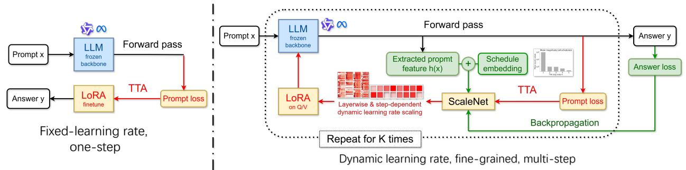
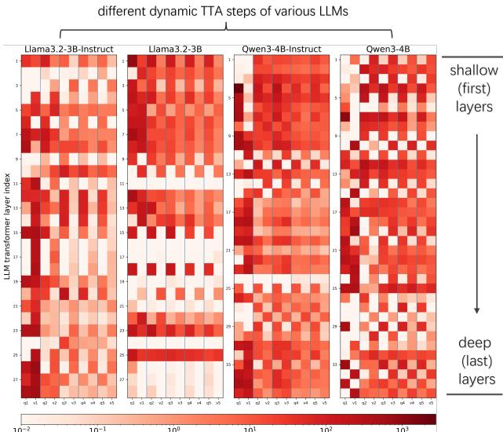
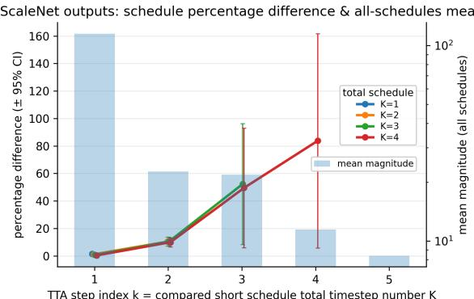

# Unsupervised Layer-Wise Dynamic Test Time Adaptation for LLMs

Longhuan $\mathbf { X } \mathbf { u } ^ { 1 }$ Cunjian Chen 2 Feng Yin 3

# Abstract

Test-time adaptation (TTA) for large language models (LLMs) updates model parameters at inference time using signals available at deployment. This paper focuses on a common yet underexplored regime: unsupervised, sample-specific TTA, where the model adapts independently for each prompt using only the prompt itself, without gold answers or external supervision. Although appealing, na¨ıve unsupervised TTA with a fixed, handcrafted learning rate can be unstable: updates may overfit to prompt-specific statistics, drift from the desired answer distribution, and ultimately degrade generation quality. This failure mode is not surprising, as in this case TTA must adapt to a single prompt within only a few gradient steps, unlike standard training that averages updates over large datasets and long optimization horizons. Therefore, we propose layer-wise dynamic test-time adaptation, a framework which explicitly modulates TTA strength as a function of prompt representation, LLM structure and adaptation step. In our setting, TTA updates only LoRA parameters, and a lightweight hypernetwork predicts per-layer, per-step learning-rate multipliers, enabling fine-grained control. Experiments across various datasets and LLMs consistently show that our method substantially strengthens TTA by learning effective scaling patterns over adaptation steps and transformer layer projections, improving stability while delivering better performance.

# 1. Introduction

Large language models (LLMs) have become a generalpurpose backbone for natural language understanding and generation, powering applications ranging from open-ended assistants to domain-specific writing and reasoning tools (Chowdhery et al., 2022; Singh et al., 2025). Despite strong overall performance, its real-world usage often differs from the training regime: prompts vary wildly in style, length and content, domain-specific terminology appears frequently, and user instructions can deviate from patterns seen during pretraining and alignment. This motivates test-time optimization (Sun et al., 2020) methods that adjust model behavior to bridge the gap between deployment context and the training corpus.

A second, orthogonal challenge for LLMs is instance-level objective mismatch (Krause et al., 2019; Rannen-Triki et al., 2024). Standard training minimizes the expected (or average) loss over the entire training set, producing a single parameter setting that is necessarily a global compromise across heterogeneous samples. At test time, however, performance is determined by the loss on the current prompt instance. Even when the test distribution matches training in aggregate, the globally optimal parameters need not be optimal for a particular prompt, leaving room for per-instance specialization.

During inference, LLM behavior can be adjusted in two different ways. First, prompting-based methods—such as in-context learning (Dong et al., 2024) and retrievalaugmented generation (RAG) (Lewis et al., 2021)—steer LLM by modifying the input context while keeping model parameters frozen. Second, test-time adaptation (TTA) (Hu et al., 2025a) modifies the model itself by performing parameter updates during inference. A practically dominant deployment regime is unsupervised, sample-specific TTA. “Unsupervised” means that we typically observe only the prompt $x$ and rarely have access to the gold continuation/answer $y$ (or any other supervision). “Sample-specific” means per-instance updates: for each prompt $x$ , the model takes a small number of gradient steps on $x$ itself (e.g., minimizing prompt negative log-likelihood), then generates $y$ and resets before the next query. This adapt-and-reset protocol matches real-world usage, where prompt streams are heterogeneous and often non-stationary; otherwise, offline (or continual) fine-tuning would be more appropriate. Unsupervised, sample-specific adaptation is also attractive operationally because it requires no labels or external data, can be applied on-the-fly, and can leverage parameter updates to encode information beyond the finite context window length of LLMs (Dai et al., 2019).

Figure 1. Unsupervised layer-wise dynamic TTA training pipeline (right side).

However, na¨ıve unsupervised TTA which runs a few gradient steps on the prompt (Hu et al., 2025b) with a fixed learning rate is often brittle for LLMs. Because the optimization signal comes solely from the observed prompt, updates can over-amplify prompt-specific statistics and deviate from the desired continuation/answer distribution, degrading generation quality. This procedure is also highly sensitive to adaptation strength: small learning rates produce negligible improvements within a handful of steps, whereas large learning rates can cause destructive parameter changes. More fundamentally, sample-specific TTA is driven by a single instance, so its gradients have high-variance and are easily dominated by idiosyncratic prompt features. In our experiments, effective adaptation calls for an aggressive first update (often unevenly distributed across layers) followed by rapid damping, and the appropriate scale can even depend on the LoRA initialization. In summary, a single fixed global learning rate cannot accommodate these step- and layer-dependent dynamics.

In this paper we propose the unsupervised layer-wise dynamic TTA framework aimed at controlling the most direct and influential hyperparameters in TTA: the learning rate. The central idea is that the appropriate adaptation strength should depend on both the input prompt and the adaptation state, and that a single global TTA learning rate is too coarse for deep transformers. Gradient magnitudes and update sensitivity can vary substantially across layers and across TTA steps; as a result, uniform updates may be either too small to matter or large enough to be harmful. We therefore introduce a learnable, fine-grained lightweight scaling hypernetwork, called SCALENET, which predicts per-layer, per-step learning rate multipliers for test-time updates. Intuitively, it serves as a control mechanism: it suppresses potentially harmful updates in sensitive layers or for delicate stages, while allowing stronger adaptation where it is beneficial.

In our implementation, test-time adaptation updates only LoRA (Hu et al., 2021) parameters in the attention query/value projections while keeping the pretrained backbone frozen; before TTA backpropagation, SCALENET predicts multipliers that rescale the base learning rate for LoRA.

Our method can also be viewed through the lens of testtime scaling (Muennighoff et al., 2025; Zeng et al., 2025). Rather than improving inference by increasing sampling, reranking candidates, or performing multi-pass generation, our framework scales adaptation compute: it uses a small budget of test-time gradient steps and learns how to allocate update magnitudes across layers and steps on a per-sample basis.

Our contributions can be summarized as:

• Layer-wise dynamic learning rate for unsupervised, sample-specific test time adaptation (TTA). We propose a dynamic TTA scheme that replaces a single global learning rate with learned, step- and layerdependent learning rates, improving stability and effectiveness under a small adaptation budget.

• Lightweight per-layer (Q/V) scaling framework. A hypernetwork predicts non-negative multipliers for each transformer layer (separately for query/value LoRA matrices) and each TTA step, enabling finegrained control of update magnitudes during test-time learning.

• Efficient training via first-order approximation. We train the framework by unrolling the same TTA procedure used at inference and optimizing it with a firstorder approximation that avoids expensive secondorder derivatives.

# 2. Related Works

# 2.1. Large Language Models

Large language models (LLMs) have become the dominant paradigm in modern NLP. They are typically transformerbased (Vaswani et al., 2023) auto-regressive decoder models trained with next-token prediction, and scaling model size, data, and compute tends to improve generalization and unlock emergent capabilities, including zero-/few-shot in-context learning and multi-step chain-of-thought (COT) (Wei et al., 2023) reasoning. In practice, LLMs also undergo post-training to better match human intent. Instruction tuning improves instruction following, while alignment methods such as reinforcement learning from human feedback (RLHF) (Ouyang et al., 2022) shape outputs toward helpfulness and safety.

Alongside these training recipes, architectural and system advances further improve performance. Mixture-of-experts (MoE) (Fedus et al., 2022) increases model capacity with sparse activation and keeps per-token compute relatively low. Retrieval-augmented generation (RAG) grounds generation in external knowledge, improving factuality and enabling maintenance through an editable retrieval index rather than weight updates. More recently, LLM agents couple an LLM with planning, memory, and tool/API execution loops, allowing it to decompose goals into actionable steps and carry out workflows beyond passive prompting.

# 2.2. Test-Time Adaptation

Test-time adaptation (TTA) updates a deployed model at inference time using unlabeled test-time signals. A canonical early approach is TENT, which performs unsupervised adaptation by minimizing prediction entropy on target batches, updating only lightweight affine parameters (and normalization statistics) (Wang et al., 2021). Since na¨ıve entropy minimization can cause overconfident drift or even collapse, conservative variants such as COME stabilize adaptation by modeling uncertainty and optimizing a guarded surrogate (Zhang et al., 2024).

For autoregressive LLMs, recent work argues that entropy is often misaligned with generation, and that perplexity (next-token negative log-likelihood) is a more suitable selfsupervised objective for test-time updates (Hu et al., 2025a). Moreover, sample-specific (per-prompt) adaptation has been shown feasible, e.g., SLOT performs a few optimization steps for each prompt under an adapt-and-reset protocol (Hu et al., 2025b).

# 2.3. Low-Rank Finetuning

Parameter-efficient fine-tuning (PEFT) adapts large pretrained models by updating only a small set of additional parameters while keeping the backbone frozen. A widely used PEFT method is Low-Rank Adaptation (LoRA) (Hu et al., 2021), which represents weight updates with low-rank factors, greatly reducing trainable parameters and optimization cost. LoRA is commonly applied to transformer attention projections (e.g., query/value), and its updates can be merged into the base weights for deployment with negligible inference overhead.

# 3. Proposed Method

# 3.1. Unsupervised Sample-Specific TTA for LLMs

Suppose an LLM parameterized by $\Theta$ is trained on a data distribution $p ( x )$ :

$$
L L M _ { \Theta } = \arg \operatorname* { m i n } _ { \Theta } \mathbb { E } _ { { x } \sim { p } ( { x } ) } \big [ - \log { P ( { x } ; \Theta ) } \big ] .
$$

At test time, LLM $P _ { \Theta }$ will be evaluated on a downstream distribution $q ( x , y )$ , from which a test-time prompt $x$ and the desired continuation/answer $y$ are sampled. By Bayes’ rule, the conditional distribution $q ( y \mid x )$ is determined by both the joint $q ( x , y )$ and the marginal $q ( x )$ :

$$
q ( y \mid x ) = { \frac { q ( x , y ) } { q ( x ) } } \propto q ( x ) { \mathrm { u n d e r } } { \mathcal { C } } ( x ) .
$$

In the unsupervised setting where $y$ is unavailable, we seek a control method such that, under appropriate constraints $\mathcal C ( x )$ , adapting the model using only the observed prompt $x$ can still improve answer prediction. Intuitively, prompts and answers are often semantically aligned, so optimizing on $x$ can provide a useful learning signal for getting LLM prediction $P _ { \Theta } ( y \mid x )$ closer to ground truth $q ( y \mid x )$ .

Following (Hu et al., 2025a), we consider unsupervised testtime adaptation using the standard negative log-likelihood objective to update LLM parameterized by $\Theta$ . Backpropagation can be written as:

$$
\begin{array} { r } { \Theta ^ { \prime } = \Theta - \eta \nabla \Theta \Big ( - \log P ( x ; \Theta ) \Big ) . } \end{array}
$$

Here $\Theta ^ { \prime }$ denotes the new parameters after one prompt-only update on $x$ , and $\eta$ is learning rate. A first-order Taylor expansion of new conditional log probability $\log P _ { \Theta ^ { \prime } } ( y \mid x )$ using Eq. (3) yields:

$$
\log P _ { \Theta ^ { \prime } } ( y \mid x ) = \log P _ { \Theta } ( y \mid x ) + \eta \langle g _ { x } , \ g _ { y } \rangle + \mathcal { O } ( \eta ^ { 2 } ) .
$$

Here the cross-gradient term $\langle g _ { x } , \ g _ { y } \rangle$ is defined as the inner product between prompt gradient $g _ { x } ~ = ~ \nabla \Theta \log P ( x ; \Theta )$ and answer gradient $g _ { y } = \nabla _ { \Theta } \log P _ { \Theta } ( y \mid x )$ conditioned on the same prompt:

$$
\langle g _ { x } , g _ { y } \rangle : = { \Big \langle } \nabla _ { \Theta } \log P ( x ; \Theta ) , \nabla _ { \Theta } \log P _ { \Theta } ( y \mid x ) { \Big \rangle } .
$$

Our goal is to design a control mechanism that tries to guarantee $\langle g _ { x } , g _ { y } \rangle \geq 0$ , so that unsupervised TTA tends to increase the conditional log-likelihood, i.e., $\log  P _ { \Theta ^ { \prime } } ( y |$ $x ) \geq \log P _ { \Theta } ( y \mid x )$ .

Figure 2. Simple control hypernetwork: SCALENET architecture.

In general, TTA can be viewed as a special case of finetuning performed at inference time. Updating all LLM parameters on a single prompt is not only computationally prohibitive, but also conceptually inappropriate, as it can easily cause severe overfitting. We therefore adopt the widely used LoRA (Hu et al., 2021) parameterization:

$$
W ^ { \prime } = W + \Delta W , \Delta W = B A .
$$

where $W \in \mathbb { R } ^ { d _ { \mathrm { o u t } } \times d _ { \mathrm { i n } } }$ is a frozen weight matrix, and $A \in$ $\mathbb { R } ^ { r \times d _ { \mathrm { i n } } }$ , $B \in \mathbb { R } ^ { d _ { \mathrm { o u t } } \times r }$ are trainable low-rank factors with rank $r \ll \operatorname* { m i n } ( d _ { \mathrm { o u t } } , d _ { \mathrm { i n } } ) .$ . Given all trainable LoRA parameters $\Phi$ , Eq. (3) becomes:

$$
\Phi ^ { \prime } = \Phi - \eta \nabla _ { \Phi } \Big ( - \log P ( x ; \Phi ) \Big ) .
$$

Because prompts can vary drastically across instances, we study sample-specific test-time adaptation, treating each prompt as an independent adaptation episode. Concretely, for each test prompt $x$ , we start with a fresh set of LoRA factors by re-initializing the low-rank matrix $\Delta W = B A$ to zero (e.g. $B = 0$ and $A$ random), run a small number of gradient steps, generate the response $y$ with the adapted parameters, and then discard the adaptation state. This adapt-and-reset protocol separates unrelated queries and matches real-world interactive usage.

# 3.2. Layer-wise Hypernetwork Control

How to find the correct constraint $\mathcal { C } ( \boldsymbol { x } ) \boldsymbol { ? }$ Eq. (2) exposes a fundamental challenge of unsupervised TTA: adapting on $x$ inevitably increases the model’s probability mass on the observed prompt, effectively boosting the marginal term $q ( x )$ . Such an increase improves the conditional probability of $y$ given $x$ only if the joint probability $q ( x , y )$ increases even more—that is, the update must amplify $q ( x , y )$ beyond the marginal gain on $q ( x )$ :

$$
{ \frac { q ^ { \prime } ( x , y ) } { q ( x , y ) } } > { \frac { q ^ { \prime } ( x ) } { q ( x ) } } .
$$

where $\boldsymbol { q } ^ { \prime } ( \boldsymbol { x } , \boldsymbol { y } )$ and $q ^ { \prime } ( x )$ are the joint and marginal distributions after TTA. In the absence of gold answers, it is difficult to handcraft constraints that reliably enforce this condition.

Nevertheless, prompts and answers are not independent: paired $( x , y )$ are inherently coupled through semantics and task structure. It is thus natural to infer useful properties of $( x , y )$ from $x$ alone, and neural networks are well suited to capture these hard-to-specify relationships. This idea remains consistent with our unsupervised TTA setting: the gold answer is used only during training to teach a neural network how to infer useful properties of $( x , y )$ from $x$ , and it is never accessed during real test-time adaptation.

Moreover, revisiting the next-token prediction objective shows that, although the unsupervised loss is written as $\log { P ( x ; \Theta ) }$ , it is actually computed token-wise, i.e., a collection of conditional prediction tasks rather than a “true” probability of the prompt as a whole (Radford et al., 2019):

$$
\sum _ { t } \log P ( x _ { t } \mid x _ { < t } ; \Theta )
$$

Therefore, unsupervised TTA primarily updates the model to better match conditional distributions under the context induced by $x$ , and it may be reasonable to expect that these conditional distributions can transfer from observed prompt tokens to unseen answer tokens by increasing:

$$
\log P _ { \Theta } ( y \mid x ) \approx \sum _ { t } \log P _ { \Theta } ( y _ { t } \mid x , y _ { < t } ) .
$$

To make it clear, we introduce a hypernetwork $\mathcal { H } _ { \psi } ( x )$ parameterized by $\psi$ that always takes $x$ as input to produce the constraint $\mathcal { C }$ from the prompt:

$$
{ \mathcal C } ( x ) = { \mathcal H } _ { \psi } ( x ) .
$$

The training objective of hypernetwork would be to find an optimum solution $\psi ^ { \star }$ minimizing answer loss after TTA:

$$
\psi ^ { \star } \ = \ \arg \operatorname* { m i n } _ { \psi } \ \mathbb { E } _ { ( x , y ) \sim q ( x , y ) } \Big [ f \big ( \Theta ^ { \prime } ( x , \mathcal { C } ( x ) ) , y \big ) \Big ] .
$$

Here $\Theta ^ { \prime } ( x , \mathcal { C } ( x ) )$ denotes the parameters of LLM after applying the unsupervised TTA (e.g., one or multiple gradient steps on $x$ ) under constraint $\mathcal C ( x )$ , starting from the base parameters $\Theta$ ; $f ( \Theta ^ { \prime } ( x , \mathcal { C } ) , y )$ denotes the LLM loss referenced on gold answer.

Among all the constraints in TTA, we choose “learning rate”, one of the most straightforward yet critical control signals, as the to-be-optimized hypernetwork output $\mathcal { C }$ Considering that TTA typically allows only a handful of gradient steps, it often requires a learning rate far larger than standard fine-tuning; otherwise, with a conventional rate (e.g., $1 0 ^ { - 5 }$ ) and only a few updates (e.g., three), the resulting parameter change is effectively negligible. While the number of TTA steps also affects performance, it is usually a less trainable hyper-parameter: empirically, gains increase with additional steps but saturate quickly.

In this paper, we focus on transformer-based LLMs, which remain the dominant architecture in current practice and are composed of many stacked transformer layers (Bommasani et al., 2022). We propose that a single global TTA learning rate is a coarse (or even bad) control knob because gradient characteristics and update sensitivity can vary substantially across layers and steps, and that a multiplicative layer-wise scaling of the learning rate at each TTA step is a better optimizable constraint for achieving larger TTA gains while maintaining stability.

Formally speaking, let $L$ denote the number of layers and $k \in \{ 1 , \ldots , K \}$ the current TTA step out of a planned total of $K$ steps. Constraint $\mathcal { C }$ is now defined as a layer-wise learning-rate scaler predicted at each TTA step:

$$
\begin{array} { r } { \mathcal { C } = \{ s ^ { ( k ) } \} _ { k = 1 } ^ { K } , \quad s ^ { ( k ) } = \mathcal { H } _ { \psi } ( x , k , K ) \in \mathbb { R } _ { \ge 0 } ^ { L } . } \end{array}
$$

Trainable LoRA parameters $\Phi$ are then decomposed into $\Phi = \{ \phi _ { \ell } \} _ { \ell = 1 } ^ { L }$ ( $\ell$ is layer index) and with the base learning rate $\eta$ , our layer-wise dynamic TTA update at layer $\ell$ , step $k$ reads:

$$
\phi _ { \ell } ^ { ( k + 1 ) } = \phi _ { \ell } ^ { ( k ) } - \eta s _ { \ell } ^ { ( k ) } \nabla _ { \phi _ { \ell } } \Big ( - \log P ( x ; \Phi ^ { ( k ) } ) \Big ) .
$$

# 3.3. Dynamic Control Framework

We now describe the hypernetwork $\mathcal { H } _ { \psi }$ named as SCALENET and its framework in detail. Unsupervised, layer-wise dynamic test time adaptation consists of several stages that alternate in a loop (Figure 1). First, the LLM performs a forward pass on the prompt $x$ . Next, the hypernetwork outputs a dynamic learning-rate scaler. Then, the query and value weight matrices1 in each transformer layer of the LLM undergo LoRA fine-tuning based on the next-token-prediction negative log-likelihood of the prompt, using a learning rate adjusted by the hypernetwork output. This loop is repeated for $K$ times until the scheduled testtime adaptation is finally finished.

As mentioned in Eq. (13), SCALENET takes the prompt $x$ , the current TTA step $k$ , and the total scheduled number of TTA steps $K$ as input. Note that, to reduce computational burden and as a proof of concept, we feed it a fixed-length prompt representation $h ( x )$ extracted from the LLM forward pass, rather than the full embedded prompt. In our implementation, $h ( x ) \in \mathbb { R } ^ { 2 d }$ concatenates the meanpooled first-layer and last-layer token embeddings, where each hidden-state sequence $H ^ { ( \ell ) } ( x ) \ \in \ \mathbb { R } ^ { T \times d }$ has token

length $T$ and hidden size $d$ :

$$
h ( \boldsymbol { x } ) = \Big [ \mathrm { M e a n } ( H ^ { ( 0 ) } ( \boldsymbol { x } ) ) ; \mathrm { M e a n } ( H ^ { ( L ) } ( \boldsymbol { x } ) ) \Big ] .
$$

Here, $H ^ { ( 0 ) } ( x )$ and $H ^ { ( L ) } ( x )$ denote the first- and last-layer hidden-state sequences for the prompt.

Still, as a proof of concept, architecture of SCALENET is kept simple: a two-layer MLP followed by a non-negative output parameterization, since learning-rate scales must be non-negative. Concretely, for each LoRA matrix $\Delta W _ { i }$ at step $k$ , we map its unconstrained output ${ \alpha _ { i } ^ { ( k ) } }$ (optionally with a safety maximum clamp to avoid extreme values) for that block into a non-negative value via:

$$
s _ { i } ^ { ( k ) } = g \Big ( \alpha _ { i } ^ { ( k ) } \Big ) , \quad g ( a ) = \left\{ \exp ( a ) , \begin{array} { l l } { { a \leq 0 , } } \\ { { 1 + a + { \frac { 1 } { 2 } } a ^ { 2 } , } } & { { a > 0 . } } \end{array} \right.
$$

We randomly draw $K$ uniformly from $\{ 0 , 1 , \ldots , K _ { \operatorname* { m a x } } \}$ each time to support diverse TTA schedules and observe the trend.

First-order Approximation. In our training framework, the hypernetwork is updated using a supervision loss computed after running $K$ LoRA updates on LLM. Hence, optimizing hypernetwork parameters $\psi$ requires differentiating the post-adaptation answer loss $f ( y ; \Phi ^ { ( K ) } )$ through $K$ unrolled TTA updates. One TTA update from step $k$ into step $k + 1$ using prompt loss $f ( x ; \Phi ^ { ( K ) } )$ can be expressed as:

$$
\begin{array} { r } { \Phi ^ { ( k + 1 ) } = \Phi ^ { ( k ) } - \eta s ^ { ( k ) } ( x , k , K ; \psi ) \nabla _ { \Phi } f ( x ; \Phi ^ { ( k ) } ) . } \end{array}
$$

Differentiating Eq. (17) yields second-order dependency because $\nabla _ { \Phi } f ( x ; \Phi ^ { ( k ) } )$ depends on $\psi$ again as LLM trainable parameters $\Phi ^ { ( k ) } ( \psi )$ already depend on SCALENET parameters $\psi$ :

$$
\frac { \partial } { \partial \psi } \nabla _ { \Phi } f ( x ; \Phi ^ { ( k ) } ) = \nabla _ { \Phi } ^ { 2 } f ( x ; \Phi ^ { ( k ) } ) \frac { \partial \Phi ^ { ( k ) } } { \partial \psi } .
$$

This second-order Hessian product is expensive and often unsupported by memory-efficient kernels used in modern LLMs (e.g., FlashAttention). So we instead adopt a firstorder approximation by dropping the second-order path in Eq. (18), i.e., we treat prompt gradient $\nabla _ { \Phi } f ( x ; \Phi ^ { ( k ) } )$ as constant with respect to $\psi$ . As a result, differentiating Eq. (17) while ignoring $\begin{array} { r l r } {  { \frac { \partial } { \partial \psi } \nabla _ { \Phi } f ( \boldsymbol { x } ; \Phi ^ { ( k ) } ) } } \end{array}$ yields:

$$
\frac { \partial \Phi ^ { ( k + 1 ) } } { \partial \psi } \approx \frac { \partial \Phi ^ { ( k ) } } { \partial \psi } - \eta \frac { \partial s ^ { ( k ) } ( x , k , K ; \psi ) } { \partial \psi } \nabla _ { \Phi } f ( x ; \Phi ^ { ( k ) } ) .
$$

Now gradients to $\psi$ flow only through the explicit dependence of the update magnitudes on $s ^ { ( k ) } ( x , k , K ; \psi )$ , without requiring second-order derivatives.

Figure 3. NLL results. The vertical axis shows the average negative log-likelihood (NLL) per answer token, and the horizontal axis shows the number of TTA steps. The red curve is the na¨ıve fixed-learning-rate baseline. Green and blue correspond to layer-agnostic/step-wise and layer-wise SCALENET; yellow corresponds to sample-averaged layer-wise SCALENET.

# 4. Experiments

# 4.1. Implementation Details

We employ dynamic TTA and train SCALENET, a twolayer MLP with hidden size 128, using AdamW at learning rate $1 0 ^ { - 4 }$ . The base TTA learning rate (to be scaled) is set to $1 0 ^ { - 2 }$ . For each dataset–model pair, we train on roughly $3 0 \mathrm { k }$ samples (mostly without repeats) and evaluate on 300 test samples. We set the LoRA rank to $r = 4$ and LoRA $\alpha$ to 16. The maximum total number of TTA steps is $K _ { \operatorname* { m a x } } = 5$ . LoRA parameters are initialized with $B = 0$ and $A \sim 1 0 ^ { - 2 } \mathcal { N } ( 0 , I )$ , and are re-initialized randomly for each prompt. All LLM backbones use bfloat16.

across several datasets. XSum (Narayan et al., 2018) is a summarization dataset of BBC news articles paired with single-sentence summaries. SQuAD (Rajpurkar et al., 2016) is a reading-comprehension benchmark where answers are spans from a provided Wikipedia passage. NQ-Open (Lee et al., 2019) is an open-domain QA setting that evaluates predicting short answers to real user queries. AdaptEval (Hu et al., 2025a) is a comprehensive benchmark for testtime learning that groups datasets into three categories: DomainBench (Geography, Agriculture, Medicine, Finance), InstructionBench (Alpaca-GPT4, Dolly, InstructionWild), and ReasoningBench (GSM8K, MetaMath, LogiQA), covering diverse tasks and domains.

# 4.2. LLMs and Datasets

We experiment with two families of LLMs: Llama-3.2- 3B, Llama-3.2-3B-Instruct and Llama3.3-70B-Instruct; Qwen3-4B, Qwen3-4B-Instruct and Qwen3-32B. For each family, the “Instruct” variant is post-trained for instructionfollowing and multi-turn dialogue. Evaluation is conducted

# 4.3. Main Results

Evaluation metric. Since we train with teacher-forced next-token negative log-likelihood (NLL), NLL is the most directly aligned evaluation metric. In practice, however, users often care more about generation-oriented metrics such as ROUGE-Lsum (Lin, 2004). Without dataset-level fine-tuning—which effectively teaches the LLM the desired answer distribution—reductions in NLL from unsupervised sample-specific TTA are not guaranteed to translate into consistent improvements in ROUGE-Lsum. This is justifiable because ROUGE-Lsum is based on lexical overlap, while natural language admits many valid paraphrases; the overlap score is therefore highly sensitive to surface form and stylistic choices, which are primarily learned through dataset-level supervision. Nevertheless, we report both NLL and ROUGE-Lsum.

Table 1. NLL results on AdaptEval for Llama3.3-70B-Instruct and Qwen3-32B under different TTA steps (lower is better).

<table><tr><td>LLM</td><td>Steps</td><td>Fixed</td><td>Step-wise</td><td>Layer-wise</td></tr><tr><td rowspan="5">Llama3.3 -70B -Instruct</td><td>No TTA</td><td>2.2114</td><td>2.2114</td><td>2.2114</td></tr><tr><td>1 step</td><td>2.1907</td><td>2.1665</td><td>1.6598</td></tr><tr><td>2 steps</td><td>5.8488</td><td>2.1399</td><td>1.6692</td></tr><tr><td>3 steps</td><td>9.6803</td><td>2.1850</td><td>1.6790</td></tr><tr><td>4 steps</td><td>11.5891 11.4970</td><td>2.1997 2.2657</td><td>1.6741 1.7048</td></tr><tr><td rowspan="6">Qwen3 -32B</td><td>5 steps No TTA</td><td>2.1805</td><td></td><td>2.1805</td></tr><tr><td>1 step</td><td>2.1809</td><td>2.1805 2.1303</td><td>2.1107</td></tr><tr><td>2 steps</td><td>2.1784</td><td>2.0892</td><td>1.9168</td></tr><tr><td>3 steps</td><td>2.1757</td><td>2.0842</td><td>1.8777</td></tr><tr><td>4 steps</td><td>2.1725</td><td>2.0829</td><td>1.8739</td></tr><tr><td>5 steps</td><td>2.1682</td><td>2.0925</td><td>1.8889</td></tr></table>

Analysis. We first report results in terms of NLL per answer token on a set of moderate-size LLMs: Llama-3.2-3B, Llama-3.2-3B-Instruct, Qwen3-4B, and Qwen3-4B-Instruct. As an empirical baseline, we run na¨ıve TTA with a fixed learning rate of $5 \times 1 0 ^ { - 2 }$ applied uniformly across all layers and adaptation steps. For our dynamically controlled TTA, we use a base learning rate of $1 0 ^ { - 2 }$ and rescale it using the predicted multipliers. Because our protocol is samplespecific (memoryless), each prompt is permitted to contain the full task context; otherwise, the prompt-only objective can be ill-posed (see Appendix for detailed format).

To validate the effect of layer-wise control, we include a layer-agnostic/step-wise ablation that predicts a single multiplier per adaptation step and applies it uniformly across layers. This step-wise variant is indispensable: it can be viewed as a learned upper bound over common handcrafted learning-rate schedules (e.g., linear decay, cosine annealing (Loshchilov & Hutter, 2017), exponential decay (Li & Arora, 2019)), since any such schedule can be expressed as a particular choice of per-step scalar multipliers. Remember that our layer-wise hypernetwork predicts perstep, per-layer multipliers (separately for Q/V projections), strictly generalizing step-wise control by enabling layerspecific modulation. Finally, we consider an additional ablation that averages the layer-wise scaling across samples to remove prompt dependence.

Table 2. ROUGE-Lsum results (higher is better). Due to computation budget, we cut the maximum generated new token number at 64 for XSum, 32 for SQuAD and NQ, and 256 for AdaptEval.

<table><tr><td>Pair</td><td>Steps</td><td>Fixed</td><td>Step-wise</td><td>Layer-wise</td></tr><tr><td>Llama3B</td><td>No TTA</td><td>0.1821</td><td>0.1821</td><td>0.1821</td></tr><tr><td>-Instruct</td><td>1 step</td><td>0.1800</td><td>0.1838</td><td>0.1964</td></tr><tr><td>on XSum</td><td>5 steps</td><td>0.1780</td><td>0.1904</td><td>0.2090</td></tr><tr><td>Qwen4B</td><td>No TTA</td><td>0.1700</td><td>0.1700</td><td>0.1700</td></tr><tr><td>-Instruct</td><td>1 step</td><td>0.1700</td><td>0.1872</td><td>0.2157</td></tr><tr><td>on XSum</td><td>5 steps</td><td>0.1773</td><td>0.1864</td><td>0.2247</td></tr><tr><td>Llama3B</td><td>No TTA</td><td>0.7080</td><td>0.7080</td><td>0.7080</td></tr><tr><td>-Instruct</td><td>1 step</td><td>0.7058</td><td>0.7133</td><td>0.7238</td></tr><tr><td>on SQuAD</td><td>5 steps</td><td>0.6532</td><td>0.7114</td><td>0.7353</td></tr><tr><td>Qwen4B</td><td>No TTA</td><td>0.7722</td><td>0.7722</td><td>0.7722</td></tr><tr><td>-Instruct</td><td>1 step</td><td>0.7657</td><td>0.5361</td><td>0.7958</td></tr><tr><td>on SQuAD</td><td>5 steps</td><td>0.7634</td><td>0.5402</td><td>0.8306</td></tr><tr><td>Llama3B</td><td>No TTA</td><td>0.2766</td><td>0.2766</td><td>0.2766</td></tr><tr><td>-Instruct</td><td>1 step</td><td>0.2722</td><td>0.2662</td><td>0.2398</td></tr><tr><td>on NQ-Open</td><td>5 steps</td><td>0.0288</td><td>0.2674</td><td>0.2507</td></tr><tr><td>Qwen4B</td><td>No TTA</td><td>0.1320</td><td>0.1320</td><td>0.1320</td></tr><tr><td>-Instruct</td><td>1 step</td><td>0.1424</td><td>0.0866</td><td>0.1513</td></tr><tr><td>on NQ-Open</td><td>5 steps</td><td>0.1495</td><td>0.1041</td><td>0.1706</td></tr><tr><td>Llama70B</td><td>No TTA</td><td>0.2327</td><td>0.2327</td><td>0.2327</td></tr><tr><td>-Instruct</td><td>1 step</td><td>0.2325</td><td>0.2068</td><td>0.2237</td></tr><tr><td>on AdaptEval</td><td>5 steps</td><td>0.0029</td><td>0.2223</td><td>0.2733</td></tr><tr><td>Qwen32B</td><td>No TTA</td><td>0.0987</td><td>0.0987</td><td>0.0987</td></tr><tr><td>on AdaptEval</td><td>1 step</td><td>0.0992</td><td>0.0982</td><td>0.0983</td></tr><tr><td></td><td>5 steps</td><td>0.1004</td><td>0.0990</td><td>0.1043</td></tr></table>

As shown in Figure 3, the na¨ıve baseline can rarely achieve optimal performance: it typically yields small initial gains, but then quickly degrades as NLL rises sharply with further steps, indicating destructive drift. In contrast, our proposed method substantially improves stability and effectiveness. Both the original layer-wise scaling and layer-agnostic/step-wise variants consistently outperform the fixed-rate baseline. Introducing layer-wise control further reduces NLL, suggesting that different transformer blocks prefer different TTA update magnitudes. Across datasets, most improvements occur in the first adaptation step, with subsequent steps providing diminishing returns. In addition, crudely averaging scales across samples can reduce the performance gains, indicating that the dynamic scaling varies with prompt content.

Overall, substantial variation is observed across dataset– model pairs. In particular, Llama-3.2-3B on AdaptEval shows very limited TTA gains. Since AdaptEval is more diverse and challenging—often requiring deeper logical reasoning—and to test whether our proposed unsupervised dynamic TTA framework scales to larger LLMs, we further evaluate Llama3.3-70B-Instruct and Qwen3-32B on AdaptEval. As listed in Table 1, our dynamic TTA consistently outperforms the na¨ıve baseline and the layeragnostic/step-wise ablation on the 32B and 70B LLMs, with gains for Llama3.3-70B-Instruct even larger than for Llama-3.2-3B-Instruct on AdaptEval. This implies our method has the potential to scale well into large-size LLMs.

Figure 4. SCALENET output heatmap averaged over 4 datasets and 4 moderate-size LLMs. Along horizontal axis, $q _ { k }$ and $v _ { k }$ denote query and value projection at step $k$ . From top to bottom, transformer layers are ordered from shallow (first) to deep (last).

We next report ROUGE-Lsum results. For brevity, we report ROUGE-Lsum only at total step $K \in \{ 0 , 1 , 5 \}$ for Llama-3.2-3B-Instruct and Qwen3-4B-Instruct on XSum, SQuAD, and NQ-Open, and for Llama-3.3-70B-Instruct and Qwen3- 32B on AdaptEval. Table 2 shows that our method can also improve ROUGE-Lsum, indicating that it is not simply a next-token NLL “hacking” trick, but can meaningfully improve generated text without requiring additional supervision or external material. The ROUGE-Lsum gains on XSum and SQuAD are clear and stable, while on NQ-Open and AdaptEval the changes are smaller and less stable. As a zero-shot setting, the former two datasets contain most of the answer information in the prompt itself, whereas the latter two are more open and often require harder reasoning, and are therefore more difficult to optimize using promptonly adaptation (Ma et al., 2022).

Visualization. Here we visualize the learned learning rate multipliers. Figure 4 shows that effective fine-grained dynamic learning-rate modulation has a rich structure, and that separating query/value projections matters. We do not observe a consistent monotonic trend along either the step dimension or the depth dimension (e.g., “query projection always larger than value projection,” or “early layers always smaller than late layers”). Instead, the preferred scales vary sharply across neighboring blocks: adjacent layers (or Q vs. V within the same layer) can differ by orders of magnitude even at the same TTA step. Notably, this heatmap is averaged over four datasets; the fact that high-contrast patterns remain after averaging suggests shared regularities rather than noise. For example, in Llama3.2-3B, several layers consistently favor much smaller update magnitudes, indicating that uniform learning-rate choices would overupdate sensitive blocks. Together with Figure 5, we observe that the average magnitude of SCALENET outputs peaks at the first adaptation step $k { = } 1 )$ ) and then decays rapidly in subsequent steps, offering a natural explanation for why the majority of performance gains arise from the initial update.

Figure 5. SCALENET output percentage difference with $9 5 \%$ CI across schedules (baseline $\mathrm { K } { = } 5$ ) and all-schedules scaling magnitude mean. Both averaged over 4 dataset test samples and 4 moderate-size LLMs.

Besides, for a stable TTA process, the update at a given step index $k$ should be comparable across schedules with different total steps $K$ , since the per-step update rule is identical and only the horizon differs. As shown in Figure 5, taking $K { = } 5$ as the baseline, the average percentage differences (averaged over test samples) between scales from shorter schedules and the baseline at the same step index are relatively small. Given that the scales span several orders of magnitude, this indicates strong schedule consistency.

# 4.4. Limitations

Our current work prioritizes dataset-tailored, fine-grained, prompt-conditioned adaptation, which may limit transferability across substantially different task distributions. We believe this can be mitigated by training on larger corpus and using higher-capacity models beyond shallow MLP.

# 5. Conclusion

In summary, our proposed dynamic framework enables stable and effective unsupervised, sample-specific TTA by learning step- and layer-wise update magnitudes. It consistently outperforms the fixed-rate baseline and the step-wise variant, which represents common hand-crafted learningrate schedules, suggesting that fine-grained, learned control is necessary.

# References

Bommasani, R., Hudson, D. A., Adeli, E., Altman, R., et al. On the opportunities and risks of foundation models, 2022. URL https://arxiv.org/abs/2108. 07258.

Chowdhery, A., Narang, S., Devlin, J., et al. Palm: Scaling language modeling with pathways, 2022. URL https: //arxiv.org/abs/2204.02311.

Dai, Z., Yang, Z., Yang, Y., Carbonell, J., Le, Q. V., and Salakhutdinov, R. Transformer-xl: Attentive language models beyond a fixed-length context, 2019. URL https://arxiv.org/abs/1901.02860.

Dong, Q., Li, L., Dai, D., Zheng, C., Ma, J., et al. A survey on in-context learning, 2024. URL https://arxiv. org/abs/2301.00234.

Fedus, W., Zoph, B., and Shazeer, N. Switch transformers: Scaling to trillion parameter models with simple and efficient sparsity, 2022. URL https://arxiv.org/ abs/2101.03961.

Hu, E. J., Shen, Y., Wallis, P., Allen-Zhu, Z., Li, Y., Wang, S., Wang, L., and Chen, W. Lora: Low-rank adaptation of large language models, 2021. URL https://arxiv. org/abs/2106.09685.

Hu, J., Zhang, Z., Chen, G., Wen, X., Shuai, C., Luo, W., Xiao, B., Li, Y., and Tan, M. Test-time learning for large language models, 2025a. URL https://arxiv. org/abs/2505.20633.

Hu, Y., Zhang, X., Fang, X., Chen, Z., Wang, X., Zhang, H., and Qi, G. Slot: Sample-specific language model optimization at test-time, 2025b. URL https://arxiv. org/abs/2505.12392.

Krause, B., Kahembwe, E., Murray, I., and Renals, S. Dynamic evaluation of transformer language models, 2019. URL https://arxiv.org/abs/1904.08378.

Lee, K., Chang, M.-W., and Toutanova, K. Latent retrieval for weakly supervised open domain question answering. In Proceedings of the 57th Annual Meeting of the Association for Computational Linguistics, pp. 6086–6096, Florence, Italy, July 2019. Association for Computational Linguistics. doi: 10.18653/v1/P19-1612. URL https: //www.aclweb.org/anthology/P19-1612.

Lewis, P., Perez, E., Piktus, A., Petroni, F., et al. Retrieval-augmented generation for knowledge-intensive nlp tasks, 2021. URL https://arxiv.org/abs/ 2005.11401.

Li, Z. and Arora, S. An exponential learning rate schedule for deep learning, 2019. URL https://arxiv.org/ abs/1910.07454.

Lin, C.-Y. ROUGE: A package for automatic evaluation of summaries. In Text Summarization Branches Out, pp. 74–81, Barcelona, Spain, July 2004. Association for Computational Linguistics. URL https: //aclanthology.org/W04-1013/.

Loshchilov, I. and Hutter, F. Sgdr: Stochastic gradient descent with warm restarts, 2017. URL https: //arxiv.org/abs/1608.03983.

Ma, K., Cheng, H., Liu, X., Nyberg, E., and Gao, J. Open domain question answering with a unified knowledge interface, 2022. URL https://arxiv.org/abs/ 2110.08417.

Muennighoff, N., Yang, Z., Shi, W., Li, X. L., et al. s1: Simple test-time scaling, 2025. URL https://arxiv. org/abs/2501.19393.

Narayan, S., Cohen, S. B., and Lapata, M. Don’t give me the details, just the summary! topic-aware convolutional neural networks for extreme summarization, 2018. URL https://arxiv.org/abs/1808.08745.

Ouyang, L., Wu, J., Jiang, X., Almeida, D., Wainwright, C. L., et al. Training language models to follow instructions with human feedback, 2022. URL https: //arxiv.org/abs/2203.02155.

Radford, A., Wu, J., Child, R., Luan, D., Amodei, D., and Sutskever, I. Language models are unsupervised multitask learners. Technical report, OpenAI, 2019. URL https://cdn.openai. com/better-language-models/language_ models_are_unsupervised_multitask_ learners.pdf.

Rajpurkar, P., Zhang, J., Lopyrev, K., and Liang, P. Squad: $^ { 1 0 0 , 0 0 0 + }$ questions for machine comprehension of text, 2016. URL https://arxiv.org/abs/ 1606.05250.

Rannen-Triki, A., Bornschein, J., Pascanu, R., Hutter, M., et al. Revisiting dynamic evaluation: Online adaptation for large language models, 2024. URL https: //arxiv.org/abs/2403.01518.

Singh, A., Fry, A., Perelman, A., Tart, A., Adi, et al. Openai gpt-5 system card, 2025. URL https://arxiv. org/abs/2601.03267.

Sun, Y., Wang, X., Liu, Z., Miller, J., Efros, A. A., and Hardt, M. Test-time training with self-supervision for generalization under distribution shifts, 2020. URL https://arxiv.org/abs/1909.13231.

Vaswani, A., Shazeer, N., Parmar, N., Uszkoreit, J., Jones, L., Gomez, A. N., Kaiser, L., and Polosukhin, I. Attention is all you need, 2023. URL https://arxiv.org/ abs/1706.03762.

Wang, D., Shelhamer, E., Liu, S., Olshausen, B., and Darrell, T. Tent: Fully test-time adaptation by entropy minimization, 2021. URL https://arxiv.org/abs/2006. 10726.

Wei, J., Wang, X., Schuurmans, D., Bosma, M., Ichter, B., Xia, F., Chi, E., Le, Q., and Zhou, D. Chain-ofthought prompting elicits reasoning in large language models, 2023. URL https://arxiv.org/abs/ 2201.11903.

Zeng, Z., Cheng, Q., Yin, Z., Zhou, Y., and Qiu, X. Revisiting the test-time scaling of o1-like models: Do they truly possess test-time scaling capabilities?, 2025. URL https://arxiv.org/abs/2502.12215.

Zhang, Q., Bian, Y., Kong, X., Zhao, P., and Zhang, C. Come: Test-time adaption by conservatively minimizing entropy, 2024. URL https://arxiv.org/abs/ 2410.10894.

# A. Prompt Formats for Unsupervised Sample-Specific TTA

This section specifies the exact prompt templates used in our experiments. For each dataset, we construct a single text prompt $x$ and a gold answer $y$ . During unsupervised sample-specific TTA, the model adapts only on the prompt tokens (teacher-forced next-token NLL on $x$ ), and is then evaluated on the answer tokens (NLL on $y$ given $x$ ). For generation metrics (e.g., ROUGE-Lsum), we decode from the end-of-prompt cue (e.g., “Summary:”, “Answer:”, or “### Response:”) and compare the generated output to the gold answer.

# A.1. XSum (single-sentence news summarization)

XSum pairs a news article with a single-sentence summary. We use the following template, ending with “Summary:”.

# Prompt (XSum):

Summarize the following news article in one concise sentence.

Article: {document}

Summary:

The gold target is $y = \{ \mathsf { s u m m a r y } \}$ .

# A.2. SQuAD (extractive reading comprehension)

SQuAD provides a passage and a question, and the answer is an exact text span from the passage. We explicitly instruct the model to output only the span and end the prompt with “Answer:”.

# Prompt (SQuAD):

You are given a passage and a question.
Answer with the exact text span from the passage. Output ONLY the answer span.

Passage: {context}

Question: {question}

Answer:

The gold target is the first annotated answer span, $y = \{ \mathsf { a n s w e r s } [ 0 ] \}$ (examples with empty answer lists are dropped).

# A.3. NQ-Open (open-domain short-answer QA)

NQ-Open contains a question and a short answer that may not appear in any given context. We use a minimal template tha requires outputting only the answer string:

# Prompt (NQ-Open):

Give a short answer of the following question. Output only the answer.

Question: {question} Answer:

# A.4. AdaptEval (instruction / domain / reasoning benchmarks)

AdaptEval includes multiple instruction- and QA-style datasets. We convert each example into a unified prompt/target pair. All AdaptEval prompts end with “### Response:” and the target is the reference response string.

Agriculture-QA (agriculture-qa). Each example contains a question and an answer string:

# Prompt (agriculture-qa):

Below is an instruction that describes a task. Write a response that appropriately completes the request.

### Instruction: {question}

### Response:

The gold target is $y = \{ { \mathrm { a n s w e r s } } \}$

Reasoning sets with instruction/output (MetaMathQA, gsm8k, logiqa). We use instruction as the instruction text and output as the target:

# Prompt (MetaMathQA / gsm8k / logiqa):

Below is an instruction that describes a task. Write a response that appropriately completes the request.

### Instruction: {instruction}

### Response:

The gold target is $y = \{ \mathtt { o u t p u t } \}$ .

General instruction-following schema with optional input (other AdaptEval subsets). For the remaining subsets, examples contain instruction, optional input, and output. If input is non-empty, we include an “### Input:” block:

# Prompt (with input):

Below is an instruction that describes a task, paired with an input that provides further context. Write a response that appropriately completes the request.

### Instruction: {instruction}

### Input: {input}

### Response:

# Prompt (no input):

Below is an instruction that describes a task. Write a response that appropriately completes the request.

### Instruction: {instruction}

### Response:

In both cases, the gold target is $y = \{ \mathtt { o u t p u t } \}$ .

You can have as much text here as you want. The main body must be at most 8 pages long. For the final version, one more page can be added. If you want, you can use an appendix like this one.

The \onecolumn command above can be kept in place if you prefer a one-column appendix, or can be removed if you prefer a two-column appendix. Apart from this possible change, the style (font size, spacing, margins, page numbering, etc.) should be kept the same as the main body.
