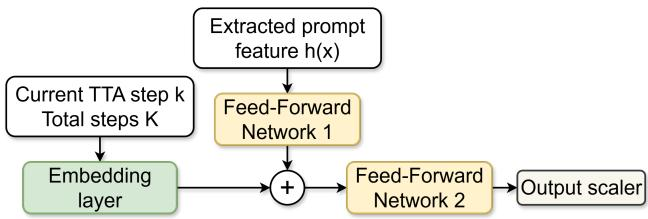
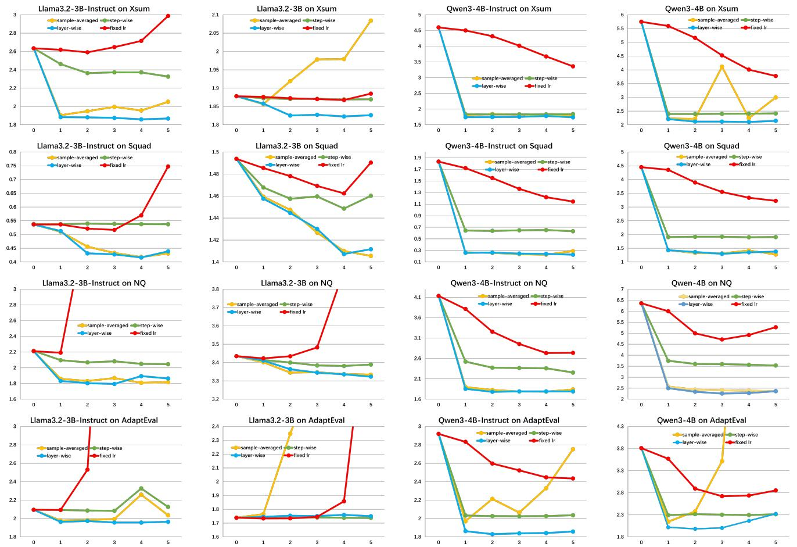

[← 返回 README](../README.md)

# 3. Proposed Method

# 3.1. Unsupervised Sample-Specific TTA for LLMs

Suppose an LLM parameterized by $\Theta$ is trained on a data distribution $p ( x )$ :

$$
L L M _ { \Theta } = \arg \operatorname* { m i n } _ { \Theta } \mathbb { E } _ { { x } \sim { p } ( { x } ) } \big [ - \log { P ( { x } ; \Theta ) } \big ] .
$$

At test time, LLM $P _ { \Theta }$ will be evaluated on a downstream distribution $q ( x , y )$ , from which a test-time prompt $x$ and the desired continuation/answer $y$ are sampled. By Bayes’ rule, the conditional distribution $q ( y \mid x )$ is determined by both the joint $q ( x , y )$ and the marginal $q ( x )$ :

$$
q ( y \mid x ) = { \frac { q ( x , y ) } { q ( x ) } } \propto q ( x ) { \mathrm { u n d e r } } { \mathcal { C } } ( x ) .
$$

> 💡 **批注**: 公式抽取有噪声，但意图清楚：只优化 prompt 边际 $q(x)$ 不自动等价于提升 $q(y|x)$。无监督 sample-specific TTA 的难点就在于没有 $y$，却希望 prompt 更新方向也利于 answer。

In the unsupervised setting where $y$ is unavailable, we seek a control method such that, under appropriate constraints $\mathcal C ( x )$ , adapting the model using only the observed prompt $x$ can still improve answer prediction. Intuitively, prompts and answers are often semantically aligned, so optimizing on $x$ can provide a useful learning signal for getting LLM prediction $P _ { \Theta } ( y \mid x )$ closer to ground truth $q ( y \mid x )$ .

Following (Hu et al., 2025a), we consider unsupervised testtime adaptation using the standard negative log-likelihood objective to update LLM parameterized by $\Theta$ . Backpropagation can be written as:

$$
\begin{array} { r } { \Theta ^ { \prime } = \Theta - \eta \nabla \Theta \Big ( - \log P ( x ; \Theta ) \Big ) . } \end{array}
$$

Here $\Theta ^ { \prime }$ denotes the new parameters after one prompt-only update on $x$ , and $\eta$ is learning rate. A first-order Taylor expansion of new conditional log probability $\log P _ { \Theta ^ { \prime } } ( y \mid x )$ using Eq. (3) yields:

$$
\log P _ { \Theta ^ { \prime } } ( y \mid x ) = \log P _ { \Theta } ( y \mid x ) + \eta \langle g _ { x } , \ g _ { y } \rangle + \mathcal { O } ( \eta ^ { 2 } ) .
$$

Here the cross-gradient term $\langle g _ { x } , \ g _ { y } \rangle$ is defined as the inner product between prompt gradient $g _ { x } ~ = ~ \nabla \Theta \log P ( x ; \Theta )$ and answer gradient $g _ { y } = \nabla _ { \Theta } \log P _ { \Theta } ( y \mid x )$ conditioned on the same prompt:

$$
\langle g _ { x } , g _ { y } \rangle : = { \Big \langle } \nabla _ { \Theta } \log P ( x ; \Theta ) , \nabla _ { \Theta } \log P _ { \Theta } ( y \mid x ) { \Big \rangle } .
$$

Our goal is to design a control mechanism that tries to guarantee $\langle g _ { x } , g _ { y } \rangle \geq 0$ , so that unsupervised TTA tends to increase the conditional log-likelihood, i.e., $\log  P _ { \Theta ^ { \prime } } ( y |$ $x ) \geq \log P _ { \Theta } ( y \mid x )$ .

> 💡 **推导批注**: 这是一阶近似下的核心条件：prompt gradient 和 answer gradient 同向，prompt-only NLL 才会帮答案。SCALENET 不能直接看到 $g_y$，训练时用 answer loss 学出从 $x$ 到 update scale 的映射，推理时再只依赖 $x$。

Figure 2. Simple control hypernetwork: SCALENET architecture.

> 💡 **Figure 2 批注**: SCALENET 架构刻意简单，重点不是网络容量，而是输出结构：每个 LoRA matrix / layer / step 都有 scaler。这让实验里的 step-wise ablation 很关键，因为它能排除“只是学了一个普通 schedule”的解释。

In general, TTA can be viewed as a special case of finetuning performed at inference time. Updating all LLM parameters on a single prompt is not only computationally prohibitive, but also conceptually inappropriate, as it can easily cause severe overfitting. We therefore adopt the widely used LoRA (Hu et al., 2021) parameterization:

$$
W ^ { \prime } = W + \Delta W , \Delta W = B A .
$$

where $W \in \mathbb { R } ^ { d _ { \mathrm { o u t } } \times d _ { \mathrm { i n } } }$ is a frozen weight matrix, and $A \in$ $\mathbb { R } ^ { r \times d _ { \mathrm { i n } } }$ , $B \in \mathbb { R } ^ { d _ { \mathrm { o u t } } \times r }$ are trainable low-rank factors with rank $r \ll \operatorname* { m i n } ( d _ { \mathrm { o u t } } , d _ { \mathrm { i n } } ) .$ . Given all trainable LoRA parameters $\Phi$ , Eq. (3) becomes:

$$
\Phi ^ { \prime } = \Phi - \eta \nabla _ { \Phi } \Big ( - \log P ( x ; \Phi ) \Big ) .
$$

> 💡 **LoRA 批注**: LoRA 把 sample-specific update 限制在低秩子空间，避免单 prompt 梯度直接改 backbone。本文后续只在 attention Q/V projection 上做这个更新，说明它把“临时适应能力”和“基础模型能力保护”作为第一工程约束。

Because prompts can vary drastically across instances, we study sample-specific test-time adaptation, treating each prompt as an independent adaptation episode. Concretely, for each test prompt $x$ , we start with a fresh set of LoRA factors by re-initializing the low-rank matrix $\Delta W = B A$ to zero (e.g. $B = 0$ and $A$ random), run a small number of gradient steps, generate the response $y$ with the adapted parameters, and then discard the adaptation state. This adapt-and-reset protocol separates unrelated queries and matches real-world interactive usage.

> 💡 **adapt-and-reset 批注**: 每个 prompt 的 LoRA 初始 $\Delta W=0$，更新后立刻丢弃。这避免跨样本污染，但也意味着每个 prompt 都必须在最多 5 步内完成有效适应，进一步放大 LR 选择的重要性。

# 3.2. Layer-wise Hypernetwork Control

How to find the correct constraint $\mathcal { C } ( \boldsymbol { x } ) \boldsymbol { ? }$ Eq. (2) exposes a fundamental challenge of unsupervised TTA: adapting on $x$ inevitably increases the model’s probability mass on the observed prompt, effectively boosting the marginal term $q ( x )$ . Such an increase improves the conditional probability of $y$ given $x$ only if the joint probability $q ( x , y )$ increases even more—that is, the update must amplify $q ( x , y )$ beyond the marginal gain on $q ( x )$ :

$$
{ \frac { q ^ { \prime } ( x , y ) } { q ( x , y ) } } > { \frac { q ^ { \prime } ( x ) } { q ( x ) } } .
$$

where $\boldsymbol { q } ^ { \prime } ( \boldsymbol { x } , \boldsymbol { y } )$ and $q ^ { \prime } ( x )$ are the joint and marginal distributions after TTA. In the absence of gold answers, it is difficult to handcraft constraints that reliably enforce this condition.

> 💡 **约束批注**: 这一段解释了为什么固定 LR 是过粗的约束。它既无法判断 prompt NLL 的收益是否会转移到 answer，也无法知道哪些层的更新会破坏条件分布。

Nevertheless, prompts and answers are not independent: paired $( x , y )$ are inherently coupled through semantics and task structure. It is thus natural to infer useful properties of $( x , y )$ from $x$ alone, and neural networks are well suited to capture these hard-to-specify relationships. This idea remains consistent with our unsupervised TTA setting: the gold answer is used only during training to teach a neural network how to infer useful properties of $( x , y )$ from $x$ , and it is never accessed during real test-time adaptation.

> 💡 **监督边界批注**: “推理无监督”和“训练控制器有监督”要分开看。SCALENET 的训练依赖 $(x,y)$，因此它更像 meta-learned controller；实际 TTA episode 里才是只看 $x$。

Moreover, revisiting the next-token prediction objective shows that, although the unsupervised loss is written as $\log { P ( x ; \Theta ) }$ , it is actually computed token-wise, i.e., a collection of conditional prediction tasks rather than a “true” probability of the prompt as a whole (Radford et al., 2019):

$$
\sum _ { t } \log P ( x _ { t } \mid x _ { < t } ; \Theta )
$$

Therefore, unsupervised TTA primarily updates the model to better match conditional distributions under the context induced by $x$ , and it may be reasonable to expect that these conditional distributions can transfer from observed prompt tokens to unseen answer tokens by increasing:

$$
\log P _ { \Theta } ( y \mid x ) \approx \sum _ { t } \log P _ { \Theta } ( y _ { t } \mid x , y _ { < t } ) .
$$

> 💡 **input perplexity 批注**: 这里给 prompt NLL 作为代理目标的正当性：它不是拟合整段 prompt 的静态概率，而是在 prompt 上做一组条件 next-token 任务。对于 XSum/SQuAD 这种答案信息主要在 prompt 内的任务，迁移更可能成立；NQ-Open/AdaptEval 更依赖外部知识或推理，所以收益更不稳定。

To make it clear, we introduce a hypernetwork $\mathcal { H } _ { \psi } ( x )$ parameterized by $\psi$ that always takes $x$ as input to produce the constraint $\mathcal { C }$ from the prompt:

$$
{ \mathcal C } ( x ) = { \mathcal H } _ { \psi } ( x ) .
$$

The training objective of hypernetwork would be to find an optimum solution $\psi ^ { \star }$ minimizing answer loss after TTA:

$$
\psi ^ { \star } \ = \ \arg \operatorname* { m i n } _ { \psi } \ \mathbb { E } _ { ( x , y ) \sim q ( x , y ) } \Big [ f \big ( \Theta ^ { \prime } ( x , \mathcal { C } ( x ) ) , y \big ) \Big ] .
$$

Here $\Theta ^ { \prime } ( x , \mathcal { C } ( x ) )$ denotes the parameters of LLM after applying the unsupervised TTA (e.g., one or multiple gradient steps on $x$ ) under constraint $\mathcal C ( x )$ , starting from the base parameters $\Theta$ ; $f ( \Theta ^ { \prime } ( x , \mathcal { C } ) , y )$ denotes the LLM loss referenced on gold answer.

> 💡 **训练目标批注**: 超网络优化的是 post-adaptation answer loss，而 TTA inner loop 优化的是 prompt loss。这个双层结构让它能学“哪些 prompt-only 更新真的会帮助 answer”，但也带来 dataset-model pair 训练成本。

Among all the constraints in TTA, we choose “learning rate”, one of the most straightforward yet critical control signals, as the to-be-optimized hypernetwork output $\mathcal { C }$ Considering that TTA typically allows only a handful of gradient steps, it often requires a learning rate far larger than standard fine-tuning; otherwise, with a conventional rate (e.g., $1 0 ^ { - 5 }$ ) and only a few updates (e.g., three), the resulting parameter change is effectively negligible. While the number of TTA steps also affects performance, it is usually a less trainable hyper-parameter: empirically, gains increase with additional steps but saturate quickly.

> 💡 **LR 批注**: 这解释了为什么 base TTA LR 取 $10^{-2}$ 而不是 fine-tuning 常见 $10^{-5}$。少步更新必须大，但“大”又危险，所以学习 multiplier 比直接固定大 LR 更自然。

In this paper, we focus on transformer-based LLMs, which remain the dominant architecture in current practice and are composed of many stacked transformer layers (Bommasani et al., 2022). We propose that a single global TTA learning rate is a coarse (or even bad) control knob because gradient characteristics and update sensitivity can vary substantially across layers and steps, and that a multiplicative layer-wise scaling of the learning rate at each TTA step is a better optimizable constraint for achieving larger TTA gains while maintaining stability.

Formally speaking, let $L$ denote the number of layers and $k \in \{ 1 , \ldots , K \}$ the current TTA step out of a planned total of $K$ steps. Constraint $\mathcal { C }$ is now defined as a layer-wise learning-rate scaler predicted at each TTA step:

$$
\begin{array} { r } { \mathcal { C } = \{ s ^ { ( k ) } \} _ { k = 1 } ^ { K } , \quad s ^ { ( k ) } = \mathcal { H } _ { \psi } ( x , k , K ) \in \mathbb { R } _ { \ge 0 } ^ { L } . } \end{array}
$$

Trainable LoRA parameters $\Phi$ are then decomposed into $\Phi = \{ \phi _ { \ell } \} _ { \ell = 1 } ^ { L }$ ( $\ell$ is layer index) and with the base learning rate $\eta$ , our layer-wise dynamic TTA update at layer $\ell$ , step $k$ reads:

$$
\phi _ { \ell } ^ { ( k + 1 ) } = \phi _ { \ell } ^ { ( k ) } - \eta s _ { \ell } ^ { ( k ) } \nabla _ { \phi _ { \ell } } \Big ( - \log P ( x ; \Phi ^ { ( k ) } ) \Big ) .
$$

> 💡 **layer-wise control 批注**: 这个公式是全文方法核心。固定 LR 是 $s_\ell^{(k)}=1$，step-wise schedule 是 $s^{(k)}$ 不随 layer 变；本文让 $s_\ell^{(k)}$ 同时随 prompt、step、layer 变化，并且实际实现还区分 Q/V LoRA matrix。

# 3.3. Dynamic Control Framework

We now describe the hypernetwork $\mathcal { H } _ { \psi }$ named as SCALENET and its framework in detail. Unsupervised, layer-wise dynamic test time adaptation consists of several stages that alternate in a loop (Figure 1). First, the LLM performs a forward pass on the prompt $x$ . Next, the hypernetwork outputs a dynamic learning-rate scaler. Then, the query and value weight matrices1 in each transformer layer of the LLM undergo LoRA fine-tuning based on the next-token-prediction negative log-likelihood of the prompt, using a learning rate adjusted by the hypernetwork output. This loop is repeated for $K$ times until the scheduled testtime adaptation is finally finished.

> 💡 **数据流批注**: 每个 TTA step 都是 forward → scaler → prompt NLL backward → Q/V LoRA update。SCALENET 在更新前给出这一步的 LR multiplier，因此它控制的是更新幅度，不改变 loss 形式。

As mentioned in Eq. (13), SCALENET takes the prompt $x$ , the current TTA step $k$ , and the total scheduled number of TTA steps $K$ as input. Note that, to reduce computational burden and as a proof of concept, we feed it a fixed-length prompt representation $h ( x )$ extracted from the LLM forward pass, rather than the full embedded prompt. In our implementation, $h ( x ) \in \mathbb { R } ^ { 2 d }$ concatenates the meanpooled first-layer and last-layer token embeddings, where each hidden-state sequence $H ^ { ( \ell ) } ( x ) \ \in \ \mathbb { R } ^ { T \times d }$ has token

length $T$ and hidden size $d$ :

$$
h ( \boldsymbol { x } ) = \Big [ \mathrm { M e a n } ( H ^ { ( 0 ) } ( \boldsymbol { x } ) ) ; \mathrm { M e a n } ( H ^ { ( L ) } ( \boldsymbol { x } ) ) \Big ] .
$$

Here, $H ^ { ( 0 ) } ( x )$ and $H ^ { ( L ) } ( x )$ denote the first- and last-layer hidden-state sequences for the prompt.

> 💡 **表示批注**: 只用首层/末层 mean pooling 是很轻的 prompt summary，可能抓住词面分布和高层语义，但会丢掉局部结构、问题类型和梯度统计。后续若要提升跨任务泛化，可以把 gradient norm、prompt perplexity、task cue 等也喂给控制器。

Still, as a proof of concept, architecture of SCALENET is kept simple: a two-layer MLP followed by a non-negative output parameterization, since learning-rate scales must be non-negative. Concretely, for each LoRA matrix $\Delta W _ { i }$ at step $k$ , we map its unconstrained output ${ \alpha _ { i } ^ { ( k ) } }$ (optionally with a safety maximum clamp to avoid extreme values) for that block into a non-negative value via:

$$
s _ { i } ^ { ( k ) } = g \Big ( \alpha _ { i } ^ { ( k ) } \Big ) , \quad g ( a ) = \left\{ \exp ( a ) , \begin{array} { l l } { { a \leq 0 , } } \\ { { 1 + a + { \frac { 1 } { 2 } } a ^ { 2 } , } } & { { a > 0 . } } \end{array} \right.
$$

We randomly draw $K$ uniformly from $\{ 0 , 1 , \ldots , K _ { \operatorname* { m a x } } \}$ each time to support diverse TTA schedules and observe the trend.

> 💡 **非负 scaler 批注**: scaler 只改变梯度步长，不反转 prompt loss 的梯度方向。它能抑制或放大某层更新，但不能主动沿 answer gradient 反方向修正；因此它的能力边界受 prompt gradient 本身质量限制。

First-order Approximation. In our training framework, the hypernetwork is updated using a supervision loss computed after running $K$ LoRA updates on LLM. Hence, optimizing hypernetwork parameters $\psi$ requires differentiating the post-adaptation answer loss $f ( y ; \Phi ^ { ( K ) } )$ through $K$ unrolled TTA updates. One TTA update from step $k$ into step $k + 1$ using prompt loss $f ( x ; \Phi ^ { ( K ) } )$ can be expressed as:

$$
\begin{array} { r } { \Phi ^ { ( k + 1 ) } = \Phi ^ { ( k ) } - \eta s ^ { ( k ) } ( x , k , K ; \psi ) \nabla _ { \Phi } f ( x ; \Phi ^ { ( k ) } ) . } \end{array}
$$

Differentiating Eq. (17) yields second-order dependency because $\nabla _ { \Phi } f ( x ; \Phi ^ { ( k ) } )$ depends on $\psi$ again as LLM trainable parameters $\Phi ^ { ( k ) } ( \psi )$ already depend on SCALENET parameters $\psi$ :

$$
\frac { \partial } { \partial \psi } \nabla _ { \Phi } f ( x ; \Phi ^ { ( k ) } ) = \nabla _ { \Phi } ^ { 2 } f ( x ; \Phi ^ { ( k ) } ) \frac { \partial \Phi ^ { ( k ) } } { \partial \psi } .
$$

This second-order Hessian product is expensive and often unsupported by memory-efficient kernels used in modern LLMs (e.g., FlashAttention). So we instead adopt a firstorder approximation by dropping the second-order path in Eq. (18), i.e., we treat prompt gradient $\nabla _ { \Phi } f ( x ; \Phi ^ { ( k ) } )$ as constant with respect to $\psi$ . As a result, differentiating Eq. (17) while ignoring $\begin{array} { r l r } {  { \frac { \partial } { \partial \psi } \nabla _ { \Phi } f ( \boldsymbol { x } ; \Phi ^ { ( k ) } ) } } \end{array}$ yields:

$$
\frac { \partial \Phi ^ { ( k + 1 ) } } { \partial \psi } \approx \frac { \partial \Phi ^ { ( k ) } } { \partial \psi } - \eta \frac { \partial s ^ { ( k ) } ( x , k , K ; \psi ) } { \partial \psi } \nabla _ { \Phi } f ( x ; \Phi ^ { ( k ) } ) .
$$

Now gradients to $\psi$ flow only through the explicit dependence of the update magnitudes on $s ^ { ( k ) } ( x , k , K ; \psi )$ , without requiring second-order derivatives.

> 💡 **first-order 批注**: 训练 SCALENET 原本是 MAML 式 unrolled optimization，会出现 Hessian-vector product；这里丢掉“prompt gradient 随 $\psi$ 变化”的路径，只让 answer loss 告诉 scaler 大小该怎么调。代价是近似偏差，收益是能用现代 LLM kernel 跑得动。

Figure 3. NLL results. The vertical axis shows the average negative log-likelihood (NLL) per answer token, and the horizontal axis shows the number of TTA steps. The red curve is the na¨ıve fixed-learning-rate baseline. Green and blue correspond to layer-agnostic/step-wise and layer-wise SCALENET; yellow corresponds to sample-averaged layer-wise SCALENET.

> 💡 **Figure 3 预读**: 把 Figure 3 放在方法末尾很有用：红线 fixed LR 的曲线形状就是本文要解决的问题，蓝线 layer-wise 与绿线 step-wise 的差距则是层级控制的主要证据。
