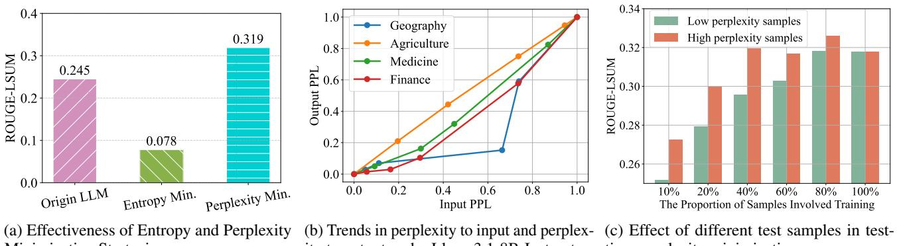

[← 返回 README](../README.md)

# 3. Problem Formulation

Without loss of generality, let $P ( x )$ denote the distribution of the training data $\{ x _ { i } \} _ { i = 1 } ^ { N }$ , where $x _ { i } \sim P ( x )$ . The $f _ { \Theta ^ { \mathrm { o } } } ( x )$ represent a general Large Language Model (LLM) that has been supervised fine-tuned (SFT) on labeled training data $\{ ( x _ { i } , y _ { i } ) \} _ { i = 1 } ^ { N }$ , with parameters $\Theta ^ { \circ }$ . During training, the model $f _ { \Theta ^ { \mathrm { o } } } ( x )$ is optimized to generate coherent and contextually appropriate sequences by predicting the next token in an autoregressive manner, effectively fitting the training data and generalizing to test data from the same distribution $x \sim P ( x )$ . However, in real-world deployments, the distribution of test data may differ significantly from the training distribution due to various factors, leading to a phenomenon known as distribution shift. For general LLMs (e.g., LLaMA and Qwen), two primary types of out-of-distribution (OOD) scenarios can occur during inference: 1) Vertical Domain Shift: This occurs when test data contains domain-specific terminology, such as in medical, legal, or technical fields, which the model was not explicitly trained on, impairing its performance. 2) Distributional Shift in Non-Specific Domains: Even without a specific vertical domain, factors like user intent variations and linguistic diversity (e.g., dialects, slang) can shift test data distribution from training data, affecting model understanding and response generation. In these cases, the generative performance of the model $f _ { \Theta ^ { \mathrm { o } } } ( x )$ may deteriorate significantly because the model has not been explicitly trained to handle such distribution shifts, resulting in less coherent or contextually appropriate text generation on OOD test samples $x \sim Q ( x )$ , where $Q ( x ) \neq P ( x )$ .

> 💡 **问题设定**: $P(x)$ 到 $Q(x)$ 的 shift 是 TLM 的触发条件；如果测试分布本来与训练分布一致，测试时更新就可能变成无收益甚至破坏原能力。

Test-Time Learning (TTL) seeks to improve the performance of LLMs in the target domain by adjusting the model using only test data. Specifically, given a set of OOD test samples $\{ x _ { j } \} _ { j = 1 } ^ { M }$ , where $x _ { j } \sim Q ( x )$ , the goal of TTL is to optimize the model parameters $\Theta$ to improve the quality and coherence of generated text for these test samples. Formally, TTL can be framed as the following optimization problem, where the objective is to minimize an unsupervised criterion defined over the test data:

> 💡 **无监督目标的难点**: TTL 只能优化 $L(x;\Theta)$，看不到 $y$，所以后文必须论证 input perplexity 下降能带来 output quality 改善。

$$
\operatorname* { m i n } _ { \overline { { \Theta } } } \mathcal { L } ( x ; \Theta ) , x \sim Q ( x ) ,
$$

where ${ \overline { { \Theta } } } \subseteq \Theta$ represents the subset of model parameters to be updated during the TTL. The TTL objective $\mathcal { L } ( \cdot )$ can take various forms, such as minimizing the perplexity. The key challenge of TTL is to design efficient adaptation strategies that can utilize unlabeled test data to improve performance on OOD samples while maintaining training efficiency and effectively mitigating catastrophic forgetting.

> 💡 **Figure 1 的作用**: 三个 observation 分别支撑目标函数、样本选择和参数更新范围，是后续算法设计的证据链。

Minimization Strategies.

  
ity to output under Llama3.1-8B-Instruct. time perplexity minimization.   
Figure 1. Summary of our exploration and observations: (a) demonstrates that perplexity minimization improves the performance of LLMs, while entropy minimization (Wang et al., 2021) may harm their performance; (b) reveals that the trend of LLM’s perplexity to the input ${ \mathcal { P } } ( x )$ and perplexity to the output $\mathcal { P } ( y | x )$ is the same (results are normalized), i.e., we can $\operatorname* { m i n } _ { \Theta } \mathcal { P } ( y | x ; \Theta )$ by $\operatorname* { m i n } _ { \Theta } \mathcal { P } ( x ; \Theta )$ ; and (c) emphasizes that training on high-perplexity samples makes more contribution than low-perplexity ones.
