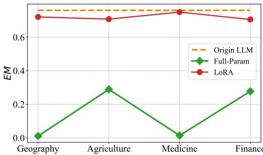

[← 返回 README](../README.md)

# 4. Test-Time Learning for LLMs

In this paper, we propose a Test-Time Learning (TTL) method for Large Language Models (LLMs) called TLM, which dynamically adapts LLMs using only unlabeled test data. The pipeline of TLM is shown in Algorithm 1, our proposed TLM is composed of three key components. 1) Input Perplexity Minimization Objective: Inspired by the strong correlation between input perplexity and output perplexity, we adopt input perplexity minimization as the optimization objective. This enables LLMs to better fit the target data distribution during test time, as detailed in Sec. 4.1. 2) Sample-Efficient Learning Strategy: Not all test samples equally impact model updates. Employing a perplexitybased weighting scheme, the model actively selects and emphasizes high-perplexity test samples for backpropagation, thereby enabling efficient parameter updates during Test-Time Learning (c.f. Sec. 4.2). 3) Lightweight Parameter Updates via LoRA: To mitigate catastrophic forgetting and reduce computational costs, we integrate LoRA into TTL. By updating only a small subset of model parameters, LoRA enables lightweight training and effectively mitigates catastrophic forgetting, making our proposed method suitable for real-world deployment $\cdot . f .$ Sec. 4.3).

> 💡 **算法级数据流**: 测试 batch 先生成预测，再根据输入 perplexity 计算选择/权重，最后只更新 LoRA 参数；输出不是单纯前向结果，而是带有测试域自适应状态的结果。

# 4.1. Perplexity Minimization for Test-Time Learning

Perplexity (Bengio et al., 2000) is a widely used measure in language modeling that quantifies how well a model predicts a sequence of tokens (Devlin et al., 2019; Brown et al., 2020). Given a sequence of tokens $\{ x _ { 1 } , x _ { 2 } , . . . , x _ { T } \}$ , the perplexity $\mathcal { P }$ is defined as the exponentiation of the average negative log-likelihood of the predicted tokens:

$$
\begin{array} { r } { \mathcal { P } \big ( \{ x _ { 1 } , x _ { 2 } , . . . , x _ { T } \} \big ) = e ^ { \big ( - \frac { 1 } { T } \sum _ { t = 1 } ^ { T } \log p ( x _ { t } | x _ { 1 : t - 1 } ; \Theta ) \big ) } , } \end{array}

> 💡 **input perplexity minimization 的含义**: 对无标签输入做 next-token likelihood 最大化，相当于让模型更会“读懂”当前测试域文本；这是一种自监督目标，不需要答案标签。
$$

where $\log p ( x _ { t } | x _ { 1 : t - 1 } ; \Theta )$ is the conditional probability of predicting token $t _ { i }$ given the previous tokens, parameter-

# Algorithm 1 The pipeline of proposed TLM.

Input: Test samples $\mathcal { D } _ { T e s t } = \{ x _ { j } \} _ { j = 1 } ^ { M }$ , the trained LLM $f _ { \Theta } ( \cdot )$ , LoRA $\Delta \Theta$ with trainable parameters $\boldsymbol { B }$ and $\mathcal { A }$ batch size $B$ .   
1: Initialize LoRA parameters $\Delta \Theta$ .   
2: Add LoRA parameters to trained LLM $\tilde { \Theta } = \Theta + \Delta \Theta$ .   

> 💡 **代理目标假设**: 关键假设是 $P(x)$ 与 $P(y|x)$ 的变化趋势相关；如果某些任务答案依赖输入之外的知识或推理规则，这个代理关系可能变弱。
3: for a batch $\mathcal { X } = \{ x _ { b } \} _ { b = 1 } ^ { B }$ do   
4: Calculate predictions $\tilde { y }$ for all $x \in \mathcal { X }$ via $f _ { \Theta } ( \cdot )$ .   
5: Calculate sample selection score $S ( x )$ via Eqn. (6).   
6: Update LLM $\bar { ( \Theta ) }$ with Eqn.(5).   

> 💡 **高困惑度样本效率**: 高 perplexity 样本更像当前模型尚未覆盖的测试域信号，给它们更大权重可以减少在容易样本上的反向传播预算浪费。
7: end for

Output: The output answer $\{ \tilde { y } \} _ { j = 1 } ^ { M }$ for all $x \in \mathcal { D } _ { T e s t }$ ized by $\Theta$ . A lower perplexity indicates that the model’s predictions are more confident and closely align with the true distribution of the data, which implies better model fitting (Jumelet & Zuidema, 2023). Therefore, for a given question-answer pair $\{ x , y \}$ , minimizing the perplexity of the model’s response $y$ can enhance the model’s ability to fit the target data distribution, leading to improved performance on out-of-distribution (OOD) data. Specifically, by minimizing the perplexity $\mathcal { P } ( \boldsymbol { y } | \boldsymbol { x } ; \Theta )$ of the answer $y$ given the input $x$ , which can be formulated as:

$$
\operatorname* { m i n } _ { \Theta } \mathcal { P } ( y | x ; \Theta ) = \operatorname* { m i n } _ { \Theta } e ^ { ( - \frac { 1 } { T } \sum _ { t = 1 } ^ { T } \log p ( y _ { t } | x , y _ { 1 : t - 1 } ; \Theta ) ) } .
$$

This minimization process improves the model’s performance in the target data distribution. However, during the testing phase, we can only access the user’s input $x$ and not the ground truth output $y$ . To address this limitation, we hypothesize that minimizing the perplexity of the input $x$ , denoted as $\operatorname* { m i n } _ { \Theta } \mathcal { P } ( x ; \Theta )$ , may reduce the perplexity of the model’s response $y$ . The mathematical justification for this transformation is based on the assumption that the model parameters $\Theta$ influence both $\mathcal { P } ( \boldsymbol { y } | \boldsymbol { x } ; \boldsymbol { \Theta } )$ and $\mathcal { P } ( x ; \Theta )$ in a related manner, which can be described as follows:

> 💡 **LoRA 与稳定性**: LoRA 把更新限制在低秩增量里，降低全参更新对原始知识的扰动；但它也限制了适应容量，所以极端 domain shift 可能需要更强的更新机制。

Assumption 1 (Autoregressive Property): The LLM generates each token $y _ { t }$ based on the input $x$ and previously generated tokens $y _ { 1 : t - 1 }$ : $\mathcal { P } ( y _ { t } | x , y _ { 1 : t - 1 } ; \Theta )$ . The standard next-token prediction objective makes model predictions inherently conditional on previous context quality.

Assumption 2 (Shared Parameter Influence): LLM parameters $\Theta$ influence both the input perplexity $\mathcal { P } ( x ; \Theta )$ and the conditional output perplexity $\mathcal { P } ( \boldsymbol { y } | \boldsymbol { x } ; \Theta )$ . This assumption is valid across various LLM architectures, such as encoder-only and decoder-only models.

Reducing Output Perplexity through Input Perplexity Minimization. Minimizing the perplexity to the input $\mathcal { P } ( x ; \Theta )$ is equivalent to maximizing the input generation probability $P ( x ; \Theta )$ . We employ a gradient-based theoretical analysis to formalize the intuition that questionconditioned updates benefit answer predictions, based on a key assumption. Let $\Theta ^ { \prime } = \Theta - \eta \nabla \Theta \big ( - \log P ( \boldsymbol { x } ; \Theta ) \big )$ denote the updated parameters after a single TTL step. Using a first-order Taylor expansion:

$$
\begin{array} { r l r } { \log P _ { \Theta ^ { \prime } } ( y | x ) } & { \approx \mathcal { O } ( \eta ^ { 2 } ) + \log P _ { \Theta } ( y | x ) } & { ( 4 } \\ & { } & { + \eta \underbrace { \left[ \nabla _ { \Theta } \log P ( x ; \Theta ) \right] ^ { \top } \nabla _ { \Theta } \log P _ { \Theta } ( y | x ) } _ { \mathrm { C r o s s - g r a d i e n t t e r m } } , } \end{array}
$$

where $y$ is the answer to the question $x$ . Our core assumption is that $\langle \nabla _ { x } , \nabla _ { y } \rangle = \left[ \nabla _ { \Theta } \log P ( x ; \theta ) \right] ^ { \top } \nabla _ { \Theta } \log P _ { \Theta } ( y | x ) \ge$ 0 for question-answer pairs with strong semantic alignment. Under this condition, the cross-gradient term becomes nonnegative, guaranteeing: $\log P _ { \Theta ^ { \prime } } ( y | x ) \ge \log P _ { \Theta } ( y | x )$ for small $\eta$ (We compute the gradient inner product using 400 batches (batch size $= 5 0$ ) of QA pairs from the Domain-Bench on LLaMA3.1-8B. Results show $9 8 . 7 5 \%$ of batchsamples satisfy the non-negativity condition, with average $\langle \nabla _ { x } , \nabla _ { y } \rangle = + 5 . 6 0 )$ .

This form is consistent with the autoregressive property in Assumption 1. Naturally, based on the Shared Parameter Influence in Assumption 2, minimizing $\mathcal { P } ( x ; \Theta )$ enhances the model’s overall understanding and representation of $x$ . This improved representation facilitates more accurate and confident next-token predictions, which is expected to reduce $\mathcal { P } ( \boldsymbol { y } | \boldsymbol { x } ; \boldsymbol { \Theta } )$ . To further investigate this, we conduct a preliminary study, leading to the following observation:

Observation 1: Trend of LLM’s perplexity to the input $\mathcal { P } ( x ; \Theta )$ and perplexity to the output $\mathcal { P } ( \boldsymbol { y } | \boldsymbol { x } ; \Theta )$ is the same. In the context of LLMs, it is observed that the perplexity associated with the input $\mathcal { P } ( x ; \Theta )$ and the perplexity of the output $\mathcal { P } ( \boldsymbol { y } | \boldsymbol { x } ; \boldsymbol { \Theta } )$ exhibit similar trends. Specifically, we compute the trends of the perplexity of the input $\mathcal { P } ( x ; \Theta )$ and the perplexity of the output $\mathcal { P } ( \boldsymbol { y } | \boldsymbol { x } ; \boldsymbol { \Theta } )$ on the four collected vertical domain datasets (see Supp. B) using Llama3.1-8b-Instruct (Dubey et al., 2024) with varying degrees of training (for ease of presentation, we show the normalized results here). As shown in Figure 1b, the relationship between input perplexity $\mathcal { P } ( x ; \Theta )$ and output perplexity $\mathcal { P } ( \boldsymbol { y } | \boldsymbol { x } ; \Theta )$ demonstrates a strong positive correlation across all four vertical domains. This indicates that reducing output perplexity is possible by minimizing input perplexity in LLMs.

  
Figure 2. Comparison of prevent forgetting on DomainBench under Llama3.1-8B-Instruct. This observation reveals that LoRA (Hu et al., 2022) prevents catastrophic forgetting more effectively than Full-Param updates across DomainBench (see Supp. B).

# 4.2. Sample Efficient Learning Strategy

Minimizing input perplexity $\mathcal { P } ( x ; \Theta )$ can enhance the performance of LLMs on target distribution data, as shown in Sec. 4.1. However, our intuition is that different test samples may produce varying effects during Test-Time Learning. To investigate this, we conduct a preliminary study, leading to the following observation:

Observation 2: High-perplexity samples contribute more to LLM updates than low-perplexity ones. We select different proportions of samples (the samples are pre-sorted according to their perplexity values $\mathcal { P } ( x ; \Theta ) )$ for Test-Time Learning, and the resulting model is evaluated on all test samples. As shown in Figure 1c, we find that: 1) training the test samples with high-perplexity makes more contribution than low-perplexity ones, and 2) training on test samples with very low-perplexity may hurt performance. The possible reason is that low-perplexity samples are already well-modeled by the pre-trained LLMs, offering little new information for further learning, which could lead to overfitting or a lack of generalization. In contrast, highperplexity samples present more challenging data, driving greater adaptation during Test-Time Learning.

Based on Observation 2, we propose a Sample Efficient Learning Strategy to actively select samples for backpropagation, thereby enabling efficient Test-Time Learning. Specifically, we design an active sample selection score for each sample, denoted as $S ( x )$ . The criterion is that a sample should be informative for Test-Time Learning, providing enough information to drive the model’s learning process, referred to as an informative sample. By setting $S ( x ) = 0$ for uninformative samples, we can reduce unnecessary backpropagation computations during Test-Time Learning, thereby improving the overall efficiency. Relying on the sample score $S ( x )$ , we use perplexity loss for model training. Then, the sample-efficient perplexity minimization is to minimize the following objective:

Table 2. Comparison of experimental results on the DomainBench and InstructionBench of the AdaptEval (see Supp. B). We mark the better scores in bold for better visualization and easier interpretation.   

<table><tr><td rowspan="2">Method</td><td colspan="4">DomainBench</td><td colspan="3">InstructionBench</td></tr><tr><td>Geography</td><td>Agriculture</td><td>Medicine</td><td>Finance</td><td>Alpaca-GPT4</td><td>Dolly</td><td>InstructionWild</td></tr><tr><td>Llama3.2-3B-Instruct</td><td>0.2395</td><td>0.0850</td><td>0.1411</td><td>0.2229</td><td>0.3564</td><td>0.3378</td><td>0.2562</td></tr><tr><td>Tent</td><td>0.1825</td><td>0.0150</td><td>0.1571</td><td>0.1093</td><td>0.0336</td><td>0.2105</td><td>0.0264</td></tr><tr><td>EATA</td><td>0.0064</td><td>0.0227</td><td>0.0259</td><td>0.0149</td><td>0.1410</td><td>0.0090</td><td>0.0122</td></tr><tr><td>COME</td><td>0.1000</td><td>0.1181</td><td>0.1542</td><td>0.1200</td><td>0.0437</td><td>0.2186</td><td>0.0697</td></tr><tr><td>TLM (Ours)</td><td>0.2893</td><td>0.1687</td><td>0.2308</td><td>0.2953</td><td>0.3883</td><td>0.3470</td><td>0.2824</td></tr><tr><td>Llama3-8B-Instruct</td><td>0.2450</td><td>0.0834</td><td>0.1265</td><td>0.2329</td><td>0.3752</td><td>0.3671</td><td>0.2608</td></tr><tr><td>Tent</td><td>0.0778</td><td>0.0067</td><td>0.0105</td><td>0.0372</td><td>0.2001</td><td>0.0036</td><td>0.0820</td></tr><tr><td>EATA</td><td>0.2081</td><td>0.0017</td><td>0.0127</td><td>0.1257</td><td>0.1397</td><td>0.1725</td><td>0.1088</td></tr><tr><td> COME</td><td>0.0048</td><td>0.0039</td><td>0.0301</td><td>0.0328</td><td>0.1424</td><td>0.0700</td><td>0.0240</td></tr><tr><td>TLM (Ours)</td><td>0.3212</td><td>0.1319</td><td>0.2372</td><td>0.3242</td><td>0.4274</td><td>0.3785</td><td>0.2932</td></tr><tr><td>Llama2-13B-chat</td><td>0.2182</td><td>0.0840</td><td>0.1315</td><td>0.2382</td><td>0.3741</td><td>0.2892</td><td>0.2781</td></tr><tr><td>Tent</td><td>0.0320</td><td>0.0196</td><td>0.1131</td><td>0.0049</td><td>0.0955</td><td>0.0076</td><td>0.1108</td></tr><tr><td>EATA</td><td>0.2800</td><td>0.0771</td><td>0.1348</td><td>0.1155</td><td>0.0811</td><td>0.0513</td><td>0.1006</td></tr><tr><td>COME</td><td>0.1981</td><td>0.0380</td><td>0.1239</td><td>0.0172</td><td>0.0806</td><td>0.0000</td><td>0.0189</td></tr><tr><td>TLM (Ours)</td><td>0.2668</td><td>0.1013</td><td>0.2179</td><td>0.2760</td><td>0.3966</td><td>0.3007</td><td>0.2865</td></tr><tr><td>Qwen2.5-7B-Instruct</td><td>0.2649</td><td>0.0981</td><td>0.1313</td><td>0.2739</td><td>0.4439</td><td>0.3121</td><td>0.2866</td></tr><tr><td>Tent</td><td>0.2362</td><td>0.1180</td><td>0.0524</td><td>0.1648</td><td>0.2132</td><td>0.1946</td><td>0.1710</td></tr><tr><td>EATA</td><td>0.2109</td><td>0.1203</td><td>0.1334</td><td>0.2846</td><td>0.0000</td><td>0.2056</td><td>0.1710</td></tr><tr><td> COME</td><td>0.2306</td><td>0.1180</td><td>0.0463</td><td>0.1780</td><td>0.3781</td><td>0.2182</td><td>0.1710</td></tr><tr><td>TLM (Ours)</td><td>0.3081</td><td>0.1652</td><td>0.2394</td><td>0.3311</td><td>0.4608</td><td>0.3177</td><td>0.3482</td></tr></table>

$$
\operatorname* { m i n } _ { \overline { { \Theta } } } S ( x ) \mathcal { P } ( x ; \Theta ) .
$$

To obtain the active sample selection score $S ( x )$ , we propose a perplexity-based weighting scheme to accurately identify reliable samples and emphasize their contribution to Test-Time Learning. Formally, the active sample selection score $S ( x )$ can be calculated as follows:

$$
\begin{array} { r } { S ( x ) = \lambda \cdot e ^ { [ \log \mathcal { P } ( x ; \Theta ) - \log \mathcal { P } _ { 0 } ] } \cdot \mathbb { I } _ { \left\{ \mathcal { P } ( x ; \Theta ) > \mathcal { P } _ { 0 } \right\} } ( \mathbf { x } ) , } \end{array}
$$

where $\mathbb { I } _ { \{ \cdot \} } ( \cdot )$ is an indicator function, $\lambda$ and $\mathcal { P } _ { 0 }$ are a predefined threshold. The above weighting function excludes low-perplexity samples from Test-Time Learning and assigns higher weights to high-perplexity test samples, enabling them to contribute more significantly to model updates. It is important to note that evaluating $S ( x )$ does not involve any gradient backpropagation.

# 4.3. Modulating Parameters for Test-Time Learning

Observation3: Low-Rank Adaptation prevents catastrophic forgetting more effectively than Full-Param updates during test-time learning. We conduct Test-Time

Learning on DomainBench (see Supp. B) using both Full-Param and Low-Rank Adaptation (LoRA) (Hu et al., 2022) updates, and evaluate the LLM’s performance on GSM8K (Cobbe et al., 2021). From Figure 2, we observe that LoRA, compared to Full-Param updates, better preserves the model’s originally learned general knowledge, thereby demonstrating a significant regularization effect. This is likely due to LoRA’s ability to fine-tune only a small subset of model parameters, which effectively reduces the risk of overfitting and catastrophic forgetting.

Based on Observation 3, we adopt the LoRA for Test-Time Learning, where the optimization objective is Eqn. 5 is modified accordingly as follows:

$$
\operatorname* { m i n } _ { \tilde { \Theta } } S ( x ) \mathcal { P } ( x ; \tilde { \Theta } ) = \operatorname* { m i n } _ { \Delta \Theta } S ( x ) \mathcal { P } ( x ; \Theta + \Delta \Theta ) ,
$$

where $\Delta \Theta = B \mathbf { A }$ is zero at the beginning of training, with A using random Gaussian initialization and $\boldsymbol { B }$ set to zero, and we update only $\Delta \Theta$ during the Test-Time Learning.
