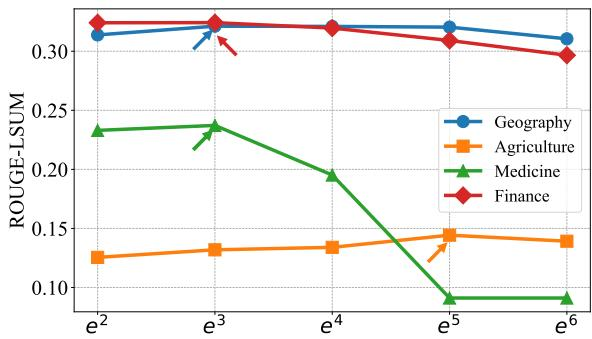

[← 返回 README](../README.md)

# 5. Experiments

# 5.1. Experimental Settings

Datasets. To evaluate the effectiveness of our TLM, we construct a comprehensive benchmark named AdaptEval, designed to cover diverse tasks and domains. AdaptEval consists of three categories of datasets. 1) DomainBench includes four vertical domain knowledge datasets: Geography, Agriculture, Medicine, and Finance, and is designed to evaluate the LLM adaptability to specialized fields. 2) InstructionBench contains three general-purpose instructionfollowing datasets: Alpaca-GPT4, Dolly, and Instruction-Wild, and focuses on the LLM adaptability to instructionbased tasks. 3) ReasoningBench comprises three reasoning capability datasets: GSM8K, MetaMath, and Logiqa, and aims to assess the LLM logical reasoning and problemsolving abilities. These datasets collectively form a diverse and challenging evaluation suite, designed to thoroughly assess the effectiveness of TLM in adapting LLMs to tasks requiring vertical knowledge, instruction-following capabilities, and logical reasoning under distribution shifts. More details can be found in Supp. B.

Table 3. Comparison experimental results on the ReasoningBench.   

> 💡 **AdaptEval 设计**: DomainBench、InstructionBench、ReasoningBench 分别对应专业知识、指令分布和推理能力，避免只在一个窄域证明 TTL 有效。

<table><tr><td rowspan="2">Method</td><td colspan="3">ReasoningBench</td></tr><tr><td>GSM8K</td><td>MetaMath</td><td>Logiqa</td></tr><tr><td>Llama3.2-3B-Instruct</td><td>0.7756</td><td>0.7976</td><td>0.4194</td></tr><tr><td>Tent</td><td>0.7726</td><td>0.7412</td><td>0.4012</td></tr><tr><td>EATA</td><td>0.0032</td><td>0.0310</td><td>0.0284</td></tr><tr><td>•COME</td><td>0.7710</td><td>0.7308</td><td>0.4196</td></tr><tr><td>TLM (Ours)</td><td>0.9096</td><td>0.8818</td><td>0.4572</td></tr><tr><td>Llama3-8B-Instruct</td><td>0.7610</td><td>0.6912</td><td>0.4550</td></tr><tr><td>Tent</td><td>0.7578</td><td>0.6550</td><td>0.4378</td></tr><tr><td>EATA</td><td>0.0250</td><td>0.5454</td><td>0.2192</td></tr><tr><td>COME</td><td>0.7479</td><td>0.6460</td><td>0.2180</td></tr><tr><td>TLM (Ours)</td><td>0.8074</td><td>0.7006</td><td>0.4868</td></tr><tr><td>Llama2-13B-chat</td><td>0.3458</td><td>0.2498</td><td>0.3992</td></tr><tr><td>Tent</td><td>0.2706</td><td>0.0040</td><td>0.2566</td></tr><tr><td>EATA</td><td>0.3392</td><td>0.0572</td><td>0.2606</td></tr><tr><td>•COME</td><td>0.3272</td><td>0.2646</td><td>0.2462</td></tr><tr><td>TLM (Ours)</td><td>0.3508</td><td>0.2576</td><td>0.4124</td></tr><tr><td>Qwen2.5-7B-Instruct</td><td>0.8378</td><td>0.7430</td><td>0.5952</td></tr><tr><td>Tent</td><td>0.8455</td><td>0.7412</td><td>0.5934</td></tr><tr><td>EATA</td><td>0.7098</td><td>0.0070</td><td>0.2172</td></tr><tr><td> COME</td><td>0.8556</td><td>0.7559</td><td>0.5908</td></tr><tr><td>TLM (Ours)</td><td>0.8424</td><td>0.7560</td><td>0.6046</td></tr></table>

Metrics. We use Rouge-Lsum (R-Lsum) (Lin, 2004) as the evaluation metric for DomainBench and InstructionBench, while Exact Match $( E M )$ (Chang et al., 2024) is used for ReasoningBench. More metrics can be found in Supp. C.1.

LLMs and Baseline. We use a diverse range of LLMs of varying sizes and types, including Llama3.2-3B-Instruct, Llama3-8B-Instruct (Dubey et al., 2024), Llama2-13B-Chat (Touvron et al., 2023a), and Qwen2.5-7B-Instruct (Yang et al., 2024). We evaluate our TLM against the baseline methods, Tent (Wang et al., 2021), EATA (Niu et al., 2022a), and COME (Zhang et al., 2025). They are state-of-the-art TTA methods that update model parameters using unlabeled data. We adapt Tent, EATA, and COME to the offline setting for a fair comparison. The implementation details can be found in the Supp. C.

> 💡 **比较对象**: Original LLM 检验是否适应有收益，Tent/EATA 检验传统 entropy-based TTA 是否适合 LLM；SFT/Oracle 设置则给出有标签上界参考。

Implementation Details. We use Adam as the update rule, with a batch size of 1 and the learning rate of $5 e { - } 5 /$ $5 e { - } 5 / \ 1 e { - } 6$ for DomainBench/ InstructionBench/ ReasoningBench. The $\lambda$ and $\mathcal { P } _ { 0 }$ in Eqn. 6 are set to 0.10 and $e ^ { 3 }$ To improve the stability of outputs produced by LLMs, we apply greedy decoding with a temperature of 0 across all experiments. More details in Supp. C.2. The source code is available at https://github.com/Fhujinwu/TLM

Table 4. Experimental results for the component of our proposed method on the DomainBench of the AdaptEval. The SEL means “Sample Efficient Learning Strategy” and the (·) indicates relative improvement over the result in the previous column.   

<table><tr><td>Version</td><td>Llama3-8B</td><td>Ours (w/o SEL)</td><td>Ours</td></tr><tr><td>Geography</td><td>0.2450</td><td>0.3190(+30.2%)</td><td>0.3212(+0.7%)</td></tr><tr><td>Agriculture</td><td>0.0834</td><td>0.1255(+50.5%)</td><td>0.1319(+5.1%)</td></tr><tr><td>Medicine</td><td>0.1265</td><td>0.2326(+83.9%)</td><td>0.2372(+2.0%)</td></tr><tr><td>Finance</td><td>0.2329</td><td>0.3222(+38.3%)</td><td>0.3242(+0.6%)</td></tr><tr><td>#Backwards</td><td></td><td>5000</td><td>4772(-4.6%)</td></tr></table>

# 5.2. Comparison Experiments

We compare our proposed TLM, the original LLM, Tent, EATA, and COME to demonstrate the superior performance of our method. We conduct experiments on different types of datasets, including DomainBench, InstructionBench, and ReasoningBench, as summarized in Table 2 and 3. More detailed results can be found in Supp. D.

> 💡 **主结果解读**: TLM 在 DomainBench 上相对原模型提升最明显，说明 input perplexity minimization 对专门领域文本分布最有效；在 instruction/reasoning 上收益更偏稳定改善。

Our proposed TLM is consistently better than the original LLMs. From Table 2 and 3, our method consistently outperforms the original LLMs across all types of datasets and different LLM architectures. For instance, on the four datasets of DomainBench, the proposed TLM achieves at least a $2 0 . 0 0 \%$ improvement over the original LLMs. Specifically, on the Geography dataset, our proposed TLM improves performance by a relative $2 0 . 7 9 \%$ $( 0 . 2 3 9 5 \ $ 0.2893) compared to Llama3.2-3B-Instruct.

Superior performance on Domain Knowledge Adaptation. To evaluate the effectiveness of our proposed TLM in adapting to vertical domain knowledge, we conduct experiments on DomainBench, which includes four datasets. From Table 2, the results demonstrate that the proposed TLM outperforms the original LLMs, Tent, and EATA, achieving significant performance improvements. For example, in test-time updating of model parameters on Qwen2.5-7B-Instruct, the proposed method yields a relatively $3 7 . 3 2 \%$ $0 . 1 2 0 3  0 . 1 6 5 2 $ improvement on the Agriculture dataset compared to the EATA.

Superior performance on instruction-based task. As shown in Table 2, our proposed TLM achieves substantial improvements over the original LLMs and Tent across all instruction-based datasets. For instance, on the Alpaca-

> 💡 **消融要看三点**: 去掉 LoRA、换样本选择、换 loss 目标分别对应稳定性、样本效率、机制有效性；这些结果比单表 SOTA 更能说明 TLM 为什么工作。

  
Figure 3. Effects of different perplexity margins $\mathcal { P } _ { 0 }$ in Eqn. 6.

> 💡 **线上部署压力**: Online setting 更接近真实流式输入，但也更容易累积偏差；论文讨论 catastrophic forgetting 时需要和 LoRA、batch 更新策略一起看。

GPT4 dataset, our proposed TLM improves the performance of Llama3.2-8B-Instruct by $1 3 . 9 1 \%$ $( 0 . 3 7 5 2  $ 0.4274), showing a relative improvement of about $1 1 3 . 6 0 \%$ $( 0 . 2 0 0 1  0 . 4 2 7 4 )$ ) compared to Tent, demonstrating its effective adaptation to general instruction-following tasks.

Superior performance on logical reasoning task. As shown in Table 3, our proposed TLM significantly outperforms the original LLMs and Tent on all reasoning datasets in ReasoningBench. For instance, on the GSM8K dataset, our proposed TLM improves the performance of Llama3- 8B-Instruct by $6 . 1 0 \%$ , highlighting its ability to enhance logical reasoning under complex arithmetic and problemsolving tasks. These results confirm that our method not only adapts effectively to distributional shifts but also enhances the reasoning capabilities of LLMs during test time.

# 5.3. Ablation Studies

Effectiveness of Input Perplexity Minimization. To evaluate the effectiveness of input perplexity minimization, we conduct experiments comparing the performance of Llama3- 8B-Instruct and our method without the Sample Efficient Learning Strategy (Ours w/o SEL). As shown in Table 4, input perplexity minimization significantly improves the performance of LLMs across all datasets compared to the original Llama3-8B-Instruct, demonstrating that minimizing input perplexity effectively enhances the LLM’s ability to adapt to target domains. Specifically, by minimizing input perplexity during Test-Time to update the LLM parameters, we achieve a relative performance improvement of over $30 \%$ compared to the original Llama3-8B-Instruct model. Notably, on the Medicine dataset, the improvement reaches $8 3 . 9 \%$ . The effectiveness of input perplexity minimization $\mathcal { P } ( x ; \Theta )$ lies in its ability to enhance the LLM’s understanding and representation of the input, which helps improve the model’s adaptation to the target domain data.

Effectiveness of Sample Efficient Learning Strategy in Eqn. 5. The Sample Efficient Learning Strategy improves the efficiency of TTL by actively selecting high-perplexity samples that contribute more to the LLM’s adaptation. As shown in Table 4, by prioritizing the most informative and relevant test samples for backpropagation, this strategy not only further enhances LLM performance but also reduces unnecessary computational overhead. Specifically, using the Sample Efficient Learning Strategy results in a relative performance improvement of approximately $2 . 0 \%$ on the target test data, while reducing the training data by about $5 . 0 \%$ . For instance, the relative performance improvement on the Agriculture dataset is $5 . 1 \%$ .

Table 5. Experimental results of our proposed method in the Online setting. Geo., Agri., Med., and Fin. represent the Geography, Agriculture, Medicine, and Finance, respectively. LLM refers to Llama3-8B-Instruct. NF4 is 4-bit NormalFloat.   

<table><tr><td rowspan="2">Method</td><td colspan="4">DomainBench</td><td rowspan="2">#Backwards</td></tr><tr><td>Geo.</td><td>Agri.</td><td>Med.</td><td>Fin.</td></tr><tr><td>LLM</td><td>0.2450</td><td>0.0834</td><td>0.1265</td><td>0.2329</td><td></td></tr><tr><td>Tent (Online)</td><td>0.0804</td><td>0.0112</td><td>0.0142</td><td>0.0489</td><td>5000</td></tr><tr><td>EATA (Online)</td><td>0.1008</td><td>0.0186</td><td>0.0202</td><td>0.0815</td><td>4943(-1.1%)</td></tr><tr><td>Ours (Online)</td><td>0.2787</td><td>0.1579</td><td>0.1340</td><td>0.2455</td><td>1514(-69.7%)</td></tr><tr><td>LLM (NF4)</td><td>0.2439</td><td>0.0859</td><td>0.1237</td><td>0.2325</td><td></td></tr><tr><td>Ours (NF4)</td><td>0.3069</td><td>0.1533</td><td>0.2306</td><td>0.3193</td><td>4783(-4.3%)</td></tr></table>

Effects of the $\mathcal { P } _ { 0 }$ in Eqn. 6. The threshold $\mathcal { P } _ { 0 }$ in Eqn. 6 plays a crucial role in controlling the threshold for sample selection during Test-Time Learning. To explore the optimal threshold for $\mathcal { P } _ { 0 }$ , we conduct experiments with values of $\mathcal { P } _ { 0 }$ set to $\{ e ^ { 2 } , e ^ { 3 } , e ^ { 4 } , e ^ { 5 } , e ^ { 6 } \}$ . As shown in Figure 3, when $\mathcal { P } _ { 0 } = e ^ { 3 }$ , our method achieves the best performance on three datasets, namely Geography, Medicine, and Finance, while also showing near-optimal performance on the Agriculture dataset. Therefore, we select $\mathcal { P } _ { 0 } = e ^ { 3 }$ for all experiments. When $\mathcal { P } _ { 0 }$ is set too high or too low, it negatively affects performance. Specifically, a value that is too high restricts the number of high-perplexity samples selected, limiting the model’s ability to adapt to new and complex data. On the other hand, a value that is too low includes too many low-perplexity samples, which do not contribute effectively to adaptation and could lead to inefficiencies and overfitting.

# 5.4. More Discussions

Online Test-Time Experiments. To further assess the performance of our TLM, we conduct experiments in the online Test-Time Learning setting. The online setting is similar to Test-Time Adaptation (Wang et al., 2021; Niu et al., 2022a), where the model processes the input to generate an output while simultaneously updating its parameters. Notably, the model parameters are updated only once every 100 test samples. From Table 5, the proposed method also achieves significant performance improvements over Llama3-8B-Instruct across different domain datasets in the online setting. Additionally, our proposed method reduces the number of backward by $6 9 . 7 \%$ $\mathrm { 5 0 0 0 }  \mathrm { 1 5 1 4 } \mathrm { \Omega }$ in the online setting. This is because, as the LLM is updated, some samples progressively become easier for the model, and are thus excluded from TTL in Eqn. (6)

Experiments on Quantized LLM. To evaluate the performance of our method on quantized LLMs, we conduct experiments on a 4-bit quantized version of Llama3-8B-Instruct, following the settings of QLoRA (Dettmers et al., 2024). From Table 5, our method also demonstrates strong performance on target domain datasets when applied to quantized LLMs. Specifically, the proposed method improves at least $2 5 . 0 \%$ cover Llama3-8B-Instruct (NF4) on four datasets on DomainBench, highlighting the broad applicability of our TTL scheme.
