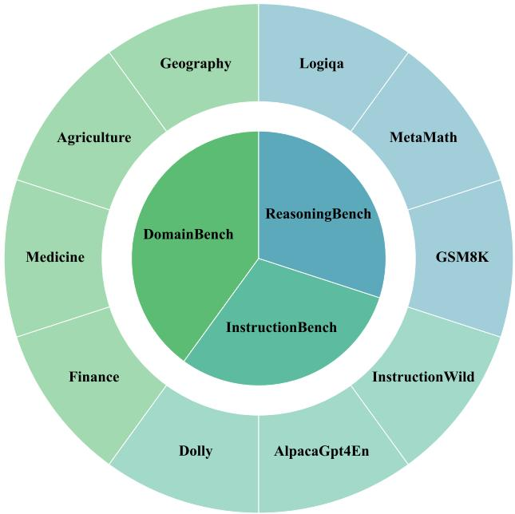

[← 返回 README](../README.md)

# A. More Related Work

# A.1. Large Language Models

The rapid progress in natural language processing (NLP) has been marked by the emergence of large language models (LLMs), which have fundamentally transformed the landscape of artificial intelligence. These models, rooted in the Transformer architecture (Vaswani et al., 2017), leverage extensive pre-training on massive text corpora to acqire remarkable capabilities. They have shown impressive performance across a wide range of tasks (Wei et al., 2022a; Hu et al., 2025b), such as high-quality question answering (Shao et al., 2023; Peng et al., 2023), coding (Chen et al., 2021), and intermediate reasoning (Wei et al., 2022b). The unprecedented success of LLMs has spurred significant discussions regarding their application for achieving artificial general intelligence (AGI) (Zhao et al., 2023). Based on their architectural design, existing LLMs can be categorized into three major classes: encoder-only models, decoder-only models, and encoder-decoder models.

Encoder-only models. The encoder-only models primarily employ the Transformer encoder to encode input sequences into rich contextual representations. They are particularly effective in natural language understanding (NLU) tasks, where the focus lies in extracting semantic meaning from text. One notable example is BERT (Devlin et al., 2019), which uses bidirectional encoding to capture context from both preceding and succeeding tokens. Pre-trained on extensive datasets like BooksCorpus (Zhu et al., 2015) (800M words) and English Wikipedia (2,500M words), BERT set new benchmarks on datasets such as GLUE and MultiNLI. Subsequent iterations, including RoBERTa (Liu, 2019) and DeBERTa (He et al., 2021), introduced architectural refinements and improved pre-training strategies, further enhancing performance. Despite their strengths in understanding tasks, encoder-only models are inherently unsuited for tasks that require sequence generation, such as translation or text completion.

> 💡 **背景不是重点**: A 节扩展 LLM/RAG/TTA 背景，但 TLM 的创新点仍集中在“只用测试输入做 perplexity 更新”，不要把它读成 RAG 或普通 SFT。

Decoder-only models. This kind of models, in contrast, rely solely on the Transformer decoder and are designed to generate text in an auto-regressive manner, where each token is generated sequentially, conditioned on previously generated tokens. Obviously These models excel in natural language generation (NLG) tasks, such as summarization, content creation and QA. The Generative Pre-trained Transformer (GPT) series (Radford, 2018; Brown et al., 2020; Achiam et al., 2023) developed by OpenAI examines this class, with GPT-3 being a landmark model that features 175 billion parameters. Trained on a diverse corpus spanning Common Crawl (Raffel et al., 2020), WebText2, Books 1, Books 2, and Wikipedia datasets. GPT-3 has demonstrated extraordinary few-shot and zero-shot learning capabilities on many language tasks. In addition to GPT series, many decoder-only models have been developed, such as OPT, LLaMA, Llama2, Llama3 from Meta (Zhang et al., 2022b; Touvron et al., 2023a;b; Dubey et al., 2024), PaLM, PaLM2 from Google (Chowdhery et al., 2023; Anil et al., 2023), BLOOM from BigScience (Le Scao et al., 2023), and Qwen series from Alibaba (Bai et al., 2023; Yang et al., 2024).

However, decoder-only models, while excelling in generative tasks, often lack the nuanced comprehension abilities required for deep understanding of long and complex input contexts.

Encoder-decoder models. Encoder-decoder models incorporate both the encoder and decoder components of the Transformer, combining the strengths of the two structures to handle tasks that require input understanding and sequence generation. Prominent examples of encoder-decoder models include GLM from Tsinghua University (Du et al., 2022), T5, FLAN-T5, and UL2 from Google (Raffel et al., 2020; Chung et al., 2024; Tay et al., 2023), as well as BART from Meta (Lewis et al., 2020a). For instance, GLM adopts an autoregressive blank-infilling objective to effectively address three core challenges in NLP: natural language understanding (NLU), unconditional text generation, and conditional generation. With a maximum capacity of 130 billion parameters, it is pre-trained on datasets such as BookCorpus (Tay et al., 2023) and Wikipedia. GLM surpasses BERT on the SuperGLUE benchmark by $4 . 6 \% - 5 . 0 \%$ and demonstrates superior performance compared to FLAN-T5 on both NLU and generation tasks using fewer parameters and training data.

# A.2. Retrieval-Augmented Generation

As one of the most representative techniques in the field of generative AI, Retrieval-Augmented Generation (RAG) aims to enhance the quality of the generated text content with retrieved information. It achieves this by integrating two critical components: (i) a retrieval mechanism that accesses relevant documents or information from external knowledge sources, and (ii) a generative module that synthesizes this information to produce coherent and contextually accurate text (Lewis et al., 2020b). By combining these capabilities, RAG models are able to generate not only fluent and human-like text but also outputs that are grounded in up-to-date and factual data, significantly enhancing their reliability and applicability in real-world scenarios. We categorized existing RAG methods into the following two main classes according to whether training is needed for further discussion: training-free approaches and training-based approaches.

Training-free RAG. Training-free RAG methods address the challenges of frequent fine-tuning and updating model parameters, which require substantial computational resources and time (Lewis et al., 2020b). These approaches leverage retrieved knowledge directly at inference time by incorporating the retrieved text into the prompt, eliminating the need for additional training. As the performance of large language models (LLMs) is highly sensitive to input queries, many training-free RAG methods refine prompts by integrating external knowledge (Jiang et al., 2023; Li et al., 2023; Kim et al., 2023; Ram et al., 2023; Trivedi et al., 2023; Wang et al., 2023). For example, In-Context RALM (Ram et al., 2023) augments the generation process by prepending retrieved documents to the original prompt without altering LLM parameters. IRCoT (Trivedi et al., 2023) enhances reasoning by interleaving chain-of-thought (CoT) generation and retrieval, ensuring access to more relevant information across iterative reasoning steps. SKR (Wang et al., 2023) enables flexible utilization of both internal and external knowledge by guiding LLMs to decide whether a question can be answered based on internal knowledge before invoking the retriever. Despite their efficiency, training-free RAG methods often face limitations in optimizing the retriever and generator for specific downstream tasks, leading to suboptimal utilization of retrieved knowledge. To address this, training-based RAG approaches fine-tune both components, enabling large language models to effectively adapt and integrate external information.

Training-based RAG. This kind of methods aim to optimize both the retriever and generator to enhance their alignment and effectiveness. One typical success is DPR (Karpukhin et al., 2020), which employs two independent BERT (Devlin et al., 2019) encoders for queries and passages and trains them via contrastive learning. Ren et al. (2023) employs a two-stage approach, starting with the pretrain S-BERT (Reimers & Gurevych, 2019) as a retrieval backbone, enhanced by an adaptive hybrid strategy to effectively gather relevant demonstration. Next, a T5 model is used as the generator, which is further fine-tuned to align with the target labels and inputs. In contrast, RA-DIT (Lin et al., 2024) first fine-tuning LLMs to effectively use retrieved knowledge and then refining the retriever to align with the model’s requirements. To address indiscriminate retrieval and the incorporation of irrelevant passages, Self-RAG (Asai et al., 2024) introduces special tokens to dynamically assess the necessity of retrieval and control its behavior. More recently, MemoRAG (Qian et al., 2024) incorporates a memory module that generates context-specific cues to link the knowledge base to precise information, improving retrieval accuracy and response quality.

> 💡 **TTA 文献连接**: EATA/Tent 的选择逻辑来自视觉分类 TTA；TLM 的反例价值在于说明这些目标迁移到 LLM 时需要重新设计。

Despite their advantages, RAG models rely heavily on the quality and relevance of the retrieved knowledge, as inaccuracies or irrelevant information can directly compromise the quality of the generated output. Furthermore, the dual-step process of retrieval and generation for each query introduces significant computational overhead, posing challenges for real-time and resource-constrained applications.

Table 6. Components of AdaptEval.   

<table><tr><td>Category</td><td>Dataset</td><td>Sources</td></tr><tr><td rowspan="4">DomainBench</td><td>Geosignal</td><td>Geoscience knowledge base, etc.</td></tr><tr><td>Agriculture-QA</td><td>Agriculture data</td></tr><tr><td>GenMedGPT-5k</td><td>ChatGPT-generated data</td></tr><tr><td>Wealth-alpaca_lora</td><td>FiQA data, etc.</td></tr><tr><td rowspan="3">InstructionBench</td><td>Dolly-15k</td><td>Databricks data</td></tr><tr><td>Alpaca_gpt4_en</td><td>GPT-4 instruction data</td></tr><tr><td>InstructionWild</td><td>User instruction data</td></tr><tr><td rowspan="3">ReasoningBench</td><td>GSM8k</td><td>OpenAI data</td></tr><tr><td>MetaMathQA</td><td>Advanced math datasets</td></tr><tr><td>Logiqa</td><td>Civil service logic tests</td></tr></table>

# A.3. Test-Time Adaptation

Test-time adaptation (TTA) aims to improve a model’s performance on unseen test data, which may undergo distribution shifts, by learning directly from the test data during the testing phase. Based on their reliance on backward propagation, we categorize the related TTA works into the following two groups for discussion.

Backpropagation (BP)-Based TTA. A foundational approach in this category is Test-Time Training (TTT) proposed by (Sun et al., 2020). TTT involves training a source model using both supervised and self-supervised objectives during the training phase. At test time, the model is adapted using self-supervised objectives such as rotation prediction (Sun et al., 2020), contrastive learning (Liu et al., 2021; Bartler et al., 2022), or reconstruction learning (Gandelsman et al., 2022). To address scenarios where modifying the training process or accessing source data is not feasible, Fully TTA methods directly update pre-trained models during testing. These methods rely on unsupervised learning objectives, with entropy minimization (Wang et al., 2021; Niu et al., 2023) emerging as one of the most widely used techniques due to its simplicity and effectiveness. Entropy minimization encourages the model to produce confident predictions by reducing uncertainty in its output distribution. This approach effectively aligns predictions to a single class. Beyond entropy minimization, other unsupervised objectives, such as prediction consistency maximization (Zhang et al., 2022a; Fleuret et al., 2021) and feature distribution alignment (Mirza et al., 2023), have also been explored, enhancing the model’s ability to adapt to diverse test-time scenarios.

To further enhance the efficiency of backpropagation-based TTA, recent research efforts have focused on tow primary aspects: (1) Sample Efficiency: As not all test samples contribute equally to adaptation. Several recent works (Niu et al., 2022a; 2023; Shu et al., 2022; Lee et al., 2024) have introduced sample selection strategies to focus on reliable and non-redundant samples, reducing the noise in the gradient and the number of samples for TTA, thereby enhancing adaptation performance and efficiency. (2) Memory Efficiency: Addressing the memory-intensive nature of backpropagation, methods such as EcoTTA (Song et al., 2023) optimize parameter-efficient components during adaptation, while MECTA (Hong et al., 2023) reduces batch size to lower memory consumption. Additionally, MECTA introduces a domain-aware batch normalization layer to stabilize model updates, even with smaller batch sizes. Similar to the sample efficiency methods, we propose a Sample-Efficient Learning Strategy that uses a perplexity-based weighting scheme to prioritize high-perplexity test samples for backpropagation, ensuring efficient utilization of computational resources.

Backpropagation-Free TTA. The development of BP-free TTA has seen significant progress, with early research focusing primarily on the adjustment of batch normalization (BN) layer statistics using test data. These methods primarily involved recalculating the mean and variance of BN layers based on testing data (Nado et al., 2020; Schneider et al., 2020). However, such approaches were limited to adapting BN layers, restricting their applicability to architectures that heavily rely on BN. To overcome these limitations, more generalized methodologies have been proposed to enhance the flexibility and effectiveness of BP-free TTA. For instance, reconstruction-based approaches focusing on input-level adaptation leverage advanced techniques like diffusion models to preprocess corrupted test images before prediction (Gao et al., 2023; Oh et al., 2025). Additionally, output-level adaptation methods have been developed, such as T3A (Iwasawa & Matsuo, 2021), which utilizes prototype-based classifier adjustment for adaptive predictions, and LAME (Boudiaf et al., 2022), which directly corrects the predicted logits. The recent advanced FOA (Niu et al., 2024) adapts models to unseen test samples without backpropagation by learning a prompt through a derivative-free covariance matrix adaptation strategy and adjusting model activations to align with the source training domain. Looking forward, there is great potential to extend our method to the realm of efficient BP-Free TTA, thereby further broadening the practical applicability of our approach in diverse real-world scenarios.

  
Figure 4. Distributions of AdaptEval.
