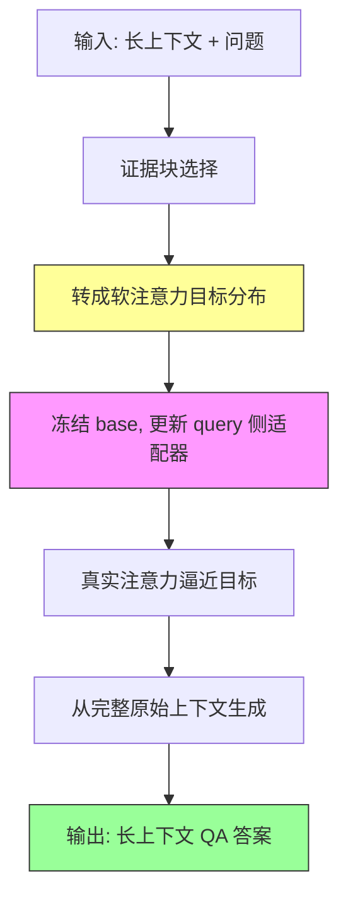

# EASE-TTT: Evidence-Aligned Selective Test-Time Training for Long-Context Question Answering

## 论文信息

| 项目 | 内容 |
|------|------|
| **标题** | EASE-TTT: Evidence-Aligned Selective Test-Time Training for Long-Context Question Answering |
| **作者** | Xiaopeng Yuan, Zebin Wang, Suwen Wang, Zongxin Yang, Haohan Wang, Yushun Dong (UIUC, Harvard, ASML, FSU) |
| **会议** | Arxiv 2026 |
| **arXiv** | 2606.06906 |
| **链接** | https://arxiv.org/abs/2606.06906 |

## 一句话总结

EASE-TTT 把长上下文 QA 的"检索"从"改输入"升级为"改注意力参数"——将检索到的证据块转成一个软注意力监督目标，在测试时只更新 query 侧轻量适配器让真实注意力逼近该目标，最终答案仍从完整原始上下文生成，从而在证据已存在但小模型读不到时提升检索访问可靠性。

## 核心贡献

1. **诊断两派方法的互补缺陷**：within-context retrieval 只做 input-level 证据暴露（不改注意力参数）；qTTT 能改 query 侧参数但用 generic span-level 目标（不知道哪些位置支撑答案）。
2. **提出证据对齐监督**：把选中的证据块转成 soft attention target（证据位置分配大部分概率、其余保留非零），用它引导 query 侧适配，而非硬替换上下文。
3. **保留完整上下文生成**：检索块只作监督信号，最终生成用原始完整上下文，避免硬截断丢掉分散证据。
4. **实验验证**：6 个 LongBench QA 任务 × 3 个小型 decoder-only 模型，macro-average 超过 full-context、retrieval-only、qTTT 三类对手。

## 📖 批读导航

| Section | 文件 | 核心内容 |
|---------|------|----------|
| 0. Abstract | [00-abstract.md](sections/00-abstract.md) | 证据已存在但读不到、软注意力监督 |
| 1. Introduction | [01-introduction.md](sections/01-introduction.md) | 两派方法缺陷、EASE-TTT 定位 |
| 2. Related Work | [02-related-work.md](sections/02-related-work.md) | within-context retrieval、TTT、注意力引导 |
| 3. Preliminary | [03-preliminary.md](sections/03-preliminary.md) | 问题定义、qTTT 背景 |
| 4. EASE-TTT | [04-ease-ttt.md](sections/04-ease-ttt.md) | 证据选择、软注意力目标、query 侧适配 |
| 5. Experiments | [05-experiments.md](sections/05-experiments.md) | 6任务3模型主结果、loss 消融、层选择 |
| 6. Conclusion & Appendix | [06-conclusion-appendix.md](sections/06-conclusion-appendix.md) | 总结、附录 |

## 关键数字

| 指标 | 数值 |
|------|------|
| Qwen3-0.6B Avg (Ours) | 23.6（vs Full +4.1, vs qTTT +1.2） |
| Qwen3-1.7B Avg (Ours) | 30.6（vs Full +5.6, vs RAG +5.3, vs ICR +3.0, vs qTTT +1.9） |
| Llama-3.2-1B Avg (Ours) | 25.8（vs qTTT 仅 +0.5） |
| 效率权衡 | 40.1 vs 38.0（+2.1 分），9.1s vs 6.7s（+2.4s），内存 8.6 vs 10.1 GB（反降） |
| Figure 3 loss 消融 (HotpotQA) | 30.5→36.6（+6.1，Attn.KL vs chunk NTP） |
| 最佳适配层 | 中间层（默认 $\ell=14$） |
| 评测规模 | 6 LongBench QA 任务 × 3 小模型 |

## 数据流：输入 → 中间表示 → 输出

## 优缺点与还能做什么

### 优点
- 把"证据在哪"直接转成注意力监督信号，比 generic span 目标更精准
- 不硬替换上下文，避免丢失分散证据
- 内存反而更低（相比 full-context inference）
- Figure 3 消融证明增益来自"监督形式"而非"仅暴露证据"

### 局限 / 风险
- macro-average 最强但单任务有波动（Llama 上 MuSiQue/NarrativeQA/QASPER 被 qTTT 反超）
- 增加约 +2.4s 推理延迟
- 依赖证据块选择质量，检索错误会误导注意力目标
- 仅在小模型（0.6B–1.7B）验证，大模型未测

### 还能做什么
- 与更强的检索器结合提升证据选择质量
- 探索证据目标的自适应软硬程度
- 扩展到多跳推理需要动态证据更新的场景

## 阅读 Q&A 记录

- **Q: EASE-TTT 与 qTTT 的核心差异是什么？**
  A: qTTT 用 generic span-level self-supervised 目标（随机采片段做 NTP），不知道哪些位置支撑答案；EASE-TTT 用检索证据构造 soft attention target，明确告诉模型该关注哪些位置。Figure 3 消融证明同样的证据块下 attention KL 显著优于 chunk NTP。
- **Q: 为什么用完整上下文生成而非检索块？**
  A: 检索块只当监督信号引导注意力，最终生成保留完整上下文，避免硬截断丢掉分散在别处的证据。
- **Q: 为什么内存反而更低？**
  A: EASE-TTT 只更新 query 侧轻量适配器，而 full-context inference 需要完整 KV cache；证据对齐让有效上下文更聚焦。

## 📊 Citation Landscape

- **Connected Papers**: https://www.connectedpapers.com/main/2606.06906
- **arXiv**: https://arxiv.org/abs/2606.06906
- 关键相关工作：qTTT / TTT4LC（query-only 测试时训练）、within-context retrieval（证据暴露）、long-context QA benchmarks（LongBench）
- 注：该论文较新（2026），Semantic Scholar 尚未索引 TLDR/引用统计。
