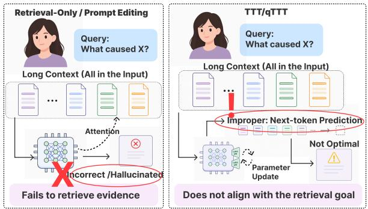

[← 返回 README](../README.md)

# 1. Introduction（引言）

## 📌 预览

引言把问题拆成三层：(1) 长窗口 ≠ 好性能，小模型尤其读不到已有证据；(2) within-context retrieval 只改输入不改模型，且硬选块有丢证据风险；(3) TTT/qTTT 能改参数但目标是 question-agnostic 的。EASE-TTT 就站在这两条线中间，把"检索到的证据"变成"query 侧适配的监督信号"。最后列出三条贡献。

---

Large language models have made rapid progress in extending their context windows, enabling them to process inputs that contain tens or even hundreds of thousands of tokens(Ding et al., 2024; Team et al., 2024; Chen et al., 2024). However, a longer context window does not necessarily translate into better long-context question-answering performance. In many long-context question answering tasks, the answer-bearing evidence is already present in the input, yet the model still fails to access it correctly(Liu et al., 2024; Hsieh et al., 2024; Modarressi et al., 2025). This issue is particularly important for smaller language models, which often have more limited capacity to maintain reliable evidence use in long, distractor-heavy contexts (Gao et al., 2026). In such cases, the bottleneck is not simply whether the model can fit the context, but whether it can reliably access and prioritize the evidence needed for the current question.

> 💡 **问题动机**: 第一段建立了全文的靶子——"longer context window does not necessarily translate into better QA"。作者引用了 Lost-in-the-middle（Liu 2024）、RULER（Hsieh 2024）、NoLiMa（Modarressi 2025）这些长上下文诊断工作。核心命题是把 bottleneck 从"能不能装下"（capacity）重新定义为"能不能可靠访问并优先化证据"（reliably access and prioritize）。对小模型（smaller language models）这个问题更尖锐，因为它们在 distractor-heavy 长文里维持证据使用的能力更弱。这也解释了为什么全文只测 0.6B~1.7B 的小模型。

*Figure 1: Motivation of EASE-TTT. Retrieval-only and prompt-editing methods expose candidate evidence at the input level, but do not adapt the model's contextaccess behavior. Test-time training methods can adapt model parameters at inference time, but their objectives are often not explicitly aligned with question-relevant evidence. EASE-TTT bridges this gap by using retrieved evidence to guide test-time adaptation.*

> 💡 **Figure 1 批读**: 这张动机图是全文的"一图流"论点，用二维定位法把方法学空间切成四象限（横轴 = 是否改模型参数，纵轴 = 是否 evidence-aligned）：
> - **Retrieval-only / prompt-editing**：只在 input level 暴露证据，模型 context-access behavior 不变 → 占据"改输入不改模型"象限。
> - **Test-time training（qTTT）**：能在推理时改参数，但目标 not explicitly aligned with question-relevant evidence → 占据"改模型但目标不对齐"象限。
> - **EASE-TTT**：唯一同时做到"改参数 + evidence-aligned"的象限。图的叙事作用就是让读者直观看到本文填补的正是右上角这块空白。注意此图虽出现在引言页，实际归属引言（讲动机而非方法细节）。

A natural way to address this issue is to perform retrieval within the input context. Withincontext retrieval methods segment the long input into chunks, localize candidate evidence chunks from the same context, and use the selected chunks to construct a shorter or more focused input (Jiang et al., 2024; Li et al., 2023; Nair et al., 2023). These methods do not rely on an external corpus; instead, they treat the given long context itself as the retrieval source. They are effective when the selected chunks contain sufficient answerbearing evidence for generation. However, they typically use retrieval only as an input-level operation: selected chunks are used to replace, shorten, or prepend to the original context (Sheng et al., 2025; Liskavets et al., 2025; Wang et al., 2023; Chirkova et al., 2025). As a result, the model's parameters and context-access behavior remain unchanged. Moreover, hard chunk selection may discard useful surrounding information, which is risky in long-context QA where evidence may be distributed across multiple parts of the input (Sarthi et al., 2024; Tian et al., 2025; Saad-Falcon et al., 2024; Luo et al., 2025; Wang et al., 2024).

> 💡 **机制拆解**: 这段界定了 within-context retrieval（区别于标准 RAG）——检索源就是给定的长上下文本身，不依赖外部语料库。作者点出它的两个软肋：(1) **input-level only**——检索结果只用来 replace/shorten/prepend，模型参数和访问行为不变；(2) **hard selection 会丢信息**——长上下文里证据常分散在多处，硬选 K 块可能切断分布式证据或丢掉解读所需的上下文。这两点正是 EASE-TTT 的"soft target + 全上下文生成"要规避的失效模式。

This limitation suggests that evidence access should not be treated only as an inference-time input selection problem. For smaller models in particular, failures under long contexts may reflect a mismatch between the model's current contextaccess behavior and the evidence required by the question (Zhu et al., 2025; Lee et al., 2025; An et al., 2024; Li et al., 2024b). Test-time adaptation provides a natural way to address this mismatch because it allows a model to change its behavior for each test instance at inference time. In this work, we focus on test-time training (TTT), a gradient-based form of test-time adaptation that performs instance-specific parameter updates (Sun et al., 2020; Wang et al., 2020; Hardt and Sun, 2024; Akyürek et al., 2024). Recent query-only test-time training further shows that inference-time compute need not be spent only on additional generated to kens; it can also be used for query-side adaptation, allowing the model to change how it allocates attention over a given long context (Bansal et al., 2025). This perspective is especially relevant to long-context QA, where the evidence may already be present in the input but insufficiently prioritized by the model. However, existing test-time adap tation objectives are typically driven by generic self-supervised, task-level, or retrieval-oriented sig nals, rather than evidence-localized supervision that identifies which full-context positions support the current answer (Zhang et al., 2024; Feng et al., 2026; Jeong et al., 2023; Sun et al., 2026). These objectives may adapt the model to the current input, but they do not explicitly indicate which context positions support the current answer. Therefore, there remains a gap between within-context evidence localization and test-time adaptation: withincontext retrieval can localize potentially relevant chunks, while query-side test-time training can adapt model behavior, but existing methods do not directly use question-relevant evidence as supervision for instance-specific adaptation.

> 💡 **机制拆解**: 这段把矛盾重构成 "mismatch between context-access behavior and required evidence"，并引出解法路线 test-time training（TTT）——一种 gradient-based、instance-specific 的参数更新。作者特别强调 qTTT（Bansal et al., 2025，本文最主要的对标基线）的洞察：inference-time compute 不必只花在"多生成 token"上，也可以花在"query-side adaptation"上，改变模型对已有上下文的注意力分配。但作者随即指出 qTTT 的关键缺陷——它的目标是 generic self-supervised / task-level / retrieval-oriented，而非 evidence-localized supervision，不知道"哪些 full-context 位置支撑当前答案"。这就是全文反复出现的 gap：检索能定位、TTT 能适配，但没人把"问题相关证据"直接当作适配的监督信号。

We propose Evidence-Aligned Selective Test-Time Training (EASE-TTT), a within-context retrieval-augmented test-time training framework that turns question-relevant evidence into direct supervision for long-context adaptation. Given a long-context question answering instance, EASE-TTT first selects chunks in the input context that are most relevant to the question. Instead of replacing the original context with these chunks, it constructs a soft attention target that assigns greater probability mass to selected evidence positions while still preserving nonzero mass over the remaining context. At test time, EASE-TTT updates lightweight query-side adapters with the base model frozen. After adaptation, the model generates the answer from the original full context. This design turns retrieval from an input-filtering mechanism into an evidence-aligned supervision signal for instancespecific adaptation.

> 💡 **机制拆解**: 方法一句话概括——把 retrieval 从 "input-filtering mechanism" 变成 "evidence-aligned supervision signal"。数据流一目了然：选块 → 构造 soft attention target（证据位置给大质量，其余保留非零质量）→ 冻结 base、只更新 query 侧 adapter → 用完整上下文生成答案。这四步在正文第 4 节展开，Algorithm 1 是完整伪代码。

## Our contributions.

• We identify evidence-use failure as a key bottleneck in long-context reasoning for smaller language models: relevant evidence may be present in the input, but the model still fails to use it under distractor-heavy contexts.

• We propose EASE-TTT, a within-context retrieval-augmented test-time training framework that converts question-relevant chunks into soft supervision for query-side adaptation. Unlike retrieval-only methods, EASE-TTT does not replace the context with chunks; instead, it uses them to guide adaptation while preserving full-context generation.

• We conduct an evaluation on long-context QA benchmarks across multiple small language models. Our results show that EASE-TTT improves answer quality over full-context inference, retrieval-only baselines, and qTTT, with further analyses demonstrating the effects of evidence selection, soft attention supervision, and test-time training.

> 💡 **贡献拆解**: 三条贡献分别对应 problem / method / evidence 三个层次：
> 1. **问题定义贡献**：把 "evidence-use failure"（证据在输入里但用不出来）明确为小模型长上下文推理的关键瓶颈——这是全文所有实验的靶子。
> 2. **方法贡献**：EASE-TTT 的两个"不替换"原则——不用块替换上下文（does not replace）、保留全上下文生成（preserving full-context generation）——是它与所有 retrieval-only 方法的本质分界。
> 3. **实验贡献**：不只报主结果，还专门做了三个消融来分别验证 evidence selection（Table 3 BM25 vs Utility）、soft attention supervision（Figure 3 Attn.KL vs Chunk NTP）、test-time training（层选择 Figure 4）三个组件各自的作用。批读实验章节会逐一对齐这三条证据链。

## 🔖 Section 总结

### 核心洞察
1. **重定义瓶颈**：长上下文 QA 的失败不是"装不下"而是"访问不可靠"——尤其小模型在 distractor 多时更明显。
2. **二分法批判**：检索派改输入不改模型；TTT 派改模型但目标 question-agnostic。EASE-TTT 站在交叉点，用检索结果当 TTT 的监督信号。
3. **两个不替换**：不替换上下文、保留全上下文生成，是本方法区别于 retrieval-only 的核心。

### 可追问点
- soft target 里"其余上下文保留非零质量"具体怎么分配？→ 见 03 节 Eq. (公式4)。
- 为什么只更新 query 侧而不动 K/V？→ 见 03 节 3.2，KV 冻结可复用缓存，避免每步重算全上下文。
