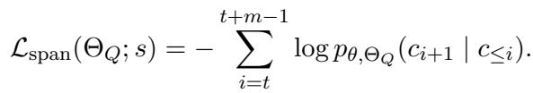

[← 返回 README](../README.md)

# 3. Preliminary（预备知识）

## 📌 预览

预备章节铺三块地基：(1) 长上下文 QA 的形式化定义与 within-context 检索记号；(2) query-only test-time adaptation 的机制——为什么只更新 query 侧、KV 冻结的好处，以及它默认用的 generic span NLL loss（公式1）；(3) 从"证据选择"到"适配监督"的桥接思路，引出 $\Omega(E)$ 记号。这些记号和 loss 是理解第 4 节方法的前提。

---

## 3.1 Long-Context Question Answering and Evidence Use

> 💡 **3.1 要点预览**: 建立形式化：测试实例 $z=(c,q)$，长上下文 $c$、问题 $q$，目标是从 $p_\theta(\cdot\mid c,q)$ 生成答案 $y$。核心矛盾——证据在 $c$ 里但模型访问不到。同时引入候选块集合 $S$ 和选中子集 $E$ 的记号，明确"用 $E$ 当监督而非替换 $c$"。

We study test-time training for long-context question answering. Let a test instance be $z = ( c , q )$ , where $c = ( c_1 , c_2 , . . . , c_T )$ denotes a long input context and $q$ denotes the question or instruction. Given a pretrained language model $f_\theta ,$ the goal is to generate an answer $y$ conditioned on both the full context $c$ and the question $q$, i.e., $y \sim p_\theta ( \cdot \mid c , q )$

> 💡 **公式批读**: 这里 $c=(c_1,\dots,c_T)$ 是长度 $T$ 的 token 序列，$T$ 最大截到 32,768（见实验设置）。目标分布 $p_\theta(\cdot\mid c,q)$ 强调答案要 conditioned on **full context** $c$——这是全文反复守住的底线：无论中间怎么检索/适配，最终生成一定用完整 $c$。

In long-context QA, the relevant evidence needed to answer $q$ may already be contained in $c$, but the model may still fail to identify or use it correctly. This failure is especially problematic when the context contains many distractors or when the useful evidence is distributed across distant regions of the input. Therefore, the key challenge is not only whether the model can fit the full context, but whether it can reliably access the evidence needed for the current question.

A common way to improve evidence access is to perform retrieval within the given context. Let $S = \{ s_1 , s_2 , \ldots , s_M \}$ denote a set of candidate chunks segmented from $c ,$ where each chunk $s_j = ( c_{b_j} , \ldots , c_{e_j} )$ covers a contiguous span of context tokens. A within-context retrieval module ranks these chunks according to their relevance to $q$ and selects a subset $E = \{ s_{j_1} , s_{j_2} , . . . , s_{j_K} \}$ Retrieval-only methods typically use $E$ to construct a shorter input for generation. In contrast, our goal is not to replace the original context with the selected chunks. Instead, we use the selected evidence chunks as a supervision signal for test-time adaptation, while final answer generation remains conditioned on the original full context $c$.

> 💡 **机制拆解**: 这段定义了检索侧的记号体系——$S$ 是从 $c$ 切出的 $M$ 个候选块，每块 $s_j$ 覆盖连续 token 区间 $[b_j, e_j]$；检索模块按与 $q$ 的相关性排序，选出 $K$ 个组成 $E$。关键对比再次出现：retrieval-only 用 $E$ 构造 shorter input，而本文用 $E$ 当 supervision signal，生成仍 conditioned on full context $c$。记住这个 $E$——第 4.2 节会用 utility score 具体算怎么选，$\Omega(E)$ 会把 $E$ 映射成 token 位置集合。

## 3.2 Query-Only Test-Time Adaptation

> 💡 **3.2 要点预览**: 讲清 qTTT 的机制与它默认的 loss。核心 trick：只更新 query 投影 $\Theta_Q$、冻结 K/V，这样 KV 表示不变、可复用缓存、不必每步重算全上下文。默认目标是随机采样 span 做 NLL（公式1），但这个目标 question-agnostic。

Test-time training adapts a model independently for each test instance at inference time, using signals derived from the test input itself. In the longcontext setting, full-parameter adaptation is expensive because each gradient update may change the key and value representations of the entire context, requiring repeated computation over the full input.

Query-only test-time training provides a lightweight alternative. Instead of updating all model parameters, it updates only query-side parameters in self-attention while keeping the rest of the model frozen. Let $\Theta_Q = \{ W_Q^{(1)} , W_Q^{(2)} , \dots , W_Q^{(L)} \}$ denote the query projection parameters across the $L$ transformer layers. Given the long context $c ,$ the model constructs key-value representations $\{ K^{(\ell)} , V^{(\ell)} \}_{\ell = 1}^{L} ,$ which remain fixed during adaptation. Updating only $\Theta_Q$ changes how the model forms queries over these fixed key-value representations, thereby modifying how it accesses information in the context without recomputing the full context after every gradient step. Standard query-only test-time training usually relies on generic self-supervised objectives. For example, it may sample a span $s = ( c_t , c_{t + 1} , \ldots , c_{t + m} )$ from the context and optimize a next-token prediction loss:

> 💡 **机制拆解**: 这段讲透了 query-only 的"省算"逻辑，是理解整个方法效率优势的关键。全参数 TTT 每步梯度会改动整个上下文的 K/V 表示 → 每步都要重算全上下文，代价爆炸。qTTT 只更新 $\Theta_Q=\{W_Q^{(\ell)}\}$（各层 query 投影矩阵），冻结 $\{K^{(\ell)},V^{(\ell)}\}$。因为 K/V 固定，模型只是"换了个新 query 去问同一批固定的 key/value"，**不必每步重算全上下文**——这就是它 lightweight 的物理来源，也是附录 B.4 里 qTTT 能复用 KV 缓存的原因。

$$
\mathcal { L }_{\mathrm{span}} ( \Theta_Q ; s ) = - \sum_{i = t}^{t + m - 1} \log p_{\theta , \Theta_Q} ( c_{i + 1} \mid c_{\le i} ) .
$$

This objective can adapt the model to the current input, but it does not explicitly indicate which parts of the context are useful for answering the current question. As a result, query-only adaptation can modify context-access behavior, but the adaptation signal remains largely question-agnostic.

> 💡 **公式批读（公式1，qTTT 的 span NLL）**: 这是 EASE-TTT 要取代的基线目标。$\mathcal{L}_{\text{span}}$ 从上下文里随机采一个 span $s=(c_t,\dots,c_{t+m})$，对它做标准 next-token prediction（预测 $c_{i+1}\mid c_{\le i}$）。问题在哪？这个 loss 完全没有 $q$ 的信息——它只是让模型"更好地续写这段被采到的文本"，与"哪些位置支撑答案"无关，所以作者称之为 **question-agnostic**。EASE-TTT 的公式5（Attn. KL）正是要把这个 question-agnostic 目标换成 evidence-aligned 目标；Figure 3 的消融（Chunk NTP vs Attn. KL）就是直接对比这两种 loss 的效果。

## 3.3 From Evidence Selection to Adaptation Supervision

> 💡 **3.3 要点预览**: 桥接段，把 3.1 的 $E$ 和 3.2 的 query-side adaptation 缝起来，引入位置集合 $\Omega(E)$。soft target 和 loss 的具体构造留到第 4 节。

The above discussion suggests a gap between within-context retrieval and query-only test-time adaptation. Within-context retrieval can identify candidate evidence chunks for the current question, but retrieval-only methods usually use these chunks to modify the input rather than the model. Queryonly test-time training can adapt how the model accesses the context, but its generic span-based objectives do not directly specify which context positions are question-relevant.

Our method connects these two components by using retrieved evidence chunks as supervision for query-side test-time adaptation. Let $E$ denote the selected evidence chunks, and let $\Omega ( E ) \subseteq \{ 1 , 2 , \ldots , T \}$ denote the indices of context tokens covered by these chunks. Instead of replacing the original context with $E$, we use $\Omega ( E )$ to guide adaptation toward evidence-bearing positions. The detailed construction of the soft attention target and the corresponding adaptation objective are introduced in the next section.

> 💡 **机制拆解**: 这段引入全文最关键的中间变量 $\Omega(E)$——把"选中的块 $E$"映射成"这些块覆盖的 token 位置索引集合"（$\Omega(E)\subseteq\{1,\dots,T\}$）。为什么需要这一步？因为最终的监督目标是定义在**全上下文 $T$ 个位置上的注意力分布**，必须先知道哪些位置属于证据、哪些不属于。$\Omega(E)$ 就是连接"块级检索"和"位置级注意力监督"的转换器。下一节的公式4 会用 $\Omega(E)$ 和质量参数 $\alpha$ 构造 soft target $\pi$。

## 🔖 Section 总结

### 关键记号速查
| 记号 | 含义 |
|------|------|
| $z=(c,q)$ | 测试实例：上下文 + 问题 |
| $T$ | 上下文 token 数（≤32,768） |
| $S=\{s_1,\dots,s_M\}$ | $M$ 个候选块 |
| $E=\{s_{j_1},\dots,s_{j_K}\}$ | 选中的 $K$ 个证据块（$K=4$） |
| $\Theta_Q=\{W_Q^{(\ell)}\}_{\ell=1}^L$ | 各层 query 投影参数（唯一被更新的） |
| $\{K^{(\ell)},V^{(\ell)}\}$ | Key/Value 表示（冻结） |
| $\Omega(E)\subseteq\{1,\dots,T\}$ | 证据块覆盖的 token 位置索引 |

### 核心洞察
1. **只更 query、冻 KV** 是效率的物理来源——KV 不变则可复用缓存，不必每步重算全上下文。
2. **公式1（span NLL）是被取代的靶子**——它 question-agnostic，与"哪些位置支撑答案"无关。
3. **$\Omega(E)$ 是块→位置的转换器**——把块级检索结果映射到位置级注意力监督空间。
