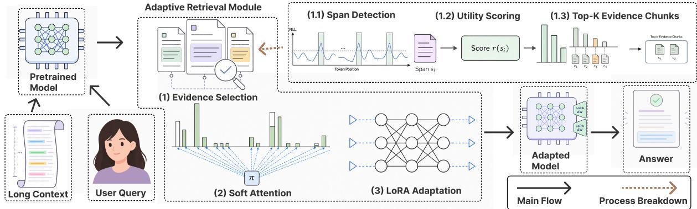
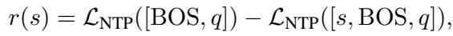
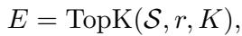
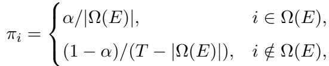
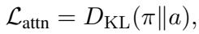

[← 返回 README](../README.md)

# 4. EASE-TTT（方法）

## 📌 预览

方法章节按数据流走：4.1 总览；4.2 证据选择（NLL spike 切块 + question-conditioned utility 打分 + TopK）；4.3 软目标注意力对齐（构造 soft target $\pi$、抽取真实注意力 $a$、KL 对齐）。核心中间变量：候选块 $S$ → 效用分 $r(s)$ → 选中块 $E$ → 位置集合 $\Omega(E)$ → 软目标 $\pi$ → 真实注意力 $a$ → loss $\mathcal{L}_{\text{attn}}=D_{KL}(\pi\|a)$。teacher 信号是 $\pi$（人为构造的证据偏置分布），student 是模型第 $\ell$ 层的真实注意力 $a$。

---

## 4.1 Method Overview

We propose EASE-TTT, an evidence-selective variant of query-only test-time training for longcontext question answering. Unlike prior qTTT methods, which adapt query-side parameters using generic self-supervised losses over randomly sampled spans, our method identifies question-relevant evidence and uses it to guide test-time attention adaptation. Given a context $c$ and a question $q$, EASE-TTT segments the context into candidate spans and ranks them by their question-conditioned utility. The top-K spans are selected as evidence chunks and used to define a soft target attention distribution over context positions. During test-time adaptation, EASE-TTT updates only query-side adaptation parameters according to this evidencealigned attention target. Final prediction is still performed on the original full context, so the selected chunks guide attention without truncating the input.



*Figure 2: Overview of EASE-TTT. Given a long context and a question, EASE-TTT selects question-relevant evidence chunks, converts them into a soft attention target over full-context positions, and updates query-side LoRA adapters at test time. The adapted model then generates the answer from the original full context.*

> 💡 **Figure 2 批读**: 这是方法总览图，把 Algorithm 1 的伪代码画成数据流。四个阶段对应四个模块：(1) **evidence selection**——长上下文切块后按与问题的相关性排序，选出高亮的证据块（对应 4.2）；(2) **soft attention target 构造**——把选中块的位置转成一个 bar-chart 式的目标分布，证据位置高、其余位置低但非零（对应公式4）；(3) **query-side LoRA adaptation**——只在 query 投影插 LoRA，用 KL 把真实注意力拉向目标分布，base model 冻结（对应 4.3 + 公式5）；(4) **full-context generation**——适配完成后，用完整原始上下文生成答案。这张图的关键信息是：证据块从头到尾**只影响适配阶段**，从不进入最终生成的输入——这就是"guide attention without truncating the input"的可视化。

> 💡 **机制拆解（4.1 数据流）**: 4.1 用一段话给出完整 pipeline，逐词对应后续小节：segments into candidate spans（4.2 切块）→ ranks by question-conditioned utility（4.2 公式2 打分）→ top-K spans selected（4.2 公式3）→ define soft target attention distribution（4.3 公式4）→ updates only query-side adaptation parameters（4.3 公式5 的 KL）→ final prediction on original full context（生成）。注意 "without truncating the input" 是与所有 retrieval-only 基线的分界点。

## 4.2 Within-Context Evidence Selection

> 💡 **4.2 要点预览**: 两步走——先用 NLL spike 把上下文切成候选块 $S$（无监督分段），再用 question-conditioned utility 分数 $r(s)$ 给每块打分选 TopK。核心创新是 utility 分数：prepend 一个块后如果问题的建模 loss 下降，说明该块含相关证据。

A central challenge in long-context reasoning is that useful evidence is often buried among large amounts of irrelevant content. To obtain a more targeted adaptation signal, we first identify candidate evidence chunks from the full context.

Given the context token sequence $c = ( c_1 , \ldots , c_T )$ , we segment it into spans using tokenlevel negative log-likelihood (NLL) spikes. Specifically, we run a forward pass over $c$ and compute the NLL of each context token. After smoothing the resulting NLL curve, we detect boundary candidates using a threshold of the form $\mu + \kappa \sigma$ where $\mu$ and $\sigma$ are the mean and standard deviation of the smoothed curve, and $\kappa$ is a spike factor. Together with a minimum chunk-length constraint $m_{\mathrm{min}}$ , this yields a set of candidate spans $S = \{ s_1 , \ldots , s_M \}$

> 💡 **机制拆解（NLL spike 切块）**: 这段解决"怎么切块"。做法很巧：跑一遍前向拿到每个 token 的 NLL（负对数似然），平滑后用 $\mu+\kappa\sigma$ 阈值找 NLL 突增点（spike）当边界。为什么用 NLL spike？直觉是——当模型遇到语义/主题突变（如新段落、新实体开头）时，下一个词会更难预测，NLL 会尖峰。所以 NLL spike 天然对应语义边界，比固定长度切块更贴合文本结构。$\kappa$ 是 spike 敏感度、$m_{\min}$ 防止切出太碎的块。注意：实验设置里同时给了 target chunk size 512、min 128、max 1024、overlap 64，说明实际实现是 NLL 边界 + 长度约束的组合。

We then score each span by how much it helps the model condition on the question. For a candidate span $s$, we define its question-conditioned utility as



$$
r ( s ) = \mathcal { L }_{\mathrm{NTP}} ( [ \mathrm{BOS} , q ] ) - \mathcal { L }_{\mathrm{NTP}} ( [ s , \mathrm{BOS} , q ] ) ,
$$

where $\mathcal { L }_{\mathrm{NTP}} ( \cdot )$ denotes the next-token prediction loss on the question tokens. Intuitively, if prepending $s$ reduces the question modeling loss, then $s$ likely contains evidence relevant to answering $q$.

> 💡 **公式批读（公式2，question-conditioned utility）**: 这是本文证据选择的灵魂公式，也是 Table 3 里 Utility 击败 BM25 的原因。逐项拆：
> - $\mathcal{L}_{\text{NTP}}([\text{BOS},q])$：只给 BOS + 问题时，模型对**问题 token**的下一词预测 loss（问题的"裸建模难度"）。
> - $\mathcal{L}_{\text{NTP}}([s,\text{BOS},q])$：把候选块 $s$ prepend 到问题前，再算问题的建模 loss。
> - $r(s)$ = 前者 − 后者 = **prepend $s$ 后问题变得多好预测**。
>
> 直觉：如果块 $s$ 真含相关证据，把它放到问题前会让模型"更懂这个问题在问什么"，问题的 NTP loss 就下降，$r(s)>0$ 且越大越相关。这本质是一种 **信息增益 / PMI 式** 的相关性度量——比 BM25 的纯词面匹配更 task-aligned（因为它直接问"这块对建模问题有没有帮助"，而非"词是否重合"）。这也解释了 Table 3 的结论：BM25 抓词面匹配，Utility 抓任务对齐信号。

We rank all spans by $r ( s )$ and retain the top-K spans:



$$
E = \mathrm{TopK} ( S , r , K ) ,
$$

where $E$ denotes the selected evidence chunks. These chunks are not used to replace the full context at inference time; instead, they provide a focused supervision signal for the subsequent adaptation stage.

> 💡 **公式批读（公式3，TopK）**: 按 $r(s)$ 降序取前 $K$ 块（实验里 $K=4$）组成 $E$。这句 "not used to replace the full context ... provide a focused supervision signal" 是第 N 次强调"不替换"原则。$E$ 接下来会经 $\Omega(E)$ 转成位置集合，进入 4.3 的软目标构造。

### Algorithm 1

> 💡 **Algorithm 1 批读**: 完整伪代码，把 4.2 + 4.3 串成 14 行。关键结构是**两个循环 + 一次生成**：
> - **第 1 行**：往 query 投影插 LoRA adapter，冻结其余全部参数（对应 3.2 的 $\Theta_Q$ 只更新 query 侧）。
> - **第 2–6 行（选块循环）**：切候选块 $S$ → 对每块算 utility $r(s)$（公式2）→ TopK 选 $E$（公式3）。
> - **第 7–8 行**：$E\to\Omega(E)$（位置集合）→ 用 $\Omega(E)$ 和质量 $\alpha$ 构造软目标 $\pi$（公式4）。
> - **第 9–13 行（适配循环，$N=15$ 步）**：取第 $\ell$ 层（$\ell=14$）对上下文位置的注意力 $a$ → 算 $\mathcal{L}=D_{KL}(\pi\|a)$（公式5）→ 用学习率 $\eta=1\times10^{-4}$ 更新 query 侧 LoRA。
> - **第 14 行**：用**完整上下文**生成最终答案。
>
> 注意超参输入：update steps $N$、top-K、attention layer $\ell$、mass $\alpha$、learning rate $\eta$——这四个（$\ell$ 和 $\alpha$）正是 Figure 4 和方法设计里被专门讨论的敏感点。对比 qTTT 的 $N=32$ 步、lr $1\times10^{-5}$、随机 span，EASE-TTT 用更少步数（15）但更大学习率（$10^{-4}$）+ 更聚焦的信号。

```
Algorithm 1 EASE-TTT with Evidence Selection and Soft Attention Supervision

Require: Base model f_θ, context c, question q, update steps N, top-K,
         attention layer ℓ, mass α, learning rate η
 1: Insert trainable LoRA adapters into query projections; freeze all other parameters
 2: Segment the context into candidate spans S
 3: for each span s ∈ S do
 4:     Compute question-conditioned utility score r(s)
 5: end for
 6: E ← TopK(S, r, K)                    ▷ selected evidence chunks
 7: Ω(E) ← {context token positions covered by E}
 8: Construct soft target distribution π over context positions using Ω(E) and α
 9: for t = 1 to N do
10:     Obtain attention distribution a over context positions at layer ℓ
11:     L ← D_KL(π ‖ a)
12:     Update query-side LoRA parameters with learning rate η
13: end for
14: Generate the final answer using the full context
```

## 4.3 Soft-Target Attention Alignment

> 💡 **4.3 要点预览**: 这是方法的核心创新。三步：(1) 抽取真实注意力 $a$——prefill $[c;q_{1:R-1}]$、解码最后一个问题 token $q_R$，从第 $\ell$ 层取对上下文位置的注意力、跨头平均、归一化；(2) 构造软目标 $\pi$——证据位置分 $\alpha$ 质量、其余位置分 $1-\alpha$ 质量（公式4）；(3) 优化 $D_{KL}(\pi\|a)$（公式5）。

Existing qTTT methods typically optimize generic self-supervised objectives such as next-token prediction over sampled spans. While lightweight, such objectives only indirectly encourage the model to allocate attention toward questionrelevant evidence. To make the adaptation target more explicit, we supervise attention directly using the selected evidence chunks.

Let $q = ( q_1 , \ldots , q_R )$ denote the tokenized question. At each test-time adaptation step, we prefill the model on the sequence $[ c ; q_{1 : R - 1} ]$ and decode the final question token $q_R$ . From a chosen attention layer $\ell ,$ we extract the attention distribution over context positions, average across heads, and normalize it into a probability distribution $a \in \mathbb{R}^{T}$

> 💡 **机制拆解（真实注意力 $a$ 怎么来）**: 这段定义 student 侧信号 $a$。做法：把上下文 $c$ 和问题的前 $R-1$ 个 token 拼成 $[c;q_{1:R-1}]$ 做 prefill，然后在解码**最后一个问题 token $q_R$** 时，从第 $\ell$ 层抽取它对上下文 $T$ 个位置的注意力权重，跨所有 head 平均、归一化成概率分布 $a\in\mathbb{R}^T$。为什么用最后一个问题 token？因为在自回归模型里，$q_R$ 是"即将开始生成答案"的那一步，它对上下文的注意力最能代表"模型认为哪里有答案"。$a$ 就是要被拉向 $\pi$ 的对象。

Let $\Omega ( E )$ be the set of context token positions covered by the selected evidence chunks $E$. We define a soft target attention distribution $\pi$ over context positions by assigning most of the probability mass to $\Omega ( E )$



$$
\pi_i = \begin{cases} \alpha / | \Omega ( E ) | , & i \in \Omega ( E ) , \\ ( 1 - \alpha ) / ( T - | \Omega ( E ) | ) , & i \notin \Omega ( E ) , \end{cases}
$$

where $\alpha \in ( 0 , 1 )$ controls how strongly attention is biased toward the selected evidence.

> 💡 **公式批读（公式4，soft target $\pi$）**: 这是全文最关键的构造，也是 "soft" 一词的技术定义。它把 $T$ 个位置分成两组：
> - **证据位置**（$i\in\Omega(E)$）：均分总质量 $\alpha$，每个位置得 $\alpha/|\Omega(E)|$。
> - **非证据位置**（$i\notin\Omega(E)$）：均分剩余质量 $1-\alpha$，每个位置得 $(1-\alpha)/(T-|\Omega(E)|)$。
>
> 实验里 $\alpha=0.6$——即 60% 的注意力质量偏向证据位置，40% 仍摊给其余全上下文。为什么不用 hard mask（把非证据位置直接设 0）？作者明说："this soft target is more stable and avoids forcing the model to ignore potentially useful non-selected tokens entirely"。这正是对引言/相关工作里"hard selection 会切断分布式证据"批评的正面回应——用 soft 而非 hard，保留了对未选中但可能有用位置的通道。$\alpha$ 越大偏置越强，$\alpha\to 1$ 就退化成近似 hard mask。

We then optimize the Kullback–Leibler divergence



$$
\mathcal { L }_{\mathrm{attn}} = D_{\mathrm{KL}} ( \pi \| a ) ,
$$

which explicitly encourages the model to reallocate attention toward evidence-bearing context positions while still preserving a small amount of mass on the rest of the context. Compared with hard masking, this soft target is more stable and avoids forcing the model to ignore potentially useful non-selected tokens entirely.

> 💡 **公式批读（公式5，attention KL）**: 适配目标 $\mathcal{L}_{\text{attn}}=D_{KL}(\pi\|a)$——用 KL 散度把真实注意力 $a$（student）拉向软目标 $\pi$（teacher）。注意 KL 方向是 $D_{KL}(\pi\|a)$（$\pi$ 在前），即 forward KL，会强制 $a$ 在 $\pi$ 有质量的地方（证据位置）也必须有质量，惩罚"证据位置注意力不足"。只有 query 侧 LoRA 参数被这个梯度更新——因为 K/V 冻结，改变的只是"模型如何用 query 去查询这批固定的 key"，从而重分配注意力。这正是把 3.2 的"改 query 但不知查哪"补成了"改 query 且明确查证据位置"。Figure 3 的 Attn.KL vs Chunk NTP 消融就是验证这个公式5 相对公式1 的增益。

## 🔖 Section 总结

### 关键数字/变量速查
| 项 | 值/含义 |
|------|------|
| 切块方式 | NLL spike 阈值 $\mu+\kappa\sigma$ + 长度约束 |
| chunk size | target 512 / min 128 / max 1024 / overlap 64 |
| utility 分数 $r(s)$ | prepend $s$ 后问题 NTP loss 的下降量 |
| TopK | $K=4$ |
| soft target 质量 | $\alpha=0.6$（证据位置占 60%） |
| 适配层 | $\ell=14$ |
| 更新步数 | $N=15$（qTTT 是 32） |
| 学习率 | $1\times10^{-4}$（qTTT 是 $10^{-5}$） |
| loss | $D_{KL}(\pi\|a)$，只更新 query 侧 LoRA |

### 核心洞察
1. **utility 分数 = 信息增益式相关性**：prepend 块后问题好不好预测，比 BM25 词面匹配更 task-aligned（Table 3 验证）。
2. **soft target 是对 hard selection 三宗罪的正面回应**：$\alpha=0.6$ 保留 40% 质量给其余上下文，既偏置证据又不切断分布式信息。
3. **teacher 是人为构造的 $\pi$、student 是真实注意力 $a$**：这是一种"自蒸馏式"的注意力对齐，teacher 信号完全来自检索结果的位置分布。

### 可追问点
- 只监督单层 $\ell=14$ 的注意力，为什么能影响后续所有层的计算？→ Figure 4 消融给出层选择的经验解释（中间层最佳）。
- $\pi$ 是固定的（选块后不变），$a$ 每步更新——15 步是否够收敛？论文未给收敛曲线，属可追问点。
