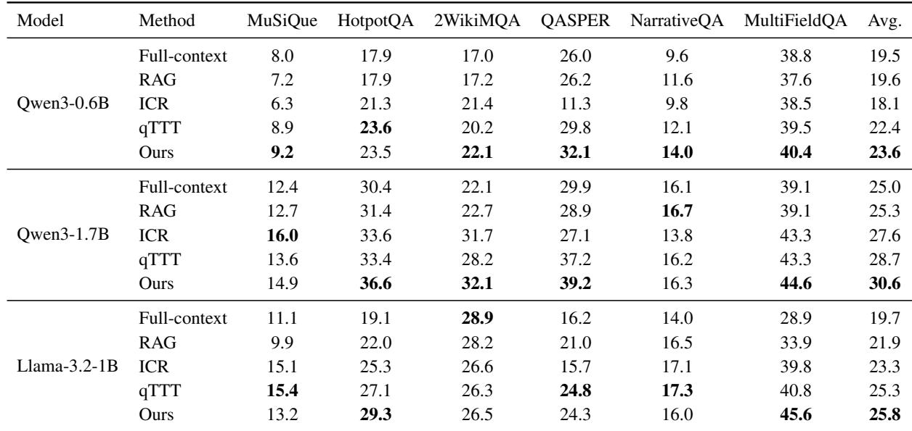
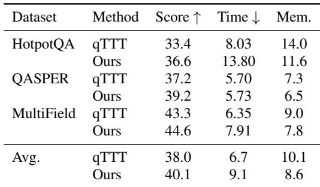
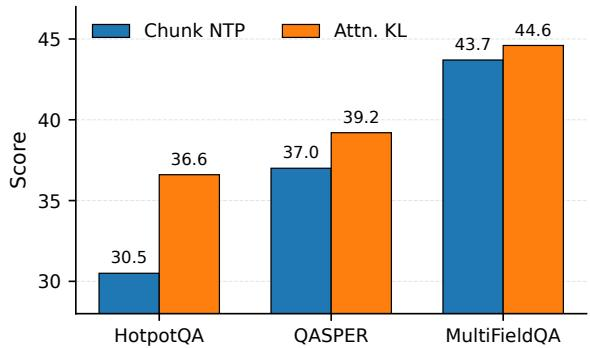
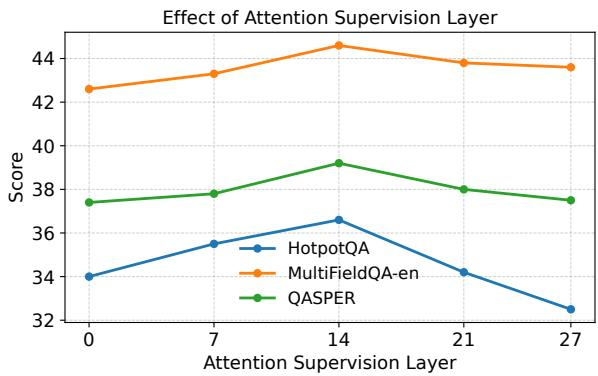

[← 返回 README](../README.md)

# 5. Experiments（实验）

## 📌 预览

实验章节四块：5.1 Setup（6 个 LongBench 任务 × 3 个小模型 × 4 个基线）；5.2 Main Results（Table 1，EASE-TTT macro-average 最强）；5.3 Efficiency（Table 2，+2.4s 换 +2.1 分）；5.4 Ablation（Figure 3 loss 目标消融、Figure 4 层选择）。证据链对齐三条贡献：主结果证"整体最强"，Figure 3 证"soft attention 监督优于 chunk NTP"，Figure 4 证"中间层最佳"，Table 3（在附录）证"utility 优于 BM25"。

---

## 5.1 Setup

> 💡 **5.1 要点预览**: 说清楚"在什么上测、跟谁比、怎么配"。任务 6 个（覆盖 multi-hop / single-doc / narrative / 信息抽取），模型 3 个小 decoder-only，基线 4 个（Full-context、Within-Context RAG、ICR、qTTT）。关键超参已在 04 节小结列出。

Evaluation Datasets. We evaluate our method on six English long-context question answering tasks from LongBench (Bai et al., 2024): MuSiQue, HotpotQA, 2WikiMultihopQA, QASPER, NarrativeQA, and MultiFieldQA-en. These tasks cover multi-hop question answering, single-document question answering, narrative understanding, and long-context information extraction. They require models to locate, aggregate, and reason over relevant evidence in extended input contexts. We report the official task-level evaluation scores and compute the macro-average across the six datasets.

> 💡 **机制拆解（数据集选择）**: 6 个任务刻意覆盖不同证据结构：MuSiQue / HotpotQA / 2WikiMultihopQA 是 **multi-hop**（证据分散、需跨段聚合，最能考验"不切断分布式证据"），QASPER 是科学论文 QA（single-doc），NarrativeQA 是叙事理解（长篇故事），MultiFieldQA-en 是信息抽取。这个组合直接对应引言里"evidence distributed across distant regions"的痛点——multi-hop 任务上如果 EASE-TTT 涨得多，就支撑了"soft target 保留全上下文"的设计。用 macro-average 而非 micro，避免大任务主导。

LLMs and Baselines. We conduct experiments on three small decoder-only language models: Qwen3- 0.6B, Qwen3-1.7B (Yang et al., 2025), and Llama-3.2-1B (Grattafiori et al., 2024). We compare EASE-TTT with four baselines. Full-context directly generates the answer from the full input context, without retrieval or test-time parameter updates. Within-Context Retrieval-Augmented Generation (Within-Context RAG) retrieves the top-ranked chunks from the same input context using the question as the retrieval query, concatenates the retrieved chunks as a shortened context, and generates the answer without accessing any external corpus or updating model parameters. In-Context Retrieval (ICR) retrieves relevant segments from the given long input and uses the retrieved segments, together with the corresponding prompting strategy, to answer the question (Agrawal et al., 2024). Query-Only Test-Time Training (qTTT) performs query-only testtime training by updating query-side parameters using a generic self-supervised next-token prediction objective on sampled context spans (Bansal et al., 2025). EASE-TTT updates only query-side adaptation parameters, but replaces generic spanbased supervision with evidence-guided soft attention supervision constructed from question-relevant chunks selected within the input context. Unlike retrieval-only baselines, EASE-TTT uses selected chunks only to guide test-time adaptation, while final answer generation is performed over the original full context.

> 💡 **机制拆解（基线设计的对照逻辑）**: 4 个基线构成一个精心设计的消融梯度：
> - **Full-context**：不检索、不适配——纯 base model，测"给全上下文够不够"。
> - **Within-Context RAG**：检索但不适配——BM25 选 top4 块拼成短上下文生成（附录 B.2），测"input-level 检索的天花板"。
> - **ICR**（即 R&R，Agrawal 2024）：两阶段检索 + reprompting——更强的 input-level 方法（附录 B.3）。
> - **qTTT**：适配但不 evidence-aligned——本文最关键对照（附录 B.4），唯一差异就是监督信号。
>
> EASE-TTT vs 这四者，正好隔离出三个变量：vs Full-context 测"要不要动"，vs RAG/ICR 测"改输入 vs 改参数"，vs qTTT 测"generic vs evidence-aligned 监督"。所有基线共享同样的 truncation/tokenizer/prompt（附录保证公平）。

Implementation Details. For all methods, we truncate the input context to at most 32,768 tokens and the question to at most 1,024 tokens. The maximum answer length is set to 128 tokens, and we use deterministic decoding. For EASE-TTT, we insert LoRA adapters into the query projection modules while keeping the base model frozen. Unless otherwise specified, we use LoRA rank 8, a scaling factor of 16, and a dropout rate of 0.05. Test-time adaptation is performed for 15 update steps with AdamW, using a learning rate of $1 \times 10^{-4}$ and weight decay of 0.01. We use 512 tokens as the target chunk size, with a minimum chunk size of 128 tokens, a maximum chunk size of 1,024 tokens, and an overlap of 64 tokens. We then rank candidate chunks by the utility score in Section 4 and select the top 4 chunks for evidence-guided adaptation. By default, we use layer $\ell = 14$ for attention alignment. The soft attention target uses a mass parameter of $\alpha = 0.6$

> 💡 **消融解读（超参的可复现要点）**: LoRA rank 8 / scaling 16 / dropout 0.05 是标准轻量配置。适配 15 步、AdamW、lr $1\times10^{-4}$、weight decay 0.01。切块 target 512 / min 128 / max 1024 / overlap 64，选 top 4。默认层 $\ell=14$、$\alpha=0.6$。这些是复现 EASE-TTT 的完整配方。对比 qTTT（附录 B.4）用 32 步、lr $1\times10^{-5}$、随机 128-token span——EASE-TTT 步数减半但学习率大 10 倍，因为它的监督信号更聚焦、可以更"激进"地更新。

## 5.2 Main Results

Table 1 reports the main results on six LongBench QA tasks. Overall, EASE-TTT achieves the best average performance on the Qwen3 models, improving over full-context inference, retrieval-only baselines, and qTTT. On Qwen3-0.6B, EASE-TTT obtains an average score of 23.6, outperforming full-context inference by 4.1 points and qTTT by 1.2 points. On Qwen3-1.7B, EASE-TTT achieves an average score of 30.6, improving over Fullcontext by 5.6 points, Within-Context RAG by 5.3 points, ICR by 3.0 points, and qTTT by 1.9 points.

*Table 1: Main results on six LongBench QA tasks: MuSiQue, HotpotQA, 2WikiMultihopQA, QASPER, NarrativeQA, and MultiFieldQA-en, across Qwen3-0.6B, Qwen3-1.7B, and Llama-3.2-1B. RAG denotes Within-Context Retrieval-Augmented Generation.*

> 💡 **Table 1 批读（主结果证据链）**: 这是全文最重要的证据表。逐模型看 Avg. 列：
> - **Qwen3-0.6B**：Ours 23.6 > qTTT 22.4 > RAG 19.6 ≈ Full 19.5 > ICR 18.1。EASE-TTT 是唯一 >23 的，比 Full-context 高 4.1 分、比 qTTT 高 1.2 分。
> - **Qwen3-1.7B**：Ours 30.6 > qTTT 28.7 > ICR 27.6 > RAG 25.3 > Full 25.0。差距最大：比 Full 高 5.6、比 qTTT 高 1.9。
> - **Llama-3.2-1B**：Ours 25.8 > qTTT 25.3 > ICR 23.3 > RAG 21.9 > Full 19.7。EASE-TTT 仍居首但对 qTTT 仅高 0.5 分（"gain varies across model family"的具体体现）。
>
> **诚实之处**：EASE-TTT 并非每个单任务都最强。Llama 上 MuSiQue（Ours 13.2 < qTTT 15.4 < ICR 15.1）、NarrativeQA（Ours 16.0 < qTTT 17.3）、QASPER（Ours 24.3 < qTTT 24.8）都被反超；Qwen3-1.7B 的 MuSiQue（Ours 14.9 < ICR 16.0）也是。作者 claim 的是 macro-average 最强，这个 claim 成立，但单任务有波动。**增益最一致的地方**是需要跨长输入定位/整合证据的任务：2WikiMultihopQA、QASPER、MultiFieldQA——这恰好支撑了"evidence-localized 监督对分布式证据任务更有效"的机制假设。

These results support our hypothesis that longcontext QA depends not only on context availability, but also on reliable evidence access. Fullcontext inference is consistently weaker than adaptation-based methods, indicating that simply providing the full input is insufficient. Retrievalonly methods improve some tasks, but their gains are inconsistent. For example, ICR improves MuSiQue and 2WikiMultihopQA on Qwen3- 1.7B, but underperforms full-context inference on QASPER and NarrativeQA, suggesting that shortened retrieved contexts may also discard useful surrounding information.

> 💡 **消融解读（三个论断的证据对齐）**: 这段把 Table 1 拆成三个可验证论断：(1) **Full-context 一致最弱**（三个模型 Avg 都垫底或接近垫底）→ 证"给全上下文不够，需要适配"；(2) **retrieval-only 增益不一致**——ICR 在 Qwen3-1.7B 上 MuSiQue/2Wiki 涨但 QASPER/NarrativeQA 跌破 Full-context → 正面印证引言"hard selection 会 discard useful surrounding information"的预言；(3) 隐含论断：adaptation-based（qTTT + Ours）整体强于 input-level（RAG/ICR）→ 证"改参数 > 改输入"。这三个论断层层支撑最终主张：evidence access 才是瓶颈，且要用 evidence-aligned adaptation 解决。

Compared with qTTT, EASE-TTT improves the macro-average scores on all three models, although the size of the gain varies across model family. This suggests that evidence-localized supervision provides a more targeted adaptation signal than generic span-based self-supervision, while preserving fullcontext generation. The gains are more visible on several tasks that require locating or integrating evidence across long inputs, such as 2WikiMultihopQA, QASPER, and MultiFieldQA-en. These gains show the benefit of anchoring test-time updates to question-relevant evidence.

> 💡 **消融解读（vs qTTT 的核心增益归因）**: 这段是全文最关键的因果 claim——EASE-TTT 与 qTTT 唯一差异是监督信号（evidence-aligned attention KL vs generic span NTP），所以三个模型上一致的 macro-average 提升可归因于"evidence-localized supervision 更 targeted"。作者诚实承认 "the size of the gain varies across model family"（Llama 上只 +0.5，Qwen 上 +1.2~+1.9）。增益集中在 2Wiki/QASPER/MultiFieldQA 这些需要跨长输入定位/整合的任务——这与 Figure 3 的 loss 消融互为佐证。

## 5.3 Efficiency Analysis

Table 2 compares qTTT and EASE-TTT on three profiled LongBench tasks using Qwen3-1.7B. We focus on qTTT because it is the closest adaptationbased baseline: both methods perform query-side test-time adaptation, but use different supervision signals. EASE-TTT improves the average score from 38.0 to 40.1, while increasing the average per-example runtime from 6.7s to 9.1s. This corresponds to a 2.1-point score improvement with an additional 2.4s per example.

*Table 2: Efficiency comparison on three profiled LongBench tasks using Qwen3-1.7B. Time is measured in seconds and memory is measured in GB.*

> 💡 **Table 2 批读（效率-精度权衡）**: 只跟最近的 qTTT 比（同为 query-side adaptation）。逐任务读：HotpotQA（Ours 36.6 vs qTTT 33.4，但时间 13.8s vs 8.0s——这个任务代价最大）、QASPER（39.2 vs 37.2，时间几乎持平 5.73 vs 5.70s）、MultiField（44.6 vs 43.3，7.91 vs 6.35s）。平均：Score 40.1 vs 38.0（+2.1），Time 9.1 vs 6.7s（+2.4s），**Memory 反而更低 8.6 vs 10.1 GB**。
> - 额外时间来自 evidence selection（要跑前向算 NLL + 每块算 utility）+ attention-map 抽取对齐。
> - 内存更低的原因论文未细说，可能与 qTTT 32 步 vs EASE-TTT 15 步、或采样 span 长度差异有关。
> - 结论："trades moderate additional latency for better accuracy"——用 +36% 时间换 +2.1 分。这个权衡是否划算取决于场景，属于方法的诚实局限之一。

The additional cost mainly comes from evidence selection and attention-map supervision. Unlike qTTT, which optimizes a standard next-token prediction loss on sampled spans, EASE-TTT first identifies question-relevant evidence chunks and constructs a soft target over full-context positions. During adaptation, it also extracts and aligns the selected-layer attention distribution with this target, which introduces extra computation beyond the generic span-based objective. Peak GPU memory remains in a comparable range across the profiled runs. Overall, EASE-TTT trades moderate additional latency for better accuracy over qTTT.

## 5.4 Ablation Study

> 💡 **5.4 要点预览**: 两个消融——Figure 3 隔离"loss 目标"（Chunk NTP vs Attn. KL，证明增益来自监督形式而非仅仅"看到证据"），Figure 4 隔离"适配层"（中间层最佳）。附录 B.5 还有 Table 3 的 evidence source 消融（BM25 vs Utility）。

Loss Objective. Figure 3 evaluates the effect of the adaptation objective. Chunk NTP adapts the model on selected evidence chunks using a standard next-token prediction loss, while Attn. KL directly aligns the model's attention distribution with the selected evidence positions. Attn. KL consistently outperforms Chunk NTP on all three tasks, improving HotpotQA from 30.5 to 36.6, QASPER from 37.0 to 39.2, and MultiFieldQA from 43.7 to 44.6. This comparison shows that the benefit of EASE-TTT does not come simply from exposing the model to selected evidence during test-time training. If the selected chunks are used only as ordinary next-token prediction data, the adaptation objective remains weakly connected to the final evidence-access problem. In contrast, Attn. KL converts the selected chunks into an explicit supervision signal over full-context positions. This better matches the goal of EASE-TTT: improving how the model attends to evidence while still generating from the original full context.

*Figure 3: Objective ablation on Qwen3-1.7B. Attn. KL outperforms Chunk NTP, showing the benefit of using selected evidence as explicit attention supervision.*

> 💡 **Figure 3 批读（最关键消融：监督形式 vs 仅暴露证据）**: 这个消融回答了一个致命的对手质疑——"你的增益是不是只因为把好的证据块喂给了模型，而跟 attention KL 这个花哨设计无关？" 作者用 **Chunk NTP** 做对照：同样用选中的证据块，但用普通 next-token prediction loss（即把公式1 的随机 span 换成"选中的好块"）。结果 **Attn. KL 三个任务全胜**：HotpotQA 30.5→36.6（+6.1，增益最大）、QASPER 37.0→39.2（+2.2）、MultiFieldQA 43.7→44.6（+0.9）。
> - **结论的分量**：这证明 EASE-TTT 的核心价值不在"选到好证据"，而在"把证据转成 full-context 位置上的显式注意力监督"。即使用同样的好块，NTP 形式的适配与"最终证据访问问题"只是 weakly connected，而 attention KL 直接对齐了"模型该往哪看"。这是对方法核心公式5 最直接的辩护。
> - HotpotQA 增益最大（+6.1）与 Table 1 里 HotpotQA 是 multi-hop 任务一致——分布式证据任务最受益于显式注意力对齐。

Effect of Attention Layer. Figure 4 studies how the choice of attention supervision layer affects performance. This choice is not merely an implementation detail, because recent layer-wise analyses suggest that different LLM layers play different functional roles. Lower layers are more involved in gathering information from previous tokens, while upper layers increasingly consolidate the gathered information internally (Artzy and Schwartz, 2024). In addition, intermediate layers can encode stronger task-relevant representations than final layers for downstream tasks (Skean et al., 2025).

Our results are consistent with this view. Very early layers are less effective, likely because their attention patterns are still dominated by low-level context gathering rather than question-specific evidence use. The final layer is also not necessarily optimal, since it may be more closely tied to consolidated representations and final prediction. Intermediate layers provide a better trade-off: they are sufficiently contextualized to reflect questionrelevant evidence, while still leaving room for the alignment signal to influence subsequent computation. This explains why EASE-TTT benefits more from supervising intermediate attention layers than from supervising the earliest or final layers.

*Figure 4: Effect of attention layer on EASE-TTT using Qwen3-1.7B. The results compare different attention layers while keeping all other hyperparameters fixed.*

> 💡 **Figure 4 批读（层选择的功能性解释）**: 这个消融解释了默认 $\ell=14$ 的由来。作者借两篇层分析工作立论：Artzy & Schwartz (2024) 发现**低层负责从前面 token 收集信息、高层负责内部整合**；Skean et al. (2025) 发现**中间层的 task-relevant 表示比最终层更强**。EASE-TTT 的层扫描结果与此一致：
> - **极早层差**：注意力还被 low-level context gathering 主导，没到 question-specific 证据使用阶段——此时监督"往证据看"没意义，因为它还没在做语义级检索。
> - **最终层非最优**：太接近 consolidated 表示和最终预测，改它留给后续计算的影响空间小。
> - **中间层最佳**：既足够 contextualized 能反映问题相关证据，又留有下游计算空间让对齐信号传播。
>
> 这个解释很关键——它说明 attention 监督不能随便挑层，必须挑"模型正在做语义级证据定位"的那一层（对 Qwen3-1.7B 约在第 14 层）。这也提示方法迁移到别的模型时，$\ell$ 需要重新调（属于超参敏感点）。

## 🔖 Section 总结

### 关键数字速查
| 指标 | 数值 |
|------|------|
| Qwen3-0.6B Avg (Ours) | 23.6（vs Full +4.1, vs qTTT +1.2） |
| Qwen3-1.7B Avg (Ours) | 30.6（vs Full +5.6, vs RAG +5.3, vs ICR +3.0, vs qTTT +1.9） |
| Llama-3.2-1B Avg (Ours) | 25.8（vs qTTT 仅 +0.5） |
| 效率权衡 | 40.1 vs 38.0（+2.1 分），9.1s vs 6.7s（+2.4s），内存反降 8.6 vs 10.1 GB |
| Figure 3 loss 消融 | Attn.KL 全胜；HotpotQA 30.5→36.6（+6.1） |
| 最佳层 | 中间层（默认 $\ell=14$） |

### 核心洞察
1. **macro-average 最强但单任务有波动**：Llama 上 MuSiQue/NarrativeQA/QASPER 被 qTTT 反超——claim 是整体最强，不是全胜。
2. **Figure 3 是方法最硬的辩护**：同样的好块，attention KL 显著优于 chunk NTP，证明增益来自"监督形式"而非"仅暴露证据"。
3. **中间层最优有理论支撑**：低层收集、高层整合、中间层 task-relevant 最强——$\ell$ 是需随模型调的敏感超参。
4. **效率诚实**：+36% 延迟换 +2.1 分，但内存反而更省。

### 可追问点
- 为什么 Llama 上增益远小于 Qwen？"varies across model family" 未深究——可能与 Llama 的注意力头结构/层功能分布不同有关。
- Figure 3/4 只在 Qwen3-1.7B 上做，未验证结论在 0.6B/Llama 上是否成立。
