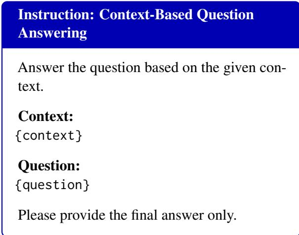
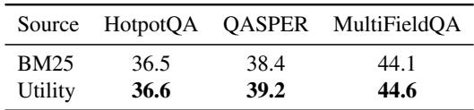

[← 返回 README](../README.md)

# 6. Conclusion & Limitations & Appendix（结论、局限与附录）

## 📌 预览

本节合并论文尾部三块：Conclusion（重申方法与结论）、Limitations（两条：仅测 QA 类任务、仅测小模型）、Appendix A~B（prompt 模板、四个基线的实现细节、Table 3 证据源消融）。附录里最有信息量的是 B.4（qTTT 精确超参，用于对照）和 B.5（Table 3，utility vs BM25）。

---

## 6. Conclusion

We studied long-context question answering for smaller language models, where answer-bearing evidence may already be present in the input but not reliably accessed by the model. We proposed EASE-TTT, a within-context retrievalaugmented test-time training framework that localizes evidence chunks and converts them into soft attention supervision for query-side adaptation. Rather than replacing the full context with retrieved chunks, EASE-TTT uses localized evidence to guide lightweight test-time updates while generating the final answer from the original full context. Experiments on six LongBench QA tasks show that EASE-TTT improves over full-context inference, retrieval-only baselines, and qTTT. Ablation results further show that explicit attention alignment is more effective than next-token prediction on selected chunks, suggesting that localized evidence is most useful when it guides how the model attends to the full context rather than only exposing relevant content. These findings highlight evidence-aware test-time adaptation as a promising direction for smaller long-context models.

> 💡 **机制拆解（结论的证据回收）**: 结论把全文收成一句可复用的洞察——"localized evidence is most useful when it guides **how** the model attends to the full context rather than only **exposing** relevant content"。这句话精确对应 Figure 3 消融：Attn.KL（guide how it attends）> Chunk NTP（expose content）。注意结论没有夸大——只说"improves over"三类基线（macro-average 层面），没说全任务最强，与 Table 1 的诚实呈现一致。

## Limitations

This work has several limitations. First, our experiments focus on long-context question answering tasks, where answer-relevant information is usually expected to appear in the input context. Although this setting directly matches our research question, further evaluation is needed to understand how EASE-TTT generalizes to other types of tasks, such as mathematical reasoning, symbolic reasoning, and open-ended generation.

Second, our study mainly evaluates relatively small language models. Since larger models may already have stronger long-context utilization ability, the effect of evidence-guided test-time adaptation may vary across model scales. Future work can examine how the proposed approach behaves on larger models and different model family.

> 💡 **消融解读（局限的诚实度）**: 两条局限都击中要害：(1) **任务类型受限**——方法核心假设是"答案证据已在输入里"，这对 QA 成立，但对数学/符号推理/开放生成（答案不一定"在上下文里"、需要推导或创造）可能失效。因为 soft attention target 依赖"存在可定位的证据位置"，无证据可定位的任务上这套监督信号无从构造。(2) **模型规模受限**——大模型可能已有更强的长上下文利用能力，evidence-guided adaptation 的边际收益可能递减。这条与 Table 1 里"gain varies across model family"呼应，也是为什么全文只敢 claim smaller models。

## A Prompt Templates

*Appendix A: Prompt template for context-based QA. {context} 是 benchmark 提供的完整上下文，{question} 是对应问题。*

We use the following prompt template for all context-based question answering experiments. The placeholder {context} denotes the full input context provided by the benchmark, and {question} denotes the corresponding question. To ensure consistent evaluation, we instruct the model to output only the final answer without additional explanations or intermediate reasoning.

> 💡 **机制拆解（prompt 一致性）**: 所有方法共用同一个极简 prompt（"Answer the question based on the given context. Context:{context} Question:{question} Please provide the final answer only."）。关键是 "final answer only"——禁止中间推理/解释，保证评测只看答案本身、不被 CoT 长度干扰。这也说明 EASE-TTT 的增益是纯"证据访问"层面的，不涉及推理链改进。

## B Baseline Implementation Details

### B.1 Full-Context Inference

We use full-context inference as the base-model baseline. This baseline directly feeds the benchmark-provided context and question into the pretrained model and generates the answer without retrieval, prompt compression, or test-time parameter updates. For a fair comparison, we use the same model checkpoints, tokenizer, prompt template, context truncation, question truncation, maximum answer length, and decoding strategy as EASE-TTT. Specifically, the input context is truncated to at most 32,768 tokens, the question is truncated to at most 1,024 tokens, and the maximum answer length is set to 128 tokens. We use deterministic decoding for all evaluated models. No LoRA adapters are inserted, and all model parameters remain unchanged during inference.

### B.2 Within-Context RAG

We implement Within-Context RAG as a retrievalonly baseline that uses the same input context as the original long-context QA instance and does not access any external corpus. For a fair comparison with EASE-TTT, we use the same context preprocessing, tokenizer, truncation limits, prompt template, and decoding settings as our method. The input context is first truncated to at most 32,768 tokens, and the question is truncated to at most 1,024 tokens. The maximum answer length is set to 128 tokens, and deterministic decoding is used.

For retrieval, we segment the truncated context into fixed-length chunks of 512 tokens. We then use BM25 to rank these chunks with the question as the retrieval query and select the top 4 chunks as the retrieved context. The selected chunks are concatenated in their original document order and passed to the base model for answer generation. Within-Context RAG does not access any external documents, does not insert LoRA adapters, and does not perform test-time parameter updates.

> 💡 **机制拆解（RAG 与 EASE-TTT 的最小对照）**: Within-Context RAG 与 EASE-TTT 的检索侧几乎相同——都切 512-token 块、都选 top 4。唯一差异：RAG 把选中块拼成**短上下文直接生成**（input-level），EASE-TTT 用它们当**注意力监督信号**、生成仍用全上下文。所以 Table 1 里 EASE-TTT vs RAG 的差距，可近似归因于"改参数 vs 改输入"这一变量（检索源相同，都可视作 BM25 式；不过 EASE-TTT 默认用 utility 分数，见 B.5）。

### B.3 ICR

We implement R&R following the original paper and use the official open-source implementation released by the authors. R&R combines reprompting and in-context retrieval (ICR) to improve longcontext question answering performance. Following the original setup, documents are divided into page-level segments, and the model first performs retrieval by identifying the top-k most relevant pages for the given question before conducting a second QA step on the abbreviated context. Following the default configuration in the original work, we retrieve the top-k = 5 pages during the ICR stage. During reprompting, reminder instruction blocks are periodically inserted throughout the long context to mitigate the lost-in-the-middle effect by reducing the distance between relevant evidence and task instructions. Specifically, reminder prompts are inserted approximately every r = 10k tokens following the implementation described in the original paper. The retrieval stage uses the same two-stage retrieval-and-answering pipeline as the original implementation, where the first LLM call retrieves relevant page IDs and the second LLM call performs QA on the abbreviated context constructed from the retrieved pages. Following the original implementation, we use the official prompt templates, retrieval formatting, and hyperparameter settings provided by the authors for all experiments.

> 💡 **机制拆解（ICR = R&R）**: ICR 实为 R&R（Agrawal 2024）——两阶段：先 LLM 检索 top-5 page IDs，再在缩略上下文上做 QA；同时用 reprompting 每 10k token 插一次 reminder 指令，缓解 lost-in-the-middle（缩短证据与指令的距离）。这是四个基线里最"重"的 input-level 方法（两次 LLM 调用）。Table 1 显示它在 multi-hop 任务上偶尔很强（Qwen3-1.7B 的 2Wiki 31.7），但 QASPER/NarrativeQA 上会跌破 Full-context——印证 input-level 方法增益不稳。

### B.4 qTTT

We implement qTTT following the original paper and use the official open-source implementation released by the authors. Following the original setup, qTTT performs lightweight test-time adaptation on the query projection modules using LoRA adapters rather than updating the full model parameters. During inference, the key and value projections remain frozen, allowing the model to reuse the precomputed KV cache without recomputing full-context representations. Following the default configuration in the original work, qTTT performs $N_{\mathrm{qTTT}} = 32$ gradient update steps during inference using randomly sampled spans of length $k = 128$ tokens, with a learning rate of $1 \times 10^{-5}$ . Test-time optimization is applied only to the query-side attention parameters while all remaining model weights stay frozen. The adaptation objective follows the standard next-token prediction loss computed over sampled context spans, using the optimization procedure and default hyperparameter settings provided in the original implementation. Following the motivation of qTTT, this adaptation strategy is designed to mitigate attention score dilution in long-context reasoning by improving retrieval of relevant context tokens during inference while preserving efficient KV-cache reuse.

> 💡 **消融解读（qTTT 精确超参，对照锚点）**: 这是理解 EASE-TTT 增益归因的关键附录。qTTT 与 EASE-TTT 共享同一套架构——query 投影插 LoRA、KV 冻结、复用 KV 缓存。**唯一差异是监督信号与训练配置**：qTTT 用 $N=32$ 步、随机 128-token span、lr $1\times10^{-5}$、标准 NTP loss（公式1）；EASE-TTT 用 $N=15$ 步、evidence-aligned soft attention target、lr $1\times10^{-4}$、KL loss（公式5）。qTTT 的初衷是缓解 "attention score dilution"（长上下文里注意力被稀释）——但它靠随机 span 的 NTP 间接实现，EASE-TTT 则用显式证据位置直接实现。所以 Table 1/Table 2 的 Ours vs qTTT 差距，是"generic vs evidence-aligned 监督"的净效应（尽管步数/学习率也不同，属于方法整体配置差异）。

### B.5 Evidence Selection

*Table 3: Effect of evidence source on Qwen3-1.7B. Scores are reported on three LongBench QA tasks.*

Table 3 examines the source of evidence used to construct the attention target. Utility-based selection slightly but consistently improves over BM25 across all three tasks. This suggests that BM25 can retrieve useful lexical matches, while the proposed utility score provides a more task-aligned signal for selecting evidence chunks. Since the utility score measures how much a chunk improves question modeling, it is better aligned with the downstream adaptation objective than purely lexical retrieval. The consistent gains support our use of utility-based evidence selection for evidenceguided test-time training.

> 💡 **Table 3 批读（证据源消融：utility vs BM25）**: 这个消融验证公式2 的 utility 分数是否真比词面检索强。数据：HotpotQA（Utility 36.6 vs BM25 36.5）、QASPER（39.2 vs 38.4）、MultiFieldQA（44.6 vs 44.1）。
> - **结论诚实**："slightly but consistently improves"——三个任务全赢但幅度小（+0.1~+0.8）。QASPER 增益最大（+0.8），因为科学论文 QA 更依赖语义相关而非词面重合。
> - **机制解释**：BM25 抓 lexical match，utility 分数抓"这块能不能改善问题建模"（信息增益式），后者与下游适配目标 better aligned。
> - **诚实之处**：作者没夸大——承认 BM25 能抓有用的词面匹配，utility 只是"更 task-aligned 的边际改进"。这也说明 EASE-TTT 的主要增益来自**监督形式（Figure 3，Attn.KL）**而非**证据源（Table 3，utility）**——Figure 3 的增益（+0.9~+6.1）远大于 Table 3（+0.1~+0.8）。

## 🔖 Section 总结

### 关键数字速查
| 项 | 值 |
|------|------|
| qTTT 超参（对照） | $N=32$ 步、span 128 token、lr $1\times10^{-5}$、NTP loss |
| Within-Context RAG | 512-token 块、BM25、top4、拼短上下文生成 |
| ICR (R&R) | top-5 pages、每 10k token 插 reminder、两次 LLM 调用 |
| Table 3 utility vs BM25 | HotpotQA 36.6/36.5、QASPER 39.2/38.4、MultiField 44.6/44.1 |

### 核心洞察
1. **增益归因排序**：监督形式（Figure 3，Attn.KL vs Chunk NTP，最大 +6.1）> 训练配置 > 证据源（Table 3，utility vs BM25，最大 +0.8）。方法的灵魂是 attention KL，不是证据选择。
2. **两条局限直指边界**：仅适用"答案在输入里"的 QA、仅验证小模型——大模型和无定位证据的任务是明确的未验证区。
3. **公平对照做得扎实**：所有基线共享 truncation/tokenizer/prompt/decoding，qTTT 用官方实现——Ours vs qTTT 的差距可信度高。
