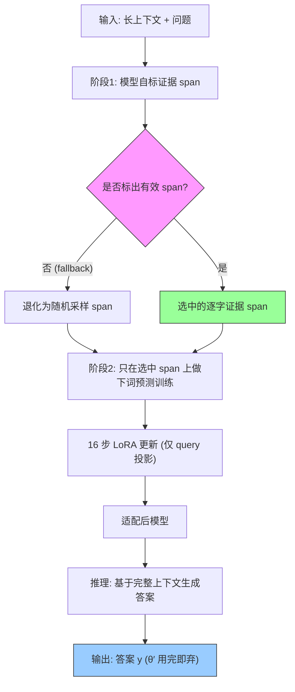

# Self-Guided Test-Time Training for Long-Context LLMs

## 论文信息

**标题**: Self-Guided Test-Time Training for Long-Context LLMs
**作者**: Xinyu Zhu, Zhe Xu, Xiaohan Wei, Yunchen Pu, Fei Tian, Chonglin Sun, Kaushik Rangadurai, Hua Zhi, Frank Shyu, Sandeep Pandey, Luke Simon, Yu Meng, Xi Liu
**机构**: Meta AI · University of Virginia
**会议/年份**: arXiv 预印本 | 2026（arXiv 2607.09415，日期 2026-07-10）
**通讯**: Yu Meng (yumeng5@virginia.edu), Xi Liu (xliu1@meta.com)

---

## 一句话总结

长上下文 test-time training（TTT）的真正瓶颈不是"怎么训"而是"训哪些 token"——本文让 LLM 自己先标出与问题相关的证据 span，只在这些 span 上做标准 next-token 训练、最后仍用完整上下文答题（Self-Guided TTT，S-TTT），从而稳定提升长上下文准确率、并在长上下文下比其他 TTT 变体更省算力。

---

## 核心贡献

1. **重新定位瓶颈**：首次把"训练数据质量"确立为长上下文 TTT 被忽视的核心变量。诊断实验（长度对齐后）证明 random span TTT 掉点（40.4→38.9），oracle span TTT 大涨（→45.9），把"训什么"的因果贡献与"训多少 / 怎么训"干净隔离。
2. **提出 S-TTT**：让 base model 自身充当 test-time data selector，标出 verbatim 证据 span，只在其上做 next-token 适配；不改训练目标、不改架构、不改解码，仅优化"用于适配的 token 子集"，并带 fallback（标不出就退化为 random span）保底。
3. **两模型 × 两 benchmark 验证**：在 Qwen3-4B-Thinking-2507 与 Llama-3.1-8B-Instruct、LongBench-v2 与 LongBench-Pro 上，S-TTT 是唯一在所有 setting 都不掉点的方法，长上下文桶优势最大，且延迟在 64k 起低于其他非冻结 KV 的 TTT 变体。

---

## 📖 批读导航

| Section | 内容 |
|---------|------|
| [00 - Abstract](sections/00-abstract.md) | 摘要 + 核心命题（瓶颈=数据质量）+ 诊断数字预告 |
| [01 - Introduction](sections/01-introduction.md) | 问题动机 + gap（what to adapt on）+ 三点贡献 |
| [02 - Method](sections/02-method.md) | §2.1 诊断实验（Table 1）+ §2.2 两阶段 S-TTT（Figure 1、公式 1-3、Algorithm 1） |
| [03 - Experiments](sections/03-experiments.md) | Setup（7 个 baseline）+ 主结果（Table 2）+ 三条观察 |
| [04 - Analysis](sections/04-analysis.md) | §4.1 selector 对比（Table 3）+ §4.2 注意力案例（Figure 2）+ §4.3 效率（Figure 3） |
| [05 - Related / Conclusion / Appendix](sections/05-related-conclusion-appendix.md) | 相关工作定位 + 结论 + 附录 A-E（LoRA 配置、fallback 表、prompt、可视化、落地展望） |

---

## 关键数字

| 指标 | 数值 |
|------|------|
| 诊断三档（Qwen3, LB-v2）Base / Random / Oracle | 40.4 / 38.9 / 45.9 |
| oracle vs random 净质量差（长度对齐） | ~7 个点 |
| S-TTT（Qwen3, LB-v2, <64k / 64k-128k） | 47.7 / 35.3（vs base 46.7 / 30.7） |
| S-TTT（Qwen3, LB-Pro, 64k-128k） | 42.0（反超所有 TTT baseline） |
| S-TTT（Llama, LB-Pro, <64k / 64k-128k） | 29.9 / 21.7（vs base 28.2 / 19.4，全最优） |
| Table 3 selector（Model / PPL / Entropy, 64k-128k） | 35.3 / 31.9 / 33.0 |
| 有效训练窗口（Random / S-TTT LB-v2 / S-TTT LB-Pro） | 0.50C / 0.39C / 0.37C |
| 效率 crossover（vs Full Context TTT） | 64k 起 S-TTT 更便宜 |
| fallback 率（Qwen v2/Pro, Llama v2/Pro） | 8.2% / 21.5% / 6.9% / 39.9% |
| LoRA 配置 | 仅 query proj, r=16, α=32, 16 步 |
| 宣称最大相对提升 | ~15% |

---

## 数据流：输入 → 中间表示 → 输出

| 阶段 | 输入 | 变换 | 输出 |
|------|------|------|------|
| 1. span 选择 | 完整上下文 + 问题（v2 附选项） | base model 判相关性、逐字标注 | ≤8 个 verbatim 证据 span（或 fallback 随机 span） |
| 2. TTT 适配 | 选中 span + 其前缀 | 16 步 next-token 预测、LoRA 更新 query 投影 | 适配后参数 θ′ |
| 3. 推理生成 | 完整上下文 + 问题 | 用 θ′ 采样解码 | 答案 y（θ′ 随后丢弃） |

---

## 优缺点与还能做什么

### 优点
- **概念简单、工程可落地**：不改目标/架构/解码，只加一个"标 span"前置步骤，天然兼容 vLLM 等现代推理引擎（无需改注意力）。
- **因果论证干净**：oracle/random span 长度对齐后仍差 7 点，把"数据质量"这一变量隔离得非常清楚。
- **稳定不掉点**：唯一在所有 setting 都 ≥ base 的方法；长上下文桶优势最大。
- **效率反直觉双赢**：选得准 → span 更局部（0.39C vs 0.50C）→ 长上下文下反而更省时。
- **fallback 保底**：标不出 span 就退化为 random span，性能下界 ≥ random span TTT。

### 局限 / 风险
- **绝对提升有限**：多为 1-4 个点，短上下文桶偶尔被 qTTT/QRHead 略超，非碾压式改进。
- **self-annotation 可靠性依赖任务/模型**：开放题 + 弱模型时 fallback 高（Llama-Pro 39.9%），近 4 成 instance 其实退化为随机。
- **延迟仍是瓶颈**：生成前的适配开销在短上下文下反而拖慢；per-instance 一次性适配有浪费。
- **机制证据偏定性**：注意力局部增强只有单例/少量可视化，缺统计量化。
- **span 标注 prompt 未完全公开**，verbatim 校验实现细节不透明。

### 还能做什么
- **多轮 session 复用**（Appendix E）：文档级适配权重挂在会话上，摊薄适配成本。
- **提升弱模型/开放题的 self-annotation**：降低 fallback（如用更强 selector 或迭代精修 span）。
- **selector 与 TTT 联合优化**：目前 selector 是零样本 prompt，可否学一个轻量选择器。
- **量化注意力机制**：把 §4.2 的局部注意力增强做成统计指标，验证与准确率提升的相关性。

---

## 阅读 Q&A 记录

- **Q: 为什么 random span TTT 会比不训还差？**
  A: 长文里均匀采样的 span 大多与问题无关，模型是在"往 distractor 上适配"，反而学偏。见 [02-method](sections/02-method.md) §2.1 与 Table 1（40.4→38.9）。

- **Q: oracle span 的 7 点增益会不会只是因为训练 token 更多？**
  A: 不是。作者明确把 oracle span 长度控制得与 random span 相当，token 数量被对齐，7 点差距纯来自内容质量。见 [02-method](sections/02-method.md) §2.1。

- **Q: 既然要选 span，为什么不直接用 perplexity/entropy 这类免标注信号？**
  A: 因为"难预测 ≠ 与问题相关"——高困惑度可能只是格式怪、实体罕见。question-conditioned 标注在长桶明显更好（Table 3：35.3 vs 31.9/33.0）。见 [04-analysis](sections/04-analysis.md) §4.1。

- **Q: S-TTT 到底改变了模型的什么？**
  A: 在选中证据 span 上做 next-token 适配，诱导出对该 span 的**局部化**注意力增强（中间层最明显），框外几乎不变。见 [04-analysis](sections/04-analysis.md) §4.2 Figure 2 差值图。

- **Q: 加了一步 annotation，不是更慢吗？**
  A: 短上下文确实更慢，但存在 crossover：64k 起 S-TTT 比 Full Context TTT 便宜。因为选得准 → span 局部 → 有效训练窗口只有 0.39C（vs random 的 0.50C）。见 [04-analysis](sections/04-analysis.md) §4.3。

- **Q: Llama 在 LongBench-Pro 上 fallback 高达 39.9%，S-TTT 还有意义吗？**
  A: 仍有意义——即便近 4 成退化为 random，S-TTT 在该 benchmark 两桶仍最优，说明剩下 60% 有效标注的高价值增益足以拉动整体。fallback 机制保证了性能下界。见 [05-...](sections/05-related-conclusion-appendix.md) Appendix B。

---

## 📊 Citation Landscape

> 数据来源：Semantic Scholar API（arXiv 2607.09415）。论文详情/TLDR 端点在本次查询时返回 429（rate limit）且该论文过新（2026-07 提交）尚未生成 TLDR；以下为 Recommendations API 返回的高相关论文（数据可用部分）。

**TLDR**: （Semantic Scholar 尚未为该新论文生成自动摘要。）人工一句话：用 LLM 自身选择 question-relevant 证据 span 作为 test-time training 数据，将长上下文 TTT 的瓶颈重新定位为"训练 token 质量/选择"。

**引用统计**: 论文详情端点当前限流（429），引用数/参考文献数暂缺；该论文为 2026-07 的新预印本，被引尚少。

**相关论文推荐（Semantic Scholar Recommendations，Top 10 按相关性）**:

| 论文 | 年份 | 主题关联 |
|------|------|----------|
| EASE-TTT: Evidence-Aligned Selective Test-Time Training for Long-Context QA | 2026 | 与本文最近——证据对齐的选择性 TTT |
| Test-Time Training with Next-Token Prediction | 2026 | 同样的 next-token TTT 目标 |
| No Time Like the Present: Agentic Test-Time Training for LLM Agents | 2026 | TTT 在 agent 场景 |
| ReContext: Recursive Evidence Replay as LLM Harness for Long-Context Reasoning | 2026 | 长上下文证据重放 |
| Beyond Perplexity: Behavioral Evaluation for Deployment-Memory Claims in LLM TTT | 2026 | TTT 的记忆/评测 |
| RW-TTT: Batched Serving for Request-Owned Test-Time Training State | 2026 | TTT 的 serving（呼应 Appendix E） |
| LongAttnComp: Cross-Family Context Compression for Long-Context Reasoning | 2026 | 长上下文压缩（对照路线） |
| The Long-Term Effects of Data Selection in LLM Fine-Tuning | 2026 | 数据选择（呼应本文核心洞察） |
| Entropy-KL Token Masking: Selective Fine-tuning of LLMs | 2026 | token 级选择性微调 |
| Data-Efficient Adaptation of LLMs via Attention Head Reweighting | 2026 | 高效适配（对照 QRHead 路线） |

**相关链接**:
- Connected Papers: https://www.connectedpapers.com/main/2607.09415
- Semantic Scholar: https://www.semanticscholar.org/arxiv/2607.09415
