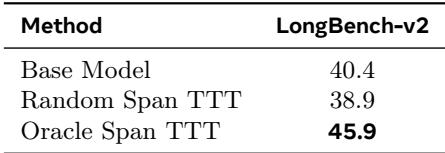
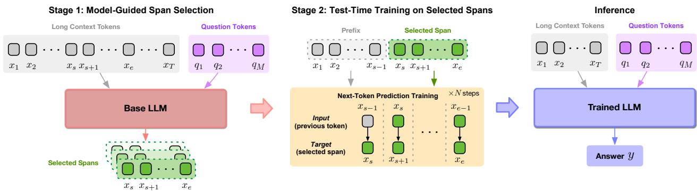

[← 返回 README](../README.md)

# 2. Method（方法）

## 📌 预览

方法分两小节：§2.1 用诊断实验（Table 1）证明"TTT 对训练 token 质量极度敏感"，隔离出数据质量这一变量；§2.2 给出 S-TTT 的两阶段流程——Stage 1 让模型自标 verbatim 证据 span，Stage 2 只在这些 span 上做 next-token 训练，最后从 full context 生成答案。Figure 1 是整体框架图，Algorithm 1 是 per-instance 伪代码。

---

## 2.1 Preliminary analysis（预备分析：TTT 对数据质量敏感）

> 💡 **2.1 要点预览（Hao 批注）**：这一小节要回答"为什么不能随便挑 span"。核心是一个三行的诊断表（Table 1）：base / random / oracle 三档，把"训练 token 质量"这一个变量单独拎出来看它对准确率的因果影响。

Test-time training has been used to improve LLMs long-context performance by adapting the model to the specific context observed at test time. For long inputs, however, directly training on the full context is expensive, and a naive alternative is to train on short spans sampled uniformly from the context. This reduces the compute but has a cost: in a long document, most uniformly sampled spans are irrelevant to the question. As a result, TTT on randomly sampled spans may adapt the model to distractors rather than evidence.

> 💡 **机制拆解（Hao 批注）**：这段把"random span 省算力"的代价说清楚——长文里均匀采样的 span 大多与问题无关，于是模型是在"往 distractor 上适配"。这正是后面 Table 1 里 random span 掉点的机制解释。

*Table 1: Test-time training is sensitive to training-token quality. Training Qwen3-4B-Thinking-2507 on random span tokens does not lead to improvement; instead, it hurts performance.*

> 💡 **Table 1 批读（Hao 批注）**：全文最关键的一张诊断表，三行夹逼：
> - **Base Model 40.4**：不做任何适配的直接推理基线。
> - **Random Span TTT 38.9**：随机采样 span 做 TTT，反而**掉了 1.5 个点**——证明"TTT 不必然有益"，噪声 token 会伤害模型。
> - **Oracle Span TTT 45.9**：用 GPT-5.5 在已知答案下标注的 answer-aware 证据 span 做 TTT，**大涨 5.5 个点**。
>
> 关键控制变量：作者明确把 oracle span 的**长度控制得与 random span 相当**，所以"训练 token 数量"不是影响因素——45.9 vs 38.9 的 7 个点差距**纯粹来自数据质量**。这就是"what to adapt on"重要性的硬证据。

Table 1 shows a diagnostic experiment on LongBench-v2. The base model Qwen3-4B-Thinking-2507 reaches 40.4% accuracy without fine-tuning. After adapting the model via TTT on uniformly sampled spans, accuracy drops to 38.9%, indicating that TTT does not guarantee an improvement when the training tokens are noisy.

*Figure 1: Overview of Self-Guided TTT. In Stage 1, the base LLM reads the long context and question, and identifies question-relevant spans from the context. In Stage 2, these selected spans are used for TTT. At inference time, the adapted model generates the answer conditioning on the original full context and the question.*

> 💡 **Figure 1 批读（Hao 批注）**：框架图分三块，正好对应数据流：
> - **Stage 1 — Model-Guided Span Selection**：Base LLM 同时读长上下文 token（$x_1 \dots x_T$，灰色）和问题 token（$q_1 \dots q_M$，紫色），输出若干"Selected Spans"（绿色，如 $x_s \dots x_e$）。这里模型既是被训练对象、又是数据选择器。
> - **Stage 2 — Test-Time Training on Selected Spans**：只把选中的绿色 span 拿来做 next-token prediction。图中细节值得注意——"Prefix"（$x_1 \dots x_{s-1}$，灰色）作为条件上下文参与前向，但训练信号（Input→Target 的箭头）**只落在 selected span 内部**（$x_{s-1}\to x_s$、$x_s \to x_{s+1}$……）。循环 $\times N$ steps。
> - **Inference**：训练后的 LLM 重新读**完整**长上下文 + 问题，生成答案 $y$。注意这里又是 full context，不是 span——印证"span 只决定训练数据，不删减最终输入"。
>
> 一句话：模型先给自己划重点，再逼自己把重点背下来，最后开卷答题。

In contrast, when the training spans are oracle spans annotated by GPT-5.5 with access to the ground-truth answer, the same TTT procedure achieves 45.9% accuracy. Notably, we explicitly control the length of oracle spans to be comparable to that of the random spans, therefore, the number of training tokens is not the factor afecting the performance. This gap isolates the role of the training data quality: TTT can help, but only when the tokens used contain useful evidence.

> 💡 **消融解读（Hao 批注）**：再次强调控制变量——oracle 与 random 的 span 长度相当，所以 7 个点的差距不是 token 数量造成的，而是"内容含不含有用证据"造成的。这是本文最干净的因果隔离实验。

This motivates our core view: the central bottleneck in long-context TTT is not only how to adapt the model, but also what to adapt on. High-quality spans provide a much stronger training signal, however, relying on an external oracle is not a practical solution. We therefore ask whether the model can identify the efective test-time training tokens by itself.

> 💡 **问题动机（Hao 批注）**：oracle 需要 ground-truth answer，测试时根本拿不到，所以不实用。作者的关键一问——"能不能让模型自己找到有效的 TTT token？"——直接引出 §2.2 的 S-TTT。这里"self-guided"的"self"就是指：数据选择器和被适配模型是同一个 base model。

## 2.2 Self-Guided TTT（自导 TTT）

> 💡 **2.2 要点预览（Hao 批注）**：把"用模型自己当 selector"落成两阶段算法。注意读三个公式时的角色——公式(1) 定义 selector 的输出（span 集合），公式(2) 定义 TTT 的 loss（只在 span 上的 NLL），公式(3) 定义最终生成（基于 full context）。

The preliminary analysis suggests that test-time training is efective only when the training tokens provide useful information for the current test instance. Based on this observation, we introduce Self-Guided TTT (S-TTT), in which the model first identifies question-relevant evidence from the context and then adapts itself on the selected evidence. Specifically, given a context $x = ( x _ { 1 } , \dots , x _ { T } )$, a question $q$, and a base model with parameters $\theta$, S-TTT consists of two stages:

Stage 1: Model-guided span selection. We first ask the model to identify the parts of the context that are most relevant to answering q. Concretely, the model reads the full context and question and returns a set of verbatim supporting spans,

$$
S ( x , q ) = \left\{ x _ { s _ { j } : e _ { j } } \right\} _ { j = 1 } ^ { M }
$$

> 💡 **公式批读（公式1，Hao 批注）**：$S(x,q)$ 是 selector 的输出——一组 verbatim span 的集合，共 $M$ 段。每段 $x_{s_j:e_j}$ 是从原始上下文 $[s_j, e_j]$ 区间**逐字复制**的连续片段。关键点：这个选择完全依赖模型自己的相关性判断（"model's own relevance judgment"），并且它的目的**不是替换生成时的上下文**，而是从被大量无关信息淹没的 full context 里，捞出提供最有用适配信号的那部分 token 子集。这与 prompt 压缩的根本区别：压缩是"改喂给模型的输入"，这里是"选拿去训练的 token"。

where each interval $[ s _ { j } , e _ { j } ]$ corresponds to a contiguous span copied from the original context. This selection step relies on the model’s own relevance judgment to construct instance-specific training data. The purpose of this stage is not to replace the original context at generation time, but to identify the subset of tokens that provides the most useful adaptation signal, which may otherwise be buried among a large amount of irrelevant information in the full context.

Stage 2: Test-time training on selected spans. Starting from a fresh copy of the base model $\theta ^ { \prime } \leftarrow \theta$, we perform next-token prediction on the selected spans. For a selected span $x _ { s _ { j } : e _ { j } }$, the training objective is

$$
\mathcal { L } _ { \mathrm { T T T } } ( \theta ^ { \prime } ) = - \sum _ { i = s _ { j } } ^ { e _ { j } } \log p _ { \theta ^ { \prime } } ( x _ { i } \mid x _ { \lt i } ) .
$$

> 💡 **公式批读（公式2，Hao 批注）**：这就是标准的 next-token prediction（负对数似然），**没有任何新目标**——作者反复强调 objective 不变，就体现在这里。关键在求和下标 $i = s_j \dots e_j$：loss **只在选中 span 内部的 token 上累加**。条件项 $x_{\lt i}$ 是该 token 之前的全部前缀（含 span 之外的 prefix，见 Figure 1），所以模型是"以完整前缀为条件、去预测 span 内的证据 token"。$\theta' \leftarrow \theta$ 意味着每个 instance 都从原始 base model 全新拷贝一份开始训（实际用 LoRA，见 Appendix A），instance 之间互不污染。

Across adaptation steps, we cycle through the valid spans in $S ( x , q )$ and update $\theta ^ { \prime }$ using the training objective above. The model is encouraged to internalize information that is likely to be useful for answering the current question identified by itself, rather than arbitrary content from the long context.

> 💡 **机制拆解（Hao 批注）**："cycle through the valid spans"——在 $N$ 个适配步里轮流用 $S(x,q)$ 里的各个 span 做更新。"internalize"是关键词：TTT 的本质是把上下文里的证据从"注意力要临时去捞"变成"权重里已经记住"，从而降低长程解码时的召回负担。

Algorithm 1 Self-Guided TTT
Require: Model θ, context $x _ { 1 : T }$, question q, steps N, span length k, learning rate η
1: Initialize a fresh model θ′ from θ
2: $s \leftarrow$ spans in $x _ { 1 : T }$ annotated by θ relevant to q
3: if $s = \emptyset$ then
4:  random spans sampled from $x _ { 1 : T }$
5: end if
6: for $n = 1 , \ldots , N$ do
7: Choose span $x _ { s _ { j } : e _ { j } }$ from $s$
8: $\mathcal { L } _ { \mathrm { T T T } } \leftarrow - \sum _ { i = s _ { j } } ^ { e _ { j } } \log p _ { \theta ^ { \prime } } ( x _ { i } \mid x _ { \lt i } )$
9: Update $\theta ^ { \prime } \leftarrow \theta ^ { \prime } - \eta \nabla \mathcal { L } _ { \mathrm { T T T } }$
10: end for
11: return answer $y \sim p _ { \theta ^ { \prime } } ( \cdot \mid x _ { 1 : T } , q )$

> 💡 **Algorithm 1 批读（Hao 批注）**：per-instance 循环，几个易漏细节：
> - **Line 1**：每个 instance 从 $\theta$ 全新拷贝 $\theta'$——用完即弃，下一个 instance 从头再来（无跨样本记忆）。
> - **Line 2–5**：这是本文相对朴素但很实用的 **fallback 机制**。如果模型标不出有效 span（$s = \emptyset$），就退化成 random span TTT。所以 S-TTT 的下界不会比 random span 更差——最坏情况就是退回随机采样（fallback 率见 Appendix B，Table 4）。
> - **Line 6–10**：$N$ 步梯度更新，每步挑一个 span 算公式(2) 的 loss 并更新（实验里 $N=16$，用 LoRA）。
> - **Line 11**：最终答案从 **full context** $x_{1:T}$ 采样生成，不是从 span。

After adaptation, the updated model generates the answer conditioned on the original full context and question:

$$
y \sim p _ { \theta ^ { \prime } } ( \cdot \mid x _ { 1 : T } , q ) .
$$

> 💡 **公式批读（公式3，Hao 批注）**：最终生成条件是**完整**上下文 $x_{1:T}$ + 问题 $q$，用适配后的 $\theta'$。这一条再次锁死"span 选择不删减最终输入"。相比 LongLLMLingua 这类压缩方法——那些真把上下文删短了，一旦删掉了后来需要的证据就无法挽回；S-TTT 只是"多背了一遍重点"，原文全程在场。

The full context remains available during generation, so span selection determines only the test-time training data and does not remove potentially useful information from the final input. Once the instance is completed, θ′ is discarded and the next instance begins from the original parameters θ. A per-instance loop is described in Algorithm 1.

> 💡 **机制拆解（Hao 批注）**：$\theta'$ 用完即弃，说明这是**纯 per-instance 的临时适配**，没有跨 instance 的累积（这也是 Appendix E 提到的未来方向——production 里同一 session 可复用适配权重）。

---

## 🔖 Section 总结

### 关键数字速查
| 变量 / 指标 | 数值 |
|------|------|
| 诊断三档（Qwen3-4B-Thinking, LongBench-v2） | Base 40.4 / Random 38.9 / Oracle 45.9 |
| oracle vs random 净质量差 | ~7 个点（长度已对齐） |
| 适配步数 $N$ | 16（LoRA，见 Appendix A） |
| 最大 span 数 $M$ | ≤ 8 |
| fallback 触发条件 | 模型未产出有效 verbatim span（$s=\emptyset$）→ 退化为 random span |

### 核心洞察
1. **数据质量因果隔离**：oracle 与 random span 长度对齐后仍差 7 个点，证明差距源自"内容质量"而非"token 数量"。
2. **三不变一变**：objective / architecture / decoding 全不变，只变"用哪些 test-time token 适配"。
3. **模型即 selector**：selector 与被适配模型同源（self-guided），不依赖外部 oracle，实用可落地。
4. **fallback 保底**：标不出 span 就退回 random span，S-TTT 性能下界 ≥ random span TTT。

### 可追问点
- Stage 1 的 span 是通过 prompt 让模型输出 verbatim 片段（见 Appendix C 的 prompt 模板），如何保证"逐字"？——靠后续验证 span 是否真在原文中出现，验证不过即触发 fallback。
- 为什么只对 query projection 加 LoRA？（Appendix A：沿用 qTTT 设定，rank=16, α=32）
