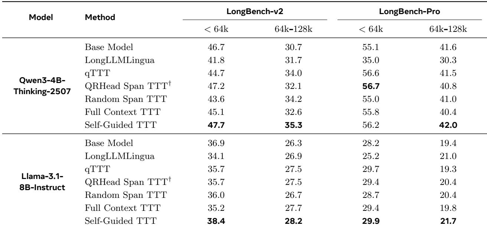

[← 返回 README](../README.md)

# 3. Experimental Results（实验结果）

## 📌 预览

§3.1 交代模型（Qwen3-4B-Thinking-2507 / Llama-3.1-8B-Instruct）、benchmark（LongBench-v2 / LongBench-Pro）、以及 7 个对比方法（Base、LongLLMLingua、qTTT、QRHead Span TTT、Random Span TTT、Full Context TTT、S-TTT）。§3.2 用 Table 2 给主结果，三条观察：S-TTT 全面超 base；持平或超所有 TTT baseline；长上下文桶收益最明显。

---

## 3.1 Setup（实验设置）

> 💡 **3.1 要点预览（Hao 批注）**：读 setup 重点看两件事——(1) baseline 覆盖了长上下文的三大流派（压缩 = LongLLMLingua、注意力检索 = QRHead、TTT 各变体），说明对比是公平且全面的；(2) 所有 TTT 方法最终都从 full context 生成答案、都用 16 步 LoRA，把"训练数据选择"以外的变量都对齐了。

Models and benchmarks. We evaluate two base models: Qwen3-4B-Thinking-2507 (Qwen Team, 2025) and Llama-3.1-8B-Instruct (Team, 2024). We conduct experiments on two challenging long-context benchmarks. LongBench-v2 (Bai et al., 2025) is a four-way multiple-choice benchmark covering diverse long-context reasoning tasks and is evaluated using answer accuracy. LongBench-Pro (Chen et al., 2026b) evaluates a broader set of long-context capabilities and has English and Chinese subsets, we use its English subset as our evaluation set and apply its oficial evaluation pipeline for scoring. We use the Qwen3 tokenizer to measure context length and keep examples whose contexts contain at most 128k tokens.

> 💡 **机制拆解（Hao 批注）**：两个 benchmark 性质不同很关键——LongBench-v2 是**四选一选择题**（有 choices，标 span 时可把选项一起喂给模型，见 Appendix A），LongBench-Pro 是**开放式问答**（标 span 时只有 context+question）。这个差异会直接导致 Llama 在 LongBench-Pro 上 fallback 率高达 39.9%（Appendix B）——开放式任务下模型更难自标出有效证据。上限 128k token，用 Qwen3 tokenizer 度量。

## Compared methods. We compare the following settings:

• Base Model. The base model directly generates an answer conditioned on the full context and question, without any parameter updates.

• LongLLMLingua. LongLLMLingua (Jiang et al., 2024b) is a prompt compression method. The base model first compresses the full context into a shorter one conditioned on the question, and then answers the question using the compressed context. We set the compressed-context budget to be 4,096 tokens.

> 💡 **baseline 拆解（Hao 批注）**：LongLLMLingua 代表**prompt 压缩**流派——真的把上下文删短到 4096 token 再答题。它与 S-TTT 是最直接的对照：都在"选相关内容"，但压缩是删输入、S-TTT 是选训练数据。后面结果会看到压缩经常掉到 base 以下（删错了没法补救）。

• qTTT. qTTT (Bansal et al., 2026) is an eficiency-oriented TTT method that adapts on uniformly sampled random spans. It first runs a single forward pass over the full context to build the KV cache, then keeps the cache frozen and updates only the query-projection parameters, avoiding recomputation of the full-context KV at every adaptation step.

> 💡 **baseline 拆解（Hao 批注）**：qTTT 是效率导向的 TTT——**冻结 KV cache**、只更新 query projection，省去每步重算全上下文 KV 的开销。它是 random span 采样，且冻 KV。后文 Random Span TTT 与它的唯一区别就是"KV 不冻"。qTTT 代表了"how to adapt efficiently"这一被本文批评为忽视了"what to adapt on"的路线。

• QRHead Span TTT. Following QRHead (Zhang et al., 2025b), we identify query-relevant attention heads on a retrieval set BEIR (Thakur et al., 2021) by scoring each head’s query-to-context attention as a retriever and the 16 highest-scoring heads are kept as QRHeads. At test time, we run a single forward pass over the full context to obtain QRHead attention scores, aggregate them over each 512-token candidate span to obtain span-level scores, and select the 8 highest-scoring spans for TTT.

> 💡 **baseline 拆解（Hao 批注）**：QRHead 代表**基于注意力的检索式选 span**——先在 BEIR 检索集上找出 16 个 query-relevant attention head，测试时用这些 head 的注意力打分给每个 512-token span 排序，选 top-8 做 TTT。注意它**需要额外信息**（BEIR 检索集来标定 retrieval head），所以论文标注 † 说它"不直接可比"。这是 S-TTT 最强的"选 span"对手，但结果显示注意力打分在超长上下文下不稳定。

Table 2 Results on LongBench-v2 and LongBench-Pro across diferent context-length buckets. The best result for each model and evaluation setting is shown in bold. †QRHead Span TTT is not directly comparable with the other TTT methods as it requires additional information to identify retrieval heads.

*Table 2: Results on LongBench-v2 and LongBench-Pro across different context-length buckets. The best result for each model and evaluation setting is shown in bold. †QRHead Span TTT is not directly comparable with the other TTT methods as it requires additional information to identify retrieval heads.*

> 💡 **Table 2 批读（Hao 批注）**：主结果表，每个模型 7 行方法 × 2 benchmark × 2 长度桶（<64k / 64k-128k）。抓重点：
> - **Qwen3-4B-Thinking, LongBench-v2**：S-TTT 两桶都最优（<64k: **47.7** vs base 46.7；64k-128k: **35.3** vs base 30.7）。注意 Random Span TTT 在 <64k 掉到 43.6（低于 base），再次印证 §2.1 诊断。
> - **Qwen3-4B-Thinking, LongBench-Pro**：<64k 桶 qTTT(56.6)/QRHead(56.7) 略高于 S-TTT(56.2)，但 64k-128k 桶 S-TTT **42.0** 反超所有 TTT——长上下文才是 S-TTT 的主场。
> - **Llama-3.1-8B-Instruct**：S-TTT 在**全部 4 个 setting 都取得最优**（LongBench-v2: 38.4/28.2；LongBench-Pro: 29.9/21.7），证明 gain 是 model-agnostic 的。
> - **规律**：长上下文桶（64k-128k）里 S-TTT 的相对优势最大，因为噪声更多、选对 token 更重要。这直接支撑贡献 1。
>
> 一个要注意的坦诚点：绝对提升幅度不大（多是 1-4 个点），且 <64k 桶偶尔不是最优。S-TTT 的真正卖点是"稳定不掉点 + 长上下文占优 + 成本更低"，而非碾压式提升。

• Random Span TTT. We randomly sample 8 spans from the context, each containing 512 tokens, and use them for TTT. Random Span TTT difers from qTTT in updating with a non-frozen KV cache.

• Full Context TTT. We partition the full context into N contiguous chunks, where N is the number of adaptation steps. At each step, we perform one step TTT update on one chunk.

> 💡 **baseline 拆解（Hao 批注）**：Random Span TTT = 8 个 512-token 随机 span、KV 不冻（与 qTTT 唯一区别）。Full Context TTT = 把整个上下文切成 $N$ 块，每步训一块——这是"全上下文适配"路线，最贵、被 distractor 淹没最严重（Figure 3 会看到它在 128k 时延迟最高）。这两个和 S-TTT 唯一的差别就是"span 怎么选"，其余训练配置完全对齐，构成干净的对照。

• Self-Guided TTT (ours). We ask the model to identify at most 8 spans in the context that are relevant to the question and then perform TTT on the selected spans. If the model fails to output valid spans, it falls back to using uniformly sampled spans. We report fallback rates in Appendix B.

For all TTT methods, the final answer is generated conditioned on the full context rather than the selected spans. We use LoRA for parameter-eficient test-time adaptation and perform 16 gradient-update steps for each test instance. More details can be found in Appendix A.

> 💡 **机制拆解（Hao 批注）**：这句是公平性保证——**所有** TTT 方法最终都从 full context 生成、都用 LoRA、都跑 16 步。这样 S-TTT 与 Random/Full Context TTT 的差异被压缩到"唯一变量 = span 选择策略"，Table 2 的对比才有说服力。

Evaluation. For each test instance, we sample 4 responses and evaluate each response using the corresponding benchmark evaluator. We report the mean scores for the four samples. We sample responses with a temperature of 0.6 and a top-p of 0.95. The maximum generation length is set to 32,768 tokens for Qwen3-4B-Thinking-2507 and 10,240 tokens for Llama-3.1-8B-Instruct. Prompt templates can be found in Appendix C.

> 💡 **消融解读（Hao 批注）**：每个 instance 采 4 个 response 取均值（temperature 0.6, top-p 0.95），降低采样方差。Qwen 是 thinking 模型，允许 32,768 token 的生成长度（要留给思维链）；Llama 只给 10,240。评测用各 benchmark 官方 evaluator。

## 3.2 Results（结果）

Table 2 summarizes the main results. We highlight three observations. First, S-TTT consistently improves over the base model across models, benchmarks, and length buckets. Second, S-TTT consistently outperforms or is comparable to all the other TTT methods, showing that model-annotated training spans provide a more reliable adaptation signal than uniformly sampled spans or full context. Third, the gains are especially pronounced in the longer-context buckets, where irrelevant context is more abundant and training-token selection becomes more important.

> 💡 **证据链批读（Hao 批注）**：三条观察对应三个 claim——(1) 全面超 base（支撑"S-TTT 有效"）；(2) 持平或超所有 TTT baseline（支撑"model-annotated span 是更可靠的适配信号"）；(3) 长桶收益最大（支撑贡献 1"数据选择在噪声多时最重要"）。第 (2) 条用词是"outperforms **or is comparable to**"——诚实承认某些短桶 setting 只是持平甚至略输，卖点集中在长桶。

LongBench-v2. Using Qwen3-4B-Thinking-2507 as the base model, Random Span TTT degrades the < 64k bucket, reducing accuracy from 46.7 to 43.6, whereas S-TTT improves it to 47.7. In the 64k–128k bucket, all TTT baselines help, but S-TTT leads to the strongest score, reaching 35.3. QRHead Span TTT is competitive in the shorter bucket, but drops behind in the longer bucket, suggesting that attention-based span scores are less stable as the context grows. Other baselines are less consistent: LongLLMLingua often underperforms the base model, and Full Context TTT remains below S-TTT in every setting.

> 💡 **证据链批读（Hao 批注）**：这段把对手逐一"点名"：Random Span 在短桶掉点（46.7→43.6）；QRHead 短桶能打、长桶掉队（**注意力打分在超长上下文不稳定**，这是对检索式方法的有力反驳）；LongLLMLingua 常低于 base（压缩删错了）；Full Context TTT 每个 setting 都低于 S-TTT。S-TTT 是唯一"哪都不掉"的。

The trend also transfers to Llama-3.1-8B-Instruct. S-TTT gives the best LongBench-v2 scores in both buckets, improving the base model from 36.9 to 38.4 and from 26.3 to 28.2, respectively. This indicates that the gain from S-TTT is model-agnostic.

LongBench-Pro. With Qwen3-4B-Thinking-2507, S-TTT improves over the base model in both length buckets. In the shorter bucket, qTTT and QRHead Span TTT are slightly higher than S-TTT. In the longer bucket, however, S-TTT is the strongest method, reaching 42.0 and outperforming all TTT baselines. This mirrors the LongBench-v2 trend: model-annotated spans become more valuable when the context is longer and noisier.

> 💡 **消融解读（Hao 批注）**：这里诚实地承认——LongBench-Pro <64k 桶 qTTT/QRHead 略高于 S-TTT。原因可能与开放式任务下 Qwen 的 fallback 率 21.5%（Appendix B）有关：短桶噪声本就少、self-annotation 优势不明显，一旦 fallback 就退化成 random。但长桶（64k-128k）S-TTT 反超到 42.0，规律与 LongBench-v2 一致——越长越噪，选 span 越值钱。

With Llama-3.1-8B-Instruct, S-TTT again gives the best LongBench-Pro scores in both buckets, improving the base model from 28.2 to 29.9 and from 19.4 to 21.7, respectively. Overall, these results support our main hypothesis that training-token quality is a central bottleneck for long-context TTT.

> 💡 **证据链批读（Hao 批注）**：值得注意——Llama 在 LongBench-Pro 上 fallback 率高达 39.9%（Appendix B），意味着近 4 成 instance 其实退化成了 random span，但 S-TTT 仍在两桶都最优（29.9/21.7）。这反而说明：即使 self-annotation 只在 6 成 instance 上生效，那 6 成带来的增益也足以让整体反超所有 baseline——侧面印证了"选对 span"的价值密度很高。

---

## 🔖 Section 总结

### 关键数字速查
| Setting（S-TTT vs Base） | S-TTT | Base |
|------|------|------|
| Qwen3, LB-v2, <64k | **47.7** | 46.7 |
| Qwen3, LB-v2, 64k-128k | **35.3** | 30.7 |
| Qwen3, LB-Pro, 64k-128k | **42.0** | 41.6 |
| Llama, LB-v2, <64k / 64k-128k | 38.4 / 28.2 | 36.9 / 26.3 |
| Llama, LB-Pro, <64k / 64k-128k | 29.9 / 21.7 | 28.2 / 19.4 |
| Random Span 掉点（Qwen, LB-v2 <64k） | 43.6（< base 46.7） | — |

### 核心洞察
1. **稳定性 > 峰值**：S-TTT 的卖点不是碾压式提升（多为 1-4 点），而是"从不掉点"——唯一在所有 setting 都 ≥ base 的方法。
2. **长桶主场**：噪声越多，选对 span 收益越大；短桶偶尔被 qTTT/QRHead 略超。
3. **注意力打分不稳**：QRHead 长桶掉队，说明基于注意力的检索式选 span 随上下文增长退化。
4. **model-agnostic**：Qwen 和 Llama 都验证，且 Llama 高 fallback 率下仍最优。

### 可追问点
- <64k 桶被 qTTT/QRHead 略超，是否说明短上下文根本不需要 self-annotation？
- Llama LongBench-Pro fallback 39.9% 却仍最优——真实的 self-annotation 有效样本上增益有多大？（值得单独 breakdown，论文未给）
