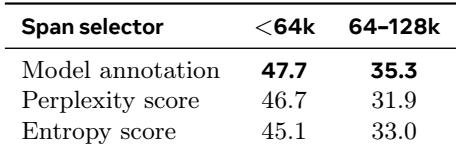
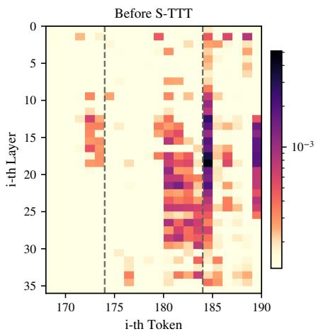
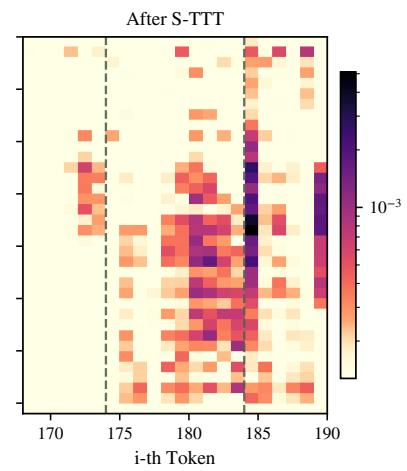
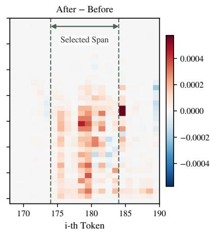
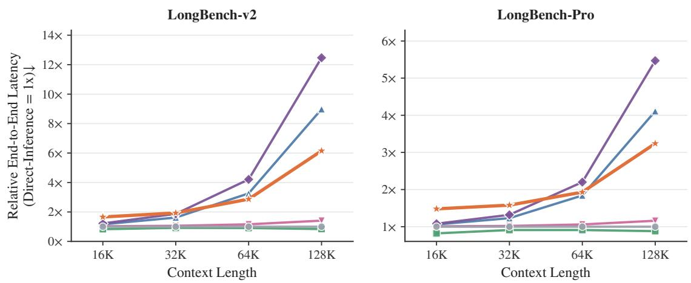

[← 返回 README](../README.md)

# 4. Analysis（分析）

## 📌 预览

分析回答三问：(1) §4.1 用问题条件的模型标注，是否真比"免标注"的内在信号（perplexity / entropy）更好选 span？（Table 3）；(2) §4.2 在选中 span 上适配，到底怎样改变了模型对证据的注意力？（Figure 2 的 before/after/diff 三联图）；(3) §4.3 S-TTT 的端到端开销如何随上下文长度 scale？（Figure 3 的延迟曲线）。

---

We further analyze why and when S-TTT works. We ask three questions: (1) whether question-conditioned model annotation is more efective than annotation-free intrinsic span scores, (2) how adaptation on selected spans changes the model’s attention to the relevant evidence, and (3) how the end-to-end overhead of S-TTT scales with context length.

> 💡 **Section 概览（Hao 批注）**：三问分别对应 selector 的"必要性"、机制的"可解释性"、方案的"效率"。这是审稿人最爱问的三件事：你这个选择器真有必要吗（会不会随便一个内在指标就够）？它到底改变了什么（不是玄学）？贵不贵（能落地吗）？

## 4.1 Span selection strategies（选 span 策略对比）

> 💡 **4.1 要点预览（Hao 批注）**：核心消融——把"问题条件的模型标注"和两个"免标注内在指标"（perplexity / entropy）对打，其余训练配置全冻结，只改 selector。这是为了回答"你花力气 prompt 模型标 span，是不是多余？直接挑最难预测的 span 不就行了？"

The main results show that span selection matters. We next ask whether explicit model annotation is necessary, or whether simpler annotation-free signals can select useful training spans. A natural alternative is to use intrinsic model statistics, selecting spans that are dificult to predict or induce high uncertainty in the next-token distribution.

We compare against two intrinsic selectors. The perplexity selector ranks each 512-token window by mean negative log-likelihood, while the entropy selector ranks each window by mean predictive entropy. Each method then performs TTT on the top 8 highest-scoring spans. We keep the training configuration fixed across all methods, changing only how the training spans are selected.

> 💡 **机制拆解（Hao 批注）**：两个免标注 selector 的直觉——"模型觉得难/不确定的地方，可能信息量大"。perplexity selector 挑平均 NLL 最高的窗口，entropy selector 挑预测熵最高的窗口。都是 top-8、512-token 窗口，与 S-TTT 对齐。这两个是"annotation-free"的诱人替代品，如果它们够好，就不必让模型显式标 span 了。

*Table 3: Model-annotated spans outperform intrinsic metric-selected spans on LongBench-v2 with Qwen3-4B-Thinking-2507.*

> 💡 **Table 3 批读（Hao 批注）**：三个 selector 在 LongBench-v2（Qwen3-4B-Thinking）上：
> - **Model annotation（S-TTT）**：<64k **47.7**，64k-128k **35.3**——两桶都最优。
> - **Perplexity score**：46.7 / 31.9——短桶只差 1 个点，但长桶掉到 31.9（差 3.4 点）。
> - **Entropy score**：45.1 / 33.0——短桶差 2.6 点。
>
> 关键读法：短桶差距小、**长桶差距被拉大**。原因见下段——高 perplexity/entropy 的文本"难预测"的原因五花八门（格式、罕见实体、局部分布漂移），与"是否回答当前问题"无关。而模型标注是**question-conditioned**，直接对准能改善答案的证据。这就证明了 selector 的必要性：光靠内在难度信号不够，必须让选择"看着问题来选"。

Table 3 shows that model-annotated spans perform best in both length buckets, indicating that model intrinsic metrics are not the best choice for selecting useful TTT data. The gap is small below 64k for perplexity-selected spans but becomes much larger in the 64k–128k bucket. This is the regime where the context contains more distractors and where selecting question-relevant evidence becomes most important.

These results suggest that useful TTT spans are not simply the spans that are surprising or uncertain under the language model. High-perplexity or high-entropy text may be dificult to predict for many reasons unrelated to the question, such as formatting, rare entities, or local distribution shift. In contrast, model annotation conditions span selection on the question, allowing it to better target evidence that can improve the final answer.

> 💡 **消融解读（Hao 批注）**：这段是 §4.1 的 punchline——"surprising ≠ useful"。困惑度高不代表与问题相关，可能只是格式怪、实体罕见。这正是本文区别于一类"用不确定性/困惑度选数据"工作的地方：**相关性必须以问题为条件**，而不是模型自身的预测难度。这也解释了为什么 §3 里 QRHead（注意力打分，某种意义上也是免问题条件的内在信号）在长桶掉队。

## 4.2 Case study（案例分析：注意力如何变化）

> 💡 **4.2 要点预览（Hao 批注）**：这一节给出 S-TTT"到底改了什么"的机制证据——通过 before/after 的 question-and-answer→context 注意力对比，说明适配在选中 span 上诱导出**局部化**的注意力增强，而不是全局漂移。

We next visualize how S-TTT changes the model’s use of the selected span. We compare question-andanswer-to-context attention before and after S-TTT, averaging over all heads and plotting the attention by layer. Figure 2 shows one such example. Before adaptation, the model already assigns some attention to the annotated evidence span, but the mass is sparse and uneven across layers. After training on that span, attention becomes stronger and more continuous around the selected tokens, especially in the middle layers. The diference panel shows that this change is localized: the warm region aligns with the training span, while most neighboring positions remain close to zero. This qualitative example suggests one mechanism behind S-TTT: adaptation on selected evidence induces a localized shift in attention toward tokens that are relevant to the current question. More visualized examples can be found in Appendix D.

<table><tr>
<td width="33%"></td>
<td width="33%"></td>
<td width="33%"></td>
</tr><tr>
<td align="center"><i>Before S-TTT</i></td><td align="center"><i>After S-TTT</i></td><td align="center"><i>After − Before（差值）</i></td>
</tr></table>

*Figure 2: A concrete example of question-and-answer-to-context attention before and after S-TTT. Rows are layers and columns are context positions around the model-annotated span. The dashed vertical lines mark the selected training tokens. After S-TTT, attention to the selected span increases, while the change outside the span remains small.*

> 💡 **Figure 2 批读（Hao 批注）**：三联热力图，行=层（0–35 层），列=选中 span 附近的 context 位置，虚线框出选中的训练 token 区间：
> - **左（Before）**：适配前模型对证据 span 已有些注意力，但**稀疏、跨层不均**。
> - **中（After）**：适配后 span 内注意力**更强、更连续**，中间层尤其明显（middle layers 常被认为负责证据聚合/检索）。
> - **右（After − Before 差值）**：暖色（正增量）集中在虚线框内的"Selected Span"，框外几乎为 0。这是关键——**变化是局部的**，不是全局注意力被搅乱。
>
> 这张图给出 S-TTT 的机制假说：在选中证据上做 next-token 适配 = 让模型学会**更聚焦地关注这段证据**，且不牺牲周边。对应 §1 的直觉"把证据从注意力临时捞取变成权重记住"——这里可视化出来的是"注意力变得更笃定地指向该证据"。注意这只是 one example 的定性证据（qualitative），不是统计结论，Appendix D 有更多例子。

## 4.3 Efficiency analysis（效率分析）

> 💡 **4.3 要点预览（Hao 批注）**：回答"贵不贵"。核心图是 Figure 3 的归一化端到端延迟曲线。关键结论——短上下文时 S-TTT 因为多了一步 annotation 而更慢，但存在 crossover：到 64k 及以上，S-TTT 反而比 Full Context / Random Span TTT 更便宜。

TTT methods introduce extra overhead over direct inference because they add an adaptation stage before generation. We use pytorch FSDP (Paszke et al., 2019) for training and vLLM (Kwon et al., 2023) for inference. All measurements are conducted on a single NVIDIA H200 GPU. Figure 3 reports measured end-to-end latency normalized by full-context inference using Qwen3-4B-Thinking-2507. S-TTT has a higher latency in the beginning when the context length is relatively short. The crossover happens at longer context: S-TTT becomes cheaper than Full Context TTT from 64k onward on both benchmarks, and cheaper than Random Span TTT at 64k on LongBench-v2 and comparable on LongBench-Pro. Notably, at 128k context length, S-TTT has the lowest latency among the non-frozen-KV TTT methods. This is expected because Full Context TTT will incur significant overhead when the context length scales up as it trains on the entire input. Random Span TTT samples spans uniformly across the full context, which leads to a larger average efective training window of 0.50C, where C is the context length. In contrast, model-annotated spans are more localized, resulting in shorter efective training windows on average (0.39C on LongBench-v2 and 0.37C on LongBench-Pro). The annotation cost dominates at shorter lengths, but quickly becomes smaller than the saved adaptation cost at long context.

*Figure 3: End-to-end latency normalized by full-context inference as context length increases using Qwen3-4B-Thinking-2507. S-TTT incurs a higher latency in the beginning, but it becomes cheaper than other non-frozen KV cache TTT methods at longer context.*

> 💡 **Figure 3 批读（Hao 批注）**：两个子图（LongBench-v2 左 / LongBench-Pro 右），纵轴 = 相对 full-context inference 的端到端延迟（1× 为基准，越低越好），横轴 = 上下文长度 16K→128K。读法：
> - **短上下文（16K/32K）**：S-TTT 曲线偏高——因为 annotation（Stage 1 那次前向）的固定成本占主导。
> - **crossover**：到 64K 起，S-TTT 低于 Full Context TTT（后者随长度暴涨到 12×/5.5× 附近，因为要训整个输入）；在 LongBench-v2 上 64K 也已低于 Random Span TTT。
> - **128K**：S-TTT 是**非冻结 KV 类 TTT 方法里延迟最低**的。
>
> 机制解释（关键数字）：Random Span 均匀采样 → 平均有效训练窗口 = **0.50C**（span 散布全文，前缀跨度大）；S-TTT 的 model-annotated span 更**局部集中** → 有效训练窗口只有 **0.39C（LB-v2）/ 0.37C（LB-Pro）**。因为 next-token 训练的成本主要由"span + 其前缀"的跨度决定，span 越集中、前缀越短，训练越便宜。所以 S-TTT 在长上下文下"选得准"顺带"跑得快"——annotation 的一次性成本被节省的适配成本反超。
>
> 注意曲线里最低那条（几乎贴 1×）通常是 qTTT（冻 KV）——但那是以牺牲精度稳定性为代价；本文强调的是"non-frozen-KV 里最低"，即在"KV 不冻、能充分适配"这一类里 S-TTT 效率最优。

---

## 🔖 Section 总结

### 关键数字速查
| 指标 | 数值 |
|------|------|
| Table 3 Model annotation（<64k / 64k-128k） | 47.7 / 35.3 |
| Perplexity selector | 46.7 / 31.9 |
| Entropy selector | 45.1 / 33.0 |
| Random Span 有效训练窗口 | 0.50C |
| S-TTT 有效训练窗口（LB-v2 / LB-Pro） | 0.39C / 0.37C |
| 效率 crossover 点 | 64k（vs Full Context TTT，两 benchmark） |
| 128k 时 S-TTT | 非冻结 KV 类 TTT 中延迟最低 |

### 核心洞察
1. **selector 必要性（§4.1）**：question-conditioned 标注 > 免标注的 perplexity/entropy，长桶差距最大——"难预测 ≠ 与问题相关"。
2. **机制可解释（§4.2）**：适配在选中 span 上诱导**局部化**注意力增强（中间层最明显），框外几乎不变，不是全局漂移。
3. **效率双赢（§4.3）**：选得准 → span 更局部 → 有效训练窗口更短（0.39C vs 0.50C）→ 长上下文下反而更便宜，annotation 成本被反超。

### 可追问点
- Figure 2 是单例定性证据，"注意力局部增强"是否有统计层面的量化（如平均注意力增益 vs baseline）？论文未给。
- 0.39C/0.37C 的有效窗口是平均值，方差多大？极端长文里 span 会不会仍散布很广？
