[← 返回 README](../README.md)

# 5. Related Work / Conclusion / Appendix（相关工作 · 结论 · 附录）

## 📌 预览

本文把 Related Work（§5）、Conclusion（§6）、以及附录 A–E 归并到这一节。§5 从两个角度定位——Test-Time Training（TTT）与 Long-Context LLM，反复强调本文与它们的差异在于"study what tokens to train on"。附录给实现细节（LoRA 配置）、标注覆盖率（fallback 表）、prompt 模板、更多注意力可视化、以及 production 落地展望。

---

## 5 Related Work（相关工作）

Test-Time Training. TTT adapts model parameters to a single test input before prediction, using supervision derived from the input itself rather than from new labels (Sun et al., 2020). Earlier work studies when self-supervised TTT helps or fails under distribution shift (Liu et al., 2021), and nearest-neighbor TTT adapts LLMs using retrieved examples at inference time (Hardt and Sun, 2024). More recent LLM work shows that per-instance adaptation can improve reasoning when the test input contains useful self-supervision (Akyürek et al., 2024). For long-context tasks, Bansal et al. (2026) show that TTT can be a more efective use of inference-time compute than simply generating more reasoning tokens. Related long-context TTT work also explores parameter-eficient adaptation for reasoning over long inputs (Chen et al., 2026a). These works primarily study how to perform adaptation eficiently. In this work, we study what tokens the model should be trained on at test time. S-TTT shows that selecting the right spans is a key component of efective long-context TTT.

> 💡 **相关工作定位（Hao 批注）**：TTT 脉络——Sun et al. 2020（TTT 起源，自监督适配单个测试输入）→ Liu et al. 2021（TTT++，研究何时有效/失败）→ Hardt & Sun 2024（nearest-neighbor TTT，用检索样本适配 LLM）→ Akyürek et al. 2024（per-instance 适配提升推理）→ Bansal et al. 2026（qTTT，长上下文 TTT 比多生成 reasoning token 更划算）→ Chen et al. 2026a（PERK，参数高效长上下文 TTT）。**本文的差异化一句话**：所有这些都在研究"how to adapt efficiently"（怎么高效更新），本文研究"**what tokens to train on**"（在哪些 token 上更新）——这是一个正交且被忽视的维度，也是全文的立身之本。


*Figure 3（此图实际归属 §4.3 效率分析，MinerU 因排版将其提取到此处；批读见 [04-analysis](04-analysis.md)）。*

Long-Context LLMs. Modern LLMs increasingly support very long context windows, but a longer window does not guarantee reliable use of the information inside it. Models remain sensitive to evidence position, often degrading when relevant content appears in the middle of a long input (Liu et al., 2024), and long-context benchmarks such as LongBench, LongBench-v2, LongBench-Pro, ZeroSCROLLS, RULER, and HELMET make these failures visible across multi-document QA, code, dialogue, structured reasoning, recall, and long in-context learning tasks (Bai et al., 2024, 2025; Chen et al., 2026b; Shaham et al., 2023; Hsieh et al., 2024; Yen et al., 2025). A broad line of work addresses long-context limitations by extending usable context windows (Peng et al., 2024; Chen et al., 2024), improving prefill or attention eficiency (Jiang et al., 2024a), compressing prompts (Jiang et al., 2024b), retrieving external evidence (Lewis et al., 2020; Zhang et al., 2025b), or analyzing and steering attention behavior at inference time (Wu et al., 2025; Zhang et al., 2025b; Ye et al., 2026). These approaches largely aim to help the model condition on the right evidence or process long inputs more eficiently. We instead approach long-context reasoning from the perspective of test-time training: rather than compressing the long context or intervening in the decoding procedure, S-TTT only requires the model to first select relevant spans from the context before TTT. This keeps the model architecture and decoding algorithm unchanged, avoiding complex interventions that are often infeasible in modern inference engines, while yielding consistent gains.

> 💡 **相关工作定位（Hao 批注）**：长上下文一侧列出五大流派——(1) 扩窗（YaRN, LongLoRA）；(2) prefill/注意力加速（MInference）；(3) prompt 压缩（LongLLMLingua，本文 baseline）；(4) 检索外部证据（RAG, QRHead，本文 baseline）；(5) 推理时分析/操控注意力（retrieval head, DySCO）。本文的差异——**不压缩、不干预解码**，只在 TTT 前让模型选 span，因此**架构和解码算法都不变**。这句是工程价值主张：现代 inference engine（vLLM 等）里改注意力/解码往往不可行，而 S-TTT 是"标准梯度更新 + 标准解码"，天然兼容。

## 6 Conclusion（结论）

We propose Self-Guided TTT (S-TTT), a simple test-time adaptation framework for long-context LLMs that uses the model itself to select question-relevant evidence spans for training. Instead of adapting on the full context or on randomly sampled spans, S-TTT first identifies supporting spans from the input context, adapts the model only on those selected spans, and then generates the final answer using the original full context. Our results on LongBench-v2 and LongBench-Pro show that S-TTT consistently improves over TTT on random span across Qwen3 and Llama-3.1 models, while remaining cheaper than other TTT variants at long context. Empirical results demonstrate that the efectiveness of long-context TTT depends critically on the quality of the test-time training tokens. Overall, S-TTT provides a simple yet efective framework for long-context test-time training, highlighting training-token selection as a promising direction for solving long-context tasks with TTT. We discuss future directions in Appendix E.

> 💡 **结论批读（Hao 批注）**：结论没有新信息，但把 take-home message 收束成一句可复用的洞察——"**long-context TTT 的效果关键取决于 test-time 训练 token 的质量**，training-token selection 是值得深挖的方向"。这也是全文最该记住的一句话：TTT 不是"怎么训"的问题，而是"训什么"的问题。

## Appendix A: Implementation Details（实现细节）

We use LoRA (Hu et al., 2022) for parameter-eficient test-time training. Following qTTT (Bansal et al., 2026), we apply LoRA only to the query projection layers, with rank r = 16 and scaling parameter α = 32. We optimize the LoRA parameters using AdamW with a 0.01 weight decay. For each method, we sweep the learning rate over $\{ 3 \times 1 0 ^ { - 5 } , 1 \times 1 0 ^ { - 4 } , 3 \times 1 0 ^ { - 4 } \}$ on a small validation set and select the best one for testing. For span annotation, LongBench-v2, which consists of multiple-choice questions, we append the answer choices to the question when prompting the model to annotate relevant spans. For LongBench-Pro, which contains open-ended questions, span annotation is performed using only the context and the question.

> 💡 **实现细节批读（Hao 批注）**：几个复现关键——(1) LoRA **只加在 query projection**（沿用 qTTT 设定），rank $r=16$，$\alpha=32$；(2) AdamW，weight decay 0.01；(3) 学习率在 $\{3\times10^{-5}, 1\times10^{-4}, 3\times10^{-4}\}$ 里用小验证集扫；(4) **关键差异**：LongBench-v2 标 span 时把答案选项一起喂给模型（选择题），LongBench-Pro 只给 context+question（开放题）。这解释了为什么开放题上 self-annotation 更难、fallback 更高——少了选项这个强线索。

## Appendix B: Annotation Coverage（标注覆盖率 / fallback 率）

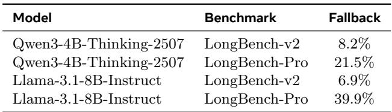

*Table 4: Model annotation coverage on LongBench-v2 and LongBench-Pro. "Fallback" means the model fails to produce valid verbatim spans.*

> 💡 **Table 4 批读（Hao 批注）**：fallback 率 = 模型未能产出有效 verbatim span、被迫退化成 random span 的比例。四组数字揭示 self-annotation 的可靠性边界：
> - Qwen3-4B-Thinking, LongBench-v2：**8.2%**
> - Qwen3-4B-Thinking, LongBench-Pro：**21.5%**
> - Llama-3.1-8B, LongBench-v2：**6.9%**
> - Llama-3.1-8B, LongBench-Pro：**39.9%**
>
> 两条规律：(1) **选择题（v2）fallback 低**（6.9–8.2%），因为有答案选项当锚点，模型好标；**开放题（Pro）fallback 高**，尤其 Llama 高达 39.9%。(2) **弱模型（Llama-8B）在开放题上崩得厉害**——近 4 成 instance 退化成 random span。回看 §3：即便如此 Llama 在 LongBench-Pro 两桶仍最优，说明剩下 60% 有效标注的增益足以拉动整体。这是 S-TTT 稳健性的关键——fallback 机制保证了下界（≥ random span），而非彻底失败。

Table 4 reports how often the model produces valid verbatim spans. Fallback instances use random spans, so they are equivalent to Random Span TTT for those cases. The fallback rate is low on LongBench-v2 for both base models, indicating that most instances receive genuine model-selected training spans. However, the fallback rate becomes higher on LongBench-Pro, especially for Llama-3.1-8B-Instruct, suggesting that self-annotation is more dificult on the open-ended benchmark.

## Appendix C: Prompts（提示词模板）

> 💡 **Prompt 批读（Hao 批注）**：附录给了 4 个 prompt 模板（Table 5–8），是两模型 × 两 benchmark 的**答题**模板（不是标 span 的模板）。注意 Qwen 模板结尾带 `<think>`，触发 thinking 模式；Llama 模板用 `Let's think step by step` 引导 CoT。span 标注的具体 prompt 论文正文未逐字给出，但 §2.2 与 Appendix A 说明了输入构成（v2 含 choices、Pro 不含）。原始模板见下：*

Table 5 Qwen3-4B-Thinking-2507 prompt template for LongBench-v2.

```text
<|im_start|>system
You are a helpful assistant. Read the context and answer the question.<|im_end|>
<|im_start|>user
{CONTEXT}
{QUESTION}
Pick from the following options:
{CHOICES}
Please show your choice in the answer field with only the choice letter,
e.g., "answer": "C".<|im_end|>
<|im_start|>assistant
<think>
```

Table 6 Qwen3-4B-Thinking-2507 prompt template for LongBench-Pro.

```text
<|im_start|>system
You are a helpful assistant. Read the context and answer the question.<|im_end|>
<|im_start|>user
{CONTEXT}
{QUESTION}<|im_end|>
<|im_start|>assistant
<think>
```

Table 7 Llama-3.1-8B-Instruct prompt template for LongBench-v2.

```text
<|begin_of_text|><|start_header_id|>system<|end_header_id|>
Cutting Knowledge Date: December 2023
Today Date: 26 Jul 2024
<|eot_id|><|start_header_id|>user<|end_header_id|>
Please read the following text and answer the question below.
<text>
{CONTEXT}
</text>
What is the correct answer to this question: {QUESTION}
Choices:
{CHOICES}
Let's think step by step. After thinking, choose a single, most likely
answer. Output your final answer follows: "The correct answer is
(insert choice here)".<|eot_id|><|start_header_id|>assistant<|end_header_id|>
```

Table 8 Llama-3.1-8B-Instruct prompt template for LongBench-Pro.

```text
<|begin_of_text|><|start_header_id|>system<|end_header_id|>
Cutting Knowledge Date: December 2023
Today Date: 26 Jul 2024
You are a helpful assistant. Read the context and answer the
question.<|eot_id|><|start_header_id|>user<|end_header_id|>
{CONTEXT}
{QUESTION}<|eot_id|><|start_header_id|>assistant<|end_header_id|>
```

## Appendix D: Qualitative Examples（更多注意力可视化）

> 💡 **Appendix D 批读（Hao 批注）**：Figure 5 给出更多 before/after S-TTT 的 span 注意力对比例子，规律与 Figure 2 一致——适配后选中 span（虚线框内）注意力增强且局部化。下面的例子（token 位置约 1900–1945）同样展示：差值图（After − Before）的暖色集中在 Selected Span 内，框外接近零。这些是对 §4.2 机制假说的补充定性证据。*

<table><tr>
<td width="33%">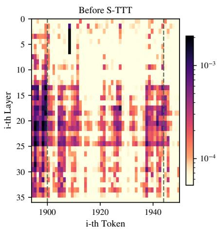</td>
<td width="33%">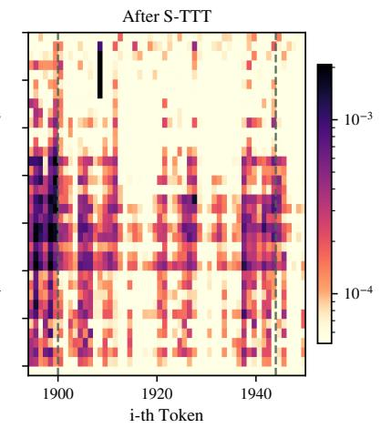</td>
<td width="33%">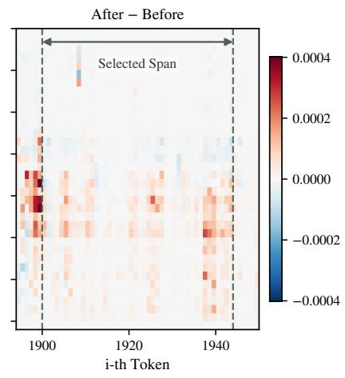</td>
</tr><tr>
<td align="center"><i>Before S-TTT</i></td><td align="center"><i>After S-TTT</i></td><td align="center"><i>After − Before（差值）</i></td>
</tr></table>

*Figure 5: Example of span attention before and after S-TTT.*

<table><tr>
<td width="50%">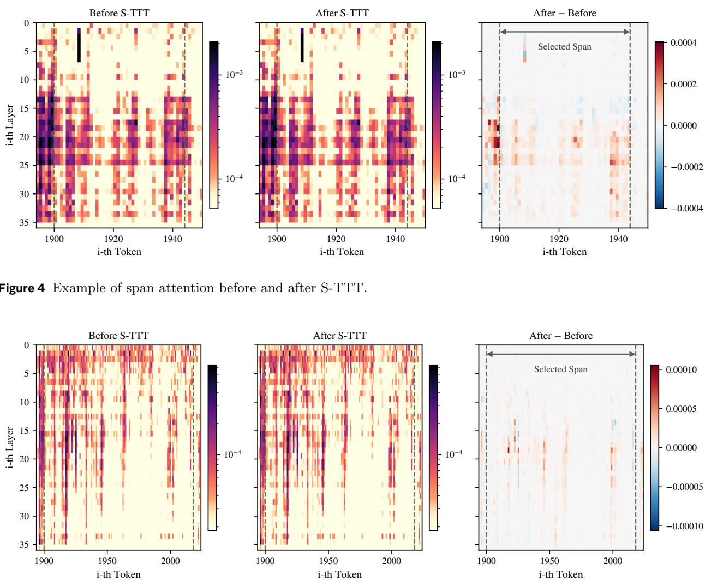</td>
<td width="50%">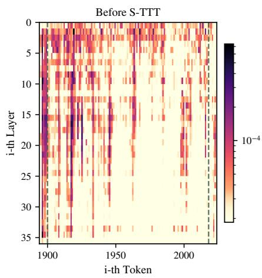</td>
</tr></table>

<table><tr>
<td width="50%">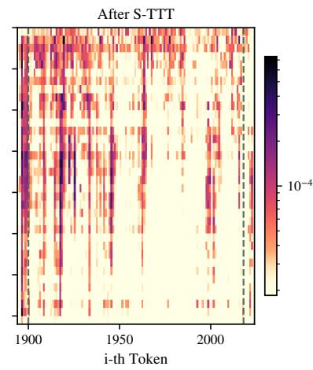</td>
<td width="50%">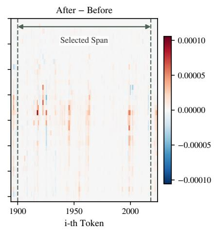</td>
</tr></table>

## Appendix E: Future Directions（未来方向）

TTT opens up opportunities for adapting LLMs in realistic production settings. In many applications, users may upload a long document, such as a financial report, legal contract, or book, and then ask multiple questions about it. Unlike methods that require architectural changes or specialized attention mechanisms, TTT relies on standard gradient-based adaptation and on-the-fly weight updates. This makes it compatible with modern training and serving infrastructure, where each conversation session could maintain its own lightweight adapted weights for multi-turn use, personalization, or document-specific specialization. However, the largest bottleneck is latency: even parameter-eficient TTT adds adaptation overhead before generation, which needs to be reduced. Addressing these challenges is an important direction for making TTT a practical framework for solving long-context tasks in real-world systems.

> 💡 **未来方向批读（Hao 批注）**：这段是 Meta 团队的落地视角——production 场景里用户上传一份长文档（财报/合同/书）后**反复提问**，正好可以对该文档做一次 TTT、把适配后的 lightweight LoRA 权重挂在 session 上复用（回收 §2.2 里"$\theta'$ 用完即弃"的成本）。这补足了当前 per-instance 一次性适配的浪费——多轮问答可摊薄适配成本。最大瓶颈仍是**延迟**：即便 PEFT，生成前的适配开销仍需压缩（呼应 §4.3）。

<table><tr>
<td width="50%">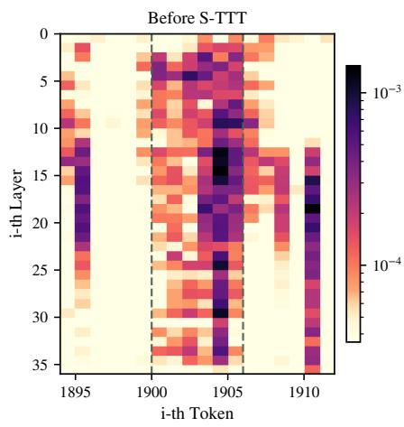</td>
<td width="50%">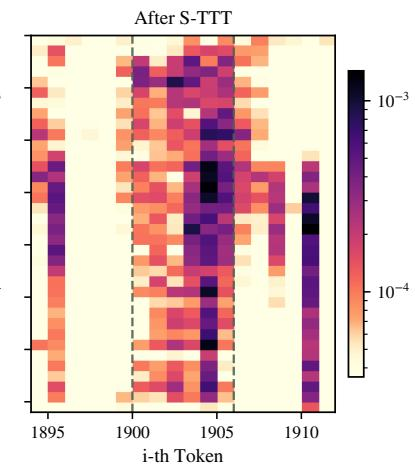</td>
</tr></table>

<table><tr>
<td width="50%">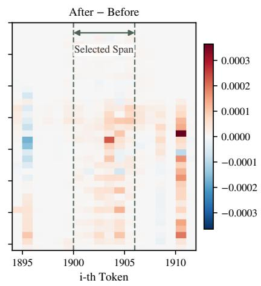</td>
<td></td>
</tr></table>

*Figure 6: Example of span attention before and after S-TTT.*

> 💡 **Figure 6 批读（Hao 批注）**：又一组 before/after S-TTT 的 span 注意力可视化，结论同 Figure 2/5——选中 span 的注意力在适配后增强且局部化。这些附录可视化的作用是"堆证据"，说明 §4.2 观察到的局部注意力增强不是孤例，而是跨样本可重复的现象（虽仍是定性、非统计量化）。

---

## 🔖 Section 总结

### 关键数字速查
| 指标 | 数值 |
|------|------|
| LoRA rank $r$ / scaling $\alpha$ | 16 / 32（仅 query projection） |
| 学习率搜索空间 | {3e-5, 1e-4, 3e-4} |
| fallback 率（Qwen v2 / Pro） | 8.2% / 21.5% |
| fallback 率（Llama v2 / Pro） | 6.9% / **39.9%** |

### 核心洞察
1. **差异化定位**：现有 TTT 研究"how to adapt"，本文研究"what to adapt on"；现有长上下文方法改输入或改解码，S-TTT 只在 TTT 前选 span、架构与解码全不变，工程兼容性强。
2. **fallback 是安全网**：开放题+弱模型时 self-annotation 可靠性下降（Llama-Pro 39.9%），但退化为 random span 保证了性能下界，且有效标注部分仍拉动整体最优。
3. **落地愿景**：文档级 TTT 权重可在多轮 session 复用，摊薄适配成本；主要瓶颈仍是生成前延迟。

### 可追问点
- span 标注的完整 prompt 未逐字公开——verbatim 校验的具体实现（如何判定"有效 span"）值得追问。
- Llama-Pro 39.9% fallback 下，若把有效标注样本单独 breakdown，S-TTT 的真实增益上限有多高？
