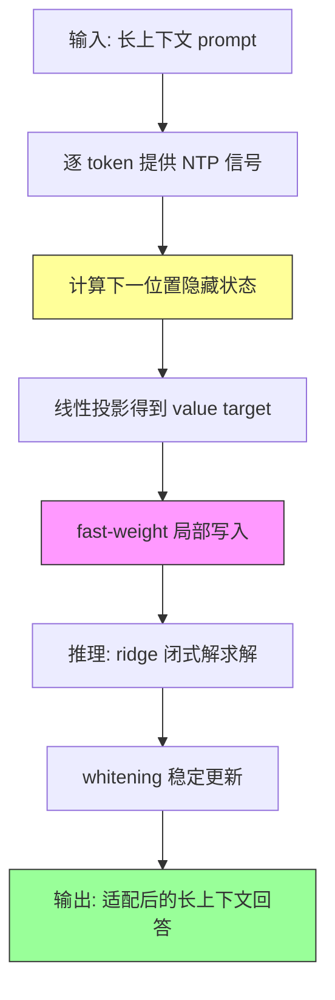

# Test-Time Training with Next-Token Prediction (TTT-NTP)

## 论文信息

| 项目 | 内容 |
|------|------|
| **标题** | Test-Time Training with Next-Token Prediction |
| **作者** | Xuan Ouyang*, Zefan Cai*, Junjie Hu 等 |
| **会议** | Arxiv 2026 |
| **arXiv** | 2606.21803 |
| **链接** | https://arxiv.org/abs/2606.21803 |

## 一句话总结

TTT-NTP 把 in-place fast-weight 适配的 value target 从"learned local proxy"换成"模型自己在下一位置的同层 contextual hidden state"，让每次测试时局部写入都沿着模型做 next-token prediction 的因果计算轨迹走，成为唯一在 4 个 backbone 上都稳定提升长上下文性能的 drop-in TTT 方法。

## 核心贡献

1. **指出被忽视的设计轴**：in-place TTT 已标准化"怎么写（rank-one）+ 写在哪（MLP down-projection）"，但"每次写入该存什么值（value target）"仍是开放问题，且现有 learned proxy 与模型自身的 NTP 信号脱节。
2. **提出 model-native target**：用模型自己在下一位置的 contextual hidden state $h_{\ell,t+1}$（经轻量线性投影）作为 fast-weight 的监督目标，使局部写入贴合 NTP 因果轨迹。
3. **训练/推理写入机制解耦**：训练用 inner-product（Hebbian）写入，推理用 ridge 闭式解，并配合 whitening 稳定更新。
4. **广泛验证**：RULER Full-13 上四个 backbone（Llama-3.1-8B/Mistral-7B/Qwen3-4B/Qwen3-0.6B）全部提升，LongBench-v2 长文档 QA 同样提升，且不牺牲通用能力。

## 📖 批读导航

| Section | 文件 | 核心内容 |
|---------|------|----------|
| 0. Abstract | [00-abstract.md](sections/00-abstract.md) | 核心矛盾：fast-weight 该写什么 value target |
| 1. Introduction | [01-introduction.md](sections/01-introduction.md) | NTP 作为免费 test-time 信号、痛点定位 |
| 2. Related Work | [02-related-work.md](sections/02-related-work.md) | TTT 架构、in-place TTT、long-context 适配 |
| 3. Methodology | [03-methodology.md](sections/03-methodology.md) | TTT-NTP 机制、value target 设计、写入求解 |
| 4. Experiments | [04-experiments.md](sections/04-experiments.md) | RULER/LongBench-v2 主结果、target 消融、whitening |
| 5. Conclusion | [05-conclusion.md](sections/05-conclusion.md) | 总结与展望 |
| 6. Appendix | [06-appendix.md](sections/06-appendix.md) | 实现细节、超参 |

## 关键数字

| 指标 | 数值 |
|------|------|
| RULER Full-13 增益 (Llama-3.1-8B) | +3.9 |
| RULER Full-13 增益 (Mistral-7B-v0.3) | +3.0 |
| RULER Full-13 增益 (Qwen3-4B) | +4.1 |
| RULER Full-13 增益 (Qwen3-0.6B) | +2.9 |
| RULER 最大单点增益 | +11.74 (Qwen3-4B, 16k) |
| LongBench-v2 增益 (Llama / Mistral) | +5.6 / +3.7 |
| CPT / In-Place 在 Mistral 上 | -7.67 / -8.45（退步） |
| 去 whitening 后 Llama avg | 12.61（vs Base 55.80，崩溃） |
| backbone 规模跨度 | 0.6B–8B，3 个 family |

## 数据流：输入 → 中间表示 → 输出

## 优缺点与还能做什么

### 优点
- Drop-in：无需重新设计 backbone 或重新预训练，直接用于已发布 checkpoint
- value target 来自模型自身表示，无需额外训练 proxy 网络
- 四个 backbone 全部提升，通用能力几乎不变
- 揭示了 fast-weight「写什么」这个被忽视的设计维度

### 局限 / 风险
- 4k 短上下文有小幅"拿短换长"的 dip
- Mistral 通用能力有 -0.96 的轻微回退
- 需要 whitening 才能稳定，否则崩溃（说明对更新尺度敏感）

### 还能做什么
- 探索 value target 的更多变体（多层融合、非线性投影）
- 与检索式方法结合，只在相关位置做写入
- 研究写入机制在更长上下文（128k+）的扩展性

## 阅读 Q&A 记录

- **Q: 为什么"下一位置的 hidden state"比 raw vocabulary target 更适合写进 MLP down-projection？**
  A: 因为这个 state 就在模型形成后续 next-token 分布的因果轨迹上，写入是在"把 MLP 输出往模型自己的预测路径上推"，而 vocabulary target 需要经过 unembedding，脱离了中间层的表示空间。见 §2.3 与 §3.2。
- **Q: 训练时用 inner-product（Hebbian）write、推理时用 ridge 闭式解，为什么必须不一样？**
  A: 见 §3.4 与消融 §4.5.2——Hebbian 写入在训练时高效，ridge 闭式解在推理时更稳定精确。
- **Q: 为什么"唯一"这个词很重要？**
  A: 意味着 CPT、In-Place TTT、qTTT 在某些 backbone 上会掉分（Mistral 上 CPT -7.67、In-Place -8.45），只有 TTT-NTP 全正，这是主结果的关键证据。

## 📊 Citation Landscape

- **Connected Papers**: https://www.connectedpapers.com/main/2606.21803
- **arXiv**: https://arxiv.org/abs/2606.21803
- 关键相关工作：In-Place TTT（fast-weight 写入机制标准化）、TTT-E2E（continual learning 视角）、TTT4LC（长上下文 score dilution 诊断）
- 注：该论文较新（2026），Semantic Scholar 尚未索引 TLDR/引用统计。
