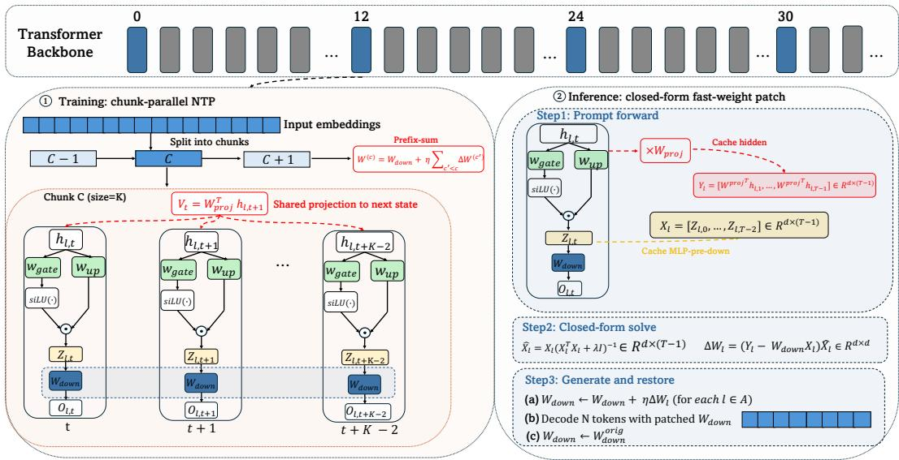

[← 返回 README](../README.md)

# 3. Method（方法）

## 📌 预览

Method 按数据流分四小节：
- **§3.1**：从 TTT 的通用定义 → 为什么把 adaptation 限制在一个 compact fast weight $W$ 上 → 引出核心设计选择「target $v_t$ 用什么」。
- **§3.2**：TTT-NTP 的 fast-weight write 公式化——key = gated 激活 $z_{\ell,t}$，value target = 下一位置 hidden state 经 $W_{\ell}^{\text{proj}}$ 投影，rank-one 写入 down-projection。
- **§3.3**：chunk-parallel causal update——如何在保吞吐的前提下按 chunk 累积 write，并用 $\mathcal{T}_c^-$ + exclusive prefix sum 保证因果、不泄露未来。
- **§3.4**：推理时的 closed-form write——把训练时丢掉的 W-dependent 项加回来，一次性解 ridge regression。

TTT-NTP places a small fast weight inside selected MLP blocks and updates it from a nexttoken signal while reading the input. During continual pretraining the fast-weight write is learned in a chunk-parallel causal form (§3.1–3.3); at inference the same target yields a closed-form prompt write applied before decoding (§3.4).

> 💡 **Section 概览**（Hao 批注）: 记住这条主线——「训练阶段学 chunk-parallel causal write（尤其学 $W_{\ell}^{\text{proj}}$），推理阶段用同一 target 做 closed-form write」。训练和推理**共享 target**（都是 next-position state），但**优化目标不同**（训练用 inner-product/Hebbian，推理用 ridge 最小二乘），§3.4 会解释这个 deliberate 的不一致。

---

## 3.1 From TTT to Next-Token Prediction

Test-time training updates a small subset of model parameters on the test input itself using a self-supervised loss (Sun et al., 2020; 2024). For an autoregressive language model, the most natural self-supervised signal is already present: for every observed prompt token $x_{t+1}$ , the prefix $x_{1:t}$ defines the next-token prediction loss

$$
\mathcal{L}_{\mathrm{NTP}}(x_{1:t+1}) = -\log p_{\theta}(x_{t+1} \mid x_{1:t}) .
$$

> 💡 **公式批读 (Eq. 1)**（Hao 批注）: 这是标准 NTP 交叉熵，没有玄机——它是「理想」的 test-time 监督信号。作者接下来要论证：直接对这个 loss 求梯度做 TTT 不现实（贵、难并行、动整张网），所以需要一个 layer-local 的近似（§3.1 末尾引出 $v_t$，§3.2 具体化）。

A naive TTT implementation could take gradient steps on eq. (1) while reading the prompt. However, this is computationally expensive for large decoders, hard to parallelize, and touches a broad portion of the network. We therefore confine the adaptation to a compact fast weight W inside each adapted MLP block. Given a key $k_t$ and a value target $v_t,$ we take a single gradient step that aligns the key’s linear projection $W k_t$ with the target,

$$
W \leftarrow W - \eta \nabla_{W} \mathcal{L}(W k_t, v_t), \qquad \mathcal{L}(W k_t, v_t) = -\langle W k_t, v_t \rangle .
$$

> 💡 **公式批读 (Eq. 2)**（Hao 批注）: 这是 inner-loop 的核心 loss，看懂它就理解了「rank-one write 为什么是 outer product」。
> - inner loss 取 $\mathcal{L} = -\langle W k_t, v_t\rangle$，即负内积。对 $W$ 求梯度：$\nabla_W \mathcal{L} = -v_t k_t^\top$。
> - 梯度下降一步：$W \leftarrow W + \eta\, v_t k_t^\top$，即往 $W$ 上加一个 rank-one 的 outer product $v_t k_t^\top$。
> - **直觉**：这个 loss 不是要求 $W k_t$ 精确等于 $v_t$（那是最小二乘），而是**最大化 $W k_t$ 和 $v_t$ 的对齐（内积）**。这就是 Hebbian「associative memory」写入：把 (key $k_t$, value $v_t$) 关联对存进 $W$。
> - 这也是训练/推理差异的根源：这个 Hebbian write **丢掉了** $W$-dependent 的项（最小二乘梯度里的 $W k_t k_t^\top$），换来 prefix-summable（可并行累加）；§3.4 推理时会把它加回来。

In practice we accumulate these rank-one writes over chunks of tokens for parallelism, rather than applying a separate update at every position (details in §3.3).

The remaining design choice is the target $v_t,$ , which determines what the fast weight stores. TTT-NTP uses the model’s own next-position contextual state: when $x_{t+1}$ enters the causal forward pass, it produces—at the adapted layer—the hidden state the model would propagate next, and we write that state into the fast weight rather than a separately learned target. Because this state lies on the same causal trajectory the model uses to form later next-token distributions, the write nudges the MLP output along the model’s own predictive path, and it is available densely at every position from a single forward pass.

> 💡 **机制拆解**（Hao 批注）: 一句话总结全文创新——「$v_t$ 用模型自己算出的 next-position contextual state，而不是单独学一个 target」。为什么这是对的：这个 state 就在「模型形成后续 next-token 分布」的因果轨迹上，所以往 fast weight 里写它 = 把 MLP 输出往模型自己的预测路径上推。而且它是一次前向就能拿到的 dense 信号（每个位置都有）。

---

## 3.2 TTT-NTP Fast-Weight Write

Following Feng et al. (2026), we instantiate TTT-NTP in selected SwiGLU MLP blocks inside the transformer layers. Let $h_{\ell,t} \in \mathbb{R}^{d}$ be the post-normalization input to the MLP block at layer ℓ and position t. The pretrained MLP computes:

$$
z_{\ell,t} = \phi\left(W_{\ell}^{\mathrm{gate}} h_{\ell,t}\right) \odot \left(W_{\ell}^{\mathrm{up}} h_{\ell,t}\right) \in \mathbb{R}^{d_{\mathrm{ff}}} ,
$$

$$
o_{\ell,t} = W_{\ell}^{\mathrm{down}} z_{\ell,t} \in \mathbb{R}^{d} ,
$$

*Figure 1: Pipeline of TTT-NTP. At each adapted MLP block, the current gated activation $z_{\ell,t}$ is the key. The write target is the next position’s same-layer contextual state $h_{\ell,t+1},$ passed through a small learned linear projection $W_{\ell}^{\mathrm{proj}}$ before being written into the downprojection fast weight. Writes are accumulated causally as an exclusive chunk prefix sum.*

> 💡 **Figure 1 批读**（Hao 批注）: 这张 pipeline 图把 §3.2 的公式画成了数据流，对照着看最快理解。
> - **key（读端）**：当前位置的 gated 激活 $z_{\ell,t}$（SwiGLU 的 gate·up 逐元素积，$d_{\mathrm{ff}}$ 维），也就是 down-projection 平时吃的输入。
> - **value target（写端）**：下一位置同层的 contextual state $h_{\ell,t+1}$（$d$ 维），经过一个小的 learned 线性投影 $W_{\ell}^{\text{proj}}$ 变成 $v_{\ell,t}^{\text{NTP}}$。
> - **写入位置**：fast weight 直接复用 down-projection $W_{\ell} = W_{\ell}^{\text{down}}$（$d\times d_{\mathrm{ff}}$），rank-one 加上去。
> - **累积方式**：exclusive chunk prefix sum——第 $c$ 个 chunk 只能看到前面 chunk 的 write（因果，见 §3.3）。
> 注意 $z_{\ell,t}$ 是 key、$h_{\ell,t+1}$ 是 value，这个「当前激活配下一状态」的错位配对是 TTT-NTP 的灵魂。

where $\phi$ is SiLU and $W_{\ell}^{\mathrm{down}} \in \mathbb{R}^{d \times d_{\mathrm{ff}}}$ . We place one fast weight at each adapted layer $\ell \in \mathcal{A}$ by reusing the down-projection itself, i.e., $W_{\ell} = W_{\ell}^{\mathrm{down}}$ . The key vector is the current gated activation $z_{\ell,t},$ and the write to the fast weight at position t is the negative-gradient step on the inner-loop loss of eq. (2), which has a rank-one form:

$$
\Delta W_{\ell,t} := -\nabla_{W_{\ell}} \mathcal{L}\left(W_{\ell} z_{\ell,t}, v_{\ell,t}\right) = v_{\ell,t} z_{\ell,t}^{\top} .
$$

> 💡 **公式批读 (Eq. 3-5)**（Hao 批注）:
> - **Eq. 3/4**：标准 SwiGLU MLP。gate 分支过 SiLU（$\phi$），和 up 分支逐元素相乘得到 $z_{\ell,t}$（$d_{\mathrm{ff}}$ 维中间激活），再经 down-projection $W_{\ell}^{\text{down}}$ 降回 $d$ 维输出 $o_{\ell,t}$。**关键**：fast weight 就是复用这个 $W_{\ell}^{\text{down}}$，不额外加参数、不改结构——这就是「in-place」和「drop-in」的含义。
> - **Eq. 5**：把 Eq. 2 的负梯度写具体，得到 rank-one 更新 $\Delta W_{\ell,t} = v_{\ell,t} z_{\ell,t}^\top$（value 外积 key）。这就是每个位置往 down-projection 打进去的「关联对」。

The TTT-NTP value target is derived from the same layer’s next contextual hidden state, $h_{\ell,t+1}$ . This state is computed under the causal mask in the same forward pass after the model observes token $x_{t+1},$ , and serves as the value target for the fast-weight write. We keep a lightweight learned linear projection $W_{\ell}^{\mathrm{proj}} \in \mathbb{R}^{d \times d}$ between the target state and the down-projection fast weight:

$$
v_{\ell,t}^{\mathrm{NTP}} = W_{\ell}^{\mathrm{proj}} h_{\ell,t+1} .
$$

By instantiating $v_{\ell,t} = v_{\ell,t}^{\mathrm{NTP}}$ in eq. (5), the TTT-NTP single-position write to $W_{\ell}$ is

$$
\Delta W_{\ell,t}^{\mathrm{NTP}} := \left(W_{\ell}^{\mathrm{proj}} h_{\ell,t+1}\right) z_{\ell,t}^{\top} .
$$

> 💡 **公式批读 (Eq. 6-7)**（Hao 批注）: 这两式是 TTT-NTP 的「身份证」。
> - **Eq. 6**：value target 就是「下一位置同层 hidden state」$h_{\ell,t+1}$ 经过 $d\times d$ 线性投影 $W_{\ell}^{\text{proj}}$。$W_{\ell}^{\text{proj}}$ 是**唯一的 TTT-NTP 专属参数**（identity 初始化，CPT 时联合训练，训练后 freeze，见附录 B），额外权重量仅 $|\mathcal{A}|d^2$，可忽略。
> - **Eq. 7**：把 Eq. 6 代入 Eq. 5，得到单位置写入 $(W_{\ell}^{\text{proj}} h_{\ell,t+1}) z_{\ell,t}^\top$。
> - **和 baseline 的差异**：In-Place TTT 的 $v$ 是「邻域 hidden states 过 learned convolution」拼出来的 local proxy；TTT-NTP 的 $v$ 是「单个下一位置 state 过 pointwise 线性投影」，**没有邻域聚合**。§4.5.1 的消融正是把这两种 $v$ 拉平其他一切来对比。

We initialize $W_{\ell}^{\mathrm{proj}}$ and train it jointly with the backbone during continual pretraining. The outer loss remains the standard next-token cross-entropy; the inner-loop target in eq. (6) is the per-layer next-token state transition induced by that next-token objective. After continual pretraining, $W_{\ell}^{\mathrm{proj}}$ is frozen for the test-time training phase.

> 💡 **机制拆解**（Hao 批注）: 注意「双层 loss」结构：outer loss = 标准 NTP 交叉熵（塑造 backbone 和 $W_{\ell}^{\text{proj}}$）；inner-loop target = Eq. 6 的 per-layer next-token state transition。二者都由 NTP 目标驱动，这就是「aligned」的字面含义。$W_{\ell}^{\text{proj}}$ 只在 CPT 阶段学，之后冻结——所以推理时不需要任何梯度，只需一个闭式解。

This choice removes the need to aggregate the target over a neighborhood of positions. Prior recipes do exactly that, typically through a learned convolution that combines hidden states at several positions around t into a value vector. In TTT-NTP, context enters through the causal forward pass itself: $h_{\ell,t+1}$ is already the model’s contextual representation after the next observed token, and $W_{\ell}^{\mathrm{proj}}$ is only a pointwise linear projection of that single state into the fast-weight write space. The resulting write pushes the layer’s MLP output along the same trajectory the model itself follows under next-token prediction, so the fast weight stores predictive state rather than a learned reconstruction proxy.

> 💡 **机制拆解**（Hao 批注）: 这段回答了一个关键的「为什么不需要卷积」的问题。baseline 要做邻域卷积，是因为它的 target 本身不含上下文，需要人为聚合邻域来注入 context。而 TTT-NTP 的 $h_{\ell,t+1}$ **本身就是因果前向传播算出来的上下文表示**——context 已经通过 forward pass 进来了，所以 $W_{\ell}^{\text{proj}}$ 只需做逐点线性投影，不需要跨位置聚合。结论：fast weight 存的是「predictive state」而非「learned reconstruction proxy」。

---

## 3.3 Chunk-Parallel Causal Update

To preserve throughput, writes are accumulated at the chunk level. We partition the long sequence into chunks of length $K,$ and define a list of the token positions in a chunk c as:

$$
\mathcal{T}_{c} = [(c-1)K+1, \ldots, cK], \forall c \in [1, C] .
$$

Because position t is paired with the next position $t+1,$ we only consider within-chunk token pairs for fast weight update; thus, we exclude the last token from the updates.

$$
\mathcal{T}_{c}^{-} = [(c-1)K+1, \ldots, cK-1], \forall c \in [1, C] .
$$

> 💡 **公式批读 (Eq. 8-9)**（Hao 批注）: $\mathcal{T}_c$ 是第 $c$ 个 chunk 的所有位置；$\mathcal{T}_c^-$ 去掉了 chunk 的最后一个位置。**为什么去掉最后一个？** 因为位置 $t$ 要配对下一位置 $t+1$ 的 state，如果 $t$ 是 chunk 的末位，$t+1$ 就跨到下一个 chunk 了——为了不让 write「跨 chunk 泄露」，只用 within-chunk 的 (t, t+1) 对，所以排除末位 token。这是保证因果性的第一道机关。

The per-chunk NTP accumulator to the fast weight is computed as:

$$
\Delta W_{\ell}^{(c)} := \sum_{t \in \mathcal{T}_{c}^{-}} \Delta W_{\ell,t}^{\mathrm{NTP}} = W_{\ell}^{\mathrm{proj}} \sum_{t \in \mathcal{T}_{c}^{-}} h_{\ell,t+1} z_{\ell,t}^{\top} \in \mathbb{R}^{d \times d_{\mathrm{ff}}} .
$$

> 💡 **公式批读 (Eq. 10)**（Hao 批注）: 把 chunk 内所有位置的 rank-one write 加起来得到 per-chunk accumulator。注意 $W_{\ell}^{\text{proj}}$ 可以提到求和外面（因为它对所有位置共享），所以本质是累加一堆 outer product $h_{\ell,t+1} z_{\ell,t}^\top$ 再左乘投影。这个「先累加 outer product」正是**可并行（prefix-summable）**的关键——如果 loss 里有 $W$-dependent 项就无法这样累加了。

Since TTT-NTP updates the fast weight $W_{\ell}$ chunk by chunk, it writes per-chunk accumulators to $W_{\ell}$ sequentially. Let $W_{\ell}^{(c)}$ denote the snapshot of the fast weight used to process chunk c. $W_{\ell}^{(1)}$ is reusing $W_{\ell}^{\mathrm{down}}$ in place at chunk 1, and then $W_{\ell}^{(c)}$ is computed as the exclusive prefix sum of updates from all preceding chunks:

$$
W_{\ell}^{(1)} = W_{\ell}^{\mathrm{down}} ,
$$

$$
W_{\ell}^{(c)} = W_{\ell}^{\mathrm{down}} + \eta \sum_{c' \lt c} \Delta W_{\ell}^{(c')} .
$$

Note that each position $t \in \mathcal{T}_{c}$ then uses $W_{\ell}^{(c)} z_{\ell,t}$ in place of the original $W_{\ell}^{\mathrm{down}} z_{\ell,t}$ in eq. (4).

> 💡 **公式批读 (Eq. 11-12)**（Hao 批注）: 这是「exclusive prefix sum」的定义。第一个 chunk 用原始 $W_{\ell}^{\text{down}}$（还没任何 write）；第 $c$ 个 chunk 用「原始权重 + 所有 $c' \lt c$ 的 chunk 累积的 write」——注意求和是 $c' \lt c$（严格小于），所以叫 exclusive（不含自己）。这是保证因果性的第二道机关：chunk $c$ 只能读到更早 chunk 写的东西，读不到自己或未来 chunk 的 write。

The update is causal. Across chunks, chunk c can only read writes from chunks $c' \lt c$ Within a chunk, all positions share the same fast weight, which excludes writes produced by that chunk. The restricted set $\mathcal{T}_{c}^{-}$ prevents a write from crossing into the next chunk. Although the target for position t is $h_{\ell,t+1},$ , the resulting write never affects the computation of position t + 1 itself; it is available only for later chunks or later inference-time generation. Thus the method uses observed next tokens as test-time supervision without leaking future information into their own predictions.

> 💡 **Q&A 批注记录**（Hao 批注）:
> - Q: target 是 $h_{\ell,t+1}$（未来位置的 state），这不是把未来信息泄露给当前预测吗？
> - A: 不会。三道机关联合保证因果：(1) $\mathcal{T}_c^-$ 排除 chunk 末位，write 不跨 chunk；(2) chunk 内所有位置共享同一个 snapshot $W_{\ell}^{(c)}$，该 snapshot **不含本 chunk 产生的 write**；(3) exclusive prefix sum（$c'\lt c$）让 chunk $c$ 只读更早 chunk。所以虽然位置 $t$ 的 target 用了 $h_{\ell,t+1}$，但这个 write **永远不会影响 $t+1$ 自己的预测**，只对更晚的 chunk 或推理时的生成可见。这就是「用观测到的 next token 做监督，却不泄露未来到它自己的预测」。

---

## 3.4 Inference-Time Closed-Form Write

The chunk-parallel update in eq. (10) sums bare outer products and drops the residual term that would appear in a literal least-squares regression step. For a single position $t,$ the gradient of the regression loss $\frac{1}{2}\| W z_{\ell,t} - v_{\ell,t}^{\mathrm{NTP}} \|^{2}$ w.r.t. W is

$$
\nabla_{W} \mathcal{L}_{2}\left(W z_{\ell,t}, v_{\ell,t}^{\mathrm{NTP}}\right) = W z_{\ell,t} z_{\ell,t}^{\top} - v_{\ell,t}^{\mathrm{NTP}} z_{\ell,t}^{\top} ,
$$

An exact regression step would descend this gradient, i.e. add $v_{\ell,t}^{\mathrm{NTP}} z_{\ell,t}^{\top} - W z_{\ell,t} z_{\ell,t}^{\top};$ the chunk write keeps only the target outer product $v_{\ell,t}^{\mathrm{NTP}} z_{\ell,t}^{\top}$ and drops the W-dependent term, which is not prefix-summable. This is exactly the simplification that makes the chunk update parallel across positions, and it recovers the inner-product write of eq. (5).

> 💡 **公式批读 (Eq. 13)**（Hao 批注）: 这里点破训练/推理差异的数学根源。真正的最小二乘 loss $\frac12\|Wz - v\|^2$ 的梯度有两项：$Wzz^\top$（W-dependent）和 $-vz^\top$（target 项）。
> - **训练时**：只保留 target 外积 $vz^\top$（Eq. 5 的 Hebbian write），扔掉 $Wzz^\top$——因为后者依赖当前 $W$，**不可 prefix-sum**（无法跨 chunk 并行累加）。这是效率妥协。
> - **代价**：Hebbian write 会沿着「最高方差/最频繁」的 key 方向被放大（见 §4.5.2），单次 one-shot 用会崩。所以推理时要把丢掉的项加回来。

Training and inference therefore optimize the same next-position target with different objectives, for a deliberate reason: the per-token training write must drop the W-dependent term to stay prefix-summable, but the prompt is observed in full at inference, so we can afford to solve the complete squared-error regression (eq. (16)) once and restore that term. Section 4.5.2 confirms this design choice.

> 💡 **机制拆解**（Hao 批注）: 一句话——「训练要并行所以丢项，推理只解一次所以补项」。训练时序列很长、要 chunk-parallel，负担不起 $W$-dependent 项；推理时 prompt 一次性全看到，可以一次性解完整的最小二乘（Eq. 16），把 $W$-dependent 项恢复。两者**共享 target**（next-position state），只是**优化目标不同**（Hebbian vs. ridge 最小二乘）。§4.5.2 用消融证明这个选择是对的（inner-product one-shot 会崩，ridge 才行）。

Given a prompt $x_{1:T},$ we run one forward pass and cache, at each adapted layer $\ell,$ the gated MLP intermediates $\{z_{\ell,t}\}_{t=1}^{T}$ and the MLP-input hidden states $\{h_{\ell,t}\}_{t=1}^{T}$ . In practice, for efficiency on long prompts, we fit the regression on a suffix of at most 8,192 prefill tokens; the formulation is otherwise the same as if we used the full prompt. Using the same next-position alignment as in training, we stack

$$
X_{\ell} = [z_{\ell,1}, \dots, z_{\ell,T-1}] \in \mathbb{R}^{d_{\mathrm{ff}} \times (T-1)} ,
$$

$$
Y_{\ell} = W_{\ell}^{\mathrm{proj}} [h_{\ell,2}, \dots, h_{\ell,T}] \in \mathbb{R}^{d \times (T-1)} .
$$

Each column of $Y_{\ell}$ is the same per-position value target $v_{\ell,t}^{\mathrm{NTP}} = W_{\ell}^{\mathrm{proj}} h_{\ell,t+1}$ used during pretraining. Training and inference therefore share a single target form; the closed-form solve fits one ∆W to that target jointly over the prompt, instead of accumulating per-position outer products.

> 💡 **公式批读 (Eq. 14-15)**（Hao 批注）: 推理时把整个 prompt 的 (key, target) 堆成两个矩阵：$X_{\ell}$ 是所有 key（gated 激活 $z$，$d_{\mathrm{ff}}\times(T-1)$），$Y_{\ell}$ 是所有 target（下一位置 state 过 $W_{\ell}^{\text{proj}}$，$d\times(T-1)$）。注意 $X$ 用 $z_{1..T-1}$、$Y$ 用 $h_{2..T}$——**这个错位一位就是训练时 next-position alignment 的批量版**。target 形式和训练完全一致，区别只是「一次性解一个 $\Delta W$ 拟合全 prompt」而非「逐位置累加外积」。效率上，长 prompt 只取最后 8192 个 token 拟合。

We fit a prompt-specific perturbation of the down-projection by ridge regression:

$$
\min_{\Delta W} \left\| Y_{\ell} - (W_{\ell}^{\mathrm{down}} + \Delta W) X_{\ell} \right\|_{F}^{2} + \lambda \left\| \Delta W \right\|_{F}^{2} ,
$$

with closed form

$$
\Delta W_{\ell}^{\mathrm{CF}} = (Y_{\ell} - W_{\ell}^{\mathrm{down}} X_{\ell}) X_{\ell}^{\top} (X_{\ell} X_{\ell}^{\top} + \lambda I)^{-1} ,
$$

or its dual form when $T \lt d_{\mathrm{ff}}$ . This regression is meaningful only because the downprojection was shaped during TTT-NTP pretraining to be read in this way.

> 💡 **公式批读 (Eq. 16-17)**（Hao 批注）: 这是推理时真正打进去的 write。
> - **Eq. 16**：ridge 最小二乘——找一个扰动 $\Delta W$，让 $(W^{\text{down}}+\Delta W)X$ 尽量拟合 target $Y$，加 $\lambda\|\Delta W\|^2$ 正则防止过拟合。
> - **Eq. 17**：闭式解。$(Y - W^{\text{down}}X)$ 是残差（当前权重预测和 target 的差），$X^\top$ 做 residual-key 相关，$(XX^\top+\lambda I)^{-1}$ 做 key whitening（§4.5.2 会证明这个 whitening 是决定性的）。
> - **最后一句很重要**：这个 regression 之所以有意义，是因为 down-projection 在 TTT-NTP 预训练时**就是被塑造成「要这样被读」的**。换句话说，不能拿一个没经过 TTT-NTP CPT 的模型直接套这个闭式解。

We apply $W_{\ell}^{\mathrm{down}} \gets W_{\ell}^{\mathrm{down}} + \eta \Delta W_{\ell}^{\mathrm{CF}}$ , decode the answer, and restore the original weight after each sample. Because we reuse the original prompt key–value cache, the write affects decode-time tokens without recomputing prompt activations under the modified MLP.

> 💡 **机制拆解**（Hao 批注）: 推理流程收尾——把 $\Delta W^{\text{CF}}$ 按步长 $\eta$ 加到 down-projection 上，decode 答案，然后**每个样本用完就恢复原权重**（所以是真正的 test-time、per-sample、无副作用）。一个工程 trick：复用原始 prompt 的 KV cache，所以 write 只影响 decode 阶段的 token，不需要在改过的 MLP 下重算 prompt 激活——省一大笔算力。

---

## 🔖 Section 总结

### 关键变量速查

| 符号 | 含义 |
|------|------|
| $W_{\ell} = W_{\ell}^{\mathrm{down}}$ | fast weight，复用 MLP down-projection（$d \times d_{\mathrm{ff}}$） |
| $z_{\ell,t}$ | key，当前位置 gated 激活（SwiGLU 的 gate·up，$d_{\mathrm{ff}}$ 维） |
| $h_{\ell,t+1}$ | 下一位置同层 contextual hidden state（$d$ 维） |
| $W_{\ell}^{\mathrm{proj}}$ | 唯一 TTT-NTP 专属参数（$d\times d$，identity 初始化，额外权重仅 $\lvert\mathcal{A}\rvert d^2$） |
| $v_{\ell,t}^{\mathrm{NTP}} = W_{\ell}^{\mathrm{proj}} h_{\ell,t+1}$ | value target |
| $\Delta W_{\ell,t}^{\mathrm{NTP}} = v_{\ell,t}^{\mathrm{NTP}} z_{\ell,t}^{\top}$ | 单位置 rank-one write（训练用） |
| $\Delta W_{\ell}^{\mathrm{CF}}$ | 推理时 ridge 闭式 write |
| $\mathcal{T}_c^-$ | chunk 内位置（去末位），保因果 |

### 核心洞察

1. **一处创新，处处对齐**：只改 value target（$h_{\ell,t+1}$ 经 $W_{\ell}^{\text{proj}}$），placement 和 rank-one 机制全沿用 In-Place TTT。
2. **训练/推理共享 target、分用目标**：训练用 Hebbian（prefix-summable、可并行），推理用 ridge 最小二乘（补回 W-dependent 项、稳）。
3. **因果三机关**：$\mathcal{T}_c^-$ + chunk 内共享 snapshot + exclusive prefix sum，保证「用 next-token 做监督但不泄露未来」。
4. **无侵入、可恢复**：per-sample 加 $\Delta W$、decode、恢复；复用 KV cache 免重算 prompt。

### 可追问点

- $\eta$ 为何跨 backbone 差异极大（0.05–2.6，见附录 B Table 6）？→ 因为 inner-product loss 下 $\eta$ 直接 scale rank-one write，不是标准梯度步长。
- 推理的 8192-token fit window 会不会丢长程信息？→ 作者称「formulation 与用全 prompt 相同」，只是效率折中；对 32k 以上是否够用是可追问的实验点。
