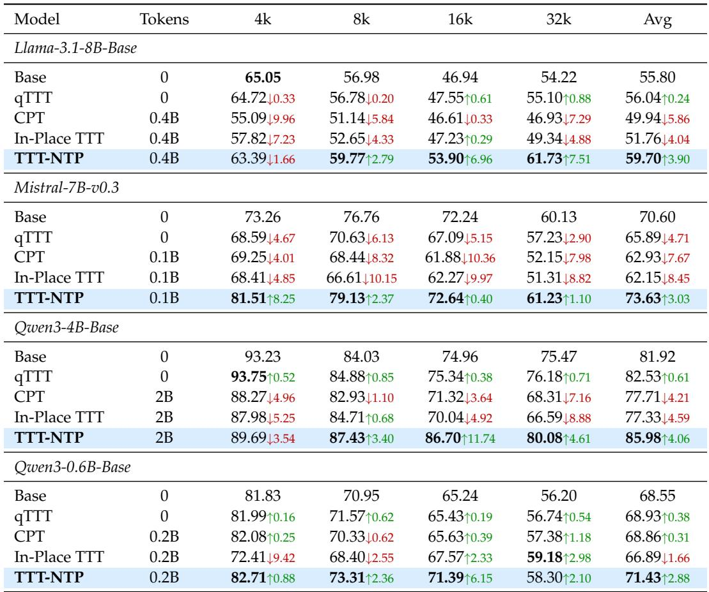
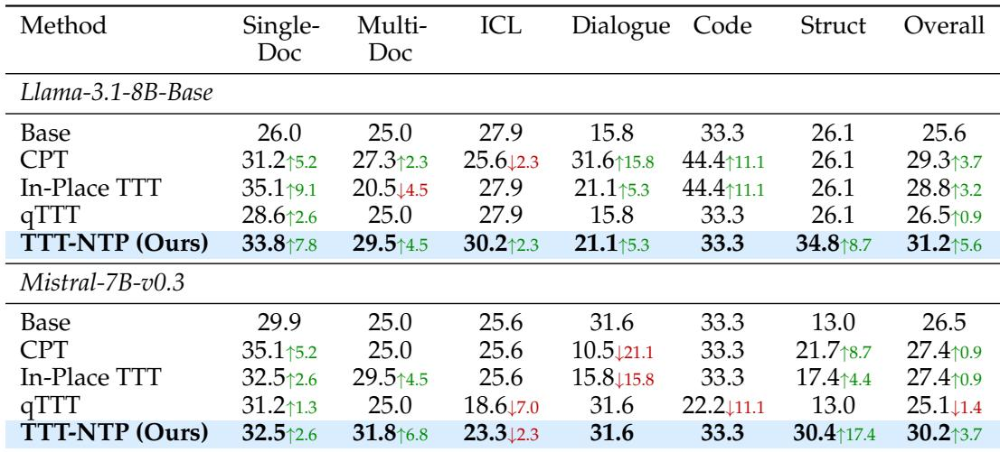
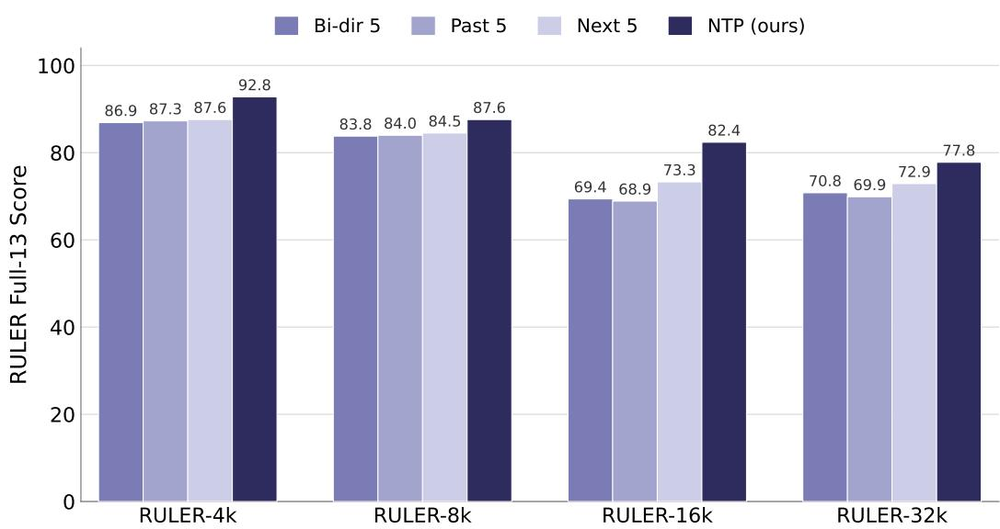
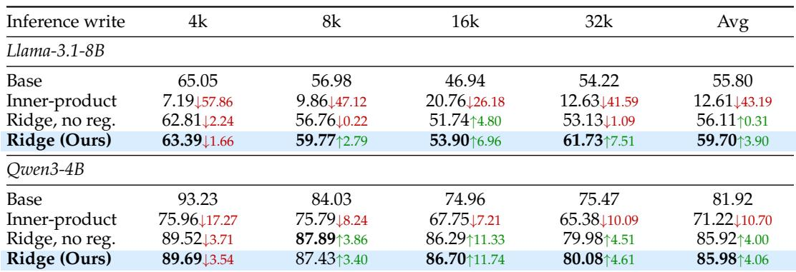
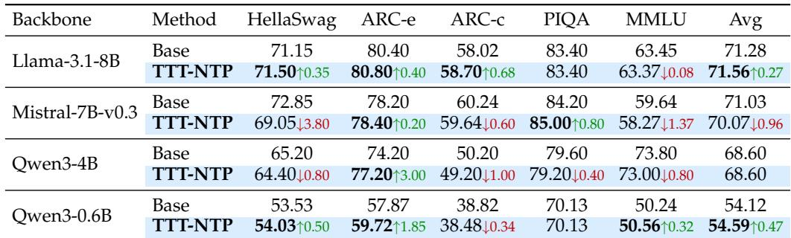

[← 返回 README](../README.md)

# 4. Experiments（实验）

## 📌 预览

实验从三个角度组织证据链：
1. **§4.3 长上下文检索（RULER）**：next-position 信号最该起作用的地方——主结果 Table 1。
2. **§4.4 真实长文档 QA（LongBench-v2）**：gains 能否迁移到自然文本——Table 2。
3. **§4.5 消融**：把 gain 归因到 (a) supervisory target（§4.5.1，Figure 2）和 (b) 推理 solver（§4.5.2，Table 3）。
4. **§4.6 通用能力**：确认长上下文提升不牺牲 commonsense/knowledge——Table 4。

所有方法在 matched data & compute 下对比 released backbone + 三个 adaptation baseline（qTTT / CPT / In-Place TTT）。

We evaluate Test-Time Training with Next-Token Prediction (TTT-NTP) from three angles. We first measure long-context retrieval, where the next-position signal should matter most, on the synthetic RULER suite, and then ask whether the same gains carry over to real-world long-document question answering on LongBench-v2. We next isolate what drives the gains through controlled ablations of the supervisory target and the inference-time write. Finally, we verify on standard commonsense and knowledge benchmarks that the long-context improvements do not come at a cost to the base model’s general capability. Throughout, every method is compared under matched data and compute against the released backbone and three adaptation baselines.

> 💡 **Section 概览**（Hao 批注）: 这段是实验的「证据地图」。注意「matched data and compute」是全篇最重要的实验控制——只有把数据、算力、placement、chunk size 都拉平，In-Place TTT 和 TTT-NTP 的差距才能干净归因到 target。读表时永远先问：这一行和 TTT-NTP 差的是哪个变量？

---

## 4.1 Experimental Setup

Backbones. We evaluate TTT-NTP across four open backbones from three model families spanning a 0.6–8B size range, so the results probe generality rather than a single model: Llama-3.1-8B-Base (Grattafiori et al., 2024), Mistral-7B-v0.3 (Jiang et al., 2023), Qwen3-4B-Base, and Qwen3-0.6B-Base (Yang et al., 2025a). All are full-attention decoders with SwiGLU MLPs; evaluating across families and sizes tests whether the next-position fast-weight signal is a general property of pretrained decoders.

> 💡 **机制拆解**（Hao 批注）: 选 backbone 的逻辑——4 个模型、3 个 family、0.6B–8B。共同点是「full-attention decoder + SwiGLU MLP」，因为 TTT-NTP 的 fast weight 就住在 SwiGLU 的 down-projection 里，且闭式解依赖全局 key 统计（full-attention）。这也解释了 Future Work 为什么要单独讨论 sliding-window/linear-attention 的扩展——那里 key 统计是局部的。

Continual pretraining (CPT). All trained variants share an identical recipe: continual pretraining on long-document text from the Long-Data-Collections corpus (Fu et al., 2024) at 32,768-token sequence length, with a per-backbone token budget of 0.4B (Llama-3.1-8B), 0.1B (Mistral-7B-v0.3), 2B (Qwen3-4B), and 0.2B (Qwen3-0.6B). The CPT baseline applies this recipe without fast-weight updates; In-Place TTT and TTT-NTP share the same data, optimizer, compute, fast-weight placement, chunk size, and inner-loop learning rate, so the only difference between them is the fast-weight target. Full hyperparameters appear in section A.

> 💡 **消融解读**（Hao 批注）: 这里再次锁死「唯一变量」的实验设计——In-Place TTT 和 TTT-NTP **共享 data / optimizer / compute / placement / chunk size / inner-loop lr**，唯一区别是 fast-weight target。所以 Table 1 里两者的差距 = target 的贡献。注意 token budget 差异很大（Qwen3-4B 用 2B，Mistral 只用 0.1B），这是各 backbone 分别调的，不是 compute-scaling 研究。

Evaluation. Long-context retrieval is measured by RULER (Hsieh et al., 2024) Full-13 (the official 13-task aggregate over needle-in-a-haystack (NIAH) retrieval variants, variable tracking (VT), frequent-word extraction (FWE), common-word extraction (CWE), and question-answering tasks), at context lengths 4k, 8k, 16k, and 32k. All rows use the same RULER evaluation harness; each adaptive method applies its specified inference-time update. We further assess real-world long-document QA on LongBench-v2 (Bai et al., 2025) (medium split: 215 multiple-choice questions over documents of 33k–128k words, across six task domains), evaluated under a common 32k-token context budget with head+tail truncation. For general capability we evaluate the trained backbone on HellaSwag (Zellers et al., 2019), ARC (Clark et al., 2018), PIQA (Bisk et al., 2020), and MMLU (Hendrycks et al., 2020), under the standard lm-evaluation-harness protocols.

> 💡 **机制拆解**（Hao 批注）: 三类评测各司其职——RULER（合成、检索导向、可控长度，验证机制假设）、LongBench-v2（真实长文档 QA，验证迁移）、HellaSwag/ARC/PIQA/MMLU（通用能力，验证无副作用）。RULER Full-13 是 13 个任务的官方聚合，覆盖 NIAH 检索、变量追踪、词频抽取、QA，所以是「长上下文利用能力」的综合体检。

---

## 4.2 Baselines

We compare against four points spanning learned-update and extra inference-time adaptation settings:

• Base: Qwen3-4B-Base used directly, without any continual pretraining or inferencetime adaptation, under the same RULER evaluation harness.

• query-side TTT (qTTT) (Bansal et al., 2025): an inference-only baseline that finetunes a low-rank adapter on the prompt with a few self-supervised steps before answering, applied on top of Base.

• CPT: continual pretraining with no fast-weight TTT, following the recipe of section 4.1. Our primary no-TTT baseline.

• In-Place TTT (Feng et al., 2026): continual pretraining with the published fastweight TTT recipe, whose inner-loop target is a small learned convolution over a local window of hidden states around each position, matched to our method in budget, optimizer, fast-weight placement, chunk size.

Our method is TTT-NTP, which combines the chunk-parallel fast-weight update of sections 3.2 and 3.3 with the closed-form inference-time write of section 3.4. Table 1 reports its long-context retrieval scores.

> 💡 **消融解读**（Hao 批注）: 四个 baseline 分别隔离一个变量：
> - **Base**：什么都不做，参照系。
> - **qTTT**：只在推理时用 low-rank adapter fine-tune prompt（inference-only，无 CPT）——代表「不改 backbone 只做 test-time 梯度」的路线。
> - **CPT**：只做 continual pretraining，无 fast-weight——隔离「多训练数据」的贡献。
> - **In-Place TTT**：有 fast-weight，但 target 是邻域卷积 proxy——**这是最关键的对照**，和 TTT-NTP 只差 target 一个变量。
> 逐个对比就能回答：提升来自数据？来自 rank-one 机制？还是来自 next-position target？答案是最后者。

---

## 4.3 Long-Context Retrieval Results

We test whether next-position supervision yields long-context retrieval gains that hold across model families and scales, comparing TTT-NTP against the released backbone (Base), plain continual pretraining (CPT), the convolutional-target In-Place TTT, and inference-time qTTT on RULER Full-13 (table 1).

Consistent gains across backbones. TTT-NTP is the only adaptation that improves the released model on every backbone, whereas the alternatives are unreliable: continued pretraining and the convolutional In-Place target frequently degrade long-context retrieval, and inference-time qTTT barely moves it. Since In-Place TTT is trained on the same data and compute and differs only in its supervisory target, the gap between the two attributes the improvement to next-position supervision itself rather than to additional tokens or the rank-one write.

Largest where retrieval is hardest. On every backbone the improvement grows with context length and peaks at 16k–32k (up to +11.7 at 16k), the only consistent cost being a small dip at 4k that trades short-range for long-range capacity. This is precisely the regime the next-position target is meant to strengthen, and where the largest margins over Base and over every baseline appear.

Robust to backbone strength and scale. On a weak long-context base, where naive adaptation instead backfires, TTT-NTP adds nearly four points; on the strongest bases—where CPT, In-Place TTT, and qTTT each shed several points—it is the only method that still improves, saturating after a fraction of the token budget. The same ranking holds from 8B down to 0.6B, so the benefit depends on neither the backbone family nor its capacity, consistent with next-position supervision being a general property of pretrained decoders.

*Table 1: RULER Full-13 accuracy across four backbones (Llama-3.1-8B-Base, Mistral-7B-v0.3, Qwen3-4B-Base, and Qwen3-0.6B-Base; blocks ordered by model size). Subscript arrows give the absolute percentage-point change relative to Base for each backbone (↑ improvement, ↓ decline); the best result in each column is in bold. The Tokens column gives the continual-pretraining budget. All rows use the same RULER evaluation harness; In-Place TTT and TTT-NTP share the same fast-weight placement, chunk size, and inner-loop learning rate.*

> 💡 **Table 1 批读**（Hao 批注）: 这是全文的主结果表，三个 claim 都能在表里读到证据。
> - **「唯一全 backbone 提升」**：TTT-NTP 的 Avg 列全为正（+3.90 / +3.03 / +4.06 / +2.88），而 CPT 和 In-Place TTT 在 Llama/Mistral/Qwen3-4B 上都是负的（CPT -5.86/-7.67/-4.21，In-Place -4.04/-8.45/-4.59），qTTT 几乎不动（±0.6 以内）。这直接支撑「其他方法 unreliable」。
> - **「长度越长增益越大」**：看 Qwen3-4B 的 16k 列——+11.74，是全表最大增益。而所有方法在 4k 都有小幅 dip（TTT-NTP Llama 4k -1.66），印证「拿短程换长程」。
> - **「In-Place TTT 差距归因 target」**：Mistral 上 In-Place TTT -8.45 而 TTT-NTP +3.03，两者只差 target，11 个点的鸿沟全归 next-position 监督。
> - **「强 baseline 上其他方法退步」**：Mistral 是最强长上下文 base（Base avg 70.60），CPT/In-Place/qTTT 全掉分（naive adaptation backfire），只有 TTT-NTP 还能 +3.03。

---

## 4.4 Real-World Long-Document QA

RULER is synthetic. To test whether the same inference-time write transfers to naturally occurring long documents, we additionally evaluate on LongBench-v2 (Bai et al., 2025), a multiple-choice long-document QA benchmark spanning six task domains. We report its medium-length split (33k–128k words; 215 questions) under a common 32k-token context budget—inputs longer than the budget are middle-truncated (head+tail)—so every backbone is compared at the same effective input length. Table 2 breaks accuracy down by domain.

Transfer to real long documents. On both backbones TTT-NTP attains the best overall accuracy and is the only method that improves over Base on both (+5.6 on Llama-3.1-8B, +3.7 on Mistral-7B-v0.3), ahead of CPT, In-Place TTT, and qTTT; the next-position write thus helps on naturally occurring long-document QA, not only on synthetic needle retrieval.

*Table 2: LongBench-v2 medium split, by task domain. Multiple-choice accuracy on the 215 medium questions (33k–128k words), evaluated under a common 32k-token context budget (head+tail truncation). Per-domain question counts: Single-Doc QA 77, Multi-Doc QA 44, In-context Learning (ICL) 43, Dialogue History 19, Code Repository 9, Structured Data 23. Subscripts give the per-domain change relative to Base for each backbone (↑ improvement, ↓ decline); TTT-NTP (Ours) values are in bold.*

> 💡 **Table 2 批读**（Hao 批注）: 这张表回答「合成 RULER 的增益是否迁移到真实长文档」。
> - **Overall**：Llama 25.6→31.2（+5.6）、Mistral 26.5→30.2（+3.7），都是 TTT-NTP 最高，且是唯一双 backbone 都超 Base 的方法（CPT/In-Place 在 Mistral 上只 +0.9，qTTT 甚至 -1.4）。
> - **增益来自检索导向的 domain**：Single-Doc / Multi-Doc QA + Structured Data 贡献主要增益——Mistral 的 Structured Data 从 13.0 飙到 30.4（+17.4），Llama 的 Struct +8.7。这和 RULER 的检索结论互相印证。
> - **小 split 别过度解读**：Code（9 题）、Dialogue（19 题）样本太少，波动大（如 Mistral CPT 的 Dialogue -21.1 是小样本噪声），作者明确提醒不要在这些上读出结论。

Retrieval-oriented domains drive the gain. Single- and multi-document QA and long structured-data understanding account for most of the improvement (e.g. Mistral rises from 13.0 to 30.4 on structured data), mirroring the RULER results, whereas the smallest splits—code (9 questions) and dialogue (19)—are too small to read much into.

---

## 4.5 Ablation Study

## 4.5.1 Choice of Supervision Target

TTT-NTP supervises the inner-loop write with the next position’s same-layer contextual hidden state $h_{\ell,t+1}.$ . To isolate the contribution of this specific choice—and not the rank-one mechanism, the placement, or the chunk-parallel schedule—we ablate the target while holding the training data, token budget, optimizer, fast-weight placement, chunk size, inner-loop learning rate, and update mechanism fixed at the values of section 4.1, varying only how the layer-local target is constructed:

• Past-5: target aggregated from the five preceding positions $\{h_{\ell,t-1}, \ldots, h_{\ell,t-5}\}$ via a learned causal convolution.

• Next-5: target aggregated from the five following positions $\{h_{\ell,t+1}, \ldots, h_{\ell,t+5}\}$ via a learned forward convolution.

• Bi-dir-5: target aggregated from the symmetric 11-position window $\{h_{\ell,t-5}, \dots, h_{\ell,t+5}\}$ via a learned bidirectional convolution. This is a symmetric convolutional value-proxy baseline inspired by local-target TTT recipes (Feng et al., 2026).

• TTT-NTP (Ours): target is the single next position’s hidden state $h_{\ell,t+1}$ , with no convolution; the signal enters the rank-one write through the learned linear projection $W_{\ell}^{\mathrm{proj}}$ (eq. (6))

Figure 2 shows that the single next-position target outperforms every convolutional aggregation at all four evaluated lengths. The gap is already at least five points at 4k (86.9–87.6 vs. 92.8), grows to roughly nine points at 16k (68.9–73.3 vs. 82.4), and remains five to eight points at 32k (69.9–72.9 vs. 77.8). The three convolutional aggregations cluster together at every length: smoothing the target through a learned convolution, in any direction, hurts long-context retrieval relative to writing the next contextual state directly. This ablation pins the gain of table 1 to the supervisory target rather than the rank-one mechanism or the local context window.

*Figure 2: Target ablation on RULER Full-13 (Qwen3-4B-Base). All four variants share the same training data, token budget, fast-weight placement, chunk size, inner-loop learning rate, and rank-one update mechanism; only the layer-local target differs. Past-5 and Next-5 aggregate five preceding or following positions through a learned unidirectional convolution; Bi-dir-5 aggregates a symmetric 11-position window through a bidirectional convolution. TTT-NTP (ours) writes the single next position $h_{\ell,t+1}$*

> 💡 **Figure 2 批读**（Hao 批注）: 这是全文最硬的因果归因实验，直接回答「是 target 还是机制在起作用」。
> - **控制变量**：四个变体共享 data/budget/placement/chunk/lr/rank-one 机制，**只差 target 怎么构造**。Past-5/Next-5/Bi-dir-5 都是「邻域 hidden states 过 learned convolution」（模仿 In-Place TTT 的 local proxy），TTT-NTP 是「单个 $h_{\ell,t+1}$ 无卷积，只过 $W_{\ell}^{\text{proj}}$」。
> - **结论**：TTT-NTP 在**每个长度**都碾压三种卷积——4k 至少 +5（92.8 vs 86.9–87.6）、16k 约 +9（82.4 vs 68.9–73.3）、32k +5~8（77.8 vs 69.9–72.9）。
> - **关键洞察**：三种卷积（无论 past/next/双向）挤成一团，说明「用卷积平滑 target 本身就伤长上下文检索」。哪怕 Next-5 也包含了 $h_{\ell,t+1}$，但一旦和邻域平均，信号就被稀释了。这证明「单点 next-position state」的纯粹性才是关键，不是「用了未来信息」这么简单。

## 4.5.2 Closed-Form Inference Write: Solver and Regularization

The inference-time write of eq. (17) is the ridge least-squares solution for the prompt-specific perturbation: over the fit window it minimizes $\lVert Y_{\ell} - (W_{\ell}^{\mathrm{down}} + \Delta W) X_{\ell} \rVert_{F}^{2} + \lambda \lVert \Delta W \rVert_{F}^{2},$ where $X_{\ell}$ stacks the cached keys and $Y_{\ell}$ the next-position targets. To isolate the role of the solver—not the trained target, placement, or perturbation scale $\eta,$ all held fixed—we compare three ways of mapping the residual $R_{\ell} = Y_{\ell} - W_{\ell}^{\mathrm{down}} X_{\ell}$ to a write.

Writing this closed form in terms of the residual makes the solver explicit:

$$
\Delta W_{\ell}^{\mathrm{CF}} = \underbrace{R_{\ell} X_{\ell}^{\top}}_{\text{residual-key correlation}} \underbrace{\left(X_{\ell} X_{\ell}^{\top} + \lambda I\right)^{-1}}_{\text{key whitening}} .
$$

The numerator $R_{\ell} X_{\ell}^{\top}$ is a Hebbian, correlational write—the same outer-product form as the inner-product (linear) training loss in eq. (2)—and the Gram inverse whitens it by the key second moment. The two ablations each switch off one of these factors: Inner-product keeps only the un-whitened correlation $R_{\ell} X_{\ell}^{\top}$ , and no regularization keeps the inverse but sets $\lambda \to 0$ . The inner-product write is exactly the per-token training-time update of eq. (2) applied once over the whole prompt; testing it at inference therefore asks whether the training loss can be reused for the one-shot write. Table 3 reports all three against each backbone’s released Base.

Whitening is decisive. Dropping the Gram inverse collapses retrieval at every length, with the average falling to 71.22 on Qwen3-4B and 12.61 on Llama-3.1-8B—far below Base.

*Table 3: Closed-form inference-write ablation (RULER Full-13, per length). Varying only the solver for the prompt write ∆W; subscripts are the change vs. Base (↑/↓), best write rule per column in bold. The Hebbian inner-product write (no Gram whitening) collapses, and dropping the ridge regularizer also hurts; only the full regularized solve (Ours) improves over Base.*

> 💡 **公式批读 (Eq. 18) + Table 3 批读**（Hao 批注）: 这个消融回答「推理 write 里哪个因子是决定性的」。
> - **Eq. 18** 把闭式解拆成两个因子：$R_{\ell}X_{\ell}^\top$（residual-key correlation，Hebbian 外积，和训练 loss 同形）× $(X_{\ell}X_{\ell}^\top+\lambda I)^{-1}$（key whitening，用 key 二阶矩白化）。
> - **三种 solver**：Inner-product（只留 Hebbian 外积，去掉 whitening）、Ridge no-reg（保 whitening 但 $\lambda\to0$）、Ridge Ours（完整）。
> - **Whitening 是决定性的**：去掉 Gram 逆，Llama avg 崩到 **12.61**（远低于 Base 55.80），Qwen3-4B 崩到 71.22。原因：没有白化，Hebbian write 会沿「最高方差/最频繁 key」方向被放大，少数方向主导整个 patched down-projection，输出退化。
> - **为什么训练能用 Hebbian、推理不能**：训练时是 dense、小步、co-adapted 的 chunk-parallel write，稳；同样的 un-whitened 形式一旦当作单次 one-shot prompt write 就崩。**这正是推理为什么要解完整最小二乘而不是复用训练 loss 的原因**——和 §3.4 的设计取舍闭环。
> - **正则也重要**：$\lambda\to0$ 虽然接近完整解，但只有完整 ridge（Ours）才在所有长度上稳定 ≥ Base。

The factor $(X_{\ell} X_{\ell}^{\top} + \lambda I)^{-1}$ rescales the write to equalize the key directions; without it the Hebbian write is amplified along the highest-variance (most frequent or repeated) keys rather than solving for the target, so a few directions dominate the patched down-projection and the outputs degenerate. This is the same Hebbian form TTT-NTP trains with: dense, small per-position writes are stable during co-adapted chunk-parallel training, but the identical un-whitened form fails as a single one-shot prompt write—which is exactly why inference solves the full squared-error objective rather than reusing the training loss.

Regularization matters. Keeping the whitening while setting λ → 0 stays close to the full solve and well above the inner-product write, yet only the complete regularized ridge (Ours) is consistently at or above Base across lengths. Both the whitening and a non-zero λ are therefore needed for a stable one-shot prompt write.

---

## 4.6 General Capability Evaluation

Table 4 evaluates each TTT-NTP-trained backbone on standard commonsense and knowledge benchmarks, to check whether the long-context retrieval gains of table 1 come at a cost to general capability.

*Table 4: General-capability evaluation comparing each released backbone (Base) to its TTT-NTP-trained backbone on standard commonsense and knowledge benchmarks (lm-evaluation-harness). Subscript arrows give the per-benchmark change of TTT-NTP relative to Base (↑ improvement, ↓ decline); TTT-NTP values that beat Base are in bold. Aggregate scores are essentially unchanged across all four backbones.*

> 💡 **Table 4 批读**（Hao 批注）: 这张表是「无副作用」的证据——回答「长上下文提升是否偷了通用能力」。
> - **聚合几乎不变**：四个 backbone 的 HellaSwag/ARC/PIQA/MMLU 聚合最多变 ~1 点；三个是平或略升（Qwen3-0.6B +0.47、Llama +0.27、Qwen3-4B 不变）。
> - **唯一回退是 Mistral（-0.96）**：HellaSwag 掉分（-3.80）盖过 ARC-e/PIQA 的涨。作者解释：Mistral 恰是最强长上下文 base，inference-time write 被推得最狠——和 Table 1 里「Mistral 上其他 baseline 全崩」是同一现象的两面。即便如此也在 1 点以内。
> - **意义**：fast-weight write 重塑的是「长上下文通路」，没扰动 knowledge/commonsense 行为。这支撑了「TTT-NTP 是 drop-in、低风险」的定位。

Long-context gains do not cost general capability. Across all four backbones the aggregate over HellaSwag, ARC, PIQA, and MMLU shifts by at most about one point after TTT-NTP, and on three of the four it is flat or slightly higher (Qwen3-0.6B +0.47, Llama-3.1-8B +0.27, Qwen3-4B unchanged). Per-task movements are similarly small—the largest is a few points on ARC-e—so the fast-weight write reshapes the long-context pathway without disturbing the model’s knowledge and commonsense behaviour.

The only notable regression is on Mistral. Its aggregate slips by 0.96, as a HellaSwag drop outweighs gains on ARC-e and PIQA; this is the same backbone whose released checkpoint is already the strongest long-context model, where the inference-time write is pushed hardest. Even here the change is within roughly one point, so the long-context improvements of table 1 come at no measurable general-capability cost across backbones.

---

## 🔖 Section 总结

### 关键数字速查

| 证据 | 数值 |
|------|------|
| RULER 最大单点增益 | +11.74（Qwen3-4B, 16k） |
| RULER Avg 增益范围 | +2.88 ~ +4.06（四 backbone 全正） |
| CPT / In-Place 在 Mistral 上 | -7.67 / -8.45（退步） |
| LongBench-v2 Overall 增益 | Llama +5.6，Mistral +3.7 |
| Target 消融差距 | 每个长度至少 +5，16k 约 +9 |
| 去 whitening 后 Llama avg | 12.61（vs Base 55.80，崩溃） |
| 通用能力聚合变化 | 最多约 1 点（Mistral -0.96 是唯一回退） |

### 核心洞察

1. **主结果**：TTT-NTP 是唯一在四个 backbone 上都提升 RULER 的方法；增益随长度增长、16k–32k 最大；4k 有小幅拿短换长的 dip。
2. **迁移**：合成检索增益迁移到真实长文档 QA，主要来自检索导向 domain（Single/Multi-Doc、Structured Data）。
3. **target 归因**：Figure 2 证明是 next-position target 本身在起作用，卷积平滑（任何方向）都伤长上下文——排除了「rank-one 机制」和「局部窗口」的解释。
4. **solver 归因**：Table 3 证明 key whitening 是决定性因子，Hebbian one-shot write 会崩——这就是训练/推理必须用不同目标的实证。
5. **无副作用**：通用能力聚合几乎不变。

### 可追问点

- 为什么 Next-5（含 $h_{\ell,t+1}$）也输给纯 next-position？→ 卷积平滑稀释了单点信号，说明「纯粹的单点 predictive state」才是关键。
- Mistral 的 HellaSwag 回退能否通过调 $\eta$ 或 $\lambda$ 缓解？→ 论文未做，属可追问的鲁棒性问题。
